# 20C114793 PDF 内容识别与裁切提取

整页渲染图：`outputs/20C114793_assets/images/page_1.png`，尺寸 `4959 x 3505` px。

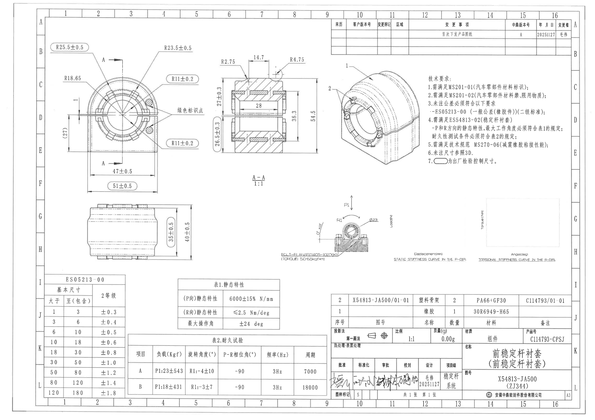

说明：以下按原图版面从上到下、从左到右列出裁切对象；表格对象先还原原表行列，再列提取项和归属说明。括号尺寸、圆角长框控制尺寸、直径符号、角度、P/R方向、表格字段均逐项记录。未观察到星号关键尺寸或 T 编号。

## object_8：修订履历表

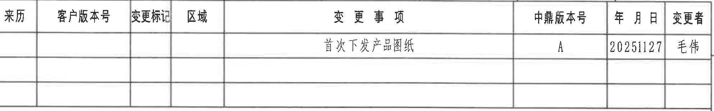

- 原图位置/视图名称：第1页上部右侧，图框坐标约 A9-A16/B9-B16 区域。
- object_kind：`table`
- bbox：`[2784, 158, 4769, 468]`

### 原表还原：修订履历表

| 来历 | 客户版本号 | 变更标记 | 区域 | 变更事项 | 中鼎版本号 | 年 月 日 | 变更者 |
| --- | --- | --- | --- | --- | --- | --- | --- |
|  |  |  |  | 首次下发产品图纸 | A | 20251127 | 毛伟 |
|  |  |  |  |  |  |  |  |
|  |  |  |  |  |  |  |  |

表格说明：原表第一行记录首次下发；其余两行为空白修订预留行。

### 提取表

| 提取项 | 原图数值或文本 | 含义说明 |
| --- | --- | --- |
| 表头 | 来历 / 客户版本号 / 变更标记 / 区域 / 变更事项 / 中鼎版本号 / 年 月 日 / 变更者 | 修订履历字段。 |
| 修订记录 | 首次下发产品图纸；中鼎版本号 A；年月日 20251127；变更者 毛伟 | 表示 2025-11-27 首次下发产品图纸，版本为 A。 |
| 空白行 | 2 行空白 | 为后续变更记录预留。 |

边界归属说明：裁切到修订履历表外框；已去除上方图框坐标数字和右侧坐标字母，表格边框、表头与首条记录完整。

## object_1：端面加工主视图（含 A-A 剖切位置）

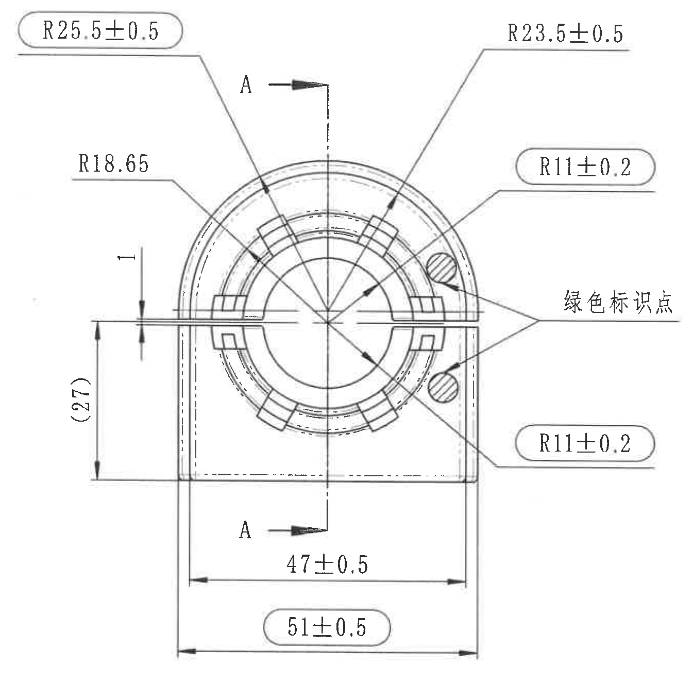

- 原图位置/视图名称：第1页左上部，图框坐标约 B1-F5 区域。
- object_kind：`view`
- bbox：`[385, 335, 1730, 1660]`

### 提取表

| 提取项 | 原图数值或文本 | 含义说明 |
| --- | --- | --- |
| 半径尺寸 | R25.5±0.5 | 左上外圆弧半径；圆角长框表示出厂检验控制尺寸。 |
| 半径尺寸 | R23.5±0.5 | 右上外圆弧半径。 |
| 半径尺寸 | R18.65 | 左侧引出到内侧圆弧/同心圆特征的半径，未标注单独公差，按未注公差要求。 |
| 局部间隙尺寸 | 1 | 左侧横向分型/槽口附近的竖向间距尺寸。 |
| 参考尺寸 | (27) | 左侧竖向括号尺寸，括号表示参考尺寸；用于说明端面外形高度关系，不作为直接检验控制尺寸。 |
| 半径尺寸 | R11±0.2 | 右上引出到内侧圆弧/标识点附近特征；圆角长框表示出厂检验控制尺寸。 |
| 半径尺寸 | R11±0.2 | 右下引出到内侧圆弧/标识点附近特征；圆角长框表示出厂检验控制尺寸。 |
| 水平尺寸 | 47±0.5 | 下方内侧基准/实体宽度尺寸。 |
| 水平总宽 | 51±0.5 | 底部整体宽度；圆角长框表示出厂检验控制尺寸。 |
| 剖切标识 | A / A | 上下箭头和中心剖切线定义 A-A 剖面位置；剖面内容归 object_2。 |
| 文字标注 | 绿色标识点 | 右侧两个引线指向绿色标识点位置。 |

边界归属说明：右边界重裁后去除 A-A 剖视图残线；保留本主视图所有尺寸线、箭头、剖切箭头、绿色标识点引线和文字。剖面尺寸不归入本对象。

## object_2：A-A 剖面视图

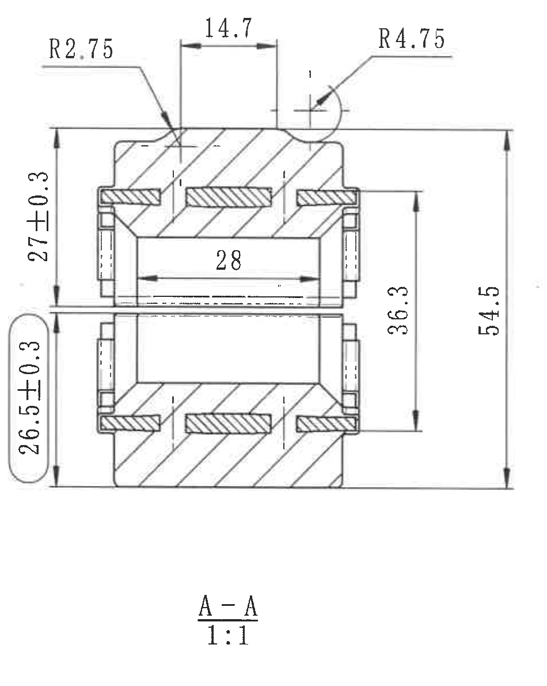

- 原图位置/视图名称：第1页上部中间，端面主视图右侧，标注 A-A 1:1。
- object_kind：`section`
- bbox：`[1760, 430, 2710, 1620]`

### 提取表

| 提取项 | 原图数值或文本 | 含义说明 |
| --- | --- | --- |
| 剖面名称/比例 | A-A / 1:1 | 由 object_1 的 A-A 剖切线产生，比例为 1:1。 |
| 半径尺寸 | R2.75 | 剖面顶部左侧小圆角半径。 |
| 水平尺寸 | 14.7 | 剖面顶部两个竖向界线之间的横向距离。 |
| 半径尺寸 | R4.75 | 剖面顶部右侧局部圆角半径。 |
| 局部尺寸 | 1 | R4.75 附近局部台阶/边缘小尺寸，扫描线较淡但读数为 1。 |
| 竖向尺寸 | 27±0.3 | 左侧上半部竖向尺寸。 |
| 竖向控制尺寸 | 26.5±0.3 | 左侧下半部竖向尺寸；圆角长框表示出厂检验控制尺寸。 |
| 水平内部尺寸 | 28 | 剖面内孔/中间开口水平宽度。 |
| 竖向尺寸 | 36.3 | 右侧内部上下特征之间的竖向距离。 |
| 竖向总高 | 54.5 | 剖面整体竖向总高度。 |

边界归属说明：左边界重裁后保留 26.5±0.3 圆角框和 27±0.3 尺寸线；右边界去除相邻 3D 视图编号残片。中心长横线为剖面自身尺寸/构造线，不归入端面主视图。

## object_3：三维轴测示意图

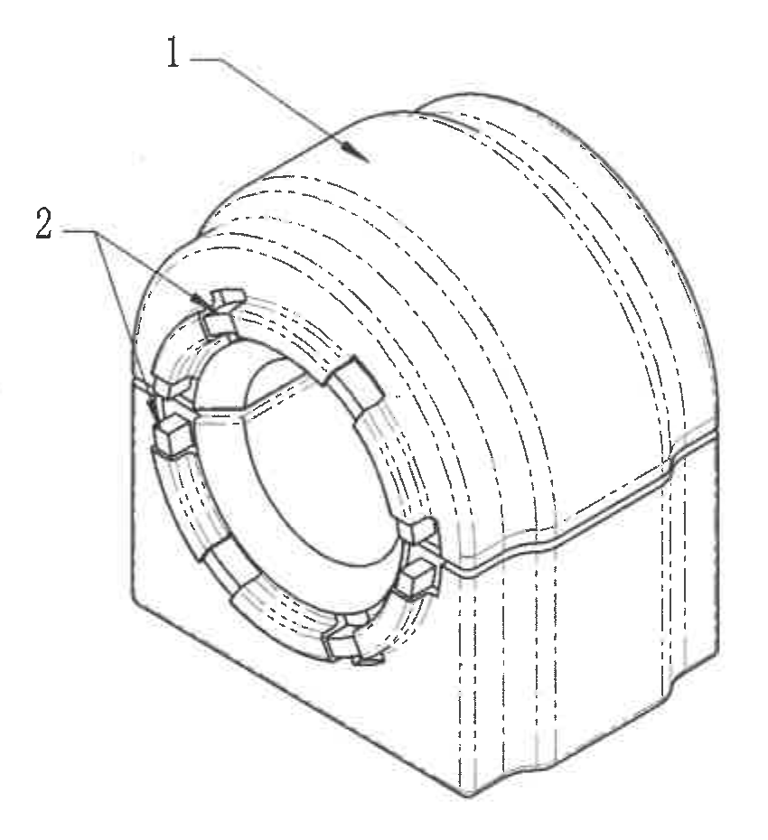

- 原图位置/视图名称：第1页上部偏右，A-A 剖面右侧、技术要求左侧。
- object_kind：`view`
- bbox：`[2700, 490, 3550, 1420]`

### 提取表

| 提取项 | 原图数值或文本 | 含义说明 |
| --- | --- | --- |
| 零件序号标注 | 1 | 引线指向主体橡胶/外覆结构，和 BOM 中序号 1 对应。 |
| 零件序号标注 | 2 | 两个引线指向端面局部骨架/嵌件结构，和 BOM 中序号 2 对应。 |
| 尺寸状态 | 无直接尺寸数值 | 该图为三维外观/装配关系示意，未给出尺寸、公差或参考尺寸。 |

边界归属说明：裁切只包含三维轴测图和序号 1、2 引线；未带入右侧技术要求或左侧 A-A 剖面尺寸。

## object_7：技术要求 NOTES

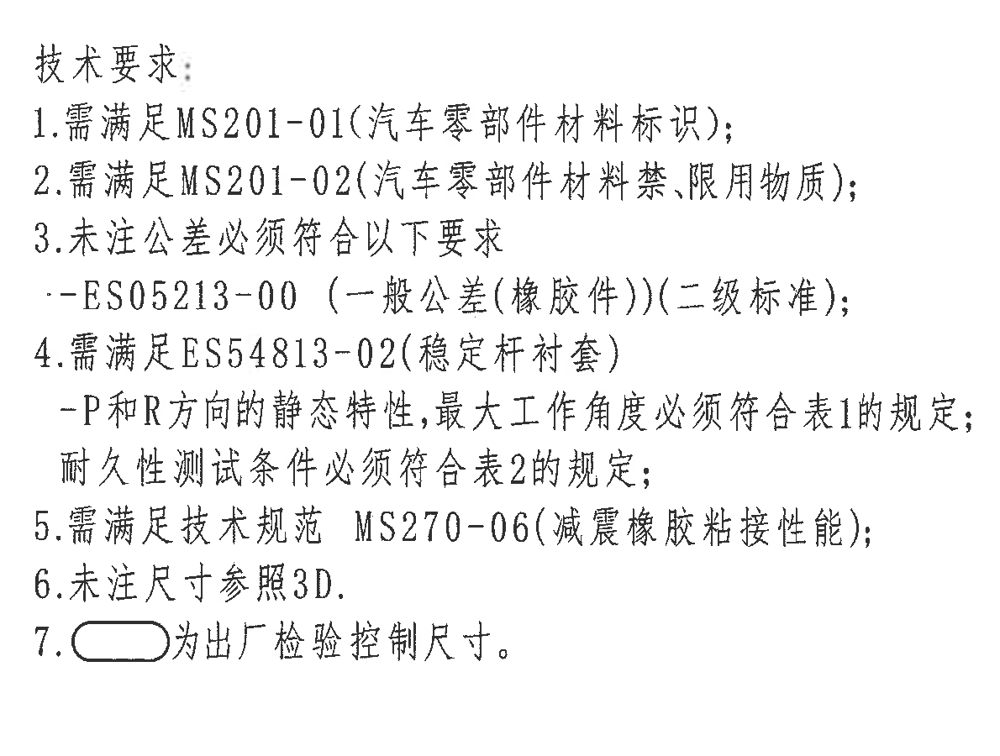

- 原图位置/视图名称：第1页右上部，三维轴测示意图右侧。
- object_kind：`notes`
- bbox：`[3530, 580, 4720, 1480]`

### 提取表

| 提取项 | 原图数值或文本 | 含义说明 |
| --- | --- | --- |
| 标题 | 技术要求: | 技术要求/Notes 区域标题。 |
| 1 | 需满足MS201-01(汽车零部件材料标识); | 材料标识要求。 |
| 2 | 需满足MS201-02(汽车零部件材料禁、限用物质); | 禁限用物质要求。 |
| 3 | 未注公差必须符合以下要求 --ES05213-00（一般公差(橡胶件)）(二级标准); | 未注公差采用 ES05213-00 二级标准；对应 object_9 表。 |
| 4 | 需满足ES54813-02(稳定杆衬套) -P和R方向的静态特性,最大工作角度必须符合表1的规定; 耐久性测试条件必须符合表2的规定; | 性能要求对应 object_10 表1和 object_11 表2。 |
| 5 | 需满足技术规范 MS270-06(减震橡胶粘接性能); | 粘接性能规范要求。 |
| 6 | 未注尺寸参照3D. | 未标注尺寸以3D数据为准。 |
| 7 | 圆角长框为出厂检验控制尺寸。 | 解释图中圆角长框尺寸的检验属性。 |

边界归属说明：右边界重裁后去除图框坐标栏；保留第4条全部文字和第7条圆角长框符号。

## object_4：轴向侧视加工视图

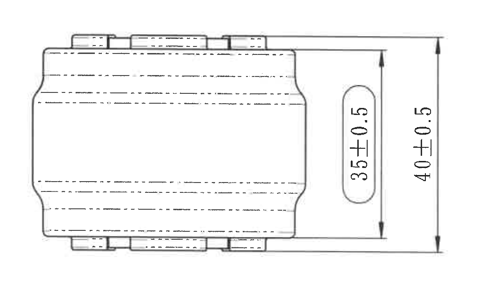

- 原图位置/视图名称：第1页左中部，端面主视图下方。
- object_kind：`view`
- bbox：`[660, 1630, 1710, 2280]`

### 提取表

| 提取项 | 原图数值或文本 | 含义说明 |
| --- | --- | --- |
| 竖向控制尺寸 | 35±0.5 | 右侧内层竖向高度；圆角长框表示出厂检验控制尺寸。 |
| 竖向总高度 | 40±0.5 | 最右侧外层竖向总高度。 |
| 隐藏线/中心线 | 多条虚线 | 表示内部孔/沟槽或嵌件在轴向侧视中的投影。 |

边界归属说明：裁切包含侧视外轮廓、上下凸台、虚线和两个完整竖向尺寸；未带入上方端面视图或下方表格。

## object_5：P向静刚度曲线与测试示意

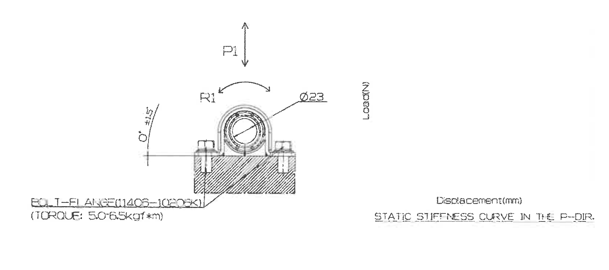

- 原图位置/视图名称：第1页中部偏右，侧视图右侧、扭转刚度曲线左侧。
- object_kind：`detail`
- bbox：`[2260, 1570, 3925, 2310]`

### 提取表

| 提取项 | 原图数值或文本 | 含义说明 |
| --- | --- | --- |
| 加载方向 | P1 | 竖向双向箭头，表示 P 向加载方向。 |
| 旋转方向 | R1 | 弧形箭头，表示 R 向旋转/角度方向。 |
| 直径尺寸 | Ø23 | 引线指向圆孔直径，直径值为 23。 |
| 角度尺寸 | 0°±15' | 左侧基准角度/安装角度允许偏差。 |
| 治具/螺栓说明 | BOLT-FLANGE(1406-1020K) | 静刚度测试安装/螺栓法兰说明。 |
| 扭矩说明 | (TORQUE: 50~65kgf*m) | 测试紧固扭矩范围。 |
| 坐标轴 | Load(N) | 静刚度曲线纵轴载荷单位。 |
| 坐标轴 | Displacement(mm) | 静刚度曲线横轴位移单位。 |
| 曲线标题 | STATIC STIFFNESS CURVE IN THE P-DIR. | P方向静刚度曲线标题。 |

边界归属说明：下边界重裁后去除下方表格线；右边界去除扭转刚度区文字片段。该对象只提取 P向静刚度测试示意和曲线标题。

## object_6：R向扭转刚度曲线占位

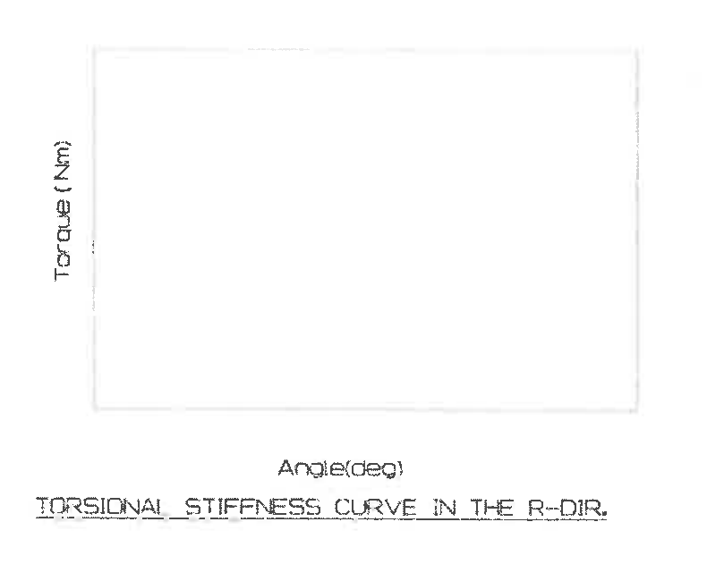

- 原图位置/视图名称：第1页中部右侧，P向静刚度曲线右侧。
- object_kind：`detail`
- bbox：`[3950, 1600, 4740, 2250]`

### 提取表

| 提取项 | 原图数值或文本 | 含义说明 |
| --- | --- | --- |
| 坐标轴 | Torque(Nm) | 扭转刚度曲线纵轴扭矩单位。 |
| 坐标轴 | Angle(deg) | 扭转刚度曲线横轴角度单位。 |
| 曲线标题 | TORSIONAL STIFFNESS CURVE IN THE R-DIR. | R方向扭转刚度曲线标题。 |
| 曲线框 | 空白矩形框 | 原图未绘制具体曲线数据，仅给出曲线区域和轴标题。 |

边界归属说明：裁切包含完整空白曲线框、Torque/Angle轴标签和标题；未带入P向静刚度区域文字。

## object_9：ES05213-00 基本尺寸公差表

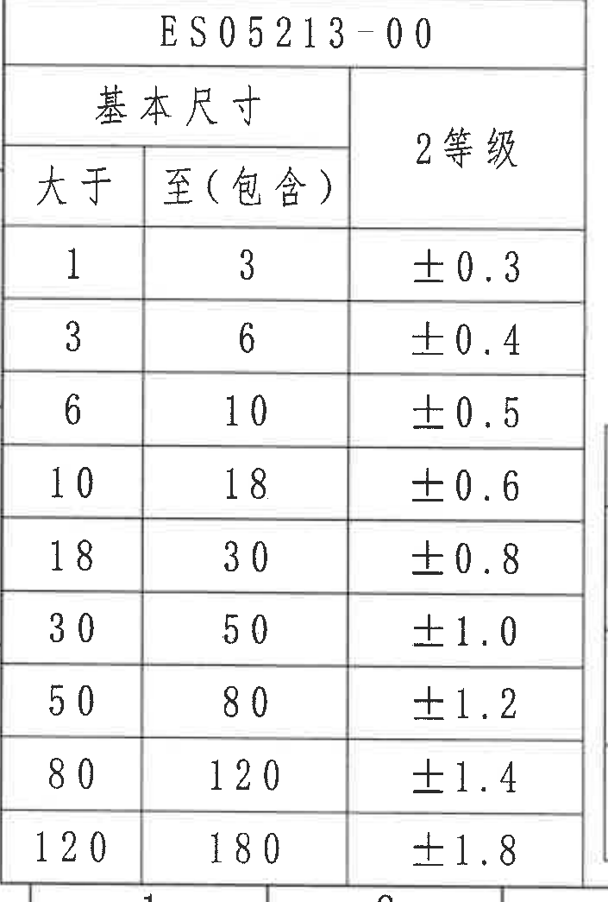

- 原图位置/视图名称：第1页左下部，图框坐标约 I1-L3 区域。
- object_kind：`table`
- bbox：`[365, 2295, 1070, 3340]`

### 原表还原：ES05213-00 / 基本尺寸 / 2等级

| 大于 | 至（包含） | 2等级 |
| --- | --- | --- |
| 1 | 3 | ±0.3 |
| 3 | 6 | ±0.4 |
| 6 | 10 | ±0.5 |
| 10 | 18 | ±0.6 |
| 18 | 30 | ±0.8 |
| 30 | 50 | ±1.0 |
| 50 | 80 | ±1.2 |
| 80 | 120 | ±1.4 |
| 120 | 180 | ±1.8 |

表格说明：该表为技术要求第3条引用的未注公差表。

### 提取表

| 提取项 | 原图数值或文本 | 含义说明 |
| --- | --- | --- |
| 标准号 | ES05213-00 | 一般公差(橡胶件)二级标准引用表。 |
| 表头 | 基本尺寸：大于 / 至（包含）；2等级 | 按基本尺寸范围给出未注公差。 |
| 范围 | 1 < 尺寸 ≤ 3：±0.3 | 未注公差。 |
| 范围 | 3 < 尺寸 ≤ 6：±0.4 | 未注公差。 |
| 范围 | 6 < 尺寸 ≤ 10：±0.5 | 未注公差。 |
| 范围 | 10 < 尺寸 ≤ 18：±0.6 | 未注公差。 |
| 范围 | 18 < 尺寸 ≤ 30：±0.8 | 未注公差。 |
| 范围 | 30 < 尺寸 ≤ 50：±1.0 | 未注公差。 |
| 范围 | 50 < 尺寸 ≤ 80：±1.2 | 未注公差。 |
| 范围 | 80 < 尺寸 ≤ 120：±1.4 | 未注公差。 |
| 范围 | 120 < 尺寸 ≤ 180：±1.8 | 未注公差。 |

边界归属说明：为保留最后一行 120-180 及表格底线，底部不可避免带入极少量图框坐标线；坐标数字不作为本表内容提取。右侧未提取相邻表格内容。

## object_10：表1.静态特性

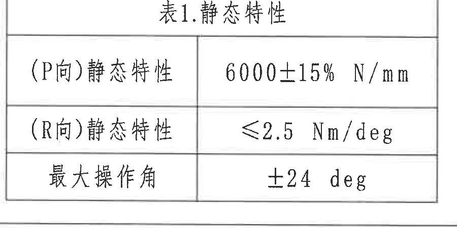

- 原图位置/视图名称：第1页下部中左，基本尺寸公差表右侧、表2上方。
- object_kind：`table`
- bbox：`[1470, 2350, 2370, 2800]`

### 原表还原：表1.静态特性

| 项目 | 规定值 |
| --- | --- |
| (P向)静态特性 | 6000±15% N/mm |
| (R向)静态特性 | ≤2.5 Nm/deg |
| 最大操作角 | ±24 deg |

表格说明：技术要求第4条引用。

### 提取表

| 提取项 | 原图数值或文本 | 含义说明 |
| --- | --- | --- |
| (P向)静态特性 | 6000±15% N/mm | P方向静刚度规定值。 |
| (R向)静态特性 | ≤2.5 Nm/deg | R方向静态扭转刚度上限。 |
| 最大操作角 | ±24 deg | 允许最大操作角。 |

边界归属说明：裁切完整包含表1标题、三行数据和外框；底部轻微相邻线不参与表1提取。

## object_11：表2.耐久试验

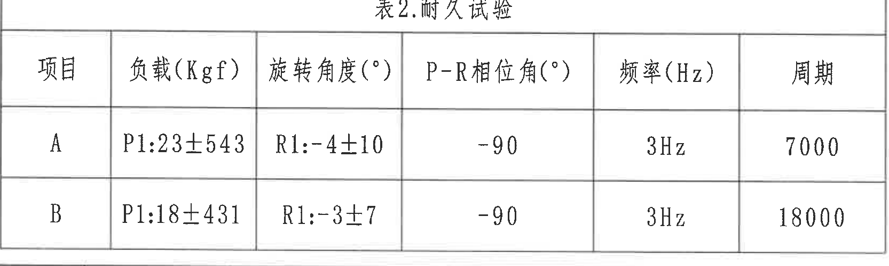

- 原图位置/视图名称：第1页下部中间，基本尺寸表右侧、标题栏左侧。
- object_kind：`table`
- bbox：`[1065, 2825, 2730, 3325]`

### 原表还原：表2.耐久试验

| 项目 | 负载(Kgf) | 旋转角度(°) | P-R相位角(°) | 频率(Hz) | 周期 |
| --- | --- | --- | --- | --- | --- |
| A | P1:23±543 | R1:-4±10 | -90 | 3Hz | 7000 |
| B | P1:18±431 | R1:-3±7 | -90 | 3Hz | 18000 |

表格说明：技术要求第4条引用的耐久性测试条件。

### 提取表

| 提取项 | 原图数值或文本 | 含义说明 |
| --- | --- | --- |
| 表头 | 项目 / 负载(Kgf) / 旋转角度(°) / P-R相位角(°) / 频率(Hz) / 周期 | 耐久试验条件字段。 |
| A项 | P1:23±543；R1:-4±10；P-R相位角 -90；3Hz；7000 | A项耐久试验条件。 |
| B项 | P1:18±431；R1:-3±7；P-R相位角 -90；3Hz；18000 | B项耐久试验条件。 |

边界归属说明：重裁后去除底部图框坐标和右侧标题栏签名线；表格标题、表头、A/B两行与周期列完整。

## object_12：物料明细表 BOM

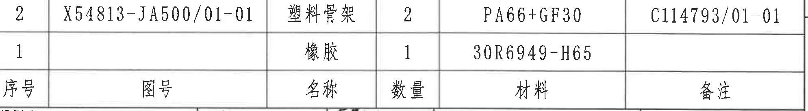

- 原图位置/视图名称：第1页右下部，标题栏上方。
- object_kind：`table`
- bbox：`[2785, 2470, 4773, 2745]`

### 原表还原：物料明细表（表头在原图底部）

| 序号 | 图号 | 名称 | 数量 | 材料 | 备注 |
| --- | --- | --- | --- | --- | --- |
| 2 | X54813-JA500/01-01 | 塑料骨架 | 2 | PA66+GF30 | C114793/01-01 |
| 1 |  | 橡胶 | 1 | 30R6949-H65 |  |

表格说明：原图表头位于两行物料下方。

### 提取表

| 提取项 | 原图数值或文本 | 含义说明 |
| --- | --- | --- |
| 表头 | 序号 / 图号 / 名称 / 数量 / 材料 / 备注 | BOM字段，原图表头在底部。 |
| 序号2 | 图号 X54813-JA500/01-01；名称 塑料骨架；数量 2；材料 PA66+GF30；备注 C114793/01-01 | 塑料骨架物料行。 |
| 序号1 | 图号 空白；名称 橡胶；数量 1；材料 30R6949-H65；备注 空白 | 橡胶物料行。 |

边界归属说明：裁切保留两行物料、底部表头及外框；由于BOM下边框与标题栏上边框相邻，底部可见少量标题栏顶线/字迹，不作为BOM字段提取。

## object_13：标题栏

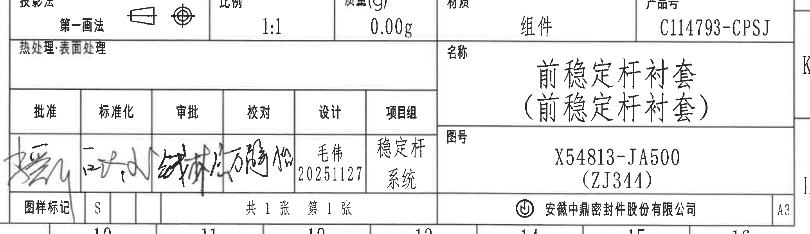

- 原图位置/视图名称：第1页右下角标题栏区域。
- object_kind：`title_block`
- bbox：`[2735, 2760, 4805, 3360]`

### 提取表

| 提取项 | 原图数值或文本 | 含义说明 |
| --- | --- | --- |
| 投影法 | 第一画法 | 图纸投影方法。 |
| 比例 | 1:1 | 图纸比例。 |
| 质量(g) | 0.00g | 标题栏质量字段。 |
| 材质 | 组件 | 总成/组件材质属性。 |
| 产品号 | C114793-CPSJ | 产品编号。 |
| 热处理·表面处理 | 空白 | 未填写热处理/表面处理。 |
| 名称 | 前稳定杆衬套（前稳定杆衬套） | 零件/组件名称。 |
| 图号 | X54813-JA500 (ZJ344) | 图纸编号及括号内补充编号。 |
| 批准 | 签名 | 签署栏，手写签名。 |
| 标准化 | 签名 | 签署栏，手写签名。 |
| 审批 | 签名 | 签署栏，手写签名。 |
| 校对 | 签名 | 签署栏，手写签名。 |
| 设计 | 毛伟 20251127 | 设计人员和日期。 |
| 项目组 | 稳定杆系统 | 项目组名称。 |
| 图样标记 | S | 图样标记字段。 |
| 页数 | 共1张 第1张 | 图纸总页数和当前页。 |
| 公司 | 安徽中鼎密封件股份有限公司 | 出图单位。 |
| 图幅 | A3 | 图纸幅面。 |

边界归属说明：裁切覆盖标题栏完整字段、签署区、公司名和A3幅面；右侧图框坐标K/L及底部坐标数字顶部因紧贴标题栏边框可见，不作为标题栏字段提取。BOM字段不归入标题栏。

## 裁切检查记录

| 裁切对象 | 检查结论 |
| --- | --- |
| object_8 | 修订履历表表头、首条记录、空白预留行完整；未包含图框坐标字段。 |
| object_1 | 端面主视图尺寸线、箭头、剖切箭头、绿色标识点文字完整；重裁去除右侧剖视图残片。 |
| object_2 | A-A剖面所有尺寸线和文字完整；重裁去除左侧主视图残线和右侧3D编号残片。 |
| object_3 | 三维轴测图和序号1/2引线完整；未带入技术要求或剖面尺寸。 |
| object_7 | 技术要求第1-7条完整；第4条右侧文字经扩边后未被裁断，右侧坐标栏已去除。 |
| object_4 | 侧视图轮廓、虚线、35±0.5和40±0.5尺寸完整；未带入表格。 |
| object_5 | P向静刚度测试示意、Ø23、0°±15'、P1/R1和英文标题完整；重裁去除扭转曲线文字及下方表格线。 |
| object_6 | R向扭转刚度曲线框、Torque/Angle轴标签和标题完整。 |
| object_9 | 基本尺寸公差表全部行列完整；为保留最后一行底线，底部有极少图框坐标线，不提取为表格内容。 |
| object_10 | 表1标题、三行数据和外框完整；底部轻微相邻线不作为表1内容。 |
| object_11 | 表2标题、表头、A/B两行及周期列完整；重裁去除底部图框坐标和右侧标题栏片段。 |
| object_12 | BOM两行物料和底部表头完整；下方相邻标题栏顶线可见但未提取为BOM字段。 |
| object_13 | 标题栏字段、签署区、公司名、A3完整；右侧/底部图框坐标可见但不归入标题栏字段。 |
