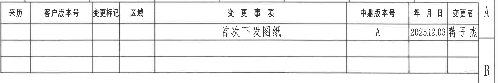
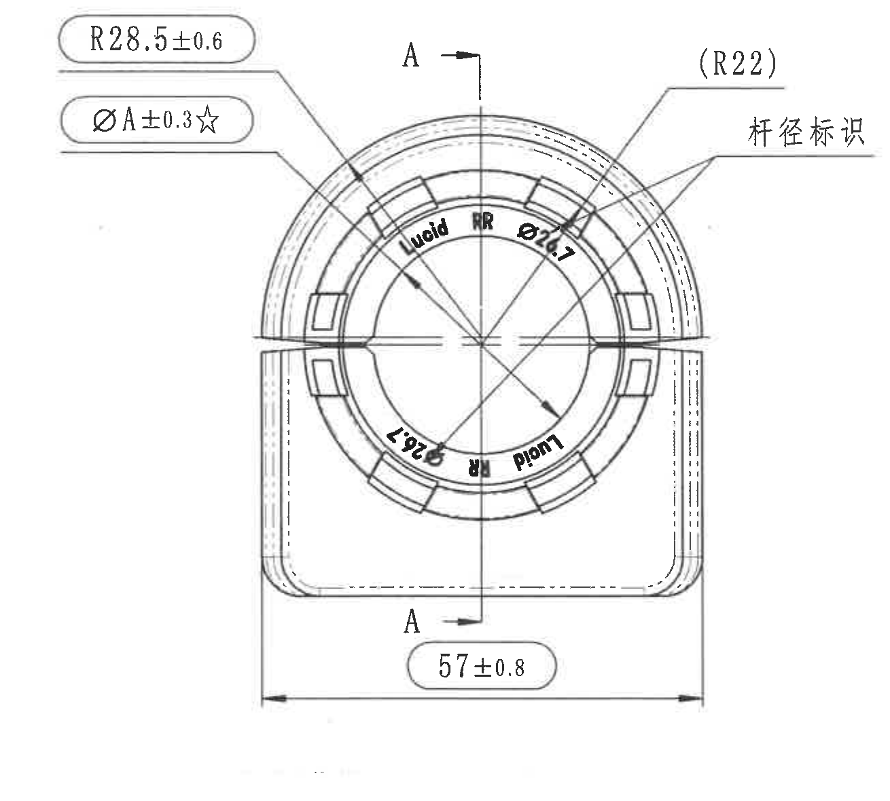
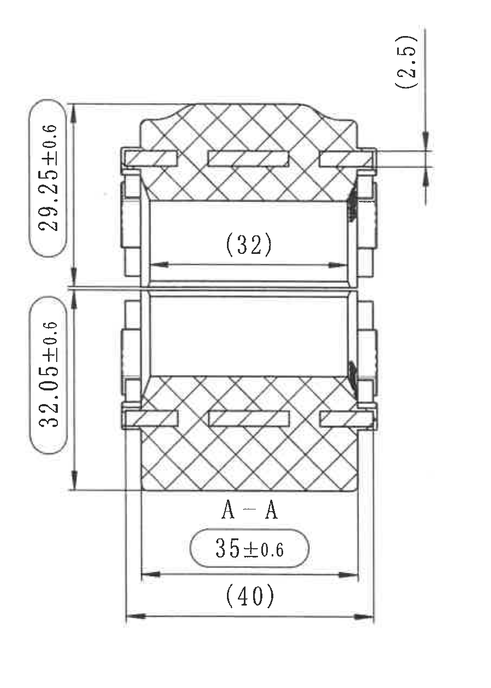
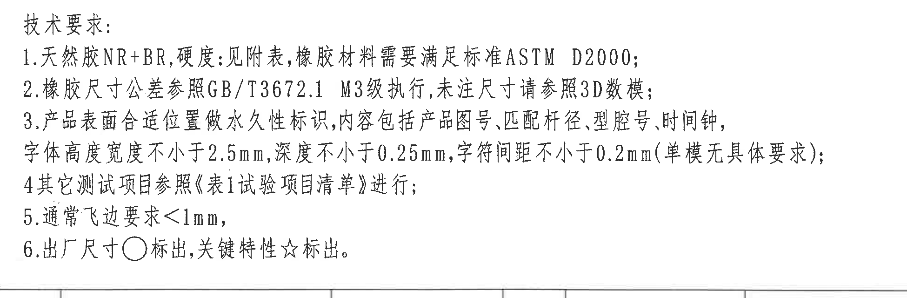
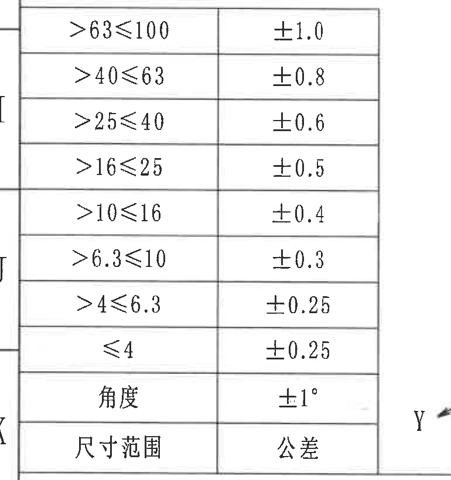
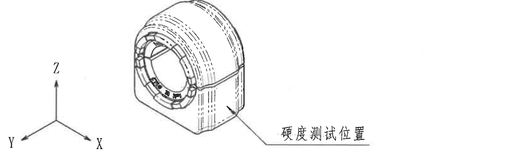
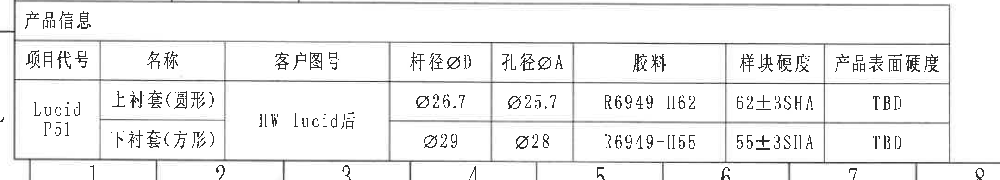
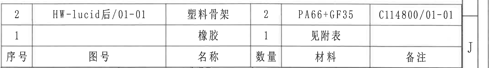
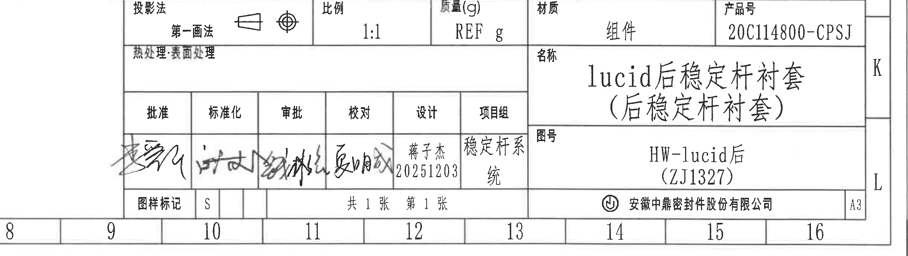

# 20C114800 PDF 内容识别与裁切提取

整页渲染图：`outputs/20C114800_assets/images/page_1.png`  
页面：1；整页 PNG 尺寸：4959 x 3505 px；页面 bbox：`[0, 0, 4959, 3505]`

## object_1 修订履历表

原图位置/视图名称：第 1 页上方右侧修订履历表，bbox `[2770, 155, 4860, 505]`，object_kind `table`。

原表格还原：

| 来历 | 客户版本号 | 变更标记 | 区域 | 变更事项 | 中鼎版本号 | 年月日 | 变更者 |
|---|---|---|---|---|---|---|---|
|  |  |  |  | 首次下发图纸 | A | 2025.12.03 | 蒋子杰 |
|  |  |  |  |  |  |  |  |
|  |  |  |  |  |  |  |  |

提取表格：

| 提取项 | 原图数值或文本 | 含义说明 |
|---|---|---|
| 变更事项 | 首次下发图纸 | 表示该图纸为首次发行/下发记录。 |
| 中鼎版本号 | A | 内部版本号为 A。 |
| 年月日 | 2025.12.03 | 修订/下发日期。 |
| 变更者 | 蒋子杰 | 该条修订记录的变更者。 |
| 空白记录行 | 第 2、3 行为空 | 表格预留修订记录行，原图未填写。 |

边界归属说明：裁切范围包含完整修订表外框、列线、表头和三条记录行。右侧带入图框坐标 A/B 边栏，不作为修订表字段提取。

## object_2 主视图

原图位置/视图名称：第 1 页右上区域主视图，bbox `[2540, 600, 3850, 1780]`，object_kind `view`。

提取表格：

| 提取项 | 原图数值或文本 | 含义说明 |
|---|---|---|
| 圆弧半径 | R28.5±0.6 | 主视图左上引线指向外圆弧，半径 28.5，公差 ±0.6。 |
| 关键孔径尺寸 | ØA±0.3☆ | 主视图左侧引线标注，孔径为变量 A，公差 ±0.3；星号表示关键特性。 |
| 参考圆弧半径 | (R22) | 主视图右上引线指向内侧/上部圆弧；括号表示参考尺寸。 |
| 总宽度/下部宽度 | 57±0.8 | 主视图底部水平尺寸线，左右箭头跨越下部外侧宽度，公差 ±0.8。 |
| 剖切基准字母 | A、A | 主视图竖向剖切线两端标注 A，并以箭头指示剖切方向，对应右侧 A-A 剖面。 |
| 杆径标识文字 | 杆径标识 | 右侧引线指向圆环标识区域，说明该处为杆径标识位置。 |
| 内圈标识内容 | Lucid、RR、Ø26.7 | 圆环内表面标识内容，表示产品/方向或杆径标识文字，不是独立尺寸线。 |
| 角度/弧长尺寸 | 未见独立角度或弧长数值 | 本主视图只见半径和直径类标注，未见角度数值或弧长尺寸。 |
| T 编号 | 未见 | 主视图内未标出 T 编号。 |

边界归属说明：裁切左、上、下边界完整保留本主视图尺寸线、箭头、引线和文字。右边界刻意止于 A-A 剖面左侧，未纳入剖面视图中的 `29.25±0.6`、`32.05±0.6` 等尺寸；这些尺寸只归入 object_3。

## object_3 A-A 剖面视图

原图位置/视图名称：第 1 页右上区域 A-A 剖面，bbox `[3840, 580, 4740, 1840]`，object_kind `section`。

提取表格：

| 提取项 | 原图数值或文本 | 含义说明 |
|---|---|---|
| 上部竖向尺寸 | 29.25±0.6 | 剖面左侧上段竖向尺寸线，标注上部高度/厚度段，公差 ±0.6。 |
| 下部竖向尺寸 | 32.05±0.6 | 剖面左侧下段竖向尺寸线，标注下部高度/厚度段，公差 ±0.6。 |
| 参考台阶/间距 | (2.5) | 剖面右上竖向尺寸，括号表示参考尺寸。 |
| 参考内宽 | (32) | 剖面中部水平尺寸线，括号表示参考内腔宽度/间距。 |
| 横向尺寸 | 35±0.6 | 剖面底部上方水平尺寸线，公差 ±0.6。 |
| 参考总宽 | (40) | 剖面最底部水平尺寸线，括号表示参考总宽。 |
| 剖面名称 | A-A | 来源于主视图 A-A 剖切线的剖面视图名称。 |
| 剖面填充 | 交叉剖面线 | 表示被剖切材料实体区域。 |
| 显式总高度 | 未单独标注 | 原图未给出单一总高度尺寸；只标出上下两段 `29.25±0.6` 与 `32.05±0.6`，不能合并替代原图标注。 |
| 角度/弧长尺寸 | 未见独立角度或弧长数值 | 剖面图中未见角度或弧长标注。 |
| T 编号 | 未见 | 剖面图内未标出 T 编号。 |

边界归属说明：裁切范围完整包含 A-A 剖面外形、剖面线、所有尺寸箭头和文字。`29.25±0.6`、`32.05±0.6`、`(2.5)`、`(32)`、`35±0.6`、`(40)` 均属于本剖面；未把主视图中的 `R28.5±0.6`、`ØA±0.3☆`、`57±0.8` 混入剖面提取。

## object_4 NOTES/技术要求

原图位置/视图名称：第 1 页中右区域技术要求，bbox `[2780, 1840, 4730, 2480]`，object_kind `notes`。

原文还原：

1. 天然胶NR+BR,硬度:见附表,橡胶材料需要满足标准ASTM D2000;
2. 橡胶尺寸公差参照GB/T3672.1 M3级执行,未注尺寸请参照3D数模;
3. 产品表面合适位置做永久性标识,内容包括产品图号,匹配杆径,型腔号,时间钟,字体高度宽度不小于2.5mm,深度不小于0.25mm,字符间距不小于0.2mm(单模无具体要求);
4. 其它测试项目参照《表1试验项目清单》进行;
5. 通常飞边要求<1mm,
6. 出厂尺寸○标出,关键特性☆标出。

提取表格：

| 提取项 | 原图数值或文本 | 含义说明 |
|---|---|---|
| 材料与硬度 | 天然胶NR+BR,硬度:见附表 | 材料为天然胶 NR+BR，硬度以附表为准。 |
| 材料标准 | ASTM D2000 | 橡胶材料需满足 ASTM D2000。 |
| 橡胶尺寸公差 | GB/T3672.1 M3级 | 未注橡胶尺寸公差按该标准等级执行。 |
| 未注尺寸依据 | 3D数模 | 未注尺寸参照 3D 数模。 |
| 永久性标识内容 | 产品图号、匹配杆径、型腔号、时间钟 | 表面标识应包含这些内容。 |
| 标识字体要求 | 高度宽度不小于2.5mm,深度不小于0.25mm,字符间距不小于0.2mm | 永久性标识的最小几何要求。 |
| 试验项目 | 《表1试验项目清单》 | 其它测试项目按该清单执行。 |
| 飞边要求 | <1mm | 通常飞边要求小于 1 mm。 |
| 出厂尺寸符号 | ○ | 出厂尺寸用圆圈符号标出。 |
| 关键特性符号 | ☆ | 关键特性用星号标出。 |

边界归属说明：裁切范围包含技术要求标题和 1-6 条完整文字。底部仅轻微带入下方表格边线，不提取为 NOTES 内容。

## object_5 一般公差表

原图位置/视图名称：第 1 页左下区域一般尺寸公差表，bbox `[350, 2180, 1120, 3000]`，object_kind `table`。

原表格还原：

| 尺寸范围 | 公差 |
|---|---|
| >63≤100 | ±1.0 |
| >40≤63 | ±0.8 |
| >25≤40 | ±0.6 |
| >16≤25 | ±0.5 |
| >10≤16 | ±0.4 |
| >6.3≤10 | ±0.3 |
| >4≤6.3 | ±0.25 |
| ≤4 | ±0.25 |
| 角度 | ±1° |

提取表格：

| 提取项 | 原图数值或文本 | 含义说明 |
|---|---|---|
| 表头 | 尺寸范围 / 公差 | 表格给出未注尺寸范围与对应公差。 |
| 尺寸范围 1 | >63≤100 / ±1.0 | 尺寸大于 63 且小于等于 100 时公差 ±1.0。 |
| 尺寸范围 2 | >40≤63 / ±0.8 | 尺寸大于 40 且小于等于 63 时公差 ±0.8。 |
| 尺寸范围 3 | >25≤40 / ±0.6 | 尺寸大于 25 且小于等于 40 时公差 ±0.6。 |
| 尺寸范围 4 | >16≤25 / ±0.5 | 尺寸大于 16 且小于等于 25 时公差 ±0.5。 |
| 尺寸范围 5 | >10≤16 / ±0.4 | 尺寸大于 10 且小于等于 16 时公差 ±0.4。 |
| 尺寸范围 6 | >6.3≤10 / ±0.3 | 尺寸大于 6.3 且小于等于 10 时公差 ±0.3。 |
| 尺寸范围 7 | >4≤6.3 / ±0.25 | 尺寸大于 4 且小于等于 6.3 时公差 ±0.25。 |
| 尺寸范围 8 | ≤4 / ±0.25 | 尺寸小于等于 4 时公差 ±0.25。 |
| 角度公差 | 角度 / ±1° | 未注角度公差为 ±1°。 |

边界归属说明：裁切范围包含完整表格外框、横线、竖线和所有文字。左侧图框坐标 I/J/K 与右侧坐标轴碎片不属于公差表字段，未纳入提取表。

## object_6 等轴测局部图/硬度测试位置

原图位置/视图名称：第 1 页下方中左等轴测局部图，bbox `[1030, 2450, 2630, 2970]`，object_kind `detail`。

提取表格：

| 提取项 | 原图数值或文本 | 含义说明 |
|---|---|---|
| 三维坐标轴 | X、Y、Z | 表示等轴测视图方向。 |
| 引线说明 | 硬度测试位置 | 引线指向零件侧面，说明该处为硬度测试位置。 |
| 零件局部形态 | 等轴测外观 | 展示零件外观、环形端面、侧面及底部结构。 |
| 尺寸数值 | 未见 | 本局部图未标注独立尺寸数值。 |
| 角度/弧长尺寸 | 未见 | 本局部图未标注角度或弧长尺寸。 |
| T 编号 | 未见 | 本局部图未标出 T 编号。 |

边界归属说明：裁切范围包含完整等轴测图、坐标轴和“硬度测试位置”引线文字。下方产品信息表边线未进入本对象；该对象只提取局部图和引线说明。

## object_7 产品信息表

原图位置/视图名称：第 1 页底部左侧产品信息表，bbox `[350, 2985, 2510, 3375]`，object_kind `table`。

原表格还原：

| 项目代号 | 名称 | 客户图号 | 杆径ØD | 孔径ØA | 胶料 | 样块硬度 | 产品表面硬度 |
|---|---|---|---|---|---|---|---|
| Lucid P51 | 上衬套(圆形) | HW-lucid后 | Ø26.7 | Ø25.7 | R6949-H62 | 62±3SHA | TBD |
| Lucid P51 | 下衬套(方形) | HW-lucid后 | Ø29 | Ø28 | R6949-H55 | 55±3SHA | TBD |

提取表格：

| 提取项 | 原图数值或文本 | 含义说明 |
|---|---|---|
| 项目代号 | Lucid P51 | 产品项目代号。 |
| 客户图号 | HW-lucid后 | 两行产品信息共用客户图号。 |
| 上衬套名称 | 上衬套(圆形) | 圆形上衬套。 |
| 上衬套杆径 | Ø26.7 | 上衬套匹配杆径 D。 |
| 上衬套孔径 | Ø25.7 | 上衬套孔径 A。 |
| 上衬套胶料 | R6949-H62 | 上衬套胶料牌号。 |
| 上衬套样块硬度 | 62±3SHA | 上衬套样块硬度及公差。 |
| 上衬套产品表面硬度 | TBD | 原图标为待定。 |
| 下衬套名称 | 下衬套(方形) | 方形下衬套。 |
| 下衬套杆径 | Ø29 | 下衬套匹配杆径 D。 |
| 下衬套孔径 | Ø28 | 下衬套孔径 A。 |
| 下衬套胶料 | R6949-H55 | 下衬套胶料牌号。 |
| 下衬套样块硬度 | 55±3SHA | 下衬套样块硬度及公差。 |
| 下衬套产品表面硬度 | TBD | 原图标为待定。 |

边界归属说明：裁切范围包含“产品信息”标题、表头和两行数据。上方公差表、等轴测图和底部图框编号不作为产品信息表字段提取。

## object_8 BOM/明细表

原图位置/视图名称：第 1 页底部右上 BOM/明细表，bbox `[2770, 2445, 4900, 2745]`，object_kind `table`。

原表格还原：

| 序号 | 图号 | 名称 | 数量 | 材料 | 备注 |
|---|---|---|---|---|---|
| 2 | HW-lucid后/01-01 | 塑料骨架 | 2 | PA66+GF35 | C114800/01-01 |
| 1 |  | 橡胶 | 1 | 见附表 |  |

提取表格：

| 提取项 | 原图数值或文本 | 含义说明 |
|---|---|---|
| 明细序号 2 | HW-lucid后/01-01 / 塑料骨架 / 数量 2 / PA66+GF35 / C114800/01-01 | 塑料骨架零件，数量 2，材料 PA66+GF35，备注为对应编号。 |
| 明细序号 1 | 橡胶 / 数量 1 / 见附表 | 橡胶项，数量 1，材料见附表，图号和备注空白。 |
| 表头 | 序号、图号、名称、数量、材料、备注 | BOM 明细表字段。 |

边界归属说明：重裁后的范围止于 BOM 表格下边界，未带入下方投影法/比例/质量/材质/产品号栏。右侧少量图框边栏不作为表格内容。

## object_9 标题栏/签核栏

原图位置/视图名称：第 1 页底部右侧标题栏与签核栏，bbox `[2440, 2745, 4900, 3440]`，object_kind `title_block`。

投影/比例/材质/产品号表还原：

| 投影法 | 比例 | 质量(g) | 材质 | 产品号 |
|---|---|---|---|---|
| 第一画法（含投影视图符号） | 1:1 | REF g | 组件 | 20C114800-CPSJ |

签核栏还原：

| 批准 | 标准化 | 审批 | 校对 | 设计 | 项目组 |
|---|---|---|---|---|---|
| 手写签名 | 手写签名 | 手写签名 | 手写签名 | 蒋子杰 20251203 | 稳定杆系统 |

标题栏主信息还原：

| 字段 | 原图文本 |
|---|---|
| 热处理:表面处理 |  |
| 名称 | lucid后稳定杆衬套（后稳定杆衬套） |
| 图号 | HW-lucid后（ZJ1327） |
| 图样标记 | S |
| 张数 | 共1张 第1张 |
| 公司 | 安徽中鼎密封件股份有限公司 |
| 图幅 | A3 |

提取表格：

| 提取项 | 原图数值或文本 | 含义说明 |
|---|---|---|
| 投影法 | 第一画法 | 表示图样采用第一角法/第一画法投影，旁边绘有投影符号。 |
| 比例 | 1:1 | 图样比例为原尺寸。 |
| 质量(g) | REF g | 质量为参考值，单位 g。 |
| 材质 | 组件 | 标题栏材质字段为组件。 |
| 产品号 | 20C114800-CPSJ | 产品编号。 |
| 名称 | lucid后稳定杆衬套（后稳定杆衬套） | 图样名称。 |
| 图号 | HW-lucid后（ZJ1327） | 图样编号/客户图号信息。 |
| 设计 | 蒋子杰 20251203 | 设计人员和日期。 |
| 项目组 | 稳定杆系统 | 所属项目组。 |
| 图样标记 | S | 图样标记字段。 |
| 页数 | 共1张 第1张 | 图纸总张数和当前张。 |
| 公司 | 安徽中鼎密封件股份有限公司 | 图纸归属公司。 |
| 图幅 | A3 | 图幅规格。 |

边界归属说明：裁切范围从投影法/比例栏上边界开始，到标题栏下边界结束，完整包含标题栏主信息、签核栏、公司栏和 A3 图幅。上方 BOM 表内容已单独归入 object_8；本对象不再提取 BOM 行。

## 裁切检查记录

| 图片 | 对象 | 检查结果 | 说明 |
|---|---|---|---|
| page_1.png | 整页渲染图 | 完整 | PDF 第 1 页已按整页 PNG 渲染，尺寸 4959 x 3505 px。 |
| object_1.png | 修订履历表 | 完整 | 表格外框、表头、记录行和文字完整；右侧图框坐标不提取。 |
| object_2.png | 主视图 | 完整 | `R28.5±0.6`、`ØA±0.3☆`、`(R22)`、`57±0.8`、A-A 剖切标记、引线和箭头完整；未带入 A-A 剖面尺寸。 |
| object_3.png | A-A 剖面 | 完整 | `29.25±0.6`、`32.05±0.6`、`(2.5)`、`(32)`、`35±0.6`、`(40)` 的尺寸线、箭头和文字完整。 |
| object_4.png | NOTES/技术要求 | 完整 | 技术要求 1-6 条完整可读；底部少量表格边线不作为文本提取。 |
| object_5.png | 一般公差表 | 完整 | 表格线、尺寸范围和公差文字完整；左侧图框坐标与右侧坐标轴碎片不提取。 |
| object_6.png | 等轴测局部图/硬度测试位置 | 完整 | 等轴测零件、X/Y/Z 坐标轴、引线和“硬度测试位置”文字完整。 |
| object_7.png | 产品信息表 | 完整 | “产品信息”标题、表头和两行数据完整；底部图框编号不提取。 |
| object_8.png | BOM/明细表 | 完整 | 重裁后只包含 BOM 表格，未混入下方标题栏投影/比例字段。 |
| object_9.png | 标题栏/签核栏 | 完整 | 投影/比例/质量/材质/产品号栏、签核栏、图名图号、公司和图幅完整；未混入 BOM 数据行。 |
