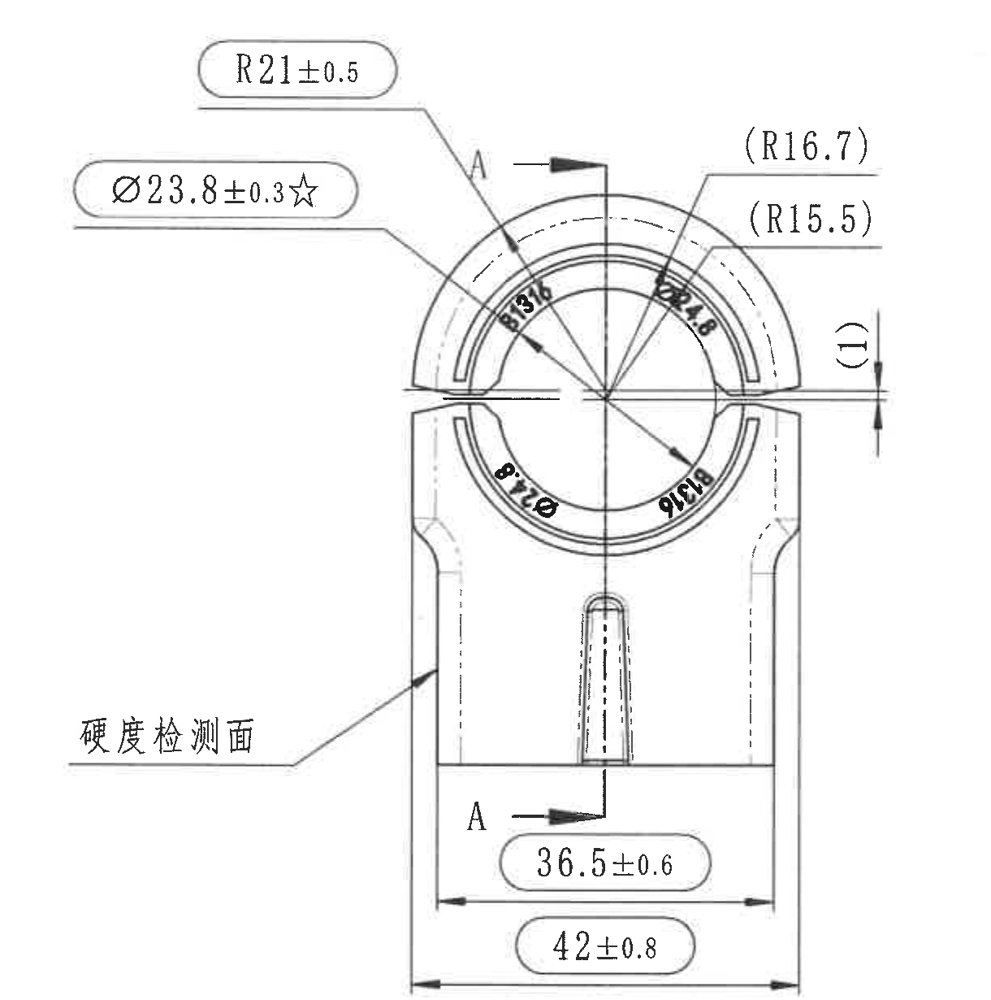
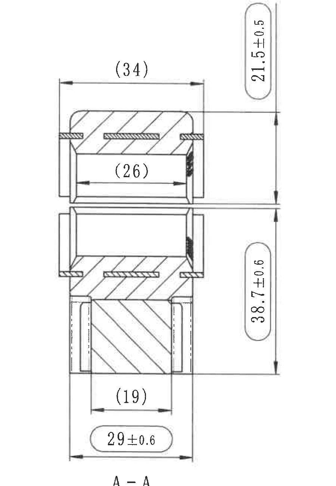
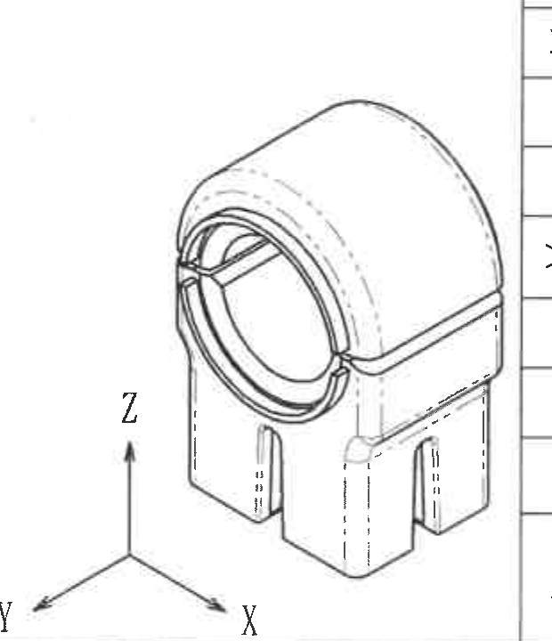
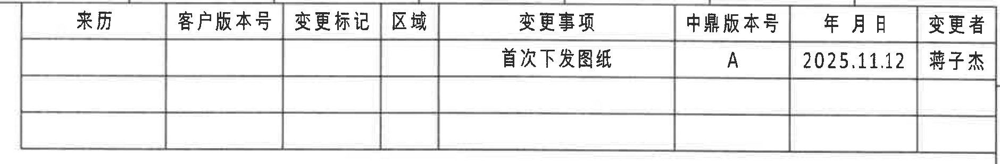
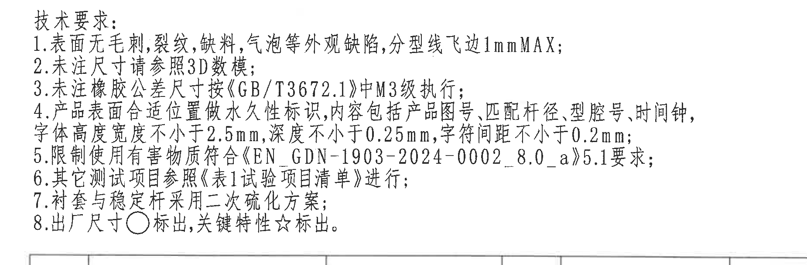
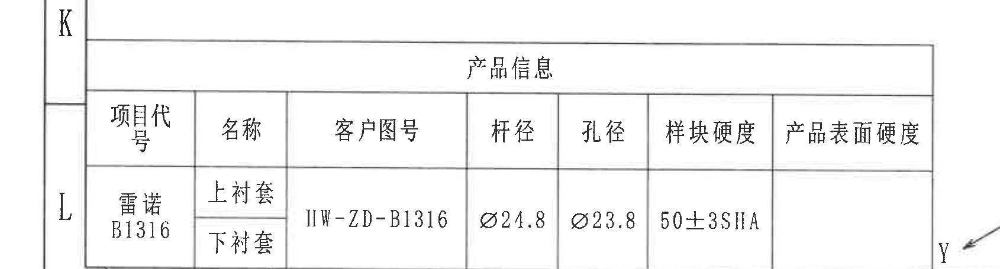
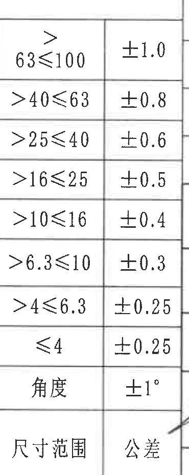
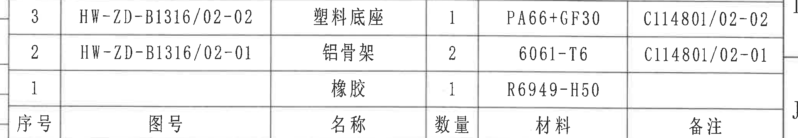
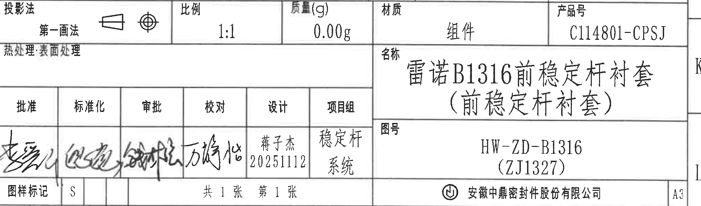

# 20C114801.pdf 内容识别与裁切提取

源文件：`input/20C114801.pdf`  
整页渲染图：`outputs/20C114801_assets/images/page_1.png`  
页面尺寸：4959 x 3505 px；bbox: [0, 0, 4959, 3505]

## object_1 - 主视图 / 正面加工视图

原图位置/视图名称：page 1，主视图 / 正面加工视图；bbox: [2480, 535, 3700, 1765]

| 提取项 | 原图数值或文本 | 含义说明 |
|---|---|---|
| 外圆弧半径 | R21±0.5 | 引出线指向上部外圆弧，表示外圆弧加工半径及公差。 |
| 关键直径 | Ø23.8±0.3☆ | 主视图左侧直径标注；☆为关键特性标识，NOTES 第 8 条说明关键特性用 ☆ 标出。 |
| 参考半径 | (R16.7) | 括号内参考半径，位于右上引出线处，按参考尺寸保留。 |
| 参考半径 | (R15.5) | 括号内参考半径，位于右上引出线处，按参考尺寸保留。 |
| 参考间隙/厚度 | (1) | 右侧竖向括号尺寸，表示该处参考间隙或厚度。 |
| 内侧宽度 | 36.5±0.6 | 主视图下部内侧横向尺寸。 |
| 总宽度 | 42±0.8 | 主视图底部最大外宽尺寸。 |
| 剖切标识 | A-A | 上、下两个 A 箭头为 A-A 剖面位置和方向，剖面尺寸归 object_2。 |
| 表面说明 | 硬度检测面 | 左下引出文字，指向侧面硬度检测区域。 |
| T 编号 | 未见 | 本视图内未发现 T 编号。 |

边界归属说明：本裁切仅包含主视图及其完整尺寸线、箭头和文字。右侧 A-A 剖面不归入本对象；下方 NOTES 没有带入。本视图内括号尺寸和星号关键尺寸均按原图提取。

## object_2 - A-A 剖面视图

原图位置/视图名称：page 1，A-A 剖面视图；bbox: [3820, 480, 4720, 1780]

| 提取项 | 原图数值或文本 | 含义说明 |
|---|---|---|
| 上部高度 | 21.5±0.5 | 剖面右侧上部竖向尺寸，带公差。 |
| 下部/总高度 | 38.7±0.6 | 剖面右侧下部竖向尺寸，带公差。 |
| 上部外宽参考尺寸 | (34) | 顶部横向括号尺寸，参考外宽。 |
| 上部内腔参考尺寸 | (26) | 上部开口内侧横向括号尺寸，参考内宽。 |
| 下部内宽参考尺寸 | (19) | 下部横向括号尺寸，参考宽度。 |
| 底部外宽 | 29±0.6 | 底部横向外宽尺寸，带公差。 |
| 剖面名称 | A-A | 对应主视图中的 A-A 剖切标识。 |
| T 编号 | 未见 | 本剖面内未发现 T 编号。 |

边界归属说明：本裁切包含剖面图完整轮廓、剖面线、尺寸线和 A-A 名称。主视图的 R、Ø、(1) 等不归入本剖面；下方 NOTES 未纳入提取。

## object_3 - 轴测参考图 / 3D 方向示意

原图位置/视图名称：page 1，轴测参考图；bbox: [1825, 2615, 2445, 3335]

| 提取项 | 原图数值或文本 | 含义说明 |
|---|---|---|
| 轴测形态 | 零件三维外形 | 显示衬套的立体结构、开口、槽和下部支脚形态。 |
| 坐标轴 | X、Y、Z | 表示 3D 方向参考。 |
| 尺寸 | 无新增尺寸 | 该视图未标注新的尺寸、公差、弧度或 T 编号。 |

边界归属说明：右侧有相邻公差表边线残片；该边线不属于轴测图，未提取其内容。裁切保留了轴测图主体和 X/Y/Z 坐标文字。

## object_4 - 修订履历表 / 变更履历表

原图位置/视图名称：page 1，右上修订履历表；bbox: [2915, 165, 4795, 475]

| 来历 | 客户版本号 | 变更标记 | 区域 | 变更事项 | 中鼎版本号 | 年月日 | 变更者 |
|---|---|---|---|---|---|---|---|
|  |  |  |  | 首次下发图纸 | A | 2025.11.12 | 蒋子杰 |
|  |  |  |  |  |  |  |  |
|  |  |  |  |  |  |  |  |

| 提取项 | 原图数值或文本 | 含义说明 |
|---|---|---|
| 变更事项 | 首次下发图纸 | 本次记录说明首次下发图纸。 |
| 中鼎版本号 | A | 中鼎内部版本号。 |
| 日期 | 2025.11.12 | 变更记录日期。 |
| 变更者 | 蒋子杰 | 变更责任人。 |

边界归属说明：仅提取右上变更履历表；表格下方剖面图区域不归入本对象。空白行按原表结构保留。

## object_5 - 技术要求 / NOTES

原图位置/视图名称：page 1，技术要求文本块；bbox: [2710, 1790, 4560, 2400]

| 提取项 | 原图数值或文本 | 含义说明 |
|---|---|---|
| 1 | 表面无毛刺,裂纹,缺料,气泡等外观缺陷,分型线飞边1mmMAX; | 外观缺陷控制，分型线飞边最大 1 mm。 |
| 2 | 未注尺寸请参照3D数模; | 未标注尺寸以 3D 数模为准。 |
| 3 | 未注橡胶公差尺寸按《GB/T3672.1》中M3级执行; | 未注橡胶尺寸按 GB/T3672.1 的 M3 级公差执行。 |
| 4 | 产品表面合适位置做永久性标识,内容包括产品图号,匹配杆径,型腔号,时间钟,字体高度宽度不小于2.5mm,深度不小于0.25mm,字符间距不小于0.2mm; | 永久标识内容和字符尺寸要求。 |
| 5 | 限制使用有害物质符合《EN GDN-1903-2024-0002_8.0_a》5.1要求; | 有害物质限制文件及条款。 |
| 6 | 其它测试项目参照《表1试验项目清单》进行; | 测试项目引用表 1。 |
| 7 | 衬套与稳定杆采用二次硫化方案; | 工艺方案要求。 |
| 8 | 出厂尺寸○标出,关键特性☆标出。 | ○表示出厂尺寸，☆表示关键特性。 |

边界归属说明：仅提取技术要求 1-8 条。上方剖面视图 A-A 与下方零件明细表均不归入 NOTES。

## object_6 - 产品信息表

原图位置/视图名称：page 1，左下产品信息表；bbox: [235, 2880, 1925, 3335]

| 项目代号 | 名称 | 客户图号 | 杆径 | 孔径 | 样块硬度 | 产品表面硬度 |
|---|---|---|---|---|---|---|
| 雷诺 B1316 | 上衬套 / 下衬套 | HW-ZD-B1316 | Ø24.8 | Ø23.8 | 50±3SHA |  |

| 提取项 | 原图数值或文本 | 含义说明 |
|---|---|---|
| 项目代号 | 雷诺 B1316 | 产品项目代号。 |
| 名称 | 上衬套、下衬套 | 表中同一项目下列出上下衬套。 |
| 客户图号 | HW-ZD-B1316 | 客户图号。 |
| 杆径 | Ø24.8 | 匹配杆径。 |
| 孔径 | Ø23.8 | 衬套孔径。 |
| 样块硬度 | 50±3SHA | 样块硬度，邵氏 A 硬度。 |
| 产品表面硬度 | 空白 | 原表该栏未填写。 |

边界归属说明：右侧可见轴测图 Y 轴局部，不属于产品信息表；未把该文字作为表格内容提取。

## object_7 - 尺寸范围公差表

原图位置/视图名称：page 1，尺寸范围公差表；bbox: [2420, 2390, 2790, 3320]

| 尺寸范围 | 公差 |
|---|---|
| >63≤100 | ±1.0 |
| >40≤63 | ±0.8 |
| >25≤40 | ±0.6 |
| >16≤25 | ±0.5 |
| >10≤16 | ±0.4 |
| >6.3≤10 | ±0.3 |
| >4≤6.3 | ±0.25 |
| ≤4 | ±0.25 |
| 角度 | ±1° |

| 提取项 | 原图数值或文本 | 含义说明 |
|---|---|---|
| 一般线性尺寸公差 | 见上表 | 用于未单独标注公差的尺寸范围。 |
| 角度公差 | ±1° | 未注角度的一般公差。 |

边界归属说明：该裁切只提取左侧两列表格。右侧标题栏/签批栏不属于本表。

## object_8 - 零件明细表 / BOM

原图位置/视图名称：page 1，零件明细表；bbox: [2755, 2380, 4825, 2740]

| 序号 | 图号 | 名称 | 数量 | 材料 | 备注 |
|---|---|---|---|---|---|
| 3 | HW-ZD-B1316/02-02 | 塑料底座 | 1 | PA66+GF30 | C114801/02-02 |
| 2 | HW-ZD-B1316/02-01 | 铝骨架 | 2 | 6061-T6 | C114801/02-01 |
| 1 |  | 橡胶 | 1 | R6949-H50 |  |

| 提取项 | 原图数值或文本 | 含义说明 |
|---|---|---|
| 序号 3 | HW-ZD-B1316/02-02 / 塑料底座 / 1 / PA66+GF30 / C114801/02-02 | 组件中的塑料底座。 |
| 序号 2 | HW-ZD-B1316/02-01 / 铝骨架 / 2 / 6061-T6 / C114801/02-01 | 组件中的铝骨架。 |
| 序号 1 | 橡胶 / 1 / R6949-H50 | 组件中的橡胶件；图号和备注栏为空。 |

边界归属说明：仅提取明细表外框内字段和三行记录；下方标题栏字段不归入本对象。

## object_9 - 标题栏

原图位置/视图名称：page 1，右下标题栏；bbox: [2790, 2750, 4825, 3350]

| 字段 | 原图数值或文本 | 含义说明 |
|---|---|---|
| 投影法 | 第一画法 | 图纸投影法。 |
| 比例 | 1:1 | 图纸比例。 |
| 质量(g) | 0.00g | 标称质量。 |
| 材质 | 组件 | 材质栏填写为组件。 |
| 产品号 | C114801-CPSJ | 产品号。 |
| 热处理 | 表面处理 | 原栏位显示“热处理:表面处理”。 |
| 名称 | 雷诺B1316前稳定杆衬套（前稳定杆衬套） | 零件/组件名称。 |
| 图号 | HW-ZD-B1316（ZJ1327） | 图纸编号和括号内编号。 |
| 批准 | 手写签名 | 批准栏签名。 |
| 标准化 | 手写签名 | 标准化栏签名。 |
| 审批 | 手写签名 | 审批栏签名。 |
| 校对 | 方俊怡 | 校对人。 |
| 设计 | 蒋子杰 20251112 | 设计人和日期。 |
| 项目组 | 稳定杆系统 | 项目组名称。 |
| 图样标记 | S | 图样标记。 |
| 页数 | 共1张 第1张 | 图纸页数。 |
| 公司 | 安徽中鼎密封件股份有限公司 | 出图公司。 |
| 图幅 | A3 | 图幅规格。 |

边界归属说明：标题栏裁切包含右下主标题栏、签批栏、投影法/比例/质量/材质/产品号等字段。左边界处为标题栏结构线和签批栏，未把左侧公差表内容作为标题栏字段。

## 裁切检查记录

| 对象 | 图片路径 | 检查结果 | 边界归属处理 |
|---|---|---|---|
| object_1 | `outputs/20C114801_assets/images/object_1.png` | 完整包含主视图尺寸线、箭头和文字；无边缘文字被裁。 | A-A 剖面未混入；NOTES 未混入。 |
| object_2 | `outputs/20C114801_assets/images/object_2.png` | 完整包含剖面图、剖面线、尺寸线、文字和 A-A 名称。 | 主视图尺寸未归入剖面。 |
| object_3 | `outputs/20C114801_assets/images/object_3.png` | 完整包含轴测主体和 X/Y/Z 文字。 | 右侧相邻表格边线残片不提取。 |
| object_4 | `outputs/20C114801_assets/images/object_4.png` | 完整包含修订履历表边框、表头和记录。 | 下方剖面视图未提取。 |
| object_5 | `outputs/20C114801_assets/images/object_5.png` | 完整包含技术要求 1-8 条文字。 | 上方剖面图和下方明细表未提取。 |
| object_6 | `outputs/20C114801_assets/images/object_6.png` | 完整包含产品信息表外框、表头和数据。 | 右侧轴测 Y 轴残片不提取。 |
| object_7 | `outputs/20C114801_assets/images/object_7.png` | 完整包含尺寸范围/公差两列表格和所有行。 | 右侧标题栏/签批栏不提取。 |
| object_8 | `outputs/20C114801_assets/images/object_8.png` | 完整包含明细表表头和三行记录。 | 下方标题栏字段不提取。 |
| object_9 | `outputs/20C114801_assets/images/object_9.png` | 完整包含标题栏字段、签批栏、名称、图号和公司栏。 | 左侧公差表内容不作为标题栏字段。 |
