# 20C114820 内容识别

识别对象来源：`input/20C114820.pdf` 第 1 页。已先渲染整页 PNG：`outputs/20C114820_assets/images/page_1.png`，页面像素尺寸 4959 x 3505。PDF 为扫描图，无可抽取文字层；以下内容按整页 PNG 与局部放大图逐区校读还原。

## object_1 修订履历表

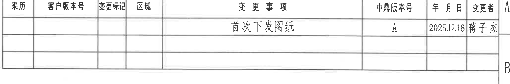

原图位置/视图名称：第 1 页上方偏右，修订履历表。

原表还原：

| 来历 | 客户版本号 | 变更标记 | 区域 | 变更事项 | 中鼎版本号 | 年月日 | 变更者 |
|---|---|---|---|---|---|---|---|
|  |  |  |  | 首次下发图纸 | A | 2025.12.16 | 蒋子杰 |
|  |  |  |  |  |  |  |  |
|  |  |  |  |  |  |  |  |

| 提取项 | 原图数值或文本 | 含义说明 |
|---|---|---|
| 变更事项 | 首次下发图纸 | 本图纸首次发布记录。 |
| 中鼎版本号 | A | 内部图纸版本为 A。 |
| 年月日 | 2025.12.16 | 修订/发布日期。 |
| 变更者 | 蒋子杰 | 变更/发布人员。 |

边界归属说明：裁切对象仅提取修订履历表字段；上方 10-16 坐标格和右侧 A/B 图框字母属于图框定位参照，不归入修订表内容。

## object_2 附表1

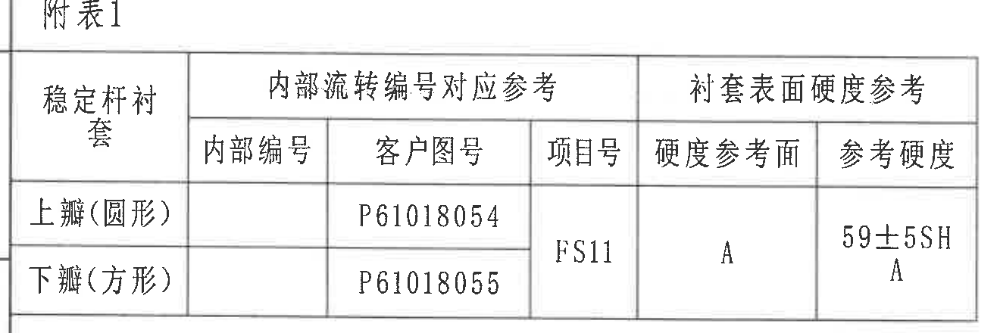

原图位置/视图名称：第 1 页左上区域，附表1。

原表还原：

| 稳定杆衬套 | 内部流转编号对应参考 | 内部流转编号对应参考 | 内部流转编号对应参考 | 衬套表面硬度参考 | 衬套表面硬度参考 |
|---|---|---|---|---|---|
|  | 内部编号 | 客户图号 | 项目号 | 硬度参考面 | 参考硬度 |
| 上瓣(圆形) |  | P61018054 | FS11 | A | 59±5SHA |
| 下瓣(方形) |  | P61018055 | FS11 | A | A |

| 提取项 | 原图数值或文本 | 含义说明 |
|---|---|---|
| 稳定杆衬套-上瓣 | 上瓣(圆形) | 圆形上瓣衬套。 |
| 客户图号-上瓣 | P61018054 | 对应客户图号。 |
| 稳定杆衬套-下瓣 | 下瓣(方形) | 方形下瓣衬套。 |
| 客户图号-下瓣 | P61018055 | 对应客户图号。 |
| 项目号 | FS11 | 两行共用项目号。 |
| 硬度参考面 | A | 衬套表面硬度测量参考面。 |
| 参考硬度 | 59±5SHA；下行单元格可见 A | 表示硬度参考值/参考面关联信息；下行的 A 位于同一参考硬度区域。 |

边界归属说明：裁切完整包含附表1标题、表头、两行数据和外边框；左侧极细竖线为图框/相邻边线，不作为表格字段提取。

## object_3 图2 轴向压脱试验

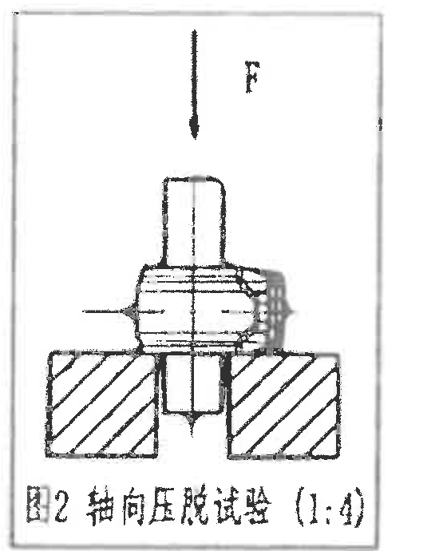

原图位置/视图名称：第 1 页上中偏左，图2 轴向压脱试验（1:4）。

| 提取项 | 原图数值或文本 | 含义说明 |
|---|---|---|
| 视图标题 | 图2 轴向压脱试验（1:4） | 轴向压脱试验示意图，比例 1:4。 |
| 力方向 | F，向下箭头 | 沿稳定杆轴向施加向下压脱力。 |
| 结构示意 | 上方压头/稳定杆衬套/下方支承夹具 | 表示粘接试验或压脱试验的受力和支承关系。 |
| 剖面线 | 下方支承件斜线剖面 | 支承夹具或剖切实体的示意。 |

边界归属说明：裁切包含完整外框、力箭头、F 标识、试验示意和图题；无独立尺寸数值。下方邻近附表2标题，但未作为本对象内容提取。

## object_4 附表2 试验项目清单

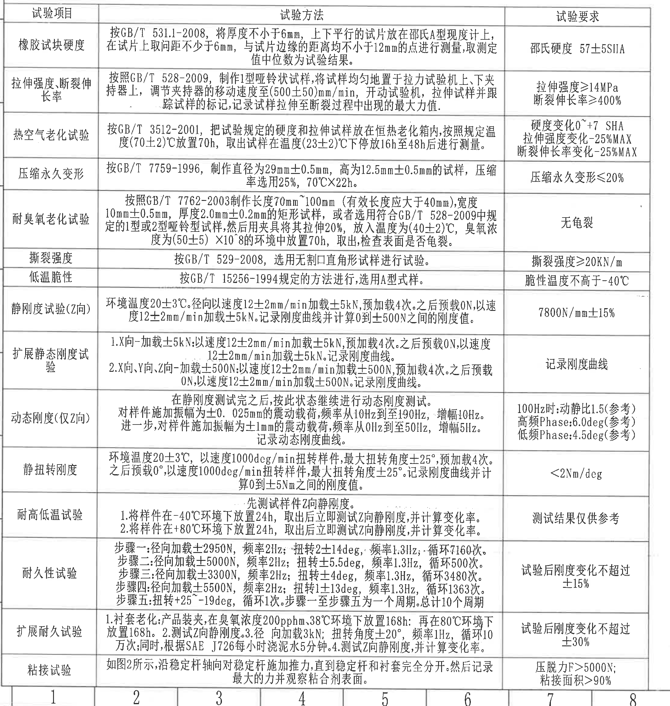

原图位置/视图名称：第 1 页左下大表，附表2 试验项目清单。

原表还原：

| 试验项目 | 试验方法 | 试验要求 |
|---|---|---|
| 橡胶试块硬度 | 按GB/T 531.1-2008，将厚度不小于6mm，上下平行的试片放在邵氏A型硬度计上，在试片上取间距不少于6mm，与试片边缘的距离均不小于12mm的点进行测量，取测定值中位数为试验结果。 | 邵氏硬度 57±5SHA |
| 拉伸强度、断裂伸长率 | 按照GB/T 528-2009，制作1型哑铃状试样，将试样均匀地置于拉力试验机上下夹持器上，调节夹持器的移动速度至(500±50)mm/min，开动试验机，拉伸试样并跟踪试样的标记，记录试样拉伸至断裂过程中出现的最大力值。 | 拉伸强度≥14MPa；断裂伸长率≥400% |
| 热空气老化试验 | 按GB/T 3512-2001，把试验规定的硬度和拉伸试样放在恒热老化箱内，按照规定温度(70±2)℃放置70h，取出试样在温度(23±2)℃下停放16h至48h后进行测量。 | 硬度变化0~+7 SHA；拉伸强度变化-25%MAX；断裂伸长率变化-25%MAX |
| 压缩永久变形 | 按GB/T 7759-1996，制作直径为29mm±0.5mm，高为12.5mm±0.5mm的试样，压缩率选用25%，70℃X22h。 | 压缩永久变形≤20% |
| 耐臭氧老化试验 | 按照GB/T 7762-2003制作长度70mm~100mm（有效长度应大于40mm），宽度10mm±0.5mm，厚度2.0mm±0.2mm的矩形试样，或者选用符合GB/T 528-2009中规定的1型或2型哑铃型试样，然后用夹具将其拉伸20%，放入温度为(40±2)℃，臭氧浓度为(50±5)×10^-8的环境中放置70h，取出检查表面是否龟裂。 | 无龟裂 |
| 撕裂强度 | 按GB/T 529-2008，选用无割口直角形试样进行试验。 | 撕裂强度≥20KN/m |
| 低温脆性 | 按GB/T 15256-1994规定的方法进行，选用A型试样。 | 脆性温度不高于-40℃ |
| 静刚度试验(Z向) | 环境温度20±3℃。径向以速度12±2mm/min加载±5kN，预加载4次。之后预载0N，以速度12±2mm/min加载±5kN。记录刚度曲线并计算0到±500N之间的刚度值。 | 7800N/mm±15% |
| 扩展静态刚度试验 | 1.X向-加载±5kN:以速度12±2mm/min加载±5kN，预加载4次。之后预载0N，以速度12±2mm/min加载±5kN。记录刚度曲线。2.X向、Y向、Z向-加载±500N:以速度12±2mm/min加载±500N，预加载4次。之后预载0N，以速度12±2mm/min加载±500N。记录刚度曲线。 | 记录刚度曲线 |
| 动态刚度(仅Z向) | 在静刚度测试完之后，按此状态继续进行动态刚度测试。对样件施加振幅为±0.025mm的震动载荷，频率从10Hz到至190Hz，增幅10Hz。进一步，对样件施加振幅为±1mm的震动载荷，频率从0Hz到至50Hz，增幅5Hz。记录动态刚度曲线。 | 100Hz时:动静比1.5(参考)；高频Phase:6.0deg(参考)；低频Phase:4.5deg(参考) |
| 静扭转刚度 | 环境温度20±3℃，以速度1000deg/min扭转样件，最大扭转角度±25°，预加载4次。之后预载0°，以速度1000deg/min扭转样件，最大扭转角度±25°。记录刚度曲线并计算0到±5Nm之间的刚度值。 | <2Nm/deg |
| 耐高低温试验 | 先测试样件Z向静刚度。1.将样件在-40℃环境下放置24h，取出后立即测试Z向静刚度，并计算变化率。2.将样件在+80℃环境下放置24h，取出后立即测试Z向静刚度，并计算变化率。 | 测试结果仅供参考 |
| 耐久性试验 | 步骤一:径向加载±2950N，频率2Hz；扭转2±14deg，频率1.3Hz，循环7160次。步骤二:径向加载±5000N，频率2Hz；扭转±5.5deg，频率1.3Hz，循环500次。步骤三:径向加载±3300N，频率2Hz；扭转±4deg，频率1.3Hz，循环3480次。步骤四:径向加载±5500N，频率2Hz；扭转1±13deg，频率1.3Hz，循环1363次。步骤五:扭转+25~-19deg，循环1次。步骤一至步骤五为一个周期。总计10个周期。 | 试验后刚度变化不超过±15% |
| 扩展耐久试验 | 1.衬套老化:产品装夹，在臭氧浓度200pphm、38℃环境下放置168h；再在80℃环境下放置168h。2.测试Z向静刚度。3.径向加载3kN；扭转角度±20°，频率1Hz，循环10万次；同时，根据SAE J726每小时浇泥水5分钟。4.测试Z向静刚度，并计算变化率。 | 试验后刚度变化不超过±30% |
| 粘接试验 | 如图2所示，沿稳定杆轴向对稳定杆施加推力，直到稳定杆和衬套完全分开。然后记录最大的力并观察粘合剂表面。 | 压脱力F>5000N；粘接面积>90% |

| 提取项 | 原图数值或文本 | 含义说明 |
|---|---|---|
| 参考尺寸/参考值 | 100Hz时:动静比1.5(参考)，高频Phase:6.0deg(参考)，低频Phase:4.5deg(参考) | 括号内“参考”表示动态刚度评价中的参考指标，位于 object_4 动态刚度行。 |
| 角度/扭转 | ±25°、2±14deg、±5.5deg、±4deg、1±13deg、+25~-19deg、±20° | 静扭转刚度、耐久性和扩展耐久试验中的扭转角度/角度范围。 |
| 频率 | 10Hz~190Hz、0Hz~50Hz、2Hz、1.3Hz、1Hz | 动态刚度和耐久试验频率。 |
| 力/载荷 | ±5kN、±500N、±2950N、±5000N、±3300N、±5500N、3kN、F>5000N | 静刚度、耐久和粘接试验载荷/压脱力。 |
| 温度/时间 | 70℃X22h、(70±2)℃70h、(23±2)℃16h至48h、(40±2)℃70h、-40℃24h、+80℃24h、38℃168h、80℃168h | 各试验环境和保持时间。 |

边界归属说明：裁切包含附表2完整表体和全部行列；上方标题“附表2 试验项目清单”紧邻图2，最终裁切未纳入图2片段，标题在本区域文字中还原。底部少量横向图框坐标格仅为页面定位参照，不作为试验表字段提取。

## object_5 主加工视图

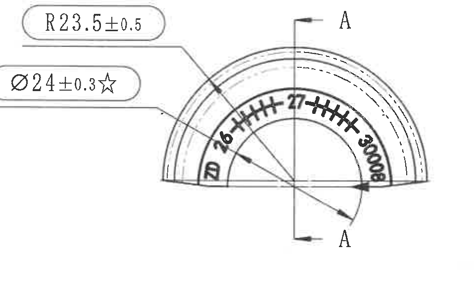

原图位置/视图名称：第 1 页上中偏右，弧形衬套主视图，含 A-A 剖切位置。

| 提取项 | 原图数值或文本 | 含义说明 |
|---|---|---|
| 外圆/弧面半径 | R23.5±0.5 | 主视图左上引线指向外弧轮廓，表示外弧半径及公差。 |
| 内孔/配合直径关键尺寸 | Ø24±0.3☆ | 主视图左侧引线指向内弧/配合区域，直径 24，公差 ±0.3，星号表示关键特性。 |
| 剖切基准 | A-A | 竖向剖切线穿过弧形件中心，两端标注 A，箭头表示剖视方向；对应 object_6。 |
| 弧面永久标识 | 可见字符：20、6、27、30008 | 弧面内侧沿弧排列的标识/刻字内容；属于产品表面永久标识的一部分。 |
| 轮廓线 | 多条同心实线/虚线 | 表示弧形衬套外形、内孔和内部/背面轮廓。 |

边界归属说明：右侧 A-A 剖面与本视图相邻但未纳入本对象。`R23.5±0.5`、`Ø24±0.3☆` 的完整引线、文字框和箭头均在本裁切内；剖切线文字 A 属于本主视图的剖切标识，对应剖面内容在 object_6 单独提取。

## object_6 A-A 剖面视图

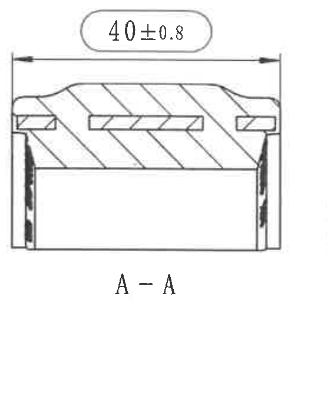

原图位置/视图名称：第 1 页上中右，A-A 剖面。

| 提取项 | 原图数值或文本 | 含义说明 |
|---|---|---|
| 剖面宽度 | 40±0.8 | A-A 剖面上方横向尺寸，表示剖面总宽/轴向宽度，公差 ±0.8。 |
| 剖面名称 | A-A | 对应 object_5 中 A-A 剖切线。 |
| 剖面线 | 斜向剖面线 | 表示剖切实体材料区域。 |
| 嵌件/骨架 | 剖面内可见矩形嵌件区域 | 表示塑料骨架/嵌件在橡胶截面中的位置。 |

边界归属说明：裁切完整包含 `40±0.8` 文字框、横向尺寸线、两侧箭头、两侧延长线和 “A-A” 标题；右侧局部印字视图未纳入本对象。

## object_7 右侧局部印字视图

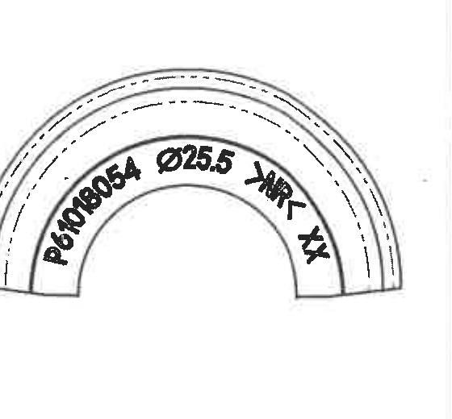

原图位置/视图名称：第 1 页右上区域，弧面局部印字视图。

| 提取项 | 原图数值或文本 | 含义说明 |
|---|---|---|
| 局部视图标识 | 弧形衬套局部视图 | 展示产品弧面永久标识的局部视图。 |
| 弧面标识 | P61018054 | 客户/图样标识，沿弧面排布。 |
| 直径标识 | Ø25.5 | 弧面标识中的直径规格，数值 25.5。 |
| 方向/位置标识 | YMR-；XX | 弧面永久标识内容的一部分，按原图可见字符还原。 |
| 轮廓线 | 外弧、内弧、虚线轮廓 | 表示弧形衬套外形及内部轮廓。 |

边界归属说明：裁切完整包含该局部视图的外弧、内弧和全部可见弧面印字；右侧图框坐标栏未纳入提取内容，左侧 A-A 剖面不归入本对象。

## object_8 NOTES / 技术要求

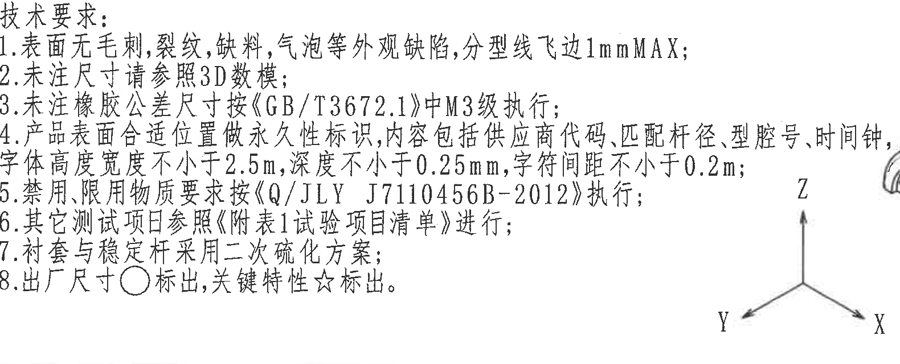

原图位置/视图名称：第 1 页中右下区域，技术要求。

| 提取项 | 原图数值或文本 | 含义说明 |
|---|---|---|
| 标题 | 技术要求: | 图纸通用技术要求。 |
| 1 | 表面无毛刺、裂纹、缺料、气泡等外观缺陷，分型线飞边1mmMAX； | 外观要求及分型线飞边最大值。 |
| 2 | 未注尺寸请参照3D数模； | 未标注尺寸以 3D 数模为依据。 |
| 3 | 未注橡胶公差尺寸按《GB/T3672.1》中M3级执行； | 未注橡胶尺寸公差按标准 M3 级。 |
| 4 | 产品表面合适位置做永久性标识，内容包括供应商代码、匹配杆径、型腔号、时间钟，字体高度宽度不小于2.5mm，深度不小于0.25mm，字符间距不小于0.2m； | 永久标识内容、字符尺寸和深度要求；原图末尾单位显示为 0.2m。 |
| 5 | 禁用限用物质要求按《Q/JLY J7110456B-2012》执行； | 限用物质要求。 |
| 6 | 其它测试项目参照《附表1试验项目清单》进行； | 其他测试项目引用附表。 |
| 7 | 衬套与稳定杆采用二次硫化方案； | 工艺方案。 |
| 8 | 出厂尺寸○标出，关键特性☆标出。 | 圆圈表示出厂尺寸，星号表示关键特性。 |

边界归属说明：技术要求右侧靠近图1产品定向，矩形裁切为保留第4条长行而接近图1左侧区域；本对象只提取 1-8 条技术要求，图1坐标轴和产品透视图归入 object_9。

## object_9 图1 产品定向

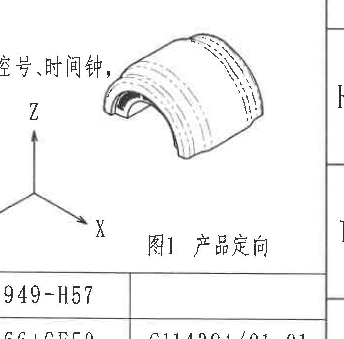

原图位置/视图名称：第 1 页右下中部，图1 产品定向。

| 提取项 | 原图数值或文本 | 含义说明 |
|---|---|---|
| 视图标题 | 图1 产品定向 | 产品坐标方向说明图。 |
| 坐标轴 | X、Y、Z | 右下箭头为 X，左下箭头为 Y，竖直向上箭头为 Z。 |
| 产品透视图 | 弧形衬套三维外形 | 表示衬套装配/标识方向与坐标轴的关系。 |

边界归属说明：左侧邻近技术要求长文本，裁切保留产品透视图、XYZ 坐标轴和标题；不将左侧技术要求文字归入本对象。下方明细表/标题栏不归入本对象。

## object_10 明细表 / 材料表

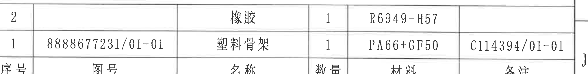

原图位置/视图名称：第 1 页右下标题栏上方，明细表/材料表。

原表还原：

| 序号 | 图号 | 名称 | 数量 | 材料 | 备注 |
|---|---|---|---|---|---|
| 2 |  | 橡胶 | 1 | R6949-H57 |  |
| 1 | 8888677231/01-01 | 塑料骨架 | 1 | PA66+GF50 | C114394/01-01 |

| 提取项 | 原图数值或文本 | 含义说明 |
|---|---|---|
| 材料-橡胶 | R6949-H57 | 序号 2 橡胶材料牌号。 |
| 塑料骨架图号 | 8888677231/01-01 | 序号 1 塑料骨架图号。 |
| 材料-塑料骨架 | PA66+GF50 | 序号 1 材料。 |
| 备注 | C114394/01-01 | 序号 1 备注/关联号。 |
| 数量 | 1；1 | 两项数量均为 1。 |

边界归属说明：裁切保留明细表两行物料及表头；上方图1标题和下方标题栏内容不作为本对象字段提取。

## object_11 标题栏

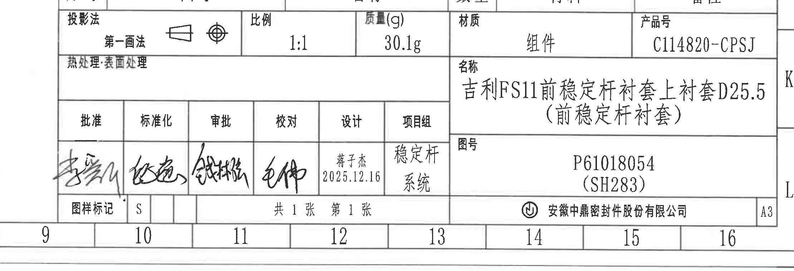

原图位置/视图名称：第 1 页右下角标题栏。

原表/栏位还原：

| 栏位 | 原图文本 |
|---|---|
| 投影法 | 第一画法；投影符号 |
| 比例 | 1:1 |
| 质量(g) | 30.1g |
| 材质 | 组件 |
| 产品号 | C114820-CPSJ |
| 热处理/表面处理 | 空白 |
| 名称 | 吉利FS11前稳定杆衬套上衬套D25.5（前稳定杆衬套） |
| 图号 | P61018054（SH283） |
| 批准 | 手写签名 |
| 标准化 | 手写签名 |
| 审批 | 手写签名 |
| 校对 | 手写签名 |
| 设计 | 蒋子杰 2025.12.16 |
| 项目组 | 稳定杆系统 |
| 图样标记 | S |
| 页数 | 共 1 张 第 1 张 |
| 公司 | 安徽中鼎密封件股份有限公司 |
| 图幅 | A3 |

| 提取项 | 原图数值或文本 | 含义说明 |
|---|---|---|
| 产品号 | C114820-CPSJ | 标题栏产品编号。 |
| 名称中的规格 | D25.5 | 标题栏名称中的直径/规格标识。 |
| 图号 | P61018054（SH283） | 本图图号和括号内编号。 |
| 比例 | 1:1 | 图样绘图比例。 |
| 质量 | 30.1g | 产品质量。 |
| 材质 | 组件 | 组件级图纸。 |
| 设计日期 | 2025.12.16 | 设计栏日期。 |
| 图幅 | A3 | 图纸幅面。 |

边界归属说明：裁切完整包含右下标题栏主体、签名栏、页码和公司名；左侧/底部 9-16 坐标格为图框定位参照，不作为标题栏业务字段。上方明细表物料行已单独归入 object_10。

## 裁切检查记录

| object_id | object_kind | 图片路径 | 检查结果 |
|---|---|---|---|
| object_1 | table | outputs/20C114820_assets/images/object_1.png | 完整包含修订履历表表头、数据行和外边框；含图框坐标参照，未作为字段提取。 |
| object_2 | table | outputs/20C114820_assets/images/object_2.png | 完整包含附表1标题、表头、两行记录和外边框；无文字被裁。 |
| object_3 | view | outputs/20C114820_assets/images/object_3.png | 完整包含图2外框、F 箭头、示意结构和图题；无尺寸线缺失。 |
| object_4 | table | outputs/20C114820_assets/images/object_4.png | 完整包含附表2表头、全部行列和底部“粘接试验”行；底部少量坐标栏仅为边界参照。 |
| object_5 | view | outputs/20C114820_assets/images/object_5.png | 完整包含 R23.5±0.5、Ø24±0.3☆、引线、箭头、A-A 剖切线和弧面标识；未提取相邻剖面内容。 |
| object_6 | section | outputs/20C114820_assets/images/object_6.png | 重新裁切后完整包含 40±0.8、尺寸线、箭头、延长线和 A-A 标题；未带入右侧局部视图。 |
| object_7 | detail | outputs/20C114820_assets/images/object_7.png | 完整包含局部弧面轮廓和可见印字 P61018054、Ø25.5、YMR-、XX；未提取图框坐标栏。 |
| object_8 | notes | outputs/20C114820_assets/images/object_8.png | 完整包含技术要求 1-8 条；右侧邻近图1但提取内容严格限于技术要求。 |
| object_9 | view | outputs/20C114820_assets/images/object_9.png | 完整包含产品透视图、XYZ 坐标轴和“图1 产品定向”；未归入技术要求或标题栏。 |
| object_10 | table | outputs/20C114820_assets/images/object_10.png | 重新裁切后完整包含明细表两行物料和表头；与标题栏字段分开。 |
| object_11 | title_block | outputs/20C114820_assets/images/object_11.png | 重新裁切后完整包含标题栏、签名区、图号、产品号、名称、页码和公司名；坐标格仅作边界参照。 |
