# 20C114821.pdf 内容识别结果

整页 PNG：`20C114821_assets/images/page_1.png`  
整页尺寸：4959 x 3505 px  
bbox 记录格式：`[x, y, width, height]`，坐标原点为整页 PNG 左上角。

## object_1：表3.关键信息

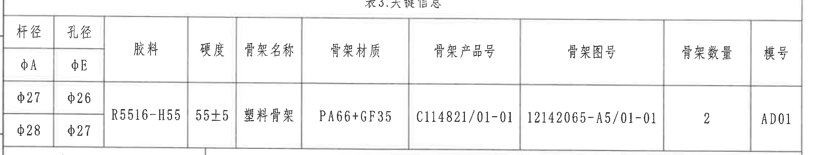

原图位置/视图名称：页面左上区域，表3.关键信息，bbox `[378, 190, 2268, 435]`。

原表还原：

| 杆径 | 孔径 | 胶料 | 硬度 | 骨架名称 | 骨架材质 | 骨架产品号 | 骨架图号 | 骨架数量 | 模号 |
|---|---|---|---|---|---|---|---|---|---|
| φA | φE |  |  |  |  |  |  |  |  |
| φ27 | φ26 | R5516-H55 | 55±5 | 塑料骨架 | PA66+GF35 | C114821/01-01 | 12142065-A5/01-01 | 2 | AD01 |
| φ28 | φ27 |  |  |  |  |  |  |  |  |

提取表格：

| 提取项 | 原图数值或文本 | 含义说明 |
|---|---|---|
| 表名 | 表3.关键信息 | 该表列出橡胶、骨架和杆/孔径组合的关键基础信息。 |
| 杆径 | φA；组合值 φ27、φ28 | φA 为杆径代号；下方两行给出两种杆径规格。 |
| 孔径 | φE；组合值 φ26、φ27 | φE 为孔径代号；下方两行给出与杆径对应的孔径规格。 |
| 胶料 | R5516-H55 | 橡胶材料牌号/胶料标识。 |
| 硬度 | 55±5 | 橡胶硬度要求；与技术要求第1条一致。 |
| 骨架名称 | 塑料骨架 | 骨架零件名称。 |
| 骨架材质 | PA66+GF35 | 骨架材料为玻纤增强 PA66。 |
| 骨架产品号 | C114821/01-01 | 骨架产品号。 |
| 骨架图号 | 12142065-A5/01-01 | 骨架图纸编号。 |
| 骨架数量 | 2 | 每总成中的骨架数量。 |
| 模号 | AD01 | 模具/模号标识。 |

边界归属说明：该裁切只包含表3主体行列；上侧页格编号和下侧相邻表格线已排除。杆径/孔径中的 φ 符号属于本表字段，不属于中部加工视图的尺寸标注。

## object_2：表2.异响实验要求

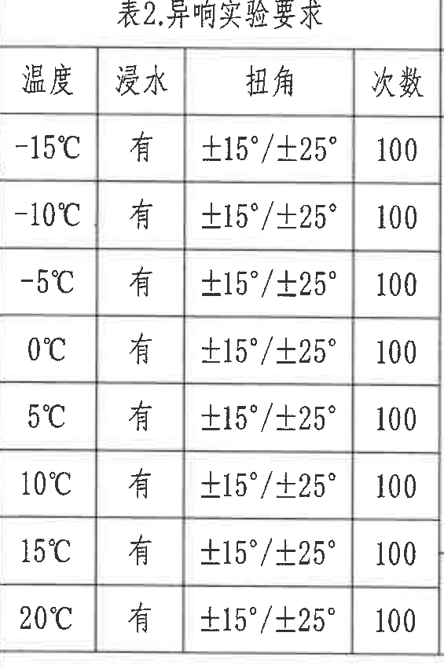

原图位置/视图名称：页面左上偏中，表2.异响实验要求，bbox `[390, 628, 565, 852]`。

原表还原：

| 温度 | 浸水 | 扭角 | 次数 |
|---|---|---|---|
| -15℃ | 有 | ±15°/±25° | 100 |
| -10℃ | 有 | ±15°/±25° | 100 |
| -5℃ | 有 | ±15°/±25° | 100 |
| 0℃ | 有 | ±15°/±25° | 100 |
| 5℃ | 有 | ±15°/±25° | 100 |
| 10℃ | 有 | ±15°/±25° | 100 |
| 15℃ | 有 | ±15°/±25° | 100 |
| 20℃ | 有 | ±15°/±25° | 100 |

提取表格：

| 提取项 | 原图数值或文本 | 含义说明 |
|---|---|---|
| 温度条件 | -15℃、-10℃、-5℃、0℃、5℃、10℃、15℃、20℃ | 异响试验覆盖的环境温度点。 |
| 浸水 | 有 | 每个温度条件均要求浸水。 |
| 扭角 | ±15°/±25° | 扭转角度条件；正负角度均需评价。 |
| 次数 | 100 | 每个温度条件下的试验次数。 |

边界归属说明：该对象只包含表2行列；右侧相邻的表1内容未纳入提取。所有角度和次数均归属异响实验要求，不归入加工视图尺寸。

## object_3：表1.刚度实验要求

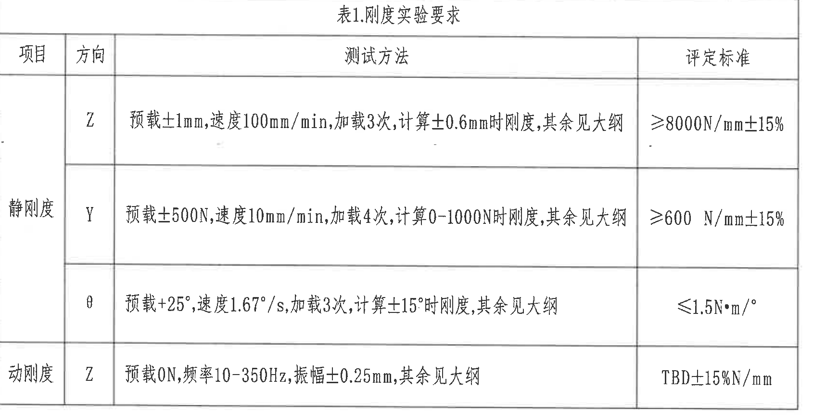

原图位置/视图名称：页面左上偏中，表1.刚度实验要求，bbox `[955, 622, 1690, 862]`。

原表还原：

| 项目 | 方向 | 测试方法 | 评定标准 |
|---|---|---|---|
| 静刚度 | Z | 预载±1mm,速度100mm/min,加载3次,计算±0.6mm时刚度,其余见大纲 | ≥8000N/mm±15% |
| 静刚度 | Y | 预载±500N,速度10mm/min,加载4次,计算0-1000N时刚度,其余见大纲 | ≥600 N/mm±15% |
| 静刚度 | θ | 预载+25°,速度1.67°/s,加载3次,计算±15°时刚度,其余见大纲 | ≤1.5N·m/° |
| 动刚度 | Z | 预载0N,频率10-350Hz,振幅±0.25mm,其余见大纲 | TBD±15%N/mm |

提取表格：

| 提取项 | 原图数值或文本 | 含义说明 |
|---|---|---|
| 静刚度 Z | 预载±1mm；速度100mm/min；加载3次；计算±0.6mm时刚度；≥8000N/mm±15% | Z 向静刚度试验方法及合格判定。 |
| 静刚度 Y | 预载±500N；速度10mm/min；加载4次；计算0-1000N时刚度；≥600 N/mm±15% | Y 向静刚度试验方法及合格判定。 |
| 静刚度 θ | 预载+25°；速度1.67°/s；加载3次；计算±15°时刚度；≤1.5N·m/° | 扭转方向刚度试验方法及扭矩/角度限值。 |
| 动刚度 Z | 预载0N；频率10-350Hz；振幅±0.25mm；TBD±15%N/mm | Z 向动态刚度试验方法；判定值待定并带 ±15% 公差范围。 |

边界归属说明：该对象覆盖表1完整外框。左侧项目列“静刚度/动刚度”属于表1；左邻表2仅有边界相邻，不参与本对象提取。

## object_4：变更履历表

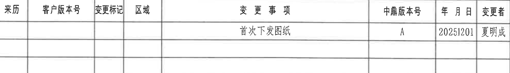

原图位置/视图名称：页面右上区域，变更履历表，bbox `[2795, 165, 1985, 285]`。

原表还原：

| 来历 | 客户版本号 | 变更标记 | 区域 | 变更事项 | 中鼎版本号 | 年月日 | 变更者 |
|---|---|---|---|---|---|---|---|
|  |  |  |  | 首次下发图纸 | A | 20251201 | 夏明成 |
|  |  |  |  |  |  |  |  |
|  |  |  |  |  |  |  |  |

提取表格：

| 提取项 | 原图数值或文本 | 含义说明 |
|---|---|---|
| 变更事项 | 首次下发图纸 | 当前版本的变更说明。 |
| 中鼎版本号 | A | 中鼎内部版本。 |
| 年月日 | 20251201 | 变更日期。 |
| 变更者 | 夏明成 | 变更人员。 |
| 来历/客户版本号/变更标记/区域 | 空白 | 原表对应列未填写。 |

边界归属说明：该裁切只包含变更履历表主体；右侧图框坐标字母和下方空白绘图区未作为表格内容提取。

## object_5：主视图/正视加工视图

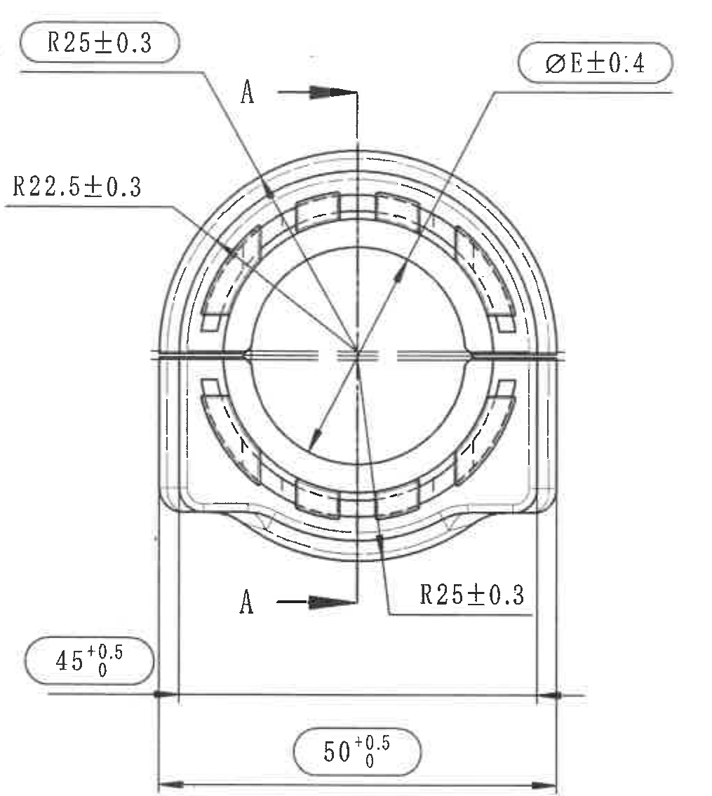

原图位置/视图名称：页面中右部，正视加工视图，bbox `[2760, 850, 1015, 1135]`。

提取表格：

| 提取项 | 原图数值或文本 | 含义说明 |
|---|---|---|
| 半径尺寸 | R25±0.3（上左侧圆角长圆框） | 外侧弧面/圆弧半径，带 ±0.3 公差；圆角长圆框表示出厂检验尺寸。 |
| 半径尺寸 | R22.5±0.3（左侧引出） | 内侧弧线/弧面半径，带 ±0.3 公差。 |
| 半径尺寸 | R25±0.3（下右侧引出） | 下部对应弧面半径，带 ±0.3 公差。 |
| 直径尺寸 | ØE±0.4（上右侧圆角长圆框） | 孔径/内径代号 E，直径公差 ±0.4；圆角长圆框表示出厂检验尺寸。 |
| 水平尺寸 | 45 +0.5/0（左下圆角长圆框） | 视图左、右立边之间的局部宽度尺寸；上偏差 +0.5、下偏差 0；圆角长圆框表示出厂检验尺寸。 |
| 水平总宽 | 50 +0.5/0（底部圆角长圆框） | 主视图底部整体宽度；上偏差 +0.5、下偏差 0；圆角长圆框表示出厂检验尺寸。 |
| 剖切标识 | A - A，两处箭头及字母 A | 指示 A-A 剖面位置和观察方向；尺寸归属剖切标识，不是基准尺寸。 |
| 星号/T 编号 | 未见星号关键尺寸；未见 T 编号 | 本视图没有星号尺寸和 T 编号。 |
| 括号内参考尺寸 | 未见 | 本主视图没有括号内参考尺寸。 |
| 弧长/弧向尺寸 | 未见单独弧长或弧向尺寸标注 | 本视图仅见半径 R 标注，未见弧长尺寸。 |

边界归属说明：该裁切包含主视图全部尺寸线、箭头、圆角长圆框尺寸和 A-A 剖切标识。右侧 A-A 剖面没有纳入该对象；剖面中的 46、45、40±0.4、R4、R6.5、25.25±0.3 等尺寸不归属主视图。

## object_6：A-A 剖面视图

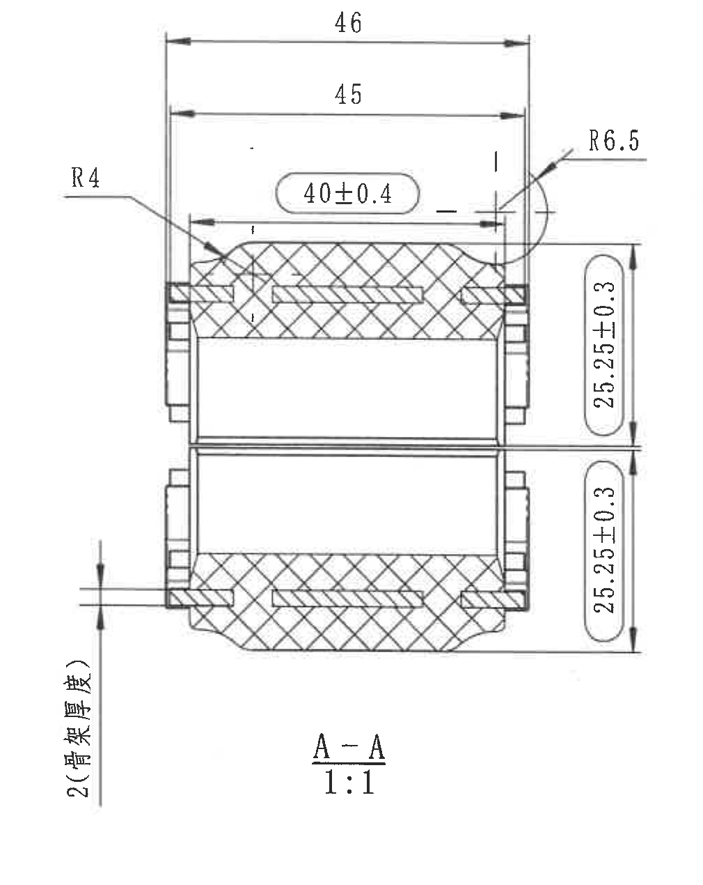

原图位置/视图名称：页面右中部，A-A 剖面视图，bbox `[3740, 720, 1010, 1270]`。

提取表格：

| 提取项 | 原图数值或文本 | 含义说明 |
|---|---|---|
| 剖面名称 | A-A | 对应主视图中的 A-A 剖切位置。 |
| 比例 | 1:1 | 剖面视图比例。 |
| 顶部总宽 | 46 | 剖面最外侧宽度尺寸。 |
| 顶部内宽 | 45 | 剖面内侧宽度尺寸。 |
| 局部宽度 | 40±0.4（圆角长圆框） | 上部槽/内侧结构宽度，带 ±0.4 公差；圆角长圆框表示出厂检验尺寸。 |
| 圆角半径 | R4 | 左上区域圆角半径。 |
| 圆角半径 | R6.5 | 右上外侧圆角半径。 |
| 竖向尺寸 | 25.25±0.3（上部圆角长圆框） | 上半段高度/厚度方向尺寸，带 ±0.3 公差；圆角长圆框表示出厂检验尺寸。 |
| 竖向尺寸 | 25.25±0.3（下部圆角长圆框） | 下半段高度/厚度方向尺寸，带 ±0.3 公差；圆角长圆框表示出厂检验尺寸。 |
| 骨架厚度 | 2(骨架厚度) | 左下竖向标注，括号内“骨架厚度”为参考说明文字，表示数值 2 对应骨架厚度。 |
| 星号/T 编号 | 未见星号关键尺寸；未见 T 编号 | 本剖面未出现星号或 T 编号。 |
| 弧长/弧向尺寸 | 未见单独弧长或弧向尺寸标注 | 本剖面仅见 R4、R6.5 半径标注。 |

边界归属说明：该裁切完整包含 A-A 剖面轮廓、剖面填充、顶部/右侧/左侧尺寸线和文字。主视图的 A-A 箭头只作为剖面来源，不纳入本剖面尺寸提取；右侧图框坐标线不作为对象内容。

## object_7：技术要求 NOTES

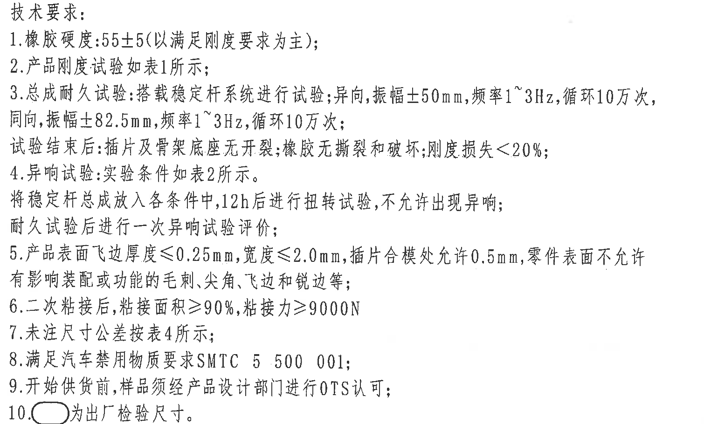

原图位置/视图名称：页面左中区域，技术要求/NOTES，bbox `[430, 1680, 1510, 910]`。

原文还原：

| 序号 | 原图文本 |
|---|---|
| 1 | 橡胶硬度:55±5(以满足刚度要求为主); |
| 2 | 产品刚度试验如表1所示; |
| 3 | 总成耐久试验:搭载稳定杆系统进行试验;异向,振幅±50mm,频率1~3Hz,循环10万次, 同向,振幅±82.5mm,频率1~3Hz,循环10万次; 试验结束后:插件及骨架底座无开裂,橡胶无撕裂和破坏;刚度损失<20%; |
| 4 | 异响试验:实验条件如表2所示。将稳定杆总成放入各条件中,12h后进行扭转试验,不允许出现异响; 耐久试验后进行一次异响试验评价; |
| 5 | 产品表面飞边厚度≤0.25mm,宽度≤2.0mm,插件合模处允许0.5mm,零件表面不允许有影响装配或功能的毛刺,尖角,飞边和锐边等; |
| 6 | 二次粘接后,粘接面积≥90%,粘接力≥9000N |
| 7 | 未注尺寸公差按表4所示; |
| 8 | 满足汽车禁用物质要求SMTC 5 500 001; |
| 9 | 开始供货前,样品须经产品设计部门进行OTS认可; |
| 10 | （圆角长圆框符号）为出厂检验尺寸。 |

提取表格：

| 提取项 | 原图数值或文本 | 含义说明 |
|---|---|---|
| 橡胶硬度 | 55±5(以满足刚度要求为主) | 硬度要求；括号内为优先满足刚度要求的参考说明。 |
| 刚度试验引用 | 表1 | 产品刚度试验条件按表1执行。 |
| 耐久试验-异向 | 振幅±50mm，频率1~3Hz，循环10万次 | 稳定杆系统异向耐久试验条件。 |
| 耐久试验-同向 | 振幅±82.5mm，频率1~3Hz，循环10万次 | 稳定杆系统同向耐久试验条件。 |
| 耐久后判定 | 插件及骨架底座无开裂；橡胶无撕裂和破坏；刚度损失<20% | 耐久试验完成后的外观/刚度判定要求。 |
| 异响试验引用 | 表2；12h 后扭转试验；不允许出现异响 | 异响试验条件和判定要求。 |
| 飞边/毛刺 | 飞边厚度≤0.25mm，宽度≤2.0mm；插件合模处允许0.5mm | 表面质量和合模处允许量。 |
| 粘接要求 | 粘接面积≥90%，粘接力≥9000N | 二次粘接后的面积和力值要求。 |
| 未注尺寸公差 | 表4 | 未标注尺寸公差按表4执行。 |
| 禁用物质要求 | SMTC 5 500 001 | 材料/物质限制规范。 |
| OTS 认可 | 产品设计部门进行 OTS 认可 | 开始供货前的样品认可要求。 |
| 出厂检验尺寸标识 | 圆角长圆框符号 | 图中被圆角长圆框圈出的尺寸为出厂检验尺寸。 |

边界归属说明：该裁切仅包含技术要求文字，未提取中部或下部视图线条。第10条中的圆角长圆框符号用于解释主视图和剖面视图中同样框出的尺寸。

## object_8：表4.公差标准

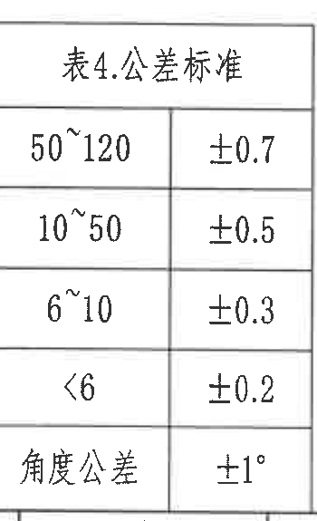

原图位置/视图名称：页面左下区域，表4.公差标准，bbox `[390, 2755, 350, 575]`。

原表还原：

| 尺寸范围/项目 | 公差 |
|---|---|
| 50~120 | ±0.7 |
| 10~50 | ±0.5 |
| 6~10 | ±0.3 |
| <6 | ±0.2 |
| 角度公差 | ±1° |

提取表格：

| 提取项 | 原图数值或文本 | 含义说明 |
|---|---|---|
| 未注线性尺寸公差 | 50~120：±0.7 | 未单独标注公差的 50~120 尺寸范围适用。 |
| 未注线性尺寸公差 | 10~50：±0.5 | 未单独标注公差的 10~50 尺寸范围适用。 |
| 未注线性尺寸公差 | 6~10：±0.3 | 未单独标注公差的 6~10 尺寸范围适用。 |
| 未注线性尺寸公差 | <6：±0.2 | 未单独标注公差的小于 6 尺寸适用。 |
| 未注角度公差 | ±1° | 未单独标注公差的角度尺寸适用。 |

边界归属说明：该对象只包含表4公差标准；底部图框页码未作为表格内容提取。表4用于技术要求第7条所述未注尺寸公差。

## object_9：轴测视图

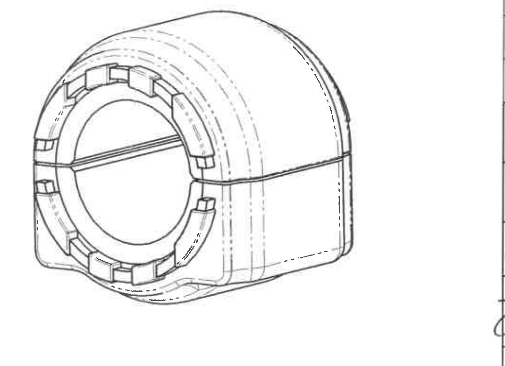

原图位置/视图名称：页面下中区域，轴测视图，bbox `[1705, 2520, 1070, 775]`。

提取表格：

| 提取项 | 原图数值或文本 | 含义说明 |
|---|---|---|
| 视图类型 | 轴测视图 | 展示衬套总成外形、开口、内孔、外侧圆弧和侧面轮廓。 |
| 可见结构 | 环形内孔、外圆弧壳体、侧向切缝/分型线、周向窗口/卡槽、虚线隐藏轮廓 | 用于辅助理解三维结构，不含单独尺寸数值。 |
| 尺寸/公差 | 未见独立尺寸、角度、公差、T 编号或基准字母 | 该视图没有单独标注尺寸；尺寸以主视图和 A-A 剖面为准。 |
| 括号内参考尺寸 | 未见 | 轴测图未标出参考尺寸。 |

边界归属说明：该裁切只包含轴测图外形，不包含左侧技术要求、左下公差表或右下标题栏。轴测图中的虚线为隐藏轮廓，不作为尺寸线提取。

## object_10：明细表/BOM

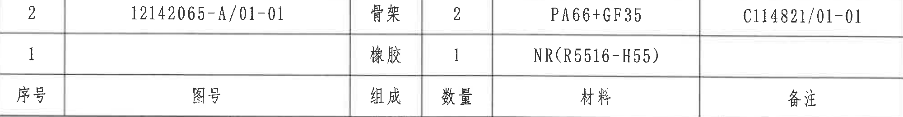

原图位置/视图名称：页面右下上部，明细表/BOM，bbox `[2775, 2480, 2000, 260]`。

原表还原：

| 序号 | 图号 | 组成 | 数量 | 材料 | 备注 |
|---|---|---|---|---|---|
| 2 | 12142065-A/01-01 | 骨架 | 2 | PA66+GF35 | C114821/01-01 |
| 1 |  | 橡胶 | 1 | NR(R5516-H55) |  |

提取表格：

| 提取项 | 原图数值或文本 | 含义说明 |
|---|---|---|
| BOM 行 2 | 序号2；图号12142065-A/01-01；组成骨架；数量2；材料PA66+GF35；备注C114821/01-01 | 骨架件明细。 |
| BOM 行 1 | 序号1；图号空白；组成橡胶；数量1；材料NR(R5516-H55)；备注空白 | 橡胶件明细；括号内 R5516-H55 为胶料牌号说明。 |
| 数量前缀/数量字段 | 2、1 | 表示总成内对应组成件数量。 |

边界归属说明：该对象只包含明细表两条物料记录和表头；下方投影法、比例、名称、图号等标题栏字段不归入 BOM 内容。

## object_11：标题栏

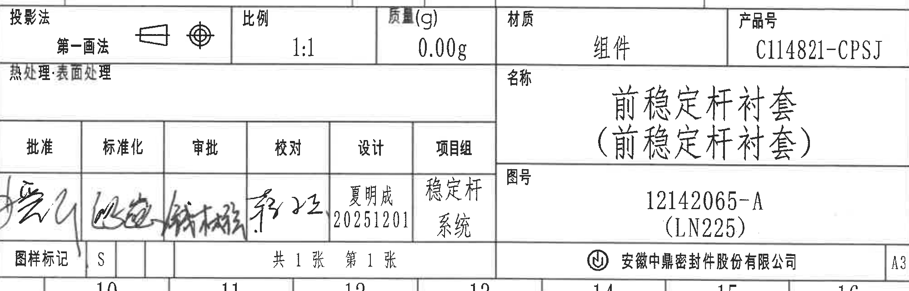

原图位置/视图名称：页面右下区域，标题栏，bbox `[2775, 2725, 2000, 640]`。

原表还原：

| 字段 | 原图文本 |
|---|---|
| 投影法 | 第一画法 |
| 比例 | 1:1 |
| 质量(g) | 0.00g |
| 材质 | 组件 |
| 产品号 | C114821-CPSJ |
| 热处理/表面处理 | 空白 |
| 名称 | 前稳定杆衬套（前稳定杆衬套） |
| 图号 | 12142065-A（LN225） |
| 批准 | 签名 |
| 标准化 | 签名 |
| 审批 | 签名 |
| 校对 | 签名 |
| 设计 | 夏明成 20251201 |
| 项目组 | 稳定杆系统 |
| 图样标记 | S |
| 页数 | 共1张 第1张 |
| 公司 | 安徽中鼎密封件股份有限公司 |
| 图幅 | A3 |

提取表格：

| 提取项 | 原图数值或文本 | 含义说明 |
|---|---|---|
| 投影法 | 第一画法 | 图纸采用第一角投影法。 |
| 比例 | 1:1 | 视图比例。 |
| 质量 | 0.00g | 标题栏质量字段。 |
| 材质 | 组件 | 总成级材质/类别字段。 |
| 产品号 | C114821-CPSJ | 产品编号。 |
| 名称 | 前稳定杆衬套（前稳定杆衬套） | 零件/总成名称；括号内为重复名称说明。 |
| 图号 | 12142065-A（LN225） | 图纸编号；括号内 LN225 为平台/项目代号。 |
| 设计 | 夏明成 20251201 | 设计人员和日期。 |
| 项目组 | 稳定杆系统 | 项目组名称。 |
| 图样标记 | S | 图样标记。 |
| 页数 | 共1张 第1张 | 当前图纸共 1 张，本页为第 1 张。 |
| 公司 | 安徽中鼎密封件股份有限公司 | 出图单位。 |
| 图幅 | A3 | 图纸幅面。 |

边界归属说明：该裁切覆盖标题栏完整字段；上缘与明细表边界相邻，明细表的两条物料记录已单独归入 object_10。右侧图框坐标字母未作为标题栏字段提取。

## 裁切检查记录

| 对象 | 图片路径 | 检查结论 |
|---|---|---|
| object_1 | `outputs/20C114821_assets/images/object_1.png` | 完整包含表3标题、表头、两行杆径/孔径及合并字段；未截断文字。 |
| object_2 | `outputs/20C114821_assets/images/object_2.png` | 完整包含表2标题、表头和 8 行试验条件；未混入表1内容。 |
| object_3 | `outputs/20C114821_assets/images/object_3.png` | 完整包含表1标题、表头、静刚度/动刚度行和评定标准；左侧项目列完整。 |
| object_4 | `outputs/20C114821_assets/images/object_4.png` | 完整包含变更履历表头和版本 A 记录；右侧坐标栏未提取为表格字段。 |
| object_5 | `outputs/20C114821_assets/images/object_5.png` | 主视图所有尺寸线、箭头、R/Ø标注、圆角长圆框尺寸和 A-A 剖切标识完整；未包含 A-A 剖面尺寸。 |
| object_6 | `outputs/20C114821_assets/images/object_6.png` | A-A 剖面所有尺寸线、箭头、剖面文字、R4、R6.5、25.25±0.3 和 2(骨架厚度) 完整；未把主视图尺寸归入剖面。 |
| object_7 | `outputs/20C114821_assets/images/object_7.png` | 技术要求 1-10 条完整；第10条圆角长圆框符号和文字未截断。 |
| object_8 | `outputs/20C114821_assets/images/object_8.png` | 表4标题、全部公差行和角度公差完整；未提取底部页码。 |
| object_9 | `outputs/20C114821_assets/images/object_9.png` | 轴测图外形和隐藏线完整；无独立尺寸文字需补裁。 |
| object_10 | `outputs/20C114821_assets/images/object_10.png` | 明细表两条物料记录和表头完整；标题栏字段不归入本对象。 |
| object_11 | `outputs/20C114821_assets/images/object_11.png` | 标题栏字段完整包含；右侧图框坐标未作为字段提取。 |
