# 20C114822 图纸内容识别

整页渲染图：

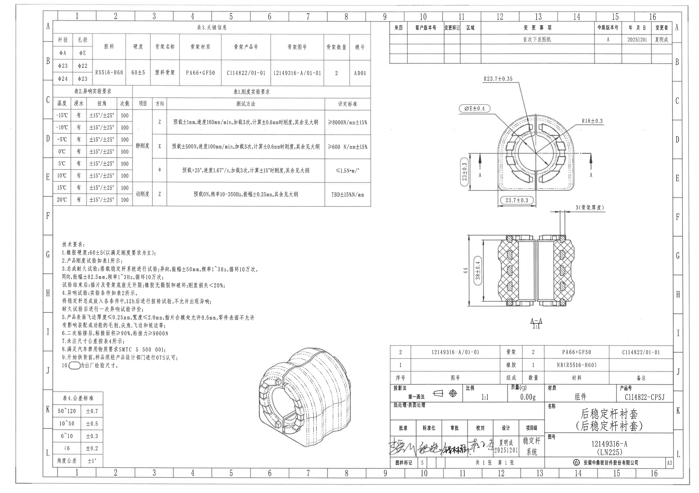

说明：以下内容按原图对象分区排列；每个裁切对象均包含裁切图片、原图位置/视图名称、提取表格和边界归属说明。括号内说明、参考/检验含义、直径符号、角度、半径、数量和公差均按图中可见内容提取。

## object_1 - 主加工视图（右上，正视/端面视图）

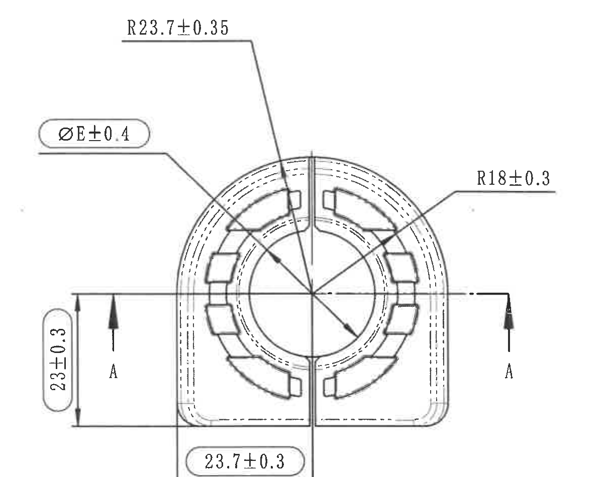

- 原图位置/视图名称：主加工视图（右上，正视/端面视图），page 1，bbox [3180, 505, 4390, 1455]
- 边界归属说明：裁切覆盖完整主视图轮廓、引线、箭头、A-A 剖切标识和主视图尺寸文字。由于主视图底部 23.7±0.3 与下方剖视图的 3(骨架厚度) 在原图上相邻，裁切下边界贴近底部尺寸线；任何可见下方相邻信息均不归属主视图。

### 提取表

| 提取项 | 原图数值或文本 | 含义说明 |
| --- | --- | --- |
| R23.7±0.35 | 上方引线标注到外侧顶部圆弧 | 外轮廓顶部圆角半径，公差 ±0.35。 |
| ØE±0.4 | 左上气泡框引线指向内圈/孔径代号 E | 直径 E 的尺寸控制，具体名义值由表 3 中孔径 φE 对应。公差 ±0.4。 |
| R18±0.3 | 右侧引线标注到内部圆弧 | 内侧圆弧半径，公差 ±0.3。 |
| 23±0.3 | 左侧竖向尺寸，带上下箭头 | 主视图左侧竖向高度尺寸，公差 ±0.3。 |
| 23.7±0.3 | 底部横向尺寸，带左右箭头 | 主视图底部宽度/跨距尺寸，公差 ±0.3。 |
| A-A / A、A | 水平剖切线两端箭头和字母 A | 表示沿 A-A 位置取得下方剖面视图。 |

### 文本/上下文

R23.7±0.35；ØE±0.4；R18±0.3；左侧高度 23±0.3；底部宽度 23.7±0.3；A-A 剖切位置标识 A、A。

右上主加工视图显示衬套端面、圆弧轮廓、孔径/内径代号和剖切线。底部 23.7±0.3 的尺寸文字完整，尺寸箭头靠近下缘；右下相邻的 3(骨架厚度) 属于下方 A-A 剖视图，不计入本视图提取项。

## object_2 - A-A 剖面视图（右中）

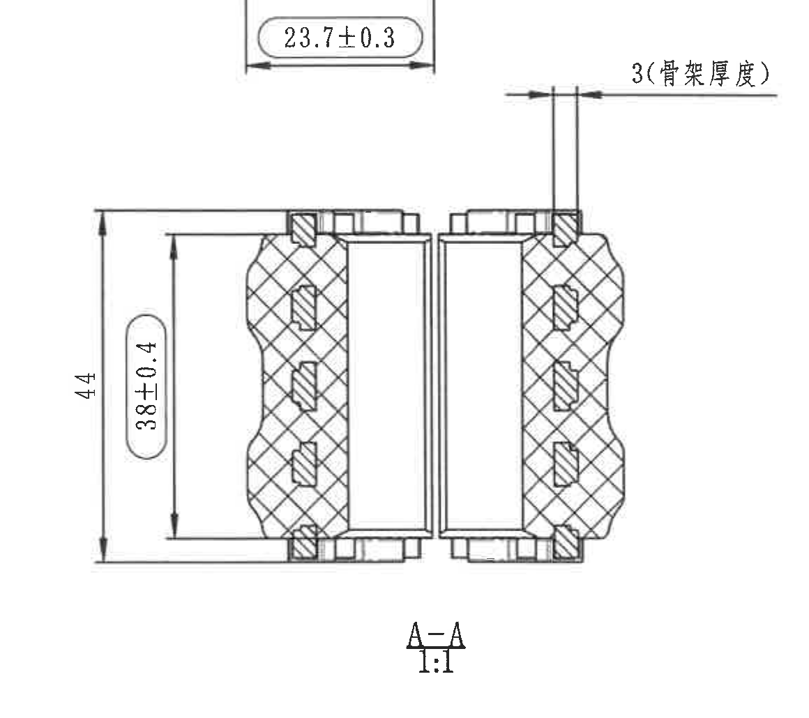

- 原图位置/视图名称：A-A 剖面视图（右中），page 1，bbox [3180, 1370, 4340, 2400]
- 边界归属说明：裁切完整包含 A-A 剖面、剖面名、比例、3(骨架厚度)、44 和 38±0.4 的尺寸线、箭头和文字。上缘可见主视图底部 23.7±0.3 是相邻视图片段，归属 object_1。

### 提取表

| 提取项 | 原图数值或文本 | 含义说明 |
| --- | --- | --- |
| 3(骨架厚度) | 剖视图上方横向厚度尺寸，带双箭头 | 骨架厚度为 3，括号说明该数值限定骨架厚度。 |
| 44 | 左侧外侧竖向总高度尺寸 | 剖面总体高度/外形高度。未标注独立公差，按表 4 未注尺寸公差处理。 |
| 38±0.4 | 左侧内侧竖向尺寸，圆角框标注 | 剖面内侧高度尺寸，公差 ±0.4。 |
| A-A | 剖面图下方名称 | 与主视图中的 A-A 剖切线对应。 |
| 1:1 | A-A 下方比例 | 剖面视图比例为 1:1。 |

### 文本/上下文

3(骨架厚度)；44；38±0.4；A-A；1:1。

A-A 剖面视图显示橡胶和骨架剖面结构，包含剖面高度、内侧高度和骨架厚度。裁切上缘带入主视图底部 23.7±0.3 片段，该尺寸归属主视图，不计入本剖视图。

## object_3 - 轴测局部视图（下中）

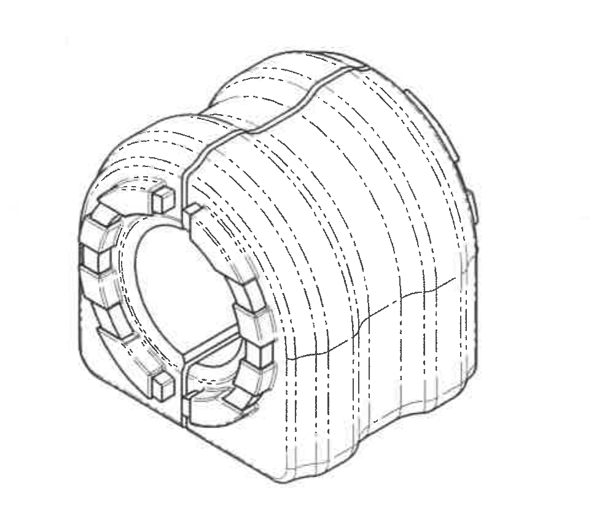

- 原图位置/视图名称：轴测局部视图（下中），page 1，bbox [1710, 2390, 2690, 3240]
- 边界归属说明：裁切只包含轴测图本体，不带入右侧标题栏内容；无边缘文字或尺寸线被裁掉。

### 提取表

| 提取项 | 原图数值或文本 | 含义说明 |
| --- | --- | --- |
| 轴测外观 | 三维视图轮廓和虚线 | 辅助理解主视图与剖视图中的外形、内孔和外侧弧面。 |
| 无尺寸 | 裁切区域内未见尺寸文字 | 不提取尺寸，仅作为结构示意。 |

### 文本/上下文

无新增尺寸标注；显示零件三维外观、端面块状结构、内孔和外侧波纹/弧面轮廓。

该局部轴测图用于表达零件整体形态和结构关系，未见独立尺寸文字、剖切编号或公差。

## object_4 - 表3.关键信息（左上）

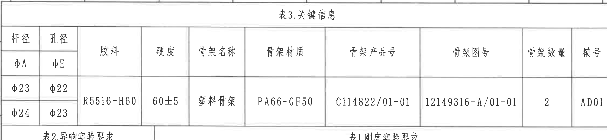

- 原图位置/视图名称：表3.关键信息（左上），page 1，bbox [370, 140, 2610, 660]
- 边界归属说明：裁切包含表 3 标题、全部列和两行规格。下缘可见相邻表 2/表 1 标题线，不归属表 3。

### 原表还原

| 杆径 φA | 孔径 φE | 胶料 | 硬度 | 骨架名称 | 骨架材质 | 骨架产品号 | 骨架图号 | 骨架数量 | 模号 |
| --- | --- | --- | --- | --- | --- | --- | --- | --- | --- |
| φ23 | φ22 | R5516-H60 | 60±5 | 塑料骨架 | PA66+GF50 | C114822/01-01 | 12149316-A/01-01 | 2 | AD01 |
| φ24 | φ23 | R5516-H60 | 60±5 | 塑料骨架 | PA66+GF50 | C114822/01-01 | 12149316-A/01-01 | 2 | AD01 |

### 提取表

| 提取项 | 原图数值或文本 | 含义说明 |
| --- | --- | --- |
| φA: φ23 / φ24 | 杆径列 | 杆径代号 A 的两个规格。 |
| φE: φ22 / φ23 | 孔径列 | 孔径代号 E 的两个规格，与主视图 ØE±0.4 关联。 |
| R5516-H60 | 胶料列 | 橡胶材料牌号。 |
| 60±5 | 硬度列 | 橡胶硬度要求，公差 ±5。 |
| PA66+GF50 | 骨架材质列 | 骨架材料。 |

### 文本/上下文

表3.关键信息：杆径 φA 包含 φ23、φ24；孔径 φE 包含 φ22、φ23；胶料 R5516-H60；硬度 60±5；骨架名称 塑料骨架；骨架材质 PA66+GF50；骨架产品号 C114822/01-01；骨架图号 12149316-A/01-01；骨架数量 2；模号 AD01。

关键物料与尺寸代号表。主视图中的 ØE±0.4 与本表孔径 φE 列对应；技术要求中的橡胶硬度与表中硬度 60±5 一致。

## object_5 - 表2.异响实验要求（左中）

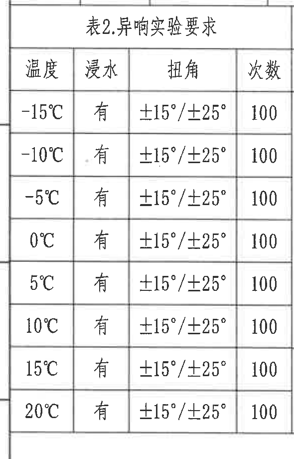

- 原图位置/视图名称：表2.异响实验要求（左中），page 1，bbox [355, 595, 945, 1515]
- 边界归属说明：裁切完整包含表 2 标题、表头和八行数据；右边界紧贴表 2 外框，未将表 1 的静/动刚度内容作为表 2 提取。

### 原表还原

| 温度 | 浸水 | 扭角 | 次数 |
| --- | --- | --- | --- |
| -15°C | 有 | ±15°/±25° | 100 |
| -10°C | 有 | ±15°/±25° | 100 |
| -5°C | 有 | ±15°/±25° | 100 |
| 0°C | 有 | ±15°/±25° | 100 |
| 5°C | 有 | ±15°/±25° | 100 |
| 10°C | 有 | ±15°/±25° | 100 |
| 15°C | 有 | ±15°/±25° | 100 |
| 20°C | 有 | ±15°/±25° | 100 |

### 提取表

| 提取项 | 原图数值或文本 | 含义说明 |
| --- | --- | --- |
| 温度范围 | -15°C 至 20°C | 异响实验在八个温度点进行。 |
| 浸水 | 有 | 每个温度点均为浸水条件。 |
| 扭角 | ±15°/±25° | 每个温度点均按两档扭转角执行。 |
| 次数 | 100 | 每个温度点执行 100 次。 |

### 文本/上下文

表2.异响实验要求：温度 -15°C、-10°C、-5°C、0°C、5°C、10°C、15°C、20°C；浸水均为 有；扭角均为 ±15°/±25°；次数均为 100。

异响实验条件表，技术要求第 4 条引用本表。温度覆盖 -15°C 到 20°C，所有条件均要求浸水、两档扭角和 100 次。

## object_6 - 表1.刚度实验要求（中上）

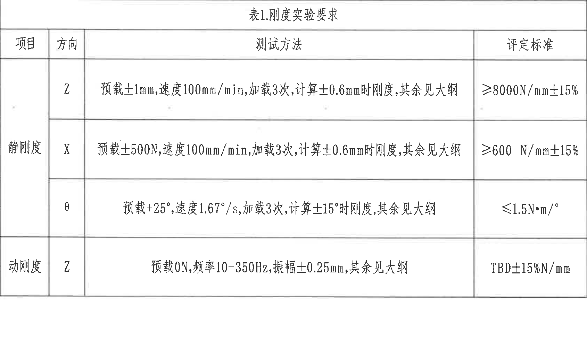

- 原图位置/视图名称：表1.刚度实验要求（中上），page 1，bbox [940, 610, 2630, 1620]
- 边界归属说明：裁切完整包含表 1 标题、表头和四条测试要求；左侧相邻表 2 未混入本表数据。

### 原表还原

| 项目 | 方向 | 测试方法 | 评定标准 |
| --- | --- | --- | --- |
| 静刚度 | Z | 预载±1mm，速度100mm/min，加载3次，计算±0.6mm时刚度，其余见大纲 | ≥8000N/mm±15% |
| 静刚度 | X | 预载±500N，速度100mm/min，加载3次，计算±0.6mm时刚度，其余见大纲 | ≥600 N/mm±15% |
| 静刚度 | θ | 预载±25°，速度1.67°/s，加载3次，计算±15°时刚度，其余见大纲 | ≤1.5N·m/° |
| 动刚度 | Z | 预载0N，频率10-350Hz，振幅±0.25mm，其余见大纲 | TBD±15%N/mm |

### 提取表

| 提取项 | 原图数值或文本 | 含义说明 |
| --- | --- | --- |
| 静刚度 Z | ≥8000N/mm±15% | Z 向静刚度验收标准。 |
| 静刚度 X | ≥600 N/mm±15% | X 向静刚度验收标准。 |
| 静刚度 θ | ≤1.5N·m/° | 扭转方向静刚度上限。 |
| 动刚度 Z | TBD±15%N/mm | Z 向动刚度标准待定，允许 ±15%。 |

### 文本/上下文

表1.刚度实验要求：静刚度 Z，预载±1mm，速度100mm/min，加载3次，计算±0.6mm时刚度，其余见大纲，评定标准 ≥8000N/mm±15%；静刚度 X，预载±500N，速度100mm/min，加载3次，计算±0.6mm时刚度，其余见大纲，评定标准 ≥600 N/mm±15%；静刚度 θ，预载±25°，速度1.67°/s，加载3次，计算±15°时刚度，其余见大纲，评定标准 ≤1.5N·m/°；动刚度 Z，预载0N，频率10-350Hz，振幅±0.25mm，其余见大纲，评定标准 TBD±15%N/mm。

产品刚度测试要求表，技术要求第 2 条引用。本表给出方向、预载、速度/频率/振幅、加载次数、计算点和评定标准。

## object_7 - 修订履历表（右上）

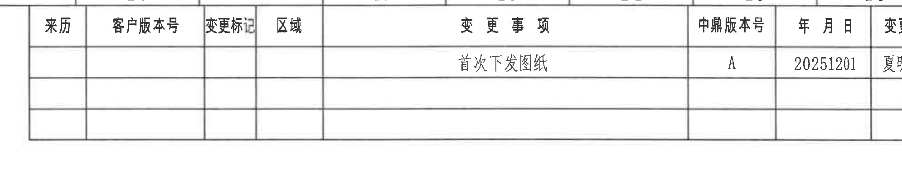

- 原图位置/视图名称：修订履历表（右上），page 1，bbox [2700, 140, 4690, 520]
- 边界归属说明：裁切包含修订表全部可见列和三行记录空间。右侧外框完整；未将下方主视图内容纳入。

### 原表还原

| 来历 | 客户版本号 | 变更标记 | 区域 | 变更事项 | 中鼎版本号 | 年月日 | 变更者 |
| --- | --- | --- | --- | --- | --- | --- | --- |
|  |  |  |  | 首次下发图纸 | A | 20251201 | 夏明成 |
|  |  |  |  |  |  |  |  |
|  |  |  |  |  |  |  |  |

### 提取表

| 提取项 | 原图数值或文本 | 含义说明 |
| --- | --- | --- |
| 首次下发图纸 | 变更事项列 | 首次发布/下发该图纸。 |
| A | 中鼎版本号列 | 内部版本号为 A。 |
| 20251201 | 年月日列 | 变更日期为 2025-12-01。 |
| 夏明成 | 变更者列 | 变更人员。 |

### 文本/上下文

修订履历表：列为 来历、客户版本号、变更标记、区域、变更事项、中鼎版本号、年月日、变更者。记录：变更事项 首次下发图纸；中鼎版本号 A；年月日 20251201；变更者 夏明成。其余同排前四列为空，ECN NO 未见单独列或记录。

图纸版本变更记录。用户要求示例列 REV、DESCRIPTION、LOC、BY、DATE、ECN NO；本图实际中文表头为来历/客户版本号/变更标记/区域/变更事项/中鼎版本号/年月日/变更者。

## object_8 - 技术要求 / NOTES（左下）

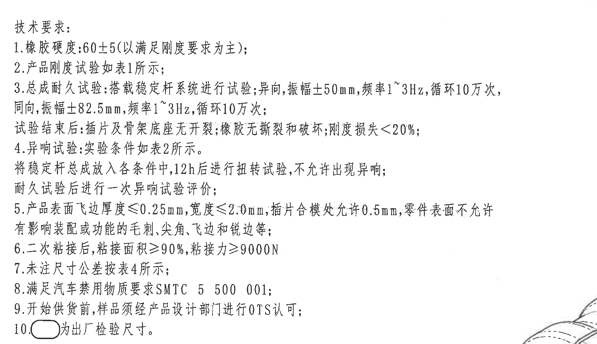

- 原图位置/视图名称：技术要求 / NOTES（左下），page 1，bbox [400, 1660, 2100, 2640]
- 边界归属说明：裁切包含技术要求 1-10 条完整文本。右下角仅有极少轴测图边缘靠近裁切外侧，不作为技术要求内容提取。

### 提取表

| 提取项 | 原图数值或文本 | 含义说明 |
| --- | --- | --- |
| 60±5 | 第 1 条 | 橡胶硬度要求，以满足刚度要求为主。 |
| 振幅±50mm / ±82.5mm | 第 3 条 | 总成耐久异向/同向试验振幅。 |
| 频率1~3Hz，循环10万次 | 第 3 条 | 耐久试验频率和循环次数。 |
| 刚度损失<20% | 第 3 条 | 耐久后性能损失限制。 |
| 12h | 第 4 条 | 各实验条件中放置 12 小时后进行扭转试验。 |
| ≤0.25mm / ≤2.0mm / 0.5mm | 第 5 条 | 飞边厚度、宽度和插片合模处允许值。 |
| ≥90% / ≥9000N | 第 6 条 | 二次粘接面积和粘接力要求。 |
| 圆角框 | 第 10 条 | 图中圆角框标注为出厂检验尺寸。 |

### 文本/上下文

技术要求：1.橡胶硬度:60±5(以满足刚度要求为主)；2.产品刚度试验如表1所示；3.总成耐久试验:搭载稳定杆系统进行试验,异向,振幅±50mm,频率1~3Hz,循环10万次,同向,振幅±82.5mm,频率1~3Hz,循环10万次；试验结束后:插片及骨架底座无开裂;橡胶无撕裂和破坏;刚度损失<20%；4.异响试验:实验条件如表2所示。将稳定杆总成放入各条件中,12h后进行扭转试验,不允许出现异响；耐久试验后进行一次异响试验评价；5.产品表面飞边厚度≤0.25mm,宽度≤2.0mm,插片合模处允许0.5mm,零件表面不允许有影响装配或功能的毛刺、尖角、飞边和锐边等；6.二次粘接后,粘接面积≥90%,粘接力≥9000N；7.未注尺寸公差按表4所示；8.满足汽车禁用物质要求SMTC 5 500 001；9.开始供货前,样品须经产品设计部门进行OTS认可；10.圆角框为出厂检验尺寸。

图纸技术要求文本，引用表 1、表 2、表 4，并定义圆角框标注为出厂检验尺寸。

## object_9 - 表4.公差标准（左下）

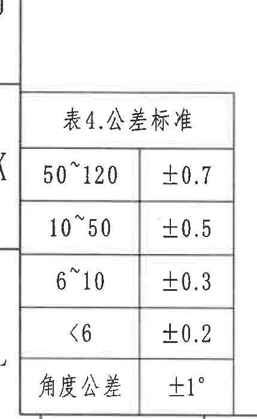

- 原图位置/视图名称：表4.公差标准（左下），page 1，bbox [340, 2630, 770, 3330]
- 边界归属说明：裁切完整包含表 4 标题和五行公差。左侧少量图框线/相邻区域边线可见，不属于表 4 内容。

### 原表还原

| 尺寸范围 | 公差 |
| --- | --- |
| 50~120 | ±0.7 |
| 10~50 | ±0.5 |
| 6~10 | ±0.3 |
| <6 | ±0.2 |
| 角度公差 | ±1° |

### 提取表

| 提取项 | 原图数值或文本 | 含义说明 |
| --- | --- | --- |
| 50~120 | ±0.7 | 未注线性尺寸 50 至 120 的公差。 |
| 10~50 | ±0.5 | 未注线性尺寸 10 至 50 的公差。 |
| 6~10 | ±0.3 | 未注线性尺寸 6 至 10 的公差。 |
| <6 | ±0.2 | 未注线性尺寸小于 6 的公差。 |
| 角度公差 | ±1° | 未注角度尺寸公差。 |

### 文本/上下文

表4.公差标准：50~120 ±0.7；10~50 ±0.5；6~10 ±0.3；<6 ±0.2；角度公差 ±1°。

未注尺寸公差表，技术要求第 7 条引用。角度公差为 ±1°。

## object_10 - 标题栏 / 明细栏（右下）

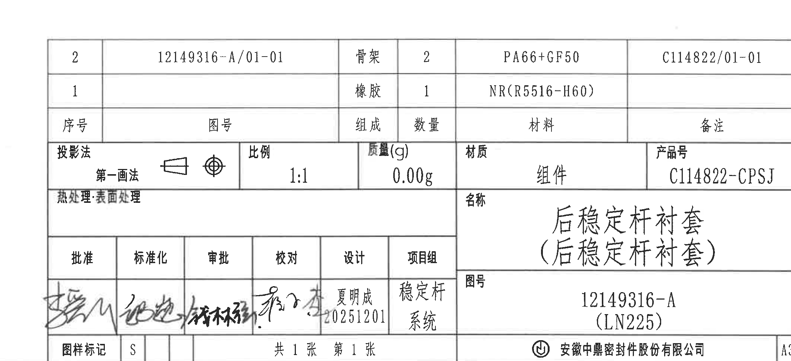

- 原图位置/视图名称：标题栏 / 明细栏（右下），page 1，bbox [2640, 2350, 4760, 3320]
- 边界归属说明：裁切包含标题栏主体、明细栏、底部公司/页数/图幅信息。右侧外边线附近无图纸字母栏内容作为标题栏字段提取。

### 提取表

| 提取项 | 原图数值或文本 | 含义说明 |
| --- | --- | --- |
| 序号2 | 12149316-A/01-01；骨架；2；PA66+GF50；C114822/01-01 | 骨架明细。 |
| 序号1 | 橡胶；1；NR(R5516-H60) | 橡胶明细。 |
| 第一画法 | 投影法 | 投影法标识。 |
| 1:1 | 比例 | 图纸比例。 |
| 0.00g | 质量(g) | 组件质量。 |
| C114822-CPSJ | 产品号 | 产品编号。 |
| 后稳定杆衬套（后稳定杆衬套） | 名称 | 零件/组件名称。 |
| 12149316-A (LN225) | 图号 | 图纸号。 |
| A3 | 图幅 | 图纸幅面。 |

### 文本/上下文

明细栏：序号2 图号12149316-A/01-01，组成骨架，数量2，材料PA66+GF50，备注C114822/01-01；序号1 组成橡胶，数量1，材料NR(R5516-H60)。投影法 第一画法；比例1:1；质量(g) 0.00g；材质 组件；产品号 C114822-CPSJ；热处理:表面处理；名称 后稳定杆衬套（后稳定杆衬套）；图号 12149316-A (LN225)；设计 夏明成 20251201；项目组 稳定杆系统；图样标记 S；共1张 第1张；公司 安徽中鼎密封件股份有限公司；图幅 A3。

右下标题栏和明细栏给出组件、材料、产品号、名称、图号、比例、质量、投影法、设计签署、项目组、图样标记、页数和公司信息。

## 裁切检查记录

| 对象 | 检查结果 | 归属/重裁记录 |
| --- | --- | --- |
| object_1 主加工视图 | 完整包含 R23.7±0.35、ØE±0.4、R18±0.3、23±0.3、23.7±0.3 和 A-A 剖切标识。 | 底部 23.7±0.3 与剖视图 3(骨架厚度) 很近，已采用较紧下边界；3(骨架厚度) 不归属本视图。 |
| object_2 A-A 剖面视图 | 完整包含 3(骨架厚度)、44、38±0.4、A-A 和 1:1。 | 上缘可见主视图底部 23.7±0.3 片段，归属 object_1；已重裁下缘以包含 1:1。 |
| object_3 轴测局部视图 | 完整包含轴测图外形，无尺寸文字。 | 重裁右边界，已去除标题栏片段。 |
| object_4 表3 | 完整包含标题、全部列和两行数据。 | 下缘相邻表题头不作为表 3 内容提取。 |
| object_5 表2 | 完整包含标题、表头和八行数据。 | 已收紧右边界，避免混入表 1。 |
| object_6 表1 | 完整包含标题、表头和四项刚度要求。 | 与表 2 左侧相邻但数据归属清晰。 |
| object_7 修订履历表 | 完整包含来历、客户版本号、变更标记、区域、变更事项、中鼎版本号、年月日、变更者列。 | 已重裁右侧，包含 A、20251201、夏明成。 |
| object_8 技术要求 | 完整包含技术要求 1-10 条。 | 已收紧右侧；右下仅有轴测图边缘，不作为 NOTES 内容。 |
| object_9 表4 | 完整包含表 4 标题和五行公差。 | 首次裁切底部角度公差被截断，已重裁至完整包含。 |
| object_10 标题栏 | 完整包含明细栏、投影法、比例、质量、产品号、名称、图号、签署、页数、公司和 A3 图幅。 | 已扩大底部和右侧，保留标题栏外框；右侧图框字母栏不作为标题栏字段。 |
