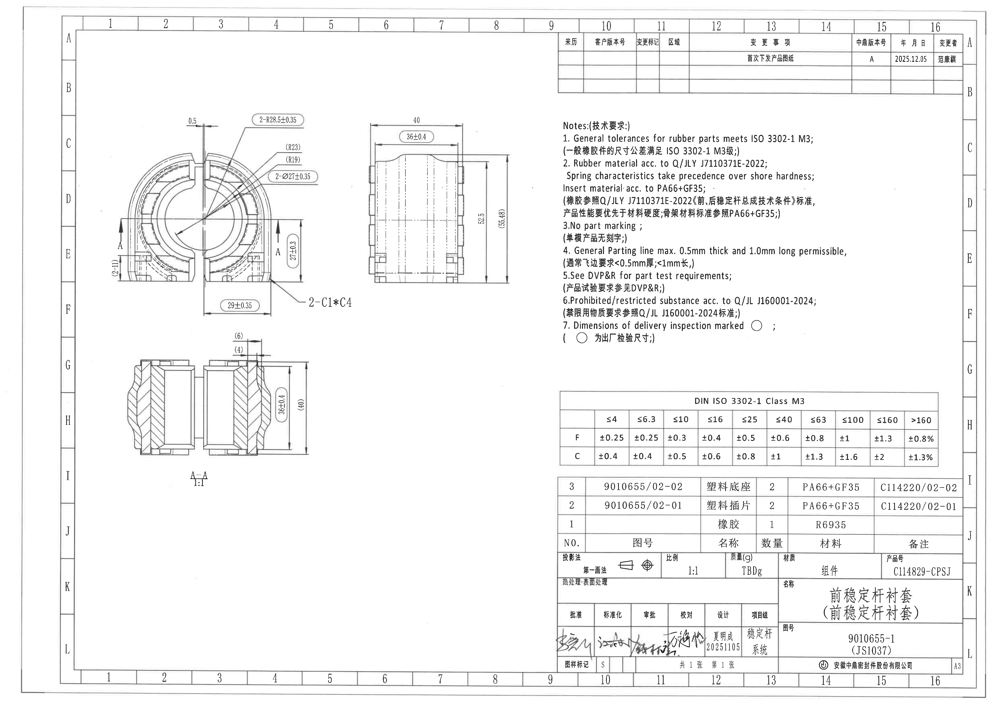
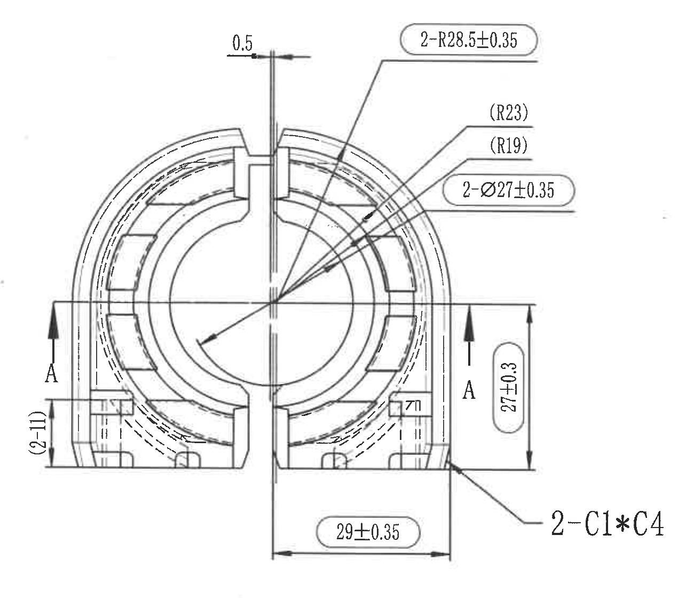
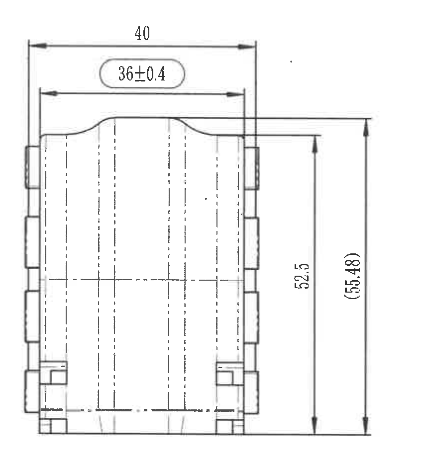
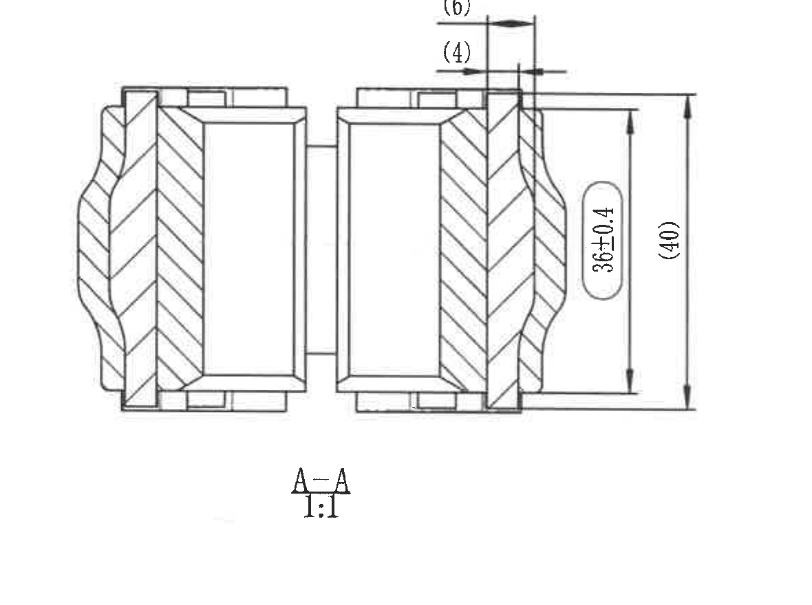
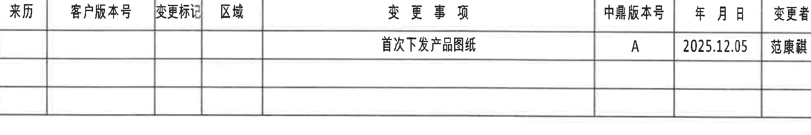
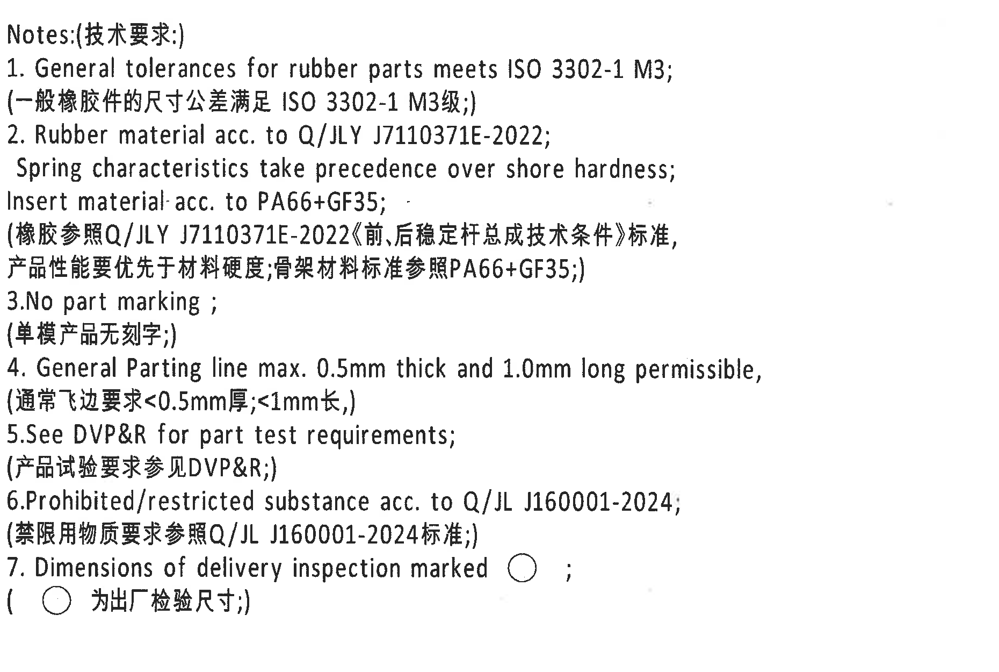
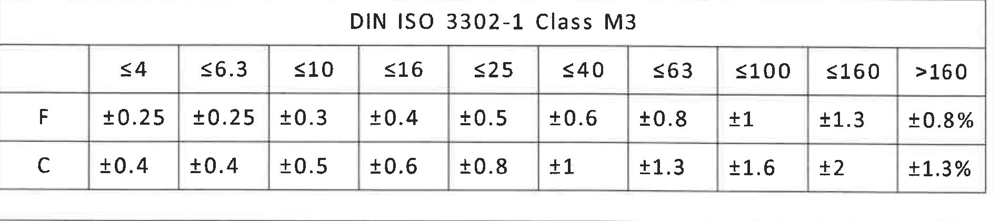
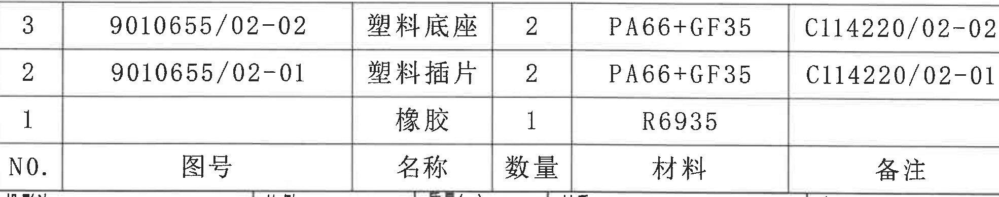
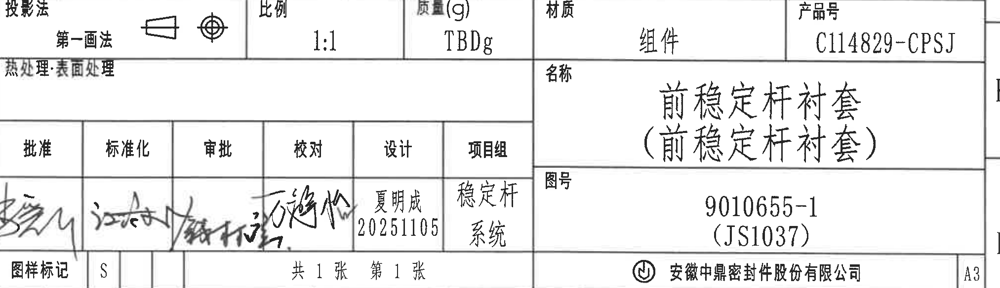

# 20C114829.pdf 内容识别与裁切提取

整页 PNG：`outputs/20C114829_assets/images/page_1.png`

页面信息：1 页，整页渲染图尺寸 4959 x 3505 px，bbox `[0, 0, 4959, 3505]`。以下内容按原图对象位置逐项还原，不把相邻视图或表格内容合并。

## object_1 - 主视图 / 正面加工视图，位于原图左上 C-F 区域

- 原图位置/视图名称：主视图 / 正面加工视图，位于原图左上 C-F 区域
- object_kind：`view`
- bbox：`[500, 520, 1800, 1640]`
- 边界归属说明：裁切框包含主视图外轮廓、A-A 剖切箭头、全部主视图尺寸线和右下倒角引线；右边界收在右视图之前，未提取右视图任何轮廓或尺寸。靠近右边界的 27±0.3 与 2-C1*C4 均由完整引线/尺寸线连接到主视图右下区域，归属主视图。

提取表格：

| 提取项 | 原图数值或文本 | 含义说明 |
| --- | --- | --- |
| 尺寸 | 0.5 | 位于顶部竖向开槽/缝宽处的水平尺寸，表示该窄槽宽度 0.5。 |
| 弧向/半径尺寸 | 2-R28.5±0.35 | 带数量前缀 2，表示两处外圆弧半径 R28.5，公差 ±0.35；标注由引线指向主视图上部外圆弧。 |
| 参考半径 | (R23) | 括号内参考尺寸，表示对应圆弧参考半径 R23；位于主视图右上引线组。 |
| 参考半径 | (R19) | 括号内参考尺寸，表示对应内侧圆弧参考半径 R19；位于主视图右上引线组。 |
| 直径尺寸 | 2-Ø27±0.35 | 带数量前缀 2，表示两处直径 Ø27，公差 ±0.35；引线指向主视图中心圆/内孔相关圆形特征。 |
| 尺寸 | 27±0.3 | 主视图右侧竖向高度尺寸，公差 ±0.3；尺寸线贴近右边界但箭头和延长线完整连接主视图右侧台阶高度。 |
| 尺寸 | 29±0.35 | 主视图底部水平宽度尺寸，公差 ±0.35；尺寸线在底部两竖向延长线之间。 |
| 参考尺寸 | (2-11) | 括号内参考尺寸，位于左下支脚处，表示两处 11 的参考高度/间距；用于说明结构关系，不作为单独受控检验尺寸。 |
| 倒角/数量 | 2-C1*C4 | 带数量前缀 2，指向主视图右下外角，表示两处 C1*C4 倒角/倒角组合特征；引线完全在主视图裁切内。 |
| 剖切标识 | A-A / A | 主视图左右两侧箭头和字母 A 指示剖切位置，对应下方 A-A 剖视图。 |

## object_2 - 右视图 / 侧向加工视图，位于原图中上 D-F 区域

- 原图位置/视图名称：右视图 / 侧向加工视图，位于原图中上 D-F 区域
- object_kind：`view`
- bbox：`[1780, 530, 2630, 1460]`
- 边界归属说明：裁切框只包含侧向视图及其顶部、右侧尺寸线；左侧没有并入主视图，右侧未接触 Notes 区域。40、36±0.4、52.5、(55.48) 的尺寸线和箭头均完整。

提取表格：

| 提取项 | 原图数值或文本 | 含义说明 |
| --- | --- | --- |
| 尺寸 | 40 | 右视图顶部外宽/总宽尺寸，无单独标注公差；适用 Notes 中一般公差 ISO 3302-1 M3。 |
| 尺寸 | 36±0.4 | 右视图顶部内侧宽度尺寸，公差 ±0.4；标注位于圆角顶部特征下方。 |
| 尺寸 | 52.5 | 右视图右侧主体高度尺寸，无单独标注公差；尺寸线位于内侧竖向箭头之间。 |
| 参考尺寸 | (55.48) | 括号内参考总高度尺寸，位于最右侧竖向尺寸线；用于外形总体高度参考，不作为单独受控检验尺寸。 |

## object_3 - A-A 剖视图，位于原图左下 G-I 区域

- 原图位置/视图名称：A-A 剖视图，位于原图左下 G-I 区域
- object_kind：`section`
- bbox：`[520, 1660, 1700, 2540]`
- 边界归属说明：裁切框包含 A-A 剖视图全宽、剖面线、下方 A-A/1:1 标识、上方参考尺寸和右侧高度尺寸；上方 (6)/(4) 没有截断箭头，右侧 (40) 与 36±0.4 尺寸线完整。未混入上方主视图或右侧表格。

提取表格：

| 提取项 | 原图数值或文本 | 含义说明 |
| --- | --- | --- |
| 参考尺寸 | (6) | 括号内参考尺寸，位于剖视图上方，表示顶部局部台阶/唇边宽度参考值 6。 |
| 参考尺寸 | (4) | 括号内参考尺寸，位于剖视图上方，表示相邻顶部局部台阶/唇边宽度参考值 4。 |
| 尺寸 | 36±0.4 | 剖视图右侧内高度尺寸，公差 ±0.4；尺寸线位于外侧总高尺寸内侧。 |
| 参考尺寸 | (40) | 括号内参考总高度尺寸，位于剖视图最右侧竖向尺寸线。 |
| 剖视标识 | A-A | 剖面名称，对应主视图中的 A-A 剖切箭头。 |
| 比例 | 1:1 | 该剖视图比例标识。 |

## object_4 - 修订履历表，位于原图右上 A-B 区域

- 原图位置/视图名称：修订履历表，位于原图右上 A-B 区域
- object_kind：`table`
- bbox：`[2780, 180, 4750, 510]`
- 边界归属说明：裁切框覆盖修订表表头、有效修订行和空白行；上边界避开图框坐标数字，下边界到表格外框。右侧贴近图框但表格字段和边框完整。

原表还原：

| 来历 | 客户版本号 | 变更标记 | 区域 | 变更事项 | 中鼎版本号 | 年月日 | 变更者 |
| --- | --- | --- | --- | --- | --- | --- | --- |
|  |  |  |  | 首次下发产品图纸 | A | 2025.12.05 | 范康麒 |
|  |  |  |  |  |  |  |  |
|  |  |  |  |  |  |  |  |

表格/字段含义说明：

| 提取项 | 原图数值或文本 | 含义说明 |
| --- | --- | --- |
| 表头 | 来历 / 客户版本号 / 变更标记 / 区域 / 变更事项 / 中鼎版本号 / 年月日 / 变更者 | 修订履历表的原始列名。 |
| 修订记录 | 首次下发产品图纸；中鼎版本号 A；年月日 2025.12.05；变更者 范康麒 | 表示本图首次发布产品图纸，版本为 A。 |

## object_5 - Notes 技术要求，位于原图右中 C-G 区域

- 原图位置/视图名称：Notes 技术要求，位于原图右中 C-G 区域
- object_kind：`notes`
- bbox：`[2780, 560, 4640, 1810]`
- 边界归属说明：裁切框只覆盖 Notes 文本区，未带入左侧视图或下方公差表；标题、1-7 条英文/中文内容及圆圈检验标记均完整。

提取表格：

| 提取项 | 原图数值或文本 | 含义说明 |
| --- | --- | --- |
| 标题 | Notes:(技术要求:) | 技术要求区域标题。 |
| 1 | General tolerances for rubber parts meets ISO 3302-1 M3;（一般橡胶件的尺寸公差满足 ISO 3302-1 M3级;） | 橡胶件一般尺寸公差按 ISO 3302-1 M3。 |
| 2 | Rubber material acc. to Q/JLY J7110371E-2022; Spring characteristics take precedence over shore hardness; Insert material acc. to PA66+GF35;（橡胶参照Q/JLY J7110371E-2022《前、后稳定杆总成技术条件》标准，产品性能要优先于材料硬度;骨架材料标准参照PA66+GF35;） | 规定橡胶材料标准、性能优先级和嵌件材料 PA66+GF35。 |
| 3 | No part marking;（单模产品无刻字;） | 零件不做产品刻字/标识。 |
| 4 | General Parting line max. 0.5mm thick and 1.0mm long permissible,（通常飞边要求<0.5mm厚;<1mm长,） | 飞边/分型线允许限值。 |
| 5 | See DVP&R for part test requirements;（产品试验要求参见DVP&R;） | 试验要求参考 DVP&R。 |
| 6 | Prohibited/restricted substance acc. to Q/JL J160001-2024;（禁限用物质要求参照Q/JL J160001-2024标准;） | 禁限用物质按 Q/JL J160001-2024。 |
| 7 | Dimensions of delivery inspection marked ○;（○ 为出厂检验尺寸;） | 带圆圈标记的尺寸为出厂检验尺寸。 |

## object_6 - DIN ISO 3302-1 Class M3 公差表，位于原图右中 H 区域

- 原图位置/视图名称：DIN ISO 3302-1 Class M3 公差表，位于原图右中 H 区域
- object_kind：`table`
- bbox：`[2780, 1950, 4680, 2370]`
- 边界归属说明：裁切框包含完整标题行、尺寸范围列和 F/C 两行公差值；未带入下方明细表内容。

原表还原：

| DIN ISO 3302-1 Class M3 |  |  |  |  |  |  |  |  |  |  |
| --- | --- | --- | --- | --- | --- | --- | --- | --- | --- | --- |
|  | ≤4 | ≤6.3 | ≤10 | ≤16 | ≤25 | ≤40 | ≤63 | ≤100 | ≤160 | >160 |
| F | ±0.25 | ±0.25 | ±0.3 | ±0.4 | ±0.5 | ±0.6 | ±0.8 | ±1 | ±1.3 | ±0.8% |
| C | ±0.4 | ±0.4 | ±0.5 | ±0.6 | ±0.8 | ±1 | ±1.3 | ±1.6 | ±2 | ±1.3% |

表格/字段含义说明：

| 提取项 | 原图数值或文本 | 含义说明 |
| --- | --- | --- |
| 标准 | DIN ISO 3302-1 Class M3 | 一般橡胶件尺寸公差等级表。 |
| F 行 | ≤4 ±0.25; ≤6.3 ±0.25; ≤10 ±0.3; ≤16 ±0.4; ≤25 ±0.5; ≤40 ±0.6; ≤63 ±0.8; ≤100 ±1; ≤160 ±1.3; >160 ±0.8% | F 类尺寸范围对应公差。 |
| C 行 | ≤4 ±0.4; ≤6.3 ±0.4; ≤10 ±0.5; ≤16 ±0.6; ≤25 ±0.8; ≤40 ±1; ≤63 ±1.3; ≤100 ±1.6; ≤160 ±2; >160 ±1.3% | C 类尺寸范围对应公差。 |

## object_7 - 零件明细表 / BOM，位于原图右下 I-J 区域

- 原图位置/视图名称：零件明细表 / BOM，位于原图右下 I-J 区域
- object_kind：`table`
- bbox：`[2780, 2365, 4750, 2755]`
- 边界归属说明：裁切框包含明细表顶线、三条物料记录和表头；底部到备注表头下边界，未把标题栏的投影法、比例等字段归入明细表。

原表还原：

| NO. | 图号 | 名称 | 数量 | 材料 | 备注 |
| --- | --- | --- | --- | --- | --- |
| 3 | 9010655/02-02 | 塑料底座 | 2 | PA66+GF35 | C114220/02-02 |
| 2 | 9010655/02-01 | 塑料插片 | 2 | PA66+GF35 | C114220/02-01 |
| 1 |  | 橡胶 | 1 | R6935 |  |

表格/字段含义说明：

| 提取项 | 原图数值或文本 | 含义说明 |
| --- | --- | --- |
| 表头 | NO. / 图号 / 名称 / 数量 / 材料 / 备注 | 明细表原始列名。 |
| 明细 3 | 图号 9010655/02-02；名称 塑料底座；数量 2；材料 PA66+GF35；备注 C114220/02-02 | 塑料底座物料记录。 |
| 明细 2 | 图号 9010655/02-01；名称 塑料插片；数量 2；材料 PA66+GF35；备注 C114220/02-01 | 塑料插片物料记录。 |
| 明细 1 | 图号 空；名称 橡胶；数量 1；材料 R6935；备注 空 | 橡胶物料记录。 |

## object_8 - 标题栏，位于原图右下 J-L 区域

- 原图位置/视图名称：标题栏，位于原图右下 J-L 区域
- object_kind：`title_block`
- bbox：`[2780, 2750, 4805, 3335]`
- 边界归属说明：裁切框覆盖标题栏本体，包括投影法、比例、质量、材质、产品号、名称、图号、签审、图样标记、页码、公司和 A3；右边界为标题栏外框，未将右侧图框坐标字母作为标题栏内容提取。

提取表格：

| 提取项 | 原图数值或文本 | 含义说明 |
| --- | --- | --- |
| 投影法 | 第一画法 | 标题栏左上投影法字段，旁有投影符号。 |
| 比例 | 1:1 | 图纸比例。 |
| 质量(g) | TBDg | 质量待定。 |
| 材质 | 组件 | 材质/组成字段为组件。 |
| 产品号 | C114829-CPSJ | 产品号字段。 |
| 热处理/表面处理 | 热处理:表面处理 | 字段保留，图中未见具体处理值。 |
| 名称 | 前稳定杆衬套（前稳定杆衬套） | 零件名称。 |
| 图号 | 9010655-1 (JS1037) | 图号及括号内参考/关联号。 |
| 批准 | 手写签名 | 签审栏批准签名，原图为手写，无法稳定识别具体姓名。 |
| 标准化 | 手写签名 | 签审栏标准化签名，原图为手写，无法稳定识别具体姓名。 |
| 审批 | 手写签名 | 签审栏审批签名，原图为手写，无法稳定识别具体姓名。 |
| 校对 | 手写签名 | 签审栏校对签名，原图为手写，无法稳定识别具体姓名。 |
| 设计 | 夏明成 20251105 | 设计栏姓名和日期。 |
| 项目组 | 稳定杆系统 | 项目组字段。 |
| 图样标记 | S | 图样标记字段。 |
| 页码 | 共 1 张 第 1 张 | 页码/张数。 |
| 公司 | 安徽中鼎密封件股份有限公司 | 出图公司。 |
| 图幅 | A3 | 标题栏右下角图幅。 |

## 裁切检查记录

| 对象 | 检查结果 | 边界处理 |
| --- | --- | --- |
| object_1 | 完整包含尺寸线/文字/表格线；未发现边缘文字被裁掉。 | 裁切框包含主视图外轮廓、A-A 剖切箭头、全部主视图尺寸线和右下倒角引线；右边界收在右视图之前，未提取右视图任何轮廓或尺寸。靠近右边界的 27±0.3 与 2-C1*C4 均由完整引线/尺寸线连接到主视图右下区域，归属主视图。 |
| object_2 | 完整包含尺寸线/文字/表格线；未发现边缘文字被裁掉。 | 裁切框只包含侧向视图及其顶部、右侧尺寸线；左侧没有并入主视图，右侧未接触 Notes 区域。40、36±0.4、52.5、(55.48) 的尺寸线和箭头均完整。 |
| object_3 | 完整包含尺寸线/文字/表格线；未发现边缘文字被裁掉。 | 裁切框包含 A-A 剖视图全宽、剖面线、下方 A-A/1:1 标识、上方参考尺寸和右侧高度尺寸；上方 (6)/(4) 没有截断箭头，右侧 (40) 与 36±0.4 尺寸线完整。未混入上方主视图或右侧表格。 |
| object_4 | 完整包含尺寸线/文字/表格线；未发现边缘文字被裁掉。 | 裁切框覆盖修订表表头、有效修订行和空白行；上边界避开图框坐标数字，下边界到表格外框。右侧贴近图框但表格字段和边框完整。 |
| object_5 | 完整包含尺寸线/文字/表格线；未发现边缘文字被裁掉。 | 裁切框只覆盖 Notes 文本区，未带入左侧视图或下方公差表；标题、1-7 条英文/中文内容及圆圈检验标记均完整。 |
| object_6 | 完整包含尺寸线/文字/表格线；未发现边缘文字被裁掉。 | 裁切框包含完整标题行、尺寸范围列和 F/C 两行公差值；未带入下方明细表内容。 |
| object_7 | 完整包含尺寸线/文字/表格线；未发现边缘文字被裁掉。 | 裁切框包含明细表顶线、三条物料记录和表头；底部到备注表头下边界，未把标题栏的投影法、比例等字段归入明细表。 |
| object_8 | 完整包含尺寸线/文字/表格线；未发现边缘文字被裁掉。 | 裁切框覆盖标题栏本体，包括投影法、比例、质量、材质、产品号、名称、图号、签审、图样标记、页码、公司和 A3；右边界为标题栏外框，未将右侧图框坐标字母作为标题栏内容提取。 |

备注：临时放大核对图未写入最终输出；最终资产目录仅保留整页 PNG 与 object_1 到 object_8 的裁切 PNG。
