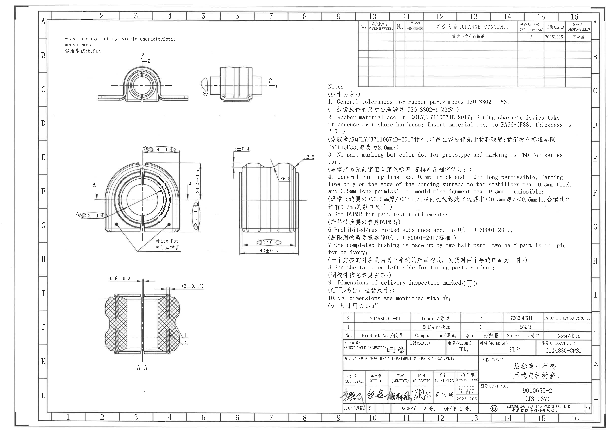
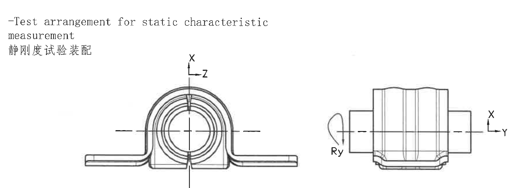
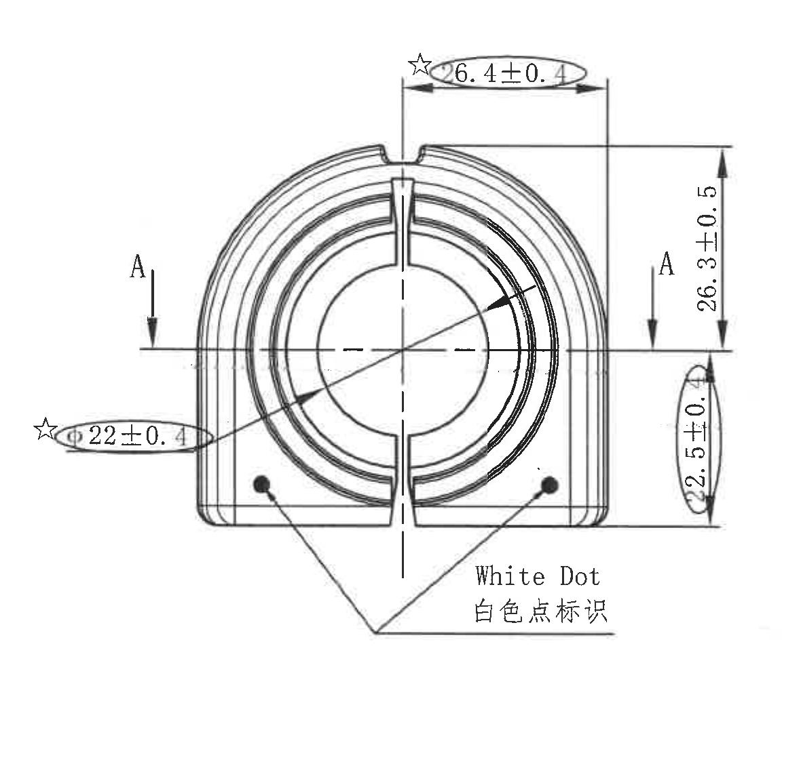
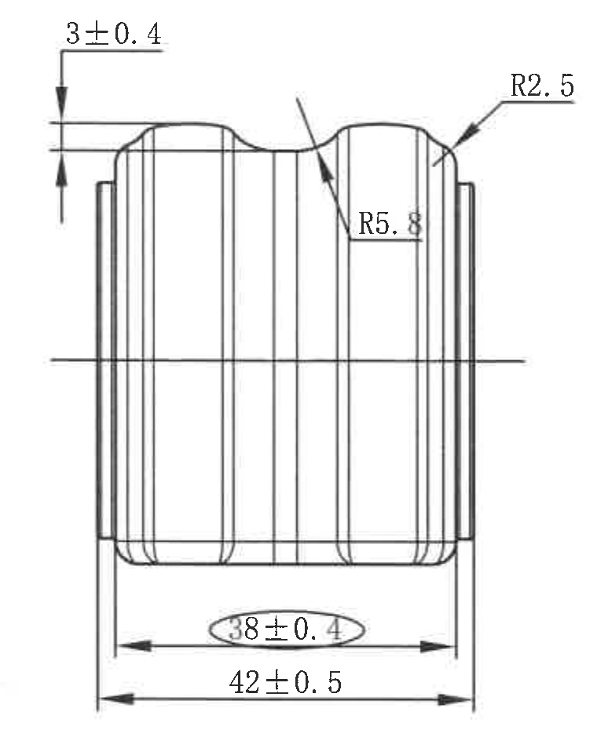
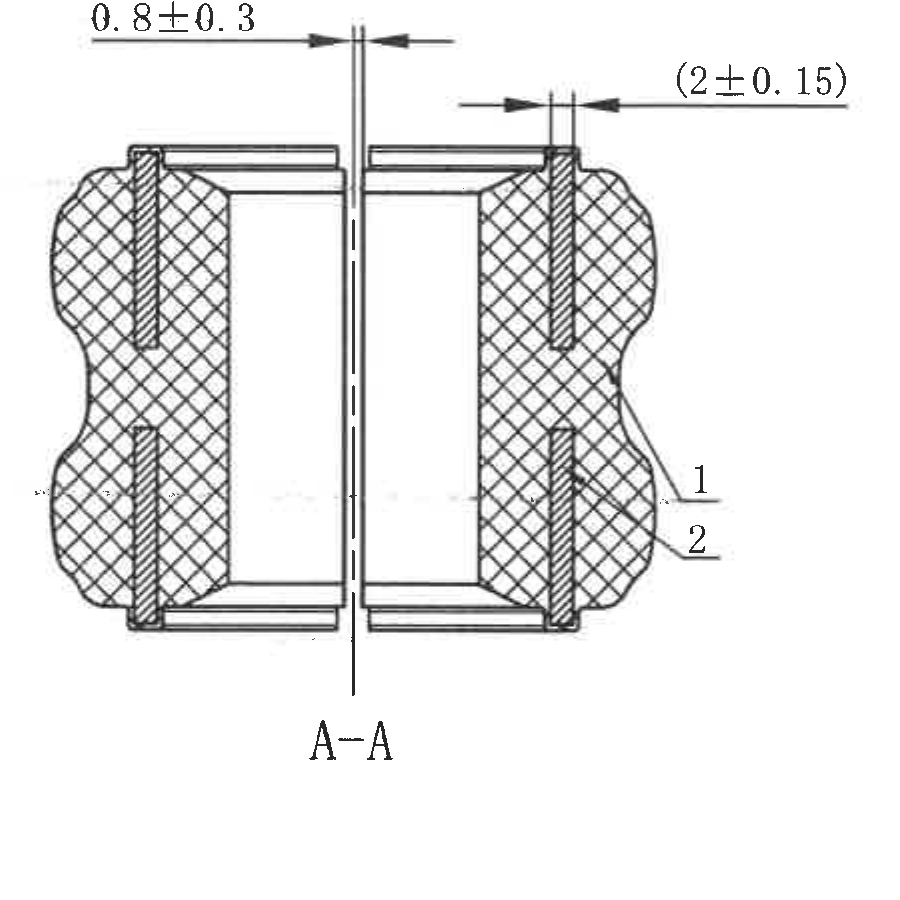
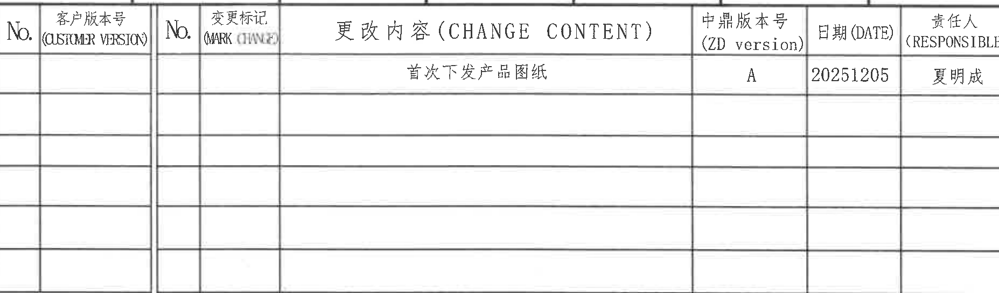
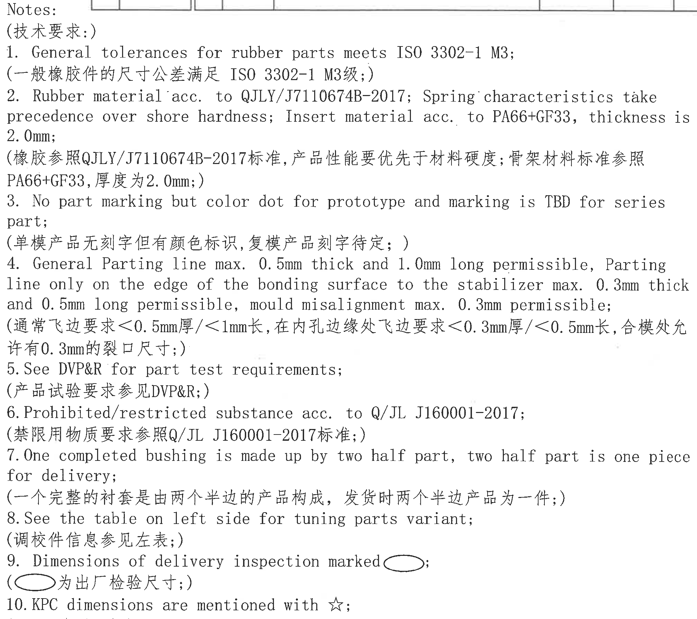
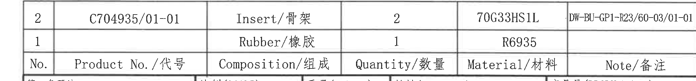
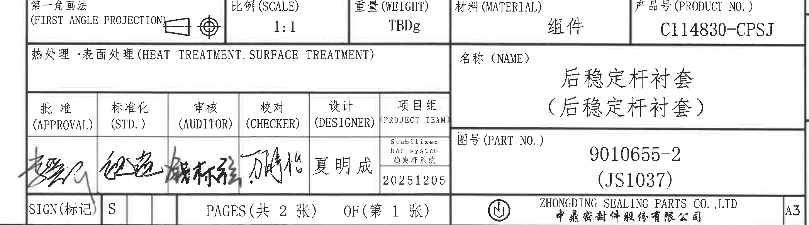

# 20C114830 PDF 内容识别

整页渲染图：

## 裁切对象与内容提取

### object_1 - Test arrangement for static characteristic measurement / 静刚度试验装配

- 原图位置/视图名称：页 1，图框 B-C / 2-8 附近，左上区域。 左上试验装配示意视图。
- object_kind：`view`
- bbox：`[500, 240, 2250, 890]`
- 边界归属说明：裁切包含左侧正视装配示意、右侧侧向装配示意、X/Y/Z 坐标箭头及 Ry 旋转标识；未包含下方主加工尺寸视图或右侧 NOTES。

| 提取项 | 原图数值或文本 | 含义说明 |
|---|---|---|
| 视图标题 | -Test arrangement for static characteristic measurement / 静刚度试验装配 | 说明该视图用于静态特性测量的装配方向和姿态，不给出制造尺寸。 |
| 坐标方向 | X、Z（左侧示意）；X、Y（右侧示意） | 标明试验/装配坐标方向，左侧为 X-Z 方向，右侧为 X-Y 方向。 |
| 旋转/力矩方向 | Ry | 右侧示意的绕 Y 轴旋转方向标识，用于静刚度试验加载/测量方向说明。 |
| 中心线 | 水平/垂直中心线 | 表示装配中心和轴线位置；不作为尺寸数值。 |

### object_2 - 主视图 / 正向加工视图

- 原图位置/视图名称：页 1，图框 E-H / 2-6 附近，左中区域。 左中主视图。
- object_kind：`view`
- bbox：`[560, 1105, 1740, 2235]`
- 边界归属说明：裁切从左侧星号直径标注外侧开始，到右侧竖向 22.5±0.4 标注外侧结束；完整包含 A-A 剖切箭头、白点标识引线和主视图所有尺寸，未包含右侧侧视图。

| 提取项 | 原图数值或文本 | 含义说明 |
|---|---|---|
| KPC 尺寸 | ☆ 6.4±0.4 | 顶部槽口/开口宽度尺寸；星号按 Notes 10 为 KPC 关键尺寸，椭圆按 Notes 9 为出厂检验尺寸。 |
| KPC 直径尺寸 | ☆ Φ22±0.4 | 内孔/圆形配合区域直径尺寸；星号表示 KPC，椭圆表示出厂检验尺寸；引线指向主视图圆孔区域。 |
| 总高度/外形高度 | 26.3±0.5 | 右侧竖向总高度尺寸，从上方外形基准线到中心水平线/分界位置。 |
| 局部高度/下部高度 | 22.5±0.4 | 右侧竖向椭圆标注的下部高度/安装侧高度尺寸；椭圆表示出厂检验尺寸。 |
| 剖切标识 | A、A | 左右两侧剖切箭头定义 A-A 剖视位置；不能把 A-A 剖视图尺寸归入主视图。 |
| 功能标识 | White Dot / 白色点标识 | 两个黑点位置由引线汇聚并标注为白色点标识，用于颜色点或装配识别位置。 |
| 中心线/轴线 | 水平中心线、垂直中心线 | 表示圆孔中心和对称轴线；不作为独立尺寸值。 |

### object_3 - 侧视图 / 右中加工视图

- 原图位置/视图名称：页 1，图框 E-H / 6-8 附近，主视图右侧。 右中侧视图。
- object_kind：`view`
- bbox：`[1815, 1165, 2575, 2095]`
- 边界归属说明：裁切完整包含侧视图外形、上方局部厚度标注、右上圆角 R2.5、内侧圆角 R5.8、底部 38±0.4 和 42±0.5；没有纳入左侧主视图或右侧 NOTES 文本。

| 提取项 | 原图数值或文本 | 含义说明 |
|---|---|---|
| 局部厚度/台阶高度 | 3±0.4 | 左上竖向标注，表示侧视图上方局部高度或台阶差。 |
| 圆角半径 | R2.5 | 右上外侧圆角半径，箭头指向侧视图上外圆角。 |
| 圆角/弧形半径 | R5.8 | 中右凹/过渡弧半径，水平引线指向内侧弧形过渡。 |
| 内宽/检验尺寸 | 38±0.4 | 底部内侧水平尺寸，椭圆表示出厂检验尺寸。 |
| 外宽/总宽 | 42±0.5 | 底部最外侧水平总宽尺寸。 |
| 中心线 | 水平中心线 | 表示侧视图高度方向中心，不作为独立尺寸。 |

### object_4 - A-A 剖视图

- 原图位置/视图名称：页 1，图框 I-K / 3-5 附近，左下区域。 左下 A-A 剖面视图。
- object_kind：`section`
- bbox：`[800, 2240, 1700, 3140]`
- 边界归属说明：裁切完整包含剖面外形、剖面线、上方两个厚度尺寸、右侧材料索引 1/2 和底部 A-A 标题；未包含上方主视图尺寸。

| 提取项 | 原图数值或文本 | 含义说明 |
|---|---|---|
| 间隙/厚度尺寸 | 0.8±0.3 | 剖面左上水平尺寸，表示剖面中间间隙或片状结构厚度。 |
| 参考尺寸 | (2±0.15) | 剖面右上括号尺寸，括号表示参考尺寸；用于说明局部厚度/间距，通常不作为直接检验控制尺寸但必须保留。 |
| 材料索引 | 1 | 右侧引线索引，对应材料表中的 No.1 Rubber/橡胶，数量 1，材料 R6935。 |
| 材料索引 | 2 | 右侧引线索引，对应材料表中的 No.2 Insert/骨架，数量 2，材料 70G33HS1L，产品号 C704935/01-01。 |
| 剖面名称 | A-A | 剖面由主视图两侧 A 箭头定义。 |
| 剖面线 | 交叉剖面线 | 表示橡胶/实体剖切区域，材料归属按索引 1/2 解释。 |

### object_5 - 更改履历表 / CHANGE CONTENT

- 原图位置/视图名称：页 1，图框 A-C / 10-16 附近，右上区域。 右上更改履历表。
- object_kind：`table`
- bbox：`[2910, 160, 4765, 705]`
- 边界归属说明：裁切包含变更履历表表头和所有可见行；左侧从 No. 列开始，右侧到 RESPONSIBLE 列结束；未把右侧图框字母作为表格内容提取。

| 提取项 | 原图数值或文本 | 含义说明 |
|---|---|---|
| 表头 | No.; 客户版本号 (CUSTOMER VERSION); No.; 变更标记 (MARK CHANGE); 更改内容 (CHANGE CONTENT); 中鼎版本号 (ZD version); 日期 (DATE); 责任人 (RESPONSIBLE) | 变更履历表列名。 |
| 记录 1 | 更改内容：首次下发产品图纸；中鼎版本号：A；日期：20251205；责任人：夏明成 | 首次发布/下发产品图纸的记录。客户版本号、变更标记、前两列 No. 未填写。 |
| 空白行 | 多行空白 | 后续变更记录栏为空。 |

原表行列还原：

| No. | 客户版本号 (CUSTOMER VERSION) | No. | 变更标记 (MARK CHANGE) | 更改内容 (CHANGE CONTENT) | 中鼎版本号 (ZD version) | 日期 (DATE) | 责任人 (RESPONSIBLE) |
|---|---|---|---|---|---|---|---|
|  |  |  |  | 首次下发产品图纸 | A | 20251205 | 夏明成 |
|  |  |  |  |  |  |  |  |
|  |  |  |  |  |  |  |  |
|  |  |  |  |  |  |  |  |
|  |  |  |  |  |  |  |  |

含义说明：该表为修订/变更履历；当前仅记录首次下发产品图纸，版本 A，日期 20251205，责任人为夏明成。

### object_6 - Notes / 技术要求

- 原图位置/视图名称：页 1，图框 C-I / 9-16 附近，右中区域。 右中 NOTES 技术要求。
- object_kind：`notes`
- bbox：`[2640, 675, 4650, 2460]`
- 边界归属说明：裁切包含 Notes 标题、技术要求标题和 1-10 条英文/中文说明；未包含右侧图框字母，底部不提取下方材料表内容。

| 提取项 | 原图数值或文本 | 含义说明 |
|---|---|---|
| Notes 标题 | Notes: (技术要求:) | 技术要求说明区域。 |
| 1 | General tolerances for rubber parts meets ISO 3302-1 M3; (一般橡胶件的尺寸公差满足 ISO 3302-1 M3级;) | 橡胶件未注尺寸公差按 ISO 3302-1 M3。 |
| 2 | Rubber material acc. to QJLY/J7110674B-2017; Spring characteristics take precedence over shore hardness; Insert material acc. to PA66+GF33, thickness is 2.0mm; (橡胶参照QJLY/J7110674B-2017标准，产品性能要优先于材料硬度；骨架材料标准参照 PA66+GF33，厚度为2.0mm;) | 橡胶材料、性能优先级和骨架材料/厚度要求。 |
| 3 | No part marking but color dot for prototype and marking is TBD for series part; (单模产品无刻字但有颜色标识，复模产品刻字待定;) | 样件/量产标识要求，颜色点用于原型或标识。 |
| 4 | General Parting line max. 0.5mm thick and 1.0mm long permissible, Parting line only on the edge of the bonding surface to the stabilizer max. 0.3mm thick and 0.5mm long permissible, mould misalignment max. 0.3mm permissible; (通常飞边要求<0.5mm厚/<1mm长，在内孔边缘处飞边要求<0.3mm厚/<0.5mm长，合模处允许有0.3mm的裂口尺寸;) | 分型线、飞边和错模允许值。 |
| 5 | See DVP&R for part test requirements; (产品试验要求参见DVP&R;) | 试验要求引用 DVP&R。 |
| 6 | Prohibited/restricted substance acc. to Q/JL J160001-2017; (禁限用物质要求参照Q/JL J160001-2017标准;) | 禁限用物质标准。 |
| 7 | One completed bushing is made up by two half part, two half part is one piece for delivery; (一个完整的衬套是由两个半边的产品构成，发货时两个半边产品为一件;) | 成品由两个半边组成，交付时两个半边为一件。 |
| 8 | See the table on left side for tuning parts variant; (调校件信息参见左表;) | 调校件变量/信息参见左侧表。 |
| 9 | Dimensions of delivery inspection marked with ellipse; (椭圆为出厂检验尺寸;) | 椭圆框尺寸为出厂检验尺寸。 |
| 10 | KPC dimensions are mentioned with ☆; (KCP尺寸用☆标记) | 星号标记为 KPC/KCP 关键尺寸；原图英文为 KPC，中文为 KCP。 |

### object_7 - 材料/组成明细表

- 原图位置/视图名称：页 1，图框 J / 10-16 附近，标题栏上方。 右下材料明细表。
- object_kind：`table`
- bbox：`[2710, 2528, 4790, 2773]`
- 边界归属说明：裁切包含材料明细表的两条物料记录和列标题；底部仅保留表格边线，不提取下方标题栏投影/比例字段。

| 提取项 | 原图数值或文本 | 含义说明 |
|---|---|---|
| 表头 | No.; Product No./代号; Composition/组成; Quantity/数量; Material/材料; Note/备注 | 物料组成明细表列名。 |
| 2 | C704935/01-01; Insert/骨架; 2; 70G33HS1L; DW-BU-GP1-R23/60-03/01-01 | 骨架件，数量 2，材料 70G33HS1L，备注为 DW-BU-GP1-R23/60-03/01-01。 |
| 1 | Product No. 空白; Rubber/橡胶; 1; R6935; Note 空白 | 橡胶件，数量 1，材料 R6935。 |

原表行列还原：

| No. | Product No./代号 | Composition/组成 | Quantity/数量 | Material/材料 | Note/备注 |
|---|---|---|---|---|---|
| 2 | C704935/01-01 | Insert/骨架 | 2 | 70G33HS1L | DW-BU-GP1-R23/60-03/01-01 |
| 1 |  | Rubber/橡胶 | 1 | R6935 |  |

含义说明：该材料明细表与 A-A 剖视图右侧索引 1、2 对应；1 为橡胶，2 为骨架。

### object_8 - 标题栏 / title block

- 原图位置/视图名称：页 1，图框 J-L / 10-16 附近，右下角。 右下标题栏。
- object_kind：`title_block`
- bbox：`[2710, 2768, 4805, 3353]`
- 边界归属说明：裁切从第一角画法/比例/重量等标题栏字段开始，到公司名和 A3 字段结束；不提取上方材料表记录，也不提取外框分区数字。

| 提取项 | 原图数值或文本 | 含义说明 |
|---|---|---|
| 投影法 | 第一角画法 (FIRST ANGLE PROJECTION) | 图样采用第一角投影法。 |
| 比例 | 1:1 | 图样比例。 |
| 重量 | TBDg | 重量待定，单位 g。 |
| 材料 | 组件 | 标题栏材料/对象类型为组件。 |
| 产品号 | C114830-CPSJ | 产品编号。 |
| 热处理/表面处理 | 热处理·表面处理 (HEAT TREATMENT. SURFACE TREATMENT) | 该栏标题存在，内容未填写。 |
| 名称 | 后稳定杆衬套（后稳定杆衬套） | 零件/组件名称。 |
| 审批 | APPROVAL，签名 | 审批栏有手写签名。 |
| 标准化 | STD.，签名 | 标准化栏有手写签名。 |
| 审核 | AUDITOR，签名 | 审核栏有手写签名。 |
| 校对 | CHECKER，签名 | 校对栏有手写签名。 |
| 设计 | DESIGNER，夏明成 | 设计人为夏明成。 |
| 项目组 | PROJECT TEAM; Stabilized bar system / 稳定杆系统; 20251205 | 项目组为稳定杆系统，日期 20251205。 |
| 图号 | 9010655-2 (JS1037) | 零件图号/Part No.。 |
| 签名标记 | SIGN(标记) S | 签名/标记栏值为 S。 |
| 页码 | PAGES(共 2 张) OF(第 1 张) | 共 2 张，第 1 张。 |
| 公司 | ZHONGDING SEALING PARTS CO., LTD / 中鼎密封件股份有限公司 | 出图公司名称。 |
| 图幅 | A3 | 图纸幅面。 |

标题栏字段还原：

| 字段 | 原图文本 |
|---|---|
| 第一角画法 | 第一角画法 (FIRST ANGLE PROJECTION) |
| 比例 (SCALE) | 1:1 |
| 重量 (WEIGHT) | TBDg |
| 材料 (MATERIAL) | 组件 |
| 产品号 (PRODUCT NO.) | C114830-CPSJ |
| 热处理·表面处理 | 热处理·表面处理 (HEAT TREATMENT. SURFACE TREATMENT)，内容空白 |
| 名称 (NAME) | 后稳定杆衬套（后稳定杆衬套） |
| 批准 (APPROVAL) | 手写签名 |
| 标准化 (STD.) | 手写签名 |
| 审核 (AUDITOR) | 手写签名 |
| 校对 (CHECKER) | 手写签名 |
| 设计 (DESIGNER) | 夏明成 |
| 项目组 (PROJECT TEAM) | Stabilized bar system / 稳定杆系统；20251205 |
| 图号 (PART NO.) | 9010655-2 (JS1037) |
| SIGN(标记) | S |
| 页码 | PAGES(共 2 张) OF(第 1 张) |
| 公司 | ZHONGDING SEALING PARTS CO., LTD / 中鼎密封件股份有限公司 |
| 图幅 | A3 |

## 裁切检查记录

| 对象 | 检查结果 | 是否完整包含尺寸线和文字 | 是否混入其他视图片段 | 处理记录 |
|---|---|---|---|---|
| object_1 | 装配示意左右两图、坐标轴 X/Y/Z 和 Ry 均完整。 | 是 | 否 | 初裁通过。 |
| object_2 | 第一次裁切左侧 ☆Φ22±0.4 文字被截断；已左扩重裁，尺寸线、箭头、椭圆、白点标识和 A-A 箭头完整。 | 是 | 否 | 重裁为 bbox [560, 1105, 1740, 2235]。 |
| object_3 | 3±0.4、R2.5、R5.8、38±0.4、42±0.5 及箭头完整。 | 是 | 否 | 初裁通过。 |
| object_4 | 0.8±0.3、(2±0.15)、索引 1/2、A-A 标题和剖面线完整。 | 是 | 否 | 初裁通过。 |
| object_5 | 表头和唯一填写记录完整；已收紧右边界，不提取右侧图框字母。 | 是 | 否 | 重裁为 bbox [2910, 160, 4765, 705]。 |
| object_6 | Notes 1-10 和中文对应说明完整；第一次裁切底部中文行不完整，已下扩后再收紧到文本区域。 | 是 | 否 | 重裁为 bbox [2640, 675, 4650, 2460]。 |
| object_7 | 材料表两条记录和表头完整；底部仅保留表线，不提取下方标题栏字段。 | 是 | 否 | 重裁为 bbox [2710, 2528, 4790, 2773]。 |
| object_8 | 标题栏字段、签名栏、名称、图号、公司和 A3 完整；已收掉外框分区数字。 | 是 | 否 | 重裁为 bbox [2710, 2768, 4805, 3353]。 |

## 归属原则记录

- 主视图尺寸仅包括 ☆6.4±0.4、☆Φ22±0.4、26.3±0.5、22.5±0.4、A-A 剖切标识和 White Dot 标识。
- 侧视图尺寸仅包括 3±0.4、R2.5、R5.8、38±0.4、42±0.5。
- A-A 剖视图尺寸仅包括 0.8±0.3、(2±0.15) 和材料索引 1/2；括号参考尺寸已保留并说明。
- 椭圆框尺寸按 Notes 9 解释为出厂检验尺寸；星号尺寸按 Notes 10 解释为 KPC/KCP 关键尺寸。
