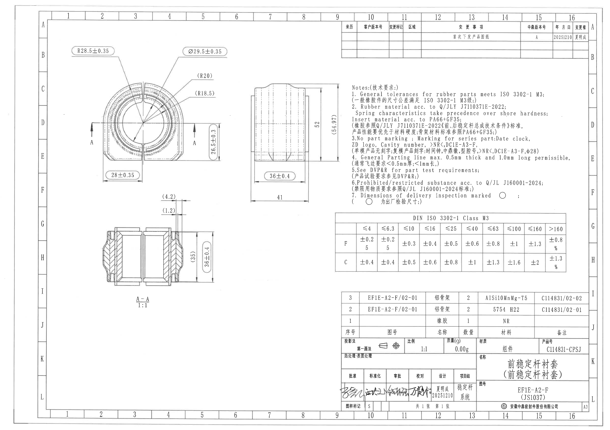
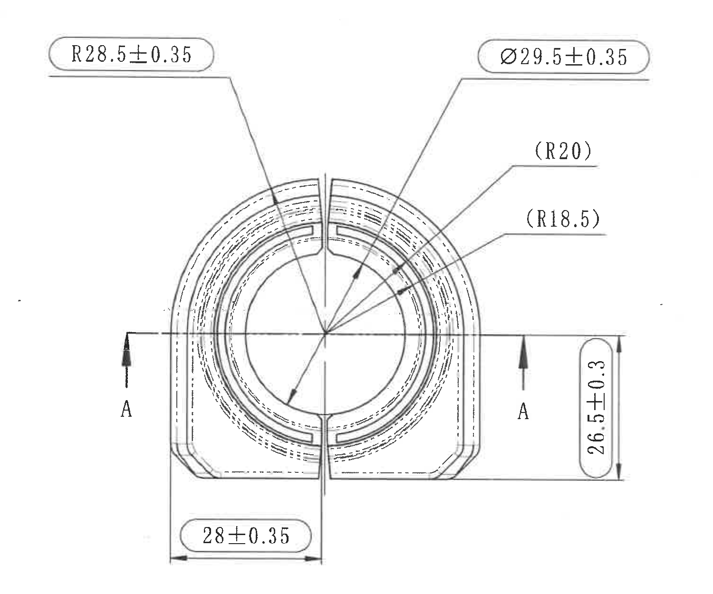
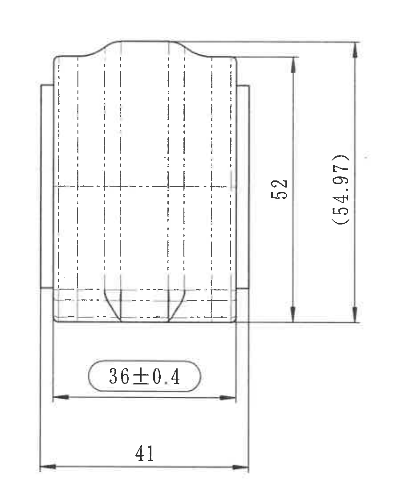
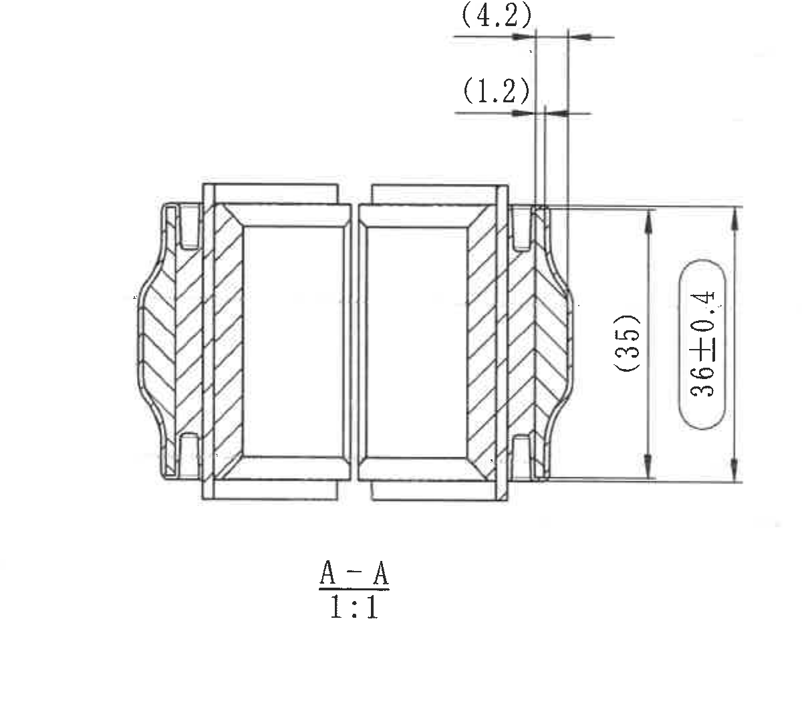
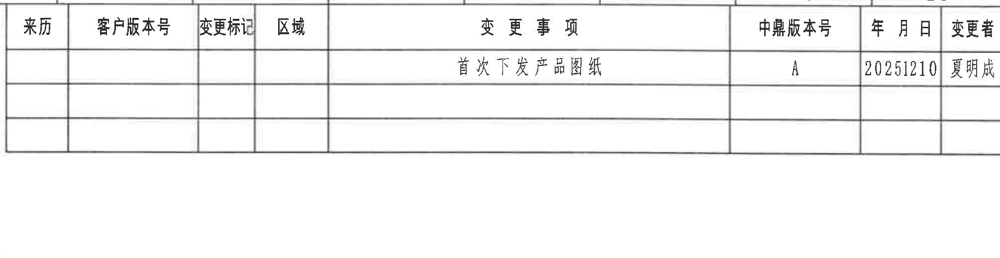
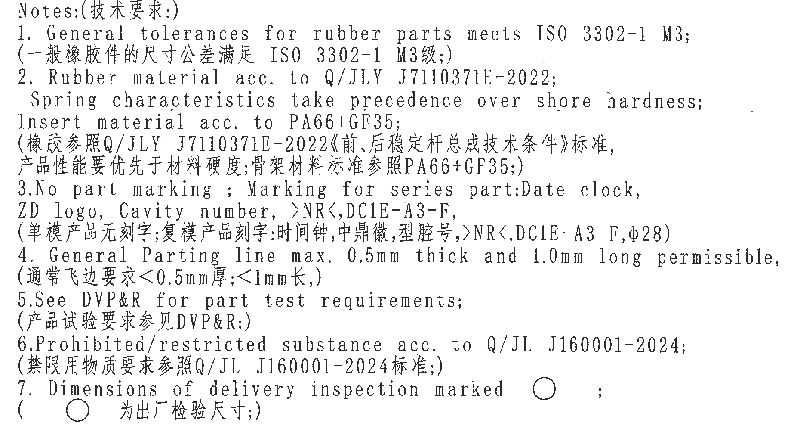
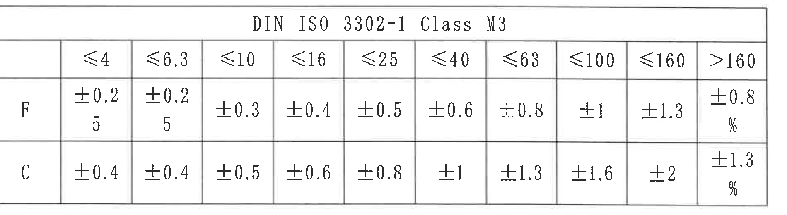
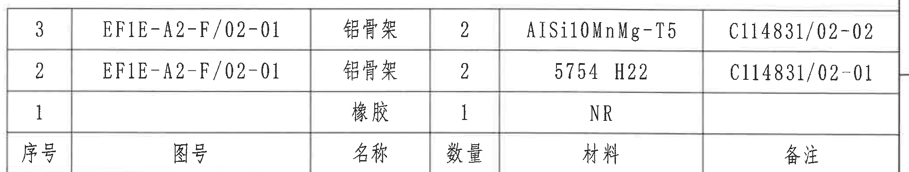
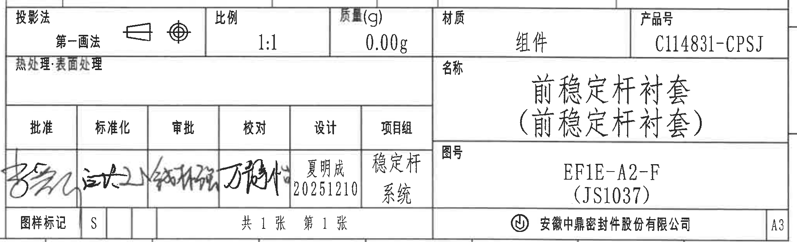

# 20C114831.pdf 内容识别结果

整页渲染图：`outputs/20C114831_assets/images/page_1.png`  
整页 PNG 尺寸：4959 x 3505 px。以下 bbox 均为整页 PNG 上的像素坐标，格式为 `[x, y, width, height]`。

## object_1 - 主视图 / view

原图位置/视图名称：第 1 页，左上主视图，bbox `[480, 300, 1500, 1250]`。

| 提取项 | 原图数值或文本 | 含义说明 |
|---|---|---|
| 半径尺寸 | `R28.5±0.35` | 主视图左上引出标注，指向圆弧轮廓；半径 28.5，公差 ±0.35。 |
| 直径尺寸 | `Ø29.5±0.35` | 主视图右上引出标注，指向圆形孔/圆形特征；直径 29.5，公差 ±0.35。 |
| 参考半径 | `(R20)` | 主视图右上引出标注，括号表示参考尺寸；用于说明圆弧/环形特征位置，不作为独立受控检验尺寸。 |
| 参考半径 | `(R18.5)` | 主视图右侧引出标注，括号表示参考尺寸；用于说明内侧圆弧/环形特征。 |
| 垂直尺寸 | `26.5±0.3` | 主视图右侧竖向尺寸，尺寸线连接主视图底部与上方水平基准/中心线，公差 ±0.3。 |
| 水平尺寸 | `28±0.35` | 主视图底部水平尺寸，尺寸线从左侧边界延伸到中间竖向分割/中心位置，公差 ±0.35。 |
| 剖切基准字母 | `A`、`A` | 主视图左右两侧箭头标识 A-A 剖切位置，指向剖面视图 object_3。 |
| 星号关键尺寸 / T 编号 / 角度 / 数量前缀 | 未见 | 本主视图裁切区域内未见星号关键尺寸、T 编号、角度标注或 `2X` 等数量前缀。 |

边界归属说明：该裁切完整包含主视图的圆形特征、左右 A-A 剖切箭头、`R28.5±0.35`、`Ø29.5±0.35`、`(R20)`、`(R18.5)`、`26.5±0.3`、`28±0.35` 的文字、引线、尺寸线和箭头。右侧边界止于主视图尺寸线外侧，未混入右侧视图；下方边界包含底部 `28±0.35` 完整尺寸线，未混入 A-A 剖面视图。

## object_2 - 右侧视图 / view

原图位置/视图名称：第 1 页，主视图右侧的侧向加工视图，bbox `[1950, 590, 885, 1100]`。

| 提取项 | 原图数值或文本 | 含义说明 |
|---|---|---|
| 垂直尺寸 | `52` | 右侧视图右边内侧竖向尺寸，表示侧视轮廓的受控高度/长度段。 |
| 参考垂直尺寸 | `(54.97)` | 右侧视图最右竖向参考尺寸，括号表示参考；用于说明总体高度/外包络参考值。 |
| 水平尺寸 | `36±0.4` | 右侧视图下方带框尺寸，表示中部宽度/高度相关投影尺寸，公差 ±0.4。 |
| 水平尺寸 | `41` | 右侧视图最下方水平尺寸，表示外侧总宽度/外包络宽度；原图未给单独公差，应按通用公差表/说明处理。 |
| 星号关键尺寸 / T 编号 / 角度 / 数量前缀 | 未见 | 本右侧视图裁切区域内未见星号关键尺寸、T 编号、角度标注或数量前缀。 |

边界归属说明：该裁切完整包含右侧视图实体轮廓及 `52`、`(54.97)`、`36±0.4`、`41` 的完整尺寸线、箭头和文字。右边界已收在 NOTES 文本左侧，没有带入 NOTES 残片；左侧及下方边界保留 `41` 尺寸线两端箭头和延长线。

## object_3 - A-A 剖视图 / section

原图位置/视图名称：第 1 页，左下 A-A 剖视图，bbox `[630, 1580, 1200, 1050]`。

| 提取项 | 原图数值或文本 | 含义说明 |
|---|---|---|
| 参考水平尺寸 | `(4.2)` | A-A 剖视图上方右侧参考尺寸，括号表示参考；指示剖面右上台阶/边缘间距。 |
| 参考水平尺寸 | `(1.2)` | A-A 剖视图上方右侧参考尺寸，括号表示参考；指示相邻薄壁/间隙的参考间距。 |
| 参考垂直尺寸 | `(35)` | A-A 剖视图右侧内侧竖向参考尺寸，括号表示参考；用于说明内侧高度范围。 |
| 垂直尺寸 | `36±0.4` | A-A 剖视图最右竖向带框尺寸，表示剖面总高度/外径方向尺寸，公差 ±0.4。 |
| 剖面标识 | `A-A`、`1:1` | 该剖视图来自主视图 object_1 的 A-A 剖切位置，比例 1:1。 |
| 星号关键尺寸 / T 编号 / 角度 / 数量前缀 | 未见 | 本剖视图裁切区域内未见星号关键尺寸、T 编号、角度标注或数量前缀。 |

边界归属说明：该裁切完整包含 A-A 剖视图、剖面线、上方 `(4.2)`、`(1.2)`、右侧 `(35)`、`36±0.4` 的文字和尺寸箭头，以及底部 `A-A 1:1` 标识。该区域未包含主视图底部 `28±0.35`，剖视图尺寸未归入主视图。

## object_4 - 修订履历表 / table

原图位置/视图名称：第 1 页，右上修订履历表，bbox `[2765, 165, 2010, 520]`。

原表行列还原：

| 来历 | 客户版本号 | 变更标记 | 区域 | 变更事项 | 中鼎版本号 | 年月日 | 变更者 |
|---|---|---|---|---|---|---|---|
|  |  |  |  | 首次下发产品图纸 | A | 20251210 | 夏明成 |
|  |  |  |  |  |  |  |  |
|  |  |  |  |  |  |  |  |

| 提取项 | 原图数值或文本 | 含义说明 |
|---|---|---|
| 表头 | `来历 / 客户版本号 / 变更标记 / 区域 / 变更事项 / 中鼎版本号 / 年月日 / 变更者` | 修订履历字段。 |
| 修订记录 | `首次下发产品图纸 / A / 20251210 / 夏明成` | 表示首次下发产品图纸，中鼎版本号 A，日期 2025-12-10，变更者夏明成。 |
| 空白记录行 | 两行空白 | 原表保留空白行，未填写修订内容。 |

边界归属说明：该裁切包含修订表的完整列线、表头和首条记录。右侧图框坐标字母不作为修订表内容提取；表内空白行按原图保留。

## object_5 - NOTES 技术要求 / notes

原图位置/视图名称：第 1 页，右侧 NOTES 技术要求区域，bbox `[2820, 690, 1860, 1010]`。

| 提取项 | 原图数值或文本 | 含义说明 |
|---|---|---|
| 标题 | `Notes:(技术要求:)` | 技术要求说明标题。 |
| 1 | `General tolerances for rubber parts meets ISO 3302-1 M3;` / `一般橡胶件的尺寸公差满足 ISO 3302-1 M3级;` | 橡胶件通用尺寸公差按 ISO 3302-1 M3。 |
| 2 | `Rubber material acc. to Q/JLY J7110371E-2022; Spring characteristics take precedence over shore hardness; Insert material acc. to PA66+GF35;` / `橡胶参照Q/JLY J7110371E-2022《前、后稳定杆总成技术条件》标准, 产品性能要优先于材料硬度; 骨架材料标准参照PA66+GF35;` | 橡胶材料标准、弹性性能优先原则、嵌件材料要求。 |
| 3 | `No part marking; Marking for series part: Date clock, ZD logo, Cavity number, >NR<, DC1E-A3-F, φ28` / `单模产品无刻字; 复模产品刻字: 时间钟, 中鼎徽, 型腔号, >NR<, DC1E-A3-F, φ28` | 单模无刻字；复模量产件需包含时间钟、徽标、型腔号、材料/型号及 `φ28` 标记。 |
| 4 | `General Parting line max. 0.5mm thick and 1.0mm long permissible` / `通常飞边要求<0.5mm厚,<1mm长` | 分型线/飞边允许上限。 |
| 5 | `See DVP&R for part test requirements` / `产品试验要求参见DVP&R` | 零件试验要求引用 DVP&R。 |
| 6 | `Prohibited/restricted substance acc. to Q/JL J160001-2024` / `禁限用物质要求参照Q/JL J160001-2024标准` | 禁限用物质按 Q/JL J160001-2024。 |
| 7 | `Dimensions of delivery inspection marked ○;` / `○ 为出厂检验尺寸` | 圆圈标记表示出厂检验尺寸。 |

边界归属说明：该裁切完整包含 NOTES 第 1-7 条中英文文本和第 7 条圆圈符号；下边界收在 NOTES 文本之后，未带入下方 DIN ISO 3302-1 Class M3 公差表。

## object_6 - DIN ISO 3302-1 Class M3 公差表 / table

原图位置/视图名称：第 1 页，右中通用公差表，bbox `[2750, 1720, 1900, 520]`。

原表行列还原：

|  | ≤4 | ≤6.3 | ≤10 | ≤16 | ≤25 | ≤40 | ≤63 | ≤100 | ≤160 | >160 |
|---|---|---|---|---|---|---|---|---|---|---|
| F | ±0.2 5 | ±0.2 5 | ±0.3 | ±0.4 | ±0.5 | ±0.6 | ±0.8 | ±1 | ±1.3 | ±0.8 % |
| C | ±0.4 | ±0.4 | ±0.5 | ±0.6 | ±0.8 | ±1 | ±1.3 | ±1.6 | ±2 | ±1.3 % |

| 提取项 | 原图数值或文本 | 含义说明 |
|---|---|---|
| 表题 | `DIN ISO 3302-1 Class M3` | 与 NOTES 第 1 条对应，定义橡胶件通用尺寸公差等级。 |
| F 行 | `≤4: ±0.25; ≤6.3: ±0.25; ≤10: ±0.3; ≤16: ±0.4; ≤25: ±0.5; ≤40: ±0.6; ≤63: ±0.8; ≤100: ±1; ≤160: ±1.3; >160: ±0.8%` | 原图中前两格和最后一格因表格高度换行显示，读作 `±0.25`、`±0.25`、`±0.8%`。 |
| C 行 | `≤4: ±0.4; ≤6.3: ±0.4; ≤10: ±0.5; ≤16: ±0.6; ≤25: ±0.8; ≤40: ±1; ≤63: ±1.3; ≤100: ±1.6; ≤160: ±2; >160: ±1.3%` | C 类尺寸公差行。 |

边界归属说明：该裁切完整包含公差表外框、标题、所有列头和 F/C 两行；上边界未带入 NOTES，右下方未带入明细表或标题栏内容。

## object_7 - 明细表 / table

原图位置/视图名称：第 1 页，右下明细表，bbox `[2760, 2360, 2050, 390]`。原图表头位于记录下方；下表按列名还原，记录顺序按原图自上而下。

原表行列还原：

| 序号 | 图号 | 名称 | 数量 | 材料 | 备注 |
|---|---|---|---|---|---|
| 3 | EF1E-A2-F/02-01 | 铝骨架 | 2 | AlSi10MnMg-T5 | C114831/02-02 |
| 2 | EF1E-A2-F/02-01 | 铝骨架 | 2 | 5754 H22 | C114831/02-01 |
| 1 |  | 橡胶 | 1 | NR |  |

| 提取项 | 原图数值或文本 | 含义说明 |
|---|---|---|
| 表头 | `序号 / 图号 / 名称 / 数量 / 材料 / 备注` | 明细表字段。 |
| 序号 3 | `EF1E-A2-F/02-01 / 铝骨架 / 2 / AlSi10MnMg-T5 / C114831/02-02` | 铝骨架零件，数量 2，材料 AlSi10MnMg-T5，备注图号 C114831/02-02。 |
| 序号 2 | `EF1E-A2-F/02-01 / 铝骨架 / 2 / 5754 H22 / C114831/02-01` | 铝骨架零件，数量 2，材料 5754 H22，备注图号 C114831/02-01。 |
| 序号 1 | `橡胶 / 1 / NR` | 橡胶件，数量 1，材料 NR，图号和备注栏为空。 |

边界归属说明：该裁切完整包含明细表三条记录和底部表头行；下方标题栏字段未并入该对象，右侧图框坐标不作为明细表内容提取。

## object_8 - 标题栏 / title_block

原图位置/视图名称：第 1 页，右下标题栏，bbox `[2760, 2735, 2050, 625]`。

| 提取项 | 原图数值或文本 | 含义说明 |
|---|---|---|
| 投影法 | `第一画法`，并带投影符号 | 图纸投影法字段。 |
| 比例 | `1:1` | 图纸比例。 |
| 质量(g) | `0.00g` | 质量字段。 |
| 材质 | `组件` | 总成/组件材质字段。 |
| 产品号 | `C114831-CPSJ` | 产品编号。 |
| 热处理·表面处理 | 空白 | 原标题栏中该字段未填写。 |
| 名称 | `前稳定杆衬套` / `(前稳定杆衬套)` | 零件/组件名称，括号内为同名补充标注。 |
| 图号 | `EF1E-A2-F` / `(JS1037)` | 图纸编号和括号内补充编号。 |
| 签署栏 | `批准`、`标准化`、`审批`、`校对` 为手写签名 | 签署栏存在手写内容，无法从图面精确转写为标准文字。 |
| 设计 | `夏明成` / `20251210` | 设计人和日期。 |
| 项目组 | `稳定杆` / `系统` | 项目组字段。 |
| 图样标记 | `S` | 图样标记字段。 |
| 页数 | `共 1 张 第 1 张` | 图纸总页数和当前页。 |
| 公司 | `安徽中鼎密封件股份有限公司` | 出图单位。 |
| 图幅 | `A3` | 图幅规格。 |

边界归属说明：该裁切完整包含标题栏字段、签署栏、产品号、名称、图号、公司名和 A3 图幅；底部图框坐标数字 10-16 已排除，不作为标题栏内容。

## 裁切检查记录

| object_id | 裁切对象 | bbox `[x, y, width, height]` | 检查结果 |
|---|---|---|---|
| object_1 | 主视图 | `[480, 300, 1500, 1250]` | 完整包含主视图所有尺寸文字、引线、箭头和 A-A 剖切标识；未混入右侧视图或 A-A 剖视图。 |
| object_2 | 右侧视图 | `[1950, 590, 885, 1100]` | 完整包含 `52`、`(54.97)`、`36±0.4`、`41` 的尺寸线和文字；右边界无 NOTES 文字残片。 |
| object_3 | A-A 剖视图 | `[630, 1580, 1200, 1050]` | 完整包含剖面图、`(4.2)`、`(1.2)`、`(35)`、`36±0.4` 和 `A-A 1:1`；未混入主视图尺寸。 |
| object_4 | 修订履历表 | `[2765, 165, 2010, 520]` | 完整包含表头、首条记录和空白行；右侧图框坐标不提取为表格内容。 |
| object_5 | NOTES | `[2820, 690, 1860, 1010]` | 完整包含 NOTES 第 1-7 条中英文文本和圆圈符号；未带入下方公差表。 |
| object_6 | 公差表 | `[2750, 1720, 1900, 520]` | 完整包含 DIN ISO 3302-1 Class M3 表题、列头和 F/C 两行；无相邻视图片段。 |
| object_7 | 明细表 | `[2760, 2360, 2050, 390]` | 完整包含三条明细记录和底部表头行；未混入标题栏字段。 |
| object_8 | 标题栏 | `[2760, 2735, 2050, 625]` | 完整包含标题栏主要字段、签署栏、图号和公司名；底部图框坐标数字已排除。 |
