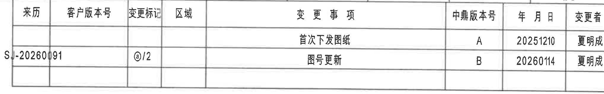
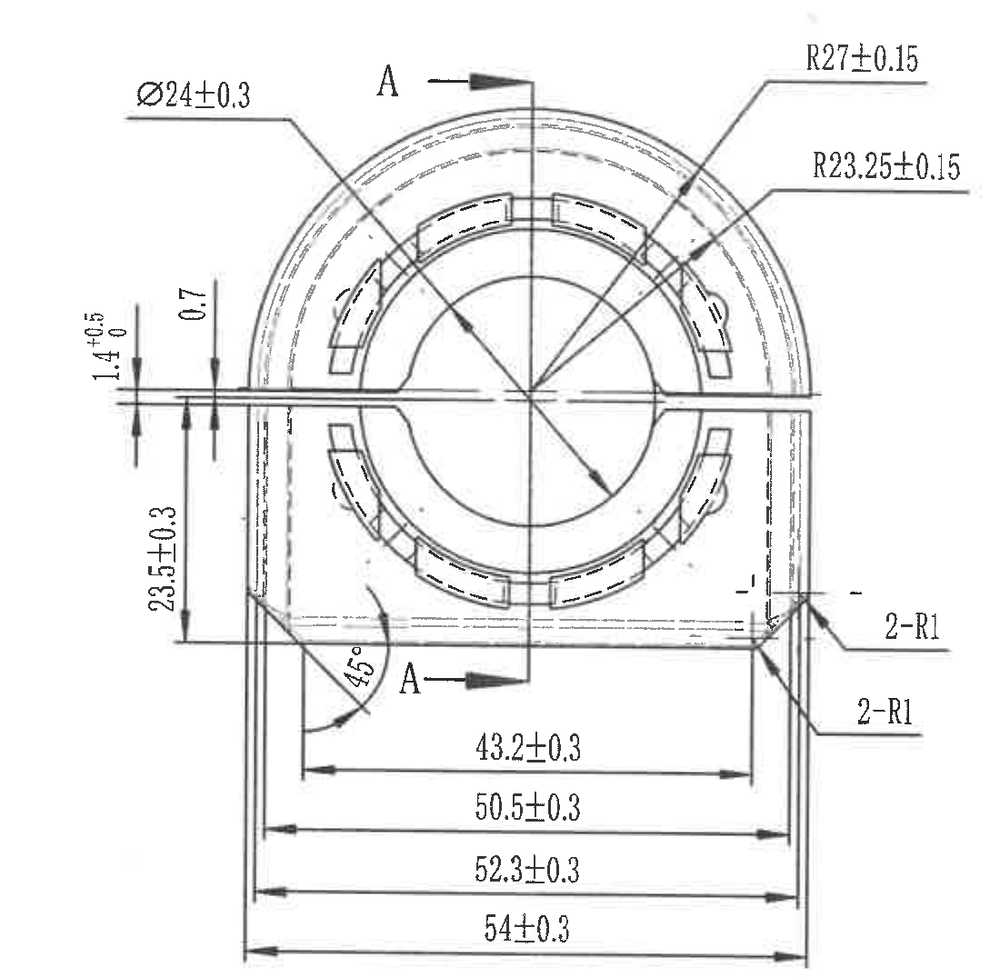
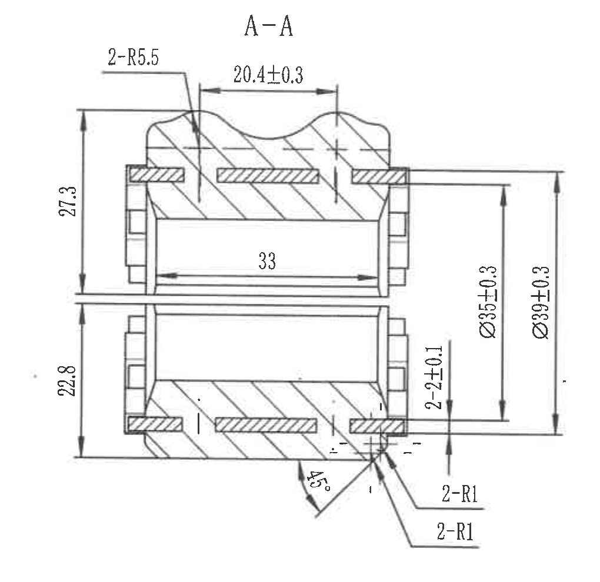
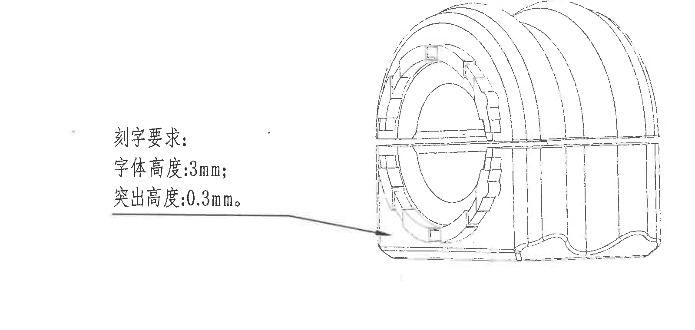
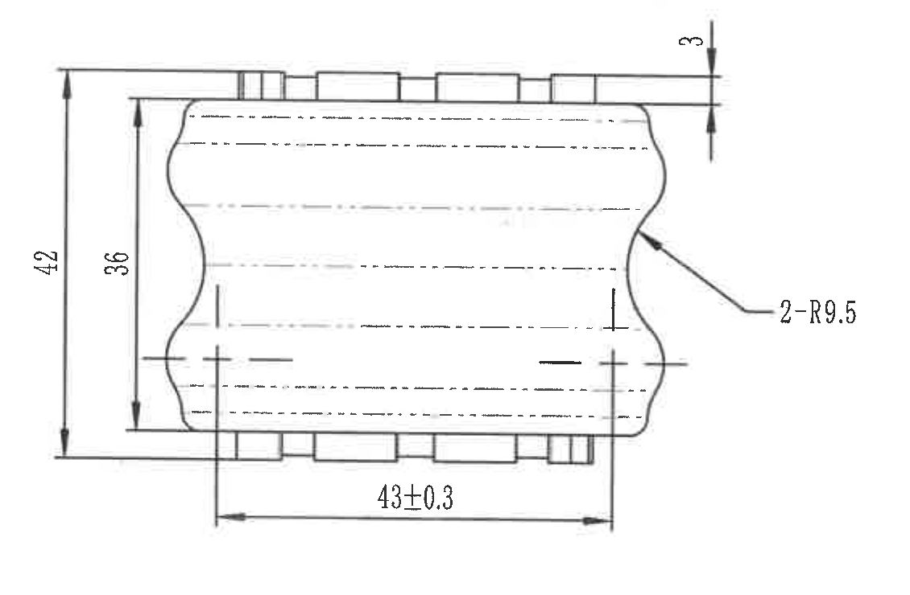
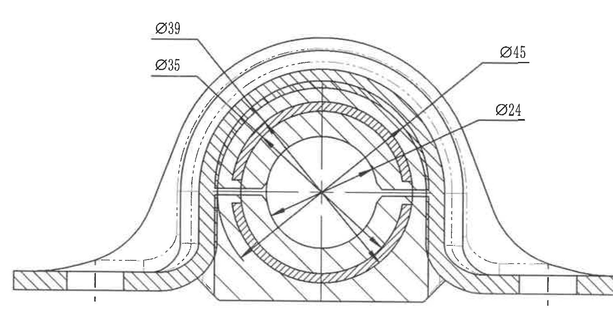
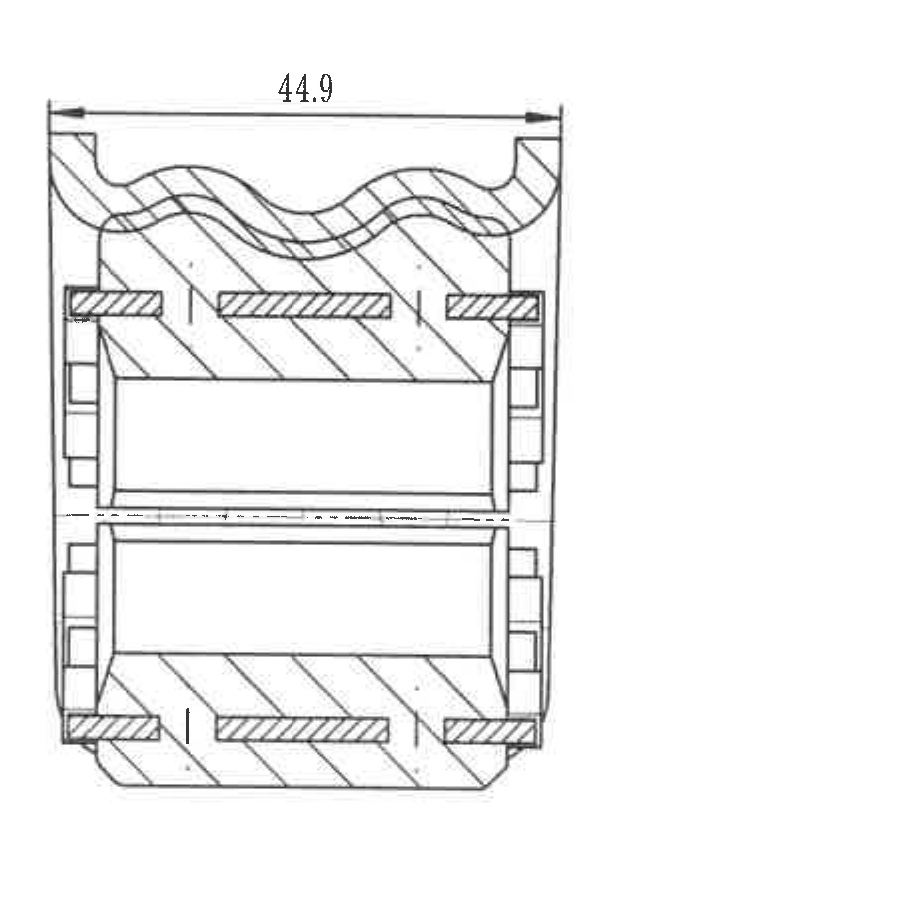
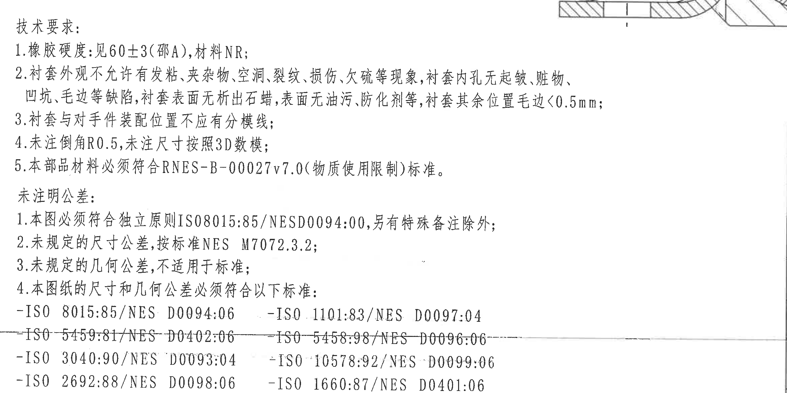
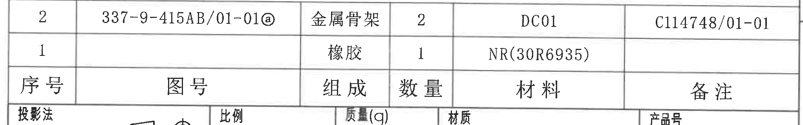
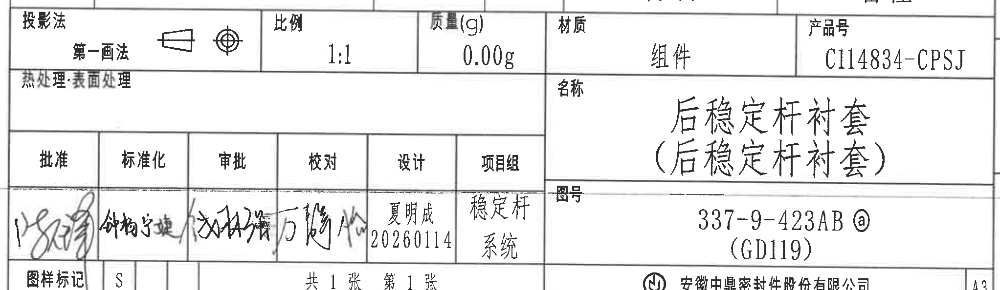

# 20C114834 内容识别结果

整页 PNG：`outputs/20C114834_assets/images/page_1.png`  
页面尺寸：4959 x 3505 px。页面共 1 页。

全局可见性说明：图中可辨的加工/剖面/局部视图内未见括号形式的参考尺寸，未见带星号关键尺寸，未见 T 编号。括号文本出现在标题栏名称复写和材料牌号 `NR(30R6935)`，不属于参考尺寸。未标注公差的尺寸按 NOTES 中“未注明公差”要求处理。

## object_7 修订履历表



原图位置/视图名称：第 1 页右上角修订履历表，bbox `[2735, 185, 4770, 505]`。

原表格还原：

| 来源 | 客户版本号 | 变更标记 | 区域 | 变更事项 | 中鼎版本号 | 年月日 | 变更者 |
|---|---|---|---|---|---|---|---|
|  |  |  |  | 首次下发图纸 | A | 20251210 | 夏明成 |
| S-20260091 |  | ⓐ/2 |  | 图号更新 | B | 20260114 | 夏明成 |

提取表格：

| 提取项 | 原图数值或文本 | 含义说明 |
|---|---|---|
| 表头 | 来源、客户版本号、变更标记、区域、变更事项、中鼎版本号、年月日、变更者 | 修订履历字段。 |
| 修订记录 1 | 首次下发图纸；中鼎版本号 A；日期 20251210；变更者 夏明成 | 初次发布图纸记录。 |
| 修订记录 2 | 来源 S-20260091；变更标记 ⓐ/2；变更事项 图号更新；中鼎版本号 B；日期 20260114；变更者 夏明成 | 图号更新记录，变更标记与图中 circled a 标记对应。 |

边界归属说明：裁切区域只包含右上修订表。表上方和右侧图框线靠近裁切边界，但未纳入任何加工视图尺寸；没有把相邻坐标框或图形视图内容作为表格字段提取。

## object_1 左上主视图/端面视图



原图位置/视图名称：第 1 页左上主视图/端面视图，含 A-A 剖切指示，bbox `[470, 360, 1570, 1435]`。

提取表格：

| 提取项 | 原图数值或文本 | 含义说明 |
|---|---|---|
| 剖切标识 | A、A-A 剖切箭头 | 指示该端面视图中竖向剖切位置，对应 object_2 的 A-A 剖视图。 |
| 直径尺寸 | Ø24±0.3 | 中心孔/内圆相关直径，带 ±0.3 公差。 |
| 外圆弧半径 | R27±0.15 | 外侧上半圆弧半径，带 ±0.15 公差。 |
| 内侧弧半径 | R23.25±0.15 | 内侧弧线半径，带 ±0.15 公差。 |
| 台阶/间隙尺寸 | 1.4 +0.5/0 | 左侧靠水平分型线的竖向尺寸，上偏差 +0.5、下偏差 0。 |
| 局部尺寸 | 0.7 | 左侧靠水平分型线的局部竖向尺寸，图中未单独给公差。 |
| 竖向尺寸 | 23.5±0.3 | 下部矩形侧壁到分型线/基准水平线的竖向距离，带 ±0.3 公差。 |
| 角度 | 45° | 左下转角/斜面角度。 |
| 横向尺寸 | 43.2±0.3 | 下部内侧宽度尺寸，带 ±0.3 公差。 |
| 横向尺寸 | 50.5±0.3 | 下部中间宽度尺寸，带 ±0.3 公差。 |
| 横向尺寸 | 52.3±0.3 | 下部外侧宽度尺寸，带 ±0.3 公差。 |
| 总宽尺寸 | 54±0.3 | 该端面视图底部最大外宽，带 ±0.3 公差。 |
| 圆角 | 2-R1 | 右侧上部引线所指两处 R1 圆角。 |
| 圆角 | 2-R1 | 右侧下部引线所指两处 R1 圆角。 |
| 参考尺寸/星号/T 编号 | 未见 | 本视图未见括号参考尺寸、星号关键尺寸或 T 编号。 |

边界归属说明：上方 `Ø24±0.3`、右上 `R27±0.15`、`R23.25±0.15`、右侧两处 `2-R1`、底部四条横向尺寸线均完整保留。底边裁切停在 `54±0.3` 尺寸线下方，未把下方侧视图的 `3` 或 `2-R9.5` 标注归入本视图。

## object_2 A-A 剖视图



原图位置/视图名称：第 1 页上中部 A-A 剖视图，bbox `[1580, 300, 2600, 1290]`。

提取表格：

| 提取项 | 原图数值或文本 | 含义说明 |
|---|---|---|
| 视图名称 | A-A | 由 object_1 的 A-A 剖切位置得到的剖视图。 |
| 圆角 | 2-R5.5 | 上部曲面/凹部两处 R5.5 圆角。 |
| 横向尺寸 | 20.4±0.3 | 上部凸台/槽位间距，带 ±0.3 公差。 |
| 竖向尺寸 | 27.3 | 上半部从中间分型线到上边界的高度，未单独标公差。 |
| 竖向尺寸 | 22.8 | 下半部从中间分型线到下边界的高度，未单独标公差。 |
| 内部横向尺寸 | 33 | 中间孔/内腔轴向长度，未单独标公差。 |
| 直径尺寸 | Ø35±0.3 | 剖面中右侧内/外圆相关直径，带 ±0.3 公差。 |
| 直径尺寸 | Ø39±0.3 | 剖面中右侧外圆相关直径，带 ±0.3 公差。 |
| 台阶尺寸 | 2±0.1 | 右下局部高度/台阶尺寸，带 ±0.1 公差。 |
| 角度 | 45° | 下部斜面/倒角角度。 |
| 圆角 | 2-R1 | 右下上方引线所指两处 R1 圆角。 |
| 圆角 | 2-R1 | 右下下方引线所指两处 R1 圆角。 |
| 参考尺寸/星号/T 编号 | 未见 | 本剖视图未见括号参考尺寸、星号关键尺寸或 T 编号。 |

边界归属说明：A-A 标题、上方 `2-R5.5`、`20.4±0.3`、左右竖向尺寸、右侧直径尺寸和右下局部圆角标注均完整包含。右侧边界未包含右侧刻字示意图；左侧边界未包含左上主视图尺寸。

## object_3 刻字要求与三维示意局部图



原图位置/视图名称：第 1 页右上/中右部刻字要求及三维示意图，bbox `[2820, 650, 4420, 1410]`。

提取表格：

| 提取项 | 原图数值或文本 | 含义说明 |
|---|---|---|
| 文本标题 | 刻字要求： | 说明右侧三维示意中的刻字/凸字要求。 |
| 字体高度 | 字体高度: 3mm; | 刻字字体高度要求为 3 mm。 |
| 突出高度 | 突出高度: 0.3mm。 | 刻字或凸起特征突出高度为 0.3 mm。 |
| 示意图 | 右侧三维外观示意 | 显示衬套外观、环向槽和纵向分布特征，用于说明刻字位置/外观关系。 |
| 参考尺寸/星号/T 编号 | 未见 | 本局部示意未见括号参考尺寸、星号关键尺寸或 T 编号。 |

边界归属说明：裁切区域包含刻字要求文本、指向线和完整三维示意。未把左侧 A-A 剖视图或下方 E-E/安装视图尺寸归入该对象。

## object_4 左中侧视图



原图位置/视图名称：第 1 页左中侧视图，bbox `[530, 1430, 1660, 2170]`。

提取表格：

| 提取项 | 原图数值或文本 | 含义说明 |
|---|---|---|
| 局部凸起高度 | 3 | 上方小凸起/台阶高度尺寸，未单独标公差。 |
| 总高度 | 42 | 侧视图外形总高度，未单独标公差。 |
| 内部高度 | 36 | 侧视图内侧主体高度，未单独标公差。 |
| 圆弧/凹面半径 | 2-R9.5 | 左右波形侧面两处 R9.5 圆弧/凹面半径。 |
| 横向尺寸 | 43±0.3 | 底部长度/宽度尺寸，带 ±0.3 公差。 |
| 参考尺寸/星号/T 编号 | 未见 | 本视图未见括号参考尺寸、星号关键尺寸或 T 编号。 |

边界归属说明：右侧 `2-R9.5` 引线与文字、底部 `43±0.3` 尺寸线、左侧 `42` 和 `36` 尺寸线、上方 `3` 标注均完整保留。下边界停在底部尺寸线下方，未提取下方 NOTES 文本。

## object_5 E-E 剖面视图



原图位置/视图名称：第 1 页中下部 E-E 剖面视图，bbox `[2050, 1455, 3560, 2265]`。原图中 `E-E 1:1` 标识位于视图下方，靠近右侧“衬套安装示意图”标题和左下 NOTES；本裁切为避免混入相邻文字，保留剖面几何和尺寸标注，未把下方标识纳入图片。

提取表格：

| 提取项 | 原图数值或文本 | 含义说明 |
|---|---|---|
| 视图名称 | E-E | 原图下方标注为 E-E，比例 1:1。 |
| 直径尺寸 | Ø39 | 左上引线所指外层圆/孔径相关直径，未在该处单独给公差。 |
| 直径尺寸 | Ø35 | 左侧第二条引线所指内层圆/孔径相关直径，未在该处单独给公差。 |
| 直径尺寸 | Ø45 | 右上引线所指外侧安装/包络直径，未在该处单独给公差。 |
| 直径尺寸 | Ø24 | 右侧引线所指内孔直径，未在该处单独给公差。 |
| 剖面/材料表达 | 斜线剖面线 | 表示剖切到的实体区域和装配/包覆关系。 |
| 参考尺寸/星号/T 编号 | 未见 | 本剖面未见括号参考尺寸、星号关键尺寸或 T 编号。 |

边界归属说明：四处直径标注 `Ø39`、`Ø35`、`Ø45`、`Ø24` 的文字和引线均完整包含。下方 `E-E 1:1` 标识因与 NOTES 和安装示意标题同带相邻，未放入裁图；该标识仅作为本对象名称/上下文记录。右侧安装示意图的 `44.9` 尺寸不归入本剖面。

## object_6 衬套安装示意图



原图位置/视图名称：第 1 页右中部衬套安装示意图，bbox `[3840, 1455, 4740, 2365]`。原图标题“衬套安装示意图”位于该视图左下方、E-E 标识右侧；为避免把 E-E 的 `Ø45`、`Ø24` 标注切入本图，裁图保留安装剖面和尺寸线，标题文字作为上下文记录。

提取表格：

| 提取项 | 原图数值或文本 | 含义说明 |
|---|---|---|
| 视图名称 | 衬套安装示意图 | 原图标题，说明该剖面用于表达衬套安装状态。 |
| 横向尺寸 | 44.9 | 顶部横向尺寸，表示安装示意剖面中的外侧宽度/跨距，未单独标公差。 |
| 剖面/材料表达 | 斜线剖面线、金属嵌件/骨架阴影 | 表示装配状态下橡胶与嵌件/骨架的相对位置。 |
| 参考尺寸/星号/T 编号 | 未见 | 本示意图未见括号参考尺寸、星号关键尺寸或 T 编号。 |

边界归属说明：`44.9` 尺寸线和箭头完整保留，剖面上下轮廓完整。左侧标题因与 E-E 剖面尺寸区相邻未纳入裁图；左侧 E-E 的 `Ø45`、`Ø24` 不归入本对象。

## object_8 NOTES/技术要求与未注明公差



原图位置/视图名称：第 1 页左下 NOTES/技术要求区，bbox `[420, 2120, 2760, 3290]`。

文本还原：

```text
技术要求:
1.橡胶硬度:见60±3(邵A),材料NR;
2.衬套外观不允许有发粘、夹杂物、空洞、裂纹、损伤、欠硫等现象,衬套内孔无起皱、脏物、
  凹坑、毛边等缺陷,衬套表面无析出石蜡,表面无油污、防化剂等,衬套其余位置毛边<0.5mm;
3.衬套与对手件装配位置不应有分模线;
4.未注倒角R0.5,未注尺寸按照3D数模;
5.本部品材料必须符合RNES-B-00027v7.0(物质使用限制)标准。

未注明公差:
1.本图必须符合独立原则ISO8015:85/NESD0094:00,另有特殊备注除外;
2.未规定的尺寸公差,按标准NES M7072.3.2;
3.未规定的几何公差,不适用于标准;
4.本图纸的尺寸和几何公差必须符合以下标准:
-ISO 8015:85/NES D0094:06    -ISO 1101:83/NES D0097:04
-ISO 5459:81/NES D0402:06    -ISO 5458:98/NES D0096:06
-ISO 3040:90/NES D0093:04    -ISO 10578:92/NES D0099:06
-ISO 2692:88/NES D0098:06    -ISO 1660:87/NES D0401:06
```

提取表格：

| 提取项 | 原图数值或文本 | 含义说明 |
|---|---|---|
| 橡胶硬度 | 见60±3(邵A),材料NR | 硬度要求为邵氏 A 60±3，材料为 NR。 |
| 外观缺陷限制 | 不允许发粘、夹杂物、空洞、裂纹、损伤、欠硫等 | 外观质量要求。 |
| 内孔缺陷限制 | 内孔无起皱、脏物、凹坑、毛边等缺陷 | 内孔质量要求。 |
| 表面要求 | 无析出石蜡、无油污、防化剂等 | 表面清洁和析出物限制。 |
| 毛边限制 | 其余位置毛边<0.5mm | 非指定位置毛边高度小于 0.5 mm。 |
| 装配分模线 | 装配位置不应有分模线 | 与对手件装配位置不得出现分模线。 |
| 未注倒角 | R0.5 | 未注倒角按 R0.5。 |
| 未注尺寸 | 按照3D数模 | 未标注尺寸以 3D 数模为准。 |
| 材料限制标准 | RNES-B-00027v7.0 | 材料需满足物质使用限制标准。 |
| 未注尺寸公差 | NES M7072.3.2 | 未规定尺寸公差按该标准。 |
| 标准列表 | ISO 8015、ISO 1101、ISO 5459、ISO 5458、ISO 3040、ISO 10578、ISO 2692、ISO 1660 及对应 NES 标准 | 尺寸和几何公差引用标准。 |

边界归属说明：NOTES 文本完整保留。上边缘右侧存在 E-E 剖面底部的极少量线条片段，这是原图中 NOTES 与 E-E 区域距离过近造成；没有把该线条片段作为 NOTES 文本或尺寸提取。底部图框坐标线穿过标准列表附近，但标准文字可辨并已逐行还原。

## object_9 明细表/BOM 表



原图位置/视图名称：第 1 页右下方明细表，位于标题栏上方，bbox `[2740, 2495, 4785, 2815]`。

原表格还原：

| 序号 | 图号 | 组成 | 数量 | 材料 | 备注 |
|---|---|---|---|---|---|
| 2 | 337-9-415AB/01-01ⓐ | 金属骨架 | 2 | DC01 | C114748/01-01 |
| 1 |  | 橡胶 | 1 | NR(30R6935) |  |

提取表格：

| 提取项 | 原图数值或文本 | 含义说明 |
|---|---|---|
| 表头 | 序号、图号、组成、数量、材料、备注 | 明细/BOM 字段。 |
| 序号 2 | 图号 337-9-415AB/01-01ⓐ；组成 金属骨架；数量 2；材料 DC01；备注 C114748/01-01 | 金属骨架明细行。 |
| 序号 1 | 组成 橡胶；数量 1；材料 NR(30R6935) | 橡胶明细行，图号和备注单元格为空白。 |

边界归属说明：裁切区域包含明细表两条记录和表头。下方标题栏与明细表共用边框，图片底部可见标题栏上边线，但标题栏字段未作为明细表内容提取。

## object_10 标题栏



原图位置/视图名称：第 1 页右下角标题栏，bbox `[2740, 2745, 4785, 3340]`。

标题栏表格还原：

| 字段 | 原图数值或文本 |
|---|---|
| 投影法 | 第一画法（旁有投影符号） |
| 比例 | 1:1 |
| 质量(g) | 0.00g |
| 材质 | 组件 |
| 产品号 | C114834-CPSJ |
| 热处理/表面处理 | 原栏位可见，未填写具体值 |
| 名称 | 后稳定杆衬套（后稳定杆衬套） |
| 图号 | 337-9-423ABⓐ（GD119） |
| 批准 | 手写签名，图像不够清晰 |
| 标准化 | 手写签名，图像不够清晰 |
| 审批 | 手写签名，图像不够清晰 |
| 校对 | 手写签名，图像不够清晰 |
| 设计 | 夏明成 / 20260114 |
| 项目组 | 稳定杆系统 |
| 图样标记 | S |
| 张数 | 共 1 张 第 1 张 |
| 公司 | 安徽中鼎密封件股份有限公司 |
| 图幅 | A3 |

提取表格：

| 提取项 | 原图数值或文本 | 含义说明 |
|---|---|---|
| 产品号 | C114834-CPSJ | 产品/零件识别号。 |
| 名称 | 后稳定杆衬套（后稳定杆衬套） | 零件名称；括号中为名称重复标注，不是参考尺寸。 |
| 图号 | 337-9-423ABⓐ（GD119） | 图纸编号，含 circled a 变更标记和括号内 GD119。 |
| 比例 | 1:1 | 图纸比例。 |
| 质量 | 0.00g | 标题栏给出的质量值。 |
| 材质 | 组件 | 标题栏材质栏填写为组件。 |
| 投影法 | 第一画法 | 投影方法为第一角法/第一画法。 |
| 设计 | 夏明成 20260114 | 设计栏签署信息。 |
| 项目组 | 稳定杆系统 | 项目组/系统信息。 |
| 公司 | 安徽中鼎密封件股份有限公司 | 出图单位。 |

边界归属说明：标题栏与上方明细表共用横线，裁切顶部带入了部分明细表下边线，但明细行未作为标题栏字段提取。底部公司名、图样标记、张数和 A3 图幅均在裁切内。手写签名因扫描模糊，按可辨程度记录为“手写签名，图像不够清晰”，未主观补写。

## 裁切检查记录

| 对象 | 图片路径 | 检查结果 |
|---|---|---|
| object_1 | outputs/20C114834_assets/images/object_1.png | 完整包含主视图尺寸线、箭头和文字；未混入下方侧视图尺寸。 |
| object_2 | outputs/20C114834_assets/images/object_2.png | 完整包含 A-A 剖视图标题、尺寸线、箭头和文字；未混入相邻视图。 |
| object_3 | outputs/20C114834_assets/images/object_3.png | 完整包含刻字要求文本、指向线和三维示意；无边缘文字裁断。 |
| object_4 | outputs/20C114834_assets/images/object_4.png | 完整包含 `3`、`42`、`36`、`43±0.3`、`2-R9.5`；下方 NOTES 未作为视图内容提取。 |
| object_5 | outputs/20C114834_assets/images/object_5.png | 完整包含 E-E 剖面几何和 `Ø39`、`Ø35`、`Ø45`、`Ø24` 标注；为避免混入相邻文字，未把下方 `E-E 1:1` 标识纳入裁图，但在上下文中记录。 |
| object_6 | outputs/20C114834_assets/images/object_6.png | 完整包含安装示意剖面和 `44.9` 尺寸线；标题位于原图左下相邻区，未裁入以避免带入 E-E 尺寸。 |
| object_7 | outputs/20C114834_assets/images/object_7.png | 修订履历表行列完整；表格边线和文字完整。 |
| object_8 | outputs/20C114834_assets/images/object_8.png | NOTES 文本完整；上方有极少量 E-E 线条片段，未作为 NOTES 内容提取。 |
| object_9 | outputs/20C114834_assets/images/object_9.png | 明细表表头和两条记录完整；与标题栏共用边线，未提取标题栏字段。 |
| object_10 | outputs/20C114834_assets/images/object_10.png | 标题栏主要字段完整；手写签名区图像模糊但未被裁断。 |
