# 20C114837 内容识别

整页渲染图：`outputs/20C114837_assets/images/page_1.png`

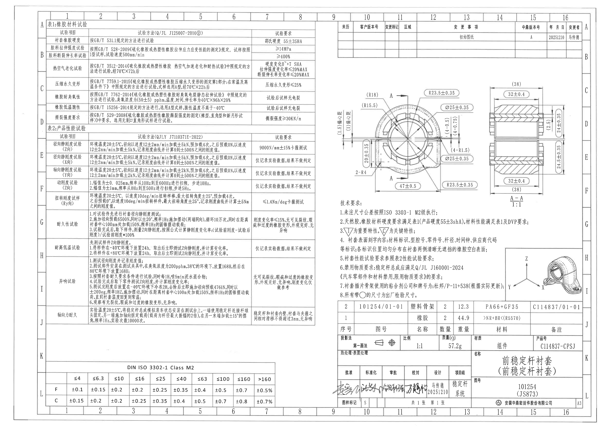

## object_1 | table | 表1：橡胶材料试验

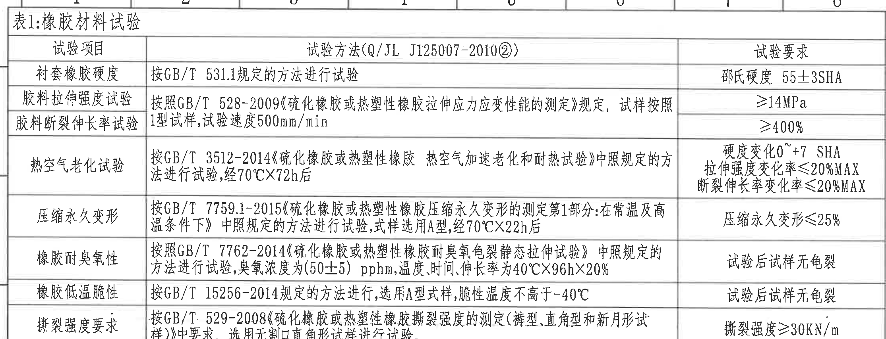

原图位置：page 1，bbox `[360, 145, 2590, 1000]`。视图名称：表1：橡胶材料试验。

### 原表还原

| 试验项目 | 试验方法(Q/JL J125007-2010②) | 试验要求 |
|---|---|---|
| 衬套橡胶硬度 | 按GB/T 531.1规定的方法进行试验 | 邵氏硬度 55±3SHA |
| 胶料拉伸强度试验 | 按照GB/T 528-2009《硫化橡胶或热塑性橡胶拉伸应力应变性能的测定》规定，试样按照1型试样，试验速度500mm/min | ≥14MPa |
| 胶料断裂伸长率试验 | 同上，原图方法栏与上一行合并 | ≥400% |
| 热空气老化试验 | 按GB/T 3512-2014《硫化橡胶或热塑性橡胶 热空气加速老化和耐热试验》中照规定的方法进行试验，经70℃×72h后 | 硬度变化0~+7 SHA；拉伸强度变化率≤20%MAX；断裂伸长率变化率≤20%MAX |
| 压缩永久变形 | 按GB/T 7759.1-2015《硫化橡胶或热塑性橡胶压缩永久变形的测定第1部分：在常温及高温条件下》中照规定的方法进行试验，试样选用A型，经70℃×22h后 | 压缩永久变形≤25% |
| 橡胶耐臭氧性 | 按照GB/T 7762-2014《硫化橡胶或热塑性橡胶耐臭氧龟裂静态拉伸试验》中照规定的方法进行试验，臭氧浓度为(50±5) pphm，温度、时间、伸长率为40℃×96h×20% | 试验后试样无龟裂 |
| 橡胶低温脆性 | 按GB/T 15256-2014规定的方法进行，选用A型式样，脆性温度不高于-40℃ | 试验后试样无龟裂 |
| 撕裂强度要求 | 按GB/T 529-2008《硫化橡胶或热塑性橡胶撕裂强度的测定(裤型、直角型和新月形试样)》中要求，选用无割口直角形试样进行试验。 | 撕裂强度≥30KN/m |

### 提取表格

| 提取项 | 原图数值或文本 | 含义说明 |
|---|---|---|
| 表编号 | 表1：橡胶材料试验 | 橡胶材料的材料性能与基础试验要求。 |
| 依据文件 | Q/JL J125007-2010② | 表1试验方法栏标题中的企业标准编号。 |
| 衬套橡胶硬度 | 邵氏硬度 55±3SHA | 产品橡胶硬度要求，后续技术要求第2条引用该硬度。 |
| 拉伸强度 | ≥14MPa | 胶料拉伸强度最低要求。 |
| 断裂伸长率 | ≥400% | 胶料断裂伸长率最低要求。 |
| 热空气老化 | 70℃×72h后；硬度变化0~+7 SHA；拉伸强度变化率≤20%MAX；断裂伸长率变化率≤20%MAX | 老化后的硬度、拉伸强度和伸长率变化限制。 |
| 压缩永久变形 | 70℃×22h后；压缩永久变形≤25% | A型试样在规定热压条件后的压缩永久变形上限。 |
| 臭氧试验 | (50±5) pphm；40℃×96h×20%；试验后试样无龟裂 | 静态拉伸臭氧环境下不得发生龟裂。 |
| 低温脆性 | 脆性温度不高于-40℃；试验后试样无龟裂 | 低温脆性合格要求。 |
| 撕裂强度 | 撕裂强度≥30KN/m | 无割口直角形试样撕裂强度最低要求。 |

边界归属说明：该裁切只提取表1内容；顶部图框坐标栏已排除，底部到表1最后一行边界，未把表2标题或数据归入表1。

## object_2 | table | 表2：产品性能试验

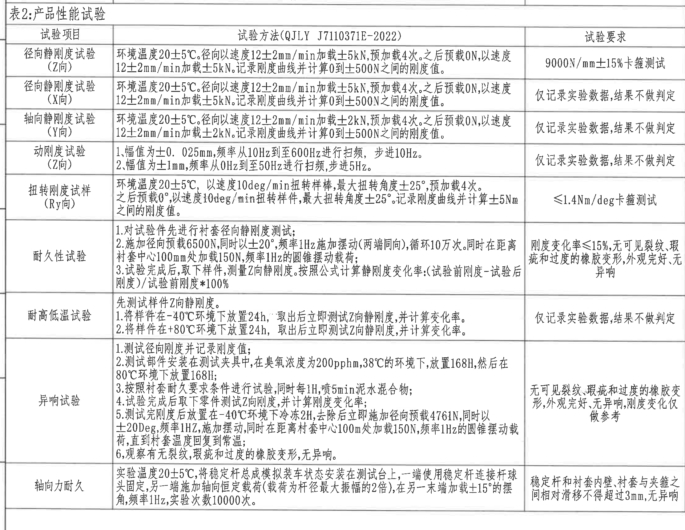

原图位置：page 1，bbox `[360, 1010, 2585, 2735]`。视图名称：表2：产品性能试验。

### 原表还原

| 试验项目 | 试验方法(QJLY J7110371E-2022) | 试验要求 |
|---|---|---|
| 径向静刚度试验(Z向) | 环境温度20±5℃。径向以速度12±2mm/min加载±5kN，预加载4次。之后预载0N，以速度12±2mm/min加载±5kN。记录刚度曲线并计算0到±500N之间的刚度值。 | 9000N/mm±15%卡箍测试 |
| 径向静刚度试验(X向) | 环境温度20±5℃。径向以速度12±2mm/min加载±5kN，预加载4次。之后预载0N，以速度12±2mm/min加载±5kN。记录刚度曲线并计算0到±500N之间的刚度值。 | 仅记录实验数据，结果不做判定 |
| 轴向静刚度试验(Y向) | 环境温度20±5℃。径向以速度12±2mm/min加载±2kN，预加载4次。之后预载0N，以速度12±2mm/min加载±2kN。记录刚度曲线并计算0到±500N之间的刚度值。 | 仅记录实验数据，结果不做判定 |
| 动刚度试验(Z向) | 1、幅值为±0.025mm，频率从10Hz到至600Hz进行扫频，步进10Hz。 2、幅值为±1mm，频率从0Hz到至50Hz进行扫频，步进5Hz。 | 仅记录实验数据，结果不做判定 |
| 扭转刚度试样(Ry向) | 环境温度20±5℃，以速度10deg/min扭转样棒，最大扭转角度±25°，预加载4次。之后预载0°，以速度10deg/min扭转样件，最大扭转角度±25°。记录刚度曲线并计算±5Nm之间的刚度值。 | ≤1.4Nm/deg卡箍测试 |
| 耐久性试验 | 1. 对试验件先进行衬套径向静刚度测试； 2. 施加径向预载6500N，同时以±20°，频率1Hz施加摆动(两端同向)，循环10万次。同时在距离衬套中心100mm处加载150N，频率1Hz的圆锥摆动载荷； 3. 试验完成后，取下样件，测量Z向静刚度。按照公式计算静刚度变化率：(试验前刚度-试验后刚度)/试验前刚度*100% | 刚度变化率≤15%，无可见裂纹、瑕疵和过度的橡胶变形，外观完好，无异响 |
| 耐高低温试验 | 先测试样件Z向静刚度。 1. 将样件在-40℃环境下放置24h，取出后立即测试Z向静刚度，并计算变化率。 2. 将样件在+80℃环境下放置24h，取出后立即测试Z向静刚度，并计算变化率。 | 仅记录实验数据，结果不做判定 |
| 异响试验 | 1. 测试径向刚度并记录刚度值； 2. 测试部件安装在测试夹具中，在臭氧浓度为200pphm，38℃的环境下，放置168H，然后在80℃环境下放置168H； 3. 按照衬套耐久要求条件进行试验，同时每1H，喷5min泥水混合物； 4. 试验完成后取下零件测试Z向刚度，并计算刚度变化率； 5. 测试完刚度后放置在-40℃环境下冷冻2H，去除后立即施加径向预载4761N，同时以±20Deg，频率1Hz，施加摆动，同时在距离衬套中心100mm处加载150N，频率1Hz的圆锥摆动载荷，直到衬套温度回复到常温； 6. 观察有无裂纹，瑕疵和过度的橡胶变形，无异响。 | 无可见裂纹、瑕疵和过度的橡胶变形，外观完好，无异响，刚度变化仅做参考 |
| 轴向力耐久 | 实验温度20±5℃，将稳定杆总成模拟装车状态安装在测试台上，一端使用稳定杆连接杆球头固定，另一端施加轴向恒定载荷(载荷为杆径最大振幅的2倍)，在另一末端加载±15°的摆角，频率1Hz，实验次数10000次。 | 稳定杆和衬套内壁、衬套与夹箍之间相对滑移不得超过3mm，无异响 |

### 提取表格

| 提取项 | 原图数值或文本 | 含义说明 |
|---|---|---|
| 表编号 | 表2：产品性能试验 | 产品级性能/DVP试验项目清单。 |
| 方法标准 | QJLY J7110371E-2022 | 表2试验方法栏标题中的企业标准编号。 |
| Z向径向静刚度 | 9000N/mm±15%卡箍测试 | Z向静刚度为判定项。 |
| X向径向静刚度 | 仅记录实验数据，结果不做判定 | X向静刚度只记录。 |
| Y向轴向静刚度 | 仅记录实验数据，结果不做判定 | Y向静刚度只记录。 |
| 动刚度扫频 | ±0.025mm，10Hz到600Hz，步进10Hz；±1mm，0Hz到50Hz，步进5Hz | Z向动态刚度扫频条件。 |
| 扭转刚度 | ≤1.4Nm/deg卡箍测试 | Ry向扭转刚度判定上限。 |
| 耐久性 | 径向预载6500N；±20°；1Hz；循环10万次；100mm处加载150N | 耐久试验载荷、摆角、频率和次数。 |
| 耐久性判定 | 刚度变化率≤15%，无可见裂纹、瑕疵和过度橡胶变形，外观完好，无异响 | 耐久后外观和刚度变化率要求。 |
| 耐高低温 | -40℃ 24h；+80℃ 24h | 高低温暴露后测Z向静刚度并计算变化率。 |
| 异响试验 | 200pphm臭氧、38℃放置168H；80℃放置168H；每1H喷5min泥水；-40℃冷冻2H；径向预载4761N | 异响/外观/刚度参考试验条件。 |
| 轴向力耐久 | ±15°摆角；1Hz；10000次；相对滑移不得超过3mm | 轴向耐久的运动条件和滑移限值。 |

边界归属说明：该裁切从“表2：产品性能试验”标题开始，到“轴向力耐久”最后一行结束；未提取表1最后一行，也未把左下DIN ISO公差表归入表2。

## object_3 | table | 修订履历表

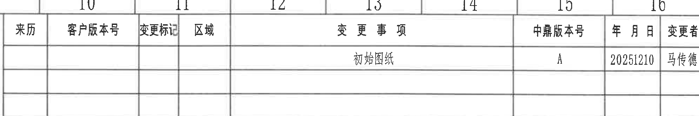

原图位置：page 1，bbox `[2765, 135, 4760, 470]`。视图名称：右上修订履历表。

### 原表还原

| 来历 | 客户版本号 | 变更标记 | 区域 | 变更事项 | 中鼎版本号 | 年月日 | 变更者 |
|---|---|---|---|---|---|---|---|
|  |  |  |  | 初始图纸 | A | 20251210 | 马传德 |
|  |  |  |  |  |  |  |  |
|  |  |  |  |  |  |  |  |

### 提取表格

| 提取项 | 原图数值或文本 | 含义说明 |
|---|---|---|
| REV/中鼎版本号 | A | 初始版本号。 |
| DESCRIPTION/变更事项 | 初始图纸 | 修订描述。 |
| DATE/年月日 | 20251210 | 修订日期，原图为8位数字格式。 |
| BY/变更者 | 马传德 | 修订人。 |
| LOC/区域 | 空白 | 原表该次修订未填写区域。 |
| ECN NO | 空白 | 原表未设置或未填写ECN编号；对应行为空白。 |

边界归属说明：裁切包含修订履历表主体；顶部少量图框坐标数字只作为图框背景，不作为修订履历字段提取。

## object_4 | view | 主视图/加工视图

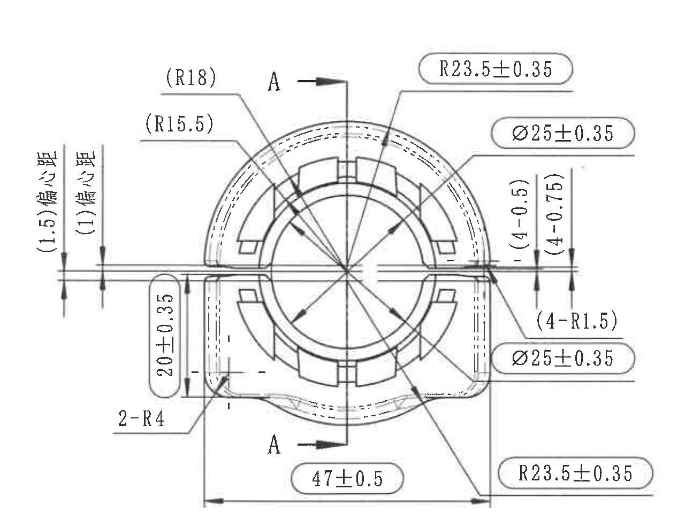

原图位置：page 1，bbox `[2700, 635, 3995, 1595]`。视图名称：主视图，含A-A剖切位置指示。

### 提取表格

| 提取项 | 原图数值或文本 | 含义说明 |
|---|---|---|
| 剖切标识 | A、A | 两个A箭头标示A-A剖视切割方向和位置；该标识属于主视图，不是尺寸值。 |
| 参考半径 | (R18) | 括号内参考半径，指向上左侧外圆弧相关轮廓。 |
| 参考半径 | (R15.5) | 括号内参考半径，指向内侧/槽形圆弧相关轮廓。 |
| 半径 | R23.5±0.35 | 右上引出，圆弧半径带±0.35公差。 |
| 半径 | R23.5±0.35 | 右下引出，圆弧半径带±0.35公差。 |
| 直径 | Ø25±0.35 | 右上引出，圆形/内孔相关直径尺寸。 |
| 直径 | Ø25±0.35 | 右下引出，圆形/内孔相关直径尺寸。 |
| 参考偏心距 | (1.5)偏心距 | 左侧竖向参考偏心距；括号表示参考尺寸。 |
| 参考偏心距 | (1)偏心距 | 左侧竖向参考偏心距；括号表示参考尺寸。 |
| 参考尺寸 | (4-0.5) | 右侧竖向括号内尺寸，带负向偏差标注，归属于主视图右侧局部间距。 |
| 参考尺寸 | (4-0.75) | 右侧竖向括号内尺寸，带负向偏差标注，归属于主视图右侧局部间距。 |
| 圆角数量半径 | (4-R1.5) | 括号内4处R1.5参考圆角，指向右下局部圆角。 |
| 高度/局部尺寸 | 20±0.35 | 左下竖向尺寸，带±0.35公差。 |
| 圆角数量半径 | 2-R4 | 2处R4圆角，位于左下引出位置。 |
| 总宽/下部宽度 | 47±0.5 | 底部水平尺寸，带±0.5公差。 |
| T编号 | 未见 | 当前主视图未显示T编号。 |

边界归属说明：左侧竖向偏心距和右侧(4-0.5)/(4-0.75)完整保留；右侧未提取相邻A-A剖视图中的(38)、32±0.4、24±0.35等尺寸；底部未提取技术要求文字。

## object_5 | section | A-A剖视图

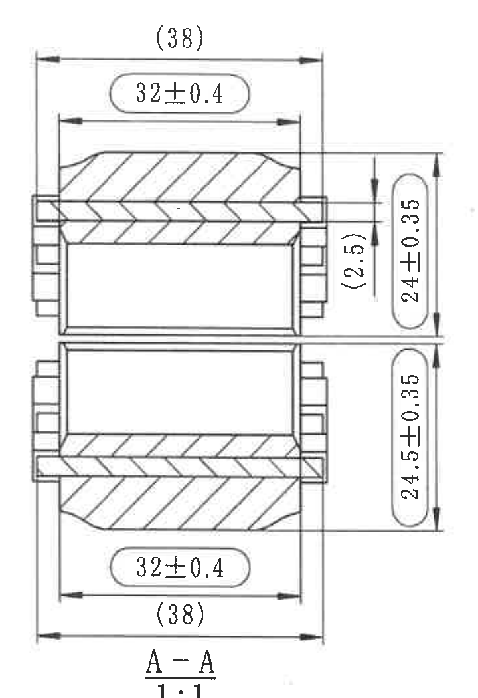

原图位置：page 1，bbox `[3970, 635, 4690, 1685]`。视图名称：A-A剖视图，比例1:1。

### 提取表格

| 提取项 | 原图数值或文本 | 含义说明 |
|---|---|---|
| 剖视名称 | A-A | 与主视图A-A剖切标识对应的剖面图。 |
| 比例 | 1:1 | 剖视图比例。 |
| 参考总宽 | (38) | 上、下两处括号内参考总宽尺寸，剖视图外侧总宽。 |
| 宽度 | 32±0.4 | 上、下两处水平宽度尺寸，带±0.4公差。 |
| 参考高度/间距 | (2.5) | 右侧竖向括号内参考尺寸。 |
| 高度 | 24±0.35 | 上部竖向高度尺寸，带±0.35公差。 |
| 高度 | 24.5±0.35 | 下部竖向高度尺寸，带±0.35公差。 |
| 剖面线 | 斜线剖面填充 | 表示A-A剖切材料截面。 |
| T编号 | 未见 | 当前剖视图未显示T编号。 |

边界归属说明：该裁切只提取A-A剖视图尺寸；不把左侧主视图的R23.5±0.35、Ø25±0.35、47±0.5等归入剖视图。

## object_6 | notes | 技术要求

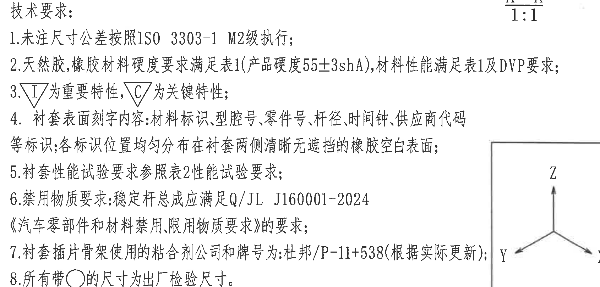

原图位置：page 1，bbox `[2765, 1640, 4455, 2450]`。视图名称：技术要求/NOTES。

### 提取表格

| 提取项 | 原图数值或文本 | 含义说明 |
|---|---|---|
| 1 | 未注尺寸公差按照ISO 3303-1 M2级执行； | 未单独标注公差的尺寸按一般公差表执行。 |
| 2 | 天然胶、橡胶材料硬度要求满足表1(产品硬度55±3shA)，材料性能满足表1及DVP要求； | 橡胶材料硬度和性能引用表1及DVP。 |
| 3 | ▽I为重要特性，▽C为关键特性； | 特性符号含义说明。 |
| 4 | 衬套表面刻字内容：材料标识、型腔号、零件号、杆径、时间钟、供应商代码等标识；各标识位置均匀分布在衬套两侧清晰无遮拦的橡胶空白表面； | 衬套表面文字内容和布置要求。 |
| 5 | 衬套性能试验要求参照表2性能试验要求； | 性能试验按表2执行。 |
| 6 | 禁用物质要求：稳定杆总成应满足Q/JL J160001-2024《汽车零部件和材料禁用、限用物质要求》的要求； | 禁限用物质标准要求。 |
| 7 | 衬套插片骨架使用的粘合剂公司和牌号为：杜邦/P-11+538(根据实际更新)； | 插片骨架粘合剂供应商和牌号。 |
| 8 | 所有带○的尺寸为出厂检验尺寸。 | 带圆圈标识的尺寸为出厂检验尺寸。 |

边界归属说明：技术要求右侧贴近轴测图框，为保证第2、7条文字完整，裁切中可见少量轴测图边框；提取内容只归属NOTES，不提取轴测图中的X/Y/Z和立体轮廓。

## object_7 | detail | 轴测参考图/方向标识

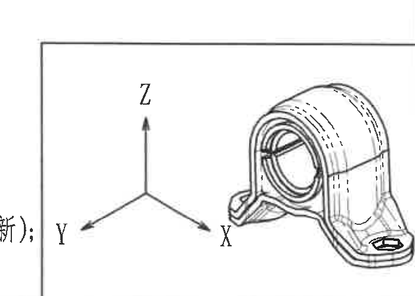

原图位置：page 1，bbox `[4080, 1970, 4775, 2465]`。视图名称：右中轴测参考图。

### 提取表格

| 提取项 | 原图数值或文本 | 含义说明 |
|---|---|---|
| 轴向标识 | X | 右下方向轴。 |
| 轴向标识 | Y | 左下方向轴。 |
| 轴向标识 | Z | 上方向轴。 |
| 参考图形 | 衬套三维轴测轮廓 | 用于说明零件空间形态和方向，不含尺寸标注。 |
| 尺寸 | 未见 | 当前轴测参考图未标注尺寸、角度、弧度或T编号。 |

边界归属说明：左侧可见少量技术要求第7条边缘文字，因与轴测图框相邻产生；该文字不归入轴测对象，轴测对象只提取X/Y/Z方向和立体轮廓。

## object_8 | table | 明细表/BOM

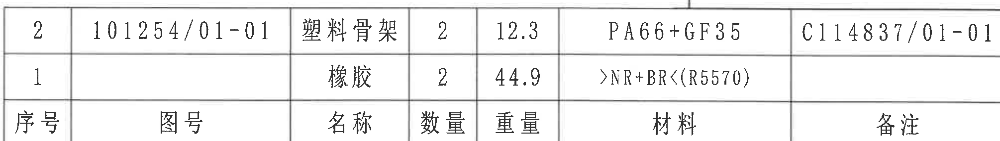

原图位置：page 1，bbox `[2765, 2460, 4775, 2745]`。视图名称：右下明细表。

### 原表还原

| 序号 | 图号 | 名称 | 数量 | 重量 | 材料 | 备注 |
|---|---|---|---|---|---|---|
| 2 | 101254/01-01 | 塑料骨架 | 2 | 12.3 | PA66+GF35 | C114837/01-01 |
| 1 |  | 橡胶 | 2 | 44.9 | >NR+BR<(R5570) |  |

### 提取表格

| 提取项 | 原图数值或文本 | 含义说明 |
|---|---|---|
| 序号2图号 | 101254/01-01 | 塑料骨架图号。 |
| 序号2名称 | 塑料骨架 | 零件名称。 |
| 序号2数量 | 2 | 塑料骨架数量。 |
| 序号2重量 | 12.3 | 单项重量栏数值。 |
| 序号2材料 | PA66+GF35 | 塑料骨架材料。 |
| 序号2备注 | C114837/01-01 | 备注/关联号。 |
| 序号1名称 | 橡胶 | 零件名称。 |
| 序号1数量 | 2 | 橡胶数量。 |
| 序号1重量 | 44.9 | 单项重量栏数值。 |
| 序号1材料 | >NR+BR<(R5570) | 橡胶材料代号。 |

边界归属说明：该裁切仅包含BOM两行及列头；下方投影法/标题栏字段不归入BOM。

## object_9 | title_block | 标题栏

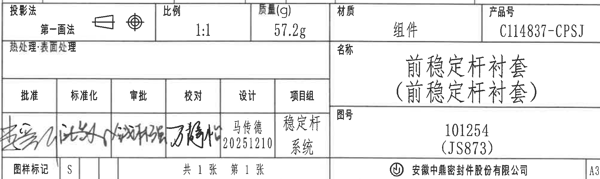

原图位置：page 1，bbox `[2765, 2745, 4775, 3345]`。视图名称：右下标题栏。

### 提取表格

| 提取项 | 原图数值或文本 | 含义说明 |
|---|---|---|
| 投影法 | 第一画法 | 投影法字段。 |
| 比例 | 1:1 | 图纸比例。 |
| 质量(g) | 57.2g | 图纸标题栏总质量。 |
| 材质 | 组件 | 标题栏材质字段。 |
| 产品号 | C114837-CPSJ | 产品编号。 |
| 热处理/表面处理 | 空白 | 原图对应栏未填具体处理内容。 |
| 名称 | 前稳定杆衬套（前稳定杆衬套） | 图纸名称。 |
| 图号 | 101254 (JS873) | 图号字段。 |
| 批准 | 手写签名，未清晰识别 | 原图签字栏。 |
| 标准化 | 手写签名，未清晰识别 | 原图签字栏。 |
| 审批 | 手写签名，未清晰识别 | 原图签字栏。 |
| 校对 | 手写签名，未清晰识别 | 原图签字栏。 |
| 设计 | 马传德 / 20251210 | 设计人和日期。 |
| 项目组 | 稳定杆系统 | 项目组字段。 |
| 图样标记 | S | 图样标记字段。 |
| 页码 | 共1张 第1张 | 图纸页数。 |
| 公司 | 安徽中鼎密封件股份有限公司 | 出图单位。 |
| 图幅 | A3 | 右下图幅字段。 |

边界归属说明：标题栏上边界紧接BOM下边界；该对象不提取BOM序号、材料、重量等字段，只提取标题栏和签审栏内容。

## object_10 | table | DIN ISO 3302-1 Class M2 一般公差表

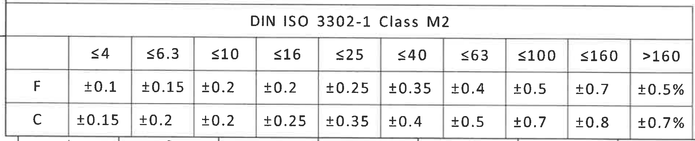

原图位置：page 1，bbox `[360, 2965, 2265, 3355]`。视图名称：左下一般公差表。

### 原表还原

| DIN ISO 3302-1 Class M2 | ≤4 | ≤6.3 | ≤10 | ≤16 | ≤25 | ≤40 | ≤63 | ≤100 | ≤160 | >160 |
|---|---|---|---|---|---|---|---|---|---|---|
| F | ±0.1 | ±0.15 | ±0.2 | ±0.2 | ±0.25 | ±0.35 | ±0.4 | ±0.5 | ±0.7 | ±0.5% |
| C | ±0.15 | ±0.2 | ±0.2 | ±0.25 | ±0.35 | ±0.4 | ±0.5 | ±0.7 | ±0.8 | ±0.7% |

### 提取表格

| 提取项 | 原图数值或文本 | 含义说明 |
|---|---|---|
| 标准 | DIN ISO 3302-1 Class M2 | 技术要求第1条引用的未注尺寸公差标准等级。 |
| F级≤4 | ±0.1 | F级对应尺寸范围公差。 |
| F级≤6.3 | ±0.15 | F级对应尺寸范围公差。 |
| F级≤10 | ±0.2 | F级对应尺寸范围公差。 |
| F级≤16 | ±0.2 | F级对应尺寸范围公差。 |
| F级≤25 | ±0.25 | F级对应尺寸范围公差。 |
| F级≤40 | ±0.35 | F级对应尺寸范围公差。 |
| F级≤63 | ±0.4 | F级对应尺寸范围公差。 |
| F级≤100 | ±0.5 | F级对应尺寸范围公差。 |
| F级≤160 | ±0.7 | F级对应尺寸范围公差。 |
| F级>160 | ±0.5% | F级大于160范围公差。 |
| C级≤4 | ±0.15 | C级对应尺寸范围公差。 |
| C级≤6.3 | ±0.2 | C级对应尺寸范围公差。 |
| C级≤10 | ±0.2 | C级对应尺寸范围公差。 |
| C级≤16 | ±0.25 | C级对应尺寸范围公差。 |
| C级≤25 | ±0.35 | C级对应尺寸范围公差。 |
| C级≤40 | ±0.4 | C级对应尺寸范围公差。 |
| C级≤63 | ±0.5 | C级对应尺寸范围公差。 |
| C级≤100 | ±0.7 | C级对应尺寸范围公差。 |
| C级≤160 | ±0.8 | C级对应尺寸范围公差。 |
| C级>160 | ±0.7% | C级大于160范围公差。 |

边界归属说明：该裁切只包含左下DIN ISO 3302-1 Class M2公差表；未提取上方表2或右侧标题栏字段。

## 裁切检查记录

| object_id | image_path | 完整性检查 | 边界归属检查 |
|---|---|---|---|
| object_1 | outputs/20C114837_assets/images/object_1.png | 表1表头、所有行列、文字完整。 | 未混入表2；顶部图框坐标已排除。 |
| object_2 | outputs/20C114837_assets/images/object_2.png | 表2表头、Z/X/Y向、动刚度、扭转、耐久、高低温、异响、轴向力耐久行完整。 | 未提取表1和左下公差表内容。 |
| object_3 | outputs/20C114837_assets/images/object_3.png | 修订履历表头、初始图纸/A/20251210/马传德完整。 | 顶部少量图框坐标不作为表格字段。 |
| object_4 | outputs/20C114837_assets/images/object_4.png | 主视图尺寸线、箭头、R/Ø/偏心距/47±0.5等文字完整。 | 未把A-A剖视尺寸归入主视图；未提取技术要求。 |
| object_5 | outputs/20C114837_assets/images/object_5.png | A-A剖视图、(38)、32±0.4、(2.5)、24±0.35、24.5±0.35、1:1完整。 | 未混入右侧图框坐标栏；不提取主视图尺寸。 |
| object_6 | outputs/20C114837_assets/images/object_6.png | 技术要求1-8条文字完整。 | 为完整保留第2/7条，右侧可见少量轴测图边框；不提取轴测内容。 |
| object_7 | outputs/20C114837_assets/images/object_7.png | 轴测图轮廓和X/Y/Z方向标识完整。 | 左侧少量技术要求边缘文字不归入轴测对象。 |
| object_8 | outputs/20C114837_assets/images/object_8.png | BOM两行和表头完整。 | 未混入下方标题栏投影法字段。 |
| object_9 | outputs/20C114837_assets/images/object_9.png | 标题栏、签审栏、名称、图号、产品号、质量、公司、图幅完整。 | 不提取BOM字段。 |
| object_10 | outputs/20C114837_assets/images/object_10.png | DIN ISO 3302-1 Class M2表头、F/C两行公差完整。 | 未混入表2或标题栏内容。 |
