# 20C114838 内容识别与裁切提取

整页渲染图：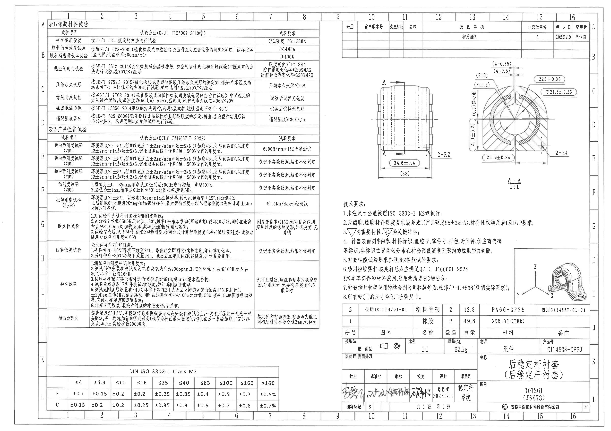

说明：所有坐标 bbox 均基于整页 PNG `outputs/20C114838_assets/images/page_1.png`，尺寸为 4959×3505 px。本文按原图区域顺序列出裁切对象，并在每个对象下给出裁切图片、原图位置/视图名称、提取表格和边界归属说明。

## object_1 表1：橡胶材料试验

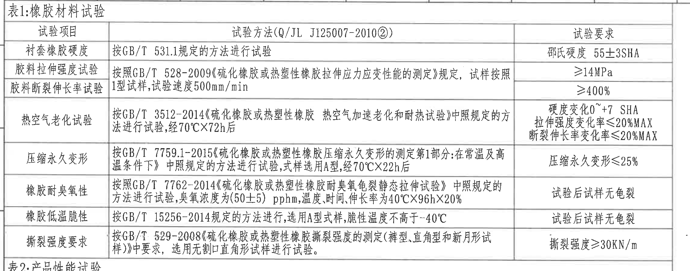

原图位置/视图名称：左上区域，图纸网格 A-D / 1-8 附近；bbox `[370,160,2650,1060]`。

| 试验项目 | 试验方法(Q/JL J125007-2010②) | 试验要求 |
|---|---|---|
| 衬套橡胶硬度 | 按GB/T 531.1规定的方法进行试验 | 邵氏硬度 55±3SHA |
| 胶料拉伸强度试验 | 按照GB/T 528-2009《硫化橡胶或热塑性橡胶拉伸应力应变性能的测定》规定，试样按照1型试样，试验速度500mm/min | ≥14MPa |
| 胶料断裂伸长率试验 | 按照GB/T 528-2009《硫化橡胶或热塑性橡胶拉伸应力应变性能的测定》规定，试样按照1型试样，试验速度500mm/min | ≥400% |
| 热空气老化试验 | 按GB/T 3512-2014《硫化橡胶或热塑性橡胶 热空气加速老化和耐热试验》中照规定的方法进行试验，经70℃×72h后 | 硬度变化0~+7 SHA；拉伸强度变化率≤20%MAX；断裂伸长率变化率≤20%MAX |
| 压缩永久变形 | 按GB/T 7759.1-2015《硫化橡胶或热塑性橡胶压缩永久变形的测定第1部分:在常温及高温条件下》中照规定的方法进行试验，试样选用A型，经70℃×22h后 | 压缩永久变形≤25% |
| 橡胶耐臭氧性 | 按照GB/T 7762-2014《硫化橡胶或热塑性橡胶耐臭氧龟裂静态拉伸试验》中照规定的方法进行试验，臭氧浓度为(50±5) pphm，温度、时间、伸长率为40℃×96h×20% | 试验后试样无龟裂 |
| 橡胶低温脆性 | 按GB/T 15256-2014规定的方法进行，选用A型式样，脆性温度不高于-40℃ | 试验后试样无龟裂 |
| 撕裂强度要求 | 按GB/T 529-2008《硫化橡胶或热塑性橡胶撕裂强度的测定(裤型、直角型和新月形试样)》中要求，选用无割口直角形试样进行试验。 | 撕裂强度≥30KN/m |

| 提取项 | 原图数值或文本 | 含义说明 |
|---|---|---|
| 表格类型 | 表1:橡胶材料试验 | 材料试验要求表，非加工视图。 |
| 关键硬度 | 55±3SHA | 衬套橡胶邵氏硬度要求；与技术要求第2条一致。 |
| 拉伸强度 | ≥14MPa | 胶料拉伸强度合格下限。 |
| 断裂伸长率 | ≥400% | 胶料断裂伸长率合格下限。 |
| 热老化条件 | 70℃×72h | 老化试验温度和持续时间。 |
| 压缩永久变形 | ≤25% | 压缩永久变形允许上限。 |
| 臭氧条件 | (50±5) pphm; 40℃×96h×20% | 臭氧浓度及温度/时间/伸长率条件。 |
| 低温脆性 | 不高于-40℃ | 低温脆性试验温度要求。 |
| 撕裂强度 | ≥30KN/m | 撕裂强度合格下限。 |

边界归属说明：裁切完整包含表1表头、全部8行试验项目及右侧试验要求；下缘出现“表2:产品性能试验”标题起始线，属于相邻表2，不作为表1数据提取。

## object_2 表2：产品性能试验

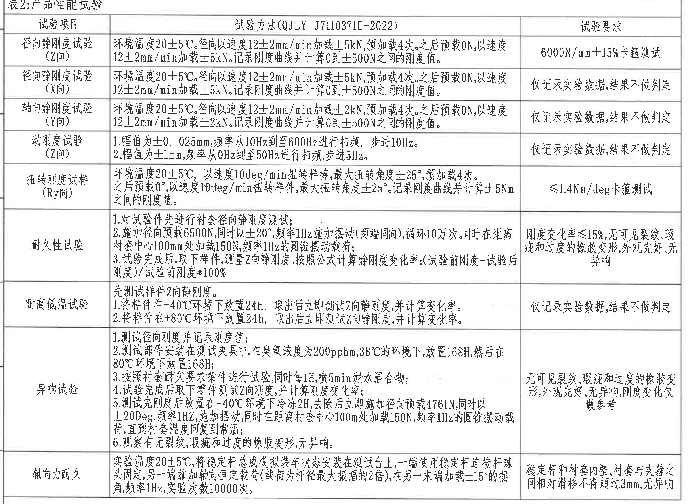

原图位置/视图名称：左中区域，图纸网格 D-J / 1-8 附近；bbox `[370,1040,2650,2685]`。

| 试验项目 | 试验方法(QJLY J7110371E-2022) | 试验要求 |
|---|---|---|
| 径向静刚度试验(Z向) | 环境温度20±5℃。径向以速度12±2mm/min加载±5kN，预加载4次。之后预载0N，以速度12±2mm/min加载±5kN。记录刚度曲线并计算0到±500N之间的刚度值。 | 6000N/mm±15%卡箍测试 |
| 径向静刚度试验(X向) | 环境温度20±5℃。径向以速度12±2mm/min加载±5kN，预加载4次。之后预载0N，以速度12±2mm/min加载±5kN。记录刚度曲线并计算0到±500N之间的刚度值。 | 仅记录实验数据，结果不做判定 |
| 轴向静刚度试验(Y向) | 环境温度20±5℃。径向以速度12±2mm/min加载±2kN，预加载4次。之后预载0N，以速度12±2mm/min加载±2kN。记录刚度曲线并计算0到±500N之间的刚度值。 | 仅记录实验数据，结果不做判定 |
| 动刚度试验(Z向) | 1.幅值为±0.025mm，频率从10Hz到至600Hz进行扫频，步进10Hz。 2.幅值为±1mm，频率从0Hz到至50Hz进行扫频，步进5Hz。 | 仅记录实验数据，结果不做判定 |
| 扭转刚度试样(Ry向) | 环境温度20±5℃，以速度10deg/min扭转样棒，最大扭转角度±25°，预加载4次。之后预载0°，以速度10deg/min扭转样件，最大扭转角度±25°。记录刚度曲线并计算±5Nm之间的刚度值。 | ≤1.4Nm/deg卡箍测试 |
| 耐久性试验 | 1.对试验件先进行衬套径向静刚度测试； 2.施加径向预载6500N，同时以±20°，频率1Hz施加摆动(两端同向)，循环10万次。同时在距离衬套中心100mm处加载150N，频率1Hz的圆锥摆动载荷； 3.试验完成后，取下样件，测量Z向静刚度。按照公式计算静刚度变化率:(试验前刚度-试验后刚度)/试验前刚度*100% | 刚度变化率≤15%，无可见裂纹、瑕疵和过度的橡胶变形，外观完好，无异响 |
| 耐高低温试验 | 先测试样件Z向静刚度。 1.将样件在-40℃环境下放置24h，取出后立即测试Z向静刚度，并计算变化率。 2.将样件在+80℃环境下放置24h，取出后立即测试Z向静刚度，并计算变化率。 | 仅记录实验数据，结果不做判定 |
| 异响试验 | 1.测试径向刚度并记录刚度值； 2.测试部件安装在测试夹具中，在臭氧浓度为200pphm，38℃的环境下，放置168H，然后在80℃环境下放置168H； 3.按照衬套耐久要求条件进行试验，同时每1H喷5min泥水混合物； 4.试验完成后取下零件测试Z向刚度，并计算刚度变化率； 5.测试完刚度后放置在-40℃环境下冷冻2H，去除后立即施加径向预载4761N，同时以±20Deg，频率1Hz，施加摆动，同时在距离衬套中心100mm处加载150N，频率1Hz的圆锥摆动载荷，直到衬套温度回复到常温； 6.观察有无裂纹，瑕疵和过度的橡胶变形，无异响。 | 无可见裂纹、瑕疵和过度的橡胶变形，外观完好，无异响，刚度变化仅做参考 |
| 轴向力耐久 | 实验温度20±5℃，将稳定杆总成模拟装车状态安装在测试台上，一端使用稳定杆连接杆球头固定，另一端施加轴向恒定载荷(载荷为杆径最大振幅的2倍)，在另一末端加载±15°的摆角，频率1Hz，实验次数10000次。 | 稳定杆和衬套内壁、衬套与夹箍之间相对滑移不得超过3mm，无异响 |

| 提取项 | 原图数值或文本 | 含义说明 |
|---|---|---|
| 表格类型 | 表2:产品性能试验 | 产品性能/DVP试验要求表。 |
| Z向径向静刚度要求 | 6000N/mm±15%卡箍测试 | Z向径向静刚度验收值。 |
| X向/Y向静刚度 | 仅记录实验数据，结果不做判定 | 这些方向为记录项，不作为判定项。 |
| 动刚度扫频 | ±0.025mm, 10Hz到至600Hz, 步进10Hz；±1mm, 0Hz到至50Hz, 步进5Hz | 两档幅值和频率范围。 |
| 扭转刚度 | ≤1.4Nm/deg | Ry向扭转刚度上限。 |
| 耐久刚度变化率 | ≤15% | 耐久后刚度变化允许上限。 |
| 异响预载 | 4761N | 异响试验低温后施加的径向预载。 |
| 轴向滑移 | 不得超过3mm | 轴向力耐久后相对滑移限值。 |

边界归属说明：裁切完整覆盖表2表头、所有9个试验项目及右侧要求；底边到表格下框，未混入底部通用公差表。

## object_3 DIN ISO 3302-1 Class M2 通用公差表

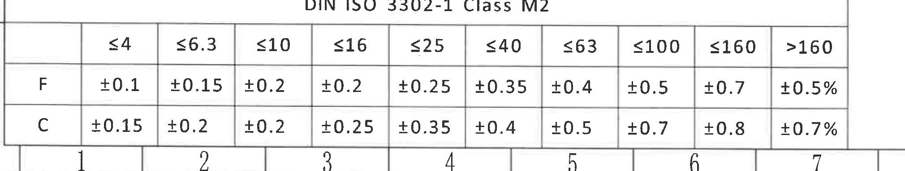

原图位置/视图名称：左下区域，图纸网格 K-L / 1-7 附近；bbox `[370,3010,2390,3395]`。

| 等级/尺寸段 | ≤4 | ≤6.3 | ≤10 | ≤16 | ≤25 | ≤40 | ≤63 | ≤100 | ≤160 | >160 |
|---|---|---|---|---|---|---|---|---|---|---|
| F | ±0.1 | ±0.15 | ±0.2 | ±0.2 | ±0.25 | ±0.35 | ±0.4 | ±0.5 | ±0.7 | ±0.5% |
| C | ±0.15 | ±0.2 | ±0.2 | ±0.25 | ±0.35 | ±0.4 | ±0.5 | ±0.7 | ±0.8 | ±0.7% |

| 提取项 | 原图数值或文本 | 含义说明 |
|---|---|---|
| 表题 | DIN ISO 3302-1 Class M2 | 未注橡胶制品尺寸公差等级表。 |
| F级公差 | ±0.1 至 ±0.7 / ±0.5% | F行对应不同尺寸段的公差。 |
| C级公差 | ±0.15 至 ±0.8 / ±0.7% | C行对应不同尺寸段的公差。 |

边界归属说明：裁切完整包含表题、全部尺寸段及F/C两行；下方图框坐标数字仅作为图框背景，不属于公差表数据。

## object_4 修订履历表

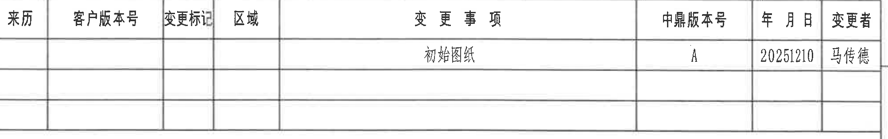

原图位置/视图名称：右上区域，图纸网格 A-B / 9-16 附近；bbox `[2795,175,4800,490]`。

| 来历 | 客户版本号 | 变更标记 | 区域 | 变更事项 | 中鼎版本号 | 年月日 | 变更者 |
|---|---|---|---|---|---|---|---|
|  |  |  |  | 初始图纸 | A | 20251210 | 马传德 |
|  |  |  |  |  |  |  |  |
|  |  |  |  |  |  |  |  |

| 提取项 | 原图数值或文本 | 含义说明 |
|---|---|---|
| 表格类型 | 修订履历表 | 版本变更记录。 |
| 变更事项 | 初始图纸 | 当前图纸初始发布记录。 |
| 中鼎版本号 | A | 内部版本号。 |
| 年月日 | 20251210 | 变更/发布日期。 |
| 变更者 | 马传德 | 变更人员。 |

边界归属说明：裁切收在修订表外框内，未纳入右侧图框坐标字母；空白行按原表保留。

## object_5 主视图 / A-A 剖切位置视图

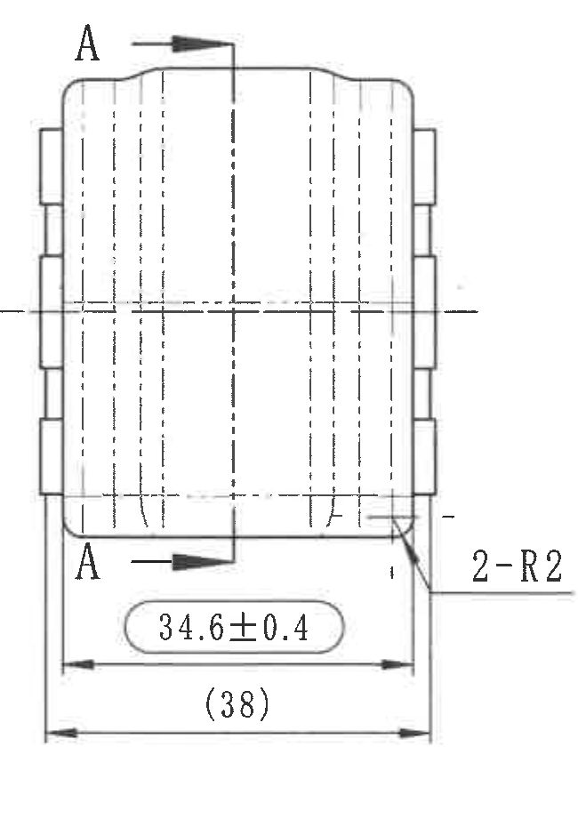

原图位置/视图名称：右中偏左，图纸网格 C-E / 10-12 附近；bbox `[3020,620,3670,1550]`。

| 提取项 | 原图数值或文本 | 含义说明 |
|---|---|---|
| 剖切符号 | A-A | 上、下两处A箭头标明剖切位置和观察方向。 |
| 宽度尺寸 | 34.6±0.4 | 主视图下部外侧宽度尺寸，公差±0.4，带圆角框/重点标识。 |
| 参考总宽 | (38) | 底部整体外宽参考尺寸；括号表示参考尺寸，非制造直接控制尺寸。 |
| 圆角数量半径 | 2-R2 | 主视图右下引出标注，表示2处R2圆角/圆弧半径。 |
| 中心/隐藏线 | 中心线、隐藏线 | 表示内部筒状结构与中心轴位置。 |

边界归属说明：该对象只提取主视图可见尺寸。右侧A-A剖视图的R23、Ø21.5、22.1等尺寸不归入本视图；裁切完整包含主视图轮廓、剖切箭头、底部尺寸线和右侧2-R2引线。

## object_6 A-A 剖视图 1:1

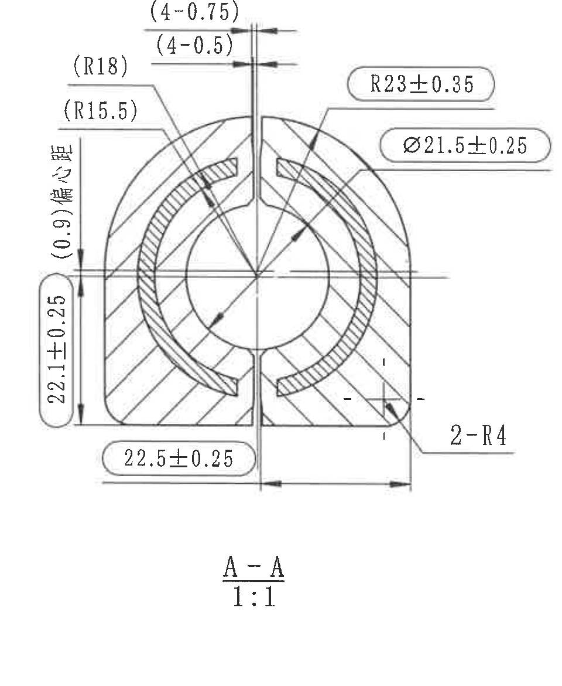

原图位置/视图名称：右中偏右，图纸网格 B-F / 13-16 附近；bbox `[3740,500,4700,1670]`。

| 提取项 | 原图数值或文本 | 含义说明 |
|---|---|---|
| 剖面名称/比例 | A-A / 1:1 | 剖面名称及绘图比例。 |
| 参考槽/间隙尺寸 | (4-0.75) | 顶部参考尺寸，4处0.75；括号表示参考。 |
| 参考槽/间隙尺寸 | (4-0.5) | 顶部参考尺寸，4处0.5；括号表示参考。 |
| 参考外圆弧半径 | (R18) | 左上外圆弧参考半径。 |
| 参考内圆弧半径 | (R15.5) | 左上内圆弧参考半径。 |
| 参考偏心距 | (0.9)偏心距 | 左侧竖向参考偏心距。 |
| 竖向尺寸 | 22.1±0.25 | 左侧竖向高度/距离尺寸，公差±0.25，带圆角框/重点标识。 |
| 底部水平尺寸 | 22.5±0.25 | 底部水平距离尺寸，公差±0.25，带圆角框/重点标识。 |
| 外圆弧半径 | R23±0.35 | 上部外圆弧半径，公差±0.35，带圆角框/重点标识。 |
| 内孔直径 | Ø21.5±0.25 | 内孔直径尺寸，公差±0.25，带圆角框/重点标识。 |
| 圆角数量半径 | 2-R4 | 右下引出标注，表示2处R4圆角/圆弧半径。 |
| 剖面线 | 斜向剖面线 | 表示剖切实体材料区域。 |

边界归属说明：该对象为A-A剖面，不把主视图底部34.6±0.4和(38)归入本剖面。裁切完整包含剖面轮廓、剖面线、尺寸文字、引线、箭头和A-A 1:1标识；右侧图框坐标栏已排除。

## object_7 技术要求 / NOTES

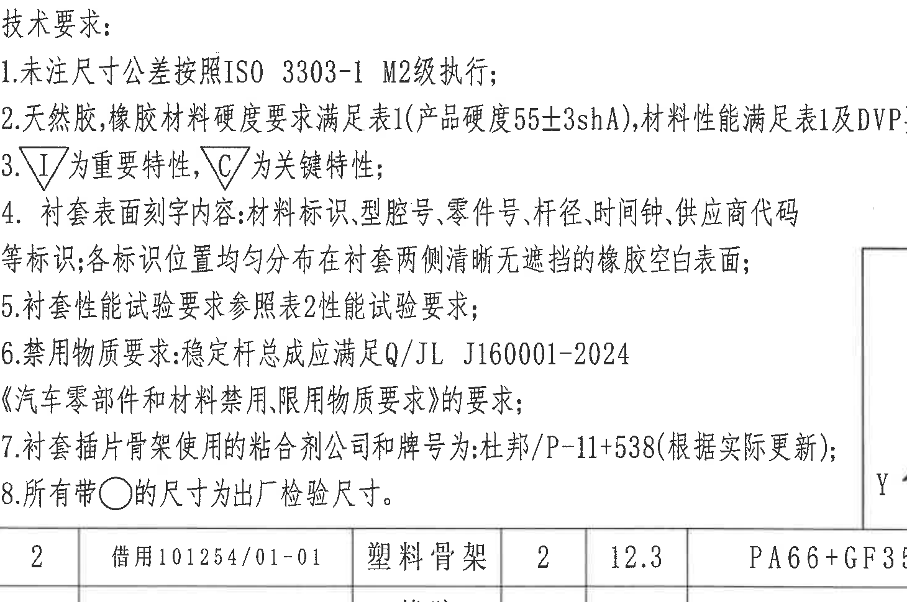

原图位置/视图名称：右中下区域，图纸网格 F-I / 9-13 附近；bbox `[2785,1620,4245,2590]`。

| 序号 | 原图文本 | 含义说明 |
|---|---|---|
| 1 | 未注尺寸公差按照ISO 3303-1 M2级执行； | 未单独标注的尺寸按该公差等级。 |
| 2 | 天然胶，橡胶材料硬度要求满足表1(产品硬度55±3shA)，材料性能满足表1及DVP要求； | 材料硬度和性能要求引用表1/DVP。 |
| 3 | 倒三角I为重要特性，倒三角C为关键特性； | 重要/关键特性符号定义。 |
| 4 | 衬套表面刻字内容:材料标识、型腔号、零件号、杆径、时间钟、供应商代码等标识；各标识位置均匀分布在衬套两侧清晰无遮挡的橡胶空白表面； | 表面刻字内容和位置要求。 |
| 5 | 衬套性能试验要求参照表2性能试验要求； | 性能试验引用表2。 |
| 6 | 禁用物质要求:稳定杆总成应满足Q/JL J160001-2024《汽车零部件和材料禁用、限用物质要求》的要求； | 禁用/限用物质标准。 |
| 7 | 衬套插片骨架使用的粘合剂公司和牌号为:杜邦/P-11+538(根据实际更新)； | 粘合剂公司及牌号。 |
| 8 | 所有带○的尺寸为出厂检验尺寸。 | 圆圈标注尺寸为出厂检验尺寸。 |

边界归属说明：裁切包含8条NOTES及关键/重要特性符号说明。底部只轻微带入明细表上边框，不提取为NOTES内容；右侧等轴测图未纳入该对象。

## object_8 等轴测局部示意图 / 坐标方向

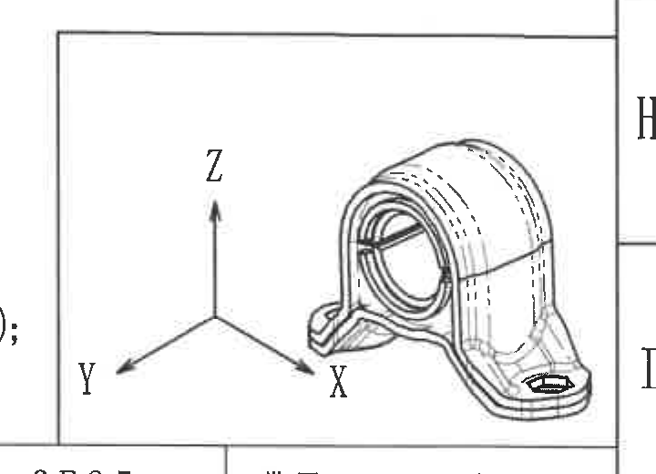

原图位置/视图名称：右下偏上，图纸网格 H-I / 14-16 附近；bbox `[4110,1985,4830,2505]`。

| 提取项 | 原图数值或文本 | 含义说明 |
|---|---|---|
| 坐标方向 | X、Y、Z | 三维方向标识，用于表2试验方向和零件姿态理解。 |
| 局部示意 | 圆筒衬套、底脚、安装孔形态 | 显示零件三维形态；无单独数值尺寸。 |

边界归属说明：该对象为局部等轴测示意和坐标方向；不含尺寸数值。裁切完整包含X/Y/Z坐标箭头、三维零件示意及右侧边界；未提取下方标题栏内容。

## object_9 明细表 / BOM

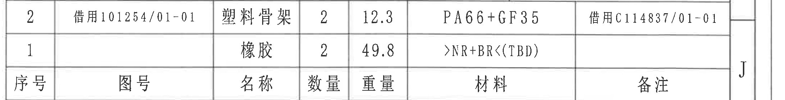

原图位置/视图名称：右下区域上部，图纸网格 I-J / 9-16 附近；bbox `[2760,2470,4940,2750]`。

| 序号 | 图号 | 名称 | 数量 | 重量 | 材料 | 备注 |
|---|---|---|---|---|---|---|
| 2 | 借用101254/01-01 | 塑料骨架 | 2 | 12.3 | PA66+GF35 | 借用C114837/01-01 |
| 1 |  | 橡胶 | 2 | 49.8 | >NR+BR<(TBD) |  |

| 提取项 | 原图数值或文本 | 含义说明 |
|---|---|---|
| BOM序号2 | 塑料骨架 / 数量2 / 重量12.3 / PA66+GF35 | 塑料骨架明细。 |
| BOM序号1 | 橡胶 / 数量2 / 重量49.8 / >NR+BR<(TBD) | 橡胶明细。 |

边界归属说明：裁切完整包含两行零件明细、列名和表格边框。上缘紧贴技术要求底边但未提取NOTES文字；下方标题栏投影法/比例等不归入BOM。

## object_10 标题栏

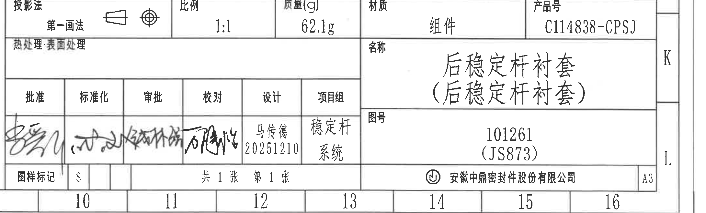

原图位置/视图名称：右下角，图纸网格 J-L / 9-16 附近；bbox `[2760,2760,4940,3420]`。

| 字段 | 原图文本 | 含义说明 |
|---|---|---|
| 投影法 | 第一画法 | 投影方法。 |
| 比例 | 1:1 | 图纸比例。 |
| 质量(g) | 62.1g | 组件质量。 |
| 材质 | 组件 | 标题栏材质字段。 |
| 产品号 | C114838-CPSJ | 产品号。 |
| 热处理 | 表面处理 | 热处理/表面处理栏文本。 |
| 名称 | 后稳定杆衬套(后稳定杆衬套) | 零件/组件名称。 |
| 图号 | 101261 (JS873) | 图纸编号。 |
| 批准 | 手签 | 签署栏。 |
| 标准化 | 手签 | 签署栏。 |
| 审批 | 手签 | 签署栏。 |
| 校对 | 手签 | 签署栏。 |
| 设计 | 马传德 20251210 | 设计人员及日期。 |
| 项目组 | 稳定杆系统 | 项目组。 |
| 图样标记 | S | 图样标记。 |
| 页数 | 共1张 第1张 | 图纸页数。 |
| 公司 | 安徽中鼎密封件股份有限公司 | 出图/公司名称。 |
| 图幅 | A3 | 图纸幅面。 |

边界归属说明：标题栏为右下主标题信息区；上方明细表已有独立对象，未将BOM行作为标题栏字段。裁切覆盖投影法、比例、质量、材质、产品号、名称、图号、签字栏、图样标记、页数、公司和A3图幅。

## 裁切检查记录

| 对象 | 名称 | 检查结论 | 说明 |
|---|---|---|---|
| object_1 | 表1:橡胶材料试验 | 完整 | 表头、三列、全部8行和右侧要求完整；下缘带入表2标题起始线，已标注为相邻对象，不提取到表1。 |
| object_2 | 表2:产品性能试验 | 完整 | 表头、三列、全部9行和右侧要求完整；底边未混入通用公差表。 |
| object_3 | DIN ISO 3302-1 Class M2 | 完整 | 表题、尺寸段、F/C两行完整；下方图框坐标数字不作为表格数据。 |
| object_4 | 修订履历表 | 完整 | 表格外框、列名和记录行完整；右侧坐标字母已排除。 |
| object_5 | 主视图 / A-A剖切位置 | 完整 | 主视图轮廓、A-A箭头、34.6±0.4、(38)、2-R2及尺寸线/箭头完整；未混入A-A剖视图主体。 |
| object_6 | A-A剖视图 1:1 | 完整 | 剖面轮廓、剖面线、全部尺寸文字、引线和箭头完整；右侧图框坐标栏已排除。 |
| object_7 | 技术要求 / NOTES | 完整 | 8条技术要求完整；底部轻微带入明细表上边框，未提取为NOTES内容。 |
| object_8 | 等轴测局部示意图 | 完整 | X/Y/Z坐标与零件示意完整；无数值尺寸。 |
| object_9 | 明细表 / BOM | 完整 | 两行明细、列名和表格边界完整；不含标题栏字段。 |
| object_10 | 标题栏 | 完整 | 标题栏字段、签署栏、图号、名称、公司和A3图幅完整；与BOM分开归属。 |
