# 20C114850 内容识别结果

整页渲染图：`20C114850_assets/images/page_1.png`；页面像素：3306 x 2337；坐标原点位于整页 PNG 左上角。

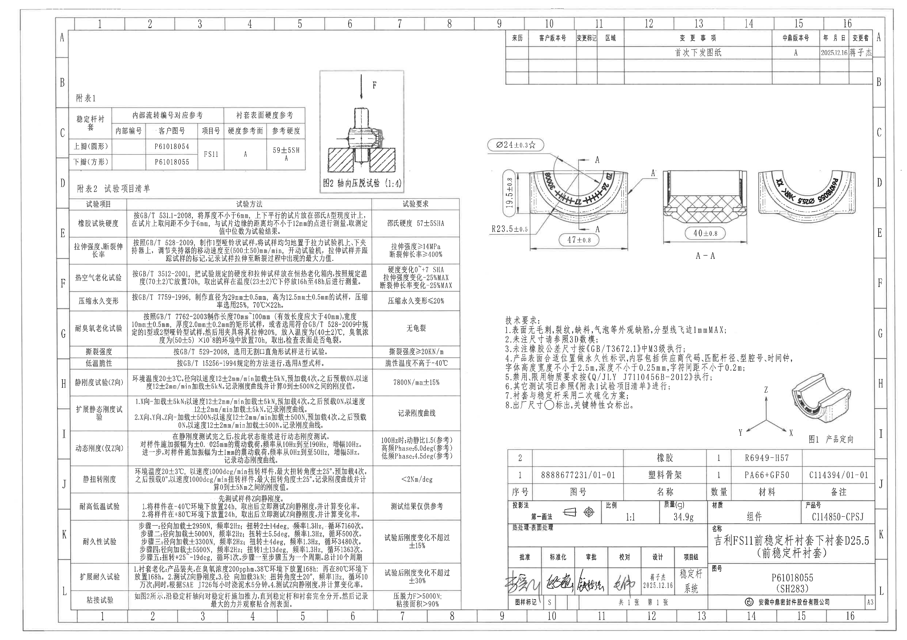

## object_1 加工主视图

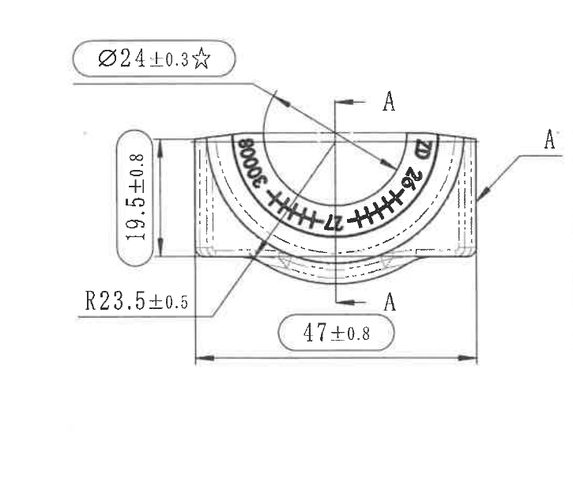

原图位置/视图名称：第 1 页，中部偏右加工主视图；bbox `[1685, 455, 2410, 1080]`。

| 提取项 | 原图数值或文本 | 含义说明 |
|---|---|---|
| 关键直径尺寸 | `Ø24±0.3☆` | 直径尺寸 24，公差 ±0.3；`☆` 按技术要求第 8 条表示关键特性。引线指向主视图上部弧形/孔口区域。 |
| 左侧高度尺寸 | `19.5±0.8` | 主视图左侧竖向尺寸，表示该截面外形高度/厚度方向尺寸，公差 ±0.8。 |
| 圆弧半径 | `R23.5±0.5` | 半径尺寸，指向主视图下侧外圆弧区域，公差 ±0.5。 |
| 总宽度 | `47±0.8` | 主视图底部水平总宽尺寸，左右外侧边界之间，公差 ±0.8。 |
| 剖切标识 | `A`、`A`、`A-A` 切割箭头 | 主视图上的 A-A 剖切位置标识，指向 object_2 的剖面视图，不是主视图尺寸值。 |
| 弧面标识 | 可辨 `P61018055`、`Ø25.5`，另有重影/模糊字符 | 弧面永久标识内容，结合技术要求第 4 条可理解为产品表面标识中的图号/匹配杆径等内容；模糊字符不作确定转写。 |
| T 编号 | 未见 | 本视图未识别到 T 编号。 |
| 参考尺寸 | 未见括号参考尺寸 | 本视图的括号内容未出现；所有可见尺寸均直接标注并带公差。 |

边界归属说明：右侧的 A 字母和引线属于主视图的剖切标识；A-A 剖面图本体和 `40±0.8` 未归入本对象。裁切保留完整尺寸线、箭头和文字，不包含右侧剖面图本体。

## object_2 A-A 剖面视图

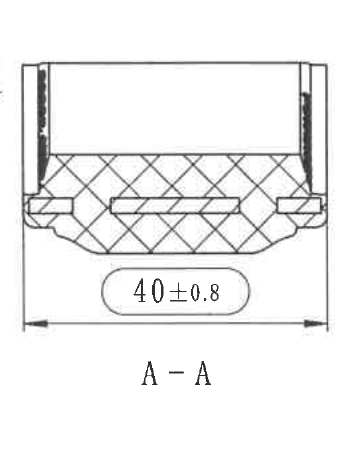

原图位置/视图名称：第 1 页，中部偏右 A-A 剖面；bbox `[2395, 560, 2750, 1030]`。

| 提取项 | 原图数值或文本 | 含义说明 |
|---|---|---|
| 剖面名称 | `A-A` | 与 object_1 主视图中的 A-A 剖切标识对应。 |
| 剖面宽度尺寸 | `40±0.8` | A-A 剖面下方水平尺寸，表示该剖切位置的总宽/装配宽度，公差 ±0.8。 |
| 剖面填充 | 交叉剖面线 | 表示被剖切到的材料实体区域。 |
| 内部槽/骨架形状 | 剖面内可见长槽及两侧结构 | 说明剖面内存在骨架/孔槽结构；无单独尺寸数值标注。 |
| T 编号 | 未见 | 本剖面未识别到 T 编号。 |
| 参考尺寸 | 未见括号参考尺寸 | 本剖面无括号参考尺寸。 |

边界归属说明：裁切只包含 A-A 剖面、`40±0.8` 尺寸线和 `A-A` 标题；左侧主视图 A 标识和右侧局部视图均已排除。

## object_3 右侧局部视图

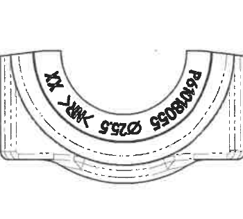

原图位置/视图名称：第 1 页，A-A 剖面右侧局部加工/标识视图；bbox `[2765, 550, 3115, 865]`。

| 提取项 | 原图数值或文本 | 含义说明 |
|---|---|---|
| 局部视图类型 | 弧形局部视图 | 展示产品弧面标识和局部外形，不是 A-A 剖面。 |
| 图号标识 | `P61018055` | 弧面永久标识中的产品图号/零件图号。 |
| 匹配杆径标识 | `Ø25.5` | 弧面永久标识中的直径值；结合标题栏名称 `D25.5` 和技术要求第 4 条，可理解为匹配杆径标识。 |
| 其它弧向字符 | 两侧有重影/模糊字符，疑似供应商代码或型腔标识 | 原图扫描重影严重，不能可靠转写为确定文本；不作为确定实体值。 |
| 尺寸线 | 未见独立尺寸线 | 本局部视图中的 `Ø25.5` 是弧面标识文字，不带箭头尺寸线。 |
| T 编号 | 未见 | 本局部视图未识别到 T 编号。 |
| 参考尺寸 | 未见括号参考尺寸 | 本局部视图无括号参考尺寸。 |

边界归属说明：裁切仅保留右侧弧形局部视图；左侧 A-A 剖面和右侧图框 D/E 分区线未纳入最终裁切。只提取本视图中的弧面标识，不把 A-A 剖面尺寸归入本对象。

## object_4 图1 产品定向

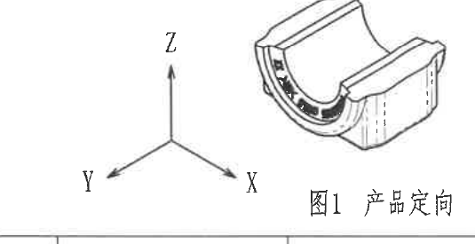

原图位置/视图名称：第 1 页，右下中部产品定向图；bbox `[2600, 1375, 3135, 1650]`。

| 提取项 | 原图数值或文本 | 含义说明 |
|---|---|---|
| 图名 | `图1 产品定向` | 表示产品坐标方向示意。 |
| 坐标轴 | `X`、`Y`、`Z` | 定义产品方向；附表 2 中 Z 向、X/Y/Z 向试验与该坐标系关联。 |
| 产品等轴测 | 衬套三维外形示意 | 用于表达产品装配/试验方向，不含独立尺寸线。 |
| 弧面标识 | 图中可见黑色弧向标识但尺寸不可清晰独立读取 | 仅作产品方向示意，尺寸值以主视图和局部视图为准。 |
| 参考尺寸 | 未见括号参考尺寸 | 本图无括号参考尺寸；仅为方向说明。 |

边界归属说明：裁切包含完整坐标轴、产品等轴测和 `图1 产品定向` 文字；下方明细表不属于本对象，未提取。

## object_5 图2 轴向压脱试验

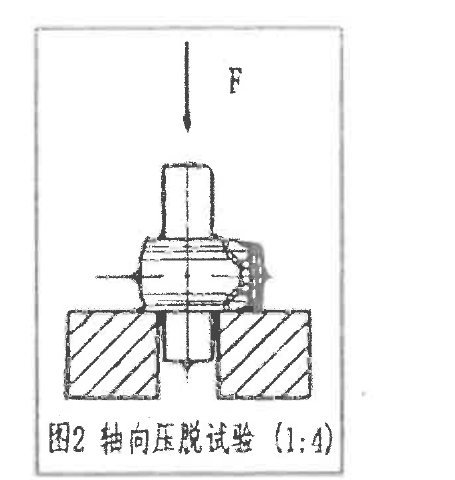

原图位置/视图名称：第 1 页，左中上方试验装配示意；bbox `[1130, 230, 1585, 710]`。

| 提取项 | 原图数值或文本 | 含义说明 |
|---|---|---|
| 图名 | `图2 轴向压脱试验` | 附表 2 中粘接试验的方法引用此图。 |
| 比例 | `(1:4)` | 图题中的比例，表示该示意图按 1:4 表示；括号内容为比例说明，不是零件加工尺寸。 |
| 载荷方向 | `F` 向下箭头 | 表示沿轴向施加压脱/推力方向。 |
| 剖面/装配示意 | 稳定杆、衬套和支撑块剖线 | 说明粘接试验时的装夹和受力关系。 |
| 尺寸线 | 未见独立尺寸线 | 本图为试验示意，不标注加工尺寸。 |

边界归属说明：裁切保留图框、载荷箭头和图题；左侧附表 1 和下方附表 2 表头不属于本对象，未提取。

## object_6 修订履历表

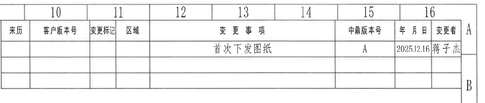

原图位置/视图名称：第 1 页，右上角修订履历/变更表；bbox `[1840, 50, 3250, 350]`。

原表还原：

| 来历 | 客户版本号 | 变更标记 | 区域 | 变更事项 | 中鼎版本号 | 年 月 日 | 变更者 |
|---|---|---|---|---|---|---|---|
|  |  |  |  | 首次下发图纸 | A | 2025.12.16 | 蒋子杰 |
|  |  |  |  |  |  |  |  |
|  |  |  |  |  |  |  |  |

| 提取项 | 原图数值或文本 | 含义说明 |
|---|---|---|
| 当前记录 | `首次下发图纸` | 表示本图首次发布/下发。 |
| 中鼎版本号 | `A` | 当前中鼎版本号。 |
| 日期 | `2025.12.16` | 变更记录日期。 |
| 变更者 | `蒋子杰` | 变更人。 |

边界归属说明：顶部图框分区号 10-16 和右侧 A/B 分区字母是图框定位信息，不作为修订履历表字段提取；表格主体和全部可见行完整包含。

## object_7 附表1 稳定杆衬套参考表

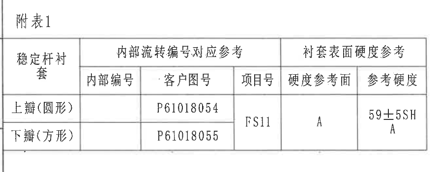

原图位置/视图名称：第 1 页，左上附表 1；bbox `[245, 315, 1140, 665]`。

原表还原：

| 稳定杆衬套 | 内部编号 | 客户图号 | 项目号 | 硬度参考面 | 参考硬度 |
|---|---|---|---|---|---|
| 上瓣(圆形) |  | P61018054 | FS11 | A | 59±5SH A |
| 下瓣(方形) |  | P61018055 | FS11 | A | 59±5SH A |

表头合并关系：`内部编号`、`客户图号`、`项目号` 属于 `内部流转编号对应参考`；`硬度参考面`、`参考硬度` 属于 `衬套表面硬度参考`。

| 提取项 | 原图数值或文本 | 含义说明 |
|---|---|---|
| 上瓣客户图号 | `P61018054` | 圆形上瓣对应图号。 |
| 下瓣客户图号 | `P61018055` | 方形下瓣对应图号，与本图标题栏图号一致。 |
| 项目号 | `FS11` | 两行共用项目号。 |
| 硬度参考面 | `A` | 硬度测量/参考位置为 A 面。 |
| 参考硬度 | `59±5SH A` | 表面硬度参考值，邵氏 A 硬度；此为参考表字段。 |

边界归属说明：右侧图2试验示意不属于本表；裁切只保留附表 1 表题、表头、两条数据行和表格外框。

## object_8 附表2 试验项目清单

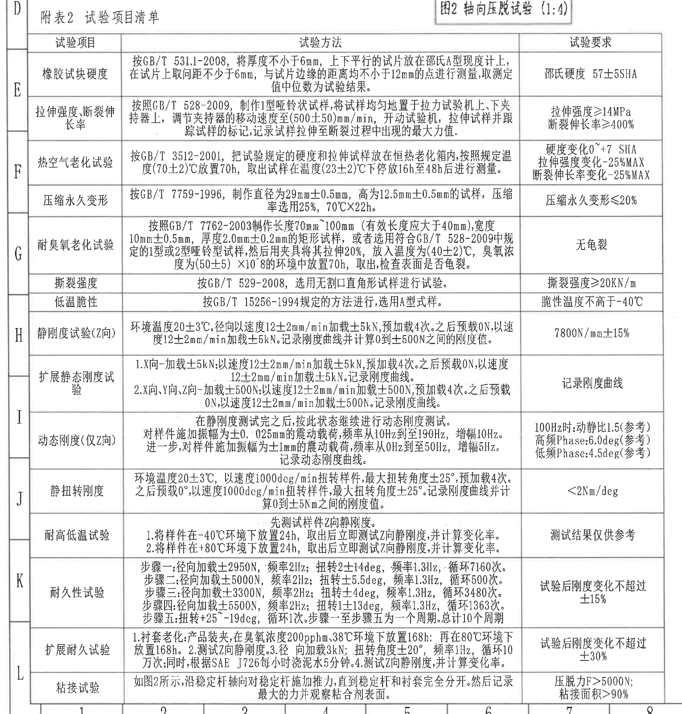

原图位置/视图名称：第 1 页，左下大表；bbox `[190, 650, 1720, 2250]`。

原表还原：

| 试验项目 | 试验方法 | 试验要求 |
|---|---|---|
| 橡胶试块硬度 | 按 GB/T 531.1-2008，将厚度不小于 6mm、上下平行的试片放在邵氏 A 型硬度计上，在试片上取间距不少于 6mm、与试片边缘的距离均不小于 12mm 的点进行测量，取测定值中位数为试验结果。 | 邵氏硬度 57±5SHA |
| 拉伸强度、断裂伸长率 | 按照 GB/T 528-2009，制作 1 型哑铃状试样，将试样均匀地置于拉力试验机上、下夹持器上，调节夹持器的移动速度至 (500±50)mm/min，开动试验机，拉伸试样并跟踪试样的标记，记录试样拉伸至断裂过程中出现的最大力值。 | 拉伸强度≥14MPa；断裂伸长率≥400% |
| 热空气老化试验 | 按 GB/T 3512-2001，把试验规定的硬度和拉伸试样放在恒热老化箱内，按照规定温度 (70±2)℃ 放置 70h，取出试样在温度 (23±2)℃ 下停放 16h 至 48h 后进行测量。 | 硬度变化 0~+7 SHA；拉伸强度变化 -25%MAX；断裂伸长率变化 -25%MAX |
| 压缩永久变形 | 按 GB/T 7759-1996，制作直径为 29mm±0.5mm、高为 12.5mm±0.5mm 的试样，压缩率选用 25%，70℃×22h。 | 压缩永久变形≤20% |
| 耐臭氧老化试验 | 按照 GB/T 7762-2003 制作长度 70mm~100mm（有效长度应大于 40mm），宽度 10mm±0.5mm，厚度 2.0mm±0.2mm 的矩形试样，或者选用符合 GB/T 528-2009 中规定的 1 型或 2 型哑铃型试样，然后用夹具将其拉伸 20%，放入温度为 (40±2)℃、臭氧浓度为 (50±5)×10^-8 的环境中放置 70h，取出，检查表面是否龟裂。 | 无龟裂 |
| 撕裂强度 | 按 GB/T 529-2008，选用无割口直角形试样进行试验。 | 撕裂强度≥20KN/m |
| 低温脆性 | 按 GB/T 15256-1994 规定的方法进行，选用 A 型试样。 | 脆性温度不高于 -40℃ |
| 静刚度试验(Z向) | 环境温度 20±3℃。径向以速度 12±2mm/min 加载 ±5kN，预加载 4 次。之后预载 0N，以速度 12±2mm/min 加载 ±5kN。记录刚度曲线并计算 0 到 ±500N 之间的刚度值。 | 7800N/mm±15% |
| 扩展静态刚度试验 | 1. X向-加载±5kN：以速度 12±2mm/min 加载 ±5kN，预加载 4 次。之后预载 0N，以速度 12±2mm/min 加载 ±5kN。记录刚度曲线。 2. X向、Y向、Z向-加载±500N：以速度 12±2mm/min 加载 ±500N，预加载 4 次。之后预载 0N，以速度 12±2mm/min 加载 ±500N。记录刚度曲线。 | 记录刚度曲线 |
| 动态刚度(仅Z向) | 在静刚度测试完之后，按此状态继续进行动态刚度测试。对样件施加振幅为 ±0.025mm 的震动载荷，频率从 10Hz 到至 190Hz，增幅 10Hz。进一步，对样件施加振幅为 ±1mm 的震动载荷，频率从 0Hz 到至 50Hz，增幅 5Hz。记录动态刚度曲线。 | 100Hz时：动静比 1.5（参考）；高频 Phase：6.0deg（参考）；低频 Phase：4.5deg（参考） |
| 静扭转刚度 | 环境温度 20±3℃，以速度 1000dcg/min 扭转样件，最大扭转角度 ±25°，预加载 4 次。之后预载 0°，以速度 1000dcg/min 扭转样件，最大扭转角度 ±25°。记录刚度曲线并计算 0 到 ±5Nm 之间的刚度值。 | <2Nm/deg |
| 耐高低温试验 | 先测试样件 Z 向静刚度。1. 将样件在 -40℃ 环境下放置 24h，取出后立即测试 Z 向静刚度，并计算变化率。2. 将样件在 +80℃ 环境下放置 24h，取出后立即测试 Z 向静刚度，并计算变化率。 | 测试结果仅供参考 |
| 耐久性试验 | 步骤一：径向加载 ±2950N，频率 2Hz；扭转 2±14deg，频率 1.3Hz，循环 7160 次。步骤二：径向加载 ±5000N，频率 2Hz；扭转 ±5.5deg，频率 1.3Hz，循环 500 次。步骤三：径向加载 ±3300N，频率 2Hz；扭转 ±4deg，频率 1.3Hz，循环 3480 次。步骤四：径向加载 ±5500N，频率 2Hz；扭转 1±13deg，频率 1.3Hz，循环 1363 次。步骤五：扭转 +25~-19deg，循环 1 次。步骤一至步骤五为一个周期。总计 10 个周期。 | 试验后刚度变化不超过 ±15% |
| 扩展耐久试验 | 1. 衬套老化：产品装夹，在臭氧浓度 200pphm、38℃ 环境下放置 168h；再在 80℃ 环境下放置 168h。2. 测试 Z 向静刚度。3. 径向加载 3kN；扭转角度 ±20°，频率 1Hz，循环 10 万次；同时，根据 SAE J726 每小时浇泥水 5 分钟。4. 测试 Z 向静刚度，并计算变化率。 | 试验后刚度变化不超过 ±30% |
| 粘接试验 | 如图2所示，沿稳定杆轴向对稳定杆施加推力，直到稳定杆和衬套完全分开。然后记录最大的力并观察粘合剂表面。 | 压脱力 F>5000N；粘接面积>90% |

| 提取项 | 原图数值或文本 | 含义说明 |
|---|---|---|
| 括号内参考项 | `动静比 1.5（参考）`、`高频 Phase:6.0deg（参考）`、`低频 Phase:4.5deg（参考）` | 原表明确标注为参考值，仍按要求提取；位置在动态刚度(仅Z向)的试验要求栏。 |
| 方向类括号 | `静刚度试验(Z向)`、`动态刚度(仅Z向)` | 括号说明试验方向/适用方向，不是尺寸公差。 |
| 温度/时间/频率/角度 | `20±3℃`、`12±2mm/min`、`±5kN`、`±500N`、`±0.025mm`、`±1mm`、`±25°`、`±20°` 等 | 试验条件和允差，均按原表逐项保留。 |
| 粘接试验引用 | `如图2所示`、`F>5000N`、`粘接面积>90%` | 关联 object_5 图2 轴向压脱试验。 |

边界归属说明：左侧 D-L 与底部 1-8 是图框坐标，不作为附表 2 表格内容；右上角露出的图2标题是相邻试验示意的边界参照，不归入附表 2 表字段。表格标题、表头和全部试验行完整包含。

## object_9 NOTES/技术要求

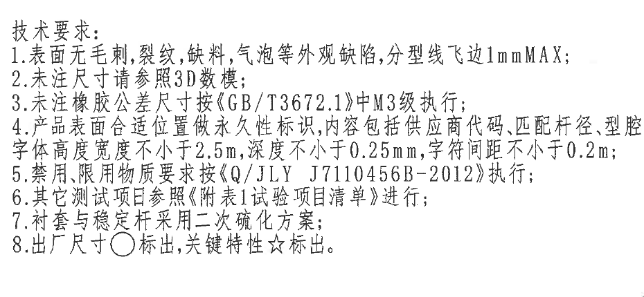

原图位置/视图名称：第 1 页，右中部技术要求；bbox `[1825, 1125, 2755, 1555]`。

| 提取项 | 原图数值或文本 | 含义说明 |
|---|---|---|
| 标题 | `技术要求:` | 本区域为技术要求/NOTES。 |
| 1 | `表面无毛刺，裂纹，缺料，气泡等外观缺陷，分型线飞边1mmMAX;` | 外观缺陷与飞边控制要求。 |
| 2 | `未注尺寸请参照3D数模;` | 未标尺寸以 3D 数模为依据。 |
| 3 | `未注橡胶公差尺寸按《GB/T3672.1》中M3级执行;` | 未注橡胶尺寸公差执行标准和等级。 |
| 4 | `产品表面合适位置做永久性标识,内容包括供应商代码,匹配杆径,型腔,字体高度宽度不小于2.5mm,深度不小于0.25mm,字符间距不小于0.2m;` | 永久标识要求；原图字符间距单位可辨为 `0.2m`，存在扫描疑读。 |
| 5 | `禁用、限用物质要求按《Q/JLY J7110456B-2012》执行;` | 禁限用物质标准。 |
| 6 | `其它测试项目参照《附表1试验项目清单》进行;` | 测试项目引用说明，按原图文字转写。 |
| 7 | `衬套与稳定杆采用二次硫化方案;` | 制造/结合工艺要求。 |
| 8 | `出厂尺寸○标出,关键特性☆标出。` | 圆圈标识出厂尺寸，星号标识关键特性；object_1 的 `Ø24±0.3☆` 属关键特性。 |

边界归属说明：裁切完整包含技术要求 1-8 条；下方产品定向图不归入本 NOTES 区域，未提取为技术要求内容。

## object_10 BOM 与标题栏

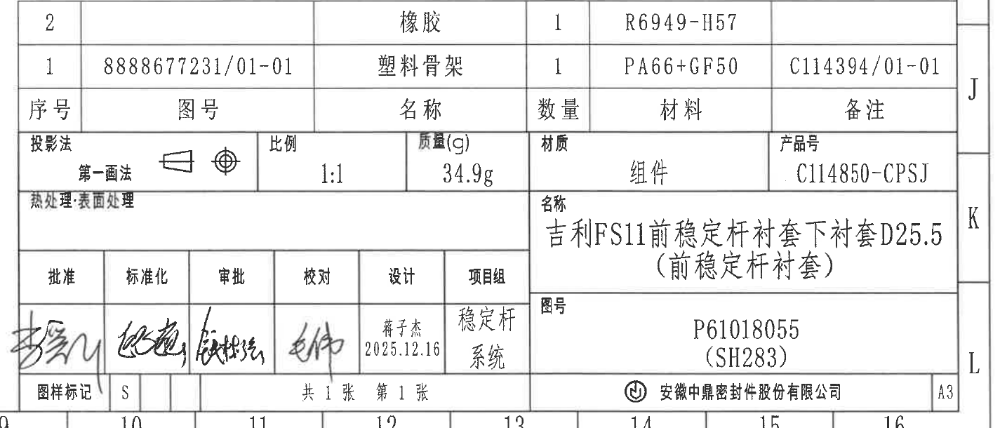

原图位置/视图名称：第 1 页，右下角明细表/标题栏；bbox `[1825, 1640, 3250, 2250]`。

明细表还原：

| 序号 | 图号 | 名称 | 数量 | 材料 | 备注 |
|---|---|---|---|---|---|
| 2 |  | 橡胶 | 1 | R6949-H57 |  |
| 1 | 8888677231/01-01 | 塑料骨架 | 1 | PA66+GF50 | C114394/01-01 |

标题栏/属性表还原：

| 字段 | 原图数值或文本 | 含义说明 |
|---|---|---|
| 投影法 | 第一画法 | 投影法标识，旁有投影符号。 |
| 比例 | `1:1` | 图样比例。 |
| 质量(g) | `34.9g` | 组件质量。 |
| 材质 | `组件` | 产品为组件。 |
| 产品号 | `C114850-CPSJ` | 产品号。 |
| 名称 | `吉利FS11前稳定杆衬套下衬套D25.5（前稳定杆衬套）` | 产品名称；括号内为参考/补充名称。 |
| 图号 | `P61018055 (SH283)` | 图号；括号内 `SH283` 为图号补充代码。 |
| 设计 | `蒋子杰 2025.12.16` | 设计人员与日期。 |
| 项目组 | `稳定杆系统` | 项目组。 |
| 图样标记 | `S` | 图样标记栏内容。 |
| 张数 | `共1张 第1张` | 图样页数信息。 |
| 公司 | `安徽中鼎密封件股份有限公司` | 出图/公司名称。 |
| 图幅 | `A3` | 图纸幅面。 |

边界归属说明：裁切包含完整 BOM、标题栏、签审栏和公司栏；右侧图框 J-L 分区字母以及底部 10-16 分区号仅为图框定位信息，不作为标题栏字段提取。

## 裁切检查记录

| 对象 | 图片路径 | 检查结果 | 边界处理记录 |
|---|---|---|---|
| page_1 | `outputs/20C114850_assets/images/page_1.png` | 完整整页 PNG，3306 x 2337。 | 作为所有 bbox 的坐标基准。 |
| object_1 | `outputs/20C114850_assets/images/object_1.png` | 完整包含 `Ø24±0.3☆`、`19.5±0.8`、`R23.5±0.5`、`47±0.8` 的尺寸线、箭头和文字。 | 第一版带入右侧剖面边线，已重裁；最终只保留主视图和属于主视图的 A-A 剖切标识。 |
| object_2 | `outputs/20C114850_assets/images/object_2.png` | 完整包含剖面、`40±0.8` 尺寸线和 `A-A` 标题。 | 第一版带入左右邻近视图，已重裁；最终剔除相邻主视图和局部视图。 |
| object_3 | `outputs/20C114850_assets/images/object_3.png` | 完整包含右侧局部弧面视图和可辨弧向标识。 | 第一版带入图框 D/E 分区线，已收窄；不提取邻近图框字符。 |
| object_4 | `outputs/20C114850_assets/images/object_4.png` | 完整包含 X/Y/Z 坐标轴、产品等轴测和 `图1 产品定向`。 | 曾出现标题文字截断和技术要求残字，已重裁；最终不包含下方明细表内容。 |
| object_5 | `outputs/20C114850_assets/images/object_5.png` | 完整包含 F 箭头、试验装配图、`图2 轴向压脱试验 (1:4)`。 | 第一版带入左表残片和下方附表 2 表头，已重裁。 |
| object_6 | `outputs/20C114850_assets/images/object_6.png` | 完整包含修订履历表头和三行可见记录区。 | 顶部图框分区号保留为位置参照，不作为表格字段。 |
| object_7 | `outputs/20C114850_assets/images/object_7.png` | 完整包含附表 1 标题、表头和两条数据行。 | 右侧图2示意已排除。 |
| object_8 | `outputs/20C114850_assets/images/object_8.png` | 完整包含附表 2 标题、表头和全部试验项目行。 | 顶部扩边以保留表题；图框坐标和邻近图2标题不作为表格内容。 |
| object_9 | `outputs/20C114850_assets/images/object_9.png` | 完整包含技术要求 1-8 条文字。 | 曾因收缩右边界导致第 4 条尾部截断，已恢复宽度；最终只提取 NOTES 内容。 |
| object_10 | `outputs/20C114850_assets/images/object_10.png` | 完整包含 BOM、标题栏、签审栏、公司栏和图幅。 | 图框分区号/字母作为边界参照，不作为标题栏字段。 |
