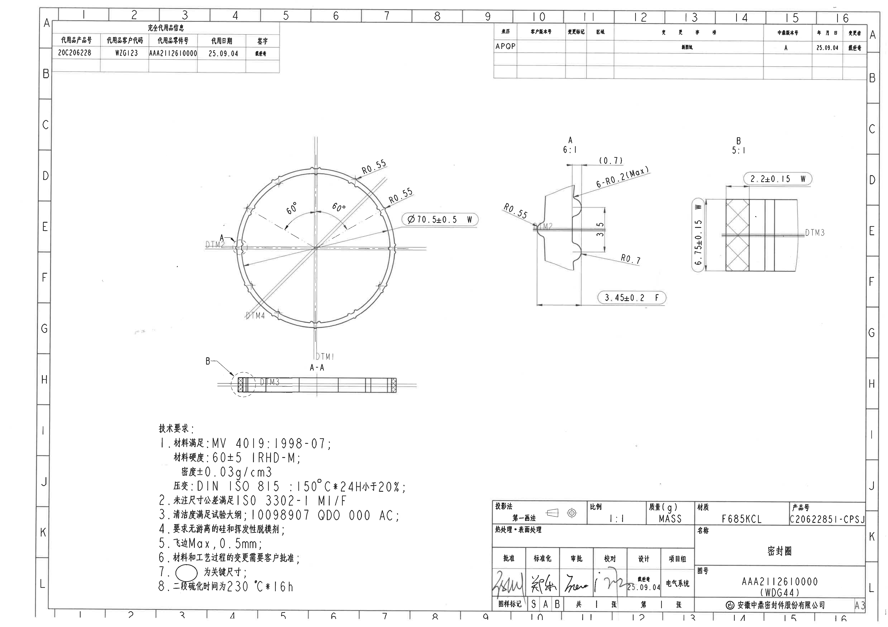
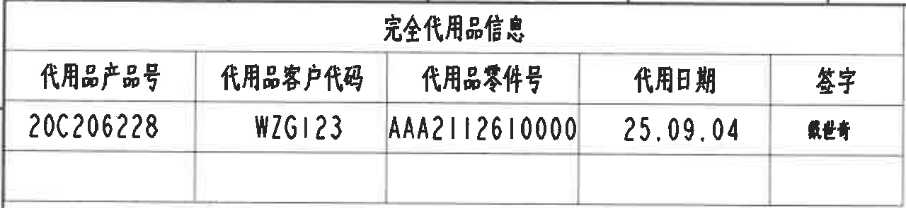
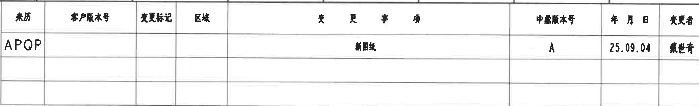
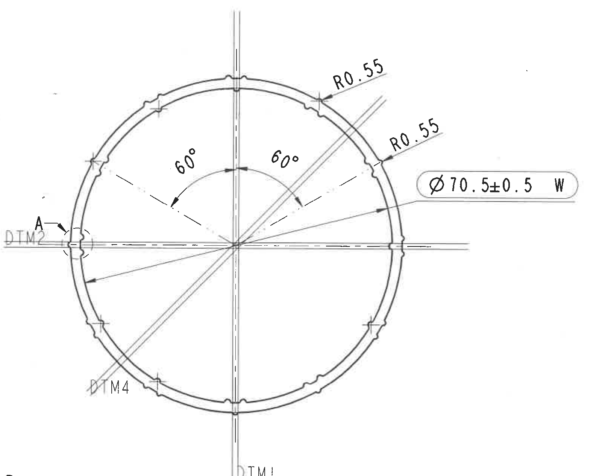
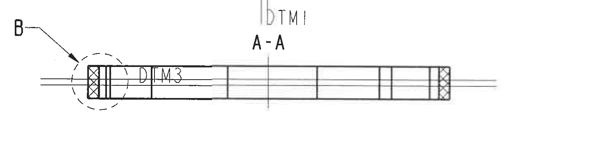
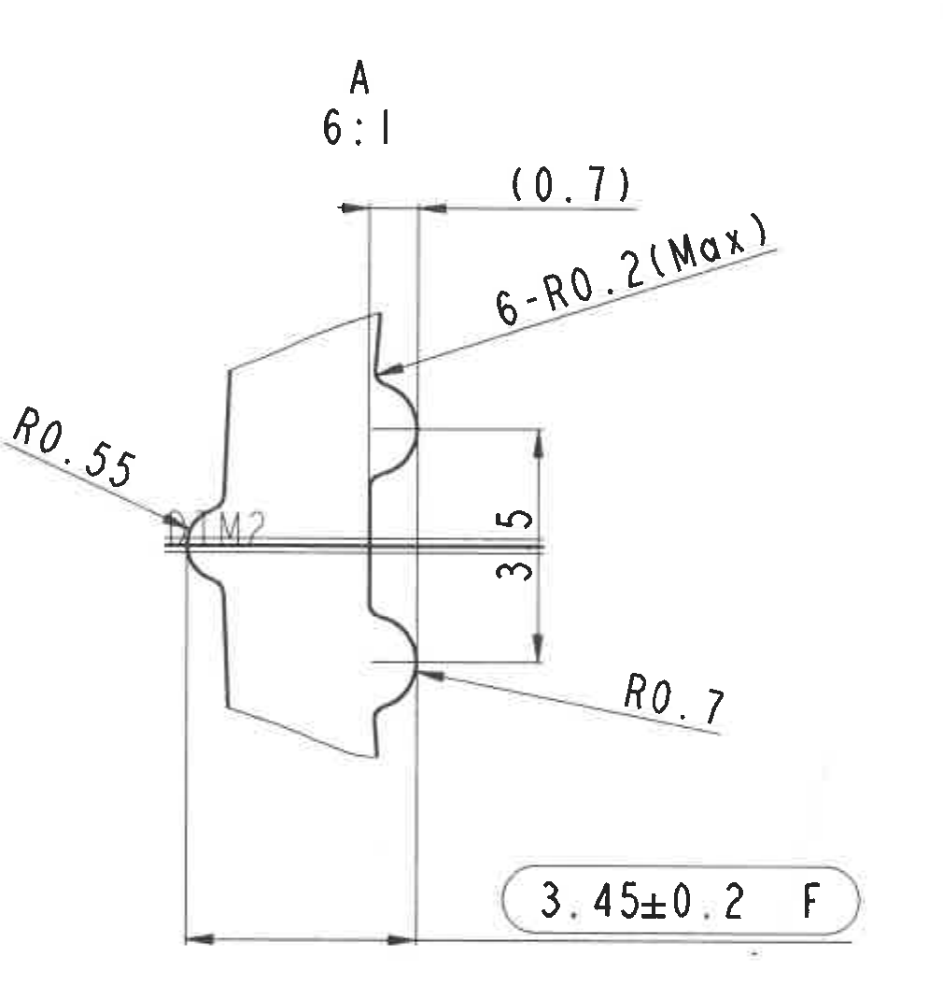
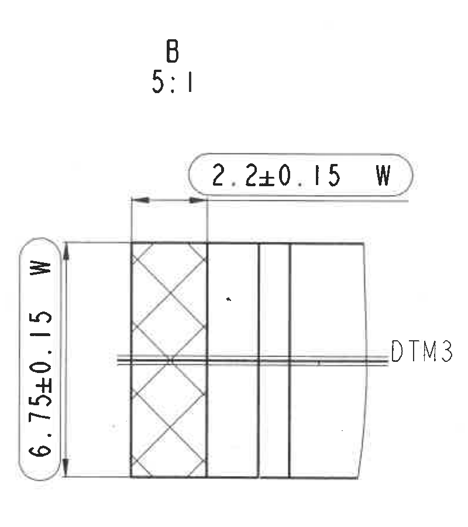
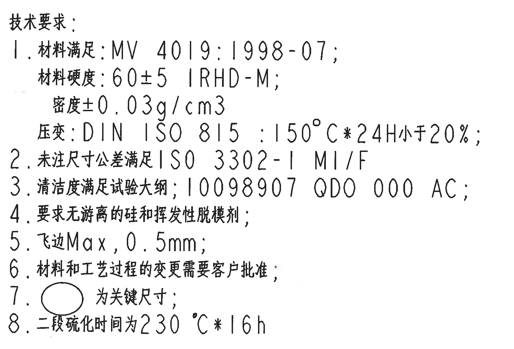
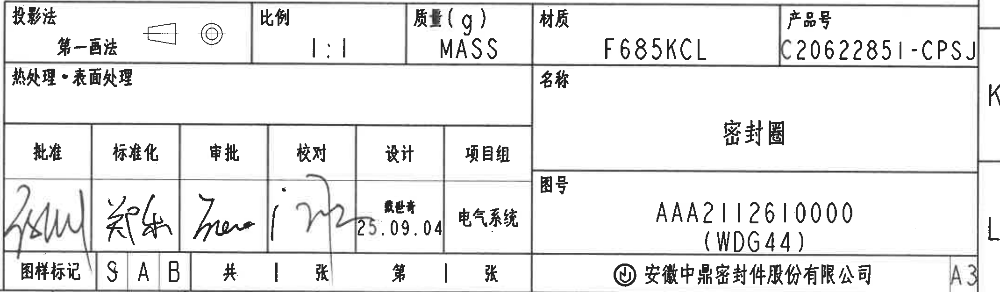

# 20C20622851 图纸内容识别与裁切提取

源文件：`input/20C20622851.pdf`

整页渲染 PNG：`outputs/20C20622851_assets/images/page_1.png`

## object_1 - 完全代用品信息表

原图位置/视图名称：第 1 页左上角，标题为“完全代用品信息”的表格。

原表格还原：

| 代用品产品号 | 代用品客户代码 | 代用品零件号 | 代用日期 | 签字 |
|---|---|---|---|---|
| 20C206228 | WZG123 | AAA2112610000 | 25.09.04 | 戴世奇 |

提取表格：

| 提取项 | 原图数值或文本 | 含义说明 |
|---|---|---|
| 表题 | 完全代用品信息 | 该表记录替代产品相关信息。 |
| 代用品产品号 | 20C206228 | 替代产品编号。 |
| 代用品客户代码 | WZG123 | 替代产品对应客户代码。 |
| 代用品零件号 | AAA2112610000 | 替代产品对应零件号。 |
| 代用日期 | 25.09.04 | 代用日期，按图纸日期格式记录。 |
| 签字 | 戴世奇 | 表格签字栏内容。 |

边界归属说明：裁切区域仅包含左上“完全代用品信息”表格及其外框，没有纳入相邻主图、修订履历表或图框坐标内容。

## object_2 - 修订履历表

原图位置/视图名称：第 1 页右上角修订履历/变更记录表。

原表格还原：

| 来历 | 客户版本号 | 变更标记 | 区域 | 变更事项 | 中鼎版本号 | 年月日 | 变更者 |
|---|---|---|---|---|---|---|---|
| APQP |  |  |  | 新图纸 | A | 25.09.04 | 戴世奇 |
|  |  |  |  |  |  |  |  |
|  |  |  |  |  |  |  |  |

提取表格：

| 提取项 | 原图数值或文本 | 含义说明 |
|---|---|---|
| 来历 | APQP | 本次记录来源/阶段。 |
| 客户版本号 | 空白 | 原表该栏未填写。 |
| 变更标记 | 空白 | 原表该栏未填写。 |
| 区域 | 空白 | 原表该栏未填写。 |
| 变更事项 | 新图纸 | 表示本版为新图纸。 |
| 中鼎版本号 | A | 中鼎内部版本号。 |
| 年月日 | 25.09.04 | 变更记录日期。 |
| 变更者 | 戴世奇 | 变更者栏签名/姓名。 |

边界归属说明：裁切区域为右上修订表本体；上方图框数字和右侧边框坐标不作为表格字段提取。

## object_3 - 圆形主视图

原图位置/视图名称：第 1 页中左部圆形加工主视图。

提取表格：

| 提取项 | 原图数值或文本 | 含义说明 |
|---|---|---|
| 直径尺寸 | Ø70.5±0.5 W | 圆形密封圈外形/相关圆周直径尺寸；带直径符号、±0.5 公差和 W 标识。 |
| 半径标注 1 | R0.55 | 圆周上方局部圆角/凹凸过渡半径。 |
| 半径标注 2 | R0.55 | 圆周右上局部圆角/凹凸过渡半径。 |
| 弧向/角度尺寸 1 | 60° | 中心向左上区域的角度分段，按弧线箭头标出。 |
| 弧向/角度尺寸 2 | 60° | 中心向右上区域的角度分段，按弧线箭头标出。 |
| 基准编号 | DTM1 | 位于下方竖向中心线处的基准标识。 |
| 基准编号 | DTM2 | 位于左侧水平中心线附近的基准标识。 |
| 基准编号 | DTM4 | 位于左下斜向区域的基准标识。 |
| 局部视图呼出 | A | 左侧局部特征的放大视图呼出，对应 object_5。 |
| T 编号检查 | 未见独立 T 编号 | 本主视图未见单独 T 编号；可见编号均为 DTM 基准编号。 |

边界归属说明：该裁切框为保留 DTM1、DTM2、DTM4 和完整 Ø/R/60° 标注而取。左下边缘可见相邻 A-A 剖面 B 呼出符号的极小残片，归属 object_4/object_6，不作为本主视图尺寸或文字提取；下方 A-A 剖面主体未纳入本对象。

## object_4 - A-A 剖面视图

原图位置/视图名称：第 1 页中下部 A-A 剖面视图。

提取表格：

| 提取项 | 原图数值或文本 | 含义说明 |
|---|---|---|
| 剖面名称 | A-A | 剖面视图名称，表示按 A-A 方向剖切。 |
| 基准编号 | DTM3 | 剖面中心线/特征处的基准标识。 |
| 局部视图呼出 | B | 左端虚线圆圈和箭头呼出，对应 object_6 的 B 局部放大。 |
| 剖面线 | 左端和右端交叉剖面线 | 表示该处为剖切到的材料区域。 |
| T 编号检查 | 未见独立 T 编号 | 本剖面未见单独 T 编号；可见编号为 DTM3。 |

边界归属说明：裁切区域包含完整 B 呼出、A-A 标题、剖面轮廓和 DTM3。上方淡灰色 DTM1 是主视图竖向中心线延伸的邻近信息，归属 object_3，不作为 A-A 剖面提取项。

## object_5 - A 局部放大视图

原图位置/视图名称：第 1 页中右部 A 局部放大视图，比例 6:1。

提取表格：

| 提取项 | 原图数值或文本 | 含义说明 |
|---|---|---|
| 局部视图名称 | A | 对应主视图左侧 A 呼出的局部特征。 |
| 放大比例 | 6:1 | A 局部视图放大比例。 |
| 参考尺寸 | (0.7) | 括号内参考尺寸，位于顶部两竖向边之间；用于说明参考间距，不作为直接控制尺寸。 |
| 数量前缀半径 | 6-R0.2(Max) | 6 处最大 R0.2 的圆角/过渡半径要求，带数量前缀和 Max 限制。 |
| 半径标注 | R0.55 | 左侧 DTM2 附近小圆角半径。 |
| 竖向尺寸 | 3.5 | 右侧两水平引出线之间的竖向高度/间距。 |
| 半径标注 | R0.7 | 右下局部过渡圆角半径。 |
| 长度尺寸 | 3.45±0.2 F | 底部水平距离尺寸，带 ±0.2 公差和 F 标识。 |
| 基准编号 | DTM2 | 与主视图左侧对应的基准特征。 |
| T 编号检查 | 未见独立 T 编号 | 本局部视图未见单独 T 编号；可见编号为 DTM2。 |

边界归属说明：裁切区域只覆盖 A 局部视图及其所有引出尺寸线、箭头和文字；左侧 DTM2 是当前局部视图内的基准说明，不归入主视图重复提取。

## object_6 - B 局部放大视图

原图位置/视图名称：第 1 页右中部 B 局部放大视图，比例 5:1。

提取表格：

| 提取项 | 原图数值或文本 | 含义说明 |
|---|---|---|
| 局部视图名称 | B | 对应 A-A 剖面左端 B 呼出的局部特征。 |
| 放大比例 | 5:1 | B 局部视图放大比例。 |
| 横向尺寸 | 2.2±0.15 W | 顶部水平距离尺寸，带 ±0.15 公差和 W 标识。 |
| 竖向总高度 | 6.75±0.15 W | 左侧竖排总高度尺寸，带 ±0.15 公差和 W 标识。 |
| 基准编号 | DTM3 | 横向中心线右侧标出的基准特征。 |
| 剖面线 | 左侧交叉剖面线区域 | 表示局部剖切材料区域。 |
| T 编号检查 | 未见独立 T 编号 | 本局部视图未见单独 T 编号；可见编号为 DTM3。 |

边界归属说明：裁切区域包含 B 局部的完整标注框、尺寸线、箭头、竖排文字和 DTM3；没有纳入 A 局部视图的 R0.7 或 3.45±0.2 F。

## object_7 - 技术要求 NOTES

原图位置/视图名称：第 1 页左下部“技术要求”文本块。

原文本还原：

| 序号 | 原图文本 |
|---|---|
| 1 | 材料满足: MV 4019:1998-07; 材料硬度: 60±5 IRHD-M; 密度±0.03g/cm3; 压变: DIN ISO 815 : 150°C*24H小于20%; |
| 2 | 未注尺寸公差满足 ISO 3302-1 M1/F |
| 3 | 清洁度满足试验大纲; 10098907 QD0 000 AC; |
| 4 | 要求无游离的硅和挥发性脱模剂; |
| 5 | 飞边 Max, 0.5mm; |
| 6 | 材料和工艺过程的变更需要客户批准; |
| 7 | ○ 为关键尺寸; |
| 8 | 二段硫化时间为 230°C*16h |

提取表格：

| 提取项 | 原图数值或文本 | 含义说明 |
|---|---|---|
| 材料规范 | MV 4019:1998-07 | 材料需满足该规范。 |
| 材料硬度 | 60±5 IRHD-M | 橡胶硬度要求，带 ±5 公差。 |
| 密度 | ±0.03g/cm3 | 密度允许偏差要求。 |
| 压变 | DIN ISO 815 : 150°C*24H小于20% | 压缩永久变形试验条件和结果要求。 |
| 未注尺寸公差 | ISO 3302-1 M1/F | 未单独标注尺寸时采用的公差等级。 |
| 清洁度 | 10098907 QD0 000 AC | 清洁度满足试验大纲及对应编号要求。 |
| 脱模剂/游离硅 | 要求无游离的硅和挥发性脱模剂 | 材料/工艺清洁限制。 |
| 飞边 | Max, 0.5mm | 飞边最大允许值为 0.5 mm。 |
| 变更批准 | 材料和工艺过程的变更需要客户批准 | 材料和工艺变更需客户确认。 |
| 关键尺寸符号 | ○ 为关键尺寸 | 圆圈符号表示关键尺寸。 |
| 二段硫化 | 230°C*16h | 二段硫化温度和时间要求。 |
| 星号检查 | 150°C*24H、230°C*16h | 图中星号用于工艺条件中的温度/时间连接，视图尺寸中未见单独带星号的尺寸标注。 |

边界归属说明：裁切区域为“技术要求”文本块；未包含右侧标题栏，也未把主视图或剖面视图尺寸混入 NOTES。

## object_8 - 标题栏

原图位置/视图名称：第 1 页右下角标题栏。

标题栏上部表格还原：

| 投影法 | 比例 | 质量(g) | 材质 | 产品号 |
|---|---|---|---|---|
| 第一画法（含投影符号） | 1:1 | MASS | F685KCL | C20622851-CPSJ |

标题栏中部/右侧表格还原：

| 热处理・表面处理 | 名称 | 图号 |
|---|---|---|
| 空白 | 密封圈 | AAA2112610000 (WDG44) |

签署与图样信息表还原：

| 批准 | 标准化 | 审批 | 校对 | 设计 | 项目组 |
|---|---|---|---|---|---|
| 手写签名 | 手写签名 | 手写签名 | 手写签名 | 戴世奇 25.09.04 | 电气系统 |

| 图样标记 | S | A | B | 共 | 1 | 张 | 第 | 1 | 张 |
|---|---|---|---|---|---|---|---|---|---|

| 公司 | 图幅 |
|---|---|
| 安徽中鼎密封件股份有限公司 | A3 |

提取表格：

| 提取项 | 原图数值或文本 | 含义说明 |
|---|---|---|
| 投影法 | 第一画法 | 图纸投影法，旁边有投影符号。 |
| 比例 | 1:1 | 图纸比例。 |
| 质量(g) | MASS | 质量栏以 MASS 标识，未填具体数值。 |
| 材质 | F685KCL | 材料牌号/材料栏内容。 |
| 产品号 | C20622851-CPSJ | 标题栏产品号。 |
| 热处理・表面处理 | 空白 | 原标题栏该栏未填写。 |
| 名称 | 密封圈 | 零件名称。 |
| 图号 | AAA2112610000 (WDG44) | 图纸编号及括号内补充编号。 |
| 批准/标准化/审批/校对 | 手写签名 | 原图为手写签名，扫描件未可靠形成标准字符。 |
| 设计 | 戴世奇 25.09.04 | 设计栏签名和日期。 |
| 项目组 | 电气系统 | 项目组栏内容。 |
| 图样标记 | S A B | 图样标记栏三个单元格内容。 |
| 张数 | 共 1 张，第 1 张 | 页数/张数信息。 |
| 公司 | 安徽中鼎密封件股份有限公司 | 出图公司名称。 |
| 图幅 | A3 | 图纸幅面。 |

边界归属说明：裁切区域包含完整标题栏、右侧 A3 图幅栏和产品号尾部。右侧保留少量图框坐标线片段用于防止截断边框和 A3 栏，未作为标题栏字段提取。

## 裁切检查记录

| 裁切对象 | 图片路径 | 检查记录 |
|---|---|---|
| 整页渲染 | outputs/20C20622851_assets/images/page_1.png | 已由 PDF 渲染为整页 PNG，页面内容完整。 |
| object_1 | outputs/20C20622851_assets/images/object_1.png | 表格外框、表头和唯一数据行完整，无边缘文字截断。 |
| object_2 | outputs/20C20622851_assets/images/object_2.png | 修订履历表表头、APQP 行和空白行完整；未把上方图框坐标作为表格字段提取。 |
| object_3 | outputs/20C20622851_assets/images/object_3.png | Ø70.5±0.5 W、两处 R0.55、两处 60°、DTM1/DTM2/DTM4 和 A 呼出完整；左下角相邻 B 呼出残片已排除归属。 |
| object_4 | outputs/20C20622851_assets/images/object_4.png | A-A 剖面、B 呼出、DTM3 和剖面线完整；上方 DTM1 为主视图邻近信息，未归入剖面提取。 |
| object_5 | outputs/20C20622851_assets/images/object_5.png | A 局部视图尺寸线、箭头和文字完整，包括 (0.7)、6-R0.2(Max)、R0.55、3.5、R0.7、3.45±0.2 F。 |
| object_6 | outputs/20C20622851_assets/images/object_6.png | B 局部视图尺寸线、竖排文字和 DTM3 完整，包括 2.2±0.15 W、6.75±0.15 W。 |
| object_7 | outputs/20C20622851_assets/images/object_7.png | 技术要求 1-8 条完整，无右侧标题栏或上方视图片段混入。 |
| object_8 | outputs/20C20622851_assets/images/object_8.png | 标题栏字段完整，产品号尾部、图号、公司名和 A3 图幅未截断；右侧少量图框线不作为字段提取。 |
