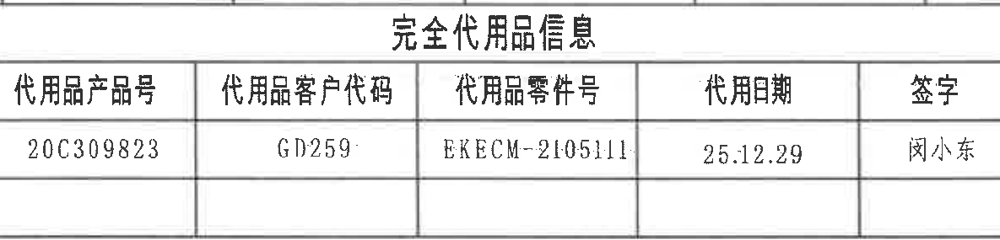
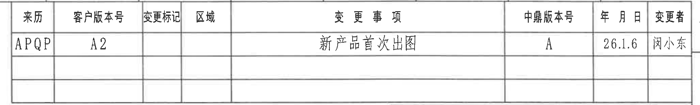
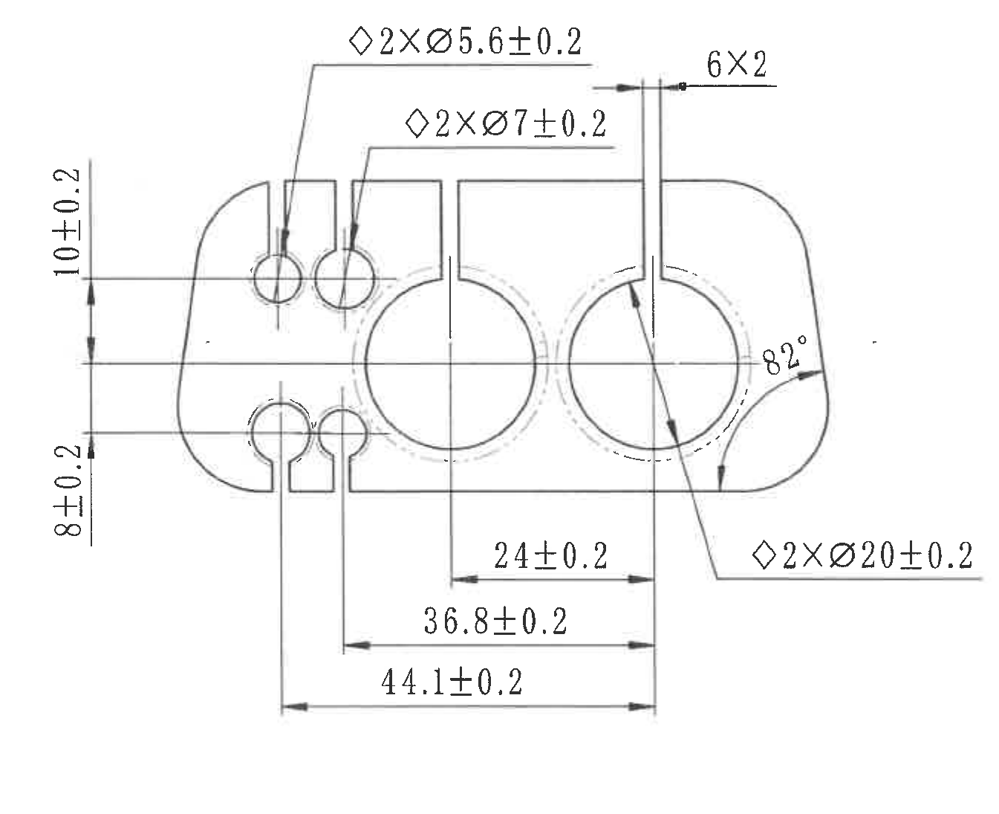
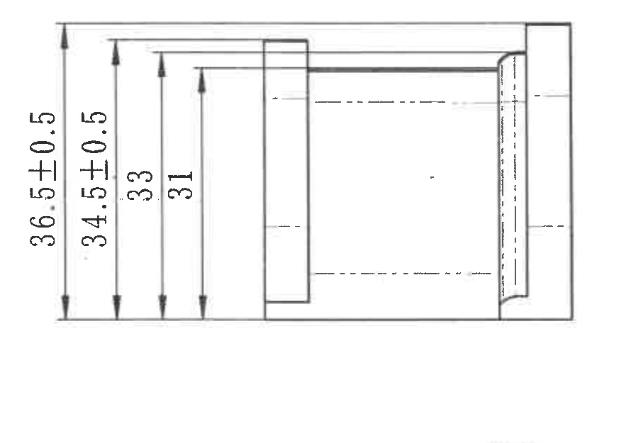
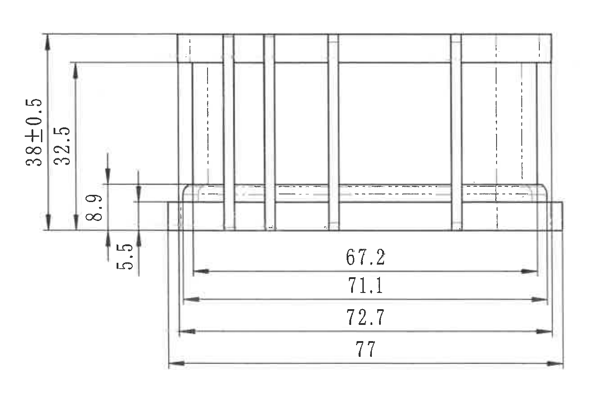
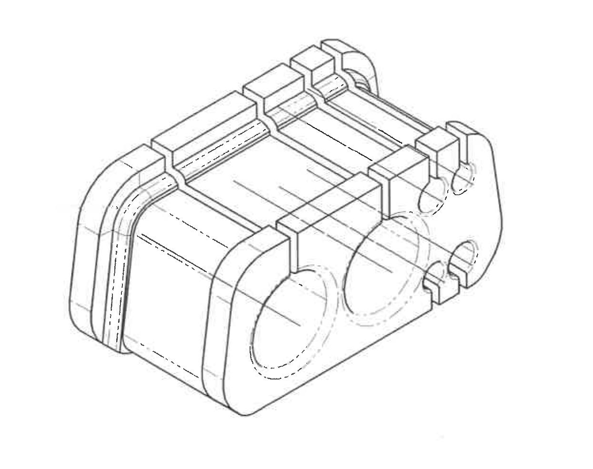
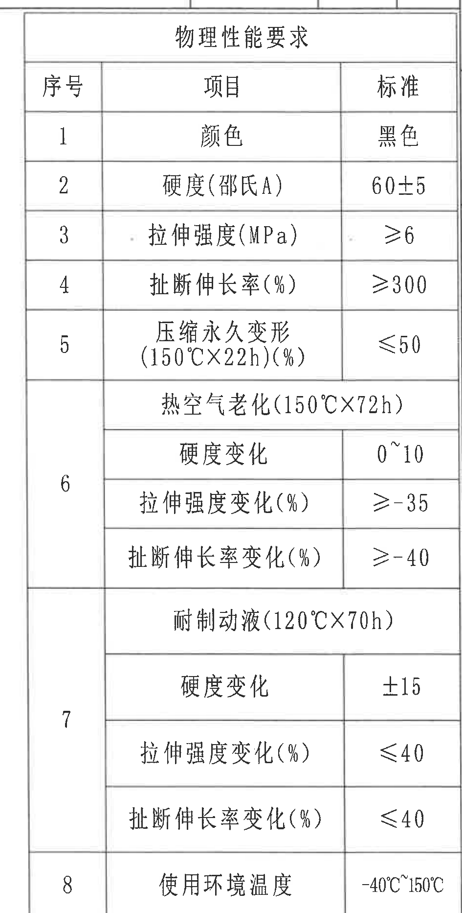
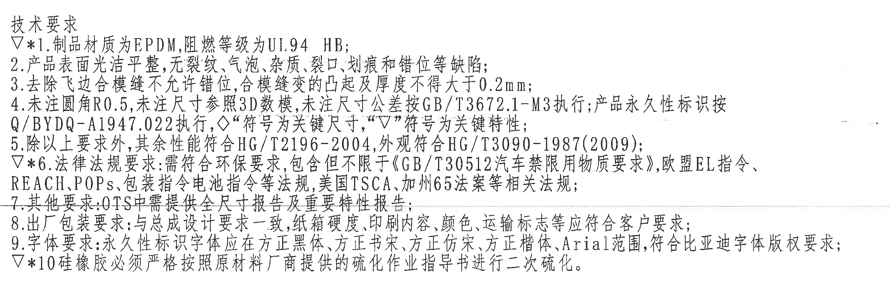
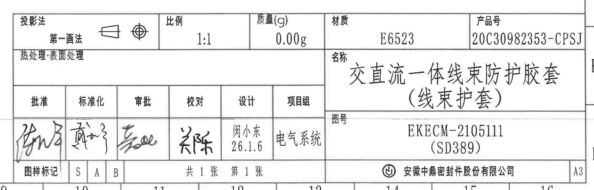

# 20C30982353 内容识别

来源：`input/20C30982353.pdf`。整页渲染图：`outputs/20C30982353_assets/images/page_1.png`，尺寸 4959 x 3505 px。以下裁切对象均按整页 PNG 像素坐标记录 bbox，保持原图对象结构，不把其他视图内容归入当前对象。

## object_1 完全代用品信息表

原图位置/视图名称：页 1 左上方，完全代用品信息表；bbox `[405, 150, 1590, 435]`。

| 代用品产品号 | 代用品客户代码 | 代用品零件号 | 代用日期 | 签字 |
|---|---|---|---|---|
| 20C309823 | GD259 | EKECM-2105111 | 25.12.29 | 闵小东 |

| 提取项 | 原图数值或文本 | 含义说明 |
|---|---|---|
| 表题 | 完全代用品信息 | 说明本产品与列出代用品之间的替代关系。 |
| 代用品产品号 | 20C309823 | 被替代或关联的代用品产品编号。 |
| 代用品客户代码 | GD259 | 客户侧代用品代码。 |
| 代用品零件号 | EKECM-2105111 | 代用品零件号。 |
| 代用日期 | 25.12.29 | 代用记录日期。 |
| 签字 | 闵小东 | 代用信息确认人。 |

边界归属说明：该裁切只包含左上完全代用品信息表主体；上方图框坐标数字被排除，仅保留表题、表头、数据行及表格边界。

## object_2 变更履历表

原图位置/视图名称：页 1 右上方，变更履历表；bbox `[2730, 150, 4795, 460]`。

| 来历 | 客户版本号 | 变更标记 | 区域 | 变更事项 | 中鼎版本号 | 年月日 | 变更者 |
|---|---|---|---|---|---|---|---|
| APQP | A2 |  |  | 新产品首次出图 | A | 26.1.6 | 闵小东 |
|  |  |  |  |  |  |  |  |
|  |  |  |  |  |  |  |  |

| 提取项 | 原图数值或文本 | 含义说明 |
|---|---|---|
| 来历 | APQP | 变更来源或流程阶段。 |
| 客户版本号 | A2 | 客户版本。 |
| 变更标记 | 空 | 本行未填写变更标记。 |
| 区域 | 空 | 本行未指定变更区域。 |
| 变更事项 | 新产品首次出图 | 表示本图为新产品首次发布图纸。 |
| 中鼎版本号 | A | 中鼎内部版本号。 |
| 年月日 | 26.1.6 | 变更日期。 |
| 变更者 | 闵小东 | 变更记录填写人。 |

边界归属说明：该裁切只包含右上变更履历表；顶部坐标数字和右侧图框坐标未作为表格内容提取。

## object_3 主视图/端面加工视图

原图位置/视图名称：页 1 左上中部主视图/端面加工视图；bbox `[680, 465, 2025, 1560]`。

| 提取项 | 原图数值或文本 | 含义说明 |
|---|---|---|
| 关键尺寸符号 | ◇2×Ø5.6±0.2 | 菱形符号按技术要求为关键尺寸；2 处直径 5.6，公差 ±0.2，位于左上两小孔中的一组。 |
| 关键尺寸符号 | ◇2×Ø7±0.2 | 菱形符号按技术要求为关键尺寸；2 处直径 7，公差 ±0.2，位于左侧小孔/开口孔中的另一组。 |
| 槽/筋数量宽度 | 6×2 | 6 处宽度为 2 的结构，标注在上部竖向筋/槽附近。 |
| 垂直距离 | 10±0.2 | 左侧上部两条水平基准/中心线之间的距离，公差 ±0.2。 |
| 垂直距离 | 8±0.2 | 左侧下部两条水平基准/中心线之间的距离，公差 ±0.2。 |
| 角度 | 82° | 右侧圆角/斜向边界相关角度，标注在右端外形弧线附近。 |
| 水平距离 | 24±0.2 | 中部孔位到右侧竖向基准线的水平距离，公差 ±0.2。 |
| 水平距离 | 36.8±0.2 | 左侧内侧基准线到右侧竖向基准线的水平距离，公差 ±0.2。 |
| 总体/孔位水平距离 | 44.1±0.2 | 左侧外侧基准线到右侧竖向基准线的水平距离，公差 ±0.2。 |
| 关键尺寸符号 | ◇2×Ø20±0.2 | 菱形符号按技术要求为关键尺寸；2 处直径 20 的大孔，公差 ±0.2。 |

边界归属说明：主视图裁切完整包含端面轮廓、孔径引出线、底部水平尺寸线和右侧 82° 角度标注。其右侧没有包含相邻右视图的尺寸；下方 `38±0.5`、`32.5`、`67.2` 等属于下方视图，未归入本对象。

## object_4 右侧视图/厚度加工视图

原图位置/视图名称：页 1 上中部偏右，右侧视图/厚度加工视图；bbox `[2145, 675, 3035, 1300]`。

| 提取项 | 原图数值或文本 | 含义说明 |
|---|---|---|
| 总高度/外形高度 | 36.5±0.5 | 该视图最大外形高度，公差 ±0.5。 |
| 局部高度 | 34.5±0.5 | 内侧台阶或主体高度，公差 ±0.5。 |
| 高度 | 33 | 中间轮廓高度，无单独公差；按未注公差要求处理。 |
| 高度 | 31 | 内部轮廓高度，无单独公差；按未注公差要求处理。 |

边界归属说明：该裁切只对应上中部右侧视图，包含左侧四组竖向尺寸线和右端轮廓；未包含左侧主视图和下方轴测图内容。

## object_5 下方侧向/俯视加工视图

原图位置/视图名称：页 1 左下中部，下方侧向/俯视加工视图；bbox `[550, 1515, 1905, 2415]`。

| 提取项 | 原图数值或文本 | 含义说明 |
|---|---|---|
| 总高度/外形高度 | 38±0.5 | 左侧最大外形高度，公差 ±0.5。 |
| 内部高度 | 32.5 | 左侧内部台阶/主体高度，无单独公差；按未注公差要求处理。 |
| 台阶高度 | 8.9 | 左侧中部台阶或横向凸台高度。 |
| 台阶/底部高度 | 5.5 | 左侧下方局部高度。 |
| 长度 | 67.2 | 内侧长度尺寸，位于下方最上一级水平尺寸线。 |
| 长度 | 71.1 | 次外侧长度尺寸，位于下方第二级水平尺寸线。 |
| 长度 | 72.7 | 外侧长度尺寸，位于下方第三级水平尺寸线。 |
| 总长度 | 77 | 最大总长度，位于最下方水平尺寸线。 |

边界归属说明：该裁切完整包含下方视图的左侧高度尺寸和底部四条长度尺寸。上方主视图与右侧轴测图不在本对象内；靠近左上边界的 `38±0.5` 和 `32.5` 由完整竖向尺寸线归属此视图。

## object_6 轴测图

原图位置/视图名称：页 1 中右部，轴测图/三维示意；bbox `[2170, 1220, 3415, 2205]`。

| 提取项 | 原图数值或文本 | 含义说明 |
|---|---|---|
| 形体表达 | 交直流一体线束防护胶套的三维外形 | 显示端部圆孔、上部槽筋、侧壁圆角和整体外观，用于辅助理解零件形体。 |
| 尺寸标注 | 无 | 该轴测图未给出独立尺寸、角度、弧度、公差或基准标识。尺寸应以正投影视图和技术要求为准。 |

边界归属说明：该裁切仅包含轴测图外形，无相邻主视图尺寸线和右侧物性表。该图没有剖切符号、局部放大符号或尺寸引出线。

## object_7 物理性能要求表

原图位置/视图名称：页 1 右侧，物理性能要求表；bbox `[3830, 435, 4775, 2300]`。

| 序号 | 项目 | 标准 |
|---|---|---|
| 1 | 颜色 | 黑色 |
| 2 | 硬度(邵氏A) | 60±5 |
| 3 | 拉伸强度(MPa) | ≥6 |
| 4 | 扯断伸长率(%) | ≥300 |
| 5 | 压缩永久变形(150℃×22h)(%) | ≤50 |
| 6 | 热空气老化(150℃×72h) |  |
| 6 | 硬度变化 | 0~10 |
| 6 | 拉伸强度变化(%) | ≥-35 |
| 6 | 扯断伸长率变化(%) | ≥-40 |
| 7 | 耐制动液(120℃×70h) |  |
| 7 | 硬度变化 | ±15 |
| 7 | 拉伸强度变化(%) | ≤40 |
| 7 | 扯断伸长率变化(%) | ≤40 |
| 8 | 使用环境温度 | -40℃~150℃ |

| 提取项 | 原图数值或文本 | 含义说明 |
|---|---|---|
| 表题 | 物理性能要求 | 规定材料/成品的物性检验标准。 |
| 颜色 | 黑色 | 外观颜色要求。 |
| 硬度 | 60±5 邵氏A | 材料硬度范围。 |
| 拉伸强度 | ≥6 MPa | 拉伸强度下限。 |
| 扯断伸长率 | ≥300% | 断裂伸长率下限。 |
| 压缩永久变形 | ≤50%，150℃×22h | 高温压缩后永久变形上限。 |
| 热空气老化 | 150℃×72h | 老化条件；下列三项为该条件后的性能变化。 |
| 热空气老化硬度变化 | 0~10 | 热空气老化后硬度变化范围。 |
| 热空气老化拉伸强度变化 | ≥-35% | 热空气老化后拉伸强度变化下限。 |
| 热空气老化扯断伸长率变化 | ≥-40% | 热空气老化后扯断伸长率变化下限。 |
| 耐制动液 | 120℃×70h | 耐制动液试验条件；下列三项为试验后的性能变化。 |
| 耐制动液硬度变化 | ±15 | 耐制动液试验后硬度变化限值。 |
| 耐制动液拉伸强度变化 | ≤40% | 耐制动液试验后拉伸强度变化上限。 |
| 耐制动液扯断伸长率变化 | ≤40% | 耐制动液试验后扯断伸长率变化上限。 |
| 使用环境温度 | -40℃~150℃ | 产品工作环境温度范围。 |

边界归属说明：该裁切包含右侧物理性能要求表的完整标题、表头、序号 1 到 8 全部行和底部边界；未包含图纸右侧坐标栏文字作为表格内容。

## object_8 NOTES/技术要求

原图位置/视图名称：页 1 左下方，技术要求/NOTES；bbox `[405, 2570, 2705, 3315]`。

| 提取项 | 原图数值或文本 | 含义说明 |
|---|---|---|
| 标题 | 技术要求 | 本区域为图纸通用技术要求。 |
| 1 | ▽*1. 制品材质为EPDM,阻燃等级为UL94 HB; | 带三角符号和星号，为关键特性/重点要求；规定材料为 EPDM，阻燃等级 UL94 HB。 |
| 2 | 产品表面光洁平整,无裂纹、气泡、杂质、裂口、划痕和错位等缺陷; | 外观缺陷控制要求。 |
| 3 | 去除飞边合模缝不允许错位,合模缝变的凸起及厚度不得大于0.2mm; | 飞边和合模缝控制，凸起及厚度不大于 0.2 mm。 |
| 4 | 未注圆角R0.5,未注尺寸参照3D数模,未注尺寸公差按GB/T3672.1-M3执行;产品永久性标识按Q/BYDQ-A1947.022执行,◇符号为关键尺寸,“▽”符号为关键特性; | 未注圆角、未注尺寸、公差和永久性标识依据；解释主视图中菱形关键尺寸符号和三角关键特性符号。 |
| 5 | 除以上要求外,其余性能符合HG/T2196-2004,外观符合HG/T3090-1987(2009); | 其余性能与外观执行标准。 |
| 6 | ▽*6. 法律法规要求:需符合环保要求,包含但不限于《GB/T30512汽车禁限用物质要求》,欧盟EL指令、REACH,POPs,包装指令电池指令等法规,美国TSCA,加州65法案等相关法规; | 带三角符号和星号，为关键特性/重点法规要求。 |
| 7 | 其他要求:OTS中需提供全尺寸报告及重要特性报告; | OTS 阶段提交全尺寸和重要特性报告。 |
| 8 | 出厂包装要求:与总成设计要求一致,纸箱硬度、印刷内容、颜色、运输标志等应符合客户要求; | 包装和运输标志要求。 |
| 9 | 字体要求:永久性标识字体应在方正黑体、方正书宋、方正仿宋、方正楷体、Arial范围,符合比亚迪字体版权要求; | 永久性标识字体范围和版权要求。 |
| 10 | ▽*10 硅橡胶必须严格按照原材料厂商提供的硫化作业指导书进行二次硫化。 | 带三角符号和星号，为关键特性/重点工艺要求。 |

边界归属说明：该裁切完整包含左下技术要求文字。第 7 行附近有横向图纸扫描线穿过，但文字未被裁切；右下标题栏不在该对象内。

## object_9 标题栏

原图位置/视图名称：页 1 右下方，标题栏；bbox `[2730, 2685, 4815, 3355]`。

| 提取项 | 原图数值或文本 | 含义说明 |
|---|---|---|
| 投影法 | 第一画法 | 投影方法为第一角法/第一画法，旁有投影符号。 |
| 比例 | 1:1 | 图纸比例。 |
| 质量(g) | 0.00g | 标注质量。 |
| 材质 | E6523 | 材料牌号/规格。 |
| 产品号 | 20C30982353-CPSJ | 产品编号。 |
| 热处理/表面处理 | 空 | 未填写热处理或表面处理内容。 |
| 名称 | 交直流一体线束防护胶套（线束护套） | 产品名称。 |
| 批准 | 手写签名 | 批准栏签名。 |
| 标准化 | 手写签名 | 标准化栏签名。 |
| 审批 | 手写签名 | 审批栏签名。 |
| 校对 | 手写签名 | 校对栏签名。 |
| 设计 | 闵小东 26.1.6 | 设计人及日期。 |
| 项目组 | 电气系统 | 项目组名称。 |
| 图号 | EKECM-2105111 (SD389) | 图纸编号/关联编号。 |
| 图样标记 | S A B | 图样标记栏。 |
| 页数 | 共1张 第1张 | 图纸张数信息。 |
| 公司 | 安徽中鼎密封件股份有限公司 | 出图公司。 |
| 图幅 | A3 | 图纸幅面。 |

边界归属说明：该裁切完整包含标题栏主体和右下 A3 图幅标识；底部坐标栏数字仅作为图框背景出现，未作为标题栏业务字段提取。

## 剖面视图、局部视图检查

原图中未发现带剖切箭头、剖面代号、局部放大圈号或局部视图标题的独立剖面视图/局部视图。因此未生成 object_kind 为 `section` 或 `detail` 的裁切对象；三维轴测图作为 `view` 裁切。

## 裁切检查记录

| 对象 | 裁切图片 | 完整性检查 | 是否重裁 | 归属检查 |
|---|---|---|---|---|
| object_1 | `outputs/20C30982353_assets/images/object_1.png` | 表题、表头、数据行和表格边界完整。 | 是，去除了顶部坐标栅格混入。 | 仅提取完全代用品信息表。 |
| object_2 | `outputs/20C30982353_assets/images/object_2.png` | 表头、首行记录、最右侧变更者列和空白行边界完整。 | 是，去除了顶部坐标栅格混入并外扩右侧变更者列。 | 仅提取变更履历表。 |
| object_3 | `outputs/20C30982353_assets/images/object_3.png` | 主视图所有孔径、水平尺寸、竖向尺寸和 82° 角度标注的文字、箭头、尺寸线完整。 | 是，外扩以包含右下 `◇2×Ø20±0.2` 引出文字。 | 未混入右视图或下方视图尺寸。 |
| object_4 | `outputs/20C30982353_assets/images/object_4.png` | 左侧四条竖向尺寸线、箭头和文字完整，右侧轮廓完整。 | 是，外扩左侧尺寸文字。 | 仅提取右侧视图高度尺寸。 |
| object_5 | `outputs/20C30982353_assets/images/object_5.png` | 左侧高度尺寸和底部四条长度尺寸线、箭头、文字完整。 | 是，外扩底部总长 `77` 尺寸线。 | 未将主视图尺寸归入本对象。 |
| object_6 | `outputs/20C30982353_assets/images/object_6.png` | 轴测图外形完整，无文字尺寸。 | 否。 | 仅作为三维外观视图，不提取正投影视图尺寸。 |
| object_7 | `outputs/20C30982353_assets/images/object_7.png` | 物理性能要求表标题、表头、序号 1-8 和底部边线完整。 | 是，底部外扩以完整包含使用环境温度行。 | 未把右侧图框坐标栏作为表格字段。 |
| object_8 | `outputs/20C30982353_assets/images/object_8.png` | 技术要求 1-10 条完整，行 7 有扫描横线但无裁切缺字。 | 是，外扩右侧和底部文字范围。 | 未混入标题栏字段。 |
| object_9 | `outputs/20C30982353_assets/images/object_9.png` | 标题栏各单元格、签名栏、图号、公司、A3 标识完整。 | 是，外扩右下边界。 | 未把底部坐标栏数字作为标题栏字段。 |
