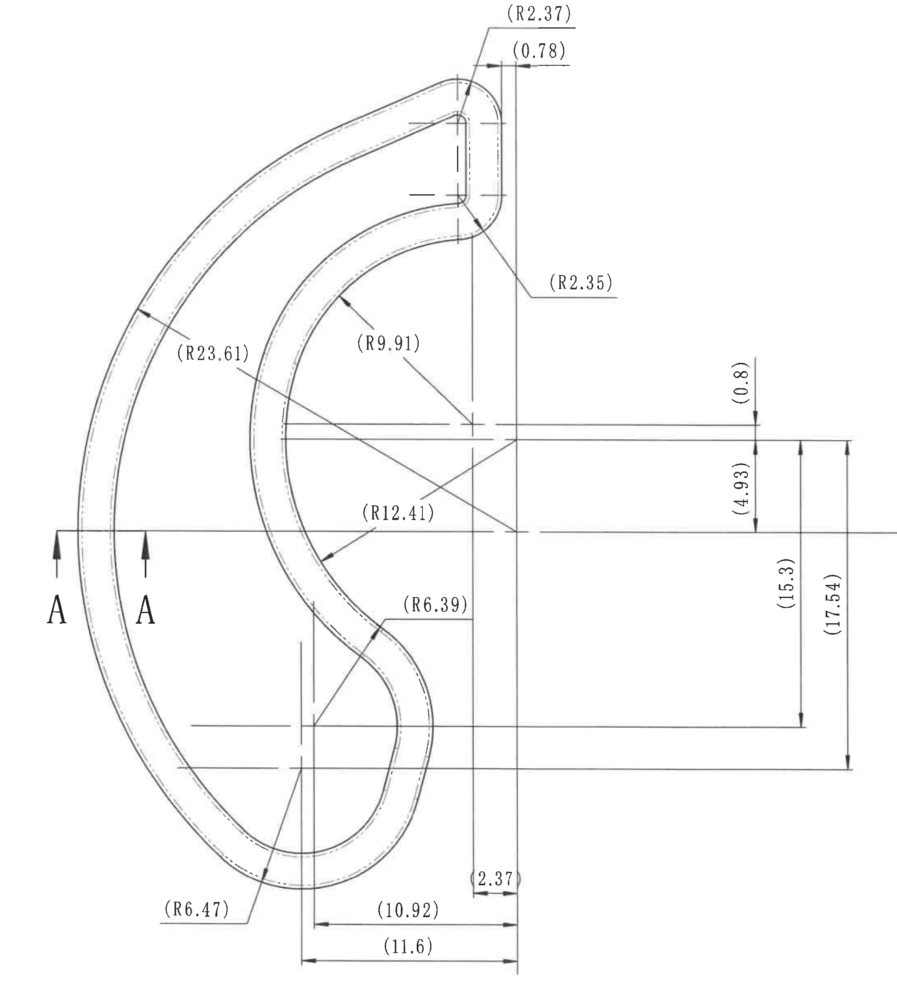
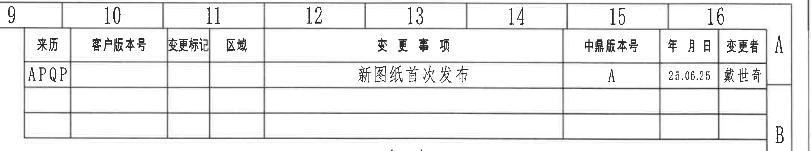
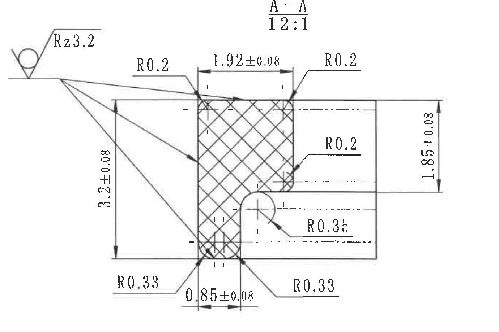
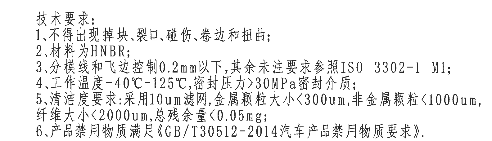
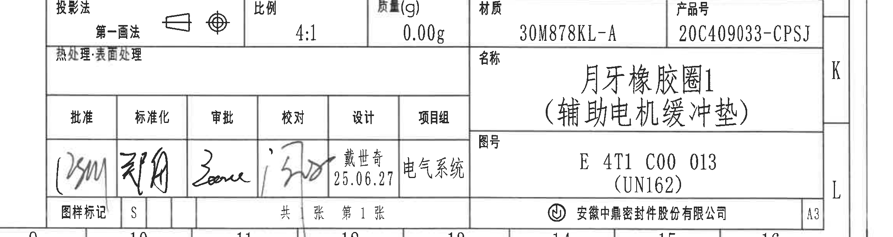
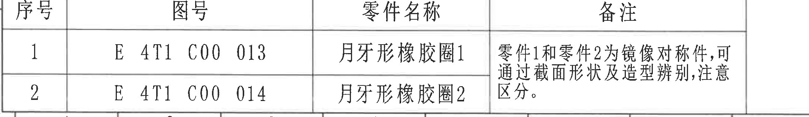

# 20C409033.pdf 内容识别

整页渲染图：`outputs/20C409033_assets/images/page_1.png`  
整页尺寸：4959 x 3505 px，bbox `[0, 0, 4959, 3505]`

## 原图结构

| 区域 | 裁切对象 | 原图位置/视图名称 | bbox |
|---|---|---|---|
| 左侧主体 | object_1 | 主视图 / 月牙形橡胶圈1外形视图，含 A-A 剖切位置 | `[470, 185, 2670, 2635]` |
| 右上 | object_3 | 修订履历表 | `[2700, 90, 4890, 500]` |
| 右上中部 | object_2 | A-A 剖面视图，比例 12:1 | `[3000, 500, 4380, 1420]` |
| 右下中部 | object_4 | 技术要求 / NOTES | `[2660, 2270, 4245, 2725]` |
| 右下 | object_5 | 标题栏 / 签审栏 | `[2650, 2755, 4959, 3370]` |
| 左下 | object_6 | 零件清单 / 备注表 | `[370, 3038, 2530, 3353]` |

## object_1：主视图 / 月牙形橡胶圈1外形视图

原图位置/视图名称：第 1 页左侧主体外形视图，含 A-A 剖切箭头和主视图全部外形、中心线、尺寸线。

| 提取项 | 原图数值或文本 | 含义说明 |
|---|---|---|
| 视图类型 | 主视图 / 外形视图 | 表示月牙形橡胶圈1的平面外形和各弧段位置。 |
| 剖切标识 | A、A | 两个 A 标识和箭头定义 A-A 剖面位置，剖面实体内容归属 object_2，不归入主视图尺寸解读。 |
| 上端外圆角半径 | `(R2.37)` | 括号内参考半径，指向上端外侧圆角；参考尺寸用于说明外形构造关系。 |
| 上端水平参考距离 | `(0.78)` | 括号内参考线性尺寸，位于上端右侧两个竖向参考线之间。 |
| 上端内侧圆角半径 | `(R2.35)` | 括号内参考半径，指向上端内侧过渡圆角。 |
| 左侧外弧半径 | `(R23.61)` | 括号内参考半径，指向左侧大外弧。 |
| 上部内弧半径 | `(R9.91)` | 括号内参考半径，指向内侧上部弧段。 |
| 中部内弧半径 | `(R12.41)` | 括号内参考半径，指向内侧中部大弧段。 |
| 下部内凹弧半径 | `(R6.39)` | 括号内参考半径，指向下部内凹过渡弧。 |
| 下端外圆角半径 | `(R6.47)` | 括号内参考半径，指向下端外侧圆角。 |
| 右侧小水平距离 | `2.37` | 非括号线性尺寸，位于底部右侧两个竖向尺寸界线之间。 |
| 底部内侧水平参考距离 | `(10.92)` | 括号内参考线性尺寸，位于底部内侧竖线至右侧基准竖线之间。 |
| 底部总水平参考距离 | `(11.6)` | 括号内参考线性尺寸，表示底部更外侧的总水平距离。 |
| 右侧上部竖向参考距离 | `(0.8)` | 括号内参考竖向尺寸，位于右侧上部相邻水平中心线/轮廓线之间。 |
| 右侧中部竖向参考距离 | `(4.93)` | 括号内参考竖向尺寸，位于右侧中部两条水平参考线之间。 |
| 右侧高度参考距离 | `(15.3)` | 括号内参考竖向尺寸，表示中下部高度关系。 |
| 右侧总高度参考距离 | `(17.54)` | 括号内参考竖向总高度，位于右侧最外两条水平界线之间。 |
| 直径符号 | 原图未见 | 主视图未出现 `Φ` 或直径类标注。 |
| 角度 / 弧向尺寸 | 原图未见 | 主视图未出现角度值或弧长标注；弧形信息以 R 半径标注表达。 |
| 星号关键尺寸 / T 编号 / 公差 | 原图未见 | 主视图可见尺寸均未带星号、T 编号或显式正负公差；括号尺寸为参考尺寸。 |

边界归属说明：裁切区域只覆盖左侧主视图及其右侧尺寸线。A-A 的剖面图本体在右上 object_2 中；右下技术要求和标题栏不在本对象内。右侧 `(0.8)`、`(4.93)`、`(15.3)`、`(17.54)` 的文字、箭头和尺寸界线完整包含，因此归属主视图。

## object_3：修订履历表

原图位置/视图名称：第 1 页右上方修订履历表。

原表行列还原：

| 来历 | 客户版本号 | 变更标记 | 区域 | 变更事项 | 中鼎版本号 | 年月日 | 变更者 |
|---|---|---|---|---|---|---|---|
| APQP |  |  |  | 新图纸首次发布 | A | 25.06.25 | 戴世奇 |
|  |  |  |  |  |  |  |  |
|  |  |  |  |  |  |  |  |

| 提取项 | 原图数值或文本 | 含义说明 |
|---|---|---|
| 表格类型 | 修订履历表 | 记录图纸版本变更来源、版本号、日期和变更者。 |
| 来历 | `APQP` | 该版本来源/过程标识。 |
| 变更事项 | `新图纸首次发布` | 当前记录为新图纸首次发布。 |
| 中鼎版本号 | `A` | 当前中鼎内部版本号为 A。 |
| 年月日 | `25.06.25` | 修订日期，按原图格式还原。 |
| 变更者 | `戴世奇` | 变更人员。 |
| 空白预留行 | 原表下方 2 行为空 | 原图保留空白修订记录行。 |

边界归属说明：裁切完整包含修订履历表行列和右侧表格边线；右边可见的图框坐标字母 A/B 属于图框坐标，不作为修订表字段提取。

## object_2：A-A 剖面视图

原图位置/视图名称：第 1 页右上中部，A-A 剖面视图，标题标注 `A - A`，比例 `12:1`。

| 提取项 | 原图数值或文本 | 含义说明 |
|---|---|---|
| 视图标题 | `A - A` | 对应主视图中的 A-A 剖切位置。 |
| 剖面比例 | `12:1` | A-A 剖面放大比例。 |
| 表面粗糙度 | `Rz3.2` | 左上表面粗糙度标注，箭头/引线指向剖面相关表面。 |
| 上左圆角 | `R0.2` | 剖面上端左侧圆角半径。 |
| 上端宽度 | `1.92±0.08` | 剖面上端横向宽度，带双向公差 ±0.08。 |
| 上右圆角 | `R0.2` | 剖面上端右侧圆角半径。 |
| 左侧高度 | `3.2±0.08` | 剖面左侧竖向高度，带双向公差 ±0.08。 |
| 右侧高度 | `1.85±0.08` | 剖面右侧竖向高度，带双向公差 ±0.08。 |
| 右侧中部圆角 | `R0.2` | 剖面右侧台阶/过渡处圆角半径。 |
| 内凹圆角 | `R0.35` | 剖面内侧凹槽过渡圆角半径。 |
| 底部宽度 | `0.85±0.08` | 剖面底部局部横向宽度，带双向公差 ±0.08。 |
| 底部左圆角 | `R0.33` | 剖面底部左侧圆角半径。 |
| 底部右圆角 | `R0.33` | 剖面底部右侧圆角半径。 |
| 剖面线 | 交叉剖面线 | 表示 A-A 剖切到的实体橡胶材料区域。 |
| 直径符号 | 原图未见 | A-A 剖面未出现 `Φ` 或直径类标注。 |
| 角度 / 弧向尺寸 | 原图未见 | A-A 剖面未出现角度值或弧长标注；圆角以 R 半径标注表达。 |
| 星号关键尺寸 / T 编号 | 原图未见 | A-A 剖面未见星号关键尺寸或 T 编号。 |

边界归属说明：裁切包含 A-A 标题、比例、粗糙度符号、剖面主体和全部尺寸线/箭头/文字。左侧主视图的 A-A 剖切标识不归入本对象；本对象只提取 A-A 剖面本体及其尺寸。

## object_4：技术要求 / NOTES

原图位置/视图名称：第 1 页右下中部，标题栏上方技术要求文本区。

| 提取项 | 原图数值或文本 | 含义说明 |
|---|---|---|
| 标题 | `技术要求:` | 技术要求区域标题。 |
| 1 | `不得出现掉块、裂口、碰伤、卷边和扭曲;` | 外观缺陷控制要求。 |
| 2 | `材料为HNBR;` | 材料要求为 HNBR。 |
| 3 | `分模线和飞边控制0.2mm以下,其余未注要求参照ISO 3302-1 M1;` | 分模线/飞边最大控制值为 0.2 mm，其余未注尺寸按 ISO 3302-1 M1。 |
| 4 | `工作温度-40°C-125°C,密封压力>30MPa密封介质;` | 工作温度范围和密封压力要求。 |
| 5 | `清洁度要求:采用10um滤网,金属颗粒大小<300um,非金属颗粒<1000um,纤维大小<2000um,总残余量<0.05mg;` | 清洁度、颗粒尺寸和残余量限制。 |
| 6 | `产品禁用物质满足《GB/T30512-2014汽车产品禁用物质要求》。` | 禁用物质合规要求。 |

边界归属说明：裁切仅包含技术要求 1 至 6 条及标题，未包含下方标题栏字段。文字行首、行尾和标点完整可见。

## object_5：标题栏 / 签审栏

原图位置/视图名称：第 1 页右下角标题栏、签审栏和基本属性栏。

原表字段还原：

| 字段 | 原图数值或文本 |
|---|---|
| 投影法 | 第一画法，含投影法图示符号 |
| 比例 | 4:1 |
| 质量(g) | 0.00g |
| 材质 | 30M878KL-A |
| 产品号 | 20C409033-CPSJ |
| 热处理:表面处理 | 空白 |
| 名称 | 月牙橡胶圈1（辅助电机缓冲垫） |
| 图号 | E 4T1 C00 013（UN162） |
| 批准 | 手写签名，扫描件中不可稳定辨认为印刷文字 |
| 标准化 | 手写签名，扫描件中不可稳定辨认为印刷文字 |
| 审批 | 手写签名，扫描件中不可稳定辨认为印刷文字 |
| 校对 | 手写签名，扫描件中不可稳定辨认为印刷文字 |
| 设计 | 戴世奇 25.06.27 |
| 项目组 | 电气系统 |
| 图样标记 | S |
| 张数 | 共 [空] 张，第 1 张 |
| 公司 | 安徽中鼎密封件股份有限公司 |
| 幅面 | A3 |

| 提取项 | 原图数值或文本 | 含义说明 |
|---|---|---|
| 产品名称 | `月牙橡胶圈1（辅助电机缓冲垫）` | 图纸标题/零件名称。 |
| 图号 | `E 4T1 C00 013（UN162）` | 本图纸对应零件图号及括号内代码。 |
| 产品号 | `20C409033-CPSJ` | 产品编号。 |
| 材质 | `30M878KL-A` | 材料牌号/材料规格字段。 |
| 比例 | `4:1` | 图纸比例字段；A-A 剖面另有单独比例 12:1。 |
| 质量 | `0.00g` | 标题栏质量字段。 |
| 设计 | `戴世奇 25.06.27` | 设计人员与日期。 |
| 项目组 | `电气系统` | 项目组字段。 |
| 图样标记 | `S` | 图样标记字段。 |

边界归属说明：裁切保留标题栏完整表格边线、名称、图号、产品号、公司名和 A3 幅面格。右侧 K/L 与底部坐标数字属于图框坐标，不作为标题栏字段；上方技术要求归属 object_4。

## object_6：零件清单 / 备注表

原图位置/视图名称：第 1 页左下角零件清单与备注表。

原表行列还原：

| 序号 | 图号 | 零件名称 | 备注 |
|---|---|---|---|
| 1 | E 4T1 C00 013 | 月牙形橡胶圈1 | 零件1和零件2为镜像对称件,可通过截面形状及造型辨别,注意区分。 |
| 2 | E 4T1 C00 014 | 月牙形橡胶圈2 | 同一合并备注单元格延续，原图本行未新增文字。 |

| 提取项 | 原图数值或文本 | 含义说明 |
|---|---|---|
| 表格类型 | 零件清单 / 备注表 | 列出镜像对称的两个零件及识别备注。 |
| 序号 1 图号 | `E 4T1 C00 013` | 月牙形橡胶圈1的图号，与标题栏图号一致。 |
| 序号 1 零件名称 | `月牙形橡胶圈1` | 当前图纸对应零件。 |
| 序号 2 图号 | `E 4T1 C00 014` | 月牙形橡胶圈2的图号。 |
| 序号 2 零件名称 | `月牙形橡胶圈2` | 与零件1为镜像对称件。 |
| 备注 | `零件1和零件2为镜像对称件,可通过截面形状及造型辨别,注意区分。` | 备注单元格跨两行，说明两个零件需按截面形状和造型区分。 |

边界归属说明：裁切完整包含表头、两条零件记录、备注文字和表格边线。底部图框坐标已尽量排除；若局部边线与图框接近，提取内容只归属零件清单表。

## 裁切检查记录

| 图片 | bbox | 检查结果 | 归属检查 |
|---|---|---|---|
| page_1.png | `[0, 0, 4959, 3505]` | 整页 PNG 完整，含图框、主视图、剖面、表格、技术要求、标题栏。 | 整页基准图，不做局部内容归属。 |
| object_1.png | `[470, 185, 2670, 2635]` | 完整包含主视图外形、A-A 剖切标识、全部尺寸线、箭头和文字；无边缘文字被裁。 | 未混入 A-A 剖面、技术要求或标题栏。 |
| object_2.png | `[3000, 500, 4380, 1420]` | 完整包含 A-A 标题、比例、粗糙度、剖面线、全部尺寸线和文字。 | 未混入主视图尺寸；仅提取 A-A 剖面内容。 |
| object_3.png | `[2700, 90, 4890, 500]` | 修订履历表行列、表头和记录完整。 | 右侧 A/B 为图框坐标，未作为表格字段提取。 |
| object_4.png | `[2660, 2270, 4245, 2725]` | 技术要求标题和 1 至 6 条文字完整，行首行尾未裁断。 | 未混入下方标题栏。 |
| object_5.png | `[2650, 2755, 4959, 3370]` | 标题栏、签审栏、名称、图号、产品号、公司名、A3 栏完整。 | 右侧 K/L 和底部坐标数字为图框坐标，未作为标题栏字段提取。 |
| object_6.png | `[370, 3038, 2530, 3353]` | 零件清单表头、两行记录和合并备注单元格完整。 | 底部图框坐标已排除；内容仅归属零件清单。 |
