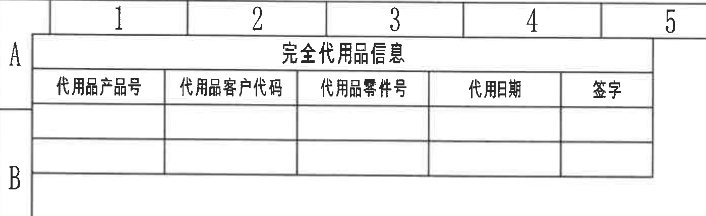
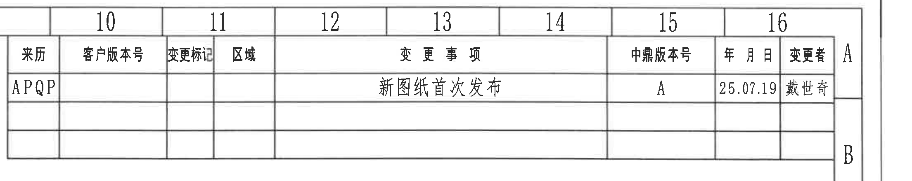
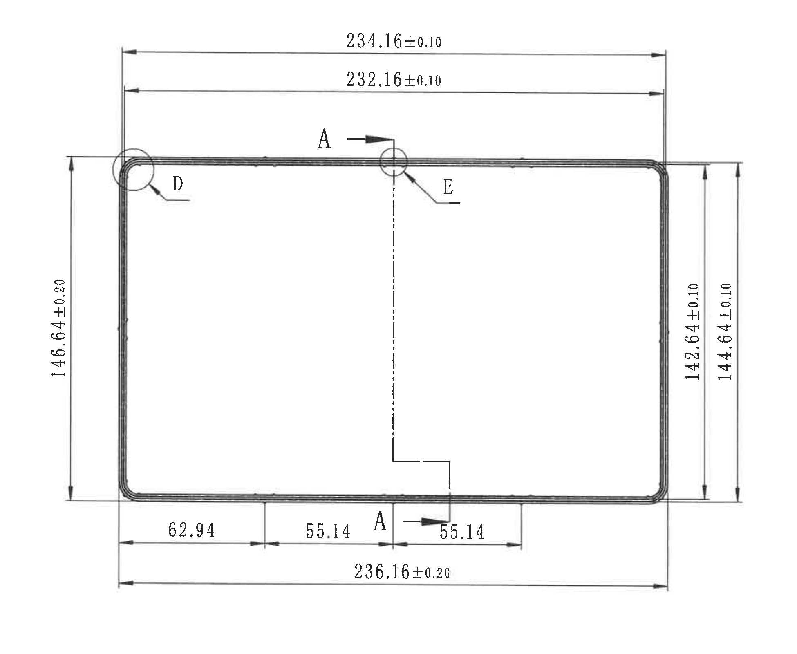
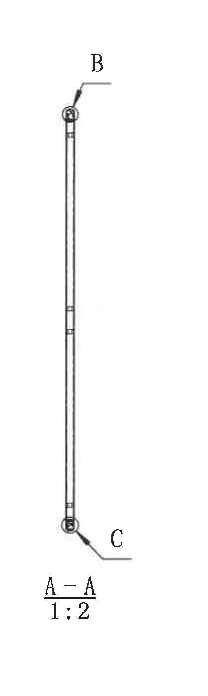
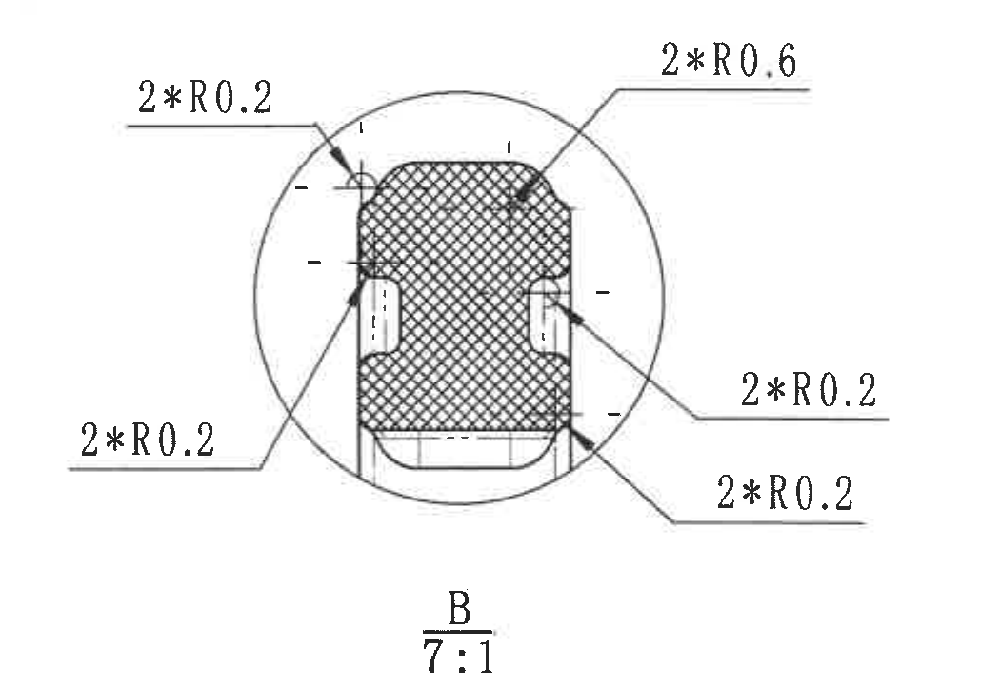
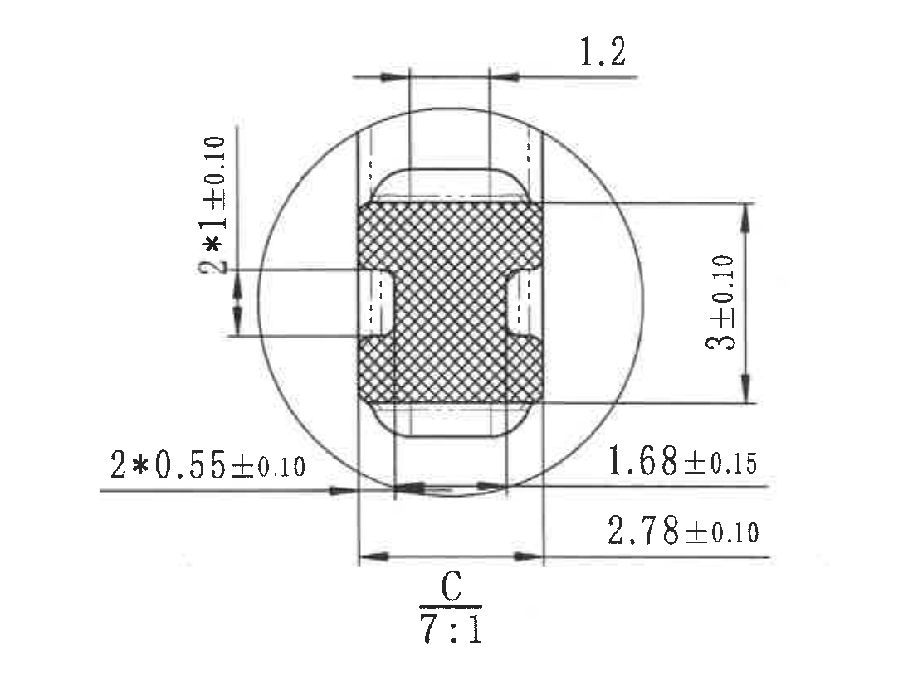
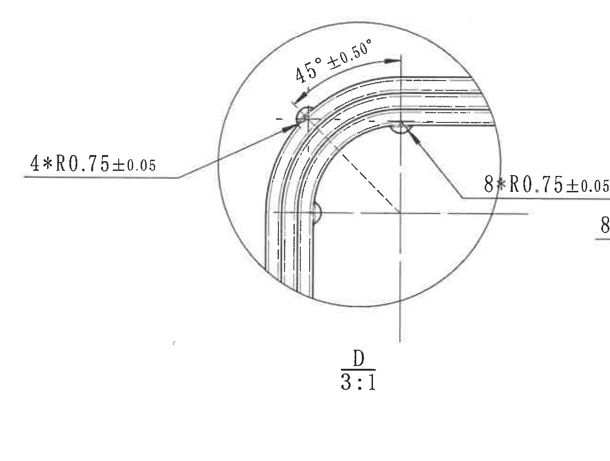
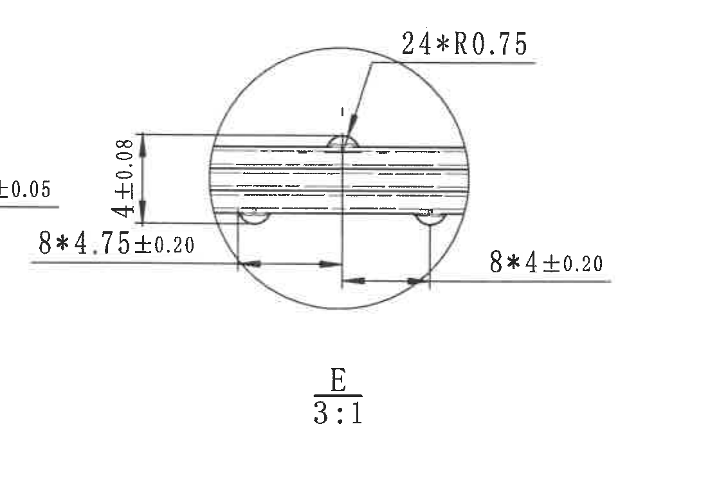
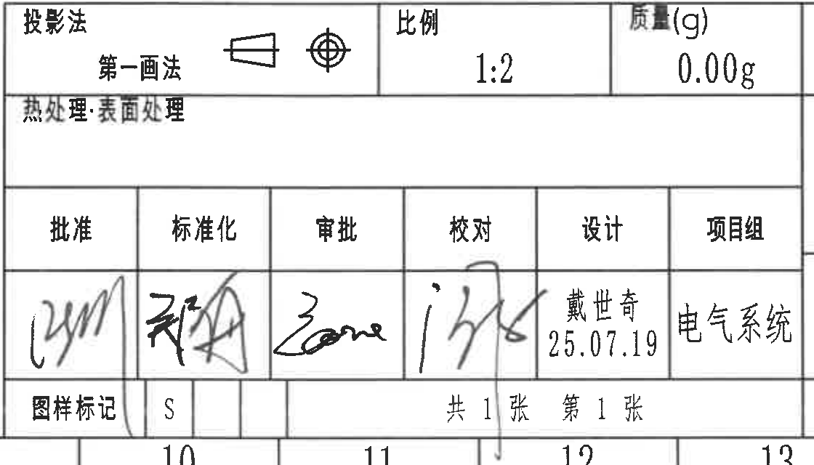
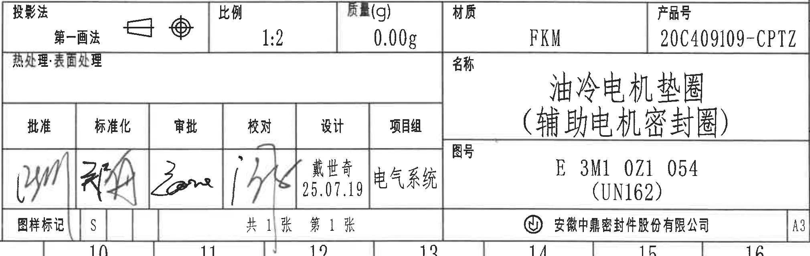

# 20C409109.pdf 内容识别

整页渲染 PNG：`20C409109_assets/images/page_1.png`  
页面：1；像素尺寸：4959 x 3505；坐标基准：左上角为 `[0, 0]`。

## object_7 - 完全代用品信息表

裁切图片：

原图位置/视图名称：第 1 页左上区域，bbox `[315, 80, 1715, 510]`；对象类型：table。

原表还原：

| 代用品产品号 | 代用品客户代码 | 代用品零件号 | 代用日期 | 签字 |
|---|---|---|---|---|
|  |  |  |  |  |
|  |  |  |  |  |

提取表格：

| 提取项 | 原图数值或文本 | 含义说明 |
|---|---|---|
| 表题 | 完全代用品信息 | 用于记录完全代用品相关信息的表格标题。 |
| 表头 | 代用品产品号 / 代用品客户代码 / 代用品零件号 / 代用日期 / 签字 | 原表 5 列字段。 |
| 数据行 | 空白两行 | 原图未填写代用品记录。 |

边界归属说明：裁切区域包含完整表题、表头、空白数据行和外框；上边缘带入图框坐标数字 1-5，属于图纸坐标栏，不作为代用品表字段提取。

## object_8 - 变更履历表

裁切图片：

原图位置/视图名称：第 1 页右上区域，bbox `[2750, 75, 4959, 515]`；对象类型：table。

原表还原：

| 来源 | 客户版本号 | 变更标记 | 区域 | 变更事项 | 中鼎版本号 | 年 月 日 | 变更者 |
|---|---|---|---|---|---|---|---|
| APQP |  |  |  | 新图纸首次发布 | A | 25.07.19 | 戴世奇 |
|  |  |  |  |  |  |  |  |
|  |  |  |  |  |  |  |  |

提取表格：

| 提取项 | 原图数值或文本 | 含义说明 |
|---|---|---|
| 来源 | APQP | 变更来源/流程来源。 |
| 变更事项 | 新图纸首次发布 | 本次修订为新图纸首次发布。 |
| 中鼎版本号 | A | 内部版本号为 A。 |
| 年月日 | 25.07.19 | 变更日期。 |
| 变更者 | 戴世奇 | 变更记录填写人。 |
| 空白字段 | 客户版本号、变更标记、区域为空 | 原图对应单元格未填写。 |

边界归属说明：裁切包含修订履历表完整外框、表头、首行记录及空白后续行；右侧图框坐标 A/B 随外框进入，不作为表字段提取。

## object_1 - 主视图

裁切图片：

原图位置/视图名称：第 1 页中左主视图，bbox `[690, 520, 2640, 2120]`；对象类型：view。

提取表格：

| 提取项 | 原图数值或文本 | 含义说明 |
|---|---|---|
| 上方外侧水平尺寸 | 234.16±0.10 | 主视图上方较外侧的总体水平尺寸，公差为 ±0.10。 |
| 上方内侧水平尺寸 | 232.16±0.10 | 主视图上方较内侧的水平尺寸，公差为 ±0.10。 |
| 左侧垂直尺寸 | 146.64±0.20 | 主视图左侧整体高度尺寸，公差为 ±0.20。 |
| 右侧内垂直尺寸 | 142.64±0.10 | 主视图右侧内侧高度尺寸，公差为 ±0.10。 |
| 右侧外垂直尺寸 | 144.64±0.10 | 主视图右侧外侧高度尺寸，公差为 ±0.10。 |
| 下方分段尺寸 1 | 62.94 | 底部左侧分段距离，无单独公差标注。 |
| 下方分段尺寸 2 | 55.14 | 底部中间分段距离，无单独公差标注。 |
| 下方分段尺寸 3 | 55.14 | 底部右侧分段距离，无单独公差标注。 |
| 下方总体水平尺寸 | 236.16±0.20 | 主视图下方总体水平尺寸，公差为 ±0.20。 |
| 剖切标识 | A-A | 主视图中部虚线及箭头标出 A-A 剖切位置和方向。 |
| 局部视图索引 | D | 左上圆圈和引线指向 D 局部视图位置。 |
| 局部视图索引 | E | 上边中部圆圈和引线指向 E 局部视图位置。 |
| 参考尺寸/T 编号 | 未见括号参考尺寸；未见 T 编号 | 当前主视图未出现括号内参考尺寸和 T 编号。 |

边界归属说明：裁切完整包含主视图本体、全部可见主视图尺寸线、箭头和文字。D、E 为主视图上的局部索引标记；D/E 的放大尺寸不归入主视图。

## object_2 - A-A 剖面视图

裁切图片：

原图位置/视图名称：第 1 页中部偏右，bbox `[2620, 690, 3040, 2090]`；对象类型：section。

提取表格：

| 提取项 | 原图数值或文本 | 含义说明 |
|---|---|---|
| 剖面名称 | A-A | 与主视图中的 A-A 剖切标识对应。 |
| 比例 | 1:2 | A-A 剖面视图比例。 |
| 上端局部索引 | B | A-A 剖面上端圆圈和引线指向 B 局部放大视图。 |
| 下端局部索引 | C | A-A 剖面下端圆圈和引线指向 C 局部放大视图。 |
| 尺寸/T 编号 | 未见直接尺寸；未见 T 编号 | 当前剖面只给出剖面轮廓和 B/C 局部索引，数值尺寸在 B/C 局部视图中标注。 |

边界归属说明：裁切完整包含剖面轮廓、B/C 局部索引和 `A-A 1:2` 视图名；B/C 的尺寸标注不在本裁切内，不归入 A-A 剖面。

## object_3 - B 局部视图

裁切图片：

原图位置/视图名称：第 1 页右上局部视图 B，bbox `[3320, 690, 4370, 1410]`；对象类型：detail。

提取表格：

| 提取项 | 原图数值或文本 | 含义说明 |
|---|---|---|
| 局部视图名称 | B | A-A 剖面上端索引对应的放大局部。 |
| 比例 | 7:1 | B 局部放大比例。 |
| 圆角标注 | 2*R0.6 | 上右侧位置，两处 R0.6 圆角/弧度。 |
| 圆角标注 | 2*R0.2 | 上左侧位置，两处 R0.2 圆角/弧度。 |
| 圆角标注 | 2*R0.2 | 左下侧位置，两处 R0.2 圆角/弧度。 |
| 圆角标注 | 2*R0.2 | 右中侧位置，两处 R0.2 圆角/弧度。 |
| 圆角标注 | 2*R0.2 | 右下侧位置，两处 R0.2 圆角/弧度。 |
| 参考尺寸/T 编号 | 未见括号参考尺寸；未见 T 编号 | 当前局部视图未出现括号内参考尺寸和 T 编号。 |

边界归属说明：裁切完整包含 B 局部圆形边界、剖面填充、所有 R 标注引线和文字；未带入 C 局部视图尺寸。

## object_4 - C 局部视图

裁切图片：

原图位置/视图名称：第 1 页右中局部视图 C，bbox `[3270, 1430, 4370, 2250]`；对象类型：detail。

提取表格：

| 提取项 | 原图数值或文本 | 含义说明 |
|---|---|---|
| 局部视图名称 | C | A-A 剖面下端索引对应的放大局部。 |
| 比例 | 7:1 | C 局部放大比例。 |
| 上方水平尺寸 | 1.2 | 顶部局部开口/特征宽度。 |
| 左侧垂直数量尺寸 | 2*1±0.10 | 两处 1 尺寸，公差 ±0.10。 |
| 右侧垂直尺寸 | 3±0.10 | 右侧局部高度/距离，公差 ±0.10。 |
| 下方左侧数量尺寸 | 2*0.55±0.10 | 两处 0.55 尺寸，公差 ±0.10。 |
| 下方中间尺寸 | 1.68±0.15 | 底部中间局部距离，公差 ±0.15。 |
| 下方总体尺寸 | 2.78±0.10 | 底部较大横向总宽度，公差 ±0.10。 |
| 参考尺寸/T 编号 | 未见括号参考尺寸；未见 T 编号 | 当前局部视图未出现括号内参考尺寸和 T 编号。 |

边界归属说明：裁切完整包含 C 局部圆形边界、剖面填充、全部尺寸线和文字；不包含 B 局部视图内容。

## object_5 - D 局部视图

裁切图片：

原图位置/视图名称：第 1 页左下局部视图 D，bbox `[420, 2255, 1730, 3245]`；对象类型：detail。

提取表格：

| 提取项 | 原图数值或文本 | 含义说明 |
|---|---|---|
| 局部视图名称 | D | 主视图左上角索引对应的放大局部。 |
| 比例 | 3:1 | D 局部放大比例。 |
| 角度尺寸 | 45°±0.50° | 拐角处圆弧/转角的角度尺寸，角度公差 ±0.50°。 |
| 圆角标注 | 4*R0.75±0.05 | 四处 R0.75 圆角/弧度，公差 ±0.05。 |
| 圆角标注 | 8*R0.75±0.05 | 八处 R0.75 圆角/弧度，公差 ±0.05。 |
| 参考尺寸/T 编号 | 未见括号参考尺寸；未见 T 编号 | 当前局部视图未出现括号内参考尺寸和 T 编号。 |

边界归属说明：裁切完整包含 D 局部圆形边界、角度尺寸、左右 R 标注引线和文字。右下边缘可见 E 局部尺寸的少量文字片段，因其尺寸线和箭头不指向 D 局部，未归入 D 的提取项。

## object_6 - E 局部视图

裁切图片：

原图位置/视图名称：第 1 页下中局部视图 E，bbox `[1650, 2360, 2740, 3140]`；对象类型：detail。

提取表格：

| 提取项 | 原图数值或文本 | 含义说明 |
|---|---|---|
| 局部视图名称 | E | 主视图上边中部索引对应的放大局部。 |
| 比例 | 3:1 | E 局部放大比例。 |
| 圆角/弧度标注 | 24*R0.75 | 二十四处 R0.75 圆角/弧度，原图未在该标注后给出单独公差。 |
| 左侧垂直尺寸 | 4±0.08 | 左侧竖向尺寸，公差 ±0.08。 |
| 下方左侧数量尺寸 | 8*4.75±0.20 | 八处 4.75 尺寸，公差 ±0.20。 |
| 下方右侧数量尺寸 | 8*4±0.20 | 八处 4 尺寸，公差 ±0.20。 |
| 参考尺寸/T 编号 | 未见括号参考尺寸；未见 T 编号 | 当前局部视图未出现括号内参考尺寸和 T 编号。 |

边界归属说明：裁切完整包含 E 局部圆形边界、全部 E 尺寸线、箭头和文字。左边缘可见 D 局部 R 标注的少量尾部片段，因其引线不指向 E 局部，未归入 E 的提取项。

## object_9 - 技术/备注与签核区

裁切图片：

原图位置/视图名称：第 1 页右下左侧技术信息与签核区域，bbox `[2760, 2740, 3880, 3380]`；对象类型：notes。

提取表格：

| 提取项 | 原图数值或文本 | 含义说明 |
|---|---|---|
| 投影法 | 第一角法 | 图纸投影方法。 |
| 比例 | 1:2 | 图纸主比例。 |
| 质量(g) | 0.00g | 零件质量字段。 |
| 热处理 表面处理 | 空白 | 原图该栏未填写具体要求。 |
| 批准 | 手写签名 | 批准栏签名。 |
| 标准化 | 手写签名 | 标准化栏签名。 |
| 审批 | 手写签名 | 审批栏签名。 |
| 校对 | 手写签名 | 校对栏签名。 |
| 设计 | 戴世奇 / 25.07.19 | 设计人员及日期。 |
| 项目组 | 电气系统 | 所属项目组。 |
| 图样标记 | S | 图样标记字段。 |
| 页数 | 共 1 张 / 第 1 张 | 图纸总张数和当前张号。 |

边界归属说明：裁切区域包含技术信息和签核表完整字段。右侧产品号、名称、图号等属于标题栏右半部分，归入 object_10。

## object_10 - 标题栏

裁切图片：

原图位置/视图名称：第 1 页右下标题栏，bbox `[2760, 2740, 4780, 3380]`；对象类型：title_block。

提取表格：

| 提取项 | 原图数值或文本 | 含义说明 |
|---|---|---|
| 投影法 | 第一角法 | 标题栏中的投影法字段。 |
| 比例 | 1:2 | 图纸比例字段。 |
| 质量(g) | 0.00g | 标题栏质量字段。 |
| 材质 | FKM | 零件材质。 |
| 产品号 | 20C409109-CPTZ | 产品编号。 |
| 名称 | 油冷电机垫圈（辅助电机密封圈） | 零件名称。 |
| 图号 | E 3M1 0Z1 054 | 图纸编号主文本。 |
| 图号补充 | (UN162) | 图号下方括号文本；括号为原图文本，不是尺寸参考值。 |
| 设计 | 戴世奇 / 25.07.19 | 设计人员和日期。 |
| 项目组 | 电气系统 | 所属项目组。 |
| 图样标记 | S | 图样标记。 |
| 页数 | 共 1 张 / 第 1 张 | 图纸页数信息。 |
| 公司 | 安徽中鼎密封件股份有限公司 | 标题栏底部公司名称。 |
| 图幅 | A3 | 右下角图幅。 |

边界归属说明：裁切完整包含标题栏左侧签核格和右侧产品信息。其左半部分与 object_9 有重叠，object_10 按标题栏整体提取，object_9 仅作为技术/签核区提取。

## 裁切检查记录

| 对象 | 图片路径 | 检查结论 |
|---|---|---|
| page_1 | outputs/20C409109_assets/images/page_1.png | 整页 PNG 已渲染，尺寸 4959 x 3505。 |
| object_1 | outputs/20C409109_assets/images/object_1.png | 完整包含主视图本体、全部可见尺寸线、箭头和文字；未混入右侧 A-A 剖面。 |
| object_2 | outputs/20C409109_assets/images/object_2.png | 完整包含 A-A 剖面轮廓、B/C 索引和比例文字；无边缘文字裁断。 |
| object_3 | outputs/20C409109_assets/images/object_3.png | 完整包含 B 局部圆形边界、剖面填充和全部 R 标注；未混入 C 局部。 |
| object_4 | outputs/20C409109_assets/images/object_4.png | 完整包含 C 局部圆形边界、所有尺寸线、箭头和文字。 |
| object_5 | outputs/20C409109_assets/images/object_5.png | D 局部尺寸线和文字完整；右下边缘有 E 局部尺寸碎片，已在归属说明中排除。 |
| object_6 | outputs/20C409109_assets/images/object_6.png | E 局部尺寸线和文字完整；左边缘有 D 局部 R 标注尾部碎片，已在归属说明中排除。 |
| object_7 | outputs/20C409109_assets/images/object_7.png | 完整包含完全代用品信息表表题、表头、空白行和外框。 |
| object_8 | outputs/20C409109_assets/images/object_8.png | 完整包含变更履历表表头、首行记录、空白行和外框。 |
| object_9 | outputs/20C409109_assets/images/object_9.png | 完整包含技术信息、热处理/表面处理栏和签核字段；右侧标题栏产品信息另由 object_10 提取。 |
| object_10 | outputs/20C409109_assets/images/object_10.png | 完整包含标题栏签核区、材质、产品号、名称、图号、公司和图幅信息。 |
