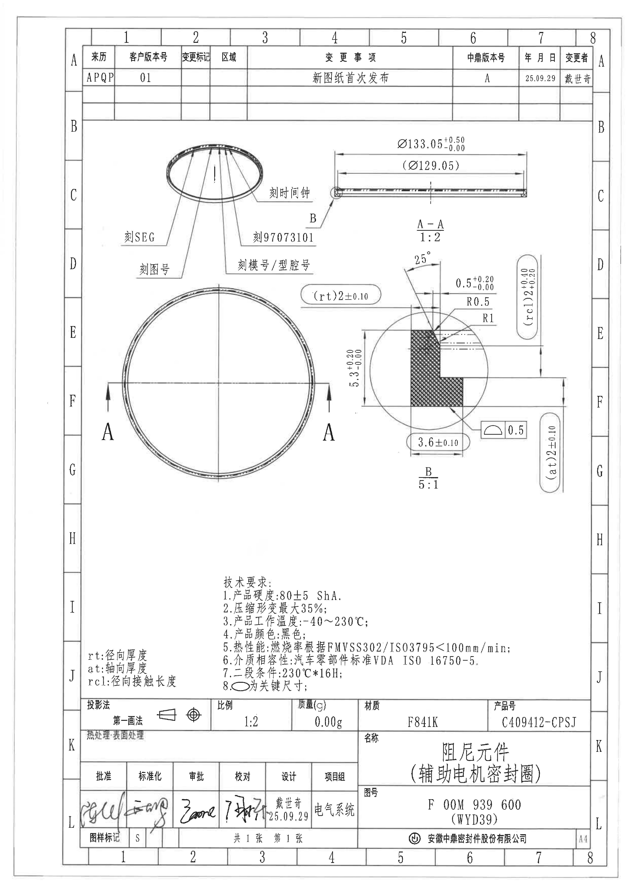
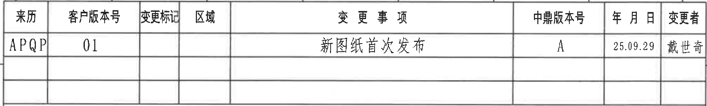
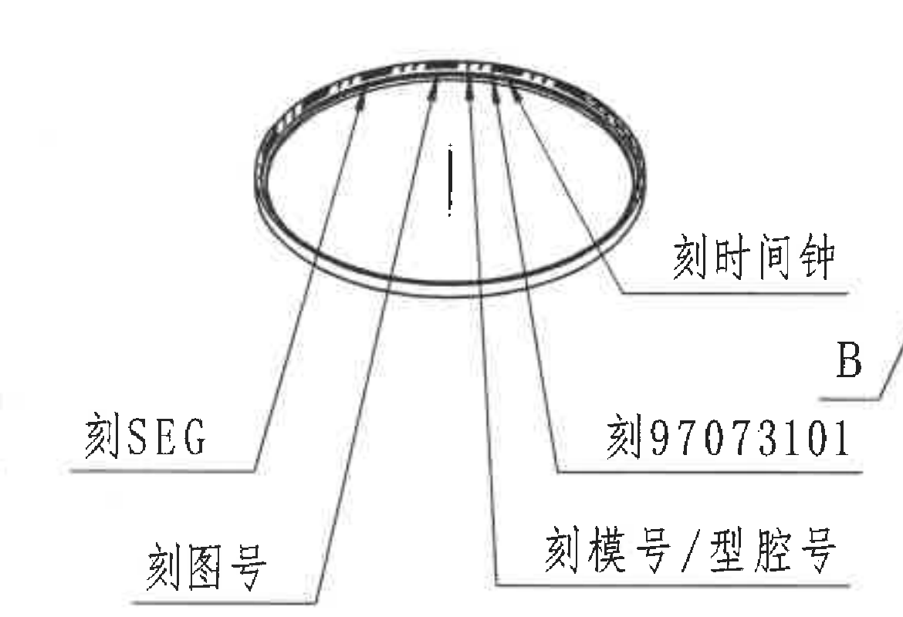
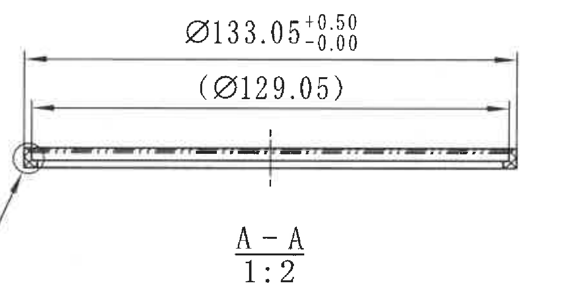
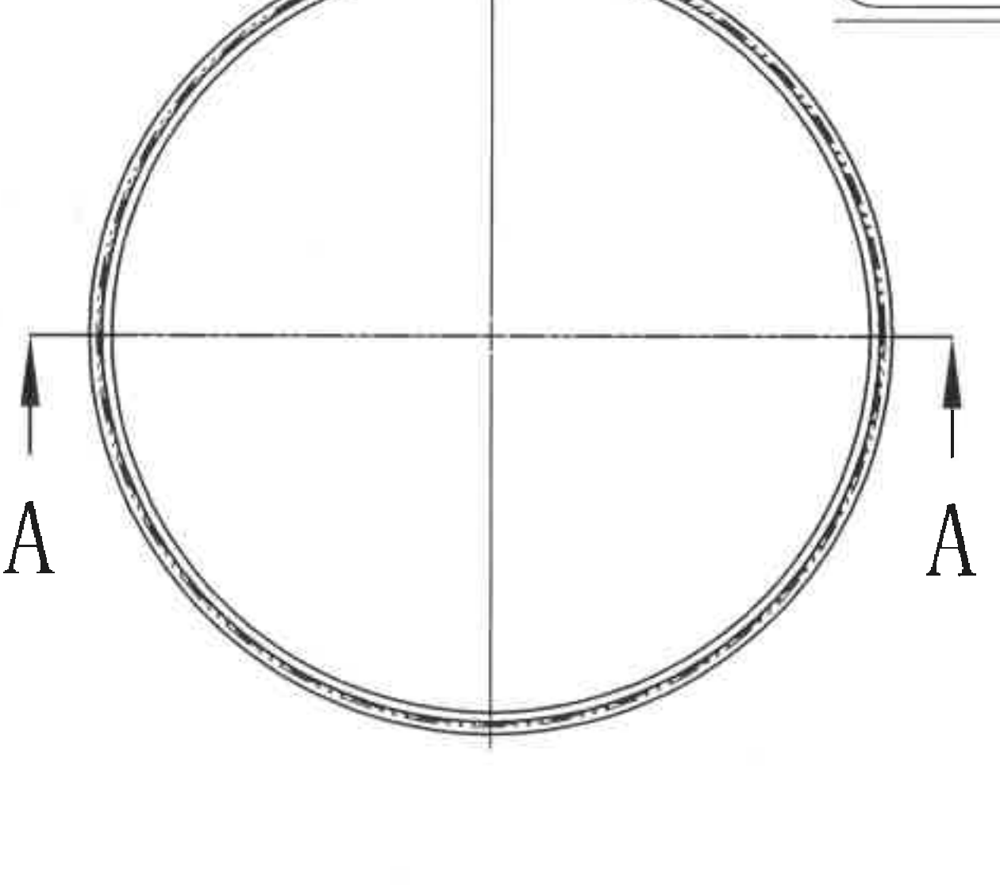
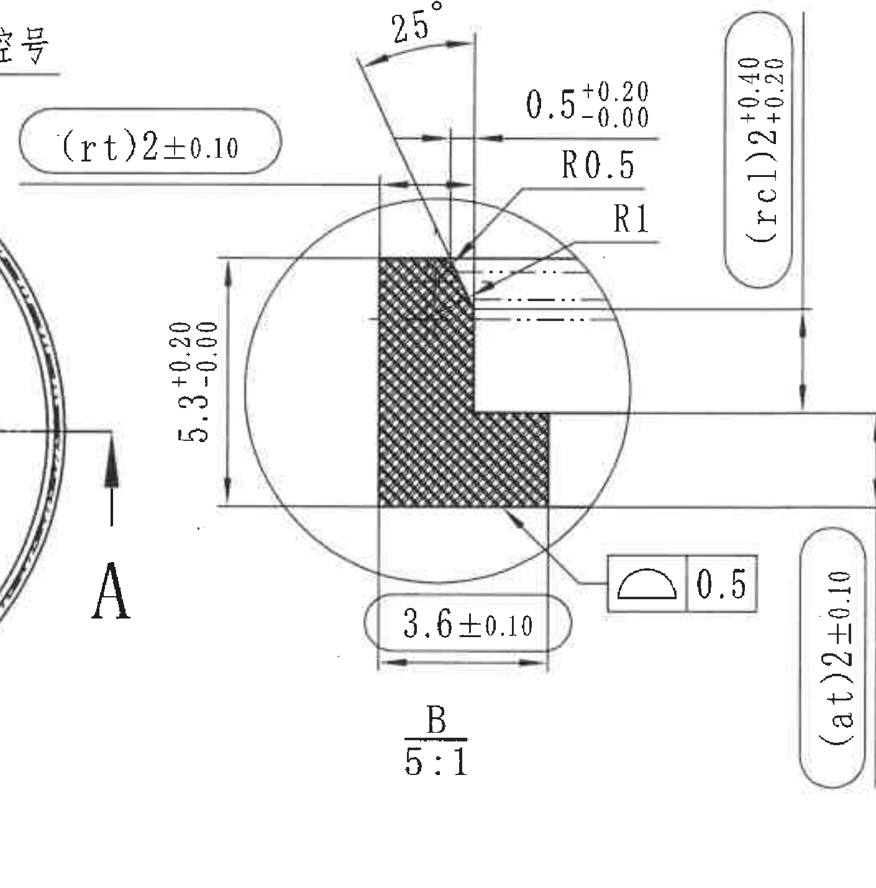
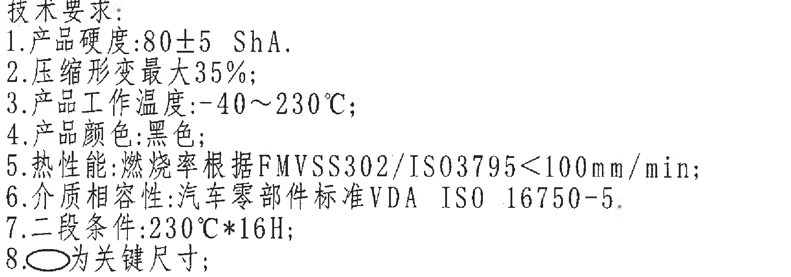
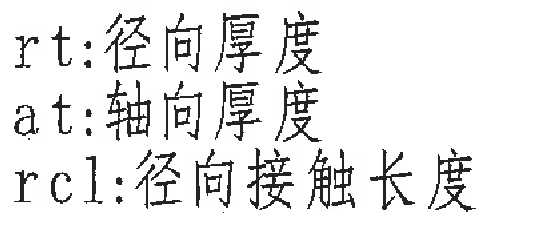
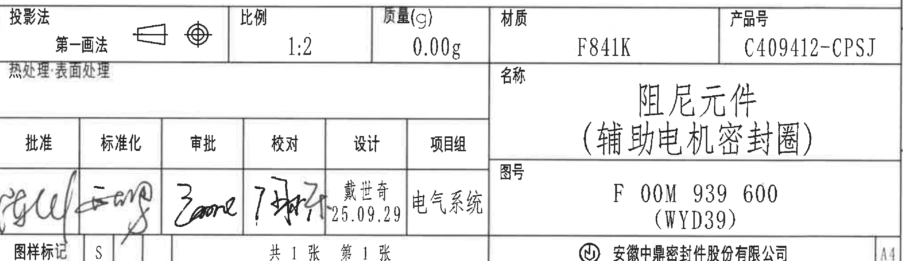

# 20C409412.pdf 内容识别结果

整页渲染图：`outputs/20C409412_assets/images/page_1.png`  
坐标体系：像素坐标 `[x0, y0, x1, y1]`，原点在整页 PNG 左上角。整页尺寸 `3306 x 4673 px`。

## object_1 - 修订履历表

| 项目 | 内容 |
|---|---|
| 原图位置/视图名称 | 页 1 顶部修订履历表，bbox `[420, 235, 3120, 640]` |
| object_kind | table |

原表结构还原：

| 来历 | 客户版本号 | 变更标记 | 区域 | 变更事项 | 中鼎版本号 | 年 月 日 | 变更者 |
|---|---|---|---|---|---|---|---|
| APQP | 01 |  |  | 新图纸首次发布 | A | 25.09.29 | 戴世奇 |
|  |  |  |  |  |  |  |  |
|  |  |  |  |  |  |  |  |

提取表格：

| 提取项 | 原图数值或文本 | 含义说明 |
|---|---|---|
| 来历 | APQP | 变更来源/阶段。 |
| 客户版本号 | 01 | 客户版本号。 |
| 变更标记 | 空白 | 原表该格未填写。 |
| 区域 | 空白 | 原表该格未填写。 |
| 变更事项 | 新图纸首次发布 | 本次变更说明。 |
| 中鼎版本号 | A | 内部版本号。 |
| 年 月 日 | 25.09.29 | 变更日期，按原图格式保留。 |
| 变更者 | 戴世奇 | 变更责任人。 |
| 空白预留行 | 2 行 | 表格下方两行为空白预留行。 |

边界归属说明：裁切保留完整表头、数据行、空白预留行和表格边框；未包含加工视图或标题栏内容。

## object_2 - 刻印/标识视图

| 项目 | 内容 |
|---|---|
| 原图位置/视图名称 | 页 1 上中左侧刻印/标识视图，bbox `[545, 680, 1715, 1480]` |
| object_kind | view |

提取表格：

| 提取项 | 原图数值或文本 | 含义说明 |
|---|---|---|
| 标识视图轮廓 | 环形零件局部外观 | 展示零件圆周上的刻印位置分布。 |
| 刻时间钟 | 刻时间钟 | 指向零件上时间钟刻印区域。 |
| 刻SEG | 刻SEG | 指向 SEG 刻印区域。 |
| 刻图号 | 刻图号 | 指向图号刻印区域。 |
| 刻97073101 | 刻97073101 | 指向数字刻印 `97073101` 的区域。 |
| 刻模号/型腔号 | 刻模号/型腔号 | 指向模号/型腔号刻印区域。 |
| 尺寸/公差 | 未见数字尺寸 | 本视图为刻印位置说明，不含尺寸数值。 |
| 基准字母/T 编号 | 未见 | 本视图未标注基准字母或 T 编号。 |

边界归属说明：为完整保留 `刻97073101`、`刻模号/型腔号` 和右侧引线，右边缘带入相邻 B 局部索引的 `B` 字样；该 `B` 索引不属于本刻印视图，不在本对象中提取为尺寸或视图名称。

## object_3 - A-A 剖面视图

| 项目 | 内容 |
|---|---|
| 原图位置/视图名称 | 页 1 上中右侧 A-A 剖面，bbox `[1710, 690, 2910, 1290]` |
| object_kind | section |

提取表格：

| 提取项 | 原图数值或文本 | 含义说明 |
|---|---|---|
| 剖面名称 | A-A | 由主俯视图中的 A-A 剖切线得到的剖面。 |
| 比例 | 1:2 | A-A 剖面比例。 |
| 外径尺寸 | Ø133.05 +0.50/-0.00 | 外径尺寸，带直径符号和单向正公差。 |
| 参考内径尺寸 | (Ø129.05) | 括号内参考尺寸，表示该直径为参考值，不作为直接控制尺寸。 |
| 中心线 | 竖向中心线 | 剖面中心参考线。 |
| 数量前缀/角度/弧向尺寸 | 未见 | 本剖面未标注数量前缀、角度或弧向尺寸。 |
| 基准字母/T 编号 | A-A；未见 T 编号 | `A-A` 为剖切视图标识，未见 T 编号。 |

边界归属说明：裁切包含两条完整直径尺寸线、箭头、文字和 A-A 标识；左侧边缘可见相邻 B 局部索引引线残段，该残段不作为 A-A 剖面内容提取。

## object_4 - 主俯视图

| 项目 | 内容 |
|---|---|
| 原图位置/视图名称 | 页 1 中左侧主俯视图，bbox `[530, 1590, 1790, 2710]` |
| object_kind | view |

提取表格：

| 提取项 | 原图数值或文本 | 含义说明 |
|---|---|---|
| 主体轮廓 | 圆环轮廓 | 展示零件俯视圆环外形。 |
| 中心线 | 水平中心线、竖向中心线 | 表示圆心和对称基准方向。 |
| 剖切标识 | A、A 及相向箭头 | 指示 A-A 剖面位置与剖视方向。 |
| 数字尺寸 | 未见 | 主俯视图本身未标注数字尺寸。 |
| 直径/半径/角度/弧向尺寸 | 未见 | 直径尺寸归属于 A-A 剖面，局部半径和角度归属于 B 局部视图。 |
| T 编号 | 未见 | 本视图未见 T 编号。 |

边界归属说明：裁切保留完整圆环、中心线、两侧 A-A 剖切箭头和字母；顶部右侧有相邻 B 局部关键尺寸框的下边线残影，未作为主俯视图尺寸提取。

## object_5 - B 局部放大视图

| 项目 | 内容 |
|---|---|
| 原图位置/视图名称 | 页 1 中右侧 B 局部放大视图，bbox `[1550, 1320, 2960, 2750]` |
| object_kind | detail |

提取表格：

| 提取项 | 原图数值或文本 | 含义说明 |
|---|---|---|
| 局部视图名称 | B | 对 A-A 剖面端部的局部放大。 |
| 局部比例 | 5:1 | B 局部放大比例。 |
| 角度 | 25° | 局部斜边/侧壁角度。 |
| 轴向/局部小宽度 | 0.5 +0.20/-0.00 | 局部水平小尺寸，带上偏差 +0.20、下偏差 -0.00。 |
| 圆角半径 | R0.5 | 局部小圆角半径。 |
| 圆角半径 | R1 | 局部另一圆角半径。 |
| 总高度 | 5.3 +0.20/-0.00 | B 局部竖向总高度尺寸，带单向正公差。 |
| 底部宽度关键尺寸 | 3.6±0.10 | 底部水平尺寸，位于关键尺寸框中。 |
| 径向厚度关键尺寸 | (rt)2±0.10 | `rt` 由缩写说明定义为径向厚度；括号包围的是参数名，尺寸值为 2±0.10。 |
| 径向接触长度关键尺寸 | (rcl)2 +0.40/+0.20 | `rcl` 由缩写说明定义为径向接触长度；尺寸值为 2，公差为 +0.40/+0.20。 |
| 轴向厚度关键尺寸 | (at)2±0.10 | `at` 由缩写说明定义为轴向厚度；尺寸值为 2±0.10。 |
| 轮廓度公差 | 轮廓度符号 0.5 | 特征控制框给出轮廓度公差 0.5，未见附加基准字母。 |
| 剖面填充 | 交叉剖面线 | 表示被剖切材料区域。 |
| 数量前缀/弧向尺寸/T 编号 | 未见 | 本局部未见数量前缀、弧向尺寸或 T 编号。 |
| 参考尺寸说明 | 未见括号包围的完整参考尺寸 | 本局部中的 `(rt)`、`(rcl)`、`(at)` 是参数缩写，不是 A-A 中 `(Ø129.05)` 那类参考尺寸。 |

边界归属说明：裁切包含 B 局部的尺寸线、箭头、标注文字、圆形局部边界和右侧关键尺寸框；左侧不可避免带入主俯视图边缘、A-A 字母和刻印视图少量残字，这些只作为相邻区域残影，不归入 B 局部提取项。

## object_6 - 技术要求 NOTES

| 项目 | 内容 |
|---|---|
| 原图位置/视图名称 | 页 1 下中部技术要求，bbox `[1160, 3040, 2880, 3645]` |
| object_kind | notes |

原文结构还原：

| 序号 | 原图文本 |
|---|---|
| 标题 | 技术要求: |
| 1 | 产品硬度:80±5 ShA. |
| 2 | 压缩形变最大35%; |
| 3 | 产品工作温度:-40~230°C; |
| 4 | 产品颜色:黑色; |
| 5 | 热性能:燃烧率根据FMVSS302/ISO3795<100mm/min; |
| 6 | 介质相容性:汽车零部件标准VDA ISO 16750-5. |
| 7 | 二段条件:230°C*16H; |
| 8 | 椭圆符号为关键尺寸; |

提取表格：

| 提取项 | 原图数值或文本 | 含义说明 |
|---|---|---|
| 产品硬度 | 80±5 ShA | 邵氏 A 硬度要求。 |
| 压缩形变 | 最大35% | 压缩形变上限。 |
| 工作温度 | -40~230°C | 产品工作温度范围。 |
| 产品颜色 | 黑色 | 外观颜色要求。 |
| 热性能 | FMVSS302/ISO3795<100mm/min | 燃烧率依据标准和限值。 |
| 介质相容性 | VDA ISO 16750-5 | 汽车零部件标准要求。 |
| 二段条件 | 230°C*16H | 二段处理条件。 |
| 关键尺寸规则 | 椭圆符号为关键尺寸 | 被椭圆/胶囊形框标出的尺寸按关键尺寸处理。 |

边界归属说明：裁切只包含技术要求文本，未带入标题栏字段；第 8 条的椭圆符号与 B 局部中被框出的关键尺寸对应。

## object_7 - 缩写说明 NOTES

| 项目 | 内容 |
|---|---|
| 原图位置/视图名称 | 页 1 左下缩写说明，bbox `[450, 3400, 990, 3640]` |
| object_kind | notes |

原文结构还原：

| 缩写 | 原图文本 | 含义说明 |
|---|---|---|
| rt | rt:径向厚度 | `rt` 表示径向厚度，对应 B 局部 `(rt)2±0.10`。 |
| at | at:轴向厚度 | `at` 表示轴向厚度，对应 B 局部 `(at)2±0.10`。 |
| rcl | rcl:径向接触长度 | `rcl` 表示径向接触长度，对应 B 局部 `(rcl)2 +0.40/+0.20`。 |

边界归属说明：裁切只包含三条缩写说明，未包含下方标题栏的投影法字段。

## object_8 - 标题栏

| 项目 | 内容 |
|---|---|
| 原图位置/视图名称 | 页 1 底部标题栏，bbox `[430, 3655, 3110, 4430]` |
| object_kind | title_block |

标题栏结构还原：

| 投影法 | 比例 | 质量(g) | 材质 | 产品号 |
|---|---|---|---|---|
| 第一画法 | 1:2 | 0.00g | F841K | C409412-CPSJ |

| 热处理·表面处理 | 名称 | 图号 |
|---|---|---|
| 空白 | 阻尼元件（辅助电机密封圈） | F 00M 939 600 (WYD39) |

| 批准 | 标准化 | 审批 | 校对 | 设计 | 项目组 |
|---|---|---|---|---|---|
| 手写签名，难以可靠辨识 | 手写签名，难以可靠辨识 | 手写签名，难以可靠辨识 | 手写签名，难以可靠辨识 | 戴世奇 25.09.29 | 电气系统 |

| 图样标记 | 页数 | 公司 | 图幅 |
|---|---|---|---|
| S | 共 1 张 第 1 张 | 安徽中鼎密封件股份有限公司 | A4 |

提取表格：

| 提取项 | 原图数值或文本 | 含义说明 |
|---|---|---|
| 投影法 | 第一画法 | 图样采用第一角法投影。 |
| 比例 | 1:2 | 图纸总比例。 |
| 质量(g) | 0.00g | 标题栏标注质量。 |
| 材质 | F841K | 材料牌号。 |
| 产品号 | C409412-CPSJ | 产品编号。 |
| 名称 | 阻尼元件（辅助电机密封圈） | 零件名称。 |
| 图号 | F 00M 939 600 (WYD39) | 图样编号及括号内附加代号。 |
| 设计 | 戴世奇 25.09.29 | 设计人和日期。 |
| 项目组 | 电气系统 | 项目组字段。 |
| 图样标记 | S | 图样标记。 |
| 页数 | 共 1 张 第 1 张 | 本文件页数。 |
| 公司 | 安徽中鼎密封件股份有限公司 | 出图单位。 |
| 图幅 | A4 | 图纸幅面。 |

边界归属说明：裁切包含完整标题栏字段、签字栏、公司名和 A4 图幅框；未包含技术要求正文，仅上边界贴近技术要求下方区域。

## 裁切检查记录

| 对象 | 图片路径 | 检查结论 |
|---|---|---|
| page_1 | outputs/20C409412_assets/images/page_1.png | 整页 PNG 已由 PDF 渲染，尺寸 `3306 x 4673 px`，包含完整图框和所有内容。 |
| object_1 | outputs/20C409412_assets/images/object_1.png | 修订履历表表头、数据行和空白预留行完整，无相邻加工视图内容。 |
| object_2 | outputs/20C409412_assets/images/object_2.png | 刻印视图引线和文字完整；右侧相邻 B 索引残影被明确排除，不作为本视图提取。 |
| object_3 | outputs/20C409412_assets/images/object_3.png | A-A 剖面两条直径尺寸线、箭头和文字完整；左侧相邻 B 引线残段不归属本剖面。 |
| object_4 | outputs/20C409412_assets/images/object_4.png | 主俯视图圆环、中心线和 A-A 剖切箭头/字母完整；顶部残线来自 B 局部关键尺寸框，不提取。 |
| object_5 | outputs/20C409412_assets/images/object_5.png | B 局部所有尺寸线、箭头、文字、关键尺寸框和局部标识完整；左侧主视图/刻印残片只作边界残影。 |
| object_6 | outputs/20C409412_assets/images/object_6.png | 技术要求 1-8 条文字完整，无标题栏字段混入。 |
| object_7 | outputs/20C409412_assets/images/object_7.png | rt/at/rcl 三条缩写说明完整，无下方投影法字段混入。 |
| object_8 | outputs/20C409412_assets/images/object_8.png | 标题栏字段、签字栏、图号、公司名和 A4 框完整；底部紧贴图框但文字未被裁切。 |
