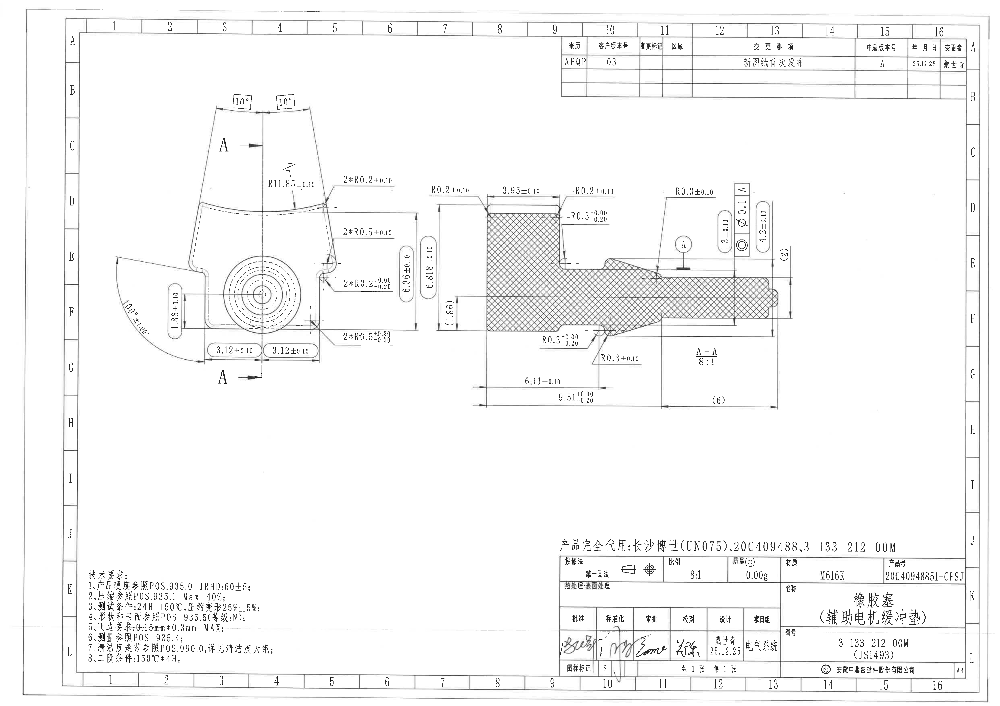
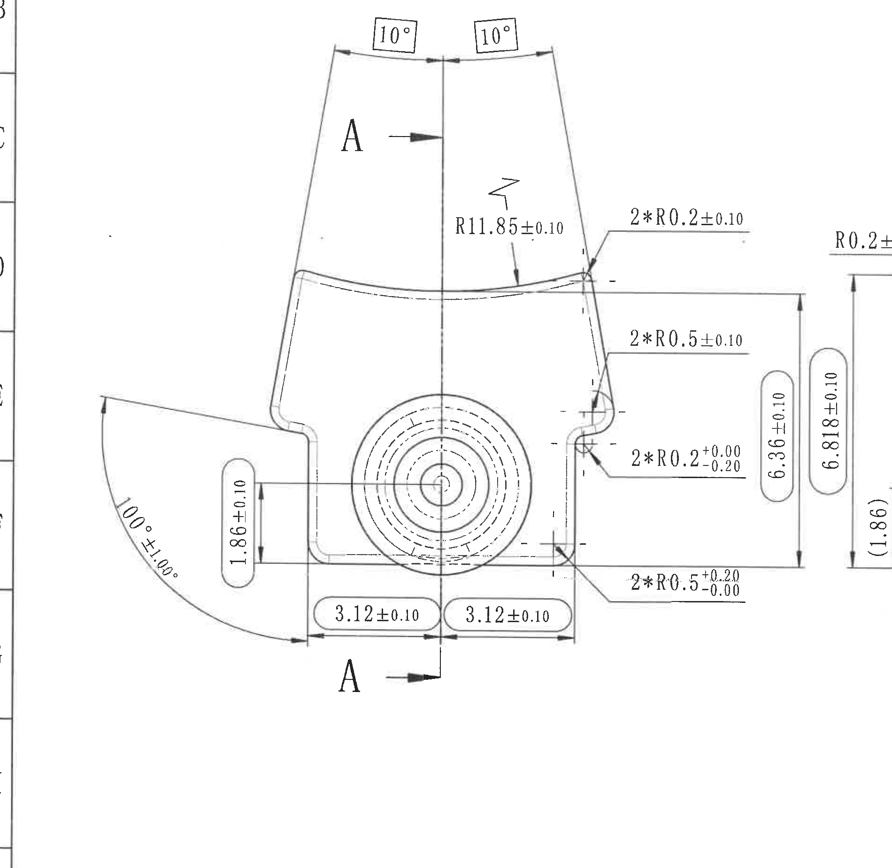
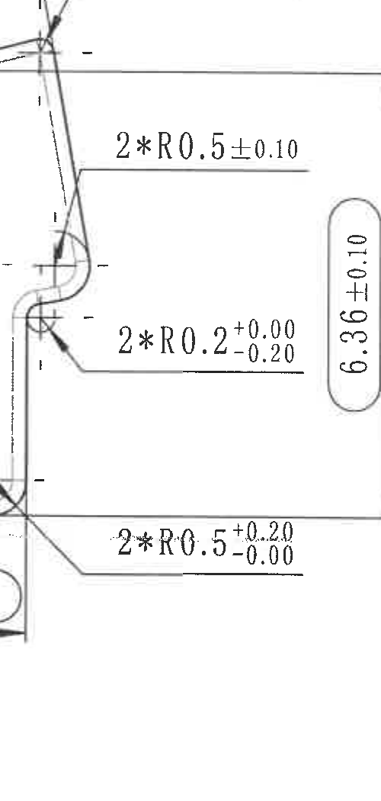
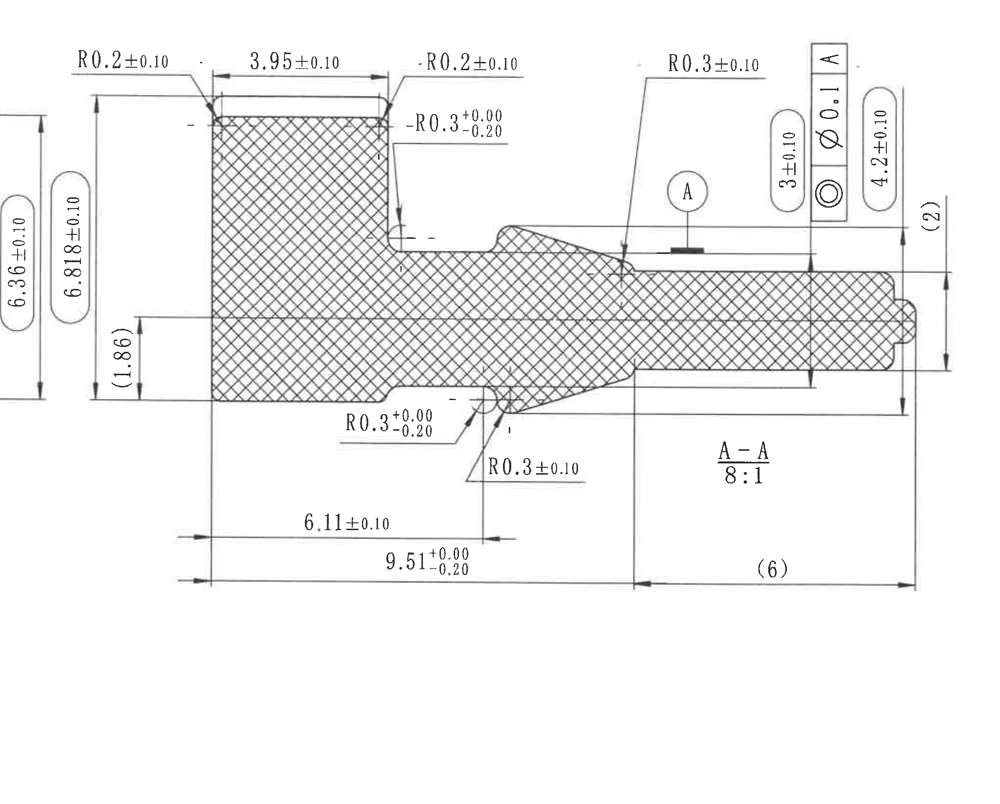
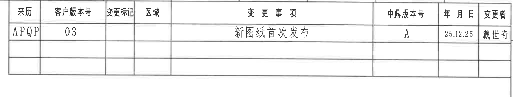
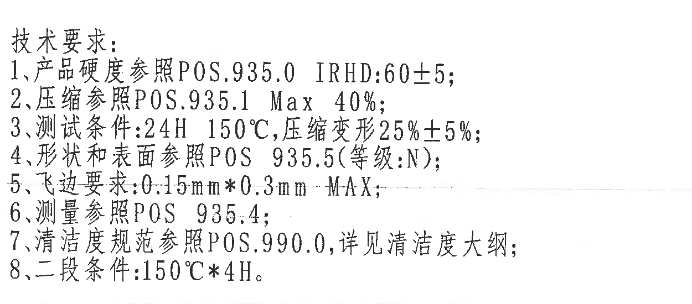
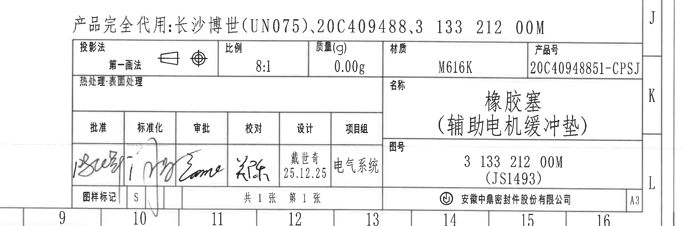

# 20C40948851.pdf 内容识别

整页 PNG：`outputs/20C40948851_assets/images/page_1.png`，页面像素尺寸 4959 x 3505，bbox `[0, 0, 4959, 3505]`。下列 bbox 均为整页 PNG 坐标 `[x1, y1, x2, y2]`。

## object_1 - 主加工视图

原图位置/视图名称：页面左中部主加工视图，bbox `[360, 430, 2260, 2280]`。  
object_kind：`view`。

| 提取项 | 原图数值或文本 | 含义说明 |
|---|---:|---|
| 上端左侧角度 | `10°` | 上端左侧斜边相对中心线/上端轮廓的角度标注。 |
| 上端右侧角度 | `10°` | 上端右侧斜边相对中心线/上端轮廓的角度标注。 |
| 剖切标识 | `A`、`A`，箭头沿中心线 | 指示 A-A 剖面所在的垂直剖切位置；剖面图见 object_3。 |
| 上部内凹弧半径 | `R11.85±0.10` | 主视图上部内凹弧面的半径尺寸，公差 ±0.10。 |
| 左侧大角度 | `100°±1.00°` | 左侧斜向外形与下部基准区域之间的角度/弧向角度标注，角度公差 ±1.00°。 |
| 左下台阶高度 | `1.86±0.10` | 主视图左下局部竖向高度尺寸，公差 ±0.10。 |
| 底部左半宽 | `3.12±0.10` | 从左侧竖向边到中心线的底部水平尺寸，公差 ±0.10。 |
| 底部右半宽 | `3.12±0.10` | 从中心线到右侧竖向边的底部水平尺寸，公差 ±0.10。 |
| 右上圆角数量半径 | `2*R0.2±0.10` | 主视图右上过渡处 2 处 R0.2 圆角，半径公差 ±0.10。 |
| 右侧中部圆角数量半径 | `2*R0.5±0.10` | 主视图右侧中部 2 处 R0.5 圆角，半径公差 ±0.10。 |
| 右侧下部小圆角数量半径 | `2*R0.2 +0.00/-0.20` | 主视图右侧下部 2 处 R0.2 圆角，上偏差 +0.00、下偏差 -0.20。 |
| 右下圆角数量半径 | `2*R0.5 +0.20/-0.00` | 主视图右下过渡处 2 处 R0.5 圆角，上偏差 +0.20、下偏差 -0.00。 |
| 右侧局部高度 | `6.36±0.10` | 主视图右侧竖向尺寸，公差 ±0.10；放大裁切见 object_2。 |

边界归属说明：object_1 为主加工视图整体裁切，完整包含主视图轮廓、中心线、剖切 A-A 标识和主视图尺寸。右缘为了保留主视图右侧完整尺寸线，带入了相邻 A-A 剖面视图左侧的少量标注残段，如 `R0.2...`、`6.818±0.10`、`(1.86)`，这些不归入 object_1 的提取项，归属 object_3。左侧可见图框分区线，不作为零件视图内容。

## object_2 - 主视图右侧尺寸标注局部

原图位置/视图名称：页面左中部主视图右侧外置标注局部，bbox `[1550, 960, 2050, 2010]`。  
object_kind：`detail`。该裁切为主视图右侧标注补充裁切，不是原图单独命名的局部视图。

| 提取项 | 原图数值或文本 | 含义说明 |
|---|---:|---|
| 右侧中部圆角数量半径 | `2*R0.5±0.10` | 主视图右侧中部过渡圆角，共 2 处，半径公差 ±0.10。 |
| 右侧下部小圆角数量半径 | `2*R0.2 +0.00/-0.20` | 主视图右侧下部小圆角，共 2 处，上偏差 +0.00、下偏差 -0.20。 |
| 右下圆角数量半径 | `2*R0.5 +0.20/-0.00` | 主视图右下角过渡圆角，共 2 处，上偏差 +0.20、下偏差 -0.00。 |
| 右侧局部高度 | `6.36±0.10` | 主视图右侧竖向尺寸；此局部裁切用于完整展示该尺寸线、箭头和文字。 |

边界归属说明：object_2 只解释主视图右侧外置标注。左侧保留被标注的主视图边缘和引出箭头；右边界在 `6.36±0.10` 外侧结束，未纳入相邻 A-A 剖面的 `6.818±0.10` 和 `(1.86)` 尺寸。

## object_3 - A-A 剖面视图

原图位置/视图名称：页面中右部 A-A 剖面视图，bbox `[1980, 820, 4030, 2470]`。  
object_kind：`section`。

| 提取项 | 原图数值或文本 | 含义说明 |
|---|---:|---|
| 剖面名称与比例 | `A-A`、`8:1` | 与主视图 A-A 剖切线对应的剖面图，比例 8:1。 |
| 左端总高 | `6.818±0.10` | 剖面左端块状区域的总高度尺寸，公差 ±0.10。 |
| 左端下部参考高度 | `(1.86)` | 括号内参考尺寸，表示剖面左端下部高度的参考值，不作为主要受控尺寸。 |
| 左端上角半径 | `R0.2±0.10` | 剖面左端上角过渡半径，公差 ±0.10。 |
| 顶部宽度 | `3.95±0.10` | 剖面左端顶部水平宽度，公差 ±0.10。 |
| 顶部右角半径 | `R0.2±0.10` | 剖面顶部右侧过渡半径，公差 ±0.10。 |
| 内台阶上圆角 | `R0.3 +0.00/-0.20` | 上部内台阶处圆角半径，上偏差 +0.00、下偏差 -0.20。 |
| 内台阶下圆角 | `R0.3 +0.00/-0.20` | 下部内台阶处圆角半径，上偏差 +0.00、下偏差 -0.20。 |
| 下部过渡圆角 | `R0.3±0.10` | 斜向过渡下侧圆角半径，公差 ±0.10。 |
| 上部过渡圆角 | `R0.3±0.10` | 斜向过渡上侧/轴肩处圆角半径，公差 ±0.10。 |
| 底部局部长度 | `6.11±0.10` | 从左端基准面到中部过渡附近的水平长度，公差 ±0.10。 |
| 底部总长度 | `9.51 +0.00/-0.20` | 从左端基准面到右侧长轴肩定位线的水平长度，上偏差 +0.00、下偏差 -0.20。 |
| 右侧延伸参考长度 | `(6)` | 括号内参考尺寸，表示从中部竖向定位线到右端的参考长度。 |
| 轴段厚度/高度 | `3±0.10` | 右侧轴段竖向厚度尺寸，公差 ±0.10。 |
| 右端总高 | `4.2±0.10` | 右端外形竖向总高度，公差 ±0.10。 |
| 右端参考高度 | `(2)` | 括号内参考尺寸，表示右端局部凸起/台阶相关参考高度。 |
| 基准标识 | `A` | 圆框 A 基准标识，指向右侧轴段上方基准面。 |
| 几何公差框 | `同心/同轴类符号`、`⌀0.1`、`A` | 按图形读取为同心/同轴类几何公差：直径公差带 `⌀0.1`，相对基准 `A`。 |

边界归属说明：object_3 包含 A-A 剖面实体、剖面线、剖面标题、剖面比例和完整剖面尺寸。左侧边界附近可见主视图右侧标注 `6.36±0.10`，该尺寸归 object_1/object_2，不作为 A-A 剖面尺寸提取；`6.818±0.10` 和 `(1.86)` 因尺寸线与剖面左端实体对齐，归入 object_3。

## object_4 - 修订履历表

原图位置/视图名称：页面右上角修订履历表，bbox `[2750, 180, 4800, 570]`。  
object_kind：`table`。

| 来历 | 客户版本号 | 变更标记 | 区域 | 变更事项 | 中鼎版本号 | 年月日 | 变更者 |
|---|---:|---|---|---|---:|---:|---|
| `APQP` | `03` |  |  | `新图纸首次发布` | `A` | `25.12.25` | `戴世奇` |
|  |  |  |  |  |  |  |  |
|  |  |  |  |  |  |  |  |

| 提取项 | 原图数值或文本 | 含义说明 |
|---|---|---|
| 表头 | `来历 / 客户版本号 / 变更标记 / 区域 / 变更事项 / 中鼎版本号 / 年月日 / 变更者` | 修订履历表列名。 |
| 修订记录 | `APQP / 03 / 空 / 空 / 新图纸首次发布 / A / 25.12.25 / 戴世奇` | 当前唯一填写的修订记录；表示新图纸首次发布，中鼎版本号 A，日期 25.12.25，变更者戴世奇。 |
| 空白记录行 | 两行空白 | 原表保留空白行，未填写修订内容。 |

边界归属说明：object_4 裁切完整包含修订表表头、表格线、已填写记录和空白记录行。未提取图框坐标字母。

## object_5 - NOTES / 技术要求

原图位置/视图名称：页面左下角技术要求，bbox `[420, 2780, 1670, 3330]`。  
object_kind：`notes`。

| 提取项 | 原图数值或文本 | 含义说明 |
|---|---|---|
| 标题 | `技术要求:` | 技术要求列表标题。 |
| 1 | `产品硬度参照POS.935.0 IRHD:60±5;` | 产品硬度要求参照 POS.935.0，硬度范围 IRHD 60±5。 |
| 2 | `压缩参照POS.935.1 Max 40%;` | 压缩要求参照 POS.935.1，最大 40%。 |
| 3 | `测试条件:24H 150°C,压缩变形25%±5%;` | 测试条件为 24H、150°C，压缩变形 25%±5%。 |
| 4 | `形状和表面参照POS 935.5(等级:N);` | 形状和表面要求参照 POS 935.5，等级 N。 |
| 5 | `飞边要求:0.15mm*0.3mm MAX;` | 飞边最大要求为 0.15mm*0.3mm。 |
| 6 | `测量参照POS 935.4;` | 测量方法参照 POS 935.4。 |
| 7 | `清洁度规范参照POS.990.0,详见清洁度大纲;` | 清洁度规范参照 POS.990.0，详细要求见清洁度大纲。 |
| 8 | `二段条件:150°C*4H.` | 二段处理条件为 150°C*4H。 |

边界归属说明：object_5 完整包含技术要求 1-8 条及标题；未带入标题栏或主视图尺寸。

## object_6 - 标题栏

原图位置/视图名称：页面右下角标题栏，bbox `[2520, 2620, 4959, 3420]`。  
object_kind：`title_block`。

| 字段 | 原图数值或文本 | 含义说明 |
|---|---|---|
| 产品完全代用 | `长沙博世(UN075),20C409488,3 133 212 00M` | 标题栏上方的产品完全代用信息。 |
| 投影法 | `第一画法` | 投影法字段，配有第一角法投影符号。 |
| 比例 | `8:1` | 图纸比例。 |
| 质量(g) | `0.00g` | 零件质量字段。 |
| 材质 | `M616K` | 材料牌号/材料字段。 |
| 产品号 | `20C40948851-CPSJ` | 产品号。 |
| 热处理·表面处理 | 空白 | 标题栏中该字段未填写具体值。 |
| 名称 | `橡胶塞（辅助电机缓冲垫）` | 零件名称。 |
| 图号 | `3 133 212 00M (JS1493)` | 图样/零件图号及括号内编号。 |
| 批准 | 手写签名，难以辨读 | 批准栏签名。 |
| 标准化 | 手写签名，难以辨读 | 标准化栏签名。 |
| 审批 | 手写签名，难以辨读 | 审批栏签名。 |
| 校对 | 手写签名，难以辨读 | 校对栏签名。 |
| 设计 | `戴世奇 25.12.25` | 设计人员及日期。 |
| 项目组 | `电气系统` | 项目组名称。 |
| 图样标记 | `S` | 图样标记字段。 |
| 页码 | `共 1 张 第 1 张` | 总张数和当前张数。 |
| 公司 | `安徽中鼎密封件股份有限公司` | 出图/公司名称。 |
| 幅面 | `A3` | 图纸幅面。 |

标题栏原结构还原：

| 投影法 | 比例 | 质量(g) | 材质 | 产品号 |
|---|---:|---:|---|---|
| `第一画法` | `8:1` | `0.00g` | `M616K` | `20C40948851-CPSJ` |

| 热处理·表面处理 | 名称 |
|---|---|
|  | `橡胶塞（辅助电机缓冲垫）` |

| 批准 | 标准化 | 审批 | 校对 | 设计 | 项目组 |
|---|---|---|---|---|---|
| 手写签名 | 手写签名 | 手写签名 | 手写签名 | `戴世奇 25.12.25` | `电气系统` |

| 图样标记 | 页码 | 图号 | 公司 | 幅面 |
|---|---|---|---|---|
| `S` | `共 1 张 第 1 张` | `3 133 212 00M (JS1493)` | `安徽中鼎密封件股份有限公司` | `A3` |

边界归属说明：object_6 完整包含标题栏和上方“产品完全代用”文字。右侧和底部因标题栏贴近图框，裁切中可见图框坐标 `J/K/L` 及底部分区数字，这些不属于标题栏字段，未作为标题栏数据提取。

## 未见项说明

| 项目 | 识别结果 |
|---|---|
| T 编号 | 本页未见独立 `T` 编号标注。 |
| 独立星号关键尺寸 | 未见除 `2*R...` 数量前缀和 NOTES 中乘号 `*` 之外的独立星号关键尺寸。 |

## 裁切检查记录

| object_id | 图片 | 检查结果 | 边界/归属记录 |
|---|---|---|---|
| `page_1` | `outputs/20C40948851_assets/images/page_1.png` | 完整整页 PNG，包含图框、全部视图、表格、NOTES、标题栏。 | 整页渲染图，作为所有 bbox 坐标基准。 |
| `object_1` | `outputs/20C40948851_assets/images/object_1.png` | 主视图尺寸线和文字完整；未切断主视图标注。 | 右缘为保证主视图右侧尺寸线完整，带入相邻剖面少量残段；剖面残段不提取到主视图。 |
| `object_2` | `outputs/20C40948851_assets/images/object_2.png` | 主视图右侧局部标注 `2*R0.5±0.10`、`2*R0.2 +0.00/-0.20`、`2*R0.5 +0.20/-0.00`、`6.36±0.10` 完整。 | 未包含 A-A 剖面的 `6.818±0.10` 与 `(1.86)`；左侧只保留主视图被标注边缘。 |
| `object_3` | `outputs/20C40948851_assets/images/object_3.png` | A-A 剖面实体、剖面线、剖面标题、尺寸线和文字完整。 | 左侧可见主视图 `6.36±0.10`，不作为剖面尺寸；`6.818±0.10`、`(1.86)` 与剖面左端实体对齐，归属剖面。 |
| `object_4` | `outputs/20C40948851_assets/images/object_4.png` | 修订表表头、表格线、已填写记录和空白行完整。 | 未提取图框坐标字符。 |
| `object_5` | `outputs/20C40948851_assets/images/object_5.png` | 技术要求标题和第 1-8 条文字完整。 | 未带入标题栏、图框分区或零件视图。 |
| `object_6` | `outputs/20C40948851_assets/images/object_6.png` | 标题栏字段、签名栏、图号、公司名、A3 幅面和上方代用文字完整。 | 可见图框坐标和底部分区数字，未作为标题栏字段提取。 |
