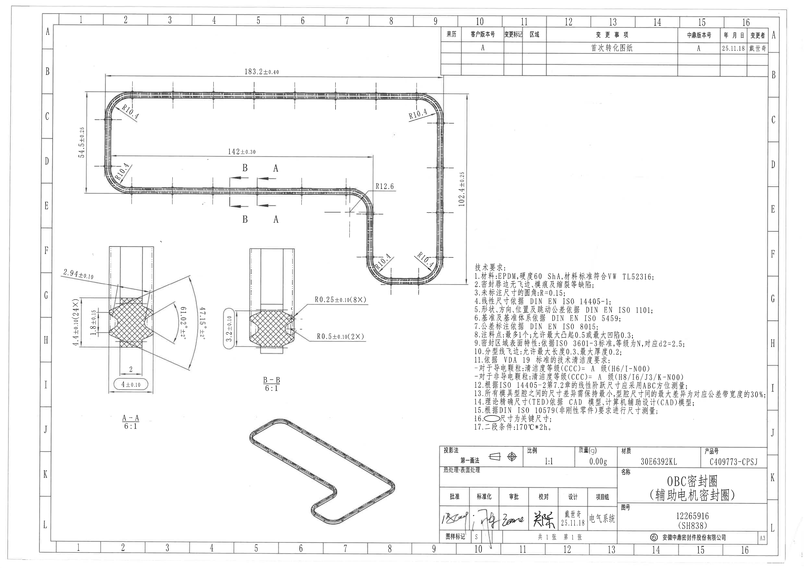
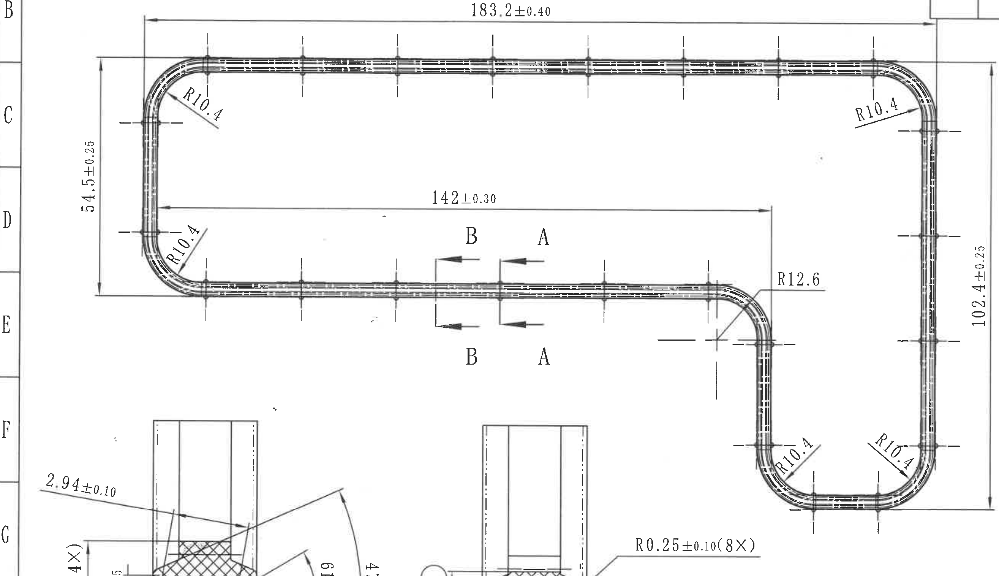
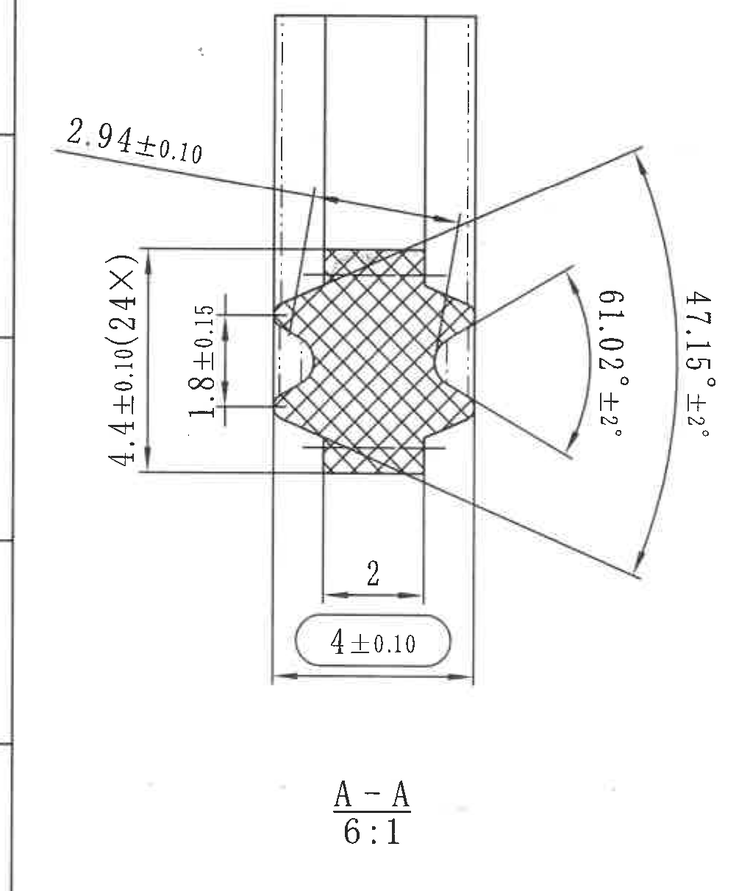
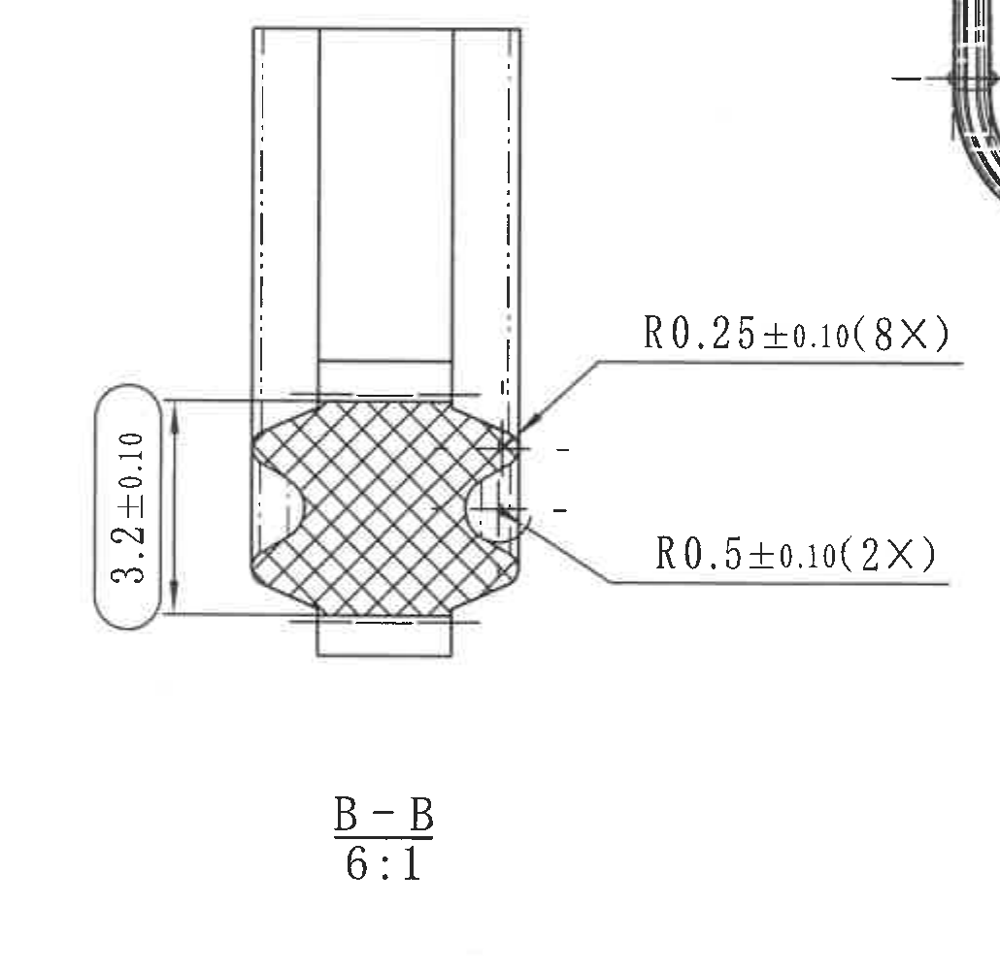
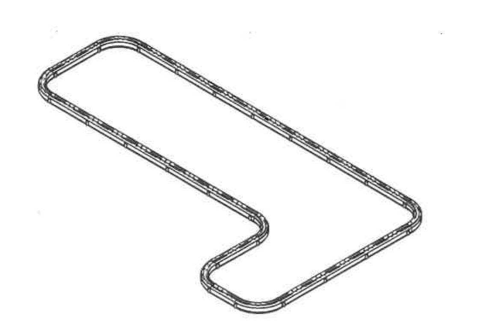
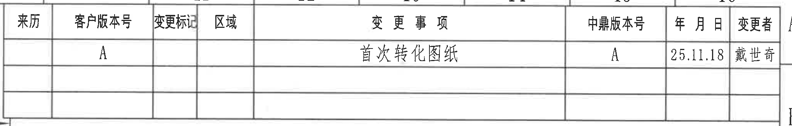
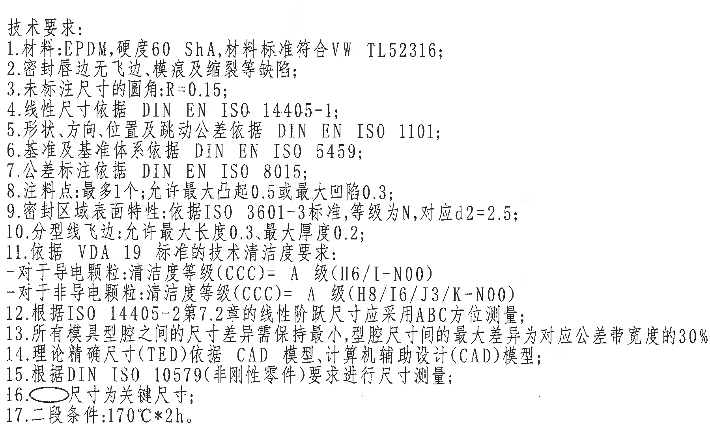
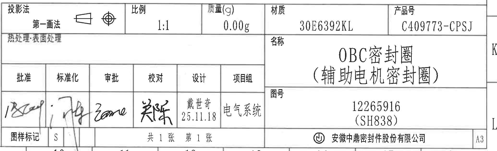

# 20C409773 PDF 内容识别

## 页面渲染

| 项目 | 原图数值或文本 | 含义说明 |
|---|---:|---|
| PDF 页数 | 1 | 单页 A3 图纸 |
| 整页 PNG | `20C409773_assets/images/page_1.png` | 先将 PDF 渲染为整页 PNG 后再裁切 |
| PNG 尺寸 | 4959 x 3505 px | manifest 中 page bbox 为 `[0, 0, 4959, 3505]` |

## object_1 主加工视图 / 平面轮廓视图

原图位置/视图名称：第 1 页左上至中部，主加工视图/平面轮廓视图，bbox `[270, 415, 2900, 1930]`。

| 提取项 | 原图数值或文本 | 含义说明 |
|---|---|---|
| 顶部水平总长 | `183.2±0.40` | 主轮廓上方长直段方向的总长度尺寸，含双向公差。 |
| 左侧竖向高度 | `54.5±0.25` | 左侧 U 形回弯区域的竖向高度尺寸，含双向公差。 |
| 右侧竖向总高度 | `102.4±0.25` | 右侧长竖向回弯区域的总高度尺寸，含双向公差。 |
| 中部水平距离 | `142±0.30` | 中部横向直段到右侧转弯定位线的距离尺寸，含双向公差。 |
| 左上圆弧半径 | `R10.4` | 左上角圆弧半径，标注引线指向左上回弯。 |
| 左下圆弧半径 | `R10.4` | 左侧下部圆弧半径，标注引线指向左下回弯。 |
| 右上圆弧半径 | `R10.4` | 右上角圆弧半径，标注引线指向右上回弯。 |
| 中右下折弯圆弧半径 | `R10.4` | 中右侧下行转弯后底部内侧圆弧半径。 |
| 右下圆弧半径 | `R10.4` | 右下 U 形端部圆弧半径。 |
| 中右过渡圆弧半径 | `R12.6` | 中部横向段转向右侧下行段的过渡圆弧半径。 |
| 剖切标记 | `A`、`B` | 主视图下方直段处给出 A-A、B-B 剖切位置和箭头方向。 |
| 基准字母/基准符号 | 未见 | 当前主加工视图未发现带基准框的基准字母；`A`、`B` 为剖切标记，不按基准提取。 |
| 参考尺寸 | 未见括号参考尺寸 | 当前主加工视图未发现用括号表示的参考尺寸。 |
| 关键尺寸 | 未见星号；未见椭圆框关键尺寸 | 主视图内未见星号尺寸或椭圆框尺寸；关键尺寸见 A-A、B-B 剖面。 |
| 直径符号 | 未见 | 当前主加工视图未发现直径符号尺寸。 |
| T 编号 | 未见 | 当前主加工视图未发现 T 编号。 |

边界归属说明：该裁切保留了主轮廓的完整尺寸线、箭头、圆弧引线和文字。由于主视图右下回弯与页面下方剖面视图在矩形范围内接近，裁图底部可见 A-A、B-B 剖面和其局部尺寸片段；这些片段不归属 object_1，未在本区域提取，剖面尺寸分别归入 object_2 和 object_3。左侧可见图框坐标字母，不作为主视图内容提取。

## object_2 A-A 剖面视图

原图位置/视图名称：第 1 页左下部，A-A 剖面视图，比例 `6:1`，bbox `[300, 1500, 1320, 2710]`。

| 提取项 | 原图数值或文本 | 含义说明 |
|---|---|---|
| 剖面名称 | `A-A` | 对应主视图中的 A 剖切位置。 |
| 剖面比例 | `6:1` | A-A 剖面放大比例。 |
| 斜向局部尺寸 | `2.94±0.10` | A-A 剖面上部斜向引出尺寸，定义局部唇边/肩部宽度，含双向公差。 |
| 重复竖向尺寸 | `4.4±0.10(24X)` | A-A 剖面左侧竖向尺寸，`24X` 表示同类位置数量为 24 处，含双向公差。 |
| 内部竖向尺寸 | `1.8±0.15` | A-A 剖面内侧局部高度/间距尺寸，含双向公差。 |
| 内侧角度 | `91.02°±2°` | 剖面右侧内侧夹角，含角度公差。 |
| 外侧角度 | `47.15°±2°` | 剖面右侧外侧夹角，含角度公差。 |
| 底部局部宽度 | `2` | A-A 剖面底部局部宽度尺寸，原图未给出公差。 |
| 椭圆框关键尺寸 | `4±0.10` | A-A 剖面底部椭圆框内尺寸；按技术要求第 16 条，椭圆框尺寸为关键尺寸。 |
| 参考尺寸 | 未见括号参考尺寸 | 当前 A-A 剖面未发现括号参考尺寸。 |
| 基准字母/基准符号 | 未见 | 当前 A-A 剖面未发现带基准框的基准字母。 |
| 直径符号 | 未见 | 当前 A-A 剖面未发现直径符号尺寸。 |
| T 编号 | 未见 | 当前 A-A 剖面未发现 T 编号。 |

边界归属说明：A-A 裁图完整包含剖面轮廓、剖面名称、比例、所有尺寸线、角度弧线、箭头和文字。左侧可见图框线，非 A-A 内容；右侧未带入 B-B 的尺寸文字。

## object_3 B-B 剖面视图

原图位置/视图名称：第 1 页中下部，B-B 剖面视图，比例 `6:1`，bbox `[1280, 1505, 2310, 2505]`。

| 提取项 | 原图数值或文本 | 含义说明 |
|---|---|---|
| 剖面名称 | `B-B` | 对应主视图中的 B 剖切位置。 |
| 剖面比例 | `6:1` | B-B 剖面放大比例。 |
| 椭圆框关键尺寸 | `3.2±0.10` | B-B 剖面左侧椭圆框内竖向尺寸；按技术要求第 16 条，椭圆框尺寸为关键尺寸。 |
| 小圆角半径 | `R0.25±0.10(8X)` | B-B 剖面右上引线标注的小圆角半径，`8X` 表示 8 处，含双向公差。 |
| 凹圆角半径 | `R0.5±0.10(2X)` | B-B 剖面右下引线标注的凹圆角半径，`2X` 表示 2 处，含双向公差。 |
| 参考尺寸 | 未见括号参考尺寸 | 当前 B-B 剖面未发现括号参考尺寸；`(8X)`、`(2X)` 为数量前缀/数量说明，不是参考尺寸。 |
| 基准字母/基准符号 | 未见 | 当前 B-B 剖面未发现带基准框的基准字母。 |
| 直径符号 | 未见 | 当前 B-B 剖面未发现直径符号尺寸。 |
| 角度/弧向尺寸 | 未见角度；见半径尺寸 | 当前 B-B 剖面未发现角度尺寸，圆弧信息以 R 半径标注给出。 |
| T 编号 | 未见 | 当前 B-B 剖面未发现 T 编号。 |

边界归属说明：B-B 裁图完整包含剖面轮廓、剖面名称、比例、`3.2±0.10`、`R0.25±0.10(8X)`、`R0.5±0.10(2X)` 的尺寸线、引线和文字。右上角可见主视图局部线段，不包含完整尺寸文字或尺寸线，不作为 B-B 提取内容。

## object_4 底部外形示意视图

原图位置/视图名称：第 1 页底部中间，外形/等轴示意视图，bbox `[1450, 2500, 2600, 3260]`。

| 提取项 | 原图数值或文本 | 含义说明 |
|---|---|---|
| 视图内容 | 外形/等轴示意轮廓 | 显示密封圈闭合轮廓和内外边线关系。 |
| 尺寸标注 | 未见 | 该视图中未标注尺寸、角度、半径或公差。 |
| 参考尺寸 | 未见 | 该视图中未发现括号参考尺寸。 |
| 直径符号 | 未见 | 该视图中未发现直径符号尺寸。 |
| 关键尺寸 | 未见 | 该视图中未发现星号或椭圆框关键尺寸。 |
| T 编号 | 未见 | 该视图中未发现 T 编号。 |

边界归属说明：该裁切完整包含底部外形示意轮廓，未带入其他视图的尺寸文字或表格内容。

## object_5 修订履历表

原图位置/视图名称：第 1 页右上部，修订履历表，bbox `[2710, 155, 4770, 485]`。

### 原表还原

| 来历 | 客户版本号 | 变更标记 | 区域 | 变更事项 | 中鼎版本号 | 年月日 | 变更者 |
|---|---|---|---|---|---|---|---|
|  | A |  |  | 首次转化图纸 | A | 25.11.18 | 戴世奇 |
|  |  |  |  |  |  |  |  |
|  |  |  |  |  |  |  |  |

| 提取项 | 原图数值或文本 | 含义说明 |
|---|---|---|
| 客户版本号 | `A` | 本次记录的客户版本。 |
| 变更事项 | `首次转化图纸` | 本次修订说明。 |
| 中鼎版本号 | `A` | 中鼎内部版本。 |
| 年月日 | `25.11.18` | 修订日期。 |
| 变更者 | `戴世奇` | 修订人员。 |
| 空白列/行 | 来历、变更标记、区域为空；后两行为空 | 原表保留空白单元格。 |

边界归属说明：裁图完整包含修订履历表表头、有效修订行和空白行。顶部可见少量图框坐标线，不作为表格字段提取。

## object_6 NOTES / 技术要求

原图位置/视图名称：第 1 页右中部，技术要求/NOTES，bbox `[2910, 1580, 4710, 2710]`。

### 原文还原

| 序号 | 原图文本 |
|---:|---|
| 标题 | 技术要求: |
| 1 | 材料:EPDM,硬度60 ShA,材料标准符合VW TL52316; |
| 2 | 密封唇边无飞边、模痕及缩裂等缺陷; |
| 3 | 未标注尺寸的圆角:R=0.15; |
| 4 | 线性尺寸依据 DIN EN ISO 14405-1; |
| 5 | 形状、方向、位置及跳动公差依据 DIN EN ISO 1101; |
| 6 | 基准及基准体系依据 DIN EN ISO 5459; |
| 7 | 公差标注依据 DIN EN ISO 8015; |
| 8 | 注料点:最多1个;允许最大凸起0.5或最大凹陷0.3; |
| 9 | 密封区域表面特性:依据ISO 3601-3标准,等级为N,对应d2=2.5; |
| 10 | 分型线飞边:允许最大长度0.3,最大厚度0.2; |
| 11 | 依据 VDA 19 标准的技术清洁度要求: |
| 11-1 | -对于导电颗粒:清洁度等级(CCC)= A 级(H6/I-N00) |
| 11-2 | -对于非导电颗粒:清洁度等级(CCC)= A 级(H8/I6/J3/K-N00) |
| 12 | 根据ISO 14405-2第7.2章的线性阶跃尺寸应采用ABC方位测量; |
| 13 | 所有模具型腔之间的尺寸差异需保持最小,型腔尺寸间的最大差异为对应公差带宽度的30%; |
| 14 | 理论精确尺寸(TED)依据 CAD 模型,计算机辅助设计(CAD)模型; |
| 15 | 根据DIN ISO 10579(非刚性零件)要求进行尺寸测量; |
| 16 | 椭圆框内尺寸为关键尺寸; |
| 17 | 二段条件:170°C*2h. |

| 提取项 | 原图数值或文本 | 含义说明 |
|---|---|---|
| 材料 | `EPDM` | 材料种类。 |
| 硬度 | `60 ShA` | 邵氏 A 硬度要求。 |
| 材料标准 | `VW TL52316` | 材料标准。 |
| 未标注圆角 | `R=0.15` | 未单独标注的圆角默认半径。 |
| 注料点数量 | `最多1个` | 注料点数量限制。 |
| 注料点凸起/凹陷 | `最大凸起0.5`、`最大凹陷0.3` | 注料点允许的表面偏差。 |
| 密封区域表面等级 | `ISO 3601-3`、`等级为N`、`d2=2.5` | 密封区域表面特性标准和等级。 |
| 分型线飞边 | `最大长度0.3`、`最大厚度0.2` | 分型线飞边限制。 |
| 清洁度要求 | `VDA 19`、`CCC=A级` | 技术清洁度依据。 |
| 导电颗粒等级 | `A 级(H6/I-N00)` | 导电颗粒清洁度等级。 |
| 非导电颗粒等级 | `A 级(H8/I6/J3/K-N00)` | 非导电颗粒清洁度等级。 |
| 线性阶跃尺寸测量 | `ISO 14405-2 第7.2章`、`ABC方位测量` | 线性阶跃尺寸测量方法。 |
| 型腔差异 | `对应公差带宽度的30%` | 模具型腔尺寸差异上限。 |
| 关键尺寸定义 | `椭圆框内尺寸为关键尺寸` | A-A 的 `4±0.10` 和 B-B 的 `3.2±0.10` 属于该说明。 |
| 二段条件 | `170°C*2h` | 工艺/处理条件。 |

边界归属说明：裁图完整包含 NOTES 标题和第 1 至 17 条文字，未带入标题栏或其他视图；右侧留有空白以保证第 13 条文字末端未被裁掉。

## object_7 标题栏

原图位置/视图名称：第 1 页右下部，标题栏，bbox `[2705, 2740, 4775, 3370]`。

### 标题栏表格还原

| 投影法 | 比例 | 质量(g) | 材质 | 产品号 |
|---|---|---|---|---|
| 第一画法 | 1:1 | 0.00g | 30E6392KL | C409773-CPSJ |

| 热处理/表面处理 | 名称 |
|---|---|
|  | OBC密封圈（辅助电机密封圈） |

| 字段 | 内容 |
|---|---|
| 图号 | 12265916（SH838） |

| 批准 | 标准化 | 审批 | 校对 | 设计 | 项目组 |
|---|---|---|---|---|---|
| 手写签名 | 手写签名 | 手写签名 | 手写签名 | 戴世奇 / 25.11.18 | 电气系统 |

| 图样标记 | 图纸张数 | 页次 | 图幅 | 公司 |
|---|---|---|---|---|
| S | 共1张 | 第1张 | A3 | 安徽中鼎密封件股份有限公司 |

| 提取项 | 原图数值或文本 | 含义说明 |
|---|---|---|
| 投影法 | `第一画法` | 第一角投影。 |
| 比例 | `1:1` | 图纸主比例。 |
| 质量 | `0.00g` | 标题栏质量字段。 |
| 材质 | `30E6392KL` | 标题栏材质字段。 |
| 产品号 | `C409773-CPSJ` | 产品编号。 |
| 名称 | `OBC密封圈（辅助电机密封圈）` | 产品名称。 |
| 图号 | `12265916 (SH838)` | 图纸编号及括号内编号。 |
| 设计 | `戴世奇 25.11.18` | 设计人员和日期。 |
| 项目组 | `电气系统` | 项目组字段。 |
| 图样标记 | `S` | 标题栏图样标记。 |
| 张数/页次 | `共1张`、`第1张` | 图纸总张数和当前页。 |
| 图幅 | `A3` | 图幅规格。 |
| 公司 | `安徽中鼎密封件股份有限公司` | 图纸签发公司。 |

边界归属说明：裁图完整包含标题栏主体、签名栏、名称栏、图号栏、页次和公司栏。手写签名作为图形签名保留在裁图中，无法可靠转换为标准文字时在表格中按“手写签名”还原。

## 裁切检查记录

| 对象 | 图片路径 | 检查结果 | 边界归属检查 |
|---|---|---|---|
| 整页 | `20C409773_assets/images/page_1.png` | 完整渲染 PDF 第 1 页，尺寸 4959 x 3505 px。 | 页面完整，无裁切。 |
| object_1 | `20C409773_assets/images/object_1.png` | 主视图尺寸线、箭头、半径引线和文字完整。 | 底部可见剖面视图片段，不提取到主视图；剖面尺寸归 object_2/object_3。 |
| object_2 | `20C409773_assets/images/object_2.png` | A-A 剖面尺寸线、角度弧线、文字和比例完整。 | 左侧图框线不归属 A-A；未混入 B-B 尺寸文字。 |
| object_3 | `20C409773_assets/images/object_3.png` | B-B 剖面尺寸线、半径引线、文字和比例完整。 | 右上角少量主视图线段不提取；底部未混入外形示意视图。 |
| object_4 | `20C409773_assets/images/object_4.png` | 外形示意轮廓完整。 | 未带入其他视图尺寸或表格。 |
| object_5 | `20C409773_assets/images/object_5.png` | 修订履历表表头、有效记录和空白行完整。 | 顶部少量图框坐标线不作为表格字段。 |
| object_6 | `20C409773_assets/images/object_6.png` | NOTES 第 1 至 17 条文字完整，右端文字未裁断。 | 未带入标题栏或视图内容。 |
| object_7 | `20C409773_assets/images/object_7.png` | 标题栏字段、表格线、签名栏、公司栏完整。 | 未带入 NOTES 正文内容。 |
