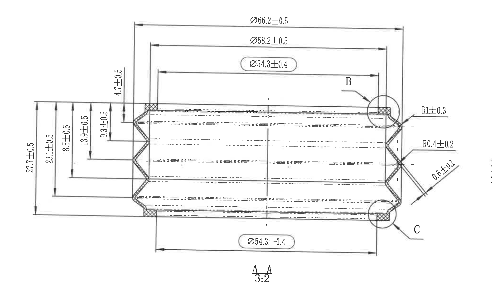
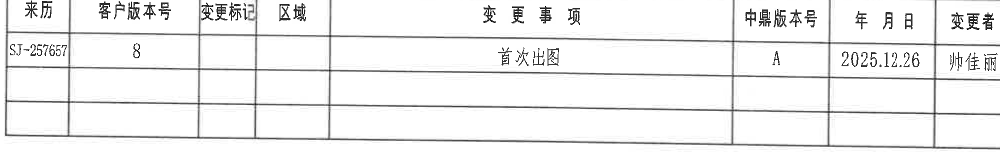
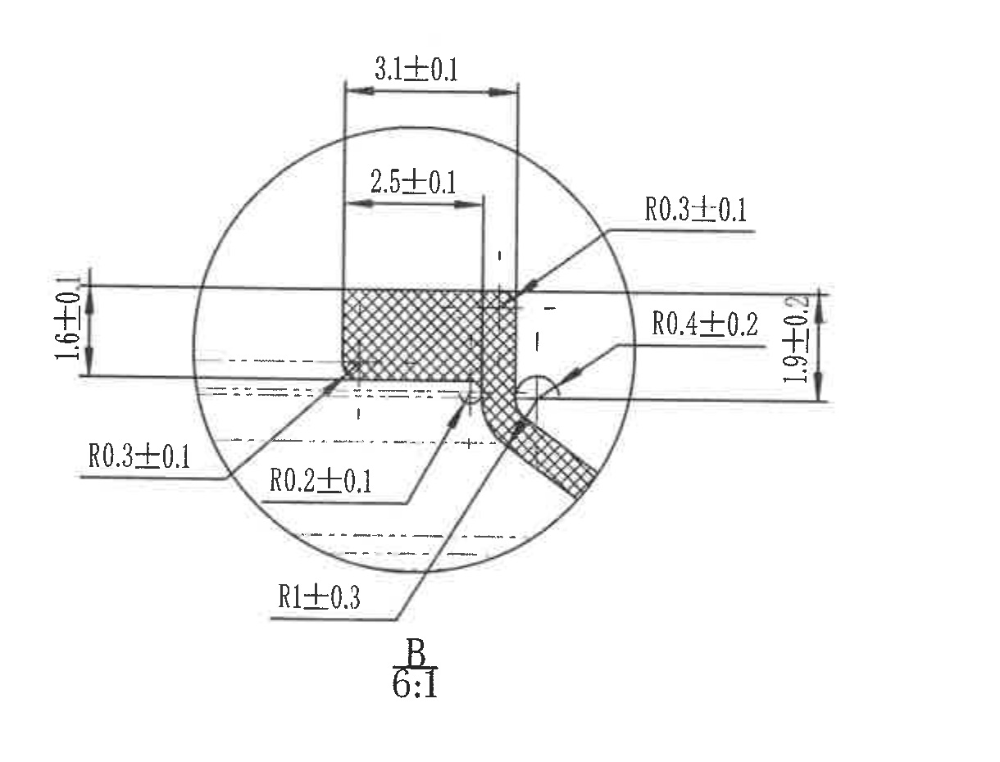
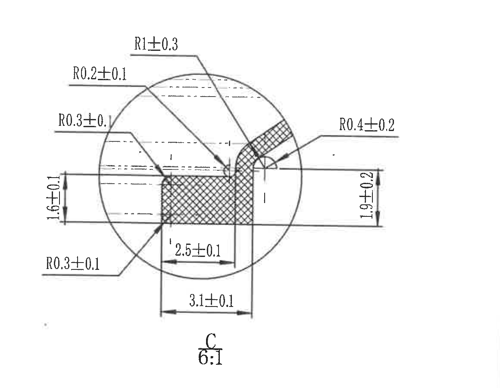
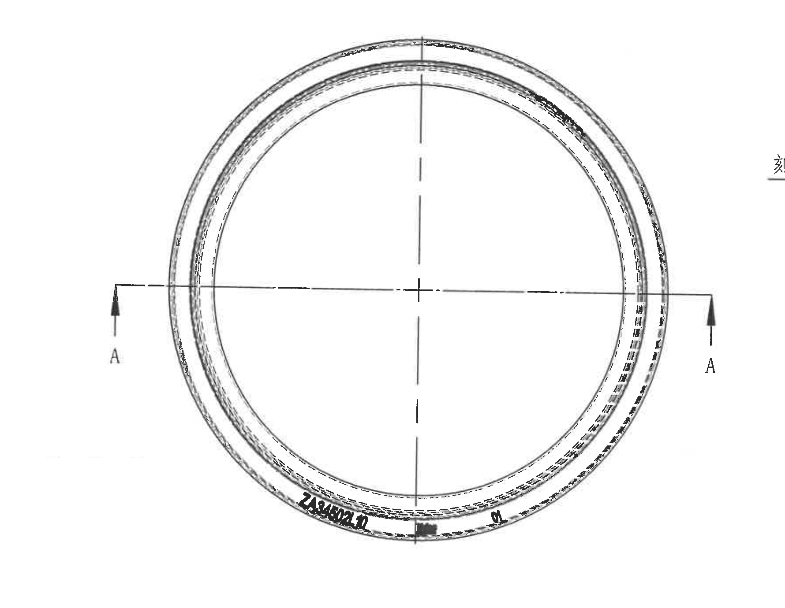
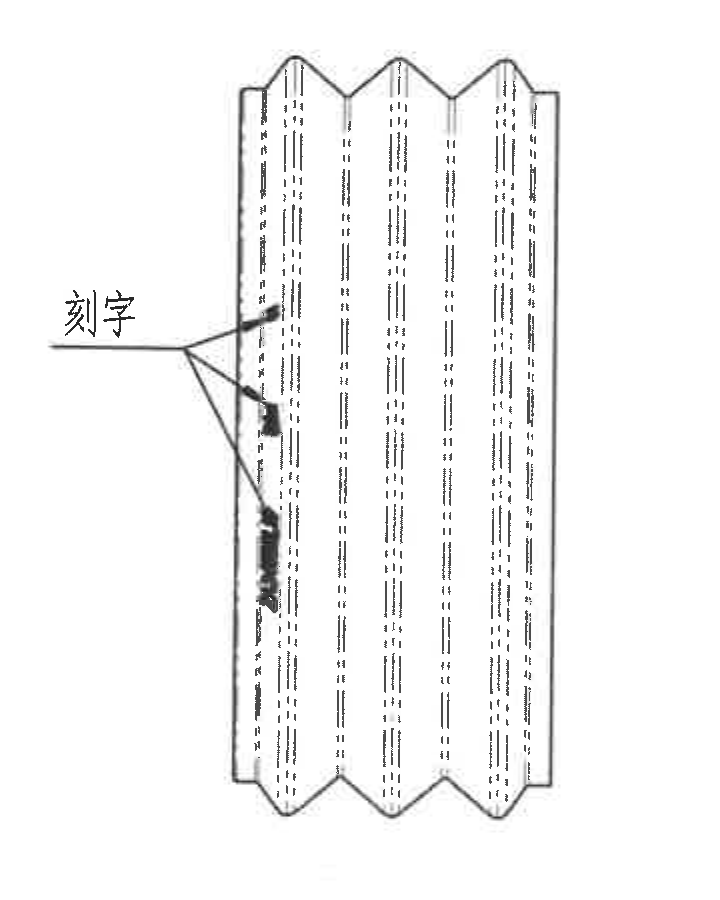
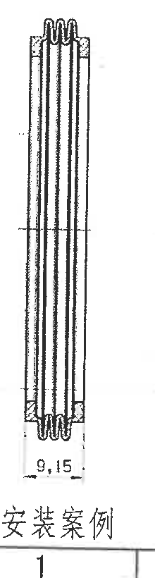
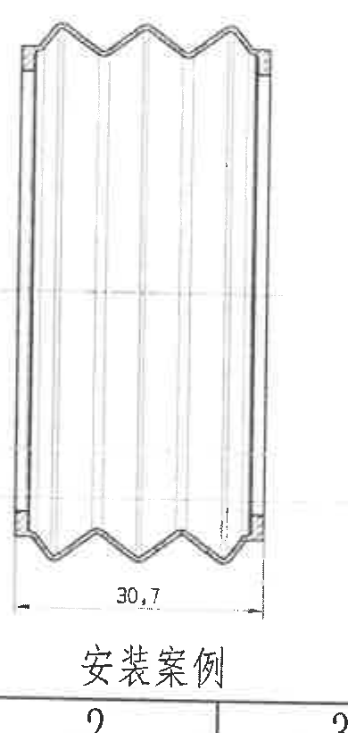
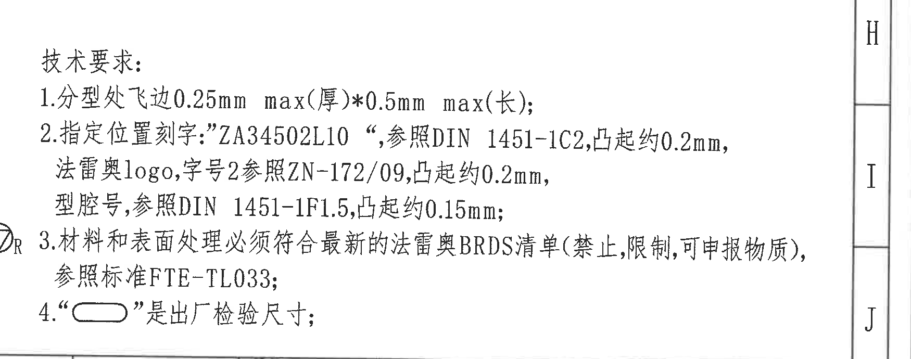
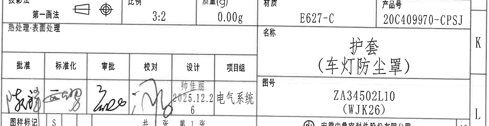

# 20C409970 内容识别结果

整页渲染图: `outputs/20C409970_assets/images/page_1.png`。页面尺寸: 4959 x 3505 px。bbox 格式: `[x, y, width, height]`，坐标原点为整页 PNG 左上角。

## object_1 - A-A 剖面视图，比例 3:2

- 原图位置/视图名称: page 1, bbox `[500, 250, 2070, 1280]`, A-A 剖面视图，比例 3:2。
- 边界归属说明: 上方及下方水平直径尺寸属于 A-A 剖面；左侧竖向高度尺寸属于 A-A 剖面；右端 R1±0.3、R0.4±0.2、0.6±0.1 属于剖面右端折边/圆角；圆圈 B、C 仅为局部放大索引，对应尺寸由 object_3 和 object_4 单独解释。裁切右边界未纳入 C 局部视图的独立 1.6±0.1、1.9±0.2、R0.3±0.1 等尺寸。

| 提取项 | 原图数值或文本 | 含义说明 |
|---|---|---|
| 视图名称/比例 | A-A / 3:2 | 剖切 A-A 的截面加工视图，按 3:2 显示。 |
| 外径/总外侧直径 | Ø66.2±0.5 | 最外轮廓直径尺寸，直径符号 Ø 表示圆形外径，公差 ±0.5。 |
| 中间直径 | Ø58.2±0.5 | 中间台阶/轮廓直径，公差 ±0.5。 |
| 检验直径 | Ø54.3±0.4 | 带长圆框的出厂检验尺寸；技术要求第 4 条说明长圆框为出厂检验尺寸。 |
| 下方检验直径 | Ø54.3±0.4 | 同一剖面下方对应直径，带长圆框，作为出厂检验尺寸。 |
| 总高度 | 27.7±0.5 | 左侧最大竖向高度/总宽度，公差 ±0.5。 |
| 台阶高度 | 23.1±0.5 | 左侧次级竖向尺寸，定位内部台阶。 |
| 台阶高度 | 18.5±0.5 | 左侧内部竖向尺寸，定位中部轮廓。 |
| 槽/折边高度 | 13.9±0.5 | 左侧中部槽形/折边相关高度。 |
| 局部高度 | 9.3±0.5 | 左侧局部竖向高度。 |
| 端部厚度 | 4.7±0.5 | 靠上端小台阶厚度。 |
| 右端圆角 | R1±0.3 | 右端外侧较大圆角半径，公差 ±0.3。 |
| 右端圆角 | R0.4±0.2 | 右端折角小圆角半径，公差 ±0.2。 |
| 斜向局部尺寸 | 0.6±0.1 | 右端斜向局部尺寸，公差 ±0.1。 |
| 局部索引 | B / C | 圆圈索引指向 object_3、object_4 的 6:1 局部放大，不将局部尺寸归入 A-A 主剖面。 |

## object_2 - 修订履历表/变更事项表

- 原图位置/视图名称: page 1, bbox `[2790, 225, 2000, 315]`, 修订履历表/变更事项表。
- 边界归属说明: 该对象为右上角修订履历表。裁切只保留表格本体，不提取图框坐标编号。空白单元格按原表结构保留。

原表还原：

| 来历 | 客户版本号 | 变更标记 | 区域 | 变更事项 | 中鼎版本号 | 年月日 | 变更者 |
|---|---|---|---|---|---|---|---|
| SJ-257657 | 8 |  |  | 首次出图 | A | 2025.12.26 | 帅佳丽 |
|  |  |  |  |  |  |  |  |
|  |  |  |  |  |  |  |  |

含义说明：该表为修订/变更履历，当前可读记录表示客户版本号 8，对应中鼎版本 A，2025.12.26 首次出图，变更者为帅佳丽。

## object_3 - 局部放大 B，比例 6:1

- 原图位置/视图名称: page 1, bbox `[2500, 585, 1220, 930]`, 局部放大 B，比例 6:1。
- 边界归属说明: 该对象为 A-A 剖面右上圆圈 B 的局部放大。所有半径标注与 3.1、2.5、1.6、1.9 尺寸只归属于 B 视图；左边界处的 1.6±0.1 尺寸线在裁图中完整保留，不归入 A-A 主剖面。

| 提取项 | 原图数值或文本 | 含义说明 |
|---|---|---|
| 视图名称/比例 | B / 6:1 | A-A 剖面中 B 圆圈位置的局部放大。 |
| 上口宽度 | 3.1±0.1 | 局部上方外侧宽度，公差 ±0.1。 |
| 内侧宽度 | 2.5±0.1 | 局部内部台阶宽度，公差 ±0.1。 |
| 左侧高度 | 1.6±0.1 | 左侧竖向局部高度，裁切中完整保留尺寸线和文字。 |
| 右侧高度 | 1.9±0.2 | 右侧竖向局部高度，公差 ±0.2。 |
| 右上圆角 | R0.3±0.1 | 右上小圆角半径。 |
| 右中圆角 | R0.4±0.2 | 右侧过渡圆角半径。 |
| 左下圆角 | R0.3±0.1 | 左下引出圆角半径。 |
| 底部圆角 | R0.2±0.1 | 内侧底部小圆角半径。 |
| 下侧过渡圆角 | R1±0.3 | 下方较大过渡圆角半径。 |

## object_4 - 局部放大 C，比例 6:1

- 原图位置/视图名称: page 1, bbox `[3630, 630, 1160, 900]`, 局部放大 C，比例 6:1。
- 边界归属说明: 该对象为 A-A 剖面右下圆圈 C 的局部放大。左侧、上侧、右侧引出半径尺寸及底部宽度/台阶尺寸均属于 C 视图；不将 A-A 剖面右端的 R1±0.3、R0.4±0.2、0.6±0.1 重复归入本对象。

| 提取项 | 原图数值或文本 | 含义说明 |
|---|---|---|
| 视图名称/比例 | C / 6:1 | A-A 剖面中 C 圆圈位置的局部放大。 |
| 上侧过渡圆角 | R1±0.3 | 上方引出的较大圆角半径。 |
| 左上圆角 | R0.2±0.1 | 左上引出的小圆角半径。 |
| 左中圆角 | R0.3±0.1 | 左中引出圆角半径。 |
| 右侧圆角 | R0.4±0.2 | 右侧弯折处圆角半径。 |
| 左下圆角 | R0.3±0.1 | 左下引出圆角半径。 |
| 左侧高度 | 1.6±0.1 | 左侧竖向局部高度。 |
| 右侧高度 | 1.9±0.2 | 右侧竖向局部高度。 |
| 内侧宽度 | 2.5±0.1 | 内部台阶宽度。 |
| 底部宽度 | 3.1±0.1 | 底部外侧宽度。 |

## object_5 - 圆形主视图/端视图

- 原图位置/视图名称: page 1, bbox `[660, 1540, 1780, 1380]`, 圆形主视图/端视图。
- 边界归属说明: 该对象为左中部圆形主视图，显示环形件端面、中心线、A-A 剖切位置和底部刻字位置。此视图没有独立数值尺寸，直径和截面尺寸在 object_1 中标注；刻字规格与凸起高度在 notes object_9 中说明。左下安装案例片段已遮去，不作为主视图内容。

| 提取项 | 原图数值或文本 | 含义说明 |
|---|---|---|
| 视图类型 | 圆形主视图/端视图 | 显示圆环端面、中心线和 A-A 剖切方向。 |
| 剖切标识 | A-A | 水平剖切线两端箭头标记 A，对应 object_1 的 A-A 剖面。 |
| 刻字 | ZA34502L10 | 主视图底部可见刻字位置和内容；具体刻字规范见技术要求。 |
| 中心线 | 水平/竖直中心线 | 用于表示圆形件中心和对称基准。 |

## object_6 - 刻字局部视图

- 原图位置/视图名称: page 1, bbox `[2350, 1600, 720, 900]`, 刻字局部视图。
- 边界归属说明: 该对象为中部竖向局部视图，用于说明刻字位于外侧表面。无独立尺寸；刻字内容 ZA34502L10、法雷奥 logo、字号 2、型腔号及对应标准由 object_9 技术要求说明。

| 提取项 | 原图数值或文本 | 含义说明 |
|---|---|---|
| 标注文字 | 刻字 | 引出箭头指向外侧表面刻字位置。 |
| 视图内容 | 竖向局部轮廓 | 显示外侧多处刻字黑色区域及波纹/折边轮廓。 |
| 尺寸 | 无独立数值尺寸 | 刻字凸起高度、字体标准和内容由 object_9 技术要求定义。 |

## object_7 - 安装案例 1

- 原图位置/视图名称: page 1, bbox `[485, 2560, 220, 820]`, 安装案例 1。
- 边界归属说明: 该对象为左下第一个安装案例，展示窄截面装配状态。底部水平尺寸 9.15 属于安装案例 1；不归入旁边安装案例 2。

| 提取项 | 原图数值或文本 | 含义说明 |
|---|---|---|
| 视图名称 | 安装案例 1 | 左下窄截面装配示例。 |
| 底部宽度 | 9.15 | 安装案例 1 的底部水平尺寸。 |

## object_8 - 安装案例 2

- 原图位置/视图名称: page 1, bbox `[710, 2560, 390, 820]`, 安装案例 2。
- 边界归属说明: 该对象为左下第二个安装案例，展示宽截面装配状态。底部水平尺寸 30.7 属于安装案例 2；不归入圆形主视图或安装案例 1。

| 提取项 | 原图数值或文本 | 含义说明 |
|---|---|---|
| 视图名称 | 安装案例 2 | 左下宽截面装配示例。 |
| 底部宽度 | 30.7 | 安装案例 2 的底部水平尺寸。 |

## object_9 - 技术要求/NOTES

- 原图位置/视图名称: page 1, bbox `[3150, 2100, 1750, 690]`, 技术要求/NOTES。
- 边界归属说明: 该对象为右下技术要求文本。左侧局部可见圆圈 R 标识和右侧图框坐标 H/I/J 是边界参照，不作为 NOTES 条文内容提取。

| 提取项 | 原图数值或文本 | 含义说明 |
|---|---|---|
| 标题 | 技术要求 | 右下技术要求说明区。 |
| 1 | 分型处飞边 0.25mm max(厚)*0.5mm max(长) | 分型线处允许飞边厚度最大 0.25 mm、长度最大 0.5 mm。 |
| 2-刻字内容 | 指定位置刻字: "ZA34502L10" | 指定刻字内容，位置由主视图和刻字局部视图示出。 |
| 2-字体标准 | 参照 DIN 1451-1C2, 凸起约 0.2mm | ZA34502L10 刻字按该标准，凸起约 0.2 mm。 |
| 2-logo/字号 | 法雷奥 logo, 字号 2 参照 ZN-172/09, 凸起约 0.2mm | logo 与字号标准及凸起高度要求。 |
| 2-型腔号 | 型腔号, 参照 DIN 1451-1F1.5, 凸起约 0.15mm | 型腔号字体标准及凸起高度要求。 |
| 3 | 材料和表面处理必须符合最新的法雷奥 BRDS 清单(禁止,限制,可申报物质), 参照标准 FTE-TL033 | 材料和表面处理限制/申报物质合规要求。 |
| 4 | “长圆框符号” 是出厂检验尺寸 | 图中长圆框包围的尺寸，如 Ø54.3±0.4，为出厂检验尺寸。 |

## object_10 - 标题栏

- 原图位置/视图名称: page 1, bbox `[2765, 2805, 2100, 545]`, 标题栏。
- 边界归属说明: 该对象为右下标题栏。裁切保留标题栏表格本体和签署栏，未提取右侧外框坐标 K/L。手写签名按单元格存在性记录，难以逐字辨识的签名不强行转写。

标题栏表格还原：

| 字段 | 原图数值或文本 |
|---|---|
| 投影法 | 第一画法 |
| 比例 | 3:2 |
| 质量(g) | 0.00g |
| 材质 | E627-C |
| 产品号 | 20C409970-CPSJ |
| 热处理/表面处理 | 表面处理 |
| 名称 | 护套（车灯防尘罩） |
| 图号 | ZA34502L10（WJK26） |
| 批准 | 手写签名，未逐字辨识 |
| 标准化 | 手写签名，未逐字辨识 |
| 审批 | 手写签名，未逐字辨识 |
| 校对 | 手写签名，未逐字辨识 |
| 设计 | 帅佳丽 / 2025.12.26 |
| 项目组 | 电气系统 |
| 图样标记 | S |
| 张数 | 共 1 张，第 1 张 |
| 公司 | 安徽中鼎密封件股份有限公司 |
| 图幅 | A3 |

含义说明：标题栏给出零件名称、图号、产品号、材料、比例、质量、投影法、签署信息和图幅。

## 裁切检查记录

| 裁切对象 | 检查结果 |
|---|---|
| object_1 | 完整包含 A-A 剖面尺寸线、箭头和文字；右侧只保留 A-A 右端 R1±0.3、R0.4±0.2、0.6±0.1，不提取相邻 C 局部视图尺寸。 |
| object_2 | 完整包含修订履历表表头、有效记录和空白行；未提取顶部/右侧坐标框。 |
| object_3 | 完整包含 B 局部图、圆形边界、比例、左/右/上/下所有尺寸线和文字；未混入 C 视图。 |
| object_4 | 完整包含 C 局部图、圆形边界、比例、全部半径和宽高尺寸；未混入 B 视图。 |
| object_5 | 完整包含圆形主视图、A-A 剖切箭头和刻字；左下安装案例片段已从裁图中遮除，避免归属混淆。 |
| object_6 | 完整包含刻字局部视图、引出箭头和“刻字”文字；无独立尺寸线。 |
| object_7 | 完整包含安装案例 1 图形、9.15 尺寸和标题/编号；不含安装案例 2 图形。 |
| object_8 | 完整包含安装案例 2 图形、30.7 尺寸和标题/编号；不含安装案例 1 图形。 |
| object_9 | 完整包含技术要求 1-4 条文字；右侧图框坐标仅为裁切边界参照，未作为正文提取。 |
| object_10 | 完整包含标题栏主体表格、签署栏、名称/图号/产品号等字段；未提取右侧坐标框字母。 |
