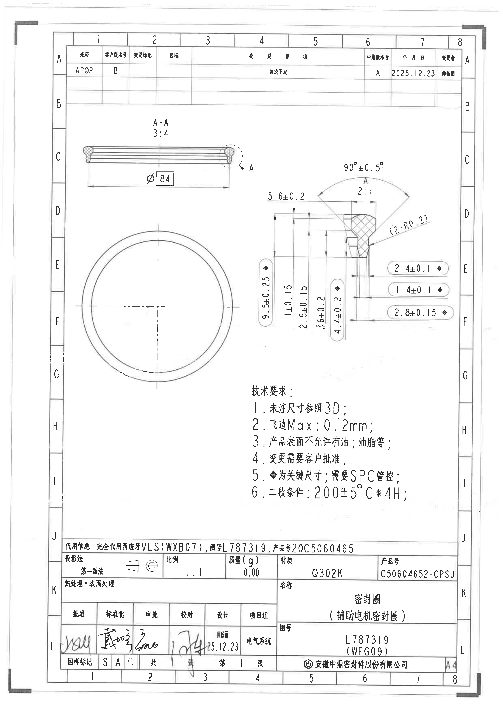
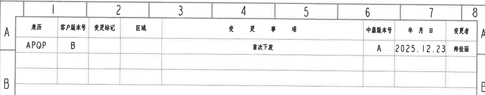
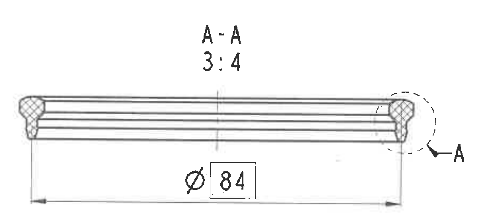
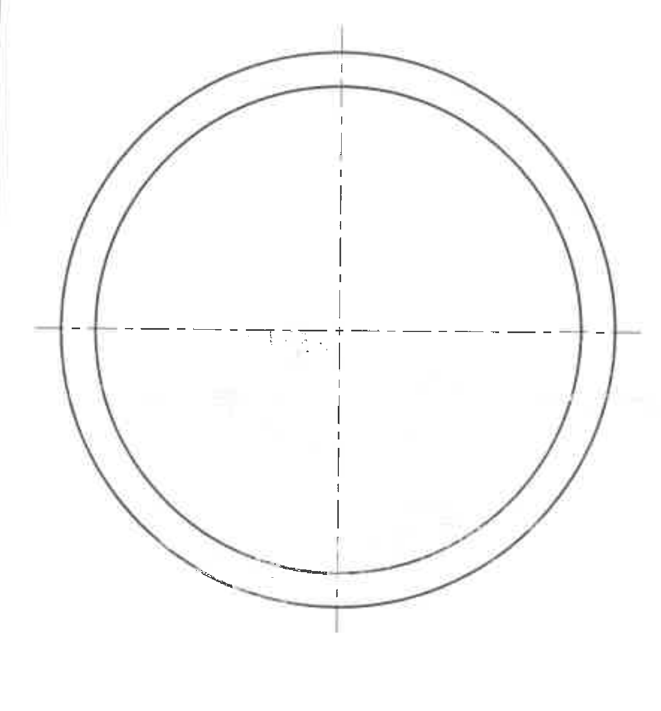
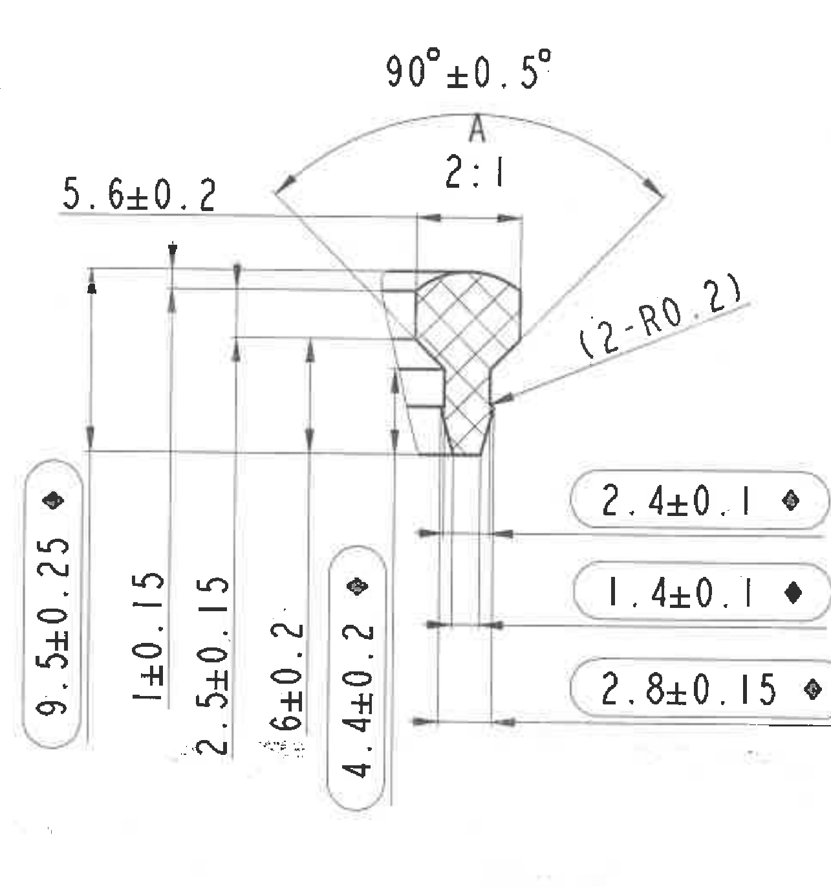
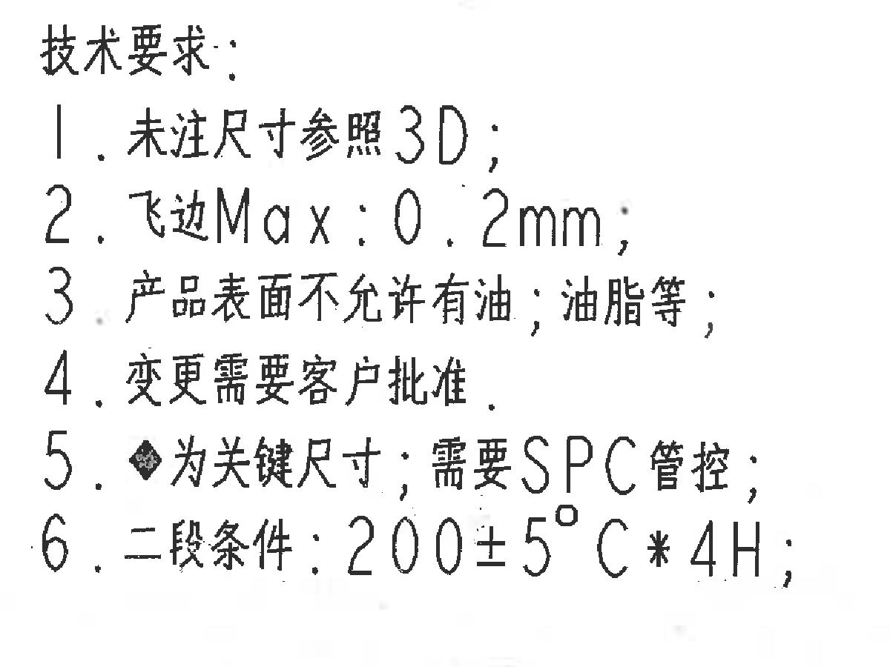
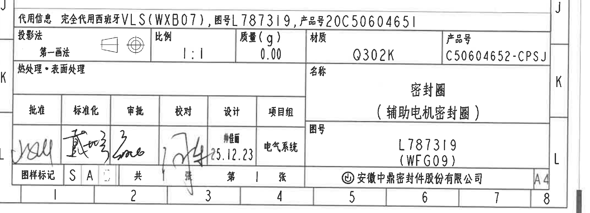

# 20C50604652 图纸内容识别

整页渲染图：`outputs/20C50604652_assets/images/page_1.png`，页面尺寸 3306 x 4673 px。

## object_1 - 顶部修订履历表

原图位置/视图名称：页面上部 A-B 行、1-8 列范围，修订履历表。

原表还原：

| 来历 | 客户版本号 | 变更标记 | 区域 | 变更事项 | 中鼎版本号 | 年月日 | 变更者 |
|---|---|---|---|---|---|---|---|
| APQP | B |  |  | 首次下发 | A | 2025.12.23 | 韩佳丽 |
|  |  |  |  |  |  |  |  |
|  |  |  |  |  |  |  |  |

提取表：

| 提取项 | 原图数值或文本 | 含义说明 |
|---|---|---|
| 表格类型 | 修订履历/变更履历 | 记录图纸版本、客户版本和变更信息。 |
| 来历 | APQP | 图纸来源/阶段标识。 |
| 客户版本号 | B | 客户侧版本号为 B。 |
| 变更标记 | 空白 | 本行未填写变更标记。 |
| 区域 | 空白 | 本行未填写变更区域。 |
| 变更事项 | 首次下发 | 表示该版本为首次下发。 |
| 中鼎版本号 | A | 中鼎内部版本号为 A。 |
| 年月日 | 2025.12.23 | 变更/下发日期。 |
| 变更者 | 韩佳丽 | 变更者字段文字；图面为扫描文本。 |

边界归属说明：裁切包含完整修订表外框、表头、首行记录和空白行；下方 A-A 剖视未进入该对象。表格内容仅归属修订履历，不归属加工视图。

## object_2 - A-A 剖视图

原图位置/视图名称：页面左上部 C-D 行附近，A-A 剖视图，比例 3:4。

提取表：

| 提取项 | 原图数值或文本 | 含义说明 |
|---|---|---|
| 视图名称 | A-A | 剖视图名称，表示沿 A-A 剖切后的截面视图。 |
| 比例 | 3:4 | 该剖视图绘制比例为 3:4。 |
| 直径尺寸 | φ84 | 环形零件直径尺寸；`φ` 表示直径，数字 84 带矩形框，原图未在该处另列公差。 |
| 剖切/局部标识 | A | 右端虚线圆和箭头标注 A，指向与右侧局部放大/剖面 A 的对应部位。 |
| 基准字母 | A | 图中 A 用作剖切/局部视图标识；未见独立基准框形式的 datum 标注。 |
| T 编号 | 未见 | 此视图内未发现 T 编号。 |

边界归属说明：裁切左、右端均完整包含剖面轮廓、剖面线、`φ84` 尺寸线、箭头和 A 标识；右侧没有混入局部放大视图的尺寸数字。`φ84` 归属 A-A 剖视图，不归属圆形视图或右侧局部 A。

## object_3 - 圆形主视/端面视图

原图位置/视图名称：页面左下部 E-G 行附近，圆形端面视图。

提取表：

| 提取项 | 原图数值或文本 | 含义说明 |
|---|---|---|
| 视图轮廓 | 两个同心圆 | 显示密封圈端面/俯视轮廓，内外圆同轴。 |
| 中心线 | 十字中心线 | 表示圆形零件中心和对称轴线。 |
| 尺寸文字 | 未见 | 此裁切对象内未见独立数字尺寸、角度、半径或公差文字。 |
| 基准字母 | 未见 | 此视图内未见独立基准字母或剖切字母。 |
| T 编号 | 未见 | 此视图内未发现 T 编号。 |

边界归属说明：裁切只包含圆形端面视图和中心线，未包含右侧技术要求文字，也未包含 A-A 剖视或局部 A 的尺寸。该视图中的圆形结构信息归属端面视图。

## object_4 - 局部/剖面 A 放大视图

原图位置/视图名称：页面右中部 C-F 行附近，局部/剖面 A，比例 2:1。

提取表：

| 提取项 | 原图数值或文本 | 含义说明 |
|---|---|---|
| 视图名称 | A | 与 A-A 剖视右端虚线圆和箭头 A 对应的局部/剖面放大视图。 |
| 比例 | 2:1 | 该局部放大视图绘制比例为 2:1。 |
| 弧向角度 | 90°±0.5° | 顶部弧形角度尺寸，带双向箭头；控制上部轮廓夹角。 |
| 水平/台阶尺寸 | 5.6±0.2 | 上部左侧引出的线性尺寸，控制局部结构的横向/台阶距离。 |
| 关键总高度 | 9.5±0.25 ◆ | 左侧带关键符号的竖向总高度尺寸；`◆` 按技术要求为关键尺寸，需要 SPC 管控。 |
| 竖向尺寸 | 1±0.15 | 左侧竖向尺寸，控制局部上部高度/台阶距离。 |
| 竖向尺寸 | 2.5±0.15 | 左侧竖向尺寸，控制中部台阶高度。 |
| 竖向尺寸 | 6±0.2 | 左侧竖向尺寸，控制局部截面高度范围。 |
| 关键竖向尺寸 | 4.4±0.2 ◆ | 靠近剖面右侧的竖向关键尺寸；`◆` 表示关键尺寸。 |
| 参考半径 | (2-R0.2) | 括号内参考尺寸；`2-` 表示两处，`R0.2` 表示半径 0.2，指向剖面过渡圆角。 |
| 关键水平尺寸 | 2.4±0.1 ◆ | 右侧上方圆角框内水平尺寸，带关键符号，控制对应宽度。 |
| 关键水平尺寸 | 1.4±0.1 ◆ | 右侧中间圆角框内水平尺寸，带关键符号，控制对应宽度。 |
| 关键水平尺寸 | 2.8±0.15 ◆ | 右侧下方圆角框内水平尺寸，带关键符号，控制对应宽度。 |
| 基准字母 | A | 此处 A 为局部/剖面视图标识；未见独立基准框形式的 datum 标注。 |
| T 编号 | 未见 | 此局部视图内未发现 T 编号。 |

边界归属说明：裁切完整包含局部 A 的剖面线、轮廓、角度弧线、半径引线、左侧竖向尺寸和右侧三个关键水平尺寸。左侧没有混入 A-A 剖视的尺寸，右侧没有混入图框或标题栏内容。上述尺寸均归属局部/剖面 A，不归属 A-A 剖视图或圆形主视图。

## object_5 - NOTES/技术要求

原图位置/视图名称：页面右下部 G-I 行附近，技术要求/NOTES。

原文本还原：

| 序号 | 原图文本 |
|---|---|
| 标题 | 技术要求: |
| 1 | 未注尺寸参照3D; |
| 2 | 飞边Max: 0.2mm; |
| 3 | 产品表面不允许有油，油脂等; |
| 4 | 变更需要客户批准. |
| 5 | ◆为关键尺寸，需要SPC管控; |
| 6 | 二段条件: 200±5°C*4H; |

提取表：

| 提取项 | 原图数值或文本 | 含义说明 |
|---|---|---|
| 未注尺寸要求 | 未注尺寸参照3D | 图纸未单独标注的尺寸按 3D 数据执行。 |
| 飞边要求 | 飞边Max: 0.2mm | 飞边最大允许值为 0.2 mm。 |
| 表面状态 | 产品表面不允许有油，油脂等 | 产品表面不得有油、油脂等污染物。 |
| 变更控制 | 变更需要客户批准 | 图纸或产品变更需要客户批准。 |
| 关键尺寸符号 | ◆为关键尺寸，需要SPC管控 | 带 `◆` 的尺寸为关键尺寸，并需要 SPC 管控。 |
| 二段条件 | 200±5°C*4H | 二段处理条件为 200±5°C，持续 4H。 |

边界归属说明：裁切完整包含技术要求标题和 1-6 条文本；未包含右侧局部 A 的尺寸，也未包含标题栏表格。关键尺寸符号说明适用于图中带 `◆` 的尺寸。

## object_6 - 标题栏

原图位置/视图名称：页面底部 J-L 行、1-8 列范围，标题栏。

标题栏原表还原：

| 字段 | 内容 |
|---|---|
| 代用信息 | 完全代用西班牙VLS(WXB07), 图号L787319, 产品号20C50604651 |

| 投影法 | 图示 | 比例 | 质量(g) | 材质 | 产品号 |
|---|---|---|---|---|---|
| 第一画法 | 第一角投影符号 | 1:1 | 0.00 | Q302K | C50604652-CPSJ |

| 热处理・表面处理 | 名称 |
|---|---|
| 空白 | 密封圈（辅助电机密封圈） |

| 审签字段 | 批准 | 标准化 | 审批 | 校对 | 设计 | 项目组 |
|---|---|---|---|---|---|---|
| 原图内容 | 手写签名，扫描件不易可靠转写 | 手写签名，扫描件不易可靠转写 | 手写签名，扫描件不易可靠转写 | 手写签名，扫描件不易可靠转写 | 韩佳丽 25.12.23 | 电气系统 |

| 字段 | 内容 |
|---|---|
| 图号 | L787319 (WFG09) |
| 图样标记 | S A |
| 张数 | 共 1 张，第 1 张 |
| 公司 | 安徽中鼎密封件股份有限公司 |
| 图幅 | A4 |

提取表：

| 提取项 | 原图数值或文本 | 含义说明 |
|---|---|---|
| 代用信息 | 完全代用西班牙VLS(WXB07), 图号L787319, 产品号20C50604651 | 说明本图与代用对象及对应图号、产品号的关系。 |
| 投影法 | 第一画法 | 图纸投影方式为第一角法。 |
| 比例 | 1:1 | 标题栏总比例为 1:1。 |
| 质量(g) | 0.00 | 标题栏记录质量为 0.00 g。 |
| 材质 | Q302K | 零件材料为 Q302K。 |
| 产品号 | C50604652-CPSJ | 本标题栏主产品号。 |
| 名称 | 密封圈（辅助电机密封圈） | 零件名称和括号内用途说明。 |
| 图号 | L787319 (WFG09) | 图号及括号内补充编号。 |
| 设计 | 韩佳丽 25.12.23 | 设计栏文字和日期。 |
| 项目组 | 电气系统 | 项目组字段内容。 |
| 图样标记 | S A | 标题栏底部图样标记。 |
| 张数 | 共 1 张，第 1 张 | 本文件为 1 张中的第 1 张。 |
| 公司 | 安徽中鼎密封件股份有限公司 | 出图/所属公司。 |
| 图幅 | A4 | 图纸幅面为 A4。 |

边界归属说明：裁切完整包含标题栏表格、代用信息、产品号、材质、名称、图号、审签栏、公司和 A4 图幅栏；左侧手写签名和右侧图幅栏均未被截断。标题栏内容不归属任何加工视图，标题栏中的比例 1:1 与局部视图比例 2:1、A-A 比例 3:4 分别独立。

## 裁切检查记录

| 图片 | bbox[x0,y0,x1,y1] | 检查结果 | 归属/重裁记录 |
|---|---:|---|---|
| page_1.png | [0,0,3306,4673] | 完整整页渲染，包含图框、全部视图、表格、技术要求和标题栏。 | 作为裁切母图。 |
| object_1.png | [350,205,3080,745] | 修订履历表外框、表头、首行和空白行完整，文字未截断。 | 未带入 A-A 剖视；归属表格。 |
| object_2.png | [500,720,1730,1280] | A-A 视图、`φ84` 尺寸线、箭头、A 标识完整。 | 初裁右侧带入相邻数字，已收紧右边界重裁；最终未混入局部 A。 |
| object_3.png | [430,1425,1610,2695] | 圆形轮廓和中心线完整。 | 初裁右侧带入技术要求局部文字，已收紧右边界重裁；最终仅归属圆形端面视图。 |
| object_4.png | [1665,990,2950,2360] | 局部 A 的尺寸线、箭头、角度弧线、半径引线和全部尺寸文字完整。 | 初裁左上接近 A-A 标识，已右移左边界重裁；最终尺寸归属局部 A。 |
| object_5.png | [1600,2500,2800,3400] | 技术要求 1-6 条文字完整。 | 未带入局部 A 尺寸或标题栏。 |
| object_6.png | [340,3500,3200,4535] | 标题栏全宽、左侧手写签名、右侧 A4 栏和底部栏完整。 | 初裁左侧签名略贴边，已外扩左边界重裁；最终归属标题栏。 |
