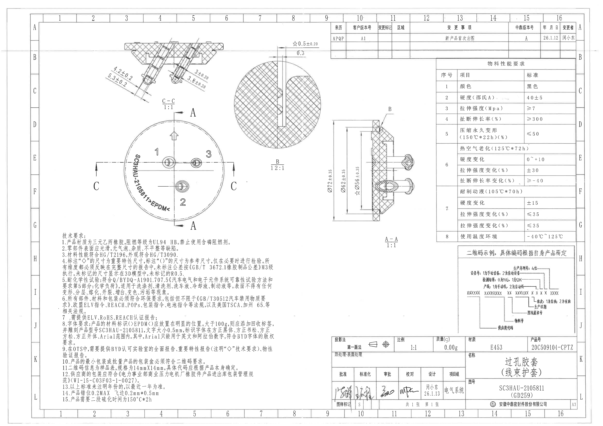
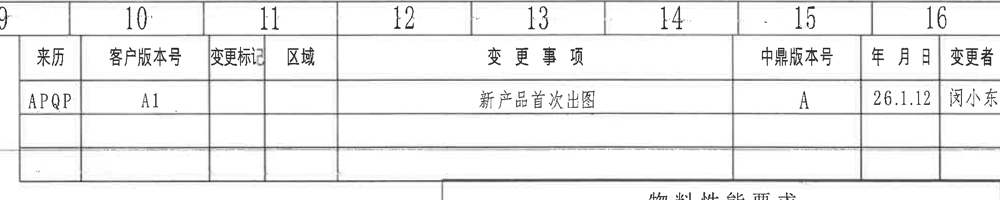
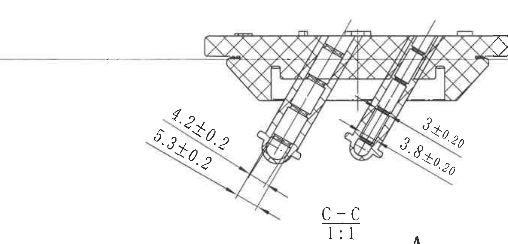
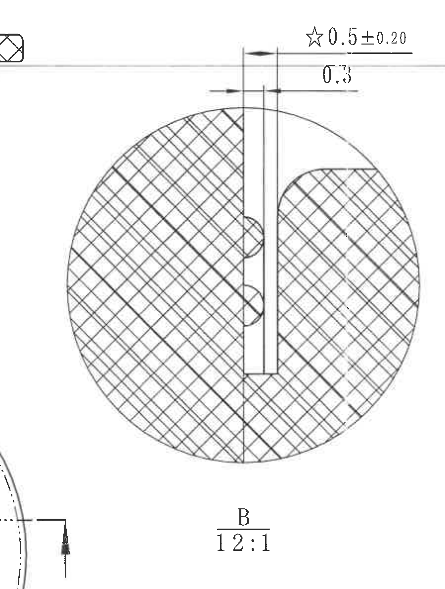
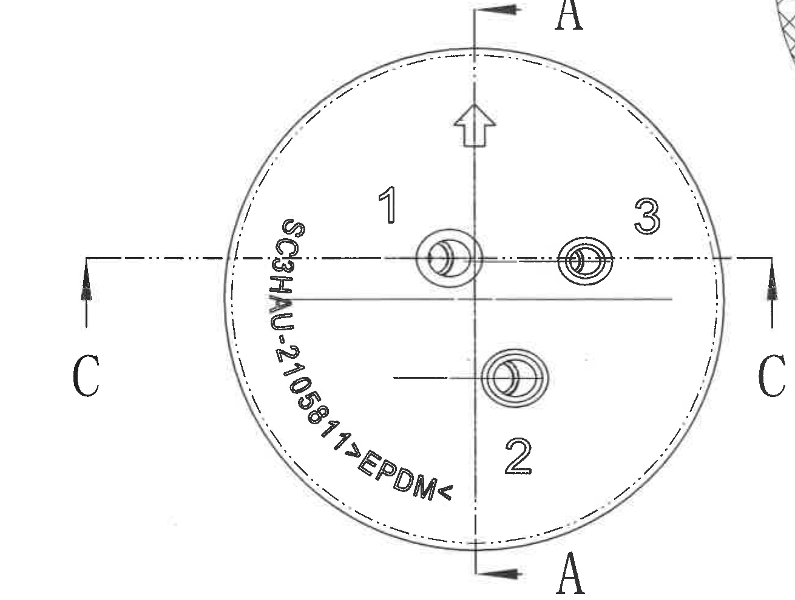
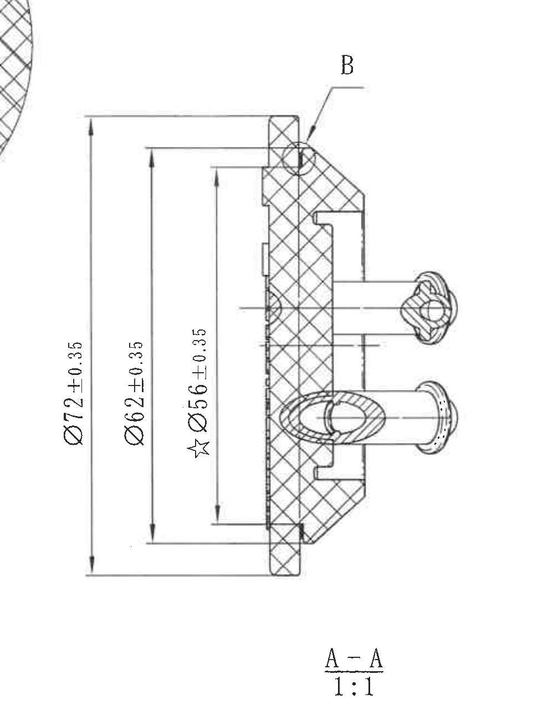
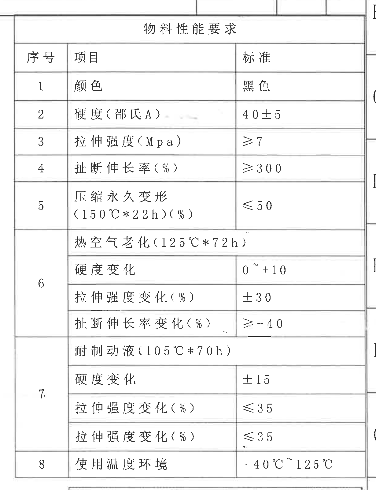
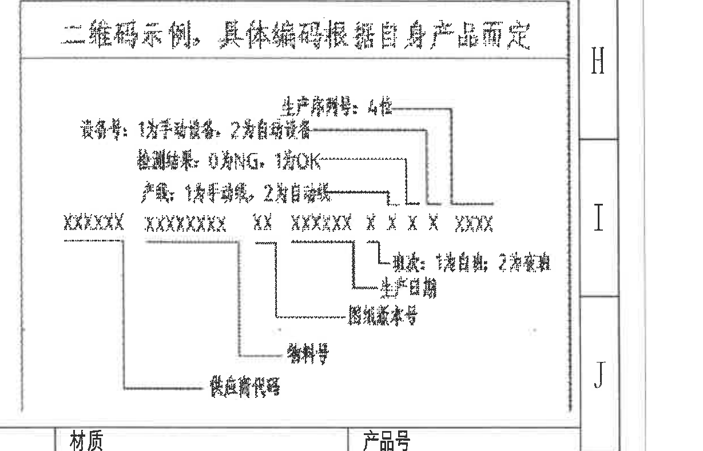
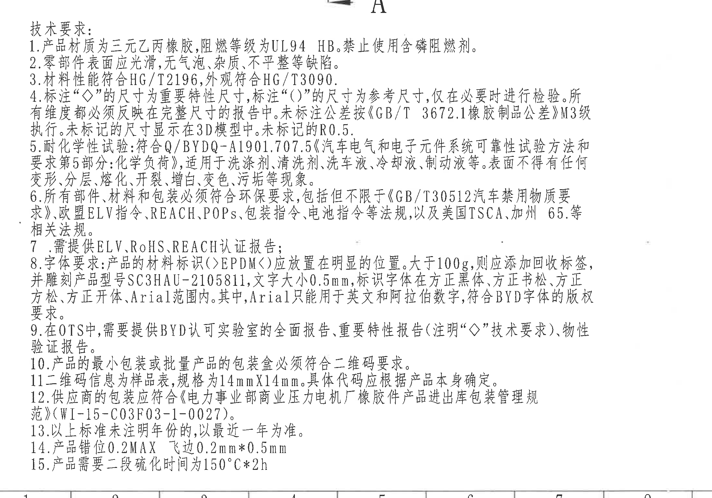
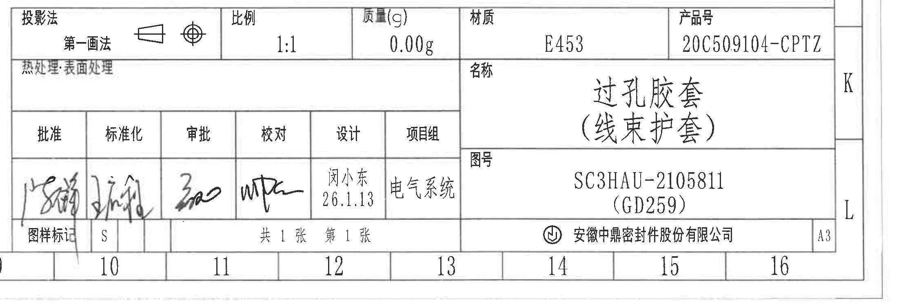

# 20C509104 图纸内容识别

## 整页渲染

- 原图位置：第 1 页整页，渲染尺寸 4959 x 3505 px。
- 说明：PDF 先渲染为整页 PNG，再按加工视图、剖面视图、局部视图、表格、技术要求、标题栏分别裁切。

## object_9 - 顶部变更履历表

- 原图位置/视图名称：第 1 页顶部右侧，图框列 9-16 下方的变更履历表。
- object_kind：table

### 原表还原

| 来历 | 客户版本号 | 变更标记 | 区域 | 变更事项 | 中鼎版本号 | 年月日 | 变更者 |
|---|---|---|---|---|---|---|---|
| APQP | A1 |  |  | 新产品首次出图 | A | 26.1.12 | 闵小东 |
|  |  |  |  |  |  |  |  |
|  |  |  |  |  |  |  |  |

### 提取表格

| 提取项 | 原图数值或文本 | 含义说明 |
|---|---|---|
| 表名/区域 | 变更履历表 | 记录图纸版本、变更事项和责任人。 |
| 来历 | APQP | 来源/开发流程阶段。 |
| 客户版本号 | A1 | 客户侧版本号。 |
| 变更事项 | 新产品首次出图 | 表示此版为新产品首次出图。 |
| 中鼎版本号 | A | 中鼎内部版本号。 |
| 年月日 | 26.1.12 | 出图或变更日期，按原图格式转录。 |
| 变更者 | 闵小东 | 变更责任人。 |

### 边界归属说明

顶部图框坐标 9-16 和下方物料性能表上边缘可见，但不属于本表；本对象仅提取变更履历表内部字段。

## object_1 - C-C 剖面视图

- 原图位置/视图名称：第 1 页左上区域，C-C 剖面，比例 1:1。
- object_kind：section

### 提取表格

| 提取项 | 原图数值或文本 | 含义说明 |
|---|---|---|
| 视图名称 | C-C | 来自主视图水平 C-C 剖切线的剖面视图。 |
| 比例 | 1:1 | 该剖面按图纸实比例绘制。 |
| 左侧倾斜结构尺寸 1 | 4.2±0.2 | 左侧倾斜孔/柱状结构沿斜向的尺寸，带双向公差。 |
| 左侧倾斜结构尺寸 2 | 5.3±0.2 | 左侧倾斜结构相邻斜向尺寸，带双向公差。 |
| 右侧倾斜结构尺寸 1 | 3±0.20 | 右侧倾斜孔/柱状结构沿斜向的尺寸，带双向公差。 |
| 右侧倾斜结构尺寸 2 | 3.8±0.20 | 右侧倾斜结构相邻斜向尺寸，带双向公差。 |
| 剖面填充 | 交叉剖面线 | 表示被 C-C 剖切穿过的胶套实体材料。 |
| 角度/弧度/弧向尺寸 | 未见独立标注 | 本裁切内没有角度、弧度或弧向尺寸文字。 |
| 直径符号/数量前缀/T 编号 | 未见 | 本裁切内未出现 Φ、2X/3X 等数量前缀或 T 编号。 |

### 边界归属说明

C-C 比例文字下方露出主视图 A 剖切标识的顶部边缘，该 A 标识归属 object_2 主视图，不作为 C-C 剖面提取项；右侧未提取 B 局部视图内容。

## object_3 - B 局部放大视图

- 原图位置/视图名称：第 1 页上部中间，B 局部放大，比例 12:1。
- object_kind：detail

### 提取表格

| 提取项 | 原图数值或文本 | 含义说明 |
|---|---|---|
| 视图名称 | B | 由 A-A 剖视中 B 引出线索引的局部放大视图。 |
| 比例 | 12:1 | 对局部细槽/边缘结构进行 12 倍放大显示。 |
| 关键尺寸 | ☆0.5±0.20 | 带星号的关键尺寸，控制局部槽/薄壁间距，含 ±0.20 公差。 |
| 局部尺寸 | 0.3 | 局部台阶/间隙尺寸；原图未给单独公差。 |
| 剖面填充 | 交叉剖面线 | 表示该局部放大区域为橡胶实体截面。 |
| 角度/弧度/弧向尺寸 | 未见独立标注 | 圆形放大区域有圆弧轮廓，但没有数值化弧度或弧向尺寸。 |
| 直径符号/数量前缀/T 编号 | 未见 | 本裁切内未出现 Φ、数量前缀或 T 编号。 |

### 边界归属说明

为完整包含 “B 12:1” 和顶部尺寸线，裁切左下角带入主视图 C 剖切箭头片段，左上角带入 C-C 剖面极小边缘；这些片段不属于 B 局部放大视图，未提取为本对象内容。

## object_2 - 圆形主视图

- 原图位置/视图名称：第 1 页左中区域，圆形主视图。
- object_kind：view

### 提取表格

| 提取项 | 原图数值或文本 | 含义说明 |
|---|---|---|
| 外形 | 圆形外轮廓、内侧虚线圆 | 显示胶套的平面外形和内侧参考/隐藏轮廓。 |
| 剖切索引 | A-A | 竖向剖切线及上下 A 字母，对应 object_4 A-A 剖视。 |
| 剖切索引 | C-C | 横向剖切线及左右 C 字母，对应 object_1 C-C 剖视。 |
| 方向箭头 | 圆内上向箭头 | 表示装配或观察方向标识。 |
| 孔位/局部编号 | 1、2、3 | 标识三个孔位或局部结构区域。 |
| 材料/产品标识 | SC3HAU-2105811>EPDM< | 沿圆弧布置的产品型号和材料标识。 |
| 数值尺寸 | 未见独立数值尺寸 | 主视图内没有单独的数字尺寸；相关直径、关键尺寸在 A-A、B、C-C 中给出。 |
| 角度/弧度/弧向尺寸 | 未见独立标注 | 圆弧轮廓没有数值化角度、弧度或弧向尺寸。 |
| 直径符号/数量前缀/T 编号 | 未见 | 本裁切内未出现 Φ、数量前缀或 T 编号。 |

### 边界归属说明

右上角可见 B 局部放大圆边的极窄片段，归属 object_3；主视图只提取圆形视图、A/C 剖切索引、孔位编号和弧形材料标识。

## object_4 - A-A 剖面视图

- 原图位置/视图名称：第 1 页中右区域，A-A 剖面，比例 1:1。
- object_kind：section

### 提取表格

| 提取项 | 原图数值或文本 | 含义说明 |
|---|---|---|
| 视图名称 | A-A | 来自主视图竖向 A-A 剖切线的剖面视图。 |
| 比例 | 1:1 | 该剖面按图纸实比例绘制。 |
| 总外径/总高度方向尺寸 | Φ72±0.35 | 剖视中最大圆形外廓对应的直径尺寸，带 ±0.35 公差。 |
| 中间直径尺寸 | Φ62±0.35 | 剖视中次级台阶/圆形轮廓对应直径，带 ±0.35 公差。 |
| 关键直径尺寸 | ☆Φ56±0.35 | 带星号的关键直径尺寸，带 ±0.35 公差。 |
| 局部索引 | B | 引出线指向上部局部，关联 object_3 B 局部放大视图。 |
| 剖面填充 | 交叉剖面线 | 表示 A-A 剖切穿过的橡胶实体材料。 |
| 角度/弧度/弧向尺寸 | 未见独立标注 | 本裁切内没有角度、弧度或弧向尺寸文字。 |
| 数量前缀/T 编号 | 未见 | 本裁切内未出现 2X/3X 等数量前缀或 T 编号。 |

### 边界归属说明

左上角带入 B 局部放大圆形边缘的极小片段，归属 object_3；右侧物料性能表已排除。本对象只提取 A-A 剖视内的 Φ72、Φ62、☆Φ56 尺寸和 B 局部索引。

## object_5 - 物料性能要求表

- 原图位置/视图名称：第 1 页右侧中上，物料性能要求表。
- object_kind：table

### 原表还原

| 序号 | 项目 | 标准 |
|---|---|---|
| 1 | 颜色 | 黑色 |
| 2 | 硬度（邵氏A） | 40±5 |
| 3 | 拉伸强度（Mpa） | ≥7 |
| 4 | 扯断伸长率（%） | ≥300 |
| 5 | 压缩永久变形（150℃*22h）（%） | ≤50 |
| 6 | 热空气老化（125℃*72h） |  |
| 6 | 硬度变化 | 0~+10 |
| 6 | 拉伸强度变化（%） | ±30 |
| 6 | 扯断伸长率变化（%） | ≥-40 |
| 7 | 耐制动液（105℃*70h） |  |
| 7 | 硬度变化 | ±15 |
| 7 | 拉伸强度变化（%） | ≤35 |
| 7 | 拉伸强度变化（%） | ≤35 |
| 8 | 使用温度环境 | -40℃~125℃ |

### 提取表格

| 提取项 | 原图数值或文本 | 含义说明 |
|---|---|---|
| 表名 | 物料性能要求 | 规定材料颜色、硬度、强度、老化、耐介质和使用温度要求。 |
| 表头 | 序号、项目、标准 | 原表三列表头。 |
| 第 2 项 | 硬度（邵氏A）=40±5 | 材料邵氏 A 硬度要求。 |
| 第 3 项 | 拉伸强度（Mpa）≥7 | 材料拉伸强度下限。 |
| 第 4 项 | 扯断伸长率（%）≥300 | 材料断裂伸长率下限。 |
| 第 5 项 | 压缩永久变形（150℃*22h）（%）≤50 | 高温压缩永久变形上限。 |
| 第 6 项 | 热空气老化（125℃*72h） | 热空气老化条件。 |
| 第 7 项 | 耐制动液（105℃*70h） | 制动液耐受试验条件。 |
| 第 8 项 | 使用温度环境 -40℃~125℃ | 零件工作温度范围。 |

### 边界归属说明

右侧图框坐标字母边缘可见，但不属于物料性能表字段；底部二维码示例未进入本表提取范围。第 7 项最后两行原图均显示为“拉伸强度变化（%）”，按原图可见文字还原。

## object_6 - 二维码示例说明图

- 原图位置/视图名称：第 1 页右下，二维码示例说明。
- object_kind：table

### 原表/示意还原

| 区域 | 原图文本 |
|---|---|
| 标题 | 二维码示例，具体编码根据自身产品而定 |
| 顶部字段 | 生产材料：4位 |
| 说明字段 | 设备号：1类平衡线名，2类自动设备 |
| 说明字段 | 检测结果：0为NG，1为OK |
| 说明字段 | 序号：1位平衡线，2类自读数 |
| 编码示例 | XXXXXX XXXXXXXX XX XXXXXX X X X X XXXX |
| 引线说明 | 班次：1类白班，2类夜班 |
| 引线说明 | 生产日期 |
| 引线说明 | 供应商条码号 |
| 引线说明 | 物料号 |
| 引线说明 | 线束件代号 |

### 提取表格

| 提取项 | 原图数值或文本 | 含义说明 |
|---|---|---|
| 标题 | 二维码示例，具体编码根据自身产品而定 | 说明二维码结构仅为示例，实际编码按产品确定。 |
| 编码占位 | XXXXXX、XXXXXXXX、XX、XXXXXX、X X X X、XXXX | 用 X 表示不同长度的编码段。 |
| 生产材料字段 | 4位 | 表示生产材料相关字段长度为 4 位。 |
| 检测结果字段 | 0为NG，1为OK | 表示二维码中检测结果编码含义。 |
| 班次字段 | 1类白班，2类夜班 | 表示班次编码含义。 |
| 关联字段 | 生产日期、供应商条码号、物料号、线束件代号 | 引线指向二维码各编码段。 |

### 边界归属说明

底部带入标题栏“材质/产品号”上边缘，右侧带入图框坐标 H/I/J，均不属于二维码说明；本对象只提取框内二维码示例文字和引线字段。该区域扫描较模糊，按可辨识字形转录。

## object_7 - 技术要求/NOTES

- 原图位置/视图名称：第 1 页左下，技术要求。
- object_kind：notes

### 提取表格

| 提取项 | 原图数值或文本 | 含义说明 |
|---|---|---|
| 标题 | 技术要求 | 零件材料、外观、试验、标识、包装和未注要求说明。 |
| 1 | 产品材质为三元乙丙橡胶，阻燃等级为UL94 HB。禁止使用含磷阻燃剂。 | 材料和阻燃要求。 |
| 2 | 零部件表面应光滑，无气泡、杂质、不平整等缺陷。 | 外观缺陷要求。 |
| 3 | 材料性能符合HG/T2196，外观符合HG/T3090。 | 材料和外观适用标准。 |
| 4 | 标注“◇”的尺寸为重要特性尺寸，标注“()”的尺寸为参考尺寸，仅在必要时进行检验。所有维度都必须反映在完整尺寸的报告中。未标注公差按《GB/T 3672.1橡胶制品公差》M3级执行。未标记的尺寸显示在3D模型中。未标记的R0.5。 | 关键尺寸、参考尺寸、未注公差和未注圆角规则。 |
| 5 | 耐化学性试验：符合Q/BYDQ-A1901.707.5《汽车电气和电子元件系统可靠性试验方法和要求第5部分：化学负荷》，适用于洗涤剂、清洗剂、洗车液、冷却液、制动液等。表面不得有任何变形、分层、溶化、开裂、增白、变色、污垢等现象。 | 耐化学试验和判定要求。 |
| 6 | 所有部件、材料和包装必须符合环保要求，包括但不限于《GB/T30512汽车禁用物质要求》、欧盟ELV指令、REACH、POPs、包装指令、电池指令等法规，以及美国TSCA、加州65等相关法规。 | 环保法规要求。 |
| 7 | 需提供ELV、RoHS、REACH认证报告； | 认证报告要求。 |
| 8 | 字体要求：产品的材料标识(>EPDM<)应放置在明显的位置。大于100g，则应添加回收标签，并雕刻产品型号SC3HAU-2105811，文字大小0.5mm，标识字体在方正黑体、方正书宋、方正仿宋、方正楷体、Arial范围内。其中，Arial只能用于英文和阿拉伯数字，符合BYD字体的版权要求。 | 标识内容、位置、重量阈值、字体和 0.5mm 字高要求。 |
| 9 | 在OTS中，需要提供BYD认可实验室的全面报告、重要特性报告(注明“◇”技术要求)、物性验证报告。 | OTS 阶段报告要求。 |
| 10 | 产品的最小包装或批量产品的包装盒必须符合二维码要求。 | 包装二维码要求。 |
| 11 | 二维码信息为样品表，规格为14mmX14mm。具体代码应根据产品本身确定。 | 二维码规格和编码依据。 |
| 12 | 供应商的包装应符合《电力事业部商业压力电机厂橡胶件产品进出库包装管理规范》(WI-15-C03F03-1-0027)。 | 供应商包装规范。 |
| 13 | 以上标准未注明年份的，以最近一年为准。 | 标准年份适用规则。 |
| 14 | 产品错位0.2MAX，飞边0.2mm*0.5mm | 成型错位和飞边限值。 |
| 15 | 产品需要二段硫化时间为150℃*2h | 二段硫化工艺条件。 |

### 边界归属说明

顶部可见主视图 A 剖切标识边缘，底部可见图框坐标线；二者不属于技术要求正文。object_7 仅提取标题“技术要求”和 1-15 条正文。

## object_8 - 标题栏

- 原图位置/视图名称：第 1 页右下标题栏。
- object_kind：title_block

### 提取表格

| 提取项 | 原图数值或文本 | 含义说明 |
|---|---|---|
| 投影法 | 第一画法 | 图纸采用第一角法投影，旁有投影符号。 |
| 比例 | 1:1 | 图纸主比例。 |
| 质量(g) | 0.00g | 标题栏质量字段。 |
| 材质 | E453 | 零件材料牌号/材料代码。 |
| 产品号 | 20C509104-CPTZ | 产品号。 |
| 热处理/表面处理 | 热处理: 表面处理 | 标题栏处理字段，原图未见具体处理值。 |
| 名称 | 过孔胶套（线束护套） | 零件名称。 |
| 图号 | SC3HAU-2105811 (GD259) | 图纸/零件图号及括号内代号。 |
| 批准 | 手写签名 | 批准栏为手写签名，图像未能稳定辨识姓名。 |
| 标准化 | 手写签名 | 标准化栏为手写签名，图像未能稳定辨识姓名。 |
| 审批 | 手写签名 | 审批栏为手写签名，图像未能稳定辨识姓名。 |
| 校对 | 手写签名 | 校对栏为手写签名，图像未能稳定辨识姓名。 |
| 设计 | 闵小东 26.1.13 | 设计人员和日期。 |
| 项目组 | 电气系统 | 项目组名称。 |
| 图样标记 | S | 图样标记字段。 |
| 张数 | 共1张 第1张 | 图纸张数信息。 |
| 公司 | 安徽中鼎密封件股份有限公司 | 出图公司。 |
| 图幅 | A3 | 图幅规格。 |

### 边界归属说明

右侧 K/L 图框坐标、底部 10-16 图框坐标进入裁切，但不属于标题栏字段；标题栏提取仅覆盖内部表格和公司/图幅信息。

## 裁切检查记录

| 对象 | 检查结论 | 边界完整性与归属处理 |
|---|---|---|
| page_1.png | 完整 | 整页 PNG 渲染完整，尺寸 4959 x 3505 px。 |
| object_1.png | 完整包含 C-C 剖面尺寸线和文字 | 为保留 “C-C 1:1”，底部露出主视图 A 标识极小边缘；已明确排除为 object_2 内容。 |
| object_2.png | 完整包含主视图圆形轮廓、A/C 剖切索引和材料标识 | 右上角有 B 局部视图极窄圆边；未提取该片段。 |
| object_3.png | 完整包含 B 视图、☆0.5±0.20、0.3 和 B 12:1 | 左下主视图 C 剖切箭头和左上 C-C 边缘片段为邻接内容；已排除。 |
| object_4.png | 完整包含 A-A 剖面、Φ72±0.35、Φ62±0.35、☆Φ56±0.35 和 A-A 1:1 | 右侧表格已排除；左上 B 局部视图边缘片段已排除。 |
| object_5.png | 完整包含物料性能要求表 1-8 项 | 右侧图框坐标字母不是表格字段；未提取。 |
| object_6.png | 完整包含二维码示例框、标题、编码占位和引线说明 | 底部标题栏上边缘和右侧图框坐标不属于二维码说明；未提取。该区扫描模糊，按可辨识内容转录。 |
| object_7.png | 完整包含技术要求 1-15 条 | 顶部 A 剖切标识边缘和底部图框坐标线不属于 NOTES；未提取。 |
| object_8.png | 完整包含标题栏字段 | 右侧 K/L 与底部 10-16 图框坐标不属于标题栏字段；未提取。 |
| object_9.png | 完整包含顶部变更履历表行列 | 顶部 9-16 图框坐标和下方物料表上边缘不属于变更表；未提取。 |
