# 20C70422858 内容识别结果

整页渲染 PNG：

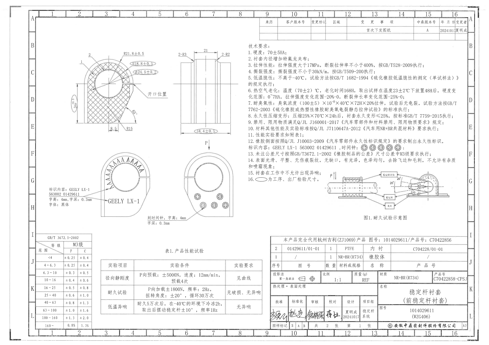

整页 PNG 尺寸：4959 x 3505 px。以下裁切对象按原图区域分组，bbox 以整页 PNG 左上角为原点，格式为 `[x1, y1, x2, y2]`。

## object_1 主剖面加工视图

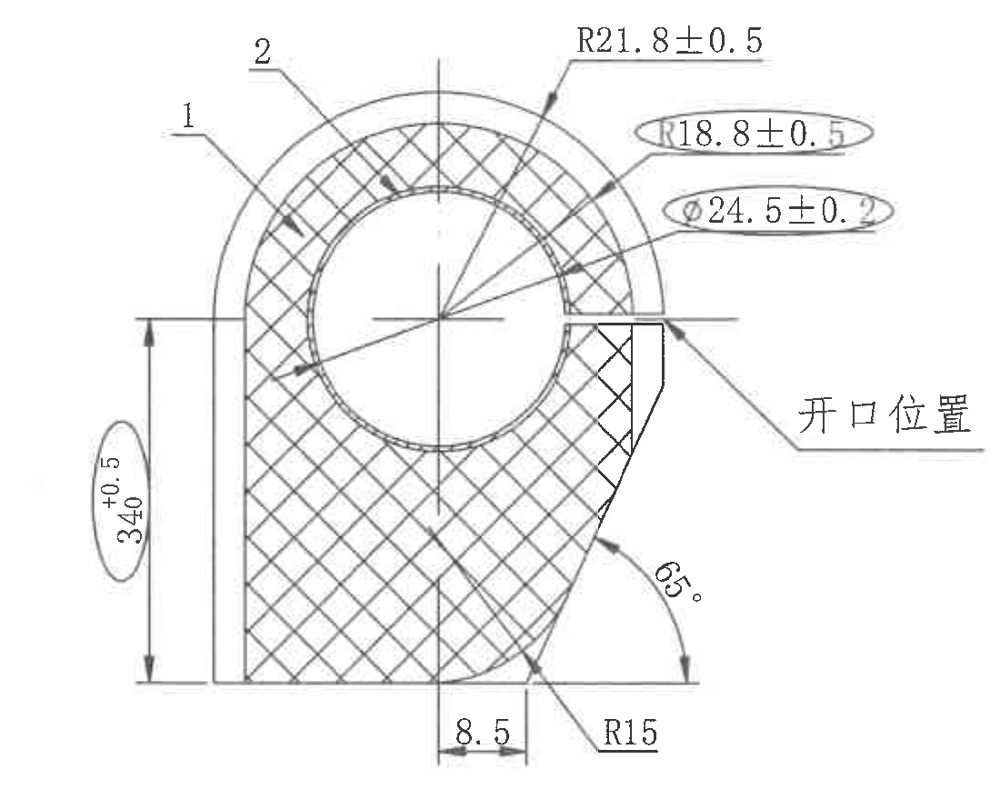

原图位置/视图名称：页 1 左上主剖面加工视图，bbox `[620, 500, 1720, 1390]`。

| 提取项 | 原图数值或文本 | 含义说明 |
|---|---|---|
| 部位编号 | 1 | 引出线指向剖面左上外层/橡胶体区域；为图中零件部位编号。 |
| 部位编号 | 2 | 引出线指向上部衬套/内衬附近；为图中零件部位编号。 |
| 外侧圆弧半径 | R21.8±0.5 | 上部外圆弧半径尺寸，带正负公差。 |
| 工序/出厂检验圆弧半径 | R18.8±0.5 | 椭圆圈出，按 NOTES 第 16 条为工序、出厂检验尺寸；指向内侧圆弧半径。 |
| 工序/出厂检验内径 | Ø24.5±0.2 | 椭圆圈出，按 NOTES 第 16 条为工序、出厂检验尺寸；直径符号 Ø 表示孔径/内径。 |
| 工序/出厂检验总高度 | 34 +0.5/0 | 左侧竖向尺寸，椭圆圈出；上偏差 +0.5、下偏差 0，表示该剖面高度控制尺寸。 |
| 底部偏置/局部宽度 | 8.5 | 底部靠中心竖线的水平尺寸，控制底部台阶/偏置距离。 |
| 底部圆角 | R15 | 右下过渡圆角半径。 |
| 斜边角度 | 65° | 右侧斜边相对底边的角度，带角度弧线和箭头。 |
| 结构说明 | 开口位置 | 引出线指向右侧开口，说明开口所在方向和区域。 |
| 剖面表达 | 交叉剖面线 | 表示该区域为剖切实体材料。 |
| 未见项目 | 星号关键尺寸、括号参考尺寸、基准字母、T 编号、弧度制角度 | 本裁切视图中未见这些标注。 |

边界归属说明：右侧裁切到“开口位置”引出文字后停止，未把右侧侧视图尺寸归入本对象；本对象仅提取剖面中的尺寸线、箭头、椭圆检验尺寸和开口说明。

## object_2 侧向宽度加工视图

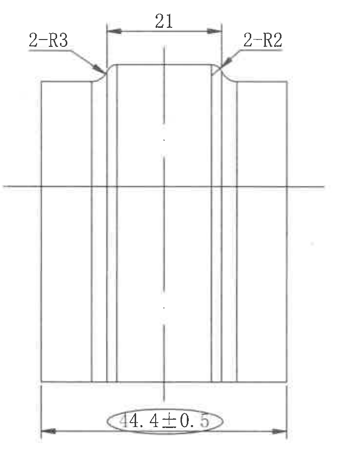

原图位置/视图名称：页 1 上部偏左侧视图，bbox `[1750, 470, 2490, 1390]`。

| 提取项 | 原图数值或文本 | 含义说明 |
|---|---|---|
| 左上圆角数量前缀 | 2-R3 | 左上两处 R3 圆角，`2-` 表示数量为 2。 |
| 上部槽宽/内距 | 21 | 顶部两内侧竖向边之间的水平距离。 |
| 右上圆角数量前缀 | 2-R2 | 右上两处 R2 圆角，`2-` 表示数量为 2。 |
| 工序/出厂检验总宽 | 44.4±0.5 | 底部水平总宽尺寸，椭圆圈出；按 NOTES 第 16 条为工序、出厂检验尺寸。 |
| 中心线 | 水平中心线、竖向中心线 | 表示该视图的对称/中心基准线；不是单独尺寸。 |
| 未见项目 | 星号关键尺寸、括号参考尺寸、基准字母、T 编号 | 本裁切视图中未见这些标注。 |

边界归属说明：右侧边界收在视图外轮廓后，未带入 NOTES 文本；底部 `44.4±0.5` 的完整尺寸线、箭头和文字均在本对象内。

## object_3 标识内容局部视图

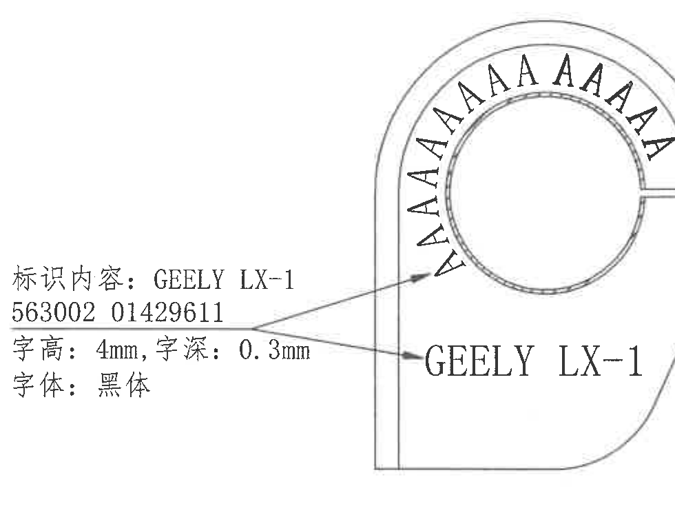

原图位置/视图名称：页 1 左中局部标识视图，bbox `[480, 1520, 1460, 2280]`。

| 提取项 | 原图数值或文本 | 含义说明 |
|---|---|---|
| 标识内容 | GEELY LX-1 / 563002 01429611 | 左侧说明框给出的永久标识内容。 |
| 字高 | 4mm | 标识文字高度。 |
| 字深 | 0.3mm | 标识刻印深度。 |
| 字体 | 黑体 | 标识字体要求。 |
| 视图内示例文字 | GEELY LX-1 | 零件侧面标识的图面示例。 |
| 圆弧排列示意 | 多个 A 字符沿上部圆弧排列 | 表示标识/字样沿圆弧排布的示意。 |
| 未见项目 | 几何尺寸、星号关键尺寸、括号参考尺寸、基准字母、T 编号 | 本裁切对象为标识局部视图，无额外几何尺寸线。 |

边界归属说明：右侧未纳入相邻“刻时间钟”局部说明，底部未纳入公差表；本对象只提取标识内容、字高、字深、字体和该局部视图内的标识示意。

## object_4 刻时间钟局部视图

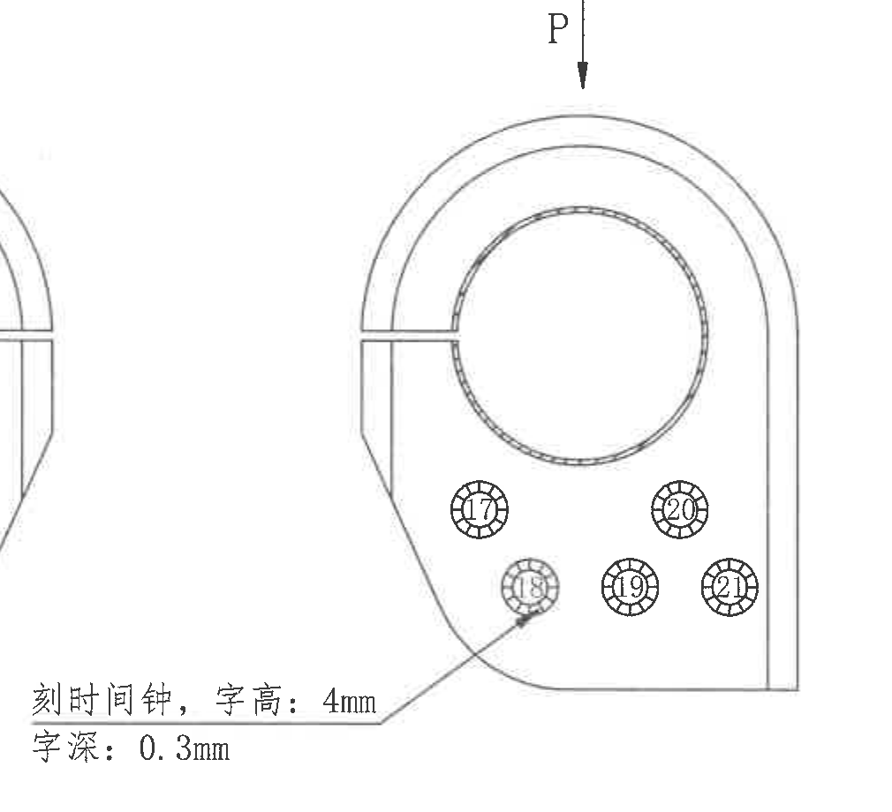

原图位置/视图名称：页 1 中下偏左刻时间钟局部视图，bbox `[1460, 1420, 2470, 2340]`。

| 提取项 | 原图数值或文本 | 含义说明 |
|---|---|---|
| 载荷方向标识 | P | 顶部箭头向下，表示该局部图中 P 方向载荷/方向示意。 |
| 时间钟标识 | 17 | 圆形时间钟标记之一。 |
| 时间钟标识 | 18 | 圆形时间钟标记之一，左下引出线指向该标记。 |
| 时间钟标识 | 19 | 圆形时间钟标记之一。 |
| 时间钟标识 | 20 | 圆形时间钟标记之一。 |
| 时间钟标识 | 21 | 圆形时间钟标记之一。 |
| 刻印说明 | 刻时间钟，字高：4mm | 时间钟刻印文字高度。 |
| 刻印说明 | 字深：0.3mm | 时间钟刻印深度。 |
| 未见项目 | 星号关键尺寸、括号参考尺寸、基准字母、T 编号 | 本裁切对象未见这些标注。 |

边界归属说明：左边界为保留“刻时间钟，字高：4mm / 字深：0.3mm”完整文字，包含极少相邻标识局部外形残线；该残线不属于本对象提取内容。右侧未纳入 NOTES。

## object_5 修订履历表

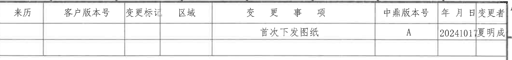

原图位置/视图名称：页 1 顶部右侧修订履历表，bbox `[2635, 170, 4765, 425]`。

原表还原：

| 来历 | 客户版本号 | 变更标记 | 区域 | 变更事项 | 中鼎版本号 | 年月日 | 变更者 |
|---|---|---|---|---|---|---|---|
|  |  |  |  | 首次下发图纸 | A | 20241017 | 夏明成 |
|  |  |  |  |  |  |  |  |

| 提取项 | 原图数值或文本 | 含义说明 |
|---|---|---|
| 表头 | 来历、客户版本号、变更标记、区域、变更事项、中鼎版本号、年月日、变更者 | 修订履历字段。 |
| 修订记录 | 首次下发图纸 / A / 20241017 / 夏明成 | 图纸首次下发记录；客户版本号、变更标记、区域栏为空。 |
| 空白记录行 | 空白 | 原表底部保留空白行。 |

边界归属说明：右侧接近图框坐标线，但表格最后一列“变更者”和表格外框完整；图框坐标字母不作为表格字段提取。

## object_6 技术要求 NOTES

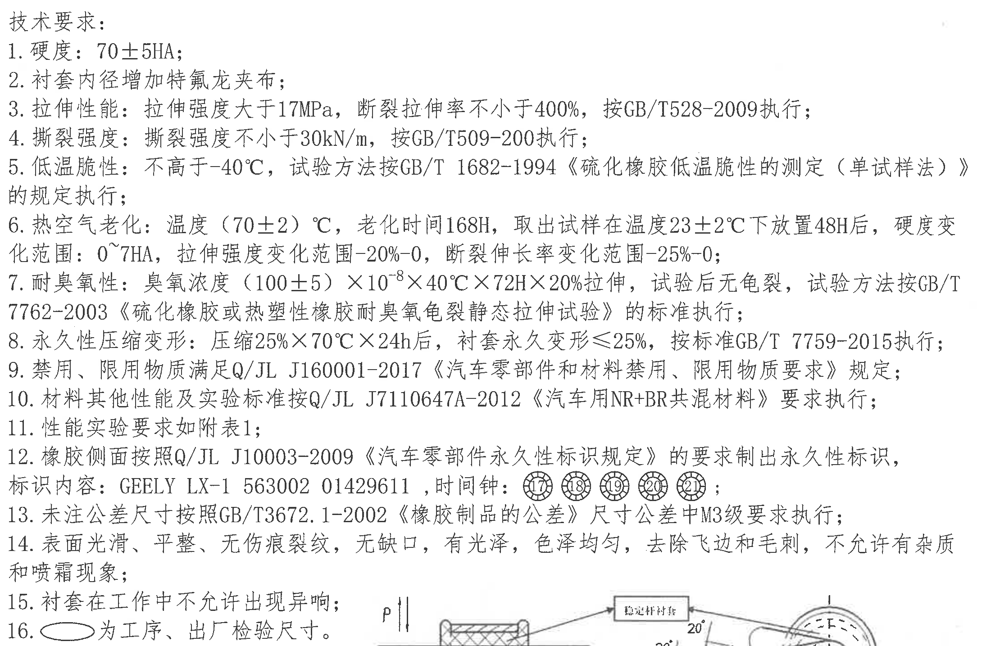

原图位置/视图名称：页 1 右中技术要求，bbox `[2500, 420, 4720, 1855]`。

| 提取项 | 原图数值或文本 | 含义说明 |
|---|---|---|
| 标题 | 技术要求： | NOTES 标题。 |
| 1 | 硬度：70±5HA； | 材料硬度要求。 |
| 2 | 衬套内径增加特氟龙夹布； | 内径处增加 PTFE/特氟龙夹布结构要求。 |
| 3 | 拉伸性能：拉伸强度大于17MPa，断裂拉伸率不小于400%，按GB/T528-2009执行； | 拉伸强度和断裂伸长率要求。 |
| 4 | 撕裂强度：撕裂强度不小于30kN/m，按GB/T509-200执行； | 撕裂强度要求；标准号按图面可辨文本记录。 |
| 5 | 低温脆性：不高于-40℃，试验方法按GB/T 1682-1994《硫化橡胶低温脆性的测定（单试样法）》的规定执行； | 低温脆性试验要求。 |
| 6 | 热空气老化：温度（70±2）℃，老化时间168H，取出试样在温度23±2℃下放置48H后，硬度变化范围：0~7HA，拉伸强度变化范围-20%-0，断裂伸长率变化范围-25%-0； | 老化温度、时间、恢复放置条件和性能变化范围。 |
| 7 | 耐臭氧性：臭氧浓度（100±5）×10^-8×40℃×72H×20%拉伸，试验后无龟裂，试验方法按GB/T 7762-2003《硫化橡胶或热塑性橡胶耐臭氧龟裂静态拉伸试验》的标准执行； | 臭氧浓度、温度、时间、拉伸比例和判定要求。 |
| 8 | 永久性压缩变形：压缩25%×70℃×24h后，衬套永久变形≤25%，按标准GB/T 7759-2015执行； | 压缩永久变形要求。 |
| 9 | 禁用、限用物质满足Q/JL J160001-2017《汽车零部件和材料禁用、限用物质要求》规定； | 禁限用物质符合性要求。 |
| 10 | 材料其他性能及实验标准按Q/JL J7110647A-2012《汽车用NR+BR共混材料》要求执行； | 材料标准要求。 |
| 11 | 性能实验要求如附表1； | 指向下方“表1. 产品性能试验”。 |
| 12 | 橡胶侧面按照Q/JL J10003-2009《汽车零部件永久性标识规定》的要求制出永久性标识，标识内容：GEELY LX-1 563002 01429611，时间钟：17、18、19、20、21； | 侧面永久标识内容和时间钟标识要求。 |
| 13 | 未注公差尺寸按照GB/T3672.1-2002《橡胶制品的公差》尺寸公差中M3级要求执行； | 未注尺寸公差来源。 |
| 14 | 表面光滑、平整、无伤痕裂纹、无缺口，有光泽，色泽均匀，去除飞边和毛刺，不允许有杂质和喷霜现象； | 外观质量要求。 |
| 15 | 衬套在工作中不允许出现异响； | 工作噪声要求。 |
| 16 | 椭圆符号 为工序、出厂检验尺寸。 | 解释图中椭圆圈出尺寸的含义。 |

边界归属说明：底部为完整保留第 16 条文字，含有耐久试验示意图顶部极少残片；这些残片不作为 NOTES 文本提取。示意图完整内容在 object_7 单独提取。

## object_7 耐久试验示意图

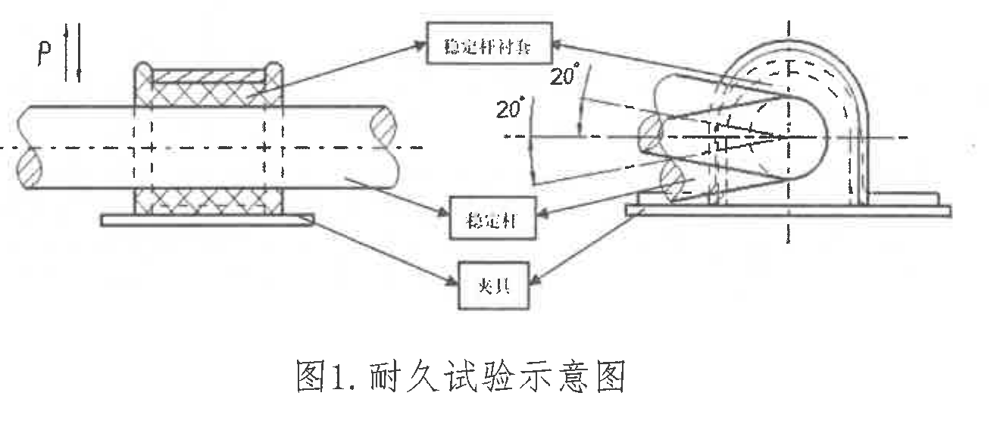

原图位置/视图名称：页 1 右中下“图1. 耐久试验示意图”，bbox `[3300, 1715, 4620, 2275]`。

| 提取项 | 原图数值或文本 | 含义说明 |
|---|---|---|
| 载荷方向 | P | 左上载荷箭头，表示试验加载方向。 |
| 上侧角度 | 20° | 右侧试验摆动/扭转角度标注之一。 |
| 下侧角度 | 20° | 右侧试验摆动/扭转角度标注之一。 |
| 部件标签 | 固定杆衬套 | 上方标签框，指向被测衬套。 |
| 部件标签 | 稳定杆 | 中间标签框，指向稳定杆。 |
| 部件标签 | 夹具 | 下方标签框，指向夹具。 |
| 图题 | 图1. 耐久试验示意图 | 示意图标题。 |

边界归属说明：本对象从 `P` 载荷标识和左侧杆件开始裁切，未纳入 NOTES 尾部文字；左端杆件断裂线贴近裁切边但不影响 P、角度和标签框的完整识别。

## object_8 GB/T 3672.1-2002 M3级公差表

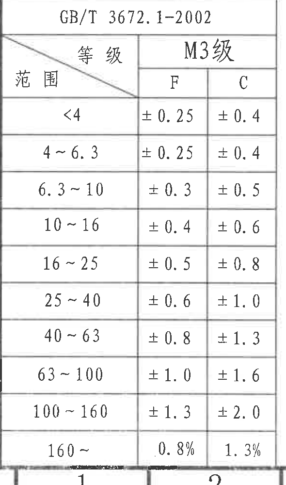

原图位置/视图名称：页 1 左下公差表，bbox `[360, 2380, 950, 3380]`。

原表还原：

| GB/T 3672.1-2002 |  |  |
|---|---|---|
| 等级 | M3级 |  |
| 范围 | F | C |
| <4 | ±0.25 | ±0.4 |
| 4~6.3 | ±0.25 | ±0.4 |
| 6.3~10 | ±0.3 | ±0.5 |
| 10~16 | ±0.4 | ±0.6 |
| 16~25 | ±0.5 | ±0.8 |
| 25~40 | ±0.6 | ±1.0 |
| 40~63 | ±0.8 | ±1.3 |
| 63~100 | ±1.0 | ±1.6 |
| 100~160 | ±1.3 | ±2.0 |
| 160~ | 0.8% | 1.3% |

| 提取项 | 原图数值或文本 | 含义说明 |
|---|---|---|
| 标准 | GB/T 3672.1-2002 | 未注公差引用标准。 |
| 等级 | M3级 | 尺寸公差等级。 |
| 范围/F/C | 如上表 | F、C 两列为不同公差类别下的允许偏差。 |

边界归属说明：为完整保留 `160~` 行和表格下边框，底部带入图框坐标数字 `1`、`2` 的上缘；这些图框坐标不属于公差表，未写入表格数据。

## object_9 表1 产品性能试验

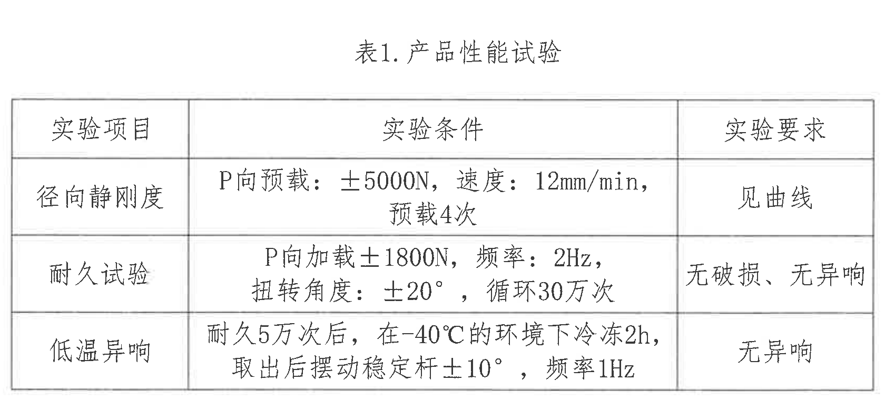

原图位置/视图名称：页 1 下部中间性能试验表，bbox `[1000, 2450, 2680, 3210]`。

原表还原：

| 实验项目 | 实验条件 | 实验要求 |
|---|---|---|
| 径向静刚度 | P向预载：±5000N，速度：12mm/min，预载4次 | 见曲线 |
| 耐久试验 | P向加载±1800N，频率：2Hz，扭转角度：±20°，循环30万次 | 无破损、无异响 |
| 低温异响 | 耐久5万次后，在-40℃的环境下冷冻2h，取出后摆动稳定杆±10°，频率1Hz | 无异响 |

| 提取项 | 原图数值或文本 | 含义说明 |
|---|---|---|
| 表题 | 表1. 产品性能试验 | NOTES 第 11 条所指附表。 |
| 径向静刚度 | ±5000N、12mm/min、预载4次、见曲线 | 静刚度试验条件和要求。 |
| 耐久试验 | ±1800N、2Hz、±20°、循环30万次、无破损无异响 | 耐久试验条件和要求。 |
| 低温异响 | -40℃、2h、±10°、1Hz、无异响 | 低温异响试验条件和要求。 |

边界归属说明：裁切包含表题和表格外框，未带入左侧公差表或右侧标题栏。

## object_10 产品代用/BOM 表

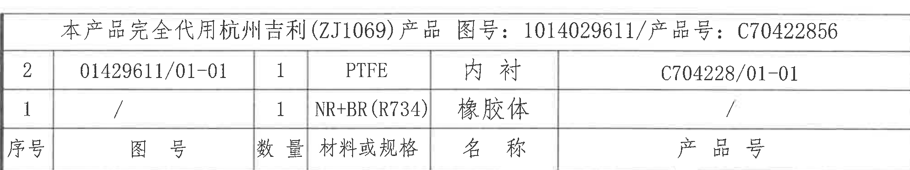

原图位置/视图名称：页 1 右下上部产品代用及 BOM 表，bbox `[2740, 2370, 4735, 2745]`。

原表还原：

| 合并标题行 |
|---|
| 本产品完全代用杭州吉利(ZJ1069)产品 图号：1014029611/产品号：C70422856 |

| 序号 | 图号 | 数量 | 材料或规格 | 名称 | 产品号 |
|---|---|---|---|---|---|
| 2 | 01429611/01-01 | 1 | PTFE | 内衬 | C704228/01-01 |
| 1 | / | 1 | NR+BR(R734) | 橡胶体 | / |

| 提取项 | 原图数值或文本 | 含义说明 |
|---|---|---|
| 代用说明 | 本产品完全代用杭州吉利(ZJ1069)产品 | 说明本图产品替代关系。 |
| 代用图号/产品号 | 图号：1014029611 / 产品号：C70422856 | 被代用产品图号和产品号。 |
| BOM 行 2 | 01429611/01-01，数量1，PTFE，内衬，C704228/01-01 | 内衬件信息。 |
| BOM 行 1 | /，数量1，NR+BR(R734)，橡胶体，/ | 橡胶体件信息。 |

边界归属说明：右侧收在产品号列内容后，未纳入外图框坐标；下方标题栏另作为 object_11 提取，不重复归入本表。

## object_11 标题栏

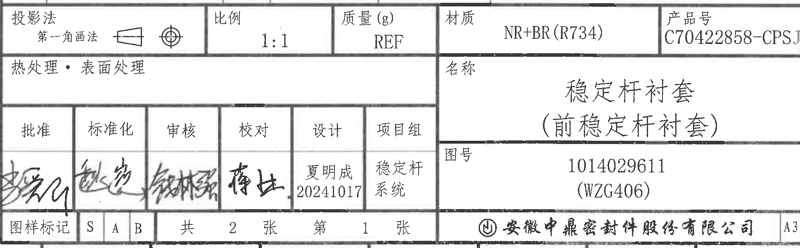

原图位置/视图名称：页 1 右下标题栏，bbox `[2740, 2740, 4735, 3360]`。

原表还原：

| 字段 | 原图数值或文本 |
|---|---|
| 投影法 | 第一角画法 |
| 比例 | 1:1 |
| 质量(g) | REF |
| 材质 | NR+BR(R734) |
| 产品号 | C70422858-CPSJ |
| 热处理·表面处理 | 空白 |
| 名称 | 稳定杆衬套（前稳定杆衬套） |
| 图号 | 1014029611 (WZG406) |
| 批准 | 手写签名，图面难辨 |
| 标准化 | 手写签名，图面难辨 |
| 审核 | 手写签名，图面难辨 |
| 校对 | 手写签名，图面难辨 |
| 设计 | 夏明成 / 20241017 |
| 项目组 | 稳定杆系统 |
| 图样标记 | S A B |
| 张数 | 共 2 张 / 第 1 张 |
| 公司 | 安徽中鼎密封件股份有限公司 |
| 图幅 | A3 |

| 提取项 | 原图数值或文本 | 含义说明 |
|---|---|---|
| 产品身份 | C70422858-CPSJ / 稳定杆衬套（前稳定杆衬套） | 标题栏中的产品号和名称。 |
| 图纸身份 | 1014029611 (WZG406) | 标题栏图号。 |
| 材料 | NR+BR(R734) | 标题栏材料。 |
| 比例/质量 | 1:1 / REF | 标题栏绘图比例和参考质量。 |
| 设计信息 | 夏明成 / 20241017 | 设计栏姓名和日期。 |
| 图样与页码 | S A B / 共2张 / 第1张 / A3 | 图样标记、页数和图幅。 |

边界归属说明：标题栏右下 `A3` 为标题栏字段，保留；底部外图框坐标已尽量排除。左侧批准栏签名靠近裁切边，保留其笔迹区域但不强行识别姓名。

## 裁切检查记录

| 对象 | 检查结论 |
|---|---|
| object_1 | 完整包含主剖面尺寸线、箭头、椭圆尺寸文字和“开口位置”；未混入侧视图尺寸。 |
| object_2 | 完整包含 `2-R3`、`21`、`2-R2`、`44.4±0.5` 及尺寸线箭头；未混入 NOTES。 |
| object_3 | 完整包含标识说明和局部视图内标识示意；未混入右侧刻时间钟说明和底部公差表。 |
| object_4 | 完整包含 `P`、时间钟 17-21、字高/字深说明；左侧有极少相邻局部外形残线，为保留文字完整而保留，不提取。 |
| object_5 | 完整包含修订履历表外框、表头和记录行；右侧图框坐标不作为表格内容。 |
| object_6 | 完整包含技术要求 1-16 条；底部仅有示意图上部残片，不提取到 NOTES。 |
| object_7 | 完整包含耐久试验示意图、`P`、两个 `20°`、三个标签框和图题；未纳入 NOTES 尾字。 |
| object_8 | 完整包含公差表所有行列和 `160~` 行；底部带入少量图框坐标上缘，不作为表格内容。 |
| object_9 | 完整包含表题、三列表头和三行试验记录；无边缘文字缺失。 |
| object_10 | 完整包含代用标题行、BOM 两行和列字段；未纳入标题栏字段。 |
| object_11 | 完整包含标题栏主要字段、签名区、公司名和 A3；底部外图框坐标已排除，左侧批准签名笔迹贴边但可见。 |
