# 20C710332 内容识别与裁切提取
## object_1 - PT1胶管尺寸详图
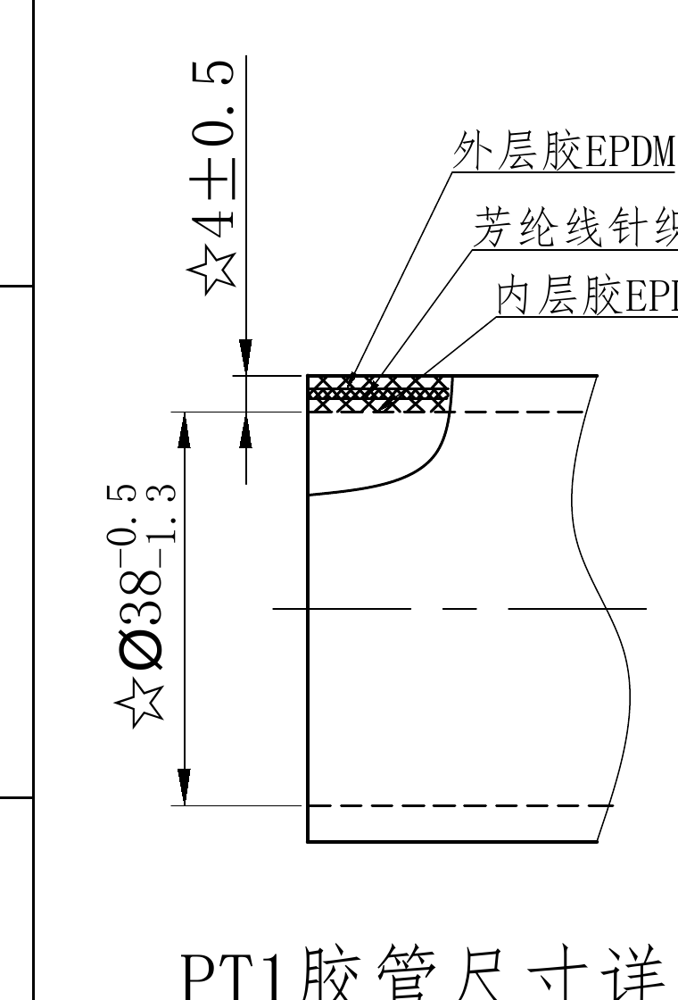
- 原图位置/视图名称：第1页，bbox `[300, 290, 1060, 1410]`，PT1胶管尺寸详图
- 对象类型：`detail`

| 提取项 | 原图数值或文本 | 含义说明 |
|---|---|---|
| ☆4±0.5 | ☆4±0.5 | PT1端局部剖切式尺寸详图，说明PT1端胶管壁厚/层次和端部外径。星号表示关键特性尺寸。Ø38为PT1端外径，公差上偏差-0.5、下偏差-1.3；4±0.5为壁厚/层厚相关尺寸。材料层次从外到内为外层胶EPDM、芳纶线针织层、内层胶EPDM... |
| ☆Ø38 | ☆Ø38 -0.5/-1.3 | PT1端局部剖切式尺寸详图，说明PT1端胶管壁厚/层次和端部外径。星号表示关键特性尺寸。Ø38为PT1端外径，公差上偏差-0.5、下偏差-1.3；4±0.5为壁厚/层厚相关尺寸。材料层次从外到内为外层胶EPDM、芳纶线针织层、内层胶EPDM... |
| 外层胶EPDM | 外层胶EPDM | PT1端局部剖切式尺寸详图，说明PT1端胶管壁厚/层次和端部外径。星号表示关键特性尺寸。Ø38为PT1端外径，公差上偏差-0.5、下偏差-1.3；4±0.5为壁厚/层厚相关尺寸。材料层次从外到内为外层胶EPDM、芳纶线针织层、内层胶EPDM... |
| 芳纶线针织层 | 芳纶线针织层 | PT1端局部剖切式尺寸详图，说明PT1端胶管壁厚/层次和端部外径。星号表示关键特性尺寸。Ø38为PT1端外径，公差上偏差-0.5、下偏差-1.3；4±0.5为壁厚/层厚相关尺寸。材料层次从外到内为外层胶EPDM、芳纶线针织层、内层胶EPDM... |
| 内层胶EPDM | 内层胶EPDM | PT1端局部剖切式尺寸详图，说明PT1端胶管壁厚/层次和端部外径。星号表示关键特性尺寸。Ø38为PT1端外径，公差上偏差-0.5、下偏差-1.3；4±0.5为壁厚/层厚相关尺寸。材料层次从外到内为外层胶EPDM、芳纶线针织层、内层胶EPDM... |
| PT1胶管尺寸详图 | PT1胶管尺寸详图 | PT1端局部剖切式尺寸详图，说明PT1端胶管壁厚/层次和端部外径。星号表示关键特性尺寸。Ø38为PT1端外径，公差上偏差-0.5、下偏差-1.3；4±0.5为壁厚/层厚相关尺寸。材料层次从外到内为外层胶EPDM、芳纶线针织层、内层胶EPDM... |

边界归属说明：左上局部视图，只提取PT1端尺寸；右侧PT5详图和中部主管路不属于本对象。裁切包含完整尺寸线、箭头、文字和标题。

## object_2 - PT5胶管尺寸详图
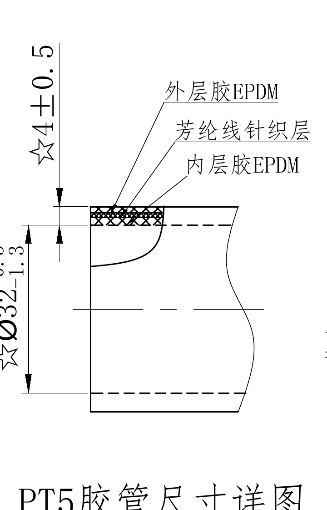
- 原图位置/视图名称：第1页，bbox `[1170, 290, 1890, 1410]`，PT5胶管尺寸详图
- 对象类型：`detail`

| 提取项 | 原图数值或文本 | 含义说明 |
|---|---|---|
| ☆4±0.5 | ☆4±0.5 | PT5端局部剖切式尺寸详图，说明PT5端胶管壁厚/层次和端部外径。星号表示关键特性尺寸。Ø32为PT5端外径，公差上偏差-0.5、下偏差-1.3；4±0.5为壁厚/层厚相关尺寸。材料层次从外到内为外层胶EPDM、芳纶线针织层、内层胶EPDM... |
| ☆Ø32 | ☆Ø32 -0.5/-1.3 | PT5端局部剖切式尺寸详图，说明PT5端胶管壁厚/层次和端部外径。星号表示关键特性尺寸。Ø32为PT5端外径，公差上偏差-0.5、下偏差-1.3；4±0.5为壁厚/层厚相关尺寸。材料层次从外到内为外层胶EPDM、芳纶线针织层、内层胶EPDM... |
| 外层胶EPDM | 外层胶EPDM | PT5端局部剖切式尺寸详图，说明PT5端胶管壁厚/层次和端部外径。星号表示关键特性尺寸。Ø32为PT5端外径，公差上偏差-0.5、下偏差-1.3；4±0.5为壁厚/层厚相关尺寸。材料层次从外到内为外层胶EPDM、芳纶线针织层、内层胶EPDM... |
| 芳纶线针织层 | 芳纶线针织层 | PT5端局部剖切式尺寸详图，说明PT5端胶管壁厚/层次和端部外径。星号表示关键特性尺寸。Ø32为PT5端外径，公差上偏差-0.5、下偏差-1.3；4±0.5为壁厚/层厚相关尺寸。材料层次从外到内为外层胶EPDM、芳纶线针织层、内层胶EPDM... |
| 内层胶EPDM | 内层胶EPDM | PT5端局部剖切式尺寸详图，说明PT5端胶管壁厚/层次和端部外径。星号表示关键特性尺寸。Ø32为PT5端外径，公差上偏差-0.5、下偏差-1.3；4±0.5为壁厚/层厚相关尺寸。材料层次从外到内为外层胶EPDM、芳纶线针织层、内层胶EPDM... |
| PT5胶管尺寸详图 | PT5胶管尺寸详图 | PT5端局部剖切式尺寸详图，说明PT5端胶管壁厚/层次和端部外径。星号表示关键特性尺寸。Ø32为PT5端外径，公差上偏差-0.5、下偏差-1.3；4±0.5为壁厚/层厚相关尺寸。材料层次从外到内为外层胶EPDM、芳纶线针织层、内层胶EPDM... |

边界归属说明：左侧PT1详图文字不纳入本对象；裁切只围绕PT5端详图、尺寸线、材料引线和标题。

## object_3 - 主管路成形视图
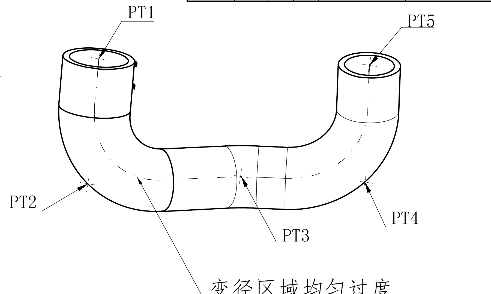
- 原图位置/视图名称：第1页，bbox `[1850, 300, 3650, 1380]`，主管路成形视图
- 对象类型：`view`

| 提取项 | 原图数值或文本 | 含义说明 |
|---|---|---|
| PT1 | PT1 | 胶管总体成形视图，标出五个点位PT1至PT5及变径区域。PT1、PT5为两端端口点；PT2、PT3、PT4为路径/弯曲控制点。文字“变径区域均匀过度”说明管径过渡处需平顺。 |
| PT2 | PT2 | 胶管总体成形视图，标出五个点位PT1至PT5及变径区域。PT1、PT5为两端端口点；PT2、PT3、PT4为路径/弯曲控制点。文字“变径区域均匀过度”说明管径过渡处需平顺。 |
| PT3 | PT3 | 胶管总体成形视图，标出五个点位PT1至PT5及变径区域。PT1、PT5为两端端口点；PT2、PT3、PT4为路径/弯曲控制点。文字“变径区域均匀过度”说明管径过渡处需平顺。 |
| PT4 | PT4 | 胶管总体成形视图，标出五个点位PT1至PT5及变径区域。PT1、PT5为两端端口点；PT2、PT3、PT4为路径/弯曲控制点。文字“变径区域均匀过度”说明管径过渡处需平顺。 |
| PT5 | PT5 | 胶管总体成形视图，标出五个点位PT1至PT5及变径区域。PT1、PT5为两端端口点；PT2、PT3、PT4为路径/弯曲控制点。文字“变径区域均匀过度”说明管径过渡处需平顺。 |
| 变径区域均匀过度 | 变径区域均匀过度 | 胶管总体成形视图，标出五个点位PT1至PT5及变径区域。PT1、PT5为两端端口点；PT2、PT3、PT4为路径/弯曲控制点。文字“变径区域均匀过度”说明管径过渡处需平顺。 |

边界归属说明：该对象只包含主管路总视图的点位和变径说明；点坐标表、PT1端标识尺寸和角度视图均不归入本对象。底部未带入下方视图碎片。

## object_4 - POINT COORDINATE CHART(点坐标表)
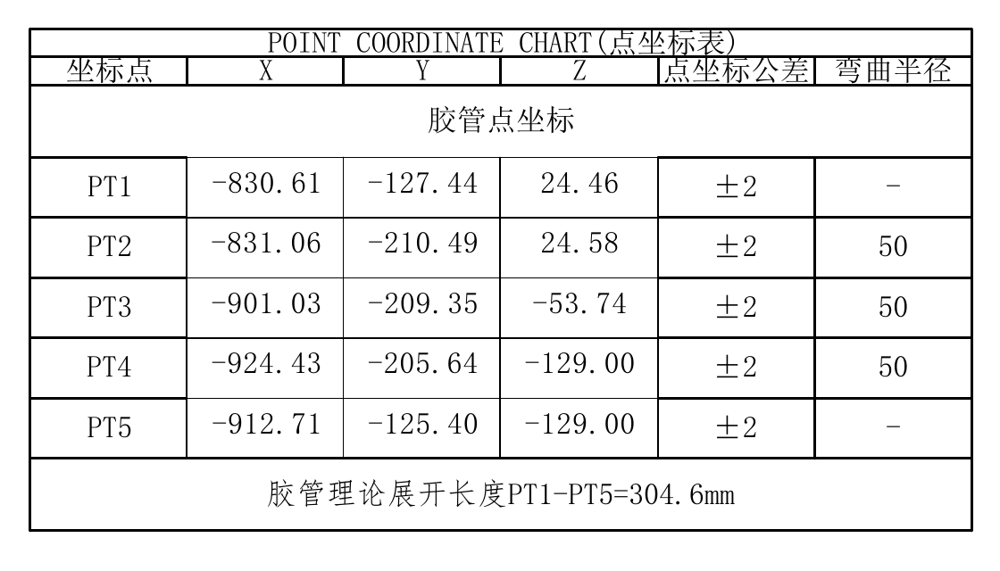
- 原图位置/视图名称：第1页，bbox `[3700, 350, 4820, 990]`，POINT COORDINATE CHART(点坐标表)
- 对象类型：`table`

| 坐标点 | X | Y | Z | 点坐标公差 | 弯曲半径 |
|---|---:|---:|---:|---:|---:|
| PT1 | -830.61 | -127.44 | 24.46 | ±2 | - |
| PT2 | -831.06 | -210.49 | 24.58 | ±2 | 50 |
| PT3 | -901.03 | -209.35 | -53.74 | ±2 | 50 |
| PT4 | -924.43 | -205.64 | -129.00 | ±2 | 50 |
| PT5 | -912.71 | -125.40 | -129.00 | ±2 | - |

胶管理论展开长度PT1-PT5=304.6mm。

| 提取项 | 原图数值或文本 | 含义说明 |
|---|---|---|
| POINT | POINT COORDINATE CHART(点坐标表) | 点坐标表给出PT1至PT5的三维坐标、点坐标公差和弯曲半径。PT2、PT3、PT4弯曲半径为50；PT1、PT5弯曲半径为“-”。理论展开长度PT1-PT5=304.6mm。 |
| 坐标点/X/Y/Z/点坐标公差/弯曲半径 | 坐标点/X/Y/Z/点坐标公差/弯曲半径 | 点坐标表给出PT1至PT5的三维坐标、点坐标公差和弯曲半径。PT2、PT3、PT4弯曲半径为50；PT1、PT5弯曲半径为“-”。理论展开长度PT1-PT5=304.6mm。 |
| 胶管点坐标 | 胶管点坐标 | 点坐标表给出PT1至PT5的三维坐标、点坐标公差和弯曲半径。PT2、PT3、PT4弯曲半径为50；PT1、PT5弯曲半径为“-”。理论展开长度PT1-PT5=304.6mm。 |
| PT1 | PT1 -830.61 -127.44 24.46 ±2 - | 点坐标表给出PT1至PT5的三维坐标、点坐标公差和弯曲半径。PT2、PT3、PT4弯曲半径为50；PT1、PT5弯曲半径为“-”。理论展开长度PT1-PT5=304.6mm。 |
| PT2 | PT2 -831.06 -210.49 24.58 ±2 50 | 点坐标表给出PT1至PT5的三维坐标、点坐标公差和弯曲半径。PT2、PT3、PT4弯曲半径为50；PT1、PT5弯曲半径为“-”。理论展开长度PT1-PT5=304.6mm。 |
| PT3 | PT3 -901.03 -209.35 -53.74 ±2 50 | 点坐标表给出PT1至PT5的三维坐标、点坐标公差和弯曲半径。PT2、PT3、PT4弯曲半径为50；PT1、PT5弯曲半径为“-”。理论展开长度PT1-PT5=304.6mm。 |
| PT4 | PT4 -924.43 -205.64 -129.00 ±2 50 | 点坐标表给出PT1至PT5的三维坐标、点坐标公差和弯曲半径。PT2、PT3、PT4弯曲半径为50；PT1、PT5弯曲半径为“-”。理论展开长度PT1-PT5=304.6mm。 |
| PT5 | PT5 -912.71 -125.40 -129.00 ±2 - | 点坐标表给出PT1至PT5的三维坐标、点坐标公差和弯曲半径。PT2、PT3、PT4弯曲半径为50；PT1、PT5弯曲半径为“-”。理论展开长度PT1-PT5=304.6mm。 |
| 胶管理论展开长度PT1-PT5=304.6mm | 胶管理论展开长度PT1-PT5=304.6mm | 点坐标表给出PT1至PT5的三维坐标、点坐标公差和弯曲半径。PT2、PT3、PT4弯曲半径为50；PT1、PT5弯曲半径为“-”。理论展开长度PT1-PT5=304.6mm。 |

边界归属说明：右上表格对象；仅提取表格内字段和表下注释，不把主管路视图的PT点引线归入表格。

## object_5 - PT1端标识尺寸
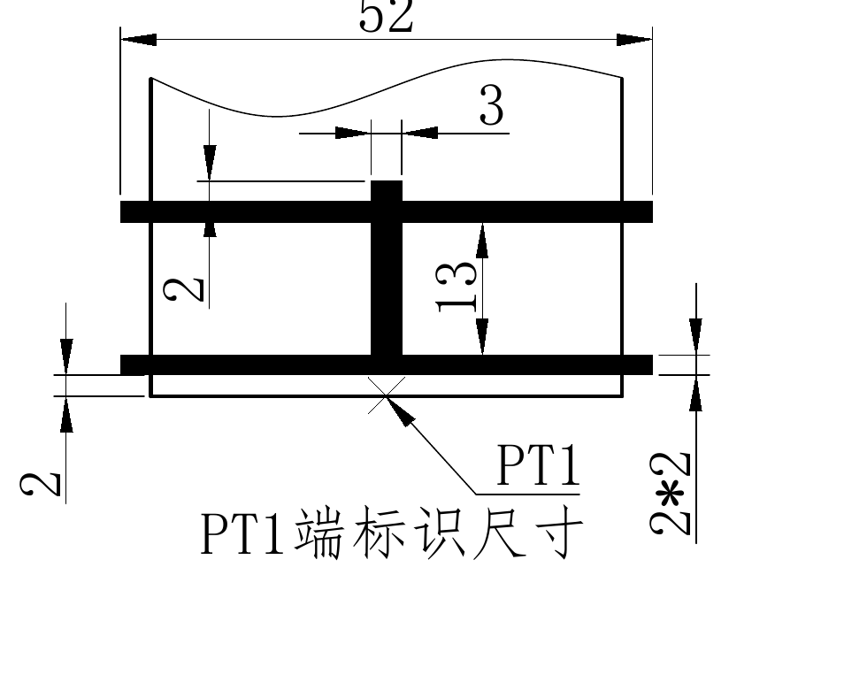
- 原图位置/视图名称：第1页，bbox `[860, 1700, 1840, 2480]`，PT1端标识尺寸
- 对象类型：`detail`

| 提取项 | 原图数值或文本 | 含义说明 |
|---|---|---|
| 52 | 52 | PT1端标识尺寸详图。52为标识总长度/横向范围；3为上部横向局部尺寸；13为竖向标识高度；多个2为线宽/边距尺寸；2*2表示两处尺寸为2。PT1箭头指示该标识用于PT1端。 |
| 3 | 3 | PT1端标识尺寸详图。52为标识总长度/横向范围；3为上部横向局部尺寸；13为竖向标识高度；多个2为线宽/边距尺寸；2*2表示两处尺寸为2。PT1箭头指示该标识用于PT1端。 |
| 13 | 13 | PT1端标识尺寸详图。52为标识总长度/横向范围；3为上部横向局部尺寸；13为竖向标识高度；多个2为线宽/边距尺寸；2*2表示两处尺寸为2。PT1箭头指示该标识用于PT1端。 |
| 2 | 2 | PT1端标识尺寸详图。52为标识总长度/横向范围；3为上部横向局部尺寸；13为竖向标识高度；多个2为线宽/边距尺寸；2*2表示两处尺寸为2。PT1箭头指示该标识用于PT1端。 |
| 2 | 2 | PT1端标识尺寸详图。52为标识总长度/横向范围；3为上部横向局部尺寸；13为竖向标识高度；多个2为线宽/边距尺寸；2*2表示两处尺寸为2。PT1箭头指示该标识用于PT1端。 |
| 2*2 | 2*2 | PT1端标识尺寸详图。52为标识总长度/横向范围；3为上部横向局部尺寸；13为竖向标识高度；多个2为线宽/边距尺寸；2*2表示两处尺寸为2。PT1箭头指示该标识用于PT1端。 |
| PT1 | PT1 | PT1端标识尺寸详图。52为标识总长度/横向范围；3为上部横向局部尺寸；13为竖向标识高度；多个2为线宽/边距尺寸；2*2表示两处尺寸为2。PT1箭头指示该标识用于PT1端。 |
| PT1端标识尺寸 | PT1端标识尺寸 | PT1端标识尺寸详图。52为标识总长度/横向范围；3为上部横向局部尺寸；13为竖向标识高度；多个2为线宽/边距尺寸；2*2表示两处尺寸为2。PT1箭头指示该标识用于PT1端。 |

边界归属说明：对象位于图纸中下左，仅提取标识形状和尺寸；不把右侧PT1端标识位置视图中的32.6尺寸归入本对象。

## object_6 - PT1端标识位置侧视局部
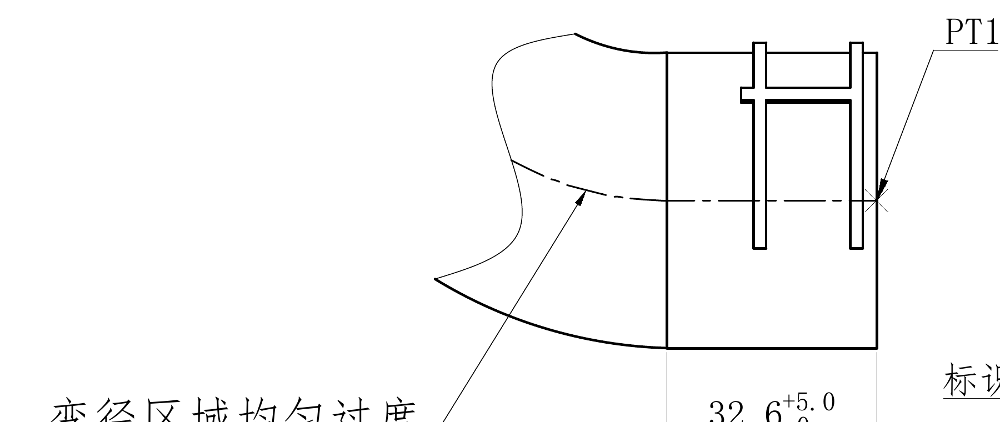
- 原图位置/视图名称：第1页，bbox `[2020, 1450, 3820, 2210]`，PT1端标识位置侧视局部
- 对象类型：`detail`

| 提取项 | 原图数值或文本 | 含义说明 |
|---|---|---|
| PT1 | PT1 | PT1端标识位置侧视局部。32.6带上偏差+5.0、下偏差0，表示从端面/参考边到标识位置的轴向尺寸。PT1引线指向端部标识位置；“变径区域均匀过度”说明左侧变径过渡要求。 |
| 变径区域均匀过度 | 变径区域均匀过度 | PT1端标识位置侧视局部。32.6带上偏差+5.0、下偏差0，表示从端面/参考边到标识位置的轴向尺寸。PT1引线指向端部标识位置；“变径区域均匀过度”说明左侧变径过渡要求。 |
| 32.6 | 32.6 +5.0/0 | PT1端标识位置侧视局部。32.6带上偏差+5.0、下偏差0，表示从端面/参考边到标识位置的轴向尺寸。PT1引线指向端部标识位置；“变径区域均匀过度”说明左侧变径过渡要求。 |

边界归属说明：该裁切为侧视局部，右侧相邻角度视图不作为提取来源；靠右边界若出现相邻“标识中心线”文字残片，不计入本对象实体。

## object_7 - PT1端标识位置角度
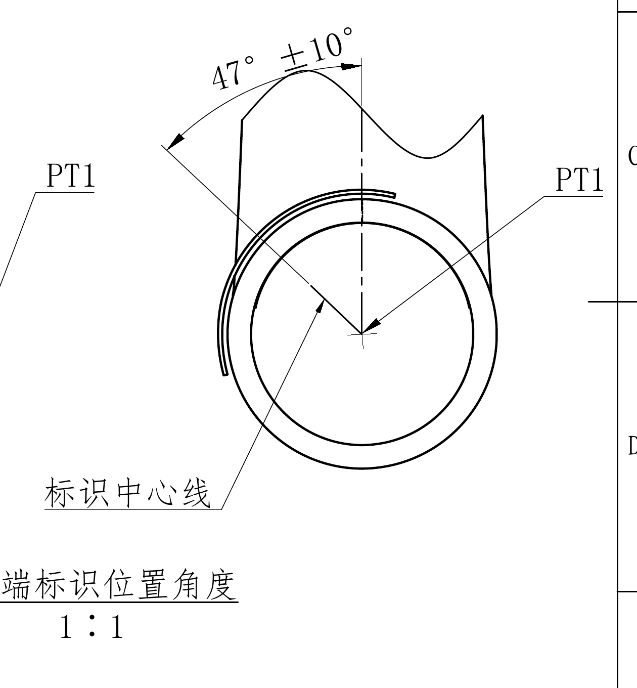
- 原图位置/视图名称：第1页，bbox `[3630, 1160, 4890, 2520]`，PT1端标识位置角度
- 对象类型：`detail`

| 提取项 | 原图数值或文本 | 含义说明 |
|---|---|---|
| 47° | 47° ±10° | PT1端标识位置角度视图，说明标识相对标识中心线的周向角度。47°为角度尺寸，±10°为角度公差；PT1引线标识该角度属于PT1端；比例1:1。 |
| PT1 | PT1 | PT1端标识位置角度视图，说明标识相对标识中心线的周向角度。47°为角度尺寸，±10°为角度公差；PT1引线标识该角度属于PT1端；比例1:1。 |
| 标识中心线 | 标识中心线 | PT1端标识位置角度视图，说明标识相对标识中心线的周向角度。47°为角度尺寸，±10°为角度公差；PT1引线标识该角度属于PT1端；比例1:1。 |
| PT1端标识位置角度 | PT1端标识位置角度 | PT1端标识位置角度视图，说明标识相对标识中心线的周向角度。47°为角度尺寸，±10°为角度公差；PT1引线标识该角度属于PT1端；比例1:1。 |
| 1:1 | 1:1 | PT1端标识位置角度视图，说明标识相对标识中心线的周向角度。47°为角度尺寸，±10°为角度公差；PT1引线标识该角度属于PT1端；比例1:1。 |

边界归属说明：右侧角度局部视图，只提取周向角度、中心线和标题比例；不提取左侧侧视图中的32.6轴向尺寸。

## object_8 - 修订履历表
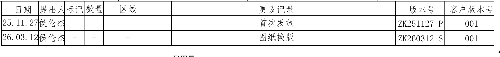
- 原图位置/视图名称：第1页，bbox `[2530, 90, 4880, 360]`，修订履历表
- 对象类型：`table`

| 日期 | 提出人 | 标记 | 数量 | 区域 | 更改记录 | 版本号 | 客户版本号 |
|---|---|---|---|---|---|---|---|
| 25.11.27 | 侯伦杰 | - | - | - | 首次发放 | ZK251127 P | 001 |
| 26.03.12 | 侯伦杰 | - | - | - | 图纸换版 | ZK260312 S | 001 |

| 提取项 | 原图数值或文本 | 含义说明 |
|---|---|---|
| 日期/提出人/标记/数量/区域/更改记录/版本号/客户版本号 | 日期/提出人/标记/数量/区域/更改记录/版本号/客户版本号 | 修订履历表记录两次版本变更：2025-11-27首次发放，版本ZK251127 P，客户版本001；2026-03-12图纸换版，版本ZK260312 S，客户版本001。 |
| 25.11.27 | 25.11.27 侯伦杰 - - - 首次发放 ZK251127 P 001 | 修订履历表记录两次版本变更：2025-11-27首次发放，版本ZK251127 P，客户版本001；2026-03-12图纸换版，版本ZK260312 S，客户版本001。 |
| 26.03.12 | 26.03.12 侯伦杰 - - - 图纸换版 ZK260312 S 001 | 修订履历表记录两次版本变更：2025-11-27首次发放，版本ZK251127 P，客户版本001；2026-03-12图纸换版，版本ZK260312 S，客户版本001。 |

边界归属说明：顶部右侧表格；裁切包含完整表头和两行记录，不提取下方PT5标注。

## object_9 - 技术要求
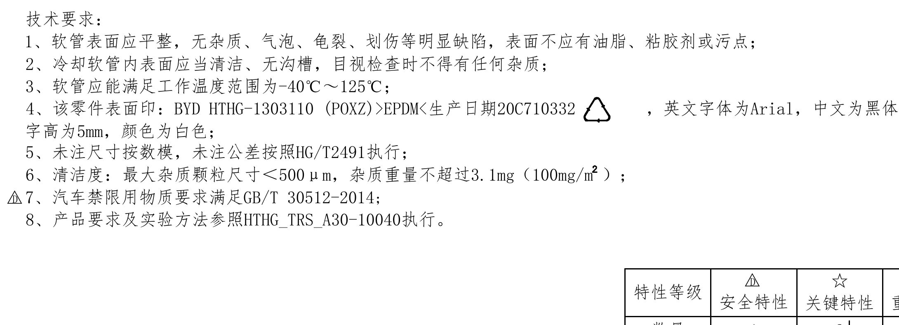
- 原图位置/视图名称：第1页，bbox `[420, 2580, 2600, 3370]`，技术要求
- 对象类型：`notes`

| 提取项 | 原图数值或文本 | 含义说明 |
|---|---|---|
| 技术要求：1、软管表面应平整，无杂质、气泡、龟裂、划伤等明显缺陷，表面不应有油脂、粘胶剂或污点 | 技术要求：1、软管表面应平整，无杂质、气泡、龟裂、划伤等明显缺陷，表面不应有油脂、粘胶剂或污点 | 技术要求规定外观、内表面清洁、工作温度、表面印字内容和字体、未注尺寸/公差依据、清洁度、禁限用物质和试验方法。第4条的20C710332为生产日期/图号印字内容的一部分；第6条100mg/m²按图中文字含义还原。 |
| 2、冷却软管内表面应当清洁、无沟槽，目视检查时不得有任何杂质 | 2、冷却软管内表面应当清洁、无沟槽，目视检查时不得有任何杂质 | 技术要求规定外观、内表面清洁、工作温度、表面印字内容和字体、未注尺寸/公差依据、清洁度、禁限用物质和试验方法。第4条的20C710332为生产日期/图号印字内容的一部分；第6条100mg/m²按图中文字含义还原。 |
| 3、软管应能满足工作温度范围为-40℃～125℃ | 3、软管应能满足工作温度范围为-40℃～125℃ | 技术要求规定外观、内表面清洁、工作温度、表面印字内容和字体、未注尺寸/公差依据、清洁度、禁限用物质和试验方法。第4条的20C710332为生产日期/图号印字内容的一部分；第6条100mg/m²按图中文字含义还原。 |
| 4、该零件表面印：BYD | 4、该零件表面印：BYD HTHG-1303110 (POXZ)>EPDM<生产日期20C710332，英文字体为Arial，中文为黑体，字高为5mm，颜色为白色 | 技术要求规定外观、内表面清洁、工作温度、表面印字内容和字体、未注尺寸/公差依据、清洁度、禁限用物质和试验方法。第4条的20C710332为生产日期/图号印字内容的一部分；第6条100mg/m²按图中文字含义还原。 |
| 5、未注尺寸按数模，未注公差按照HG/T2491执行 | 5、未注尺寸按数模，未注公差按照HG/T2491执行 | 技术要求规定外观、内表面清洁、工作温度、表面印字内容和字体、未注尺寸/公差依据、清洁度、禁限用物质和试验方法。第4条的20C710332为生产日期/图号印字内容的一部分；第6条100mg/m²按图中文字含义还原。 |
| 6、清洁度：最大杂质颗粒尺寸＜500μm，杂质重量不超过3.1mg（100mg/m²） | 6、清洁度：最大杂质颗粒尺寸＜500μm，杂质重量不超过3.1mg（100mg/m²） | 技术要求规定外观、内表面清洁、工作温度、表面印字内容和字体、未注尺寸/公差依据、清洁度、禁限用物质和试验方法。第4条的20C710332为生产日期/图号印字内容的一部分；第6条100mg/m²按图中文字含义还原。 |
| 7、汽车禁限用物质要求满足GB/T | 7、汽车禁限用物质要求满足GB/T 30512-2014 | 技术要求规定外观、内表面清洁、工作温度、表面印字内容和字体、未注尺寸/公差依据、清洁度、禁限用物质和试验方法。第4条的20C710332为生产日期/图号印字内容的一部分；第6条100mg/m²按图中文字含义还原。 |
| 8、产品要求及实验方法参照HTHG_TRS_A30-10040执行。 | 8、产品要求及实验方法参照HTHG_TRS_A30-10040执行。 | 技术要求规定外观、内表面清洁、工作温度、表面印字内容和字体、未注尺寸/公差依据、清洁度、禁限用物质和试验方法。第4条的20C710332为生产日期/图号印字内容的一部分；第6条100mg/m²按图中文字含义还原。 |

边界归属说明：左下NOTES区域；不包含下方特性等级表和右侧标题栏。

## object_10 - 特性等级表
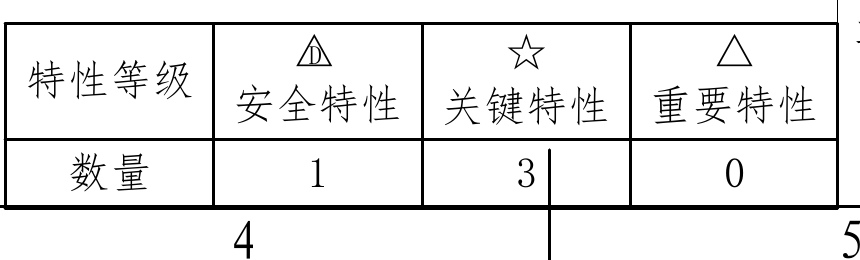
- 原图位置/视图名称：第1页，bbox `[1930, 3210, 2790, 3470]`，特性等级表
- 对象类型：`table`

| 特性等级 | △D 安全特性 | ☆ 关键特性 | △ 重要特性 |
|---|---:|---:|---:|
| 数量 | 1 | 3 | 0 |

| 提取项 | 原图数值或文本 | 含义说明 |
|---|---|---|
| 特性等级 | 特性等级 | 特性等级统计：安全特性1项，关键特性3项，重要特性0项。与图中带星号尺寸相互对应，星号用于关键特性标注。 |
| △D | △D 安全特性 数量1 | 特性等级统计：安全特性1项，关键特性3项，重要特性0项。与图中带星号尺寸相互对应，星号用于关键特性标注。 |
| ☆ | ☆ 关键特性 数量3 | 特性等级统计：安全特性1项，关键特性3项，重要特性0项。与图中带星号尺寸相互对应，星号用于关键特性标注。 |
| △ | △ 重要特性 数量0 | 特性等级统计：安全特性1项，关键特性3项，重要特性0项。与图中带星号尺寸相互对应，星号用于关键特性标注。 |

边界归属说明：底部中左表格；只提取特性等级统计，不归入技术要求或标题栏。

## object_11 - 标题栏
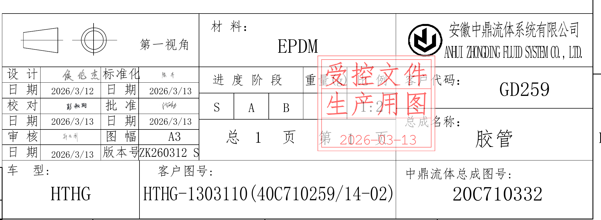
- 原图位置/视图名称：第1页，bbox `[2760, 2640, 4880, 3420]`，标题栏
- 对象类型：`title_block`

| 字段 | 原图文本 |
|---|---|
| 材料 | EPDM |
| 公司 | 安徽中鼎流体系统有限公司 / ANHUI ZHONGDING FLUID SYSTEM CO., LTD. |
| 投影视角 | 第一视角 |
| 设计 | 侯伦杰，日期2026/3/12 |
| 标准化 | 日期2026/3/13 |
| 校对 | 日期2026/3/13 |
| 批准 | 日期2026/3/13 |
| 审核 | 日期2026/3/13 |
| 图幅 | A3 |
| 进度阶段 | S / A / B |
| 比例 | 1:2 |
| 客户代码 | GD259 |
| 页码 | 总1页 第1页 |
| 总成名称 | 胶管 |
| 日期 | 2026-03-13 |
| 版本号 | ZK260312 S |
| 车型 | HTHG |
| 客户图号 | HTHG-1303110(40C710259/14-02) |
| 中鼎流体总成图号 | 20C710332 |
| 印章 | 受控文件 生产用图 |

| 提取项 | 原图数值或文本 | 含义说明 |
|---|---|---|
| 材料：EPDM | 材料：EPDM | 标题栏给出材料、公司、投影视角、签审日期、图幅、比例、客户代码、总成名称、车型、客户图号、中鼎流体总成图号和版本信息。红色印章为“受控文件 生产用图”。 |
| 安徽中鼎流体系统有限公司 | 安徽中鼎流体系统有限公司 | 标题栏给出材料、公司、投影视角、签审日期、图幅、比例、客户代码、总成名称、车型、客户图号、中鼎流体总成图号和版本信息。红色印章为“受控文件 生产用图”。 |
| ANHUI | ANHUI ZHONGDING FLUID SYSTEM CO., LTD. | 标题栏给出材料、公司、投影视角、签审日期、图幅、比例、客户代码、总成名称、车型、客户图号、中鼎流体总成图号和版本信息。红色印章为“受控文件 生产用图”。 |
| 第一视角 | 第一视角 | 标题栏给出材料、公司、投影视角、签审日期、图幅、比例、客户代码、总成名称、车型、客户图号、中鼎流体总成图号和版本信息。红色印章为“受控文件 生产用图”。 |
| 设计 | 设计 侯伦杰 日期2026/3/12 | 标题栏给出材料、公司、投影视角、签审日期、图幅、比例、客户代码、总成名称、车型、客户图号、中鼎流体总成图号和版本信息。红色印章为“受控文件 生产用图”。 |
| 标准化 | 标准化 日期2026/3/13 | 标题栏给出材料、公司、投影视角、签审日期、图幅、比例、客户代码、总成名称、车型、客户图号、中鼎流体总成图号和版本信息。红色印章为“受控文件 生产用图”。 |
| 校对 | 校对 日期2026/3/13 | 标题栏给出材料、公司、投影视角、签审日期、图幅、比例、客户代码、总成名称、车型、客户图号、中鼎流体总成图号和版本信息。红色印章为“受控文件 生产用图”。 |
| 批准 | 批准 日期2026/3/13 | 标题栏给出材料、公司、投影视角、签审日期、图幅、比例、客户代码、总成名称、车型、客户图号、中鼎流体总成图号和版本信息。红色印章为“受控文件 生产用图”。 |
| 审核 | 审核 日期2026/3/13 | 标题栏给出材料、公司、投影视角、签审日期、图幅、比例、客户代码、总成名称、车型、客户图号、中鼎流体总成图号和版本信息。红色印章为“受控文件 生产用图”。 |
| 图幅A3 | 图幅A3 | 标题栏给出材料、公司、投影视角、签审日期、图幅、比例、客户代码、总成名称、车型、客户图号、中鼎流体总成图号和版本信息。红色印章为“受控文件 生产用图”。 |
| 进度阶段S | 进度阶段S A B | 标题栏给出材料、公司、投影视角、签审日期、图幅、比例、客户代码、总成名称、车型、客户图号、中鼎流体总成图号和版本信息。红色印章为“受控文件 生产用图”。 |
| 比例1:2 | 比例1:2 | 标题栏给出材料、公司、投影视角、签审日期、图幅、比例、客户代码、总成名称、车型、客户图号、中鼎流体总成图号和版本信息。红色印章为“受控文件 生产用图”。 |
| 客户代码GD259 | 客户代码GD259 | 标题栏给出材料、公司、投影视角、签审日期、图幅、比例、客户代码、总成名称、车型、客户图号、中鼎流体总成图号和版本信息。红色印章为“受控文件 生产用图”。 |
| 总1页 | 总1页 第1页 | 标题栏给出材料、公司、投影视角、签审日期、图幅、比例、客户代码、总成名称、车型、客户图号、中鼎流体总成图号和版本信息。红色印章为“受控文件 生产用图”。 |
| 总成名称：胶管 | 总成名称：胶管 | 标题栏给出材料、公司、投影视角、签审日期、图幅、比例、客户代码、总成名称、车型、客户图号、中鼎流体总成图号和版本信息。红色印章为“受控文件 生产用图”。 |
| 日期2026-03-13 | 日期2026-03-13 | 标题栏给出材料、公司、投影视角、签审日期、图幅、比例、客户代码、总成名称、车型、客户图号、中鼎流体总成图号和版本信息。红色印章为“受控文件 生产用图”。 |
| 版本号ZK260312 | 版本号ZK260312 S | 标题栏给出材料、公司、投影视角、签审日期、图幅、比例、客户代码、总成名称、车型、客户图号、中鼎流体总成图号和版本信息。红色印章为“受控文件 生产用图”。 |
| 车型HTHG | 车型HTHG | 标题栏给出材料、公司、投影视角、签审日期、图幅、比例、客户代码、总成名称、车型、客户图号、中鼎流体总成图号和版本信息。红色印章为“受控文件 生产用图”。 |
| 客户图号HTHG-1303110(40C710259/14-02) | 客户图号HTHG-1303110(40C710259/14-02) | 标题栏给出材料、公司、投影视角、签审日期、图幅、比例、客户代码、总成名称、车型、客户图号、中鼎流体总成图号和版本信息。红色印章为“受控文件 生产用图”。 |
| 中鼎流体总成图号20C710332 | 中鼎流体总成图号20C710332 | 标题栏给出材料、公司、投影视角、签审日期、图幅、比例、客户代码、总成名称、车型、客户图号、中鼎流体总成图号和版本信息。红色印章为“受控文件 生产用图”。 |
| 受控文件 | 受控文件 生产用图 | 标题栏给出材料、公司、投影视角、签审日期、图幅、比例、客户代码、总成名称、车型、客户图号、中鼎流体总成图号和版本信息。红色印章为“受控文件 生产用图”。 |

边界归属说明：右下标题栏完整裁切；不把左侧技术要求和特性等级表归入本对象。

## 裁切检查记录

| object_1 | PT1胶管尺寸详图 | bbox [300, 290, 1060, 1410] | 检查结果：完整包含当前对象的尺寸线、箭头、表格边框和文字；边界归属按上文说明执行。 |
| object_2 | PT5胶管尺寸详图 | bbox [1170, 290, 1890, 1410] | 检查结果：完整包含当前对象的尺寸线、箭头、表格边框和文字；边界归属按上文说明执行。 |
| object_3 | 主管路成形视图 | bbox [1850, 300, 3650, 1380] | 检查结果：完整包含当前对象的尺寸线、箭头、表格边框和文字；边界归属按上文说明执行。 |
| object_4 | POINT COORDINATE CHART(点坐标表) | bbox [3700, 350, 4820, 990] | 检查结果：完整包含当前对象的尺寸线、箭头、表格边框和文字；边界归属按上文说明执行。 |
| object_5 | PT1端标识尺寸 | bbox [860, 1700, 1840, 2480] | 检查结果：完整包含当前对象的尺寸线、箭头、表格边框和文字；边界归属按上文说明执行。 |
| object_6 | PT1端标识位置侧视局部 | bbox [2020, 1450, 3820, 2210] | 检查结果：完整包含当前对象的尺寸线、箭头、表格边框和文字；边界归属按上文说明执行。 |
| object_7 | PT1端标识位置角度 | bbox [3630, 1160, 4890, 2520] | 检查结果：完整包含当前对象的尺寸线、箭头、表格边框和文字；边界归属按上文说明执行。 |
| object_8 | 修订履历表 | bbox [2530, 90, 4880, 360] | 检查结果：完整包含当前对象的尺寸线、箭头、表格边框和文字；边界归属按上文说明执行。 |
| object_9 | 技术要求 | bbox [420, 2580, 2600, 3370] | 检查结果：完整包含当前对象的尺寸线、箭头、表格边框和文字；边界归属按上文说明执行。 |
| object_10 | 特性等级表 | bbox [1930, 3210, 2790, 3470] | 检查结果：完整包含当前对象的尺寸线、箭头、表格边框和文字；边界归属按上文说明执行。 |
| object_11 | 标题栏 | bbox [2760, 2640, 4880, 3420] | 检查结果：完整包含当前对象的尺寸线、箭头、表格边框和文字；边界归属按上文说明执行。 |
