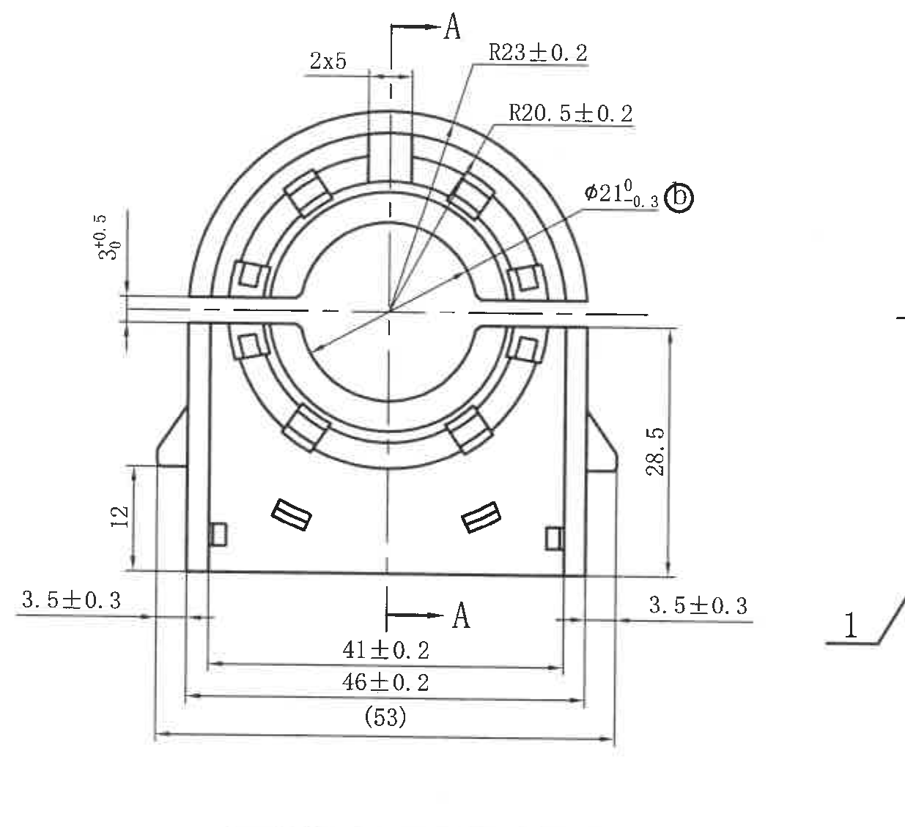
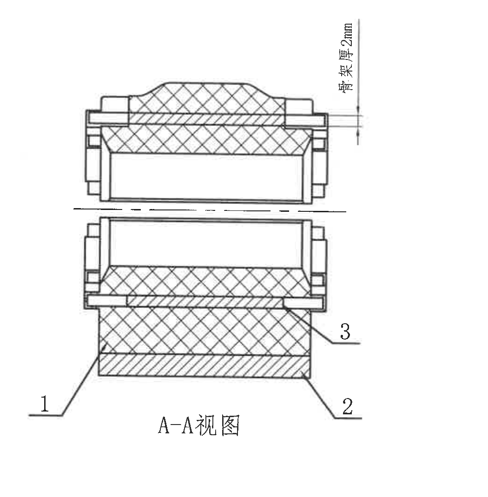
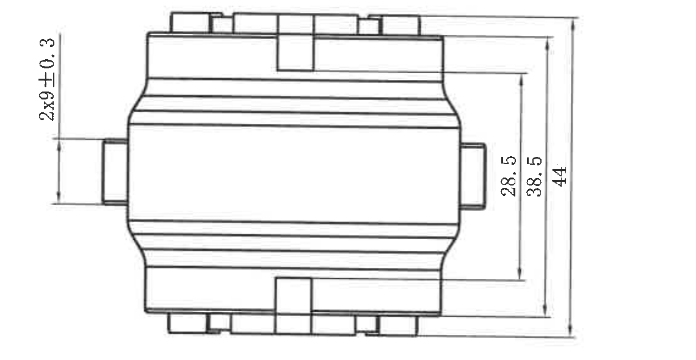
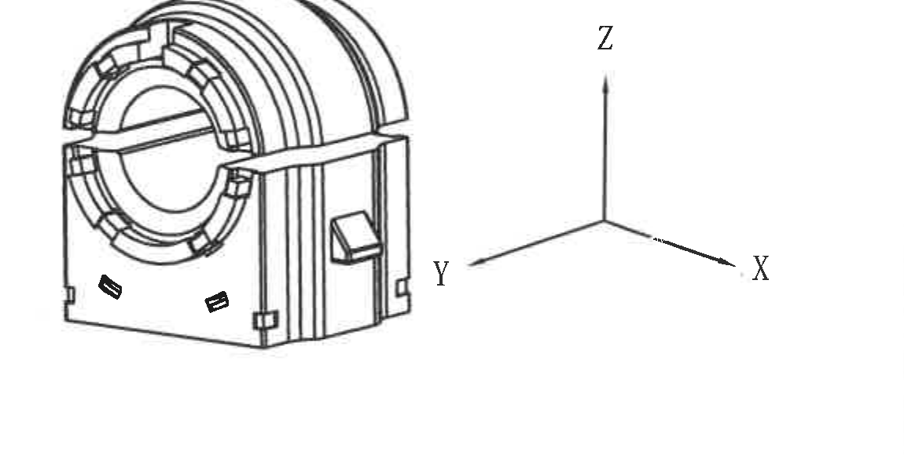
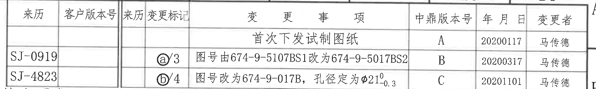
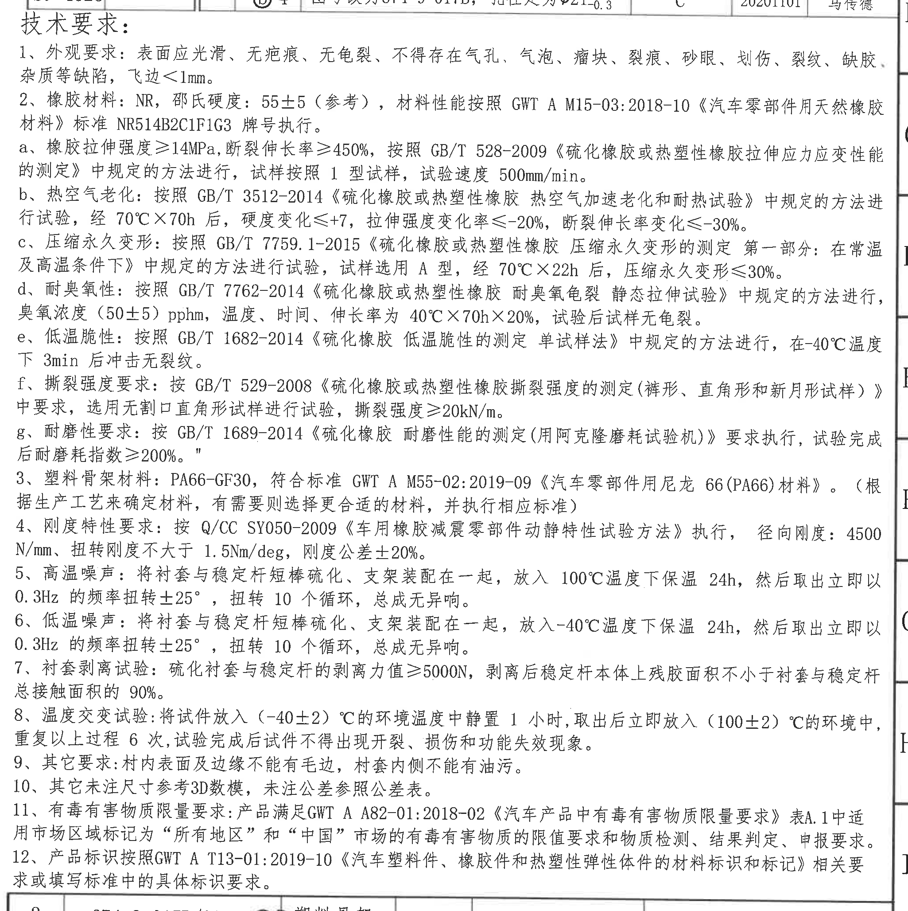
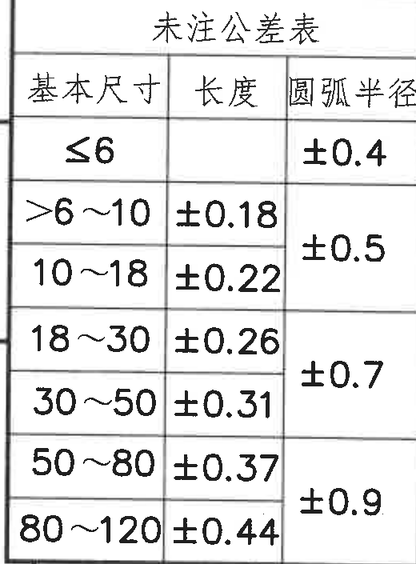
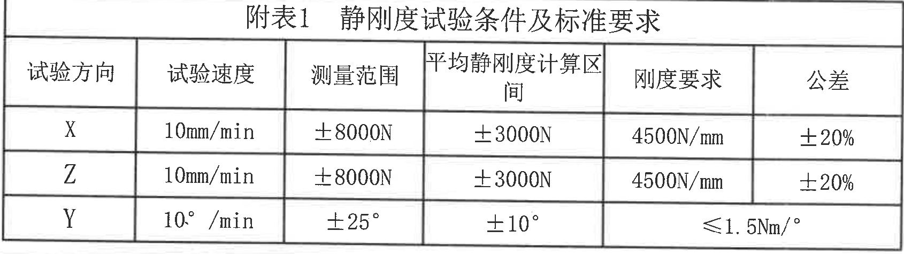
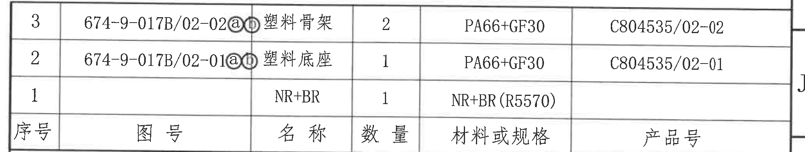
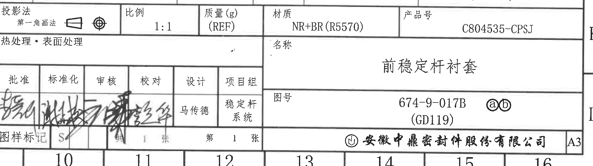

# 20C804535 PDF 内容识别

整页渲染图：`outputs/20C804535_assets/images/page_1.png`，页面尺寸 4959 x 3505 px。

裁切坐标说明：本文中的 bbox 均为整页 PNG 像素坐标，格式为 `[x, y, width, height]`。

## object_1 - 主视图

原图位置/视图名称：左上主视图，bbox `[650, 360, 1235, 1130]`。

| 提取项 | 原图数值或文本 | 含义说明 |
|---|---:|---|
| 顶部特征宽度/数量 | 2x5 | 顶部开口或筋位处 2 处，每处尺寸为 5。 |
| 外圆弧半径 | R23±0.2 | 上部外侧圆弧半径，公差 ±0.2。 |
| 内圆弧半径 | R20.5±0.2 | 上部内侧圆弧半径，公差 ±0.2。 |
| 内孔直径 | φ21^0_-0.3 ⓑ | 圆孔直径 21，上偏差 0，下偏差 -0.3；旁有变更标记 ⓑ。 |
| 左侧开口厚度/间距 | 3^+0.5_0 | 左侧水平开口附近的竖向尺寸，名义 3，上偏差 +0.5，下偏差 0。 |
| 左下局部高度 | 12 | 左侧下部台阶/边缘的竖向尺寸。 |
| 左侧边距 | 3.5±0.3 | 左侧底部外侧边缘到相邻基准线的水平尺寸，公差 ±0.3。 |
| 右侧边距 | 3.5±0.3 | 右侧底部外侧边缘到相邻基准线的水平尺寸，公差 ±0.3。 |
| 底部内宽 | 41±0.2 | 底部两内侧竖线之间的水平尺寸，公差 ±0.2。 |
| 底部外宽 | 46±0.2 | 底部两外侧竖线之间的水平尺寸，公差 ±0.2。 |
| 底部总宽参考尺寸 | (53) | 括号内参考尺寸，表示整体外宽参考值，不作为直接控制尺寸，但用于结构理解和装配参考。 |
| 右侧高度 | 28.5 | 主视图右侧由底部基准到上部水平中心/开口线的竖向尺寸。 |
| 剖切标识 | A-A | 上下各有 A 向剖切箭头，表示剖面视图 object_2 的剖切位置。 |
| 变更标记 | ⓑ | 与孔径 φ21^0_-0.3 相关，见修订履历表 C 版说明。 |

边界归属说明：裁切区域保留了主视图左右两侧完整 3.5±0.3 尺寸线、底部 (53) 参考尺寸线和右侧 28.5 尺寸线。右侧可见的少量剖视图指引线/序号片段不归入本主视图提取项；本区域只提取与主视图实体和主视图尺寸线直接相连的内容。

## object_2 - A-A 剖视图

原图位置/视图名称：上中部 A-A 视图，bbox `[1715, 345, 1050, 1070]`。

| 提取项 | 原图数值或文本 | 含义说明 |
|---|---:|---|
| 视图名称 | A-A视图 | 来自主视图 A-A 剖切线的剖面视图。 |
| 骨架厚度 | 骨架厚度2mm | 右上竖向标注，表示骨架厚度为 2 mm。 |
| 零件序号 1 | 1 | 剖视图左下引出编号，对应明细表序号 1，材料/名称为 NR+BR。 |
| 零件序号 2 | 2 | 剖视图右下引出编号，对应明细表序号 2，塑料底座，材料 PA66+GF30。 |
| 零件序号 3 | 3 | 剖视图右侧引出编号，对应明细表序号 3，塑料骨架，材料 PA66+GF30。 |
| 剖面线 | 交叉剖面线、斜剖面线 | 表示被剖切到的不同材料或结构层，和 1/2/3 零件序号对应。 |

边界归属说明：裁切区域完整包含 A-A 剖视图名称、1/2/3 引线编号和“骨架厚度2mm”标注。该区域未提取主视图右侧 3.5±0.3 或 NOTES 文本；这些内容位于相邻区域，不属于 A-A 剖视图。

## object_3 - 侧视图

原图位置/视图名称：左中部侧视/横向外形视图，bbox `[690, 1480, 1140, 590]`。

| 提取项 | 原图数值或文本 | 含义说明 |
|---|---:|---|
| 成对端部尺寸 | 2x9±0.3 | 左侧竖排标注，表示 2 处端部/凸台相关尺寸，每处 9，公差 ±0.3。 |
| 内部高度 | 28.5 | 右侧最内侧竖向尺寸，控制中部主体高度。 |
| 中间总高 | 38.5 | 右侧中间竖向尺寸，控制主体外侧高度。 |
| 总高度 | 44 | 右侧最外侧竖向尺寸，表示该视图整体高度。 |

边界归属说明：裁切区域完整包含左侧 2x9±0.3、右侧 28.5/38.5/44 三条竖向尺寸线及箭头。底部未包含下方等轴视图片段，右侧尺寸均归属于该侧视图。

## object_4 - 等轴视图及坐标方向

原图位置/视图名称：下中部等轴视图与坐标轴，bbox `[1600, 2200, 1150, 580]`。

| 提取项 | 原图数值或文本 | 含义说明 |
|---|---|---|
| 等轴视图 | 三维外观图 | 显示前稳定杆衬套的立体外形、开口、圆弧、侧面凸台和底部小特征。 |
| 坐标方向 | X | 图中右下方向轴，供静刚度试验方向和 3D 方向理解使用。 |
| 坐标方向 | Y | 图中左下方向轴，供静刚度试验方向和 3D 方向理解使用。 |
| 坐标方向 | Z | 图中竖直方向轴，供静刚度试验方向和 3D 方向理解使用。 |

边界归属说明：裁切区域只包含等轴图和 X/Y/Z 坐标轴，不包含下方“附表1 静刚度试验条件及标准要求”表格；该视图无单独尺寸数值。

## object_5 - 修订履历表

原图位置/视图名称：右上修订履历表，bbox `[2785, 195, 2020, 305]`。

原表还原：

| 来历 | 客户版本号 | 来历 | 变更标记 | 变更事项 | 中鼎版本号 | 年月日 | 变更者 |
|---|---|---|---|---|---|---|---|
|  |  |  |  | 首次下发试制图纸 | A | 20200117 | 马传德 |
| SJ-0919 |  |  | ⓐ/3 | 图号由674-9-5107BS1改为674-9-5017BS2 | B | 20200317 | 马传德 |
| SJ-4823 |  |  | ⓑ/4 | 图号改为674-9-017B，孔径定为φ21^0_-0.3 | C | 20201101 | 马传德 |

| 提取项 | 原图数值或文本 | 含义说明 |
|---|---|---|
| 版本 A | 首次下发试制图纸，20200117，马传德 | 初始试制图纸下发记录。 |
| 版本 B | SJ-0919，ⓐ/3，图号由674-9-5107BS1改为674-9-5017BS2，20200317，马传德 | 变更标记 ⓐ，位置/序号 3，图号变更记录。 |
| 版本 C | SJ-4823，ⓑ/4，图号改为674-9-017B，孔径定为φ21^0_-0.3，20201101，马传德 | 变更标记 ⓑ，位置/序号 4，明确主视图孔径为 φ21^0_-0.3。 |

边界归属说明：裁切区域覆盖修订表列头和三行修订记录。表格右侧可见少量图框边界字母不作为表格字段；左侧 SJ-0919、SJ-4823 均完整保留。

## object_6 - NOTES / 技术要求

原图位置/视图名称：右侧大块技术要求文字区，bbox `[2745, 470, 2050, 2055]`。

| 提取项 | 原图数值或文本 | 含义说明 |
|---|---|---|
| 标题 | 技术要求 | 图纸通用技术和材料要求。 |
| 1 | 外观要求：表面应光滑、无疤痕、无龟裂、不得存在气孔、气泡、瘤块、裂痕、砂眼、划伤、裂纹、缺胶、杂质等缺陷，飞边＜1mm。 | 外观质量和飞边限制。 |
| 2 | 橡胶材料：NR，邵氏硬度：55±5（参考），材料性能按照 GWT A M15-03:2018-10《汽车零部件用天然橡胶材料》标准 NR514B2C1F1G3 牌号执行。 | 橡胶材料、参考硬度和材料标准。 |
| 2-a | 橡胶拉伸强度≥14MPa，断裂伸长率≥450%，按照 GB/T 528-2009《硫化橡胶或热塑性橡胶拉伸应力应变性能的测定》中规定的方法进行，试样按照 1 型试样，试验速度 500mm/min。 | 拉伸强度、伸长率和试验速度要求。 |
| 2-b | 热空气老化：按照 GB/T 3512-2014《硫化橡胶或热塑性橡胶 热空气加速老化和耐热试验》中规定的方法进行试验，经 70℃×70h 后，硬度变化≤+7，拉伸强度变化率≤-20%，断裂伸长率变化≤-30%。 | 热空气老化后的性能变化限制。 |
| 2-c | 压缩永久变形：按照 GB/T 7759.1-2015《硫化橡胶或热塑性橡胶 压缩永久变形的测定 第一部分：在常温及高温条件下》中规定的方法进行试验，试样选用 A 型，经 70℃×22h 后，压缩永久变形≤30%。 | 压缩永久变形试验条件和限值。 |
| 2-d | 耐臭氧性：按照 GB/T 7762-2014《硫化橡胶或热塑性橡胶 耐臭氧龟裂 静态拉伸试验》中规定的方法进行，臭氧浓度（50±5）pphm，温度、时间、伸长率为 40℃×70h×20%，试验后试样无龟裂。 | 臭氧试验条件和龟裂判定。 |
| 2-e | 低温脆性：按照 GB/T 1682-2014《硫化橡胶 低温脆性的测定 单试样法》中规定的方法进行，在-40℃温度下 3min 后冲击无裂纹。 | 低温冲击后不得裂纹。 |
| 2-f | 撕裂强度要求：按照 GB/T 529-2008《硫化橡胶或热塑性橡胶撕裂强度的测定（裤形、直角形和新月形试样）》中要求，选用无割口直角形试样进行试验，撕裂强度≥20kN/m。 | 撕裂试样类型和强度限值。 |
| 2-g | 耐磨性要求：按 GB/T 1689-2014《硫化橡胶 耐磨性能的测定（用阿克隆磨耗试验机）》要求执行，试验完成后耐磨耗指数≥200%。 | 耐磨耗指数要求。 |
| 3 | 塑料骨架材料：PA66-GF30，符合标准 GWT A M55-02:2019-09《汽车零部件用尼龙 66(PA66)材料》。（根据生产工艺来确定材料，有需要则选择更合适的材料，并执行相应标准） | 塑料骨架材料牌号和标准。 |
| 4 | 刚度特性要求：按 Q/CC SY050-2009《车用橡胶减震零部件动静特性试验方法》执行，径向刚度：4500N/mm、扭转刚度不大于 1.5Nm/deg，刚度公差±20%。 | 与附表1对应的刚度要求。 |
| 5 | 高温噪声：将衬套与稳定杆短棒硫化、支架装配在一起，放入 100℃温度下保温 24h，然后取出立即以 0.3Hz 的频率扭转±25°，扭转 10 个循环，总成无异响。 | 高温噪声试验条件和判定。 |
| 6 | 低温噪声：将衬套与稳定杆短棒硫化、支架装配在一起，放入-40℃温度下保温 24h，然后取出立即以 0.3Hz 的频率扭转±25°，扭转 10 个循环，总成无异响。 | 低温噪声试验条件和判定。 |
| 7 | 衬套剥离试验：硫化衬套与稳定杆的剥离力值≥5000N，剥离后稳定杆本体上残胶面积不小于衬套与稳定杆总接触面积的 90%。 | 剥离力和残胶面积判定。 |
| 8 | 温度交变试验：将试件放入（-40±2）℃的环境温度中静置 1 小时，取出后立即放入（100±2）℃的环境中，重复以上过程 6 次，试验完成后试件不得出现开裂、损伤和功能失效现象。 | 高低温交变试验条件和判定。 |
| 9 | 其它要求：衬内表面及边缘不能有毛边，衬套内侧不能有油污。 | 其他外观/清洁要求。 |
| 10 | 其它未注尺寸参考3D数模，未注公差参照公差表。 | 未注尺寸和未注公差的依据。 |
| 11 | 有毒有害物质限量要求：产品满足GWT A A82-01:2018-02《汽车产品中有毒有害物质限量要求》表A.1中适用市场区域标记为“所有地区”和“中国”市场的有毒有害物质的限值要求和物质检测、结果判定、申报要求。 | 有害物质限量标准。 |
| 12 | 产品标识按照GWT A T13-01:2019-10《汽车塑料件、橡胶件和热塑性弹性体件的材料标识和标记》相关要求或填写标准中的具体标识要求。 | 产品标识标准。 |

边界归属说明：裁切区域完整包含“技术要求”标题以及 1-12 条内容。右侧少量图框坐标栏线条/字母不属于 NOTES 文本，未提取为技术要求内容；底部标题栏内容另归 object_10。

## object_7 - 未注公差表

原图位置/视图名称：左下未注公差表，bbox `[360, 2630, 520, 705]`。

原表还原：

| 基本尺寸 | 长度 | 圆弧半径 |
|---|---:|---:|
| ≤6 |  | ±0.4 |
| >6～10 | ±0.18 | ±0.5 |
| 10～18 | ±0.22 | ±0.5 |
| 18～30 | ±0.26 | ±0.7 |
| 30～50 | ±0.31 | ±0.7 |
| 50～80 | ±0.37 | ±0.9 |
| 80～120 | ±0.44 | ±0.9 |

| 提取项 | 原图数值或文本 | 含义说明 |
|---|---|---|
| 表名 | 未注公差表 | 适用于未单独标注公差的尺寸，NOTES 第 10 条引用该表。 |
| 长度公差 | >6～10: ±0.18；10～18: ±0.22；18～30: ±0.26；30～50: ±0.31；50～80: ±0.37；80～120: ±0.44 | 未注长度尺寸按基本尺寸范围取公差。 |
| 圆弧半径公差 | ≤6: ±0.4；>6～18: ±0.5；18～50: ±0.7；50～120: ±0.9 | 未注圆弧半径按基本尺寸范围取公差；原图为合并单元格显示，Markdown 中按行展开。 |

边界归属说明：裁切区域包含未注公差表完整外框、表头和所有行。左侧可见少量图框线，不作为表格内容。

## object_8 - 附表1 静刚度试验条件及标准要求

原图位置/视图名称：下中部静刚度试验条件表，bbox `[1000, 2860, 1690, 475]`。

原表还原：

| 试验方向 | 试验速度 | 测量范围 | 平均静刚度计算区间 | 刚度要求 | 公差 |
|---|---|---|---|---|---|
| X | 10mm/min | ±8000N | ±3000N | 4500N/mm | ±20% |
| Z | 10mm/min | ±8000N | ±3000N | 4500N/mm | ±20% |
| Y | 10°/min | ±25° | ±10° | ≤1.5Nm/° |  |

| 提取项 | 原图数值或文本 | 含义说明 |
|---|---|---|
| 表名 | 附表1 静刚度试验条件及标准要求 | 与 NOTES 第 4 条刚度特性要求相互对应。 |
| X 方向 | 10mm/min；±8000N；±3000N；4500N/mm；±20% | X 方向径向刚度试验条件和刚度公差。 |
| Z 方向 | 10mm/min；±8000N；±3000N；4500N/mm；±20% | Z 方向径向刚度试验条件和刚度公差。 |
| Y 方向 | 10°/min；±25°；±10°；≤1.5Nm/° | Y 方向扭转刚度试验条件；刚度要求格在原图跨最后两列显示。 |

边界归属说明：裁切区域完整包含附表1标题、表头和 X/Z/Y 三行。上方等轴视图未包含在该表格中。

## object_9 - 明细表 / BOM

原图位置/视图名称：右下上部明细表，bbox `[2735, 2480, 2060, 390]`。

原表还原：

| 序号 | 图号 | 名称 | 数量 | 材料或规格 | 产品号 |
|---:|---|---|---:|---|---|
| 3 | 674-9-017B/02-02ⓐⓑ | 塑料骨架 | 2 | PA66+GF30 | C804535/02-02 |
| 2 | 674-9-017B/02-01ⓐⓑ | 塑料底座 | 1 | PA66+GF30 | C804535/02-01 |
| 1 |  | NR+BR | 1 | NR+BR(R5570) |  |

| 提取项 | 原图数值或文本 | 含义说明 |
|---|---|---|
| 序号 3 | 图号 674-9-017B/02-02ⓐⓑ；塑料骨架；数量 2；PA66+GF30；产品号 C804535/02-02 | 与 A-A 剖视图编号 3 对应。 |
| 序号 2 | 图号 674-9-017B/02-01ⓐⓑ；塑料底座；数量 1；PA66+GF30；产品号 C804535/02-01 | 与 A-A 剖视图编号 2 对应。 |
| 序号 1 | 名称 NR+BR；数量 1；材料或规格 NR+BR(R5570) | 与 A-A 剖视图编号 1 对应。 |

边界归属说明：裁切区域完整包含明细表三行和表头。下方投影法/比例/材质/产品号栏属于标题栏 object_10，未在本对象中提取。

## object_10 - 标题栏

原图位置/视图名称：右下标题栏，bbox `[2775, 2855, 2015, 565]`。

标题栏表格还原：

| 字段 | 原图文本 |
|---|---|
| 投影法 | 第一角画法 |
| 比例 | 1:1 |
| 质量(g) | (REF) |
| 材质 | NR+BR(R5570) |
| 产品号 | C804535-CPSJ |
| 热处理·表面处理 |  |
| 名称 | 前稳定杆衬套 |
| 图号 | 674-9-017B；(GD119)；ⓐⓑ |
| 批准 | 签名 |
| 标准化 | 签名 |
| 审核 | 签名 |
| 校对 | 签名 |
| 设计 | 马传德 |
| 项目组 | 稳定杆系统 |
| 图样标记 | S |
| 张数 | 第 1 张，共 1 张 |
| 公司 | 安徽中鼎密封件股份有限公司 |
| 图幅 | A3 |

| 提取项 | 原图数值或文本 | 含义说明 |
|---|---|---|
| 零件名称 | 前稳定杆衬套 | 本图纸产品名称。 |
| 图号 | 674-9-017B (GD119) ⓐⓑ | 主图号及变更标记，与修订履历 B/C 相关。 |
| 产品号 | C804535-CPSJ | 标题栏产品编号。 |
| 材质 | NR+BR(R5570) | 标题栏主材质，与明细表序号 1 对应。 |
| 比例 | 1:1 | 图样绘图比例。 |
| 质量 | (REF) | 质量为参考字段，原图未给出数值。 |
| 投影法 | 第一角画法 | 图纸采用第一角画法。 |
| 设计/项目组 | 马传德；稳定杆系统 | 设计责任和项目组信息。 |
| 公司/图幅 | 安徽中鼎密封件股份有限公司；A3 | 出图单位和图幅。 |

边界归属说明：裁切区域完整包含标题栏主体、签审栏、名称栏、图号栏和公司栏。底部图框坐标编号已尽量排除；若边缘可见少量图框线，不作为标题栏字段。

## 裁切检查记录

| 对象 | 图片路径 | 检查结果 |
|---|---|---|
| page_1 | outputs/20C804535_assets/images/page_1.png | 整页 PNG 完整渲染，尺寸 4959 x 3505 px。 |
| object_1 | outputs/20C804535_assets/images/object_1.png | 主视图尺寸线和文字完整；右侧少量相邻剖视图引线片段不提取，主视图归属已区分。 |
| object_2 | outputs/20C804535_assets/images/object_2.png | A-A 剖视图、1/2/3 序号、“骨架厚度2mm”和视图名完整；未带入 NOTES 文本。 |
| object_3 | outputs/20C804535_assets/images/object_3.png | 侧视图 2x9±0.3、28.5、38.5、44 尺寸线和文字完整；未带入等轴视图。 |
| object_4 | outputs/20C804535_assets/images/object_4.png | 等轴视图和 X/Y/Z 坐标轴完整；下方静刚度表已排除。 |
| object_5 | outputs/20C804535_assets/images/object_5.png | 修订履历表表头和三行记录完整；右侧图框边界字母不作为表格字段。 |
| object_6 | outputs/20C804535_assets/images/object_6.png | 技术要求标题和 1-12 条完整；右侧少量图框坐标栏不作为 NOTES 内容。 |
| object_7 | outputs/20C804535_assets/images/object_7.png | 未注公差表表头和所有行完整；圆弧半径列合并关系按行说明。 |
| object_8 | outputs/20C804535_assets/images/object_8.png | 静刚度试验表标题、表头和 X/Z/Y 三行完整；没有混入等轴视图。 |
| object_9 | outputs/20C804535_assets/images/object_9.png | 明细表表头和三行完整；标题栏投影法/比例行另归 object_10。 |
| object_10 | outputs/20C804535_assets/images/object_10.png | 标题栏主体字段、签审栏、名称、图号、公司和 A3 图幅完整；底部图框坐标编号已排除。 |

补充说明：本页未见单独局部视图和 T 编号。所有括号内参考尺寸已按参考含义提取；未注尺寸和未注公差按 NOTES 第 10 条分别参考 3D 数模和未注公差表。
