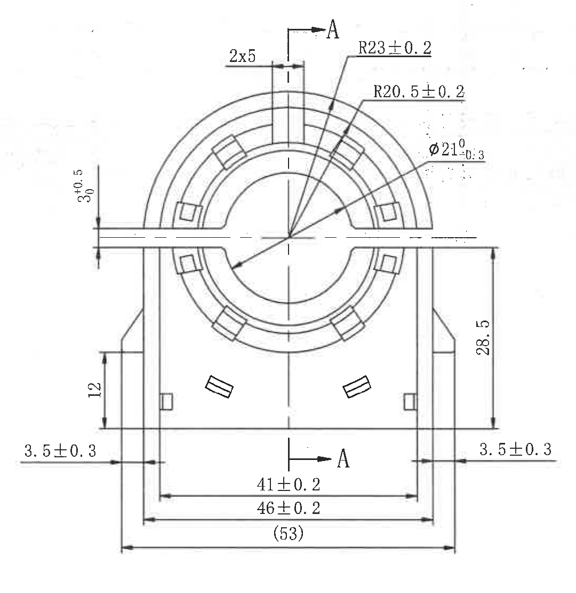
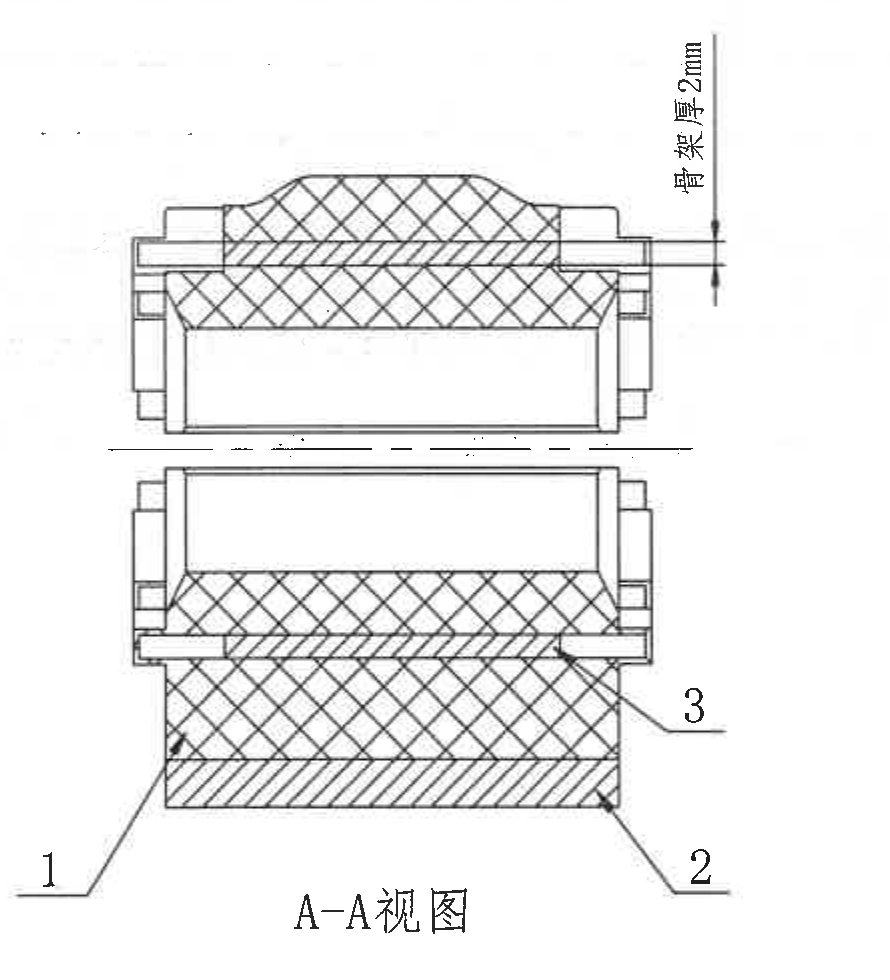
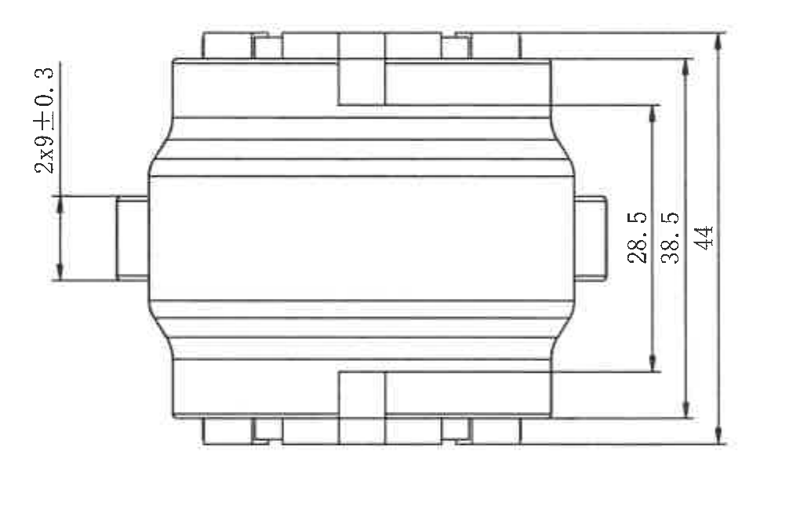
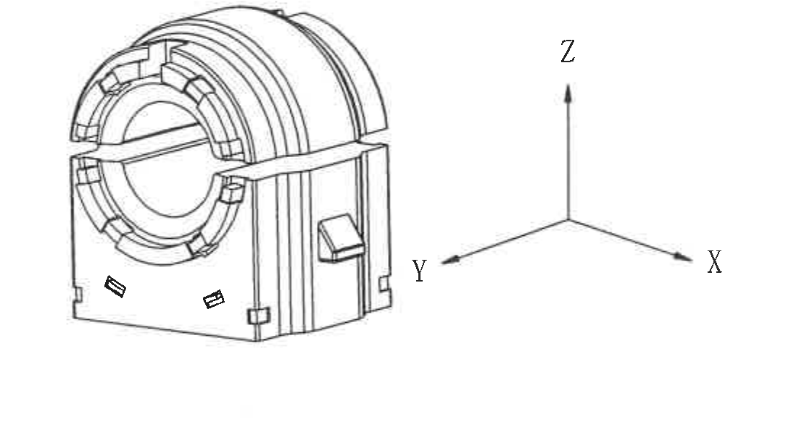
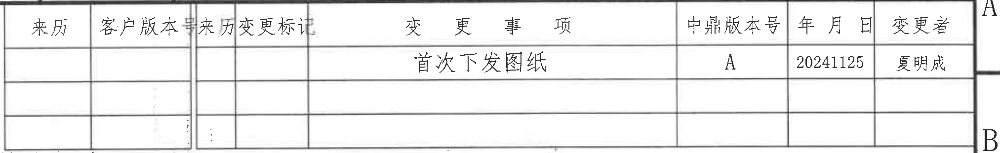
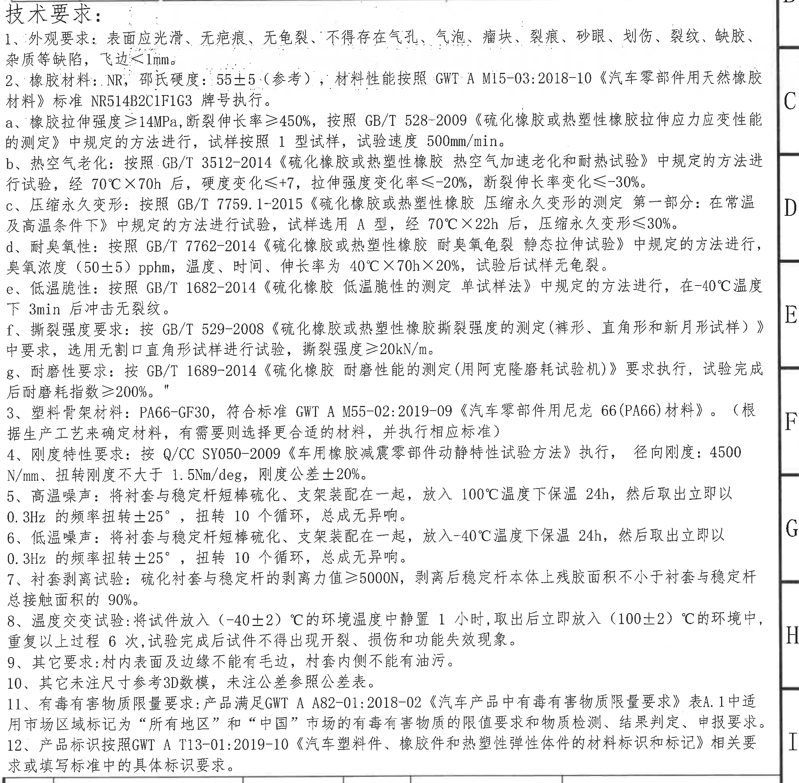
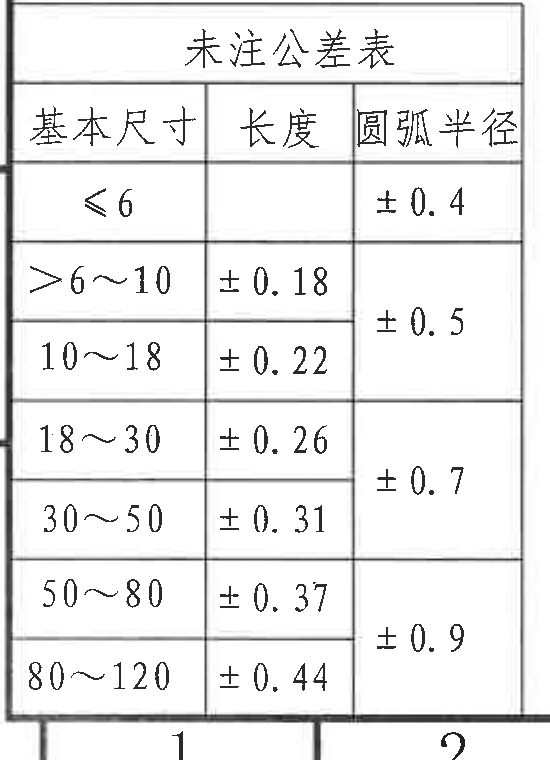
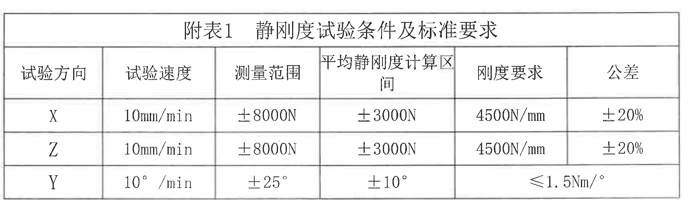
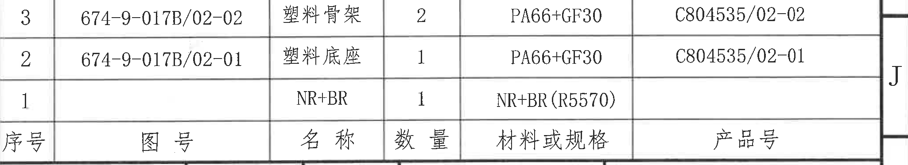
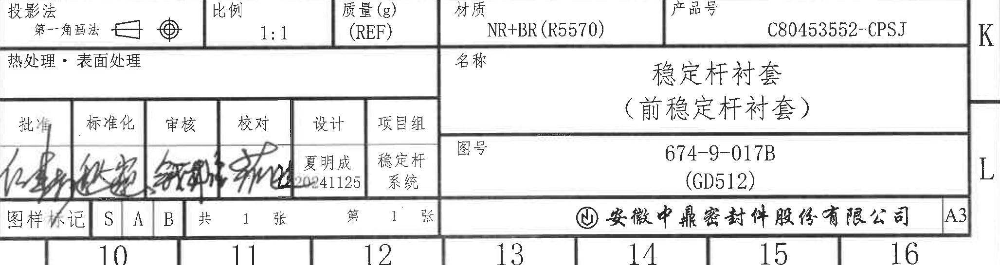

# 20C80453552 内容识别与裁切提取

整页渲染图：`outputs/20C80453552_assets/images/page_1.png`。页面尺寸：4959 x 3505 px。以下对象按原图区域和视图归属记录；尺寸只归入其完整尺寸线、箭头和标注文字所在的裁切对象。

## object_1｜主视图/正面加工视图

原图位置/视图名称：第 1 页，bbox `[610, 340, 1690, 1450]`，主视图/正面加工视图。

| 提取项 | 原图数值或文本 | 含义说明 |
|---|---|---|
| 数量尺寸 | 2x5 | 顶部槽/凸台处尺寸；`2x` 表示两处，单处尺寸为 5。 |
| 圆弧半径 | R23±0.2 | 外侧圆弧/环形轮廓半径，带 ±0.2 公差。 |
| 圆弧半径 | R20.5±0.2 | 内侧圆弧/环形轮廓半径，带 ±0.2 公差。 |
| 直径尺寸 | Φ21 +0/-0.3 | 中心孔径尺寸，含直径符号和上偏差 0、下偏差 -0.3。 |
| 槽/开口尺寸 | 3 +0.5/0 | 左侧横向开口处竖向尺寸，上偏差 +0.5，下偏差 0。 |
| 局部高度 | 12 | 左下侧局部竖向高度。 |
| 主体高度 | 28.5 | 右侧主体竖向高度，归属主视图。 |
| 边宽 | 3.5±0.3（左） | 左侧外边到内侧结构的宽度，带 ±0.3 公差。 |
| 边宽 | 3.5±0.3（右） | 右侧外边到内侧结构的宽度，带 ±0.3 公差。 |
| 底部内宽 | 41±0.2 | 底部内侧宽度，带 ±0.2 公差。 |
| 底部外宽 | 46±0.2 | 底部外侧宽度，带 ±0.2 公差。 |
| 参考总宽 | (53) | 括号内参考尺寸；位于主视图底部，表示总宽参考值，不作为直接受控加工尺寸。 |
| 剖切标识/基准字母 | A-A | 主视图上、下两处 A 箭头定义 A-A 剖视图位置。 |
| 带星号关键尺寸/T编号/角度/弧长 | 原图未见 | 本主视图内未出现星号关键尺寸、T编号、角度尺寸或弧向长度尺寸。 |

边界归属说明：该裁切完整包含主视图所有尺寸线、箭头和文字；左右 `3.5±0.3` 和底部 `(53)` 虽靠近裁切边界，但尺寸线闭合且箭头指向主视图结构，归属本对象。右侧 A-A 剖视图、下方侧向高度视图和右侧 NOTES 未混入。

## object_2｜A-A剖视图

原图位置/视图名称：第 1 页，bbox `[1735, 335, 2625, 1315]`，A-A 剖视图。

| 提取项 | 原图数值或文本 | 含义说明 |
|---|---|---|
| 剖面名称 | A-A视图 | 对应主视图 A-A 剖切线。 |
| 厚度尺寸 | 骨架厚 2mm | 右上侧竖向尺寸，说明骨架厚度为 2 mm。 |
| 件号引出 | 1 | 引出线指向剖面中的第 1 项材料/部件。 |
| 件号引出 | 2 | 引出线指向剖面中的第 2 项材料/部件。 |
| 件号引出 | 3 | 引出线指向剖面中的第 3 项材料/部件。 |
| 带星号关键尺寸/T编号/直径/角度/弧长 | 原图未见 | 本剖视图内未出现这些标注。 |

边界归属说明：`骨架厚 2mm` 的尺寸线和文字完整位于本剖视图右侧；件号 1/2/3 的引出线均终止于剖切结构，归属 A-A 剖视图，不归入主视图或明细表。

## object_3｜侧向高度加工视图

原图位置/视图名称：第 1 页，bbox `[690, 1460, 1710, 2110]`，侧向高度加工视图。

| 提取项 | 原图数值或文本 | 含义说明 |
|---|---|---|
| 数量高度尺寸 | 2x9±0.3 | 左侧竖向尺寸；`2x` 表示两处，高度 9，公差 ±0.3。 |
| 高度尺寸 | 28.5 | 右侧内侧竖向高度。 |
| 高度尺寸 | 38.5 | 右侧中间竖向高度。 |
| 总高度 | 44 | 右侧最外竖向总高度。 |
| 带星号关键尺寸/T编号/直径/半径/角度/弧长 | 原图未见 | 本视图内未出现这些标注。 |

边界归属说明：左侧 `2x9±0.3` 和右侧 `28.5/38.5/44` 均保留完整尺寸线和文字；该视图与上方主视图分离，尺寸不归入主视图。

## object_4｜轴测示意及XYZ方向

原图位置/视图名称：第 1 页，bbox `[1570, 2160, 2690, 2750]`，轴测示意及 XYZ 方向。

| 提取项 | 原图数值或文本 | 含义说明 |
|---|---|---|
| 方向标识 | X | 右下方向轴。 |
| 方向标识 | Y | 左下方向轴。 |
| 方向标识 | Z | 竖直方向轴。 |
| 零件示意 | 三维轴测外观 | 显示衬套、底座和骨架组合形态。 |
| 尺寸/公差 | 原图未见 | 该对象为示意和方向识别，不含尺寸线。 |

边界归属说明：裁切仅包含轴测示意和 X/Y/Z 方向坐标；未包含周围表格或 NOTES。X/Y/Z 与附表1试验方向相关，但本对象自身无尺寸数值。

## object_5｜修订履历表

原图位置/视图名称：第 1 页，bbox `[2760, 165, 4785, 475]`，修订履历表。

原表行列还原：

| 来历 | 客户版本号 | 来历变更标记 | 变更事项 | 中鼎版本号 | 年 月 日 | 变更者 |
|---|---|---|---|---|---|---|
|  |  |  | 首次下发图纸 | A | 20241125 | 夏明成 |
|  |  |  |  |  |  |  |
|  |  |  |  |  |  |  |

| 提取项 | 原图数值或文本 | 含义说明 |
|---|---|---|
| 表头 | 来历；客户版本号；来历变更标记；变更事项；中鼎版本号；年 月 日；变更者 | 修订履历字段。 |
| 修订记录 | 首次下发图纸 / A / 20241125 / 夏明成 | 首次下发记录，中鼎版本号为 A，日期为 20241125，变更者为夏明成。 |
| 空白行 | 2 行空白 | 保留原表中的空白修订记录行。 |

边界归属说明：修订表外框、表头和记录完整。右侧贴近的 `A/B` 是图框坐标字母，不抽取为修订表字段。

## object_6｜技术要求/NOTES

原图位置/视图名称：第 1 页，bbox `[2740, 465, 4790, 2475]`，技术要求/NOTES。

| 提取项 | 原图数值或文本 | 含义说明 |
|---|---|---|
| 1 外观要求 | 表面应光滑、无疤痕、无龟裂、不得存在气孔、气泡、瘤块、裂痕、砂眼、划伤、裂纹、缺胶、杂质等缺陷，飞边≤1mm。 | 外观缺陷控制和飞边限制。 |
| 2 橡胶材料 | NR；邵氏硬度：55±5（参考）；GWT A M15-03:2018-10；NR514B2C1F1G3 | 橡胶材料、参考硬度和材料标准/牌号。 |
| 2a 拉伸性能 | 拉伸强度≥14MPa；断裂伸长率≥450%；GB/T 528-2009；1型试样；500mm/min | 橡胶拉伸试验要求。 |
| 2b 热空气老化 | GB/T 3512-2014；70℃×70h；硬度变化≤+7；拉伸强度变化率≤-20%；断裂伸长率变化≤-30% | 热空气老化后的性能变化限制。 |
| 2c 压缩永久变形 | GB/T 7759.1-2015；A型；70℃×22h；压缩永久变形≤30% | 压缩永久变形试验条件和限值。 |
| 2d 耐臭氧性 | GB/T 7762-2014；臭氧浓度（50±5）pphm；40℃×70h×20%；试验后无龟裂 | 臭氧龟裂静态拉伸试验要求。 |
| 2e 低温脆性 | GB/T 1682-2014；-40℃；3min；冲击无裂纹 | 低温脆性试验要求。 |
| 2f 撕裂强度 | GB/T 529-2008；无割口直角形试样；撕裂强度≥20kN/m | 撕裂强度试验要求。 |
| 2g 耐磨性 | GB/T 1689-2014；耐磨耗指数≥200% | 阿克隆磨耗试验要求。 |
| 3 塑料骨架材料 | PA66-GF30；GWT A M55-02:2019-09 | 塑料骨架材料及标准。 |
| 4 刚度特性 | Q/CC SY050-2009；径向刚度 4500 N/mm；扭转刚度不大于 1.5Nm/deg；刚度公差±20% | 动静特性试验和刚度限值。 |
| 5 高温噪声 | 100℃保温24h；0.3Hz；扭转±25°；10个循环；总成无异响 | 高温噪声验证条件。 |
| 6 低温噪声 | -40℃保温24h；0.3Hz；扭转±25°；10个循环；总成无异响 | 低温噪声验证条件。 |
| 7 衬套剥离试验 | 剥离力值≥5000N；残胶面积不小于总接触面积的90% | 衬套与稳定杆剥离强度和残胶面积要求。 |
| 8 温度交变试验 | （-40±2）℃静置1小时；（100±2）℃；重复6次；不得开裂、损伤和功能失效 | 温度循环耐久要求。 |
| 9 其它要求 | 衬内表面及边缘不能有毛边，衬套内侧不能有油污。 | 表面和油污要求。 |
| 10 未注尺寸/公差 | 其它未注尺寸参考3D数模，未注公差参照公差表。 | 未注尺寸和公差来源。 |
| 11 有害物质 | GWT A A82-01:2018-02；表A.1；“所有地区”和“中国”市场 | 有毒有害物质限量要求。 |
| 12 产品标识 | GWT A T13-01:2019-10 | 材料标识和标记要求。 |

边界归属说明：技术要求标题和 1-12 条完整包含。右侧 `B-I` 为图框坐标字母，不属于 NOTES 文本。NOTES 中的 `55±5（参考）` 是材料性能参考值，不是加工视图尺寸。

## object_7｜未注公差表

原图位置/视图名称：第 1 页，bbox `[355, 2620, 905, 3380]`，未注公差表。

原表行列还原：

| 基本尺寸 | 长度 | 圆弧半径 |
|---|---|---|
| ≤6 |  | ±0.4 |
| >6~10 | ±0.18 | ±0.5 |
| 10~18 | ±0.22 | ±0.5 |
| 18~30 | ±0.26 | ±0.7 |
| 30~50 | ±0.31 | ±0.7 |
| 50~80 | ±0.37 | ±0.9 |
| 80~120 | ±0.44 | ±0.9 |

| 提取项 | 原图数值或文本 | 含义说明 |
|---|---|---|
| 长度未注公差 | >6~10：±0.18；10~18：±0.22；18~30：±0.26；30~50：±0.31；50~80：±0.37；80~120：±0.44 | 未注长度尺寸按基本尺寸范围选取。 |
| 圆弧半径未注公差 | ≤6：±0.4；>6~18：±0.5；18~50：±0.7；50~120：±0.9 | 原表圆弧半径列为跨行单元格，按覆盖范围解释。 |

边界归属说明：表格标题、表头、全部行和下边框完整；底部图框坐标编号不作为表格字段。

## object_8｜附表1 静刚度试验条件及标准要求

原图位置/视图名称：第 1 页，bbox `[990, 2810, 2710, 3310]`，附表1 静刚度试验条件及标准要求。

原表行列还原：

| 试验方向 | 试验速度 | 测量范围 | 平均静刚度计算区间 | 刚度要求 | 公差 |
|---|---|---|---|---|---|
| X | 10mm/min | ±8000N | ±3000N | 4500N/mm | ±20% |
| Z | 10mm/min | ±8000N | ±3000N | 4500N/mm | ±20% |
| Y | 10°/min | ±25° | ±10° | ≤1.5Nm/° |  |

| 提取项 | 原图数值或文本 | 含义说明 |
|---|---|---|
| X 方向刚度 | 10mm/min；±8000N；±3000N；4500N/mm；±20% | X 方向静刚度试验条件和公差。 |
| Z 方向刚度 | 10mm/min；±8000N；±3000N；4500N/mm；±20% | Z 方向静刚度试验条件和公差。 |
| Y 方向扭转 | 10°/min；±25°；±10°；≤1.5Nm/° | Y 方向扭转刚度试验条件；该角度为试验条件，不是加工视图尺寸。 |

边界归属说明：重裁后表格标题、X/Z/Y 三行和下边框完整；未混入标题栏或左侧未注公差表。

## object_9｜明细表/BOM

原图位置/视图名称：第 1 页，bbox `[2755, 2470, 4805, 2845]`，明细表/BOM。

原表行列还原：

| 序号 | 图号 | 名称 | 数量 | 材料或规格 | 产品号 |
|---|---|---|---|---|---|
| 3 | 674-9-017B/02-02 | 塑料骨架 | 2 | PA66+GF30 | C804535/02-02 |
| 2 | 674-9-017B/02-01 | 塑料底座 | 1 | PA66+GF30 | C804535/02-01 |
| 1 |  | NR+BR | 1 | NR+BR(R5570) |  |

| 提取项 | 原图数值或文本 | 含义说明 |
|---|---|---|
| 序号3 | 674-9-017B/02-02；塑料骨架；2；PA66+GF30；C804535/02-02 | 塑料骨架明细，数量 2。 |
| 序号2 | 674-9-017B/02-01；塑料底座；1；PA66+GF30；C804535/02-01 | 塑料底座明细，数量 1。 |
| 序号1 | 图号空白；NR+BR；1；NR+BR(R5570)；产品号空白 | 橡胶材料明细，数量 1。 |

边界归属说明：裁切到明细表下边框，未混入下方标题栏；右侧 `J` 为图框坐标字母，不作为表格字段。

## object_10｜标题栏

原图位置/视图名称：第 1 页，bbox `[2755, 2845, 4810, 3390]`，标题栏。

原表行列还原：

| 字段 | 原图文本 |
|---|---|
| 投影法 | 第一角画法 |
| 比例 | 1:1 |
| 质量(g) | (REF) |
| 材质 | NR+BR(R5570) |
| 产品号 | C80453552-CPSJ |
| 热处理·表面处理 |  |
| 名称 | 稳定杆衬套（前稳定杆衬套） |
| 图号 | 674-9-017B (GD512) |
| 批准 | 签名 |
| 标准化 | 签名 |
| 审核 | 签名 |
| 校对 | 签名 |
| 设计 | 夏明成 20241125 |
| 项目组 | 稳定杆系统 |
| 图样标记 | S A B |
| 张数 | 共 1 张，第 1 张 |
| 公司 | 安徽中鼎密封件股份有限公司 |
| 图幅 | A3 |

| 提取项 | 原图数值或文本 | 含义说明 |
|---|---|---|
| 产品标识 | C80453552-CPSJ | 标题栏产品号。 |
| 图号 | 674-9-017B (GD512) | 标题栏图号和括号内代号。 |
| 名称 | 稳定杆衬套（前稳定杆衬套） | 零件名称。 |
| 材料 | NR+BR(R5570) | 标题栏材料字段。 |
| 参考质量 | (REF) | 质量字段仅为参考，无数值。 |
| 比例/投影法 | 1:1；第一角画法 | 绘图比例和投影法。 |

边界归属说明：标题栏外框、产品号、图号、名称、签署栏、公司名和 A3 图幅完整；底部 `10-16` 为图框坐标编号，不作为标题栏字段。

## 裁切检查记录

| 对象 | 裁切图片 | 完整性检查 | 归属检查 |
|---|---|---|---|
| object_1 | `object_1.png` | 完整包含主视图尺寸线、箭头、文字、A-A 标识和底部 `(53)` 参考尺寸。 | 未混入 A-A 剖视图、侧向高度视图或 NOTES。 |
| object_2 | `object_2.png` | 完整包含 A-A 剖视图、骨架厚 2mm、件号 1/2/3 和剖面名称。 | 件号引出线归属剖视图，不归入明细表。 |
| object_3 | `object_3.png` | 完整包含 `2x9±0.3`、`28.5`、`38.5`、`44` 的尺寸线和文字。 | 与主视图分离，未混入轴测图。 |
| object_4 | `object_4.png` | 完整包含轴测示意和 X/Y/Z 方向轴。 | 无尺寸线；未混入附表或标题栏。 |
| object_5 | `object_5.png` | 完整包含修订履历表外框、表头和记录。 | 右侧 A/B 为图框坐标，已排除为表格字段。 |
| object_6 | `object_6.png` | 完整包含技术要求标题和 1-12 条文本。 | 右侧 B-I 为图框坐标，未作为 NOTES 内容。 |
| object_7 | `object_7.png` | 完整包含未注公差表标题、表头、全部数据行和下边框。 | 底部图框编号不抽取为公差数据。 |
| object_8 | `object_8.png` | 首轮裁切底部 Y 行贴边，已向下扩边重裁；现完整包含 Y 行和下边框。 | 未混入标题栏或左侧未注公差表。 |
| object_9 | `object_9.png` | 完整包含明细表三条记录和表头；已收紧下边界。 | 未混入下方标题栏字段，右侧 J 为图框坐标。 |
| object_10 | `object_10.png` | 完整包含标题栏字段、签署栏、公司名和 A3 图幅。 | 底部 10-16 为图框坐标编号，不作为标题栏字段。 |
