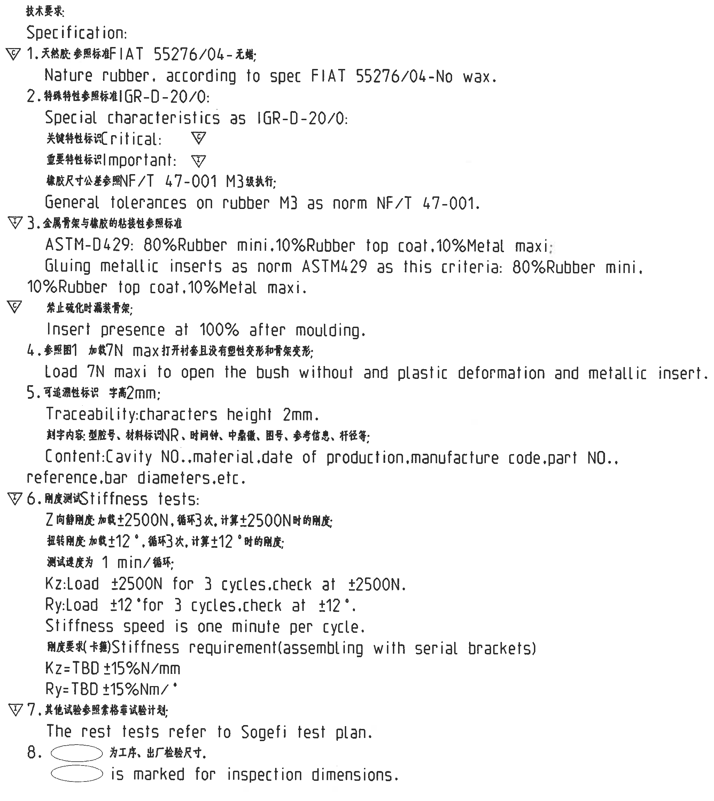
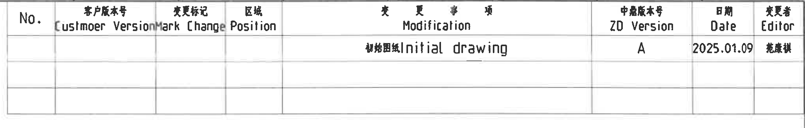
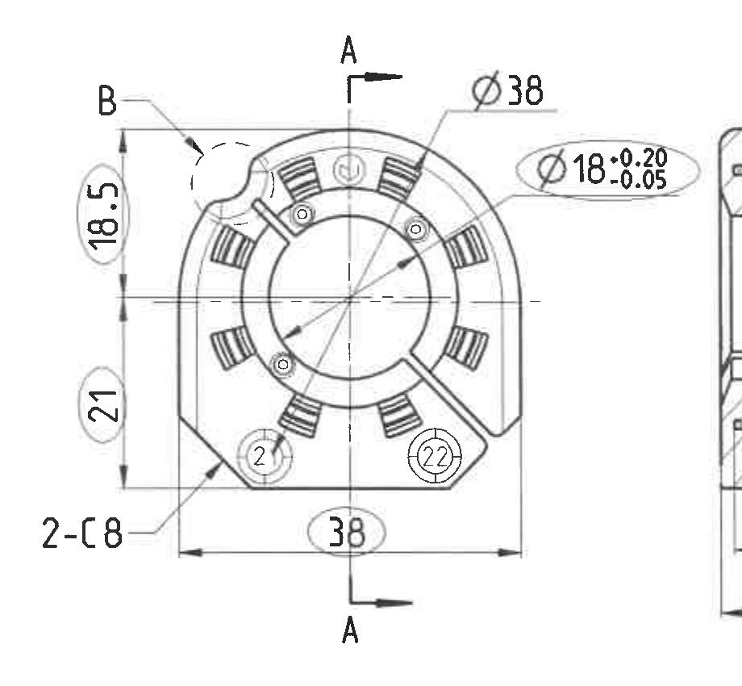
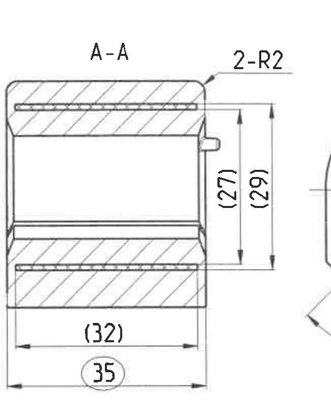
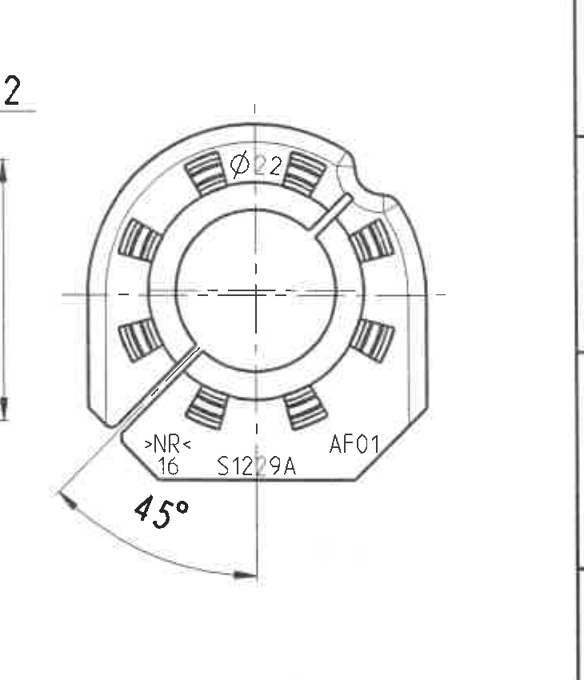
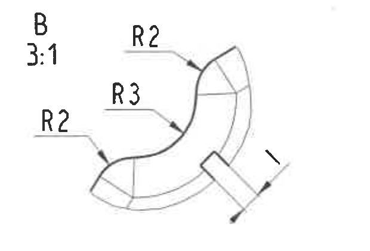
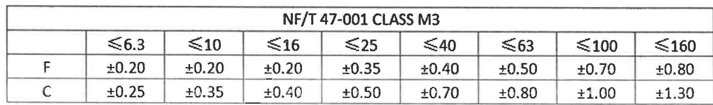
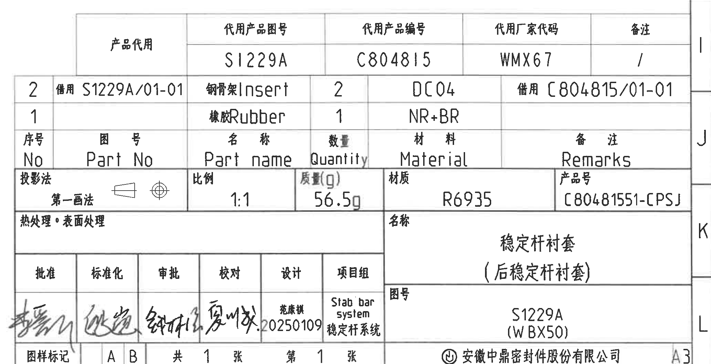

# 20C80481551 内容识别结果

整页 PNG：`outputs/20C80481551_assets/images/page_1.png`  
图纸页：1；整页像素：4959 x 3505；bbox：`[0, 0, 4959, 3505]`  
说明：尺寸单位按图纸默认读取为 mm，角度为 °，力为 N；括号尺寸按参考尺寸读取；椭圆圈出的尺寸按 NOTES 第 8 条读取为检验尺寸。

## object_1 - NOTES / 技术要求

原图位置/视图名称：左侧技术要求 NOTES；bbox：`[500, 350, 2550, 2650]`；object_kind：`notes`

| 提取项 | 原图数值或文本 | 含义说明 |
|---|---|---|
| 标题 | 技术要求；Specification | 技术要求区标题。 |
| 特性符号 | 三角形 C；三角形 I | C 表示 Critical 关键特性；I 表示 Important 重要特性。 |
| 1 | 天然胶 参照标准 FIAT 55276/04-无蜡；Nature rubber, according to spec FIAT 55276/04-No wax. | 材料为天然橡胶，按 FIAT 55276/04，无蜡。左侧带 C 关键特性符号。 |
| 2 | 特殊特性参照标准 IGR-D-20/0；Special characteristics as IGR-D-20/0. | 特殊特性按 IGR-D-20/0。 |
| 2-关键特性 | 关键特性标识 Critical: 三角形 C | 定义关键特性标识。 |
| 2-重要特性 | 重要特性标识 Important: 三角形 I | 定义重要特性标识。 |
| 2-橡胶公差 | 橡胶尺寸公差参照 NF/T 47-001 M3 级执行；General tolerances on rubber M3 as norm NF/T 47-001. | 橡胶尺寸采用 NF/T 47-001 CLASS M3 一般公差。 |
| 3 | 金属骨架与橡胶的粘接性参照标准；ASTM-D429: 80%Rubber mini, 10%Rubber top coat, 10%Metal maxi; Gluing metallic inserts as norm ASTM429 as this criteria: 80%Rubber mini, 10%Rubber top coat, 10%Metal maxi. | 金属骨架与橡胶粘接要求，最少 80% 橡胶、最多 10% 橡胶面涂层、最多 10% 金属。左侧带 I 重要特性符号。 |
| 3-骨架存在 | 禁止硫化时漏装骨架；Insert presence at 100% after moulding. | 硫化后必须 100% 确认金属骨架存在。左侧带 C 关键特性符号。 |
| 4 | 参照图1 加载 7N max 打开衬套且没有塑性变形和骨架变形；Load 7N maxi to open the bush without and plastic deformation and metallic insert. | 衬套打开载荷最大 7N，且不得出现塑性变形或金属骨架变形。 |
| 5 | 可追溯性标识 字高 2mm；Traceability: characters height 2mm. | 追溯性刻字高度 2mm。 |
| 5-刻字内容 | 型腔号、材料标识 NR、时间钟、中鼎徽、图号、参考信息、杆径等；Content: Cavity NO., material, date of production, manufacture code, part NO., reference, bar diameters, etc. | 规定产品上应刻的追溯信息。 |
| 6 | 刚度测试 Stiffness tests | 刚度测试要求；左侧带 I 重要特性符号。 |
| 6-Kz | Z 向静刚度 加载 ±2500N，循环 3 次，计算 ±2500N 时的刚度；Kz: Load ±2500N for 3 cycles, check at ±2500N. | Z 向静刚度测试条件。 |
| 6-Ry | 扭转刚度 加载 ±12°，循环 3 次，计算 ±12° 时的刚度；Ry: Load ±12° for 3 cycles, check at ±12°. | 扭转刚度测试条件。 |
| 6-速度 | 测试速度为 1 min/循环；Stiffness speed is one minute per cycle. | 每循环 1 分钟。 |
| 6-刚度要求 | 刚度要求(卡箍) Stiffness requirement(assembling with serial brackets); Kz=TBD ±15%N/mm; Ry=TBD ±15%Nm/° | 装配卡箍后的刚度要求，Kz 和 Ry 目标值待定，允许 ±15%。 |
| 7 | 其他试验参照索格菲试验计划；The rest tests refer to Sogefi test plan. | 其他试验按 Sogefi 试验计划。左侧带 I 重要特性符号。 |
| 8 | 椭圆标识 为工序、出厂检验尺寸；椭圆标识 is marked for inspection dimensions. | 图中被椭圆圈出的尺寸为工序/出厂检验尺寸。 |

边界归属说明：该裁切仅包含左侧 NOTES 文本区；右边界收在视图标注前，未提取右侧主视图尺寸。NOTES 中的 C/I 三角符号属于技术要求，不归入任何加工视图尺寸。

## object_2 - 修订履历表

原图位置/视图名称：右上修订履历表；bbox：`[2650, 205, 4700, 535]`；object_kind：`table`

| No. | 客户版本号 / Customer Version | 变更标记 / Mark Change | 区域 / Position | 变更事项 / Modification | 中鼎版本号 / ZD Version | 日期 / Date | 变更者 / Editor |
|---|---|---|---|---|---|---|---|
|  |  |  |  | 初始图纸 Initial drawing | A | 2025.01.09 | 范康棋 |
|  |  |  |  |  |  |  |  |
|  |  |  |  |  |  |  |  |

| 提取项 | 原图数值或文本 | 含义说明 |
|---|---|---|
| 表头 | No.; Customer Version; Mark Change; Position; Modification; ZD Version; Date; Editor | 修订履历列头，中文/英文并列。 |
| 修订记录 1 | 初始图纸 Initial drawing; ZD Version=A; Date=2025.01.09; Editor=范康棋 | 初始发布记录。 |
| 空白记录行 | 2 行空白 | 原表保留两行空白修订记录。 |

边界归属说明：裁切包含完整修订表外框、列头和三行记录区；未包含下方图纸视图。表格左上、右下边界未截断文字。

## object_3 - 主视图 / 正面加工视图

原图位置/视图名称：右中左侧主视图；bbox：`[2575, 990, 3495, 1840]`；object_kind：`view`

| 提取项 | 原图数值或文本 | 含义说明 |
|---|---|---|
| 剖切标识 | A / A | 中心竖向剖切线和箭头，指向 A-A 剖面视图。该字母为剖面视图索引，不作为基准 datum 读取。 |
| 局部视图标识 | B | 引线指向左上局部区域，对应 detail B；该字母为局部视图索引，不作为基准 datum 读取。 |
| 直径 | Ø38 | 主视图环形外径/圆周相关直径标注。 |
| 检验直径 | Ø18 +0.20/-0.05 | 主视图中心内孔直径，带上偏差 +0.20、下偏差 -0.05；椭圆圈出，按 NOTES 第 8 条为检验尺寸。 |
| 检验尺寸 | 18.5 | 左侧上段竖向尺寸，从上方轮廓/基准线到水平中心线；椭圆圈出，为检验尺寸。 |
| 检验尺寸 | 21 | 左侧下段竖向尺寸，从水平中心线到下方轮廓/基准线；椭圆圈出，为检验尺寸。 |
| 数量前缀/倒角 | 2-C8 | 两处 C8 倒角，箭头指向下方斜角区域。 |
| 检验尺寸 | 38 | 底部水平总宽/跨距尺寸；椭圆圈出，为检验尺寸。 |
| 圆圈标记 | 2 | 主视图下左侧圆圈内标记，属于产品刻字/型腔或追溯标识，不作为尺寸读取。 |
| 圆圈标记 | 22 | 主视图下右侧圆圈内标记，属于产品刻字/追溯标识，不作为尺寸读取。 |
| 星号关键尺寸 | 未见星号尺寸 | 本视图未见星号标注；关键/重要特性符号见 NOTES。 |
| T 编号 | 未见 T 编号 | 本视图未见 T 编号。 |

边界归属说明：`Ø18 +0.20/-0.05` 的完整文字、引线和箭头均指向主视图中心孔，因此归属主视图。右边缘露出极少 A-A 剖面图线残片，无尺寸文字，不提取到主视图；A-A 剖面尺寸不归入本对象。

## object_4 - A-A 剖面视图

原图位置/视图名称：右中 A-A 剖面；bbox：`[3455, 990, 4105, 1810]`；object_kind：`section`

| 提取项 | 原图数值或文本 | 含义说明 |
|---|---|---|
| 剖面名称 | A-A | 对应主视图中的 A-A 剖切线。 |
| 数量前缀/圆角 | 2-R2 | 两处 R2 圆角，箭头指向剖面右上外角区域。 |
| 参考尺寸 | (27) | 右侧内侧竖向参考尺寸，括号表示参考尺寸，不作为主控尺寸读取。 |
| 参考尺寸 | (29) | 右侧外侧竖向参考尺寸，括号表示参考尺寸；为剖面方向外轮廓高度参考。 |
| 参考尺寸 | (32) | 底部内侧水平参考尺寸，括号表示参考尺寸。 |
| 检验尺寸 | 35 | 底部外侧水平长度/总长尺寸；椭圆圈出，为检验尺寸。 |
| 星号关键尺寸 | 未见星号尺寸 | 本剖面未见星号标注。 |
| T 编号 | 未见 T 编号 | 本剖面未见 T 编号。 |

边界归属说明：本裁切完整包含 A-A 剖面标题、剖面轮廓、剖面线和尺寸线。右侧有极少端面视图片段，左侧不含主视图尺寸文字；`(27)`、`(29)`、`(32)`、`35` 与 `2-R2` 均按其完整箭头/尺寸线归入 A-A 剖面。

## object_5 - 右侧端面视图

原图位置/视图名称：右中右侧端面视图；bbox：`[3985, 995, 4715, 1845]`；object_kind：`view`

| 提取项 | 原图数值或文本 | 含义说明 |
|---|---|---|
| 直径/标记 | Ø22 | 端面上方可见直径标注或刻字标识，位于端面视图内部。 |
| 角度/弧向尺寸 | 45° | 左下方弧线角度，箭头完整，归属端面视图斜向开口/切向位置。 |
| 追溯/材料标记 | >NR< | 端面下左侧刻字，NR 为材料标识，符合 NOTES 中可追溯性内容。 |
| 标记编号 | 16 | 位于 `>NR<` 下方，属于刻字/追溯编号。 |
| 图号刻字 | S1229A | 端面下方产品图号刻字。 |
| 制造/追溯码 | AF01 | 端面下右侧制造或追溯代码。 |
| 星号关键尺寸 | 未见星号尺寸 | 本视图未见星号标注。 |
| T 编号 | 未见 T 编号 | 本视图未见 T 编号。 |

边界归属说明：`45°` 弧线、箭头和文字完整包含，虽然靠近左边界，但弧线和箭头均指向端面视图下方斜边，因此归属端面视图。左上角残留的 `2-R2` 尾部来自 A-A 剖面，未作为本视图内容提取；右侧图框坐标栏未纳入字段。

## object_6 - 局部视图 B

原图位置/视图名称：右中下方局部视图 B；bbox：`[2675, 1835, 3295, 2255]`；object_kind：`detail`

| 提取项 | 原图数值或文本 | 含义说明 |
|---|---|---|
| 局部视图名称 | B | 对应主视图左上 B 引出位置。 |
| 比例 | 3:1 | 局部视图放大比例。 |
| 半径 | R2 | 上方外圆角半径。 |
| 半径 | R3 | 中部内凹圆弧半径。 |
| 半径 | R2 | 左下/外侧圆角半径。 |
| 尺寸 | 1 | 右下斜向小尺寸，指示局部凸出/槽部宽度或厚度。 |
| 星号关键尺寸 | 未见星号尺寸 | 本局部视图未见星号标注。 |
| T 编号 | 未见 T 编号 | 本局部视图未见 T 编号。 |

边界归属说明：裁切仅保留局部视图 B 的放大轮廓和 R2/R3/R2/1 标注，未带入下方标题栏。局部尺寸不归入主视图。

## object_7 - NF/T 47-001 CLASS M3 公差表

原图位置/视图名称：左下公差表；bbox：`[450, 2960, 2670, 3290]`；object_kind：`table`

| NF/T 47-001 CLASS M3 | ≤6.3 | ≤10 | ≤16 | ≤25 | ≤40 | ≤63 | ≤100 | ≤160 |
|---|---:|---:|---:|---:|---:|---:|---:|---:|
| F | ±0.20 | ±0.20 | ±0.20 | ±0.35 | ±0.40 | ±0.50 | ±0.70 | ±0.80 |
| C | ±0.25 | ±0.35 | ±0.40 | ±0.50 | ±0.70 | ±0.80 | ±1.00 | ±1.30 |

| 提取项 | 原图数值或文本 | 含义说明 |
|---|---|---|
| 标题 | NF/T 47-001 CLASS M3 | 橡胶尺寸一般公差表，对应 NOTES 第 2 条。 |
| F 行 | ±0.20, ±0.20, ±0.20, ±0.35, ±0.40, ±0.50, ±0.70, ±0.80 | F 类尺寸在各尺寸范围内的公差。 |
| C 行 | ±0.25, ±0.35, ±0.40, ±0.50, ±0.70, ±0.80, ±1.00, ±1.30 | C 类尺寸在各尺寸范围内的公差。 |

边界归属说明：裁切包含完整表格外框、标题、列头和 F/C 两行数据；未纳入标题栏或其他图纸内容。

## object_8 - 标题栏 / 明细栏

原图位置/视图名称：右下标题栏、明细栏、产品代用栏；bbox：`[2700, 2250, 4770, 3310]`；object_kind：`title_block`

产品代用栏：

| 产品代用 | 代用产品图号 | 代用产品编号 | 代用厂家代码 | 备注 |
|---|---|---|---|---|
|  | S1229A | C804815 | WMX67 | / |

明细栏：

| 序号 / No | 图号 / Part No | 名称 / Part name | 数量 / Quantity | 材料 / Material | 备注 / Remarks |
|---:|---|---|---:|---|---|
| 2 | 借用 S1229A/01-01 | 钢骨架 Insert | 2 | DC04 | 借用 C804815/01-01 |
| 1 |  | 橡胶 Rubber | 1 | NR+BR |  |

标题栏字段：

| 提取项 | 原图数值或文本 | 含义说明 |
|---|---|---|
| 投影法 | 第一画法；第一角法投影符号 | 图纸采用第一角法。 |
| 比例 | 1:1 | 图纸比例。 |
| 质量(g) | 56.5g | 零件质量。 |
| 材质 | R6935 | 标题栏材料/材质字段。 |
| 产品号 | C80481551-CPSJ | 产品号字段。 |
| 热处理·表面处理 | 空白 | 原图未填写。 |
| 名称 | 稳定杆衬套（后稳定杆衬套） | 零件名称。 |
| 图号 | S1229A (WBX50) | 图号及括号内车型/项目代号。 |
| 批准 | 手写签名，难辨 | 签核栏；扫描文字不可可靠识别。 |
| 标准化 | 手写签名，难辨 | 签核栏；扫描文字不可可靠识别。 |
| 审批 | 手写签名，难辨 | 签核栏；扫描文字不可可靠识别。 |
| 校对 | 手写签名，疑读“夏…” | 签核栏；扫描文字部分可见但不能精确认定。 |
| 设计 | 范康棋；20250109 | 设计人员与日期。 |
| 项目组 | Stab bar system；稳定杆系统 | 项目组字段。 |
| 图样标记 | A；B | 图样标记栏。 |
| 张数 | 共 1 张；第 1 张 | 图纸页数信息。 |
| 公司 | 安徽中鼎密封件股份有限公司 | 出图单位。 |
| 幅面 | A3 | 图纸幅面。 |

边界归属说明：裁切覆盖标题栏、明细栏、产品代用栏和签核栏。右侧少量图框坐标字母位于标题栏外框之外，不作为标题栏字段提取；下方图框坐标数字未作为标题栏内容提取。

## 裁切检查记录

| 对象 | 图片路径 | 检查结果 | 边界处理说明 |
|---|---|---|---|
| page_1 | outputs/20C80481551_assets/images/page_1.png | 整页渲染完整，4959 x 3505。 | PDF 先渲染为整页 PNG，再进行对象裁切。 |
| object_1 | outputs/20C80481551_assets/images/object_1.png | NOTES 文字完整，无右侧视图尺寸混入。 | 经重裁收紧右边界，去除主视图标注残片。 |
| object_2 | outputs/20C80481551_assets/images/object_2.png | 修订表外框、表头、数据行完整。 | 未裁掉列头或日期/编辑者文字。 |
| object_3 | outputs/20C80481551_assets/images/object_3.png | 主视图尺寸线、箭头和文字完整，含 `Ø18 +0.20/-0.05`。 | 右缘有 A-A 剖面极少线条残片，无尺寸文字，已在提取中排除。 |
| object_4 | outputs/20C80481551_assets/images/object_4.png | A-A 剖面尺寸线、参考尺寸和剖面标题完整。 | 右侧有端面视图极少边缘残片，未提取为剖面内容。 |
| object_5 | outputs/20C80481551_assets/images/object_5.png | 端面视图 `45°` 弧线、箭头、`Ø22` 和刻字完整。 | 左上 `2-R2` 尾部属于 A-A 剖面，已排除；为保留完整 45° 弧线未再向左裁切。 |
| object_6 | outputs/20C80481551_assets/images/object_6.png | 局部视图 B 的 R2/R3/R2 和 `1` 尺寸完整。 | 经重裁去除下方标题栏边线。 |
| object_7 | outputs/20C80481551_assets/images/object_7.png | 公差表标题、列头、F/C 行完整。 | 未混入其他表格。 |
| object_8 | outputs/20C80481551_assets/images/object_8.png | 标题栏、明细栏、产品代用栏和签核栏完整。 | 右侧图框坐标字母不作为标题栏字段；手写签名按可见性标注难辨。 |
