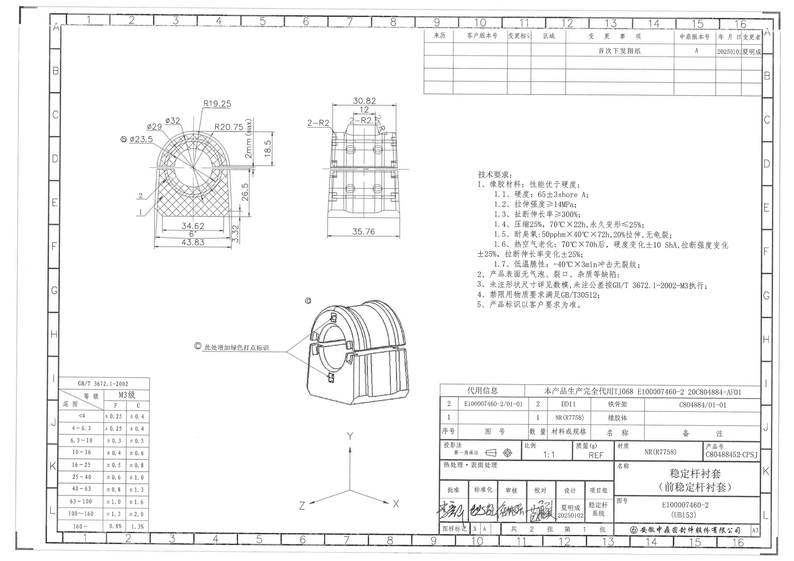
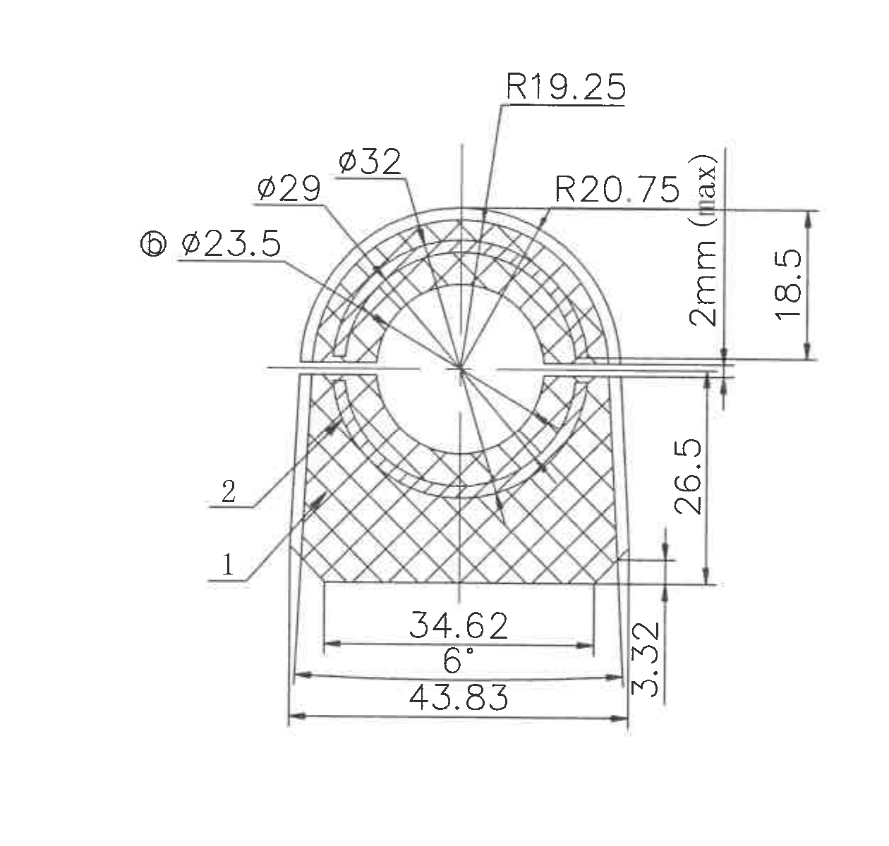
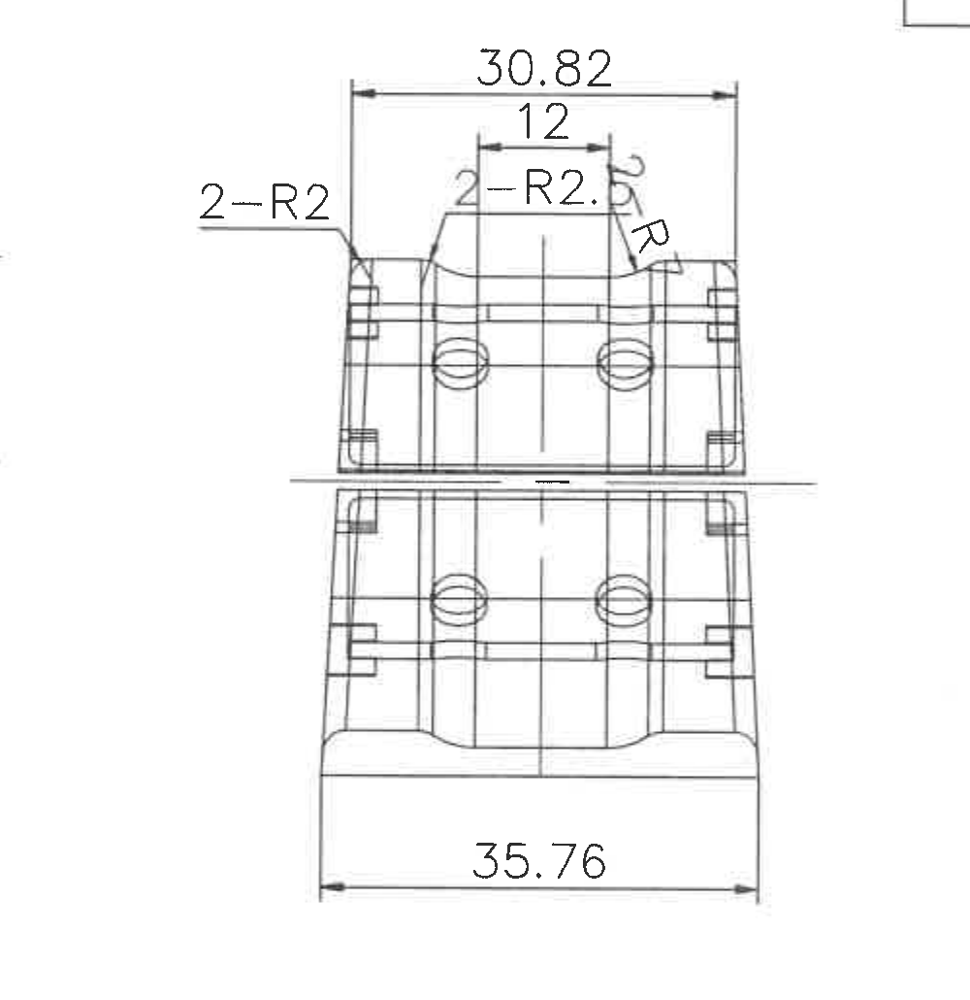
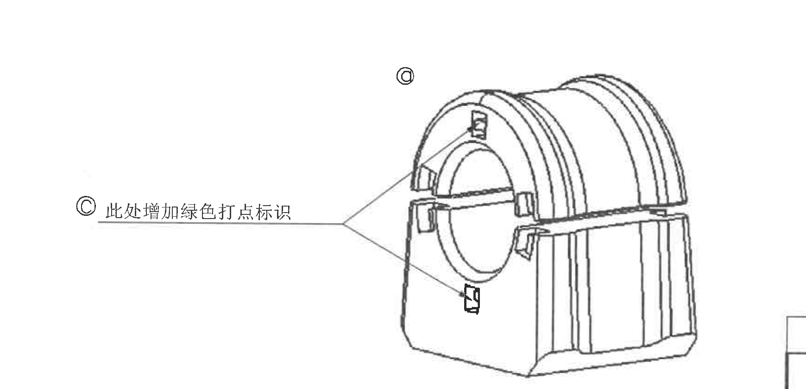
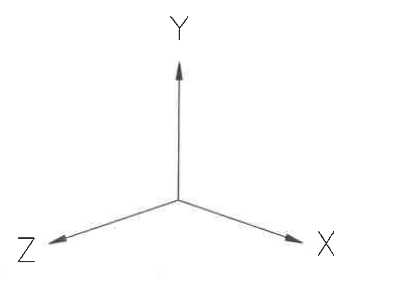
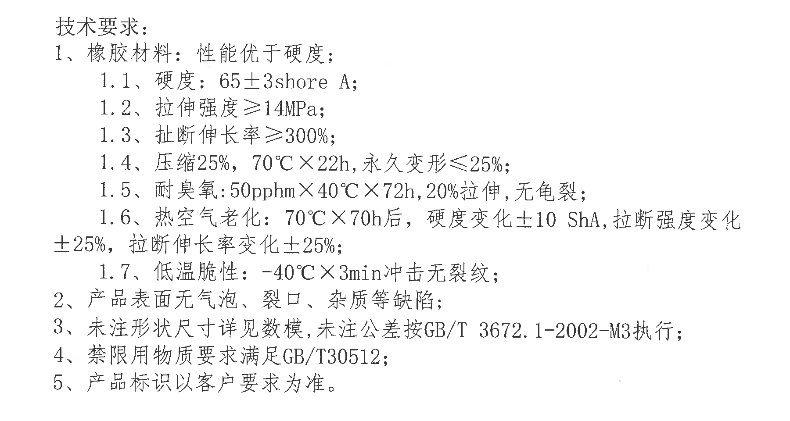
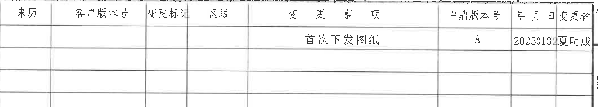
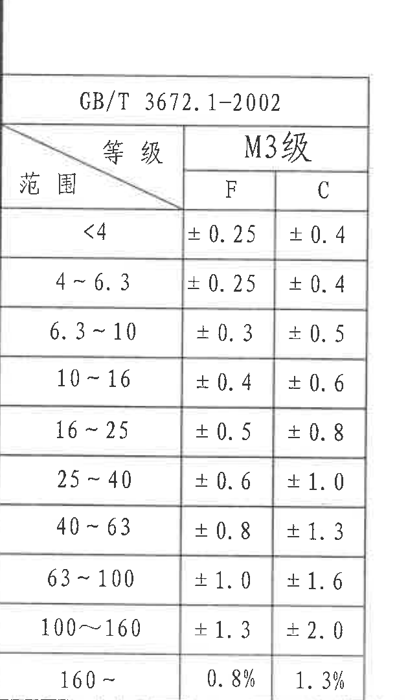
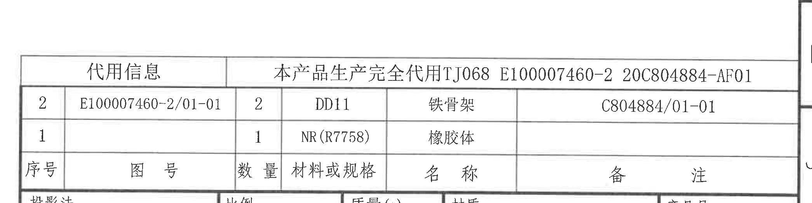
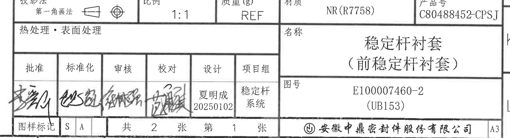

# 20C80488452.pdf 内容识别

## 页面渲染

| 项目 | 内容 |
|---|---|
| PDF | input/20C80488452.pdf |
| 页码 | 1 |
| 整页 PNG | outputs/20C80488452_assets/images/page_1.png |
| 整页像素尺寸 | 4959 x 3505 |
| 图纸结构 | 左上剖面视图；上中正视加工视图；中下等轴测局部标识图；中下坐标轴；右中 NOTES；右上修订履历表；左下 GB/T 3672.1-2002 公差表；右下代用信息/BOM；右下标题栏 |

## object_1：左上剖面视图

| 项目 | 内容 |
|---|---|
| 原图位置/视图名称 | 左上区域，剖面视图 |
| object_kind | section |
| bbox | [555, 525, 1815, 1725] |

| 提取项 | 原图数值或文本 | 含义说明 |
|---|---|---|
| 外圆/外弧直径 | φ32 | 上部圆弧相关直径尺寸，引线指向上部环形截面 |
| 中间圆/弧直径 | φ29 | 环形截面中间圆弧相关直径尺寸，引线指向左上弧段 |
| 内孔/内弧直径 | 圈注 b φ23.5 | 引线指向中心内孔/内弧；前缀为圈注 b 类符号，按原图保留，表示该尺寸带局部特征标识 |
| 顶部内弧半径 | R19.25 | 顶部圆弧内侧半径，引线指向上部圆弧区域 |
| 顶部外弧半径 | R20.75 | 顶部圆弧外侧半径，引线指向上部外弧 |
| 最大厚度/间隙 | 2mm (max) | 右侧竖向标注，表示该处 2 mm 为最大允许值 |
| 上半部高度 | 18.5 | 从水平基准/分型线到上方标注端点的高度 |
| 主体高度 | 26.5 | 右侧竖向尺寸，表示下部主体到分型线附近的高度 |
| 底部台阶高度 | 3.32 | 右侧底部小竖向尺寸，表示底部台阶/边缘高度 |
| 内部宽度 | 34.62 | 底部内侧水平尺寸，箭头在内部两竖边之间 |
| 拔模/倾斜角 | 6° | 底部水平尺寸线上方的角度标注，表示侧壁或底部相关拔模角 |
| 总宽度 | 43.83 | 最外侧底部水平总宽尺寸 |
| 剖面零件编号 | 1 | 左下引线指向下部剖面实体区域 |
| 剖面零件编号 | 2 | 左侧引线指向上部/内侧剖面区域 |

边界归属说明：该对象只提取左上剖面视图内的尺寸和编号。右侧相邻正视图的半径标注未纳入本对象。所有竖向尺寸线、水平尺寸线、箭头、引线文字均在裁切范围内。

## object_2：上中正视加工视图

| 项目 | 内容 |
|---|---|
| 原图位置/视图名称 | 上中区域，正视加工视图 |
| object_kind | view |
| bbox | [1715, 560, 2715, 1590] |

| 提取项 | 原图数值或文本 | 含义说明 |
|---|---|---|
| 上部总宽 | 30.82 | 顶部外侧水平尺寸，跨上部外轮廓两侧 |
| 上部中间宽度 | 12 | 顶部中间平台/槽口宽度 |
| 左侧圆角 | 2-R2 | 左侧引线标注，表示 2 处 R2 圆角 |
| 顶部/侧部圆角 | 2-R2.5 | 顶部中间附近标注，表示 2 处 R2.5 圆角；原图扫描叠线较重，按放大图辨读 |
| 右侧圆角 | R3 | 右侧引线指向上部侧边圆角 |
| 下部总宽 | 35.76 | 底部外侧水平尺寸，跨底部两侧外轮廓 |
| 中心线 | 中心竖线 | 表示零件左右对称/中心基准线 |

边界归属说明：该对象只提取上中正视图的尺寸。左上剖面图的尺寸未归入本对象；右上修订表边缘未作为本对象内容。中间横向断裂/分段线属于本视图上下段表达，保留在本对象内。

## object_3：等轴测局部标识图

| 项目 | 内容 |
|---|---|
| 原图位置/视图名称 | 中下偏左，等轴测局部标识图 |
| object_kind | detail |
| bbox | [1050, 1715, 2790, 2555] |

| 提取项 | 原图数值或文本 | 含义说明 |
|---|---|---|
| 局部标识 | 圈注 C | 等轴测图左侧文字和上方标识均出现圈注 C，表示此处为局部/客户要求的 C 标识位置 |
| 文本标注 | 此处增加绿色打点标识 | 引线指向零件上的多个小矩形/局部位置，说明这些位置需要增加绿色打点标识 |
| 引线 | 分叉引线 | 从文字标注分叉指向零件多个位置，表示同一标识要求适用于多个局部 |
| 零件外观 | 稳定杆衬套等轴测图 | 表达零件外形、开口、环形孔、外部筋/槽和标识点位置 |

边界归属说明：该对象只提取等轴测零件及“此处增加绿色打点标识”引线内容。下方坐标轴未归入本对象，已单独裁切为 object_4。

## object_4：坐标轴方向标识

| 项目 | 内容 |
|---|---|
| 原图位置/视图名称 | 图纸中下区域，方向坐标轴 |
| object_kind | detail |
| bbox | [1835, 2670, 2615, 3250] |

| 提取项 | 原图数值或文本 | 含义说明 |
|---|---|---|
| 方向轴 | X | 右下方向箭头标识 X 方向 |
| 方向轴 | Y | 竖向向上箭头标识 Y 方向 |
| 方向轴 | Z | 左下方向箭头标识 Z 方向 |

边界归属说明：该对象仅包含坐标方向标识，不提取等轴测图或标题栏内容。左侧 Z 字母靠近裁切边缘，箭头和文字可见。

## object_5：NOTES/技术要求

| 项目 | 内容 |
|---|---|
| 原图位置/视图名称 | 右中区域，技术要求/NOTES |
| object_kind | notes |
| bbox | [2860, 1030, 4660, 1990] |

| 提取项 | 原图数值或文本 | 含义说明 |
|---|---|---|
| 标题 | 技术要求： | 技术要求区标题 |
| 1 | 橡胶材料：性能优于硬度； | 对材料性能提出总体要求 |
| 1.1 | 硬度：65±3shore A； | 橡胶硬度要求，Shore A 标尺 |
| 1.2 | 拉伸强度≥14MPa； | 橡胶拉伸强度下限 |
| 1.3 | 扯断伸长率≥300%； | 断裂伸长率下限 |
| 1.4 | 压缩25%，70℃×22h，永久变形≤25%； | 压缩永久变形试验条件与上限 |
| 1.5 | 耐臭氧：50pphm×40℃×72h，20%拉伸，无龟裂； | 臭氧老化试验条件与判定 |
| 1.6 | 热空气老化：70℃×70h后，硬度变化±10 ShA，拉断强度变化±25%，拉断伸长率变化±25%； | 热空气老化后硬度、强度、伸长率变化限值 |
| 1.7 | 低温脆性：-40℃×3min冲击无裂纹； | 低温脆性冲击条件与判定 |
| 2 | 产品表面无气泡、裂口、杂质等缺陷； | 外观质量要求 |
| 3 | 未注形状尺寸详见数模，未注公差按GB/T 3672.1-2002-M3执行； | 未注尺寸依据数模，未注公差按标准 M3 执行 |
| 4 | 禁限用物质要求满足GB/T30512； | 禁限用物质标准要求 |
| 5 | 产品标识以客户要求为准。 | 标识要求依据客户要求 |

边界归属说明：该对象只包含右中技术要求文字块。未把右下标题栏或上方修订表内容归入 NOTES。

## object_6：修订履历表

| 项目 | 内容 |
|---|---|
| 原图位置/视图名称 | 右上区域，修订履历表 |
| object_kind | table |
| bbox | [2650, 175, 4780, 560] |

| 来历 | 客户版本号 | 变更标记 | 区域 | 变更事项 | 中鼎版本号 | 年月日 | 变更者 |
|---|---|---|---|---|---|---|---|
|  |  |  |  | 首次下发图纸 | A | 20250102 | 夏明成 |
|  |  |  |  |  |  |  |  |
|  |  |  |  |  |  |  |  |

| 提取项 | 原图数值或文本 | 含义说明 |
|---|---|---|
| 表头 | 来历、客户版本号、变更标记、区域、变更事项、中鼎版本号、年月日、变更者 | 修订履历列名 |
| 修订事项 | 首次下发图纸 | 表示该版为首次下发 |
| 中鼎版本号 | A | 内部版本号 |
| 日期 | 20250102 | 变更日期，原图为 2025-01-02 |
| 变更者 | 夏明成 | 变更人员 |

边界归属说明：表格上方靠近图纸坐标数字，坐标数字不作为表格内容提取。右侧外图框线未作为表格字段；表格内各列和首条记录均完整包含。

## object_7：GB/T 3672.1-2002 M3 公差表

| 项目 | 内容 |
|---|---|
| 原图位置/视图名称 | 左下区域，GB/T 3672.1-2002 M3 公差表 |
| object_kind | table |
| bbox | [365, 2240, 995, 3320] |

| 范围 | M3级 F | M3级 C |
|---|---:|---:|
| <4 | ±0.25 | ±0.4 |
| 4~6.3 | ±0.25 | ±0.4 |
| 6.3~10 | ±0.3 | ±0.5 |
| 10~16 | ±0.4 | ±0.6 |
| 16~25 | ±0.5 | ±0.8 |
| 25~40 | ±0.6 | ±1.0 |
| 40~63 | ±0.8 | ±1.3 |
| 63~100 | ±1.0 | ±1.6 |
| 100~160 | ±1.3 | ±2.0 |
| 160~ | 0.8% | 1.3% |

| 提取项 | 原图数值或文本 | 含义说明 |
|---|---|---|
| 标准 | GB/T 3672.1-2002 | 橡胶制品尺寸公差标准 |
| 等级 | M3级 | 公差等级 |
| 列 | F、C | 两类公差列 |
| 范围 | <4 到 160~ | 尺寸范围分档 |

边界归属说明：该对象只提取公差表内容。左侧图纸坐标栏 I/J/K/L 在最终裁切中基本排除，不作为表格字段。底部最后一行 160~、0.8%、1.3% 已完整包含。

## object_8：代用信息和 BOM 表

| 项目 | 内容 |
|---|---|
| 原图位置/视图名称 | 右下标题栏上方，代用信息/BOM |
| object_kind | table |
| bbox | [2695, 2255, 4785, 2780] |

| 代用信息 | 本产品生产完全代用TJ068 E100007460-2 20C804884-AF01 |
|---|---|

| 序号 | 图号 | 数量 | 材料或规格 | 名称 | 备注 |
|---|---|---:|---|---|---|
| 2 | E100007460-2/01-01 | 2 | DD11 | 铁骨架 | C804884/01-01 |
| 1 |  | 1 | NR(R7758) | 橡胶体 |  |

| 提取项 | 原图数值或文本 | 含义说明 |
|---|---|---|
| 代用信息标题 | 代用信息 | 说明该表为替代/代用信息区 |
| 代用说明 | 本产品生产完全代用TJ068 E100007460-2 20C804884-AF01 | 生产替代关系说明 |
| 表头 | 序号、图号、数量、材料或规格、名称、备注 | BOM/零件组成表头 |
| 行 2 | E100007460-2/01-01；数量 2；DD11；铁骨架；C804884/01-01 | 金属骨架零件信息 |
| 行 1 | 数量 1；NR(R7758)；橡胶体 | 橡胶体零件信息 |

边界归属说明：该对象包含代用信息和 BOM 表。下方标题栏的“投影法、比例、材质、产品号”等属于 object_9，不归入本对象；右侧贴近图框的竖线不作为表格字段。

## object_9：标题栏

| 项目 | 内容 |
|---|---|
| 原图位置/视图名称 | 右下区域，标题栏 |
| object_kind | title_block |
| bbox | [2690, 2780, 4780, 3350] |

| 提取项 | 原图数值或文本 | 含义说明 |
|---|---|---|
| 投影法 | 第一角画法 | 投影方式；图中同时有第一角画法符号 |
| 比例 | 1:1 | 图纸比例 |
| 质量(g) | REF | 质量为参考值 |
| 材质 | NR(R7758) | 材料 |
| 产品号 | C80488452-CPSJ | 产品编号 |
| 热处理/表面处理 | 热处理·表面处理 | 标题栏字段，原图未填写具体处理内容 |
| 名称 | 稳定杆衬套（前稳定杆衬套） | 产品名称 |
| 图号 | E100007460-2 (UB153) | 图号及括号内附加编号 |
| 批准 | 签名 | 签审栏签名，原图为手写 |
| 标准化 | 签名 | 签审栏签名，原图为手写 |
| 审核 | 签名 | 签审栏签名，原图为手写 |
| 校对 | 签名 | 签审栏签名，原图为手写 |
| 设计 | 夏明成 20250102 | 设计人员和日期 |
| 项目组 | 稳定杆系统 | 项目组名称 |
| 图样标记 | S A | 图样标记栏内容 |
| 张数 | 共 2 张 第 1 张 | 图纸页数信息 |
| 公司 | 安徽中鼎密封件股份有限公司 | 图纸所属公司 |
| 幅面 | A3 | 图幅 |

边界归属说明：该对象为标题栏及签审栏。上方 BOM 的行记录不归入本对象；底部图纸坐标格数字已尽量排除，底边贴近公司栏和 A3 栏。

## 裁切检查记录

| object_id | 检查结论 |
|---|---|
| page_1 | 整页 PNG 已按 300 dpi 渲染，尺寸 4959 x 3505，包含完整图框和所有对象。 |
| object_1 | 完整包含左上剖面视图的尺寸线、箭头、引线和文字；右侧相邻正视图未作为本对象内容提取。 |
| object_2 | 完整包含上中正视图的 30.82、12、2-R2、2-R2.5、R3、35.76 等尺寸线和文字；顶部附近有少量扫描噪声但未裁断文字。 |
| object_3 | 完整包含等轴测图、“此处增加绿色打点标识”文字和分叉引线；下方坐标轴已单独裁切，未归入本对象。 |
| object_4 | 完整包含 X/Y/Z 坐标轴箭头和文字；左侧 Z 靠近边界但未丢失。 |
| object_5 | 完整包含 NOTES/技术要求文字块 1 至 5；未混入标题栏或修订表。 |
| object_6 | 完整包含修订履历表表头和首条记录；顶部靠近图纸坐标编号但坐标编号未作为表格字段提取。 |
| object_7 | 完整包含 GB/T 3672.1-2002 M3 公差表所有行，包括最后一行 160~、0.8%、1.3%；左侧图纸坐标栏已排除。 |
| object_8 | 完整包含代用信息合并栏、BOM 表头和两行记录；下方标题栏内容未归入该对象。 |
| object_9 | 完整包含标题栏、签审栏、名称、图号、公司和 A3 幅面；上方 BOM 未归入该对象，底部图纸坐标格尽量排除。 |

