# 20C90424741 内容识别

## 整页渲染

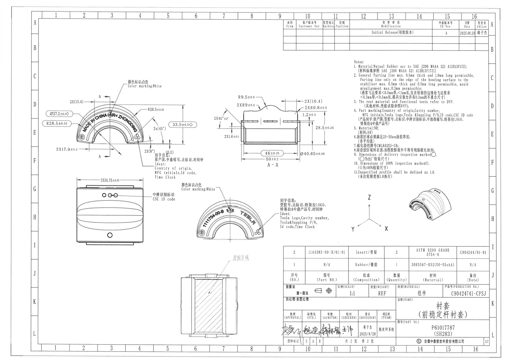

| 项目 | 内容 |
|---|---|
| 输入文件 | `input/20C90424741.pdf` |
| 整页 PNG | `outputs/20C90424741_assets/images/page_1.png` |
| 页面 | 1 |
| 渲染尺寸 | 4959 x 3505 px |

## object_1 - 主视图

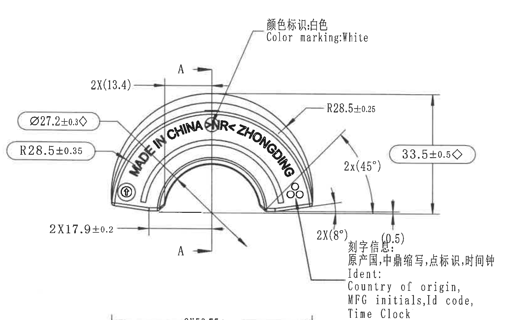

| 项目 | 内容 |
|---|---|
| 原图位置/视图名称 | 左上主视图，图框约 C-F / 2-6，bbox `[390, 720, 2030, 1750]` |
| object_kind | view |

| 提取项 | 原图数值或文本 | 含义说明 |
|---|---|---|
| 参考尺寸 | `2X(13.4)` | 两处相同参考尺寸；括号表示参考值，用于上方对称/定位关系说明，未给独立公差。 |
| 直径尺寸 | `Ø27.2±0.3◇` | 直径 27.2，公差 ±0.3；菱形 `◇` 按 NOTES 第 10 条为 100% 检验尺寸。 |
| 半径尺寸 | `R28.5±0.35` | 弧形轮廓半径 28.5，公差 ±0.35。 |
| 半径尺寸 | `R28.5±0.25` | 另一处弧形轮廓半径 28.5，公差 ±0.25。 |
| 总高度/外形高度 | `33.5±0.5◇` | 主视图右侧竖向总高度，公差 ±0.5；菱形表示 100% 检验尺寸。 |
| 角度参考 | `2x(45°)` | 两处 45° 角度参考标注；括号表示参考角度。 |
| 角度参考 | `2X(8°)` | 两处 8° 角度参考标注；括号表示参考角度。 |
| 参考尺寸 | `(0.5)` | 局部小台阶/偏移参考尺寸，括号表示参考值。 |
| 线性尺寸 | `2X17.9±0.2` | 两处 17.9 线性尺寸，公差 ±0.2。 |
| 剖切标识 | `A - A` 剖切箭头与字母 `A` | 指示上中剖面视图 object_2 的剖切位置和方向。 |
| 颜色标识 | `颜色标识:白色 / Color marking:White` | 指向主视图上部标识区域，要求颜色标识为白色。 |
| 零件刻字 | `MADE IN CHINA CNR-ZHONGDING` | 主视图弧形面上的原产地和制造商/供应商刻字。 |
| 刻字信息 | `刻字信息: 原产国, 中鼎缩写, 点标识, 时间钟 / Ident: Country of origin, MFG initials, Id code, Time Clock` | 指向主视图右下局部圆点/刻字区域，说明该区域应包含原产国、制造商缩写、ID code 和时间钟。 |

边界归属说明：右侧 `33.5±0.5◇`、`2x(45°)`、`2X(8°)`、`(0.5)` 的尺寸线和箭头均指向主视图轮廓，归入本对象；下缘接近左中视图的 `2X56.75±0.25`，该尺寸线不属于主视图，未在本对象中提取。

## object_2 - A-A 剖面视图

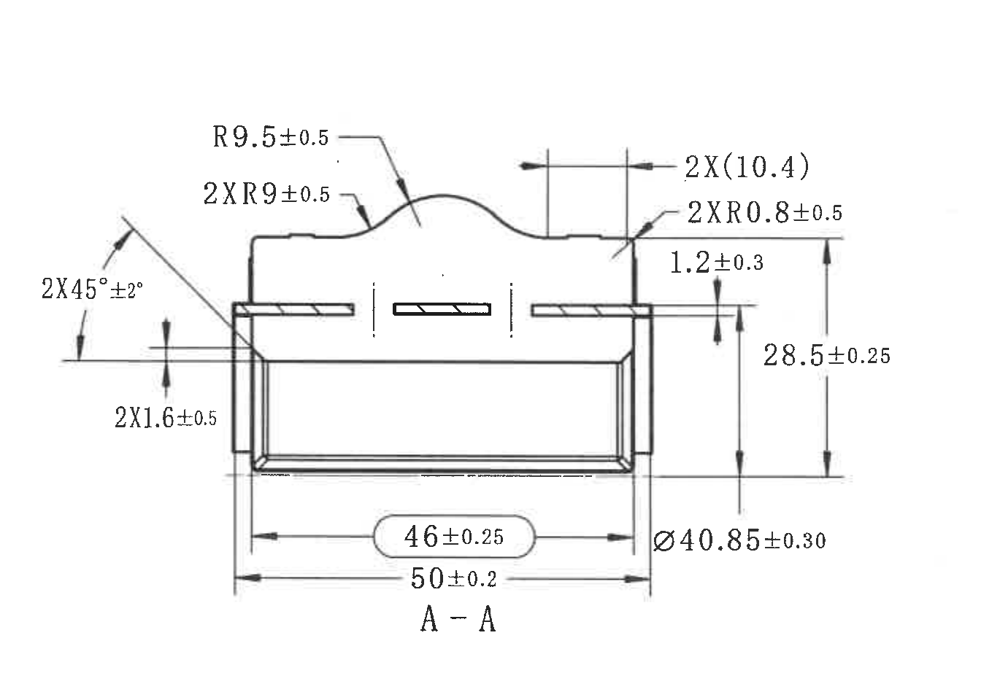

| 项目 | 内容 |
|---|---|
| 原图位置/视图名称 | 上中剖面 `A-A`，图框约 D-F / 7-10，bbox `[2030, 760, 3400, 1720]` |
| object_kind | section |

| 提取项 | 原图数值或文本 | 含义说明 |
|---|---|---|
| 半径尺寸 | `R9.5±0.5` | 上方凸起弧段半径，公差 ±0.5。 |
| 半径尺寸 | `2XR9±0.5` | 两处 R9 圆角/弧段，公差 ±0.5。 |
| 角度尺寸 | `2X45°±2°` | 两处倒角/斜面角度，角度公差 ±2°。 |
| 厚度/台阶尺寸 | `2X1.6±0.5` | 两处 1.6 台阶或厚度尺寸，公差 ±0.5。 |
| 参考尺寸 | `2X(10.4)` | 两处 10.4 参考宽度/间距，括号表示参考尺寸。 |
| 半径尺寸 | `2XR0.8±0.5` | 两处 R0.8 圆角，公差 ±0.5。 |
| 厚度尺寸 | `1.2±0.3` | 右侧局部厚度/高度，公差 ±0.3。 |
| 竖向尺寸 | `28.5±0.25` | 剖面右侧竖向高度尺寸，公差 ±0.25。 |
| 直径尺寸 | `Ø40.85±0.30` | 剖面对应圆弧/外径尺寸，公差 ±0.30。 |
| 线性尺寸 | `46±0.25` | 内部宽度/开口相关尺寸，公差 ±0.25；原图以圆角框显示。 |
| 总宽尺寸 | `50±0.2` | 剖面底部总宽度，公差 ±0.2。 |
| 视图标识 | `A - A` | 与主视图 object_1 的剖切线对应。 |

边界归属说明：本裁切只保留 A-A 剖面自身尺寸线、箭头和文字；左侧角度 `2X45°±2°` 的箭头完整进入本对象，右侧 `Ø40.85±0.30` 和 `28.5±0.25` 的竖向尺寸完整进入本对象，未提取左侧主视图刻字说明。

## object_3 - 左中外侧视图

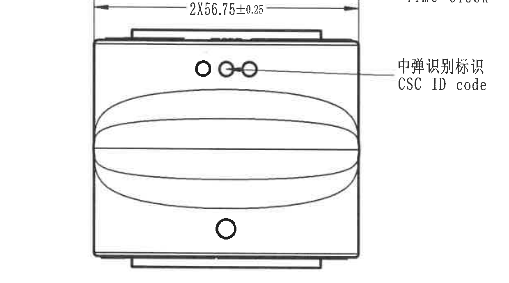

| 项目 | 内容 |
|---|---|
| 原图位置/视图名称 | 左中外侧/展开视图，图框约 G-I / 2-5，bbox `[520, 1738, 1760, 2428]` |
| object_kind | view |

| 提取项 | 原图数值或文本 | 含义说明 |
|---|---|---|
| 线性尺寸 | `2X56.75±0.25` | 顶部横向长度尺寸，标注两处相同，公差 ±0.25。 |
| 识别标识 | `中弹识别标识 / CSC ID code` | 引线指向上部三孔/圆点区域，说明该区域为 CSC ID code 标识。 |
| 局部图形 | 上部三圆孔/圆点、下部圆孔、中央椭圆带状轮廓 | 形状表达本视向下可见的标识孔、孔位和弧形表面区域；原图未在该视图给出额外数值尺寸。 |

边界归属说明：顶部 `2X56.75±0.25` 尺寸线、端部界线和文字完整归入本对象；右侧 `CSC ID code` 引线完整归入本对象。相邻 object_4 的颜色标识和弧形正面刻字不在本对象中提取。

## object_4 - 中部弧形标识视图

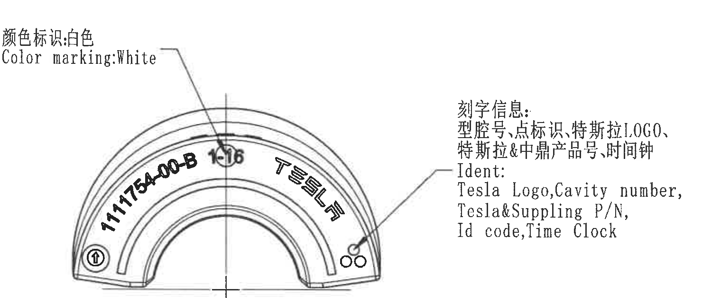

| 项目 | 内容 |
|---|---|
| 原图位置/视图名称 | 中部弧形正面标识视图，图框约 G-I / 6-9，bbox `[1765, 1725, 3245, 2355]` |
| object_kind | view |

| 提取项 | 原图数值或文本 | 含义说明 |
|---|---|---|
| 颜色标识 | `颜色标识:白色 / Color marking:White` | 引线指向上部小圆/时间钟附近，要求该标识为白色。 |
| 弧形刻字 | `1111754-00-B` | 左侧弧形刻字，表示 Tesla/Supplying P/N 或相关产品号。 |
| 弧形刻字 | `TESLA` | 右侧弧形 Tesla 标识。 |
| 腔号/时间钟附近字符 | `1016` | 上方圆形符号附近字符；原图线条重叠，按可见字符转录为 1016。 |
| 刻字信息 | `刻字信息: 型腔号, 点标识, 特斯拉LOGO, 特斯拉&中鼎产品号, 时间钟 / Ident: Tesla Logo, Cavity number, Tesla&Supplying P/N, Id code, Time Clock` | 说明该视图应包含 Tesla logo、型腔号、供应件号、ID code 和时间钟等刻字信息。 |

边界归属说明：本对象提取弧形正面视图自身的颜色标识、刻字和右侧刻字信息说明；左侧邻近 object_3 的 `CSC ID code` 不归入本对象。

## object_5 - 下中涂胶区域剖面/局部视图

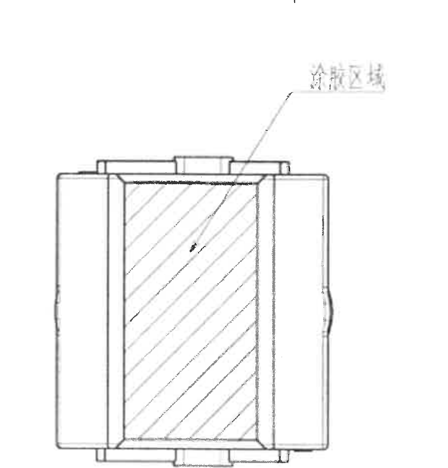

| 项目 | 内容 |
|---|---|
| 原图位置/视图名称 | 下中涂胶区域剖面/局部视图，图框约 J-L / 6-8，bbox `[1650, 2360, 2550, 3300]` |
| object_kind | detail |

| 提取项 | 原图数值或文本 | 含义说明 |
|---|---|---|
| 区域说明 | `涂胶区域` | 引线指向剖面上部粘接/涂胶位置。 |
| 剖面表达 | 斜线剖面线 | 表示被剖切的材料区域。 |
| 局部边界 | 左右侧断裂线/波形边 | 表示局部截取或省略的剖面范围。 |
| 数值尺寸 | 无新增数值尺寸 | 该裁切对象中未给出独立尺寸数值；涂胶厚度要求见 NOTES 第 6 条 `25-50µm`。 |

边界归属说明：涂胶引线、文字和剖面主体完整保留；未包含右下标题栏或底部图框坐标，未将 NOTES 中的涂胶厚度文字归入本视图，只在含义中引用其要求来源。

## object_6 - NOTES

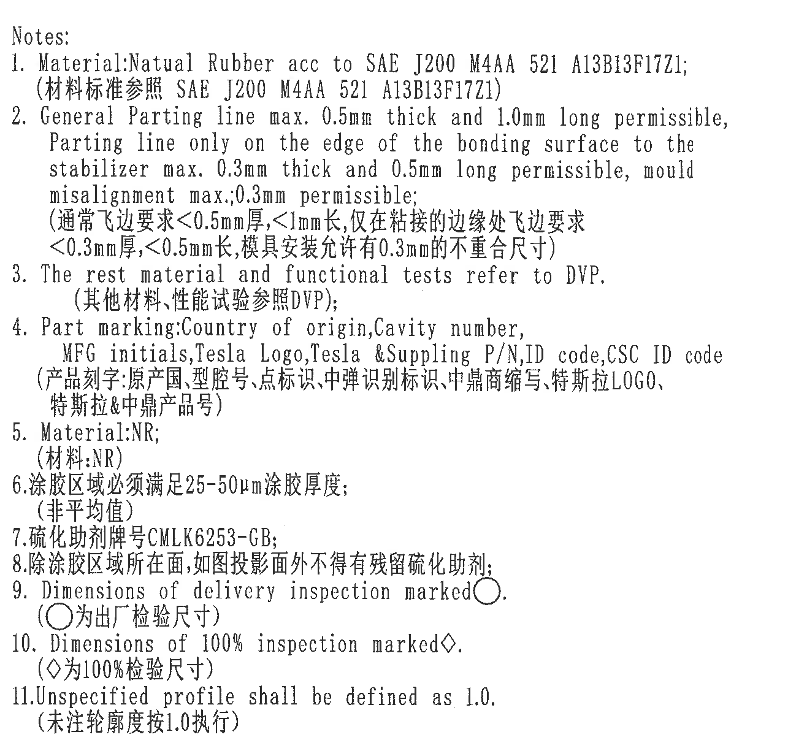

| 项目 | 内容 |
|---|---|
| 原图位置/视图名称 | 右侧 NOTES，图框约 C-F / 12-15，bbox `[3430, 545, 4715, 1765]` |
| object_kind | notes |

| 提取项 | 原图数值或文本 | 含义说明 |
|---|---|---|
| Note 1 | `Material:Natual Rubber acc to SAE J200 M4AA 521 A13B13F17Z1;` / `材料标准参照 SAE J200 M4AA 521 A13B13F17Z1` | 材料按 SAE J200 M4AA 521 A13B13F17Z1；原图英文拼写为 `Natual`。 |
| Note 2 | `General Parting line max. 0.5mm thick and 1.0mm long permissible, Parting line only on the edge of the bonding surface to the stabilizer max. 0.3mm thick and 0.5mm long permissible, mould misalignment max.;0.3mm permissible;` / `通常飞边要求<0.5mm厚,<1mm长,仅在粘接的边缘处飞边要求<0.3mm厚,<0.5mm长,模具安装允许有0.3mm的不重合尺寸` | 通常飞边最大厚 0.5 mm、长 1.0 mm；粘接边缘处飞边最大厚 0.3 mm、长 0.5 mm；模具错位最大 0.3 mm。 |
| Note 3 | `The rest material and functional tests refer to DVP.` / `其他材料、性能试验参照DVP` | 其他材料和功能测试按 DVP。 |
| Note 4 | `Part marking:Country of origin,Cavity number, MFG initials,Tesla Logo,Tesla &Supplying P/N,ID code,CSC ID code` / `产品刻字:原产国,型腔号,点标识,中弹识别标识,中鼎商缩写,特斯拉LOGO,特斯拉&中鼎产品号` | 零件刻字范围和各视图标识内容来源。 |
| Note 5 | `Material:NR;` / `材料:NR` | 材料为 NR。 |
| Note 6 | `涂胶区域必须满足25-50µm涂胶厚度; (非平均值)` | 涂胶区域厚度要求为 25-50 µm，且不是平均值。 |
| Note 7 | `硫化助剂牌号CMLK6253-GB;` | 硫化助剂牌号。 |
| Note 8 | `除涂胶区域所在面,如图投影面外不得有残留硫化助剂;` | 除涂胶区域所在投影面外，不得有残留硫化助剂。 |
| Note 9 | `Dimensions of delivery inspection marked○.` / `○为出厂检验尺寸` | 圆圈标记表示出厂检验尺寸。 |
| Note 10 | `Dimensions of 100% inspection marked◇.` / `◇为100%检验尺寸` | 菱形标记表示 100% 检验尺寸。 |
| Note 11 | `Unspecified profile shall be defined as 1.0.` / `未注轮廓度按1.0执行` | 未注轮廓度按 1.0 执行。 |

边界归属说明：NOTES 的 1-11 条正文和中英文说明完整进入本对象；未包含右下轴测图或下方 BOM/标题栏。

## object_7 - 轴测图与坐标系

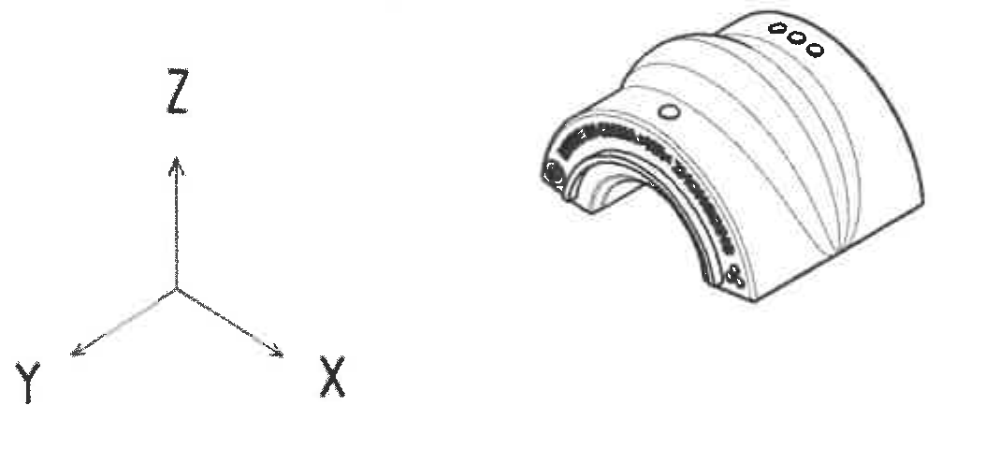

| 项目 | 内容 |
|---|---|
| 原图位置/视图名称 | 右中轴测示意及坐标系，图框约 G-H / 12-15，bbox `[3409, 1828, 4478, 2308]` |
| object_kind | view |

| 提取项 | 原图数值或文本 | 含义说明 |
|---|---|---|
| 坐标轴 | `X`, `Y`, `Z` | 坐标方向示意。 |
| 轴测图 | 弧形衬套三维示意 | 显示零件整体形状、弧形表面、端部孔和标识位置。 |
| 数值尺寸 | 无 | 该对象为三维示意，不含独立尺寸、公差或表格字段。 |

边界归属说明：轴测图和坐标三轴完整保留；未提取上方 NOTES 条文，也未提取下方 BOM/标题栏字段。

## object_8 - 修订履历表

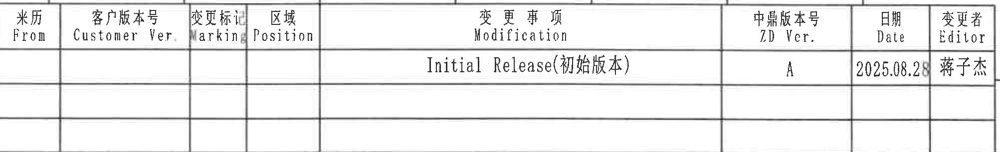

| 项目 | 内容 |
|---|---|
| 原图位置/视图名称 | 右上修订履历表，图框约 A-B / 9-16，bbox `[2765, 185, 4770, 490]` |
| object_kind | table |

| 来历 From | 客户版本号 Customer Ver. | 变更标记 Marking | 区域 Position | 变更事项 Modification | 中鼎版本号 ZD Ver. | 日期 Date | 变更者 Editor |
|---|---|---|---|---|---|---|---|
|  |  |  |  | Initial Release(初始版本) | A | 2025.08.28 | 蒋子杰 |
|  |  |  |  |  |  |  |  |
|  |  |  |  |  |  |  |  |

| 提取项 | 原图数值或文本 | 含义说明 |
|---|---|---|
| 表头 | `From`, `Customer Ver.`, `Marking`, `Position`, `Modification`, `ZD Ver.`, `Date`, `Editor` | 修订履历列名。 |
| 修订记录 | `Initial Release(初始版本)`, `A`, `2025.08.28`, `蒋子杰` | 初始版本发布记录，中鼎版本号 A，日期 2025.08.28，变更者蒋子杰。 |

边界归属说明：表格外框、表头、初始版本记录和空白行完整保留；图框坐标字母不作为表格字段提取。

## object_9 - BOM/材料明细表

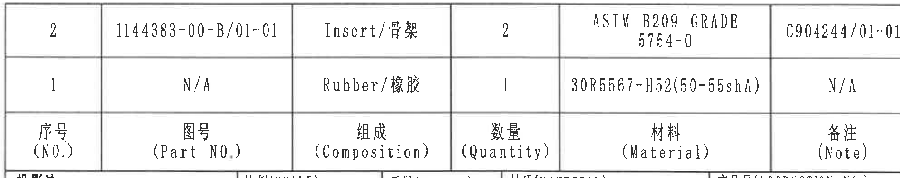

| 项目 | 内容 |
|---|---|
| 原图位置/视图名称 | 右下 BOM/材料明细表，图框约 I-J / 9-16，bbox `[2750, 2395, 4735, 2790]` |
| object_kind | table |

| 序号 (NO.) | 图号 (Part NO.) | 组成 (Composition) | 数量 (Quantity) | 材料 (Material) | 备注 (Note) |
|---|---|---|---|---|---|
| 2 | 1144383-00-B/01-01 | Insert/骨架 | 2 | ASTM B209 GRADE 5754-0 | C904244/01-01 |
| 1 | N/A | Rubber/橡胶 | 1 | 30R5567-H52(50-55shA) | N/A |

| 提取项 | 原图数值或文本 | 含义说明 |
|---|---|---|
| 行 2 | `1144383-00-B/01-01`, `Insert/骨架`, `2`, `ASTM B209 GRADE 5754-0`, `C904244/01-01` | 骨架/Insert 物料，数量 2，材料 ASTM B209 GRADE 5754-0，备注 C904244/01-01。 |
| 行 1 | `N/A`, `Rubber/橡胶`, `1`, `30R5567-H52(50-55shA)`, `N/A` | 橡胶物料，数量 1，材料 30R5567-H52(50-55shA)，无图号和备注。 |

边界归属说明：本对象只提取 BOM 表头和两条材料明细；下方标题栏的投影法、比例、产品号等字段不归入本对象。

## object_10 - 标题栏/签署栏

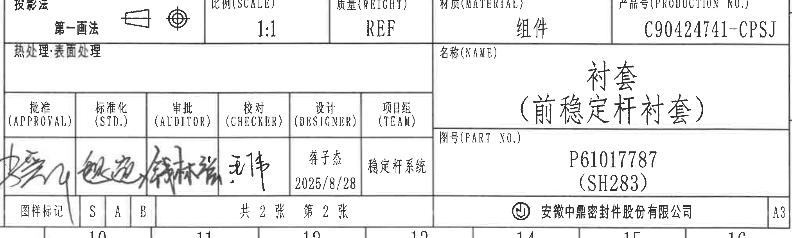

| 项目 | 内容 |
|---|---|
| 原图位置/视图名称 | 右下标题栏和签署栏，图框约 J-L / 9-16，bbox `[2750, 2790, 4775, 3400]` |
| object_kind | title_block |

| 原表字段 | 原图数值或文本 | 含义说明 |
|---|---|---|
| 投影法 | `第一画法` | 第一角法投影，原图带投影符号。 |
| 比例(SCALE) | `1:1` | 图样比例。 |
| 质量(WEIGHT) | `REF` | 重量为参考。 |
| 材质(MATERIAL) | `组件` | 标题栏材料/对象为组件。 |
| 产品号(PRODUCTION NO.) | `C90424741-CPSJ` | 产品号。 |
| 热处理:表面处理 | 空白 | 原标题栏该字段无填充值。 |
| 名称(NAME) | `衬套（前稳定杆衬套）` | 零件名称。 |
| 图号(PART NO.) | `P61017787 (SH283)` | 图号/零件号。 |
| 批准(APPROVAL) | 签名 | 批准签署栏。 |
| 标准化(STD.) | 签名 | 标准化签署栏。 |
| 审批(AUDITOR) | 签名 | 审批签署栏。 |
| 校对(CHECKER) | 签名，读作 `王伟` | 校对签署栏。 |
| 设计(DESIGNER) | `蒋子杰 / 2025/8/28` | 设计者和设计日期。 |
| 项目组(TEAM) | `稳定杆系统` | 项目组。 |
| 图样标记 | `S`, `A`, `B` | 图样标记栏。 |
| 页码 | `共 2 张  第 2 张` | 共 2 张中的第 2 张。 |
| 公司 | `安徽中鼎密封件股份有限公司` | 公司名称。 |
| 图幅 | `A3` | 图纸幅面。 |

边界归属说明：本对象从投影法/比例/产品号行到公司和 A3 图幅行完整保留；上方 BOM 表的数据行不归入标题栏字段。

## 裁切检查记录

| 对象 | 检查结论 | 完整性与归属 |
|---|---|---|
| page_1 | 通过 | 整页 PNG 完整渲染，尺寸 4959 x 3505 px。 |
| object_1 | 通过 | 主视图尺寸线、箭头、文字和刻字说明完整；下缘接近 object_3 的尺寸线未提取为主视图内容。 |
| object_2 | 通过 | A-A 剖面全部尺寸线、箭头、剖面文字完整；未混入主视图刻字。 |
| object_3 | 通过 | 顶部 `2X56.75±0.25` 和 `CSC ID code` 引线完整；未提取 object_4 颜色标识。 |
| object_4 | 通过 | 弧形刻字、颜色标识和右侧 Ident 说明完整；未提取 object_3 的 CSC ID 内容。 |
| object_5 | 通过 | 涂胶区域文字、引线、剖面线完整；未带入标题栏字段。 |
| object_6 | 通过 | NOTES 第 1-11 条完整，未截断底部第 11 条中文说明。 |
| object_7 | 通过 | 坐标轴和轴测图完整，未带入 NOTES 或表格字段。 |
| object_8 | 通过 | 修订履历表表头、记录和空白行完整；图框坐标字母不作为表格字段。 |
| object_9 | 通过 | BOM 表头和两条明细完整；下方标题栏字段不归入本对象。 |
| object_10 | 通过 | 标题栏、签署栏、公司和 A3 图幅完整；上方 BOM 表数据不归入本对象。 |
