# 20C90424742 内容识别与裁切提取

源文件：`input/20C90424742.pdf`  
整页渲染图：`outputs/20C90424742_assets/images/page_1.png`  
整页 PNG 尺寸：4959 x 3505 px  
坐标说明：本文 bbox 均为整页 PNG 像素坐标，格式为 `[x_min, y_min, x_max, y_max]`。

## 整页结构

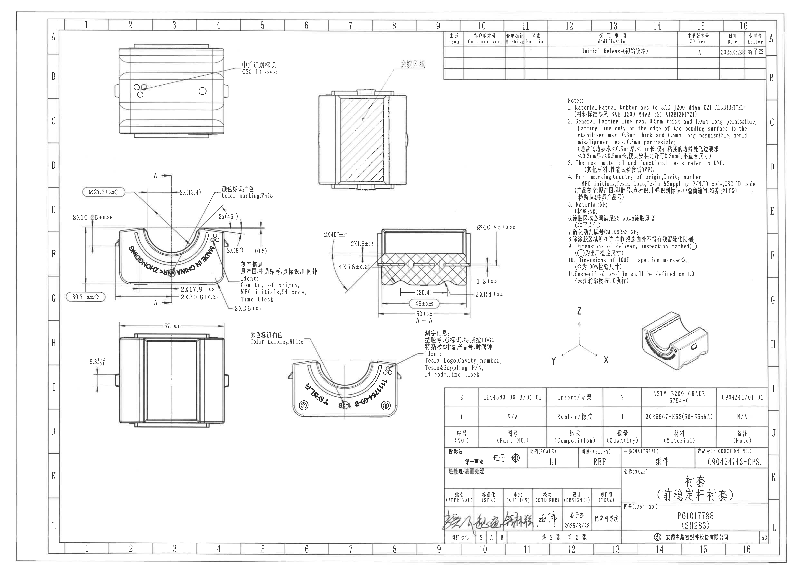

| 提取项 | 原图数值或文本 | 含义说明 |
|---|---|---|
| 页面 | 1 | PDF 仅 1 页。 |
| 整页图位置 | bbox `[0, 0, 4959, 3505]` | A3 图纸整页渲染。 |
| 图面对象 | 左上视图、上中剖面/局部剖视图、左中主视图、中右 A-A 剖视图、左下视图、下中标识视图、右侧 NOTES、右上修订履历表、右中轴测/坐标示意、右下 BOM/明细表、右下标题栏 | 按原图空间位置逐块裁切；表格和标题栏单独提取。 |

边界归属说明：整页图仅作为结构参照，不作为尺寸提取对象；各尺寸和文字按下面各裁切对象分别归属。

## object_1 - 左上外观视图

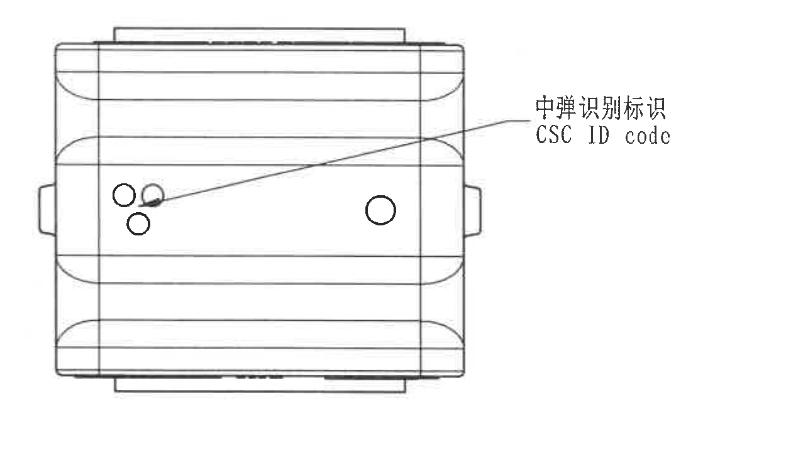

| 提取项 | 原图数值或文本 | 含义说明 |
|---|---|---|
| 原图位置/视图名称 | bbox `[650, 230, 1900, 950]`；左上外观视图 | 显示零件外观、孔/点状标识和一条指向标识区域的引线。 |
| 标识引线 | `中弹识别标识` / `CSC ID code` | 引线指向左侧小孔/点状标识附近，说明该处为 CSC ID code 识别标识位置。 |
| 外形 | 上下横向带状外形、左右侧凸台、多个圆形小标识 | 外观示意，无数值尺寸标注。 |

边界归属说明：裁切区域完整包含该视图及 `CSC ID code` 引线文字；未带入相邻中部尺寸视图或右侧表格内容。

## object_2 - 上中剖面/局部剖视图

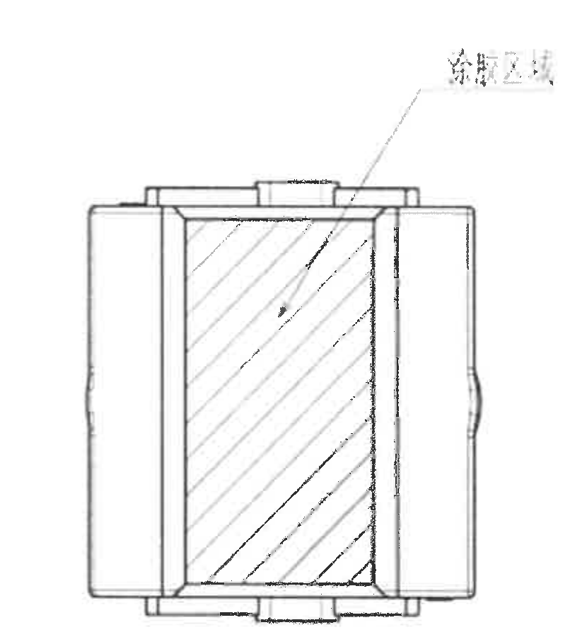

| 提取项 | 原图数值或文本 | 含义说明 |
|---|---|---|
| 原图位置/视图名称 | bbox `[1850, 300, 2680, 1200]`；上中剖面/局部剖视图 | 显示零件内部剖面，中央区域以斜剖面线表示被剖切材料。 |
| 剖面线 | 斜向剖面线 | 表示剖切到的实体/材料区域。 |
| 中文引线标注 | 原图扫描模糊；可确认有一条中文标注引线指向中央剖面区域，疑似与涂胶/区域说明相关 | 因原图小字扫描损失严重，未将该模糊文字作为确定字段；其引线归属于该剖面视图。 |
| 尺寸 | 无数值尺寸 | 该裁切对象内未出现可辨识尺寸数值、角度或公差。 |

边界归属说明：裁切包含剖视图主体和上方模糊中文引线；右侧修订履历表边框被避开，未提取为本对象内容。

## object_3 - 左中主尺寸视图

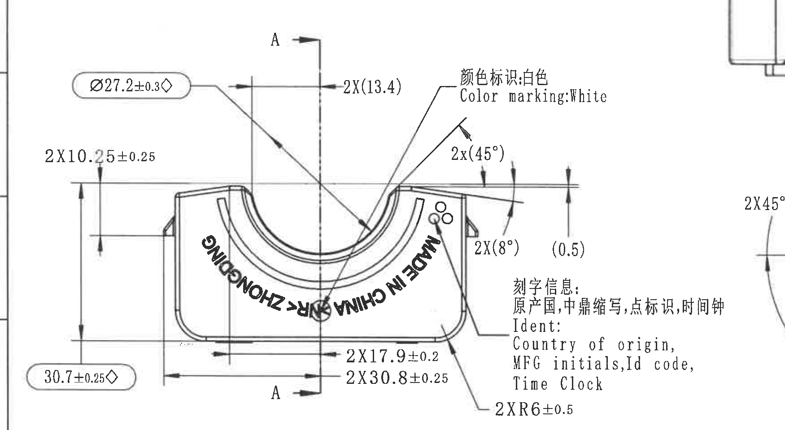

| 提取项 | 原图数值或文本 | 含义说明 |
|---|---|---|
| 原图位置/视图名称 | bbox `[350, 1000, 2100, 1960]`；左中主尺寸视图 | 主要正向加工视图，含 A-A 剖切位置、外形尺寸、角度、参考尺寸和标识说明。 |
| 剖切标识 | `A`、`A`，中心竖向剖切线 | 表示 A-A 剖面的位置；对应 object_4 的 A-A 剖视图。 |
| 直径尺寸 | `Ø27.2±0.3◇` | 圆/弧形特征直径尺寸，带菱形，按 NOTES 第 10 项为 100% 检验尺寸。 |
| 数量尺寸 | `2X10.25±0.25` | 两处相同高度/台阶尺寸，公差 ±0.25。 |
| 总高度/外形高度 | `30.7±0.25◇` | 该视图左侧竖向总高/外形高度尺寸，带菱形，为 100% 检验尺寸。 |
| 参考尺寸 | `2X(13.4)` | 两处参考尺寸，括号表示参考值；用于说明两侧对称/位置关系，不作为单独验收公差尺寸。 |
| 角度参考 | `2x(45°)` | 两处 45° 角度标注，括号表示参考角度。 |
| 角度参考 | `2X(8°)` | 两处 8° 角度标注，括号表示参考角度。 |
| 参考尺寸 | `(0.5)` | 右侧局部高度/偏移参考尺寸，括号表示参考值。 |
| 数量尺寸 | `2X17.9±0.2` | 两处底部局部长度/位置尺寸，公差 ±0.2。 |
| 数量尺寸 | `2X30.8±0.25` | 两处底部长度/位置尺寸，公差 ±0.25。 |
| 半径尺寸 | `2XR6±0.5` | 两处 R6 圆角半径，公差 ±0.5。 |
| 颜色标识 | `颜色标识:白色` / `Color marking:White` | 指向白色颜色标识区域。 |
| 刻字信息 | `刻字信息: 原产国,中鼎缩写,点标识,时间钟` / `Ident: Country of origin, MFG initials, Id code, Time Clock` | 指向右侧小圆点/刻字区域，说明需刻原产国、制造商缩写、ID code、时间钟。 |
| 零件可见刻字 | `MADE IN CHINA PRC ZHONGDING` | 视图中沿弧形布置的可见刻字内容。 |

边界归属说明：该裁切为了完整保留右侧 `刻字信息/Ident` 和 `2XR6±0.5` 引线，右边缘可见 A-A 剖视图的极少量边缘片段；A-A 剖视图尺寸 `2X45°±2°`、`2X1.6±0.5`、`4XR6±0.25` 等不归入本视图，统一在 object_4 中提取。

## object_4 - 中右 A-A 剖视图

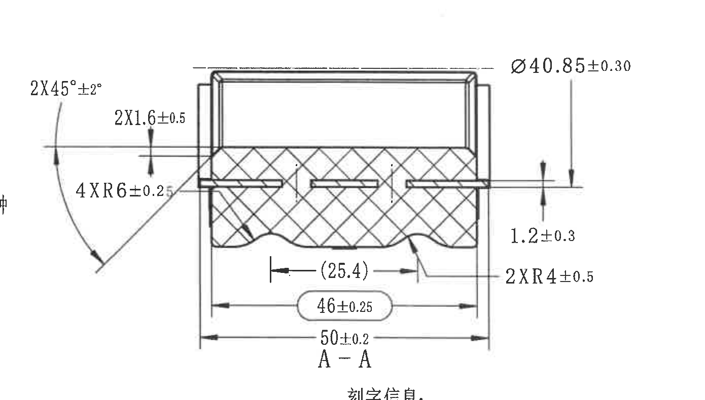

| 提取项 | 原图数值或文本 | 含义说明 |
|---|---|---|
| 原图位置/视图名称 | bbox `[1950, 1280, 3340, 2070]`；A-A 剖视图 | 对应 object_3 中 A-A 剖切线的剖面图，显示剖面材料、金属/橡胶层和底部波形轮廓。 |
| 视图名称 | `A-A` | 剖面视图名称。 |
| 角度尺寸 | `2X45°±2°` | 两处 45° 倒角/斜角，角度公差 ±2°。 |
| 数量尺寸 | `2X1.6±0.5` | 两处 1.6 尺寸，公差 ±0.5。 |
| 半径尺寸 | `4XR6±0.25` | 四处 R6 圆角/弧形特征，公差 ±0.25。 |
| 直径尺寸 | `Ø40.85±0.30` | 右侧竖向标注的外径/弧面直径尺寸，公差 ±0.30。 |
| 厚度/偏移尺寸 | `1.2±0.3` | 右侧局部厚度/台阶尺寸，公差 ±0.3。 |
| 参考尺寸 | `(25.4)` | 中部横向参考距离，括号表示参考尺寸。 |
| 横向尺寸 | `46±0.25` | 中下部横向尺寸，公差 ±0.25。 |
| 总宽尺寸 | `50±0.2` | 底部总宽尺寸，公差 ±0.2。 |
| 半径尺寸 | `2XR4±0.5` | 两处 R4 波形/圆角半径，公差 ±0.5。 |
| 剖面表示 | 交叉剖面线 | 表示剖切材料区域。 |

边界归属说明：左侧角度弧线和尺寸文字均归属 A-A 剖视图；底部因完整保留 `A-A` 标签，轻微触及下方标识说明开头，该下方文字不作为本对象内容提取。

## object_5 - 左下侧向视图

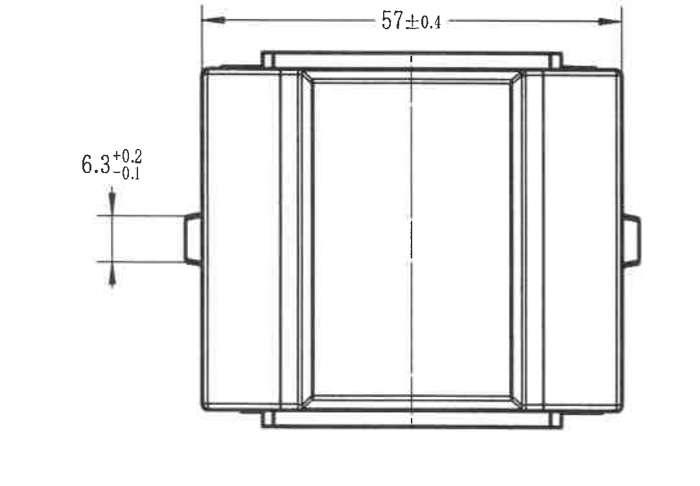

| 提取项 | 原图数值或文本 | 含义说明 |
|---|---|---|
| 原图位置/视图名称 | bbox `[430, 1990, 1510, 2740]`；左下侧向视图 | 显示零件侧向外形、中心线和侧向凸台。 |
| 横向总尺寸 | `57±0.4` | 顶部横向总宽/总长尺寸，公差 ±0.4。 |
| 侧凸台尺寸 | `6.3 +0.2/-0.1` | 左侧凸台或局部高度尺寸，非对称公差：上偏差 +0.2，下偏差 -0.1。 |

边界归属说明：裁切已收紧右边界，未带入下中标识视图文字；两个尺寸的尺寸线、箭头和文字完整。

## object_6 - 下中标识视图

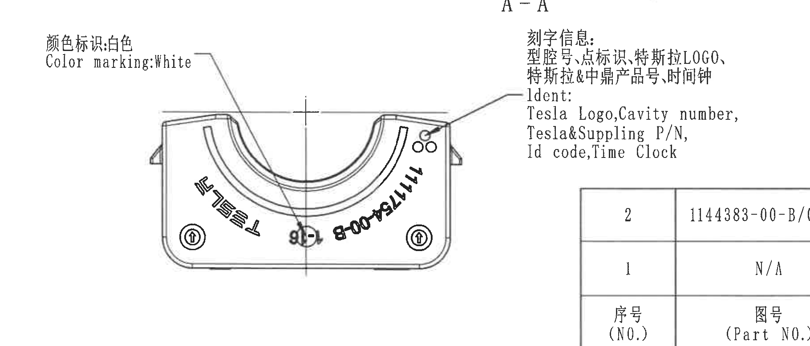

| 提取项 | 原图数值或文本 | 含义说明 |
|---|---|---|
| 原图位置/视图名称 | bbox `[1450, 1980, 3270, 2760]`；下中标识视图 | 显示零件正面标识、弧形刻字、底部符号和标识引线。 |
| 颜色标识 | `颜色标识:白色` / `Color marking:White` | 引线指向左侧白色颜色标识位置。 |
| 刻字信息 | `刻字信息: 型腔号,点标识,特斯拉LOGO, 特斯拉&中鼎产品号,时间钟` / `Ident: Tesla Logo,Cavity number, Tesla&Suppling P/N, Id code,Time Clock` | 引线指向右侧小圆点/刻字区域，说明该区域承载 Tesla 标识、型腔号、供应/产品号、ID code 和时间钟。 |
| 可见刻字 | `TESLA` | 沿左下弧形排布的品牌刻字。 |
| 可见刻字 | `111754-008-B` | 沿右下弧形排布的零件/产品相关刻字；原图旋转，末位 `B` 清晰。 |
| 圆形/点状标识 | 右上三处小圆点、底部中心时间钟/圆形标识、左右底部圆圈箭头样式标识 | 标识与刻字信息引线对应，属于标识视图内容。 |
| 尺寸 | 无独立数值尺寸 | 本裁切对象主要为标识说明，不含加工尺寸线。 |

边界归属说明：该视图右下与 BOM 表在页面上接近，矩形裁切右下可见 BOM 表边缘片段；BOM 表字段不归入本视图，统一在 object_10 中提取。

## object_7 - NOTES

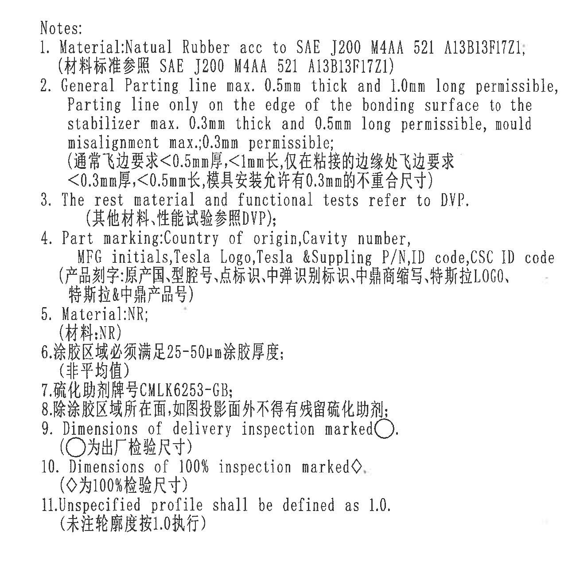

| 提取项 | 原图数值或文本 | 含义说明 |
|---|---|---|
| 原图位置/视图名称 | bbox `[3430, 560, 4730, 1880]`；右侧 NOTES | 图纸通用材料、飞边、标识、检验符号和未注轮廓度说明。 |
| Note 1 | `Material:Natual Rubber acc to SAE J200 M4AA 521 A13B13F17Z1;`；`(材料标准参照 SAE J200 M4AA 521 A13B13F17Z1)` | 材料为天然橡胶，按 SAE J200 M4AA 521 A13B13F17Z1；`Natual` 按原图拼写保留。 |
| Note 2 | `General Parting line max. 0.5mm thick and 1.0mm long permissible, Parting line only on the edge of the bonding surface to the stabilizer max. 0.3mm thick and 0.5mm long permissible, mould misalignment max.;0.3mm permissible;`；`(通常飞边要求<0.5mm厚,<1mm长,仅在粘接的边缘处飞边要求<0.3mm厚,<0.5mm长,模具安装允许有0.3mm的不重合尺寸)` | 通用分型线/飞边控制：通常 0.5mm 厚、1.0mm 长以内；粘接边缘处 0.3mm 厚、0.5mm 长以内；模具错位允许 0.3mm。 |
| Note 3 | `The rest material and functional tests refer to DVP.`；`(其他材料,性能试验参照DVP);` | 其他材料和功能试验按 DVP。 |
| Note 4 | `Part marking:Country of origin,Cavity number, MFG initials,Tesla Logo,Tesla &Suppling P/N,ID code,CSC ID code`；`(产品刻字:原产国,型腔号,点标识,中弹识别标识,中鼎商缩写,特斯拉LOGO,特斯拉&中鼎产品号)` | 零件刻字内容要求，包括原产国、型腔号、制造商缩写、Tesla Logo、Tesla & supplying P/N、ID code、CSC ID code。 |
| Note 5 | `Material:NR;`；`(材料:NR)` | 材料缩写 NR。 |
| Note 6 | `涂胶区域必须满足25-50μm涂胶厚度;`；`(非平均值)` | 涂胶区域胶层厚度要求为 25-50μm，非平均值。 |
| Note 7 | `硫化助剂牌号CMLK6253-GB;` | 硫化助剂牌号。 |
| Note 8 | `除涂胶区域所在面,如图投影面外不得有残留硫化助剂;` | 除涂胶区域所在面外，不允许残留硫化助剂。 |
| Note 9 | `Dimensions of delivery inspection marked○.`；`(○为出厂检验尺寸)` | 圆圈符号标记的尺寸为出厂检验尺寸。 |
| Note 10 | `Dimensions of 100% inspection marked◇.`；`(◇为100%检验尺寸)` | 菱形符号标记的尺寸为 100% 检验尺寸。 |
| Note 11 | `Unspecified profile shall be defined as 1.0.`；`(未注轮廓度按1.0执行)` | 未注轮廓度按 1.0 执行。 |

边界归属说明：NOTES 裁切完整包含 1-11 条文字、圆圈和菱形符号；未带入右下 BOM 表和标题栏。

## object_8 - 右上修订履历表

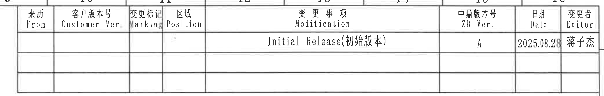

原表格还原：

| 来历 From | 客户版本号 Customer Ver | 变更标记 Marking | 区域 Position | 变更事项 Modification | 中鼎版本号 ZD Ver. | 日期 Date | 变更者 Editor |
|---|---|---|---|---|---|---|---|
|  |  |  |  | Initial Release(初始版本) | A | 2025.08.28 | 蒋子杰 |
|  |  |  |  |  |  |  |  |
|  |  |  |  |  |  |  |  |

| 提取项 | 原图数值或文本 | 含义说明 |
|---|---|---|
| 原图位置/视图名称 | bbox `[2690, 175, 4765, 505]`；右上修订履历表 | 记录版本发布/变更历史。 |
| 首行记录 | `Initial Release(初始版本)`，`ZD Ver. A`，`Date 2025.08.28`，`Editor 蒋子杰` | 初始版本发布记录。 |
| 空白记录行 | 2 行空白 | 预留后续修订记录。 |

边界归属说明：裁切包含完整修订履历表外框和列头；上方可见少量图框坐标数字，不属于修订履历表字段，未提取。

## object_9 - 右中轴测/坐标示意

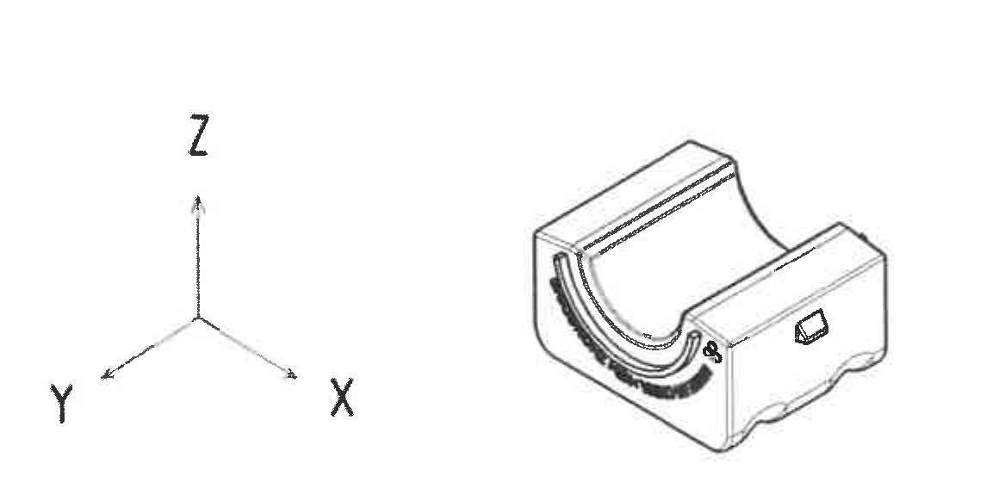

| 提取项 | 原图数值或文本 | 含义说明 |
|---|---|---|
| 原图位置/视图名称 | bbox `[3360, 1770, 4520, 2330]`；右中轴测/坐标示意 | 包含 X/Y/Z 坐标方向和零件轴测小图。 |
| 坐标轴 | `X`、`Y`、`Z` | 定义图纸方向参考。 |
| 轴测图 | 右侧零件三维/轴测小图 | 用于辅助理解零件立体形状、开口和端部结构。 |
| 尺寸 | 无数值尺寸 | 该对象内未出现加工尺寸、公差或角度。 |

边界归属说明：裁切包含坐标三轴和轴测小图；未包含 NOTES、BOM 表或标题栏字段。

## object_10 - 右下 BOM/明细表

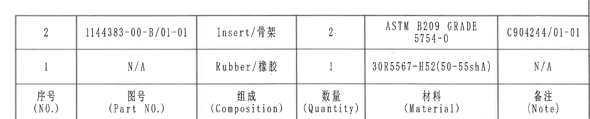

原表格还原：

| 序号 (NO.) | 图号 (Part NO.) | 组成 (Composition) | 数量 (Quantity) | 材料 (Material) | 备注 (Note) |
|---|---|---|---|---|---|
| 2 | 1144383-00-B/01-01 | Insert/骨架 | 2 | ASTM B209 GRADE 5754-0 | C904244/01-01 |
| 1 | N/A | Rubber/橡胶 | 1 | 30R5567-H52(50-55shA) | N/A |

| 提取项 | 原图数值或文本 | 含义说明 |
|---|---|---|
| 原图位置/视图名称 | bbox `[2700, 2350, 4765, 2770]`；右下 BOM/明细表 | 明细表列出组成件、数量、材料和备注。 |
| 表头 | `序号 (NO.)`、`图号 (Part NO.)`、`组成 (Composition)`、`数量 (Quantity)`、`材料 (Material)`、`备注 (Note)` | 表头在原图中位于表格底部，Markdown 表按字段名置于表头。 |
| 第 2 项 | `1144383-00-B/01-01`；`Insert/骨架`；数量 `2`；材料 `ASTM B209 GRADE 5754-0`；备注 `C904244/01-01` | 骨架/插入件，数量 2，铝材规格 ASTM B209 GRADE 5754-0。 |
| 第 1 项 | `N/A`；`Rubber/橡胶`；数量 `1`；材料 `30R5567-H52(50-55shA)`；备注 `N/A` | 橡胶件，数量 1，材料/硬度规格见原值。 |

边界归属说明：裁切只保留 BOM 表外框、两条数据行和底部表头；标题栏的投影法/比例等字段不归入本表。

## object_11 - 右下标题栏

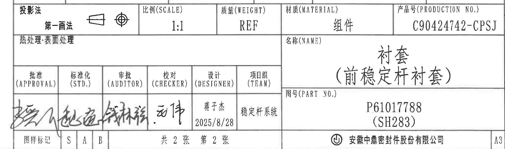

标题栏字段还原：

| 字段 | 原图数值或文本 |
|---|---|
| 投影法 | 第一画法 |
| 比例 (SCALE) | 1:1 |
| 质量 (WEIGHT) | REF |
| 材质 (MATERIAL) | 组件 |
| 产品号 (PRODUCTION NO.) | C90424742-CPSJ |
| 热处理/表面处理 | 空白 |
| 名称 (NAME) | 衬套（前稳定杆衬套） |
| 图号 (PART NO.) | P61017788 (SH283) |
| 批准 (APPROVAL) | 手写签名，原图不易辨识 |
| 标准化 (STD.) | 手写签名，原图不易辨识 |
| 审批 (AUDITOR) | 手写签名，原图不易辨识 |
| 校对 (CHECKER) | 手写签名，疑似 `动伟` |
| 设计 (DESIGNER) | 蒋子杰；2025/8/28 |
| 项目组 (TEAM) | 稳定杆系统 |
| 图样标记 | S / A / B |
| 张数 | 共 2 张；第 2 张 |
| 公司 | 安徽中鼎密封件股份有限公司 |
| 图幅 | A3 |

| 提取项 | 原图数值或文本 | 含义说明 |
|---|---|---|
| 原图位置/视图名称 | bbox `[2700, 2760, 4765, 3370]`；右下标题栏 | 图纸基本信息、签核信息、产品号、名称、图号和公司信息。 |
| 产品号 | `C90424742-CPSJ` | 生产/产品编号。 |
| 零件名称 | `衬套（前稳定杆衬套）` | 本图纸对象名称。 |
| 图号 | `P61017788 (SH283)` | 图纸/零件编号。 |
| 日期 | `2025/8/28` | 设计栏日期。 |
| 页码 | `共 2 张 第 2 张` | 当前图纸为第 2 张。 |

边界归属说明：裁切从标题栏上边线开始，完整包含标题栏主体字段；底部图框坐标数字已尽量排除，右侧 `A3` 属于标题栏图幅字段。

## 裁切检查记录

| 对象 | 图片路径 | 检查结果 |
|---|---|---|
| page_1 | `outputs/20C90424742_assets/images/page_1.png` | 整页渲染完整，4959 x 3505 px。 |
| object_1 | `outputs/20C90424742_assets/images/object_1.png` | 视图主体、引线和 `CSC ID code` 文字完整，无相邻视图片段。 |
| object_2 | `outputs/20C90424742_assets/images/object_2.png` | 剖面主体和引线完整；上方中文小字原图扫描模糊，但未被裁断。 |
| object_3 | `outputs/20C90424742_assets/images/object_3.png` | 主视图尺寸线、箭头、文字完整；右边缘带入 A-A 剖视图极少量片段，已在归属说明中排除。 |
| object_4 | `outputs/20C90424742_assets/images/object_4.png` | A-A 剖视图尺寸线、箭头和文字完整；底部轻微触及下方标识说明开头，未归入本对象。 |
| object_5 | `outputs/20C90424742_assets/images/object_5.png` | 左下视图 `57±0.4` 和 `6.3 +0.2/-0.1` 尺寸线及文字完整，无相邻文本混入。 |
| object_6 | `outputs/20C90424742_assets/images/object_6.png` | 标识视图主体和两组标识引线文字完整；右下角可见 BOM 边缘片段，BOM 内容已排除并在 object_10 提取。 |
| object_7 | `outputs/20C90424742_assets/images/object_7.png` | NOTES 1-11 条完整，未裁断长行文字和检验符号。 |
| object_8 | `outputs/20C90424742_assets/images/object_8.png` | 修订履历表外框、列头和记录完整；顶部少量坐标格数字不作为表格内容。 |
| object_9 | `outputs/20C90424742_assets/images/object_9.png` | 坐标轴和轴测图完整，无尺寸文字。 |
| object_10 | `outputs/20C90424742_assets/images/object_10.png` | BOM 表外框、两条数据行、底部表头完整；标题栏字段已排除。 |
| object_11 | `outputs/20C90424742_assets/images/object_11.png` | 标题栏字段、签核栏、公司名和 A3 图幅完整；底部图框坐标已尽量排除。 |
