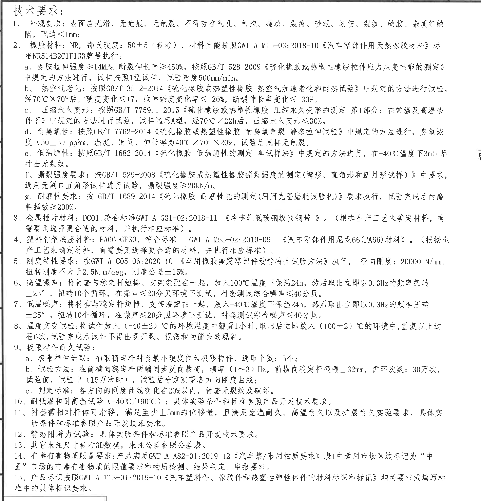
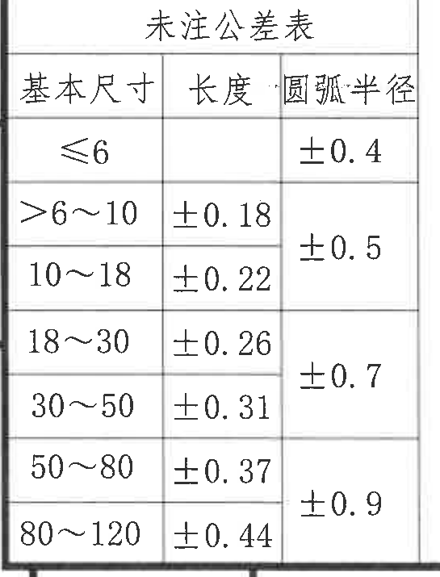
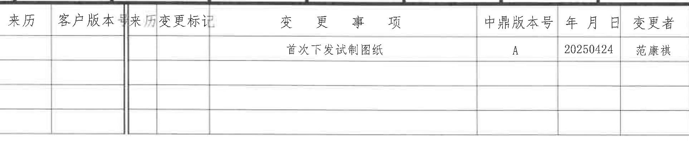
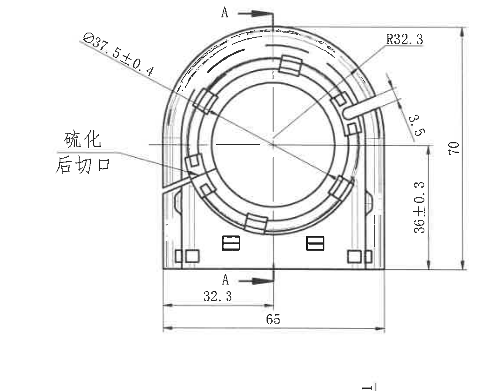
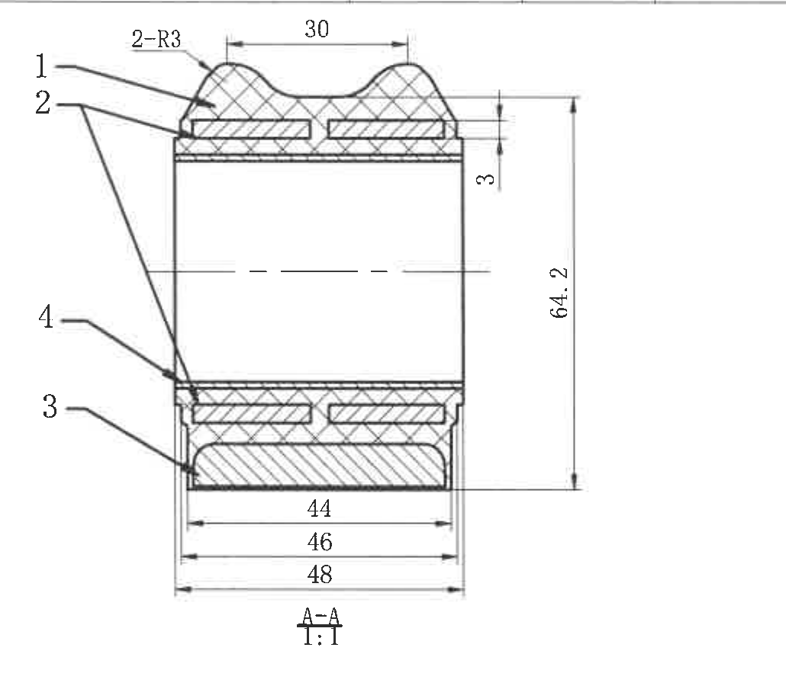
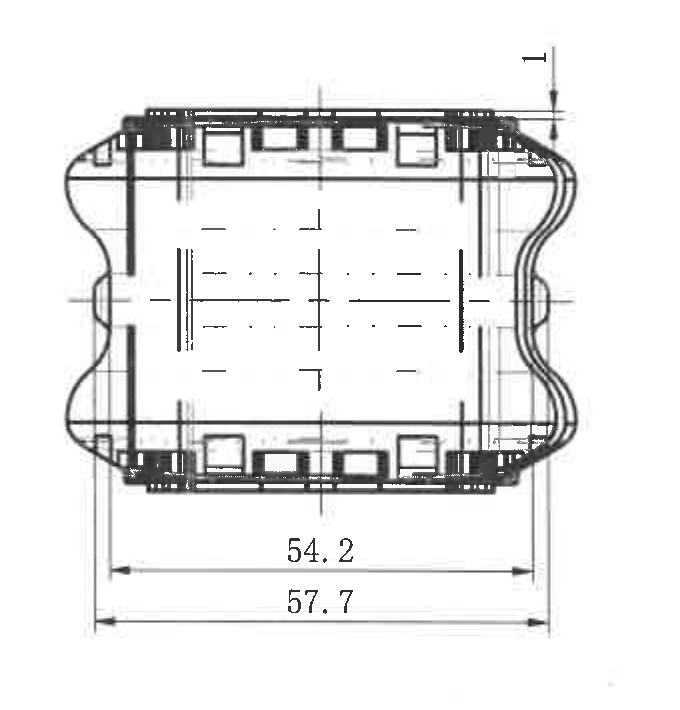
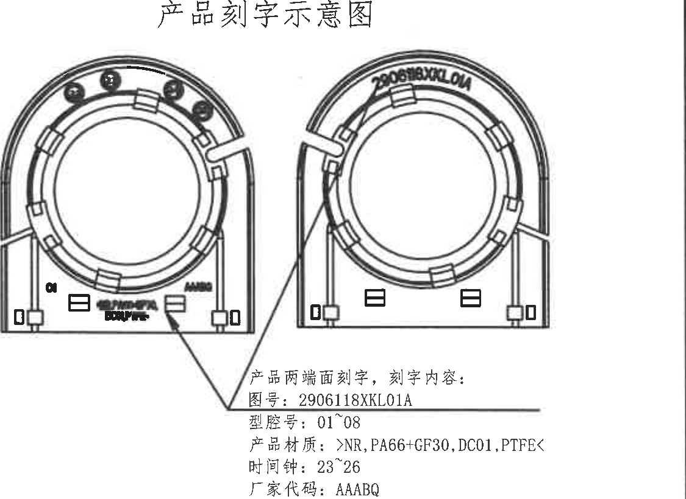
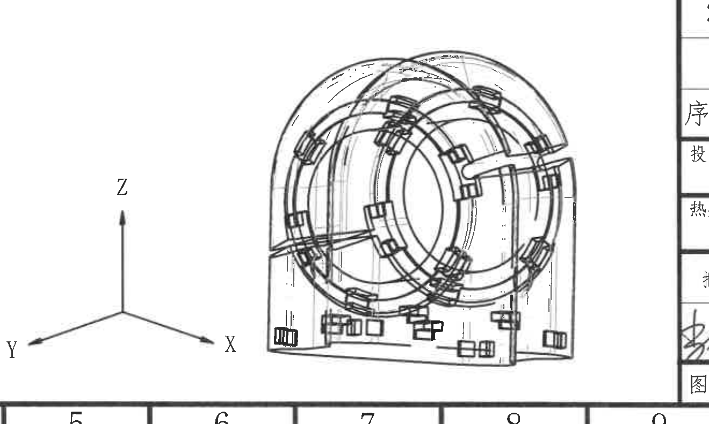
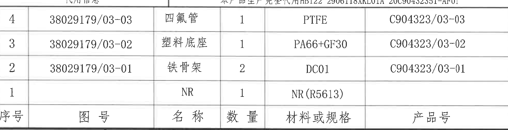
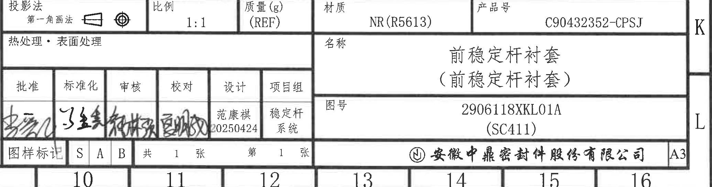

# 20C90432352 内容识别

源文件：`input/20C90432352.pdf`

整页渲染图：`outputs/20C90432352_assets/images/page_1.png`，尺寸 4959 x 3505 px。

## object_1 - NOTES / 技术要求

原图位置/视图名称：第 1 页左上至左中区域，技术要求文本区。

| 提取项 | 原图数值或文本 | 含义说明 |
|---|---|---|
| 标题 | 技术要求 | 本图纸的技术和质量要求说明。 |
| 1 外观要求 | 表面应光滑、无疤痕、无龟裂，不得存在气孔、气泡、瘤块、裂痕、砂眼、划伤、裂纹、缺胶、杂质等缺陷，飞边<1mm | 对橡胶件表面缺陷和飞边大小的要求。 |
| 2 橡胶材料 | NR | 橡胶材料为天然橡胶。 |
| 邵氏硬度 | 50±5（参考） | 材料硬度参考值，不作为单独标注尺寸；括号内“参考”表示参考性要求。 |
| 材料性能标准 | GWT A M15-03:2018-10《汽车零部件用天然橡胶材料》；标准 NR514B2C1F1G3 | 材料性能按该企业/行业材料标准和牌号执行。 |
| 2a 拉伸强度 | ≥14MPa | 橡胶拉伸强度下限。 |
| 2a 断裂伸长率 | ≥450% | 橡胶断裂伸长率下限。 |
| 2a 试验标准 | GB/T 528-2009；1 型试样；试验速度 500mm/min | 拉伸性能试验方法、试样类型和速度。 |
| 2b 热空气老化 | GB/T 3512-2014；70°C x 70h；硬度变化≤+7；拉伸强度变化率≤-20%；断裂伸长率变化≤-30% | 热空气加速老化和耐热试验要求。 |
| 2c 压缩永久变形 | GB/T 7759.1-2015；试样 A 型；70°C x 22h；压缩永久变形≤30% | 常温及高温条件下压缩永久变形要求。 |
| 2d 耐臭氧性 | GB/T 7762-2014；臭氧浓度(50±5)pphm；40°C x 70h x 20%；试验后无龟裂 | 静态拉伸条件下耐臭氧龟裂要求。 |
| 2e 低温脆性 | GB/T 1682-2014；-40°C 温度下 3min 后冲击无裂纹 | 低温脆性冲击试验要求。 |
| 2f 撕裂强度 | GB/T 529-2008；选用无割口直角形试样；撕裂强度≥20kN/m | 橡胶撕裂强度要求。 |
| 2g 耐磨性 | GB/T 1689-2014；试验完成后耐磨耗指数≥200% | 阿克隆磨耗试验要求。 |
| 3 金属插片材料 | DC01；GWT A G31-02:2018-11《冷连轧低碳钢板及钢带》 | 金属插片采用 DC01，材料可根据生产工艺选择更合适材料并执行相应标准。 |
| 4 塑料骨架底座材料 | PA66-GF30；GWT A M55-02:2019-09《汽车零部件用尼龙66(PA66)材料》 | 塑料骨架底座材料要求，允许根据生产工艺选择更合适材料并执行相应标准。 |
| 5 刚度特性要求 | GWT A C05-06:2020-10；径向刚度 20000 N/mm；扭转刚度不大于 2.5 N.m/deg；刚度公差±15% | 动静特性要求，包含径向刚度、扭转刚度和公差。 |
| 6 高温噪声 | 100°C 保温 24h；0.3Hz 扭转 ±25°；扭转 10 个循环；噪声≤20 分贝环境；综合噪声≤40 分贝 | 高温后噪声测试条件和判定限值。 |
| 7 低温噪声 | -40°C 保温 24h；0.3Hz 扭转 ±25°；扭转 10 个循环；噪声≤20 分贝环境；综合噪声≤40 分贝 | 低温后噪声测试条件和判定限值。 |
| 8 温度交变试验 | (-40±2)°C 静置 1 小时，取出后放入 (100±2)°C 环境；重复 6 次；试验完成后不得开裂、损伤和功能失效 | 冷热交变耐久要求。 |
| 9 极限样件耐久试验 | 抽取稳定杆衬套最小硬度作为极限样件；选取个数 5 个 | 极限样件选择规则。 |
| 9b 试验方法 | 前横向稳定杆两端同步反向载荷；频率(1~3)Hz；前横向稳定杆振幅±32mm；循环次数 30 万次；试验前、试验中(15 万次时)、试验后测量各方向刚度曲线 | 极限样件耐久试验载荷、频率、振幅和循环次数。 |
| 9c 判定标准 | 各方向的刚度曲线变化在 20% 以内，衬套无裂纹及破坏 | 极限耐久判定标准。 |
| 10 耐低温和耐高温试验 | (-40°C/+90°C)；具体实验条件和标准参照产品开发技术要求 | 环境耐久要求。 |
| 11 滑移要求 | 衬套需相对杆体可滑移，满足至少±5mm 的位移量 | 与杆体配合的可滑移要求，同时满足室温、高温、扩展耐久等实验要求。 |
| 12 静态附着力试验 | 具体实验条件和标准参照产品开发技术要求 | 粘附/附着力要求。 |
| 13 未注尺寸 | 其它未注尺寸参考 3D 数模，未注公差参照公差表 | 未在二维图标注的尺寸由 3D 数模和公差表控制。 |
| 14 有毒有害物质限量 | GWT A.A82-01:2019-12《汽车禁/限用物质要求》；市场区域标记为“中国” | 有害物质限量、检测、判定和申报要求。 |
| 15 产品标识 | GWT A T13-01:2019-10《汽车塑料件、橡胶件和热塑性弹性体件的材料标识和标记》 | 产品材料标识和标记要求。 |

边界归属说明：该裁片属于 NOTES 文本区。右侧为留足第 14、15 条长行而保留的空白区域，未提取右侧主视图或表格内容；底部可见少量未注公差表边框，归属于 object_2。

## object_2 - 未注公差表

原图位置/视图名称：第 1 页左下，未注公差表。

| 基本尺寸 | 长度 | 圆弧半径 |
|---|---:|---:|
| ≤6 |  | ±0.4 |
| >6~10 | ±0.18 | ±0.5（原表跨 >6~10 与 10~18 两行） |
| 10~18 | ±0.22 | ±0.5（原表跨 >6~10 与 10~18 两行） |
| 18~30 | ±0.26 | ±0.7（原表跨 18~30 与 30~50 两行） |
| 30~50 | ±0.31 | ±0.7（原表跨 18~30 与 30~50 两行） |
| 50~80 | ±0.37 | ±0.9（原表跨 50~80 与 80~120 两行） |
| 80~120 | ±0.44 | ±0.9（原表跨 50~80 与 80~120 两行） |

| 提取项 | 原图数值或文本 | 含义说明 |
|---|---|---|
| 表名 | 未注公差表 | 用于技术要求第 13 条中“未注公差参照公差表”。 |
| 基本尺寸 ≤6 | 圆弧半径 ±0.4 | 基本尺寸不大于 6 时，圆弧半径未注公差为 ±0.4；长度栏空白。 |
| 基本尺寸 >6~10 | 长度 ±0.18；圆弧半径 ±0.5 | 未注长度和圆弧半径公差。 |
| 基本尺寸 10~18 | 长度 ±0.22；圆弧半径 ±0.5 | 未注长度和圆弧半径公差。 |
| 基本尺寸 18~30 | 长度 ±0.26；圆弧半径 ±0.7 | 未注长度和圆弧半径公差。 |
| 基本尺寸 30~50 | 长度 ±0.31；圆弧半径 ±0.7 | 未注长度和圆弧半径公差。 |
| 基本尺寸 50~80 | 长度 ±0.37；圆弧半径 ±0.9 | 未注长度和圆弧半径公差。 |
| 基本尺寸 80~120 | 长度 ±0.44；圆弧半径 ±0.9 | 未注长度和圆弧半径公差。 |

边界归属说明：该裁片仅为未注公差表，左侧邻近图框坐标 J/K/L 未作为表格内容提取；表格外框、列头和所有可见单元格完整。

## object_3 - 修订履历表

原图位置/视图名称：第 1 页右上，修订履历/变更记录表。

| 来历 | 客户版本 | 来历 | 变更标记 | 变更事项 | 中鼎版本号 | 年月日 | 变更者 |
|---|---|---|---|---|---|---|---|
|  |  |  |  | 首次下发试制图纸 | A | 20250424 | 范康祺 |
|  |  |  |  |  |  |  |  |
|  |  |  |  |  |  |  |  |

| 提取项 | 原图数值或文本 | 含义说明 |
|---|---|---|
| 表头 | 来历、客户版本、来历、变更标记、变更事项、中鼎版本号、年月日、变更者 | 修订履历的列名；原表未使用 REV/DESCRIPTION 等英文列名，而是中文列名。 |
| 记录 1 变更事项 | 首次下发试制图纸 | 表示首次发布试制图纸。 |
| 记录 1 中鼎版本号 | A | 当前中鼎版本号为 A。 |
| 记录 1 年月日 | 20250424 | 修订/下发日期为 2025-04-24。 |
| 记录 1 变更者 | 范康祺 | 变更者姓名。 |
| 空白行 | 后续两行为空白 | 预留修订记录。 |

边界归属说明：该裁片为右上修订履历表。右侧图框坐标字母不属于表格内容；下方主视图标注不归入该对象。

## object_4 - 主视图

原图位置/视图名称：第 1 页中上偏右，正面主视图，含 A-A 剖切位置。

| 提取项 | 原图数值或文本 | 含义说明 |
|---|---|---|
| 视图类型 | 主视图 | 展示前稳定杆衬套正面轮廓、中心孔、外部底座和切口位置。 |
| 剖切标识 | A-A | 上下两个 A 箭头标出 A-A 剖视图的切割位置和方向；对应 object_5。 |
| 直径尺寸 | Φ37.5±0.4 | 主视图左上斜向标注，表示中心圆相关直径，公差 ±0.4。 |
| 圆弧半径 | R32.3 | 右上引出标注，表示外侧圆弧半径。 |
| 局部宽度 | 3.5 | 右上斜向尺寸，表示局部开口/凸台处宽度。 |
| 高度尺寸 | 36±0.3 | 右侧竖向尺寸，表示从底边到中部基准/结构位置的高度，公差 ±0.3。 |
| 总高度 | 70 | 右侧外侧竖向尺寸，表示主视图整体高度。 |
| 底部局部尺寸 | 32.3 | 底部左半段横向尺寸，表示左端至中心剖切线/基准线的距离。 |
| 底部总宽 | 65 | 底部整体横向尺寸，表示主视图底部总宽。 |
| 工艺文字 | 硫化后切口 | 指向左侧斜切口，说明该位置为硫化后切口。 |

边界归属说明：该裁片只提取主视图内部尺寸和文字。A-A 剖视图的 30、2-R3、3、64.2、44、46、48 等尺寸归 object_5，不归入主视图；底部右侧可见极小相邻图元边缘不作为主视图信息提取。

## object_5 - A-A 剖视图

原图位置/视图名称：第 1 页右上，A-A 剖面视图，比例 1:1。

| 提取项 | 原图数值或文本 | 含义说明 |
|---|---|---|
| 视图名称 | A-A | 对应主视图中的 A-A 剖切位置。 |
| 比例 | 1:1 | 剖面图绘制比例。 |
| 顶部宽度 | 30 | 剖面上方横向尺寸，表示上部两侧凸起/槽区域的横向间距或宽度控制尺寸。 |
| 圆角数量和半径 | 2-R3 | 两处 R3 圆角。 |
| 层厚/台阶尺寸 | 3 | 右侧局部竖向尺寸，表示上部局部层厚或台阶高度。 |
| 总高度 | 64.2 | 右侧整体竖向尺寸，表示剖面总高度。 |
| 底部内宽 | 44 | 底部最内侧横向尺寸。 |
| 底部中间宽 | 46 | 底部中间横向尺寸。 |
| 底部外宽 | 48 | 底部外侧横向尺寸。 |
| 材料/部件编号 1 | 1 | 指向剖面上部外层材料/部件；结合明细表，序号 1 为 NR。 |
| 材料/部件编号 2 | 2 | 指向剖面中间嵌件/骨架层；结合明细表，序号 2 为铁骨架 DC01。 |
| 材料/部件编号 3 | 3 | 指向底部塑料底座；结合明细表，序号 3 为塑料底座 PA66+GF30。 |
| 材料/部件编号 4 | 4 | 指向局部管件/衬套结构；结合明细表，序号 4 为四氟管 PTFE。 |

边界归属说明：剖视图左侧的 1/2/3/4 指引编号和右侧尺寸线均完整。左侧仅包含本剖视图引线，不包含主视图尺寸；主视图的 Φ37.5±0.4、R32.3、65 等不归入该对象。

## object_6 - 侧向视图

原图位置/视图名称：第 1 页中部偏右，横向侧视/端向视图。

| 提取项 | 原图数值或文本 | 含义说明 |
|---|---|---|
| 视图类型 | 侧向视图 | 展示衬套横向外形、侧部波纹/端部轮廓和底部长度尺寸。 |
| 顶部局部高度 | 1 | 右上竖向小尺寸，表示顶部局部凸起/边缘高度。 |
| 下方内长 | 54.2 | 下方较短横向尺寸，表示内部有效长度或局部长度。 |
| 下方总长 | 57.7 | 下方较长横向尺寸，表示该侧向视图整体长度。 |

边界归属说明：裁片保留完整顶部 1 尺寸和下方 54.2、57.7 尺寸线。右侧邻近产品刻字示意图不纳入本对象提取。

## object_7 - 产品刻字示意图 / 局部视图

原图位置/视图名称：第 1 页右中，产品刻字示意图。

| 提取项 | 原图数值或文本 | 含义说明 |
|---|---|---|
| 标题 | 产品刻字示意图 | 表示产品两端面刻字内容与位置。 |
| 刻字位置 | 产品两端面刻字 | 两个正面示意分别表示两端面刻字位置。 |
| 图号 | 2906118XKL01A | 需刻印的图号。 |
| 型腔号 | 01~08 | 需刻印的型腔号范围。 |
| 产品材质 | >NR,PA66+GF30,DC01,PTFE< | 刻字内容中的材料标识；包含 NR、PA66+GF30、DC01、PTFE。 |
| 时间钟 | 23~26 | 刻字内容中的时间钟范围。 |
| 厂家代码 | AAABQ | 刻字内容中的厂家代码。 |

边界归属说明：该裁片为刻字示意局部视图，提取刻字说明和两端面示意；不提取左侧侧向视图尺寸，也不提取右侧图框坐标。

## object_8 - 三维示意图

原图位置/视图名称：第 1 页底部中间，三维结构示意图和坐标轴。

| 提取项 | 原图数值或文本 | 含义说明 |
|---|---|---|
| 视图类型 | 三维示意图 | 展示衬套组件的三维外形、开口、环形结构和底座。 |
| 坐标轴 | X、Y、Z | 说明三维示意图的方向关系。 |
| 未注尺寸关联 | 其它未注尺寸参考 3D 数模 | 与 NOTES 第 13 条对应，三维数模是未注尺寸参考依据。 |

边界归属说明：该裁片含完整 X/Y/Z 坐标轴和三维示意图。右侧可见标题栏边缘不属于三维示意图，不提取其表格文字。

## object_9 - 代用信息 / 明细表

原图位置/视图名称：第 1 页右下上部，代用信息和明细表。

| 代用信息 | 本产品生产完全代用 HB122 2906118XKL01A 20C90432351-AF01 |
|---|---|

| 序号 | 图号 | 名称 | 数量 | 材料或规格 | 产品号 |
|---:|---|---|---:|---|---|
| 4 | 38029179/03-03 | 四氟管 | 1 | PTFE | C904323/03-03 |
| 3 | 38029179/03-02 | 塑料底座 | 1 | PA66+GF30 | C904323/03-02 |
| 2 | 38029179/03-01 | 铁骨架 | 2 | DC01 | C904323/03-01 |
| 1 |  | NR | 1 | NR(R5613) |  |

| 提取项 | 原图数值或文本 | 含义说明 |
|---|---|---|
| 代用信息 | 本产品生产完全代用 HB122 2906118XKL01A 20C90432351-AF01 | 说明本产品生产代用关系。 |
| 序号 4 | 四氟管；数量 1；PTFE；产品号 C904323/03-03 | 组件明细中的四氟管。 |
| 序号 3 | 塑料底座；数量 1；PA66+GF30；产品号 C904323/03-02 | 组件明细中的塑料底座。 |
| 序号 2 | 铁骨架；数量 2；DC01；产品号 C904323/03-01 | 组件明细中的铁骨架。 |
| 序号 1 | NR；数量 1；NR(R5613) | 橡胶件/主体材料明细。 |

边界归属说明：该裁片为明细表和其上方代用信息。底部标题栏字段不归属于本对象；剖视图中的 1/2/3/4 指引编号与本表序号对应，但尺寸提取仍归 object_5。

## object_10 - 标题栏

原图位置/视图名称：第 1 页右下，标题栏。

| 提取项 | 原图数值或文本 | 含义说明 |
|---|---|---|
| 投影法 | 第一角画法 | 图纸采用第一角投影法。 |
| 比例 | 1:1 | 图纸比例。 |
| 质量(g) | (REF) | 质量为参考项，未给具体数值；括号内 REF 表示参考。 |
| 材质 | NR(R5613) | 材质字段。 |
| 产品号 | C90432352-CPSJ | 标题栏产品号。 |
| 热处理/表面处理 | 空白 | 原栏位未填写具体处理要求。 |
| 名称 | 前稳定杆衬套（前稳定杆衬套） | 零件名称。 |
| 图号 | 2906118XKL01A | 图纸图号。 |
| 图号附注 | (SC411) | 图号下方括号附注。 |
| 批准 | 签名，文字不完全清晰 | 批准签字栏。 |
| 标准化 | 手写签名 | 标准化签字栏。 |
| 审核 | 手写签名 | 审核签字栏。 |
| 校对 | 手写签名 | 校对签字栏。 |
| 设计 | 范康祺；20250424 | 设计者和日期。 |
| 项目组 | 稳定杆系统 | 项目组名称。 |
| 图样标记 | S、A、B | 图样标记栏。 |
| 张数 | 共 1 张，第 1 张 | 图纸页数信息。 |
| 公司 | 安徽中鼎密封件股份有限公司 | 出图单位。 |
| 图幅 | A3 | 图纸幅面。 |

边界归属说明：该裁片为标题栏。上方明细表只作为边界邻接，不提取其明细记录；底部图框分区数字不作为标题栏字段提取。

## 裁切检查记录

| 对象 | 图片路径 | 检查结论 |
|---|---|---|
| object_1 | outputs/20C90432352_assets/images/object_1.png | 技术要求正文 1~15 条完整可读；右侧留白用于保全长行，未提取邻近视图内容。 |
| object_2 | outputs/20C90432352_assets/images/object_2.png | 未注公差表外框、表名、列头和所有数值完整；左侧图框坐标不作为表格内容。 |
| object_3 | outputs/20C90432352_assets/images/object_3.png | 修订履历表表头、记录行和空白行完整；未提取右侧图框坐标。 |
| object_4 | outputs/20C90432352_assets/images/object_4.png | 主视图尺寸线、箭头和文字完整，包括 Φ37.5±0.4、R32.3、3.5、36±0.3、70、32.3、65 和 A-A；剖视图尺寸未混入提取。 |
| object_5 | outputs/20C90432352_assets/images/object_5.png | A-A 剖视图完整，1/2/3/4 指引、2-R3、30、3、64.2、44、46、48 和 A-A 标题完整。 |
| object_6 | outputs/20C90432352_assets/images/object_6.png | 侧向视图顶部 1、底部 54.2 和 57.7 尺寸线与文字完整；右侧相邻刻字示意图未提取。 |
| object_7 | outputs/20C90432352_assets/images/object_7.png | 产品刻字示意图和文字说明完整；不含侧向视图尺寸归属。 |
| object_8 | outputs/20C90432352_assets/images/object_8.png | 三维示意图与 X/Y/Z 坐标轴完整；右侧标题栏边缘未提取。 |
| object_9 | outputs/20C90432352_assets/images/object_9.png | 代用信息、表头和 1~4 行明细完整；底部标题栏未纳入提取。 |
| object_10 | outputs/20C90432352_assets/images/object_10.png | 标题栏主要字段完整可读；上方明细表邻接内容不作为标题栏字段。 |
