# 20C90464151.pdf 内容识别与裁切提取

源文件: `input/20C90464151.pdf`  
整页渲染: `outputs/20C90464151_assets/images/page_1.png`  
页面: 1 页，整页 PNG 尺寸 4959 x 3505 px。  
说明: 以下内容按原图区域顺序输出；每个裁切对象均保留裁切图、原图位置/视图名称、提取表格和边界归属说明。

## object_1 - A1-B9 完全代用品信息与刚度目标表

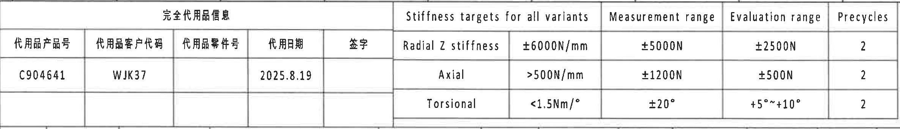

原图位置/视图名称: 上方左侧至中部表格，A1-B9。

原表还原:

| 完全代用品信息 |  |  |  |  | Stiffness targets for all variants |  | Measurement range | Evaluation range | Precycles |
|---|---|---|---|---|---|---|---|---|---|
| 代用品产品号 | 代用品客户代码 | 代用品零件号 | 代用日期 | 签字 | Radial Z stiffness | ±6000N/mm | ±5000N | ±2500N | 2 |
| C904641 | WJK37 |  | 2025.8.19 |  | Axial | >500N/mm | ±1200N | ±500N | 2 |
|  |  |  |  |  | Torsional | <1.5Nm/° | ±20° | +5°~+10° | 2 |

| 提取项 | 原图数值或文本 | 含义说明 |
|---|---|---|
| 代用品产品号 | C904641 | 替代产品编号。 |
| 代用品客户代码 | WJK37 | 客户代号。 |
| 代用日期 | 2025.8.19 | 代用品信息日期。 |
| Radial Z stiffness | ±6000N/mm | 径向 Z 刚度目标。 |
| Measurement range / Radial | ±5000N | 径向测量载荷范围。 |
| Evaluation range / Radial | ±2500N | 径向评价载荷范围。 |
| Axial | >500N/mm | 轴向刚度目标下限。 |
| Measurement range / Axial | ±1200N | 轴向测量载荷范围。 |
| Evaluation range / Axial | ±500N | 轴向评价载荷范围。 |
| Torsional | <1.5Nm/° | 扭转刚度目标上限。 |
| Measurement range / Torsional | ±20° | 扭转测量角度范围。 |
| Evaluation range / Torsional | +5°~+10° | 扭转评价角度范围。 |
| Precycles | 2 | 三项预循环次数均为 2。 |

边界归属说明: 右侧紧邻变更履历表，裁切右边界止于本表外框；不提取右侧变更表字段。

## object_2 - A10-B16 变更履历表

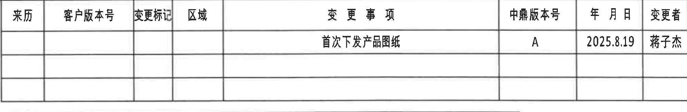

原图位置/视图名称: 上方右侧变更履历表，A10-B16。

原表还原:

| 来历 | 客户版本号 | 变更标记 | 区域 | 变更事项 | 中鼎版本号 | 年月日 | 变更者 |
|---|---|---|---|---|---|---|---|
|  |  |  |  | 首次下发产品图纸 | A | 2025.8.19 | 蒋子杰 |
|  |  |  |  |  |  |  |  |
|  |  |  |  |  |  |  |  |

| 提取项 | 原图数值或文本 | 含义说明 |
|---|---|---|
| 变更事项 | 首次下发产品图纸 | 该版本为首次下发产品图纸。 |
| 中鼎版本号 | A | 内部版本号。 |
| 年月日 | 2025.8.19 | 变更日期。 |
| 变更者 | 蒋子杰 | 变更人员。 |

边界归属说明: 右侧图框坐标字母不是表格字段；左侧与刚度目标表分界清晰。

## object_3 - B1-C14 产品参数与材料数据表

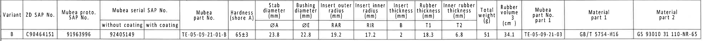

原图位置/视图名称: 上方第二行横向长表，B1-C14。

原表还原:

| Variant | ZD SAP No. | Mubea proto. SAP No. | Mubea serial SAP No. without coating | Mubea serial SAP No. with coating | Mubea part No. | Hardness (shore A) | Stab diameter (mm) ØA | Bushing diameter (mm) ØE | Insert outer radius (mm) RAR | Insert inner radius (mm) RIR | Insert thickness (mm) B | Rubber thickness (mm) T1 | Inner rubber thickness (mm) T2 | Total weight (g) | Rubber Volume (cm³) | Mubea part No. part 1 | Material part 1 | Material part 2 |
|---|---|---|---|---|---|---|---|---|---|---|---|---|---|---|---|---|---|---|
| B | C90464151 | 91963996 | 92405149 |  | TE-05-09-21-01-B | 65±3 | 23.8 | 22.8 | 19.2 | 17.2 | 2 | 18.3 | 6.8 | 51 | 34.1 | TE-05-09-21-03 | GB/T 5754-H16 | GS 93010 31 110-NR-65 |

| 提取项 | 原图数值或文本 | 含义说明 |
|---|---|---|
| Variant | B | 本图所示变型。 |
| ZD SAP No. | C90464151 | ZD SAP 产品号。 |
| Mubea proto. SAP No. | 91963996 | 样件 SAP 号。 |
| Mubea serial SAP No. without coating | 92405149 | 无涂层量产 SAP 号。 |
| Mubea part No. | TE-05-09-21-01-B | Mubea 零件号。 |
| Hardness | 65±3 shore A | 橡胶硬度。 |
| ØA | 23.8 mm | 稳定杆直径，局部剖视图标注 B Ø23.8。 |
| ØE | 22.8 mm | 衬套直径，正视图底部 ØE±0.3 使用该表值。 |
| RAR | 19.2 mm | 插入件外半径，局部剖视图标注 (RAR)。 |
| RIR | 17.2 mm | 插入件内半径，局部剖视图标注 (RIR)。 |
| B | 2 mm | 插入件厚度，A-A 剖面左侧 (B) 为参考。 |
| T1 | 18.3 mm | 橡胶厚度，A-A 剖面 T1±0.3 被圆圈标为检验尺寸。 |
| T2 | 6.8 mm | 内橡胶厚度，A-A 剖面 T2±0.3。 |
| Total weight | 51 g | 零件总重。 |
| Rubber Volume | 34.1 cm³ | 橡胶体积。 |
| Material part 1 | GB/T 5754-H16 | 件 1 材料。 |
| Material part 2 | GS 93010 31 110-NR-65 | 件 2 材料。 |

边界归属说明: 表格给出多个视图引用的参数值，后续视图中的 ØA、ØE、RAR、RIR、B、T1、T2 均以该表为参照。

## object_4 - E2-F5 正视/端面加工视图主体

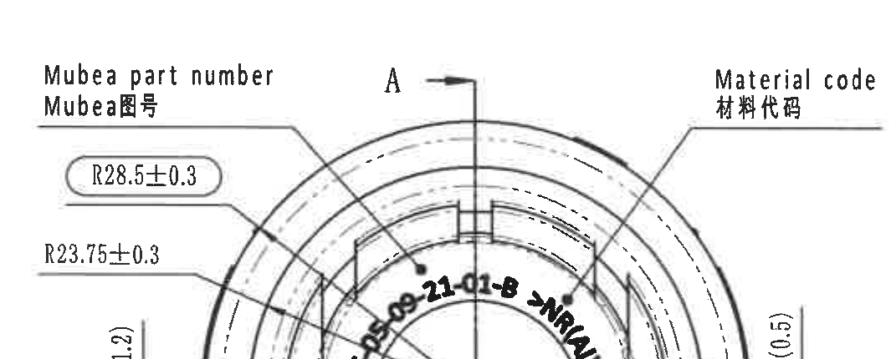

原图位置/视图名称: 中部左侧正视/端面加工视图主体，E2-F5。

| 提取项 | 原图数值或文本 | 含义说明 |
|---|---|---|
| Mubea part number / Mubea图号 | 引出到弧形内侧印字 | 说明图号标识位置。 |
| Material code / 材料代码 | 引出到右侧弧形区域 | 说明材料代码标识位置。 |
| R28.5±0.3 | 半径尺寸，带圆框 | 外侧圆弧半径控制尺寸。 |
| R23.75±0.3 | 半径尺寸 | 内/中间圆弧半径控制尺寸。 |
| (1.2) | 括号参考尺寸 | 左下竖向参考间隙/高度，括号表示参考尺寸。 |
| (0.5) | 括号参考尺寸 | 右侧竖向参考间隙/高度，括号表示参考尺寸。 |
| A / A arrows | A-A 剖切位置 | 指示 object_6 的剖面方向和位置。 |
| TE-05-09-21-01-B -> NR(A)K | 弧形印字 | 零件/材料相关印字，位于内弧面。 |

边界归属说明: 下方 ØE 尺寸因靠近边界单独列为 object_17；Variant letter 标注单独列为 object_18；右侧邻接侧视图边缘不作为本对象提取内容。

## object_17 - F4-G5 正视图底部 ØE 尺寸局部

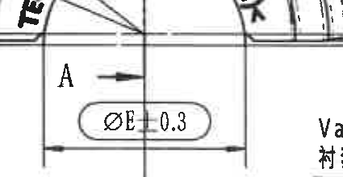

原图位置/视图名称: 正视图底部直径尺寸局部，F4-G5。

| 提取项 | 原图数值或文本 | 含义说明 |
|---|---|---|
| ØE±0.3 | ØE±0.3 | 衬套直径 E，公差 ±0.3。 |
| 表参照 | ØE=22.8 mm | 由 object_3 参数表可解读为 Ø22.8±0.3 mm。 |
| A-A 剖切线 | 穿过尺寸中心 | 该局部仍属于正视图的底部尺寸区域。 |

边界归属说明: 该尺寸靠近正视图底部，为完整保留尺寸线和文字单独裁切；不归入下方俯视图。

## object_18 - F5-G7 正视图变体字母标注

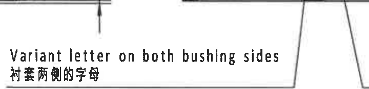

原图位置/视图名称: 正视图/衬套两侧字母标注，F5-G7。

| 提取项 | 原图数值或文本 | 含义说明 |
|---|---|---|
| Variant letter on both bushing sides | 衬套两侧的字母 | 要求变体字母在两侧衬套上标识。 |

边界归属说明: 该标注引出线位于正视图右下区域；裁切右侧邻近侧视图引出线，但提取内容只限 Variant letter 标注。

## object_5 - E5-F7 侧视加工视图主体

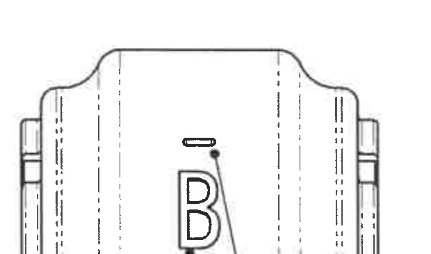

原图位置/视图名称: 中部侧视图主体，E5-F7。

| 提取项 | 原图数值或文本 | 含义说明 |
|---|---|---|
| B | 大写变体字母 | 显示侧面标识字母。 |
| 上方短线 | 线状标识 | 对应 object_16 的 Upper part marking 说明。 |
| 隐藏线 | 多条虚线 | 表示内部/背面轮廓。 |
| 两端结构 | 端部插入件/卡扣轮廓 | 显示两侧结构形状。 |

边界归属说明: 侧视图右侧靠近 A-A 剖面，A-A 左侧 (B) 尺寸不归入本视图，已单独作为 object_19。

## object_16 - F7-G10 侧视图上部标识说明

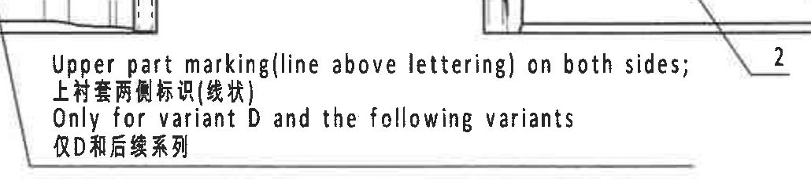

原图位置/视图名称: 侧视图 B 上方线状标识说明，F7-G10。

| 提取项 | 原图数值或文本 | 含义说明 |
|---|---|---|
| Upper part marking(line above lettering) on both sides | 上衬套两侧标识(线状) | 说明字母上方线状标识位于两侧。 |
| Only for variant D and the following variants | 仅D和后续系列 | 该标识要求只适用于 D 及后续变体。 |

边界归属说明: 该对象属于侧视图的标识说明；右侧件号 2 引出线只作为邻接边界，不作为提取项。

## object_6 - E9-F12 A-A 剖面视图

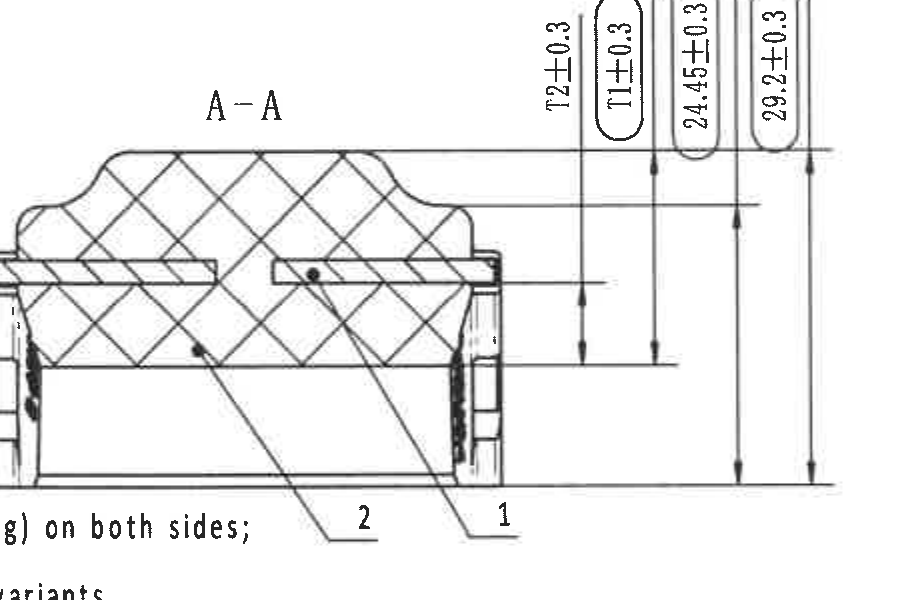

原图位置/视图名称: 中部 A-A 剖面视图，E9-F12。

| 提取项 | 原图数值或文本 | 含义说明 |
|---|---|---|
| A-A | 剖面标题 | 对应正视图 object_4 中 A-A 剖切位置。 |
| T2±0.3 | 竖向尺寸 | 内橡胶厚度 T2，表值 T2=6.8 mm，公差 ±0.3。 |
| T1±0.3 | 竖向尺寸，带圆圈 | 橡胶厚度 T1，表值 T1=18.3 mm；圆圈表示出厂检验尺寸。 |
| 24.45±0.3 | 竖向尺寸，带圆框 | 剖面高度/台阶相关控制尺寸。 |
| 29.2±0.3 | 竖向总高度尺寸，带圆框 | 剖面外形总高度相关控制尺寸。 |
| 件号 1 | 引出到右侧结构 | 对应 BOM: 铝骨架 5754 H16。 |
| 件号 2 | 引出到橡胶主体 | 对应 BOM: 橡胶 R6778-H65。 |

边界归属说明: 左侧 (B) 参考尺寸靠近侧视图边界，已作为 object_19 单独裁切并归属 A-A；右侧局部剖视图尺寸不归入 A-A。

## object_19 - E9-F9 A-A 剖面左侧 (B) 参考尺寸局部

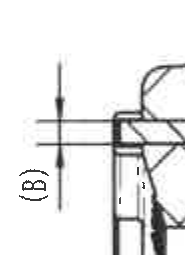

原图位置/视图名称: A-A 剖面左端 (B) 参考尺寸，E9-F9。

| 提取项 | 原图数值或文本 | 含义说明 |
|---|---|---|
| (B) | 括号内参考尺寸 | 对应参数表 Insert thickness B=2 mm；括号表示参考尺寸。 |
| 归属 | A-A 剖面左端插入件厚度/台阶处 | 依据箭头指向和剖面结构判断，不属于侧视图。 |

边界归属说明: 该尺寸贴近侧视图/A-A 分界，按完整箭头和剖面左端结构归入 A-A 剖面。

## object_7 - E13-F15 局部剖视图/端面半剖

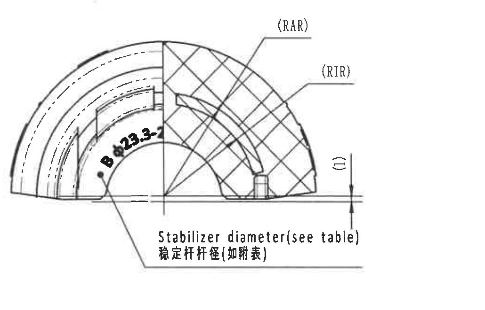

原图位置/视图名称: 右上局部剖视图/端面半剖，E13-F15。

| 提取项 | 原图数值或文本 | 含义说明 |
|---|---|---|
| (RAR) | 参考半径标注 | 插入件外半径，参数表 RAR=19.2 mm。 |
| (RIR) | 参考半径标注 | 插入件内半径，参数表 RIR=17.2 mm。 |
| B Ø23.8 | 稳定杆直径标注 | 变体 B 的稳定杆直径；参数表 ØA=23.8 mm。 |
| Stabilizer diameter(see table) / 稳定杆杆径(如附表) | 文字说明 | 稳定杆直径取表中数据。 |
| (1) | 括号参考/件号标注 | 位于右侧局部，邻近外形基线。 |

边界归属说明: 本对象为右侧局部剖视图；不提取左侧 A-A 剖面中的 T1/T2/高度尺寸。

## object_8 - H2-J5 俯视/主加工视图

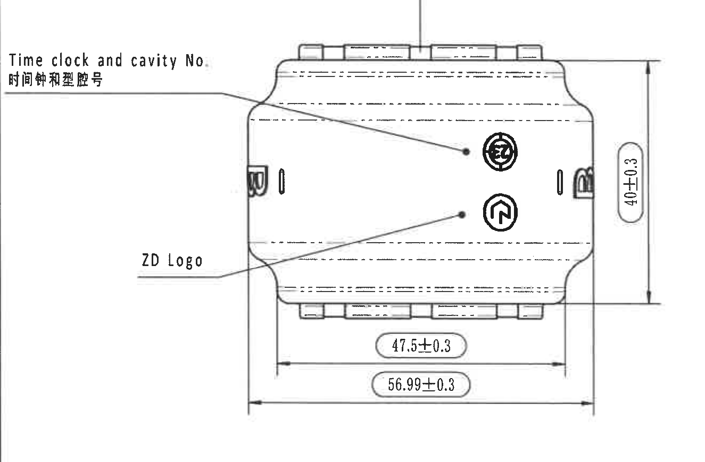

原图位置/视图名称: 下方左侧俯视/主加工视图，H2-J5。

| 提取项 | 原图数值或文本 | 含义说明 |
|---|---|---|
| Time clock and cavity No. / 时间钟和型腔号 | 左侧引出说明 | 指示时间钟和型腔号标识位置。 |
| ZD Logo | 左下引出说明 | 指示 ZD 标识位置。 |
| 40±0.3 | 右侧竖向尺寸 | 视图高度/外形高度尺寸。 |
| 47.5±0.3 | 底部内侧横向尺寸 | 内侧宽度/台阶间尺寸。 |
| 56.99±0.3 | 底部总横向尺寸 | 总体宽度尺寸。 |
| 圆形/方向标识 | 图中两个圆形标识 | 外观标识位置。 |

边界归属说明: 本视图下方邻接 DIN 公差表，但公差表不归入该视图；尺寸线和文字均完整保留。

## object_9 - H6-J9 等轴测视图

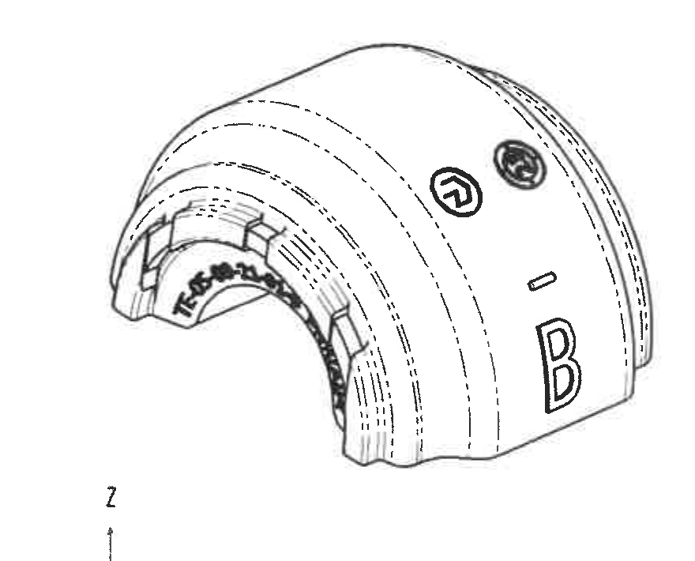

原图位置/视图名称: 下方中部等轴测视图，H6-J9。

| 提取项 | 原图数值或文本 | 含义说明 |
|---|---|---|
| 三维外观 | 零件等轴测形状 | 展示弧形衬套、开口和外表面轮廓。 |
| B 字母 | 外表面大写 B | 显示变体标识在外表面的视觉位置。 |
| 线状标识 | B 上方短线 | 对应侧视图上部标识说明。 |
| 圆形标识 | 外表面两个圆形符号 | 显示标识位置。 |
| X/Y/Z 坐标轴 | 左下角坐标轴 | 说明视图方向。 |

边界归属说明: 等轴测图未给出新尺寸；右侧 NOTES 和下方 Reference 标准列表均未归入该对象。

## object_10 - G9-I13 Specification 技术要求/NOTES

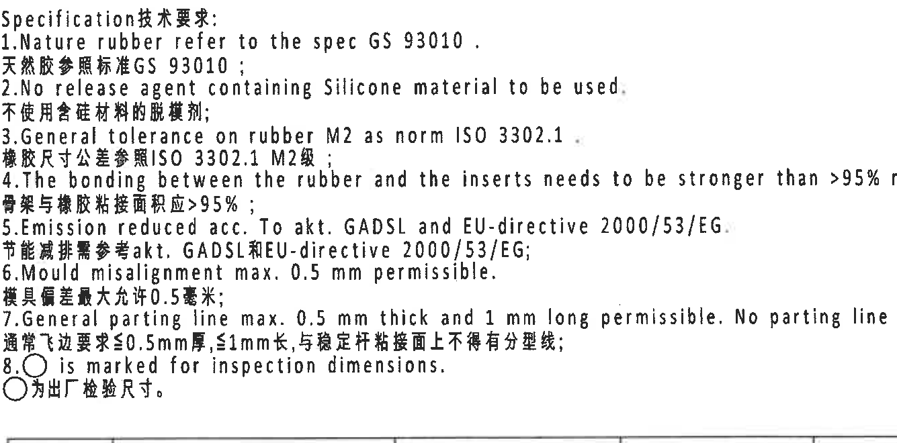

原图位置/视图名称: 右中部 Specification 技术要求/NOTES，G9-I13。

| 提取项 | 原图数值或文本 | 含义说明 |
|---|---|---|
| 1 | Nature rubber refer to the spec GS 93010 / 天然胶参照标准GS 93010 | 天然橡胶材料标准要求。 |
| 2 | No release agent containing Silicone material to be used / 不使用含硅材料的脱模剂 | 脱模剂禁用含硅材料。 |
| 3 | General tolerance on rubber M2 as norm ISO 3302.1 / 橡胶尺寸公差参照ISO 3302.1 M2级 | 橡胶通用公差等级。 |
| 4 | The bonding between the rubber and the inserts needs to be stronger than >95% rubber break / 骨架与橡胶粘接面积应>95% | 粘接强度/破坏模式要求。 |
| 5 | Emission reduced acc. to akt. GADSL and EU-directive 2000/53/EG / 节能减排需参考akt. GADSL和EU-directive 2000/53/EG | 法规/环保要求。 |
| 6 | Mould misalignment max. 0.5 mm permissible / 模具偏差最大允许0.5毫米 | 模具错位上限。 |
| 7 | General parting line max. 0.5 mm thick and 1 mm long permissible. No parting line on the bonding surface to the stabilizer / 通常飞边要求≤0.5mm厚、≤1mm长，与稳定杆粘接面上不得有分型线 | 分型线/飞边限制。 |
| 8 | ○ is marked for inspection dimensions / ○为出厂检验尺寸 | 圆圈标注为检验尺寸，例如 A-A 剖面 T1。 |

边界归属说明: NOTES 下方邻接 BOM 表，裁切不提取 BOM 行。

## object_11 - K1-L2 DIN ISO 3302-1 M2 class 公差表

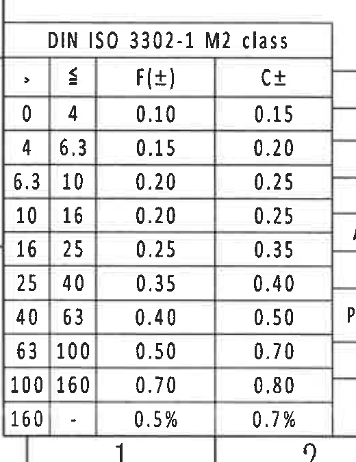

原图位置/视图名称: 左下角 DIN ISO 3302-1 M2 class 表，K1-L2。

原表还原:

| > | ≤ | F(±) | C± |
|---|---|---|---|
| 0 | 4 | 0.10 | 0.15 |
| 4 | 6.3 | 0.15 | 0.20 |
| 6.3 | 10 | 0.20 | 0.25 |
| 10 | 16 | 0.20 | 0.25 |
| 16 | 25 | 0.25 | 0.35 |
| 25 | 40 | 0.35 | 0.40 |
| 40 | 63 | 0.40 | 0.50 |
| 63 | 100 | 0.50 | 0.70 |
| 100 | 160 | 0.70 | 0.80 |
| 160 | - | 0.5% | 0.7% |

| 提取项 | 原图数值或文本 | 含义说明 |
|---|---|---|
| DIN ISO 3302-1 M2 class | 公差表标题 | 橡胶尺寸通用公差表，与 NOTES 第3条呼应。 |
| F(±), C± | 见表各行 | 按尺寸范围给出 F 和 C 等级公差。 |

边界归属说明: 表格底部和最后一行完整保留；右侧 Durability test 表不归入本对象。

## object_12 - K3-L7 Durability test 耐久测试表

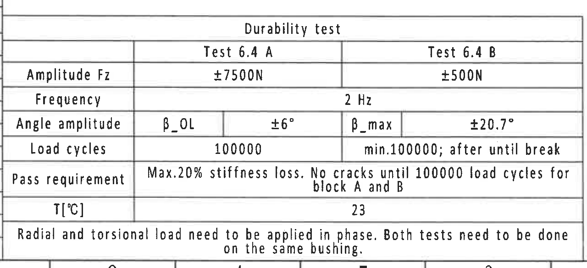

原图位置/视图名称: 底部中左 Durability test 表，K3-L7。

原表还原:

| Durability test | Test 6.4 A | Test 6.4 B |
|---|---|---|
| Amplitude Fz | ±7500N | ±500N |
| Frequency | 2 Hz | 2 Hz |
| Angle amplitude | β_OL / ±6° | β_max / ±20.7° |
| Load cycles | 100000 | min.100000; after until break |
| Pass requirement | Max.20% stiffness loss. No cracks until 100000 load cycles for block A and B | Max.20% stiffness loss. No cracks until 100000 load cycles for block A and B |
| T[°C] | 23 | 23 |
| Note | Radial and torsional load need to be applied in phase. Both tests need to be done on the same bushing. | Radial and torsional load need to be applied in phase. Both tests need to be done on the same bushing. |

| 提取项 | 原图数值或文本 | 含义说明 |
|---|---|---|
| Test 6.4 A Amplitude Fz | ±7500N | 耐久测试 A 的径向/载荷幅值。 |
| Test 6.4 B Amplitude Fz | ±500N | 耐久测试 B 的载荷幅值。 |
| Frequency | 2 Hz | 两项测试频率。 |
| β_OL ±6° | 角度幅值 | 测试 A 角度幅值。 |
| β_max ±20.7° | 角度幅值 | 测试 B 最大角度幅值。 |
| Load cycles | 100000 / min.100000; after until break | 加载循环要求。 |
| Pass requirement | Max.20% stiffness loss; No cracks until 100000 load cycles for block A and B | 通过判定。 |
| T[°C] | 23 | 试验温度。 |

边界归属说明: 表格完整包含底部说明；左侧 DIN 公差表和右侧参考标准列表不归入该表。

## object_15 - J8-L10 Reference 参考标准列表

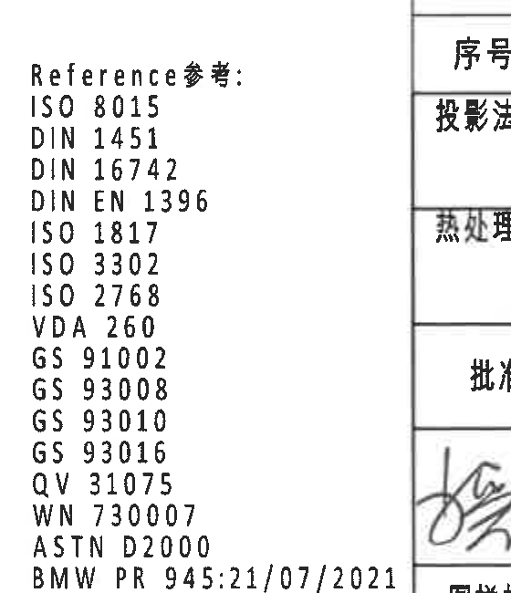

原图位置/视图名称: 底部中右 Reference 参考标准列表，J8-L10。

| 提取项 | 原图数值或文本 | 含义说明 |
|---|---|---|
| Reference参考 | ISO 8015; DIN 1451; DIN 16742; DIN EN 1396; ISO 1817; ISO 3302; ISO 2768; VDA 260; GS 91002; GS 93008; GS 93010; GS 93016; QV 31075; WN 730007; ASTN D2000; BMW PR 945:21/07/2021 | 图纸引用标准清单。 |

边界归属说明: 右侧贴近标题栏边界，裁切中可见相邻标题栏边框边缘；提取内容仅为左侧 Reference 列表。

## object_13 - J10-K16 物料明细/BOM 表

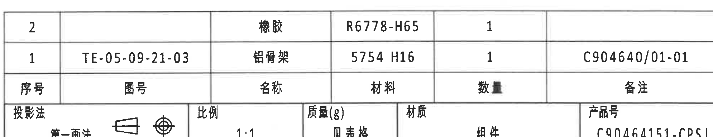

原图位置/视图名称: 右下方物料明细表，J10-K16。

原表还原:

| 序号 | 图号 | 名称 | 材料 | 数量 | 备注 |
|---|---|---|---|---|---|
| 2 |  | 橡胶 | R6778-H65 | 1 |  |
| 1 | TE-05-09-21-03 | 铝骨架 | 5754 H16 | 1 | C904640/01-01 |

| 提取项 | 原图数值或文本 | 含义说明 |
|---|---|---|
| 序号 2 | 橡胶 / R6778-H65 / 1 | 对应剖面中件号 2 的橡胶主体。 |
| 序号 1 | TE-05-09-21-03 / 铝骨架 / 5754 H16 / 1 / C904640/01-01 | 对应剖面中件号 1 的铝骨架。 |

边界归属说明: 该对象只提取物料明细行；下方标题栏字段另由 object_14 提取。

## object_14 - K10-L16 标题栏/签署栏

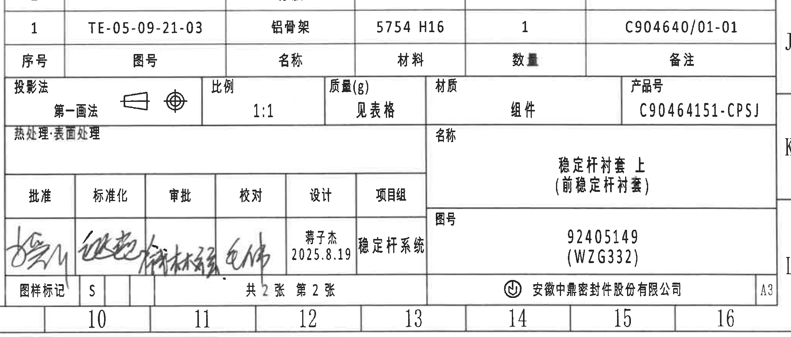

原图位置/视图名称: 右下角标题栏/签署栏，K10-L16。

原表还原:

| 字段 | 原图文本 |
|---|---|
| 投影法 | 第一画法 |
| 比例 | 1:1 |
| 质量(g) | 见表格 |
| 材质 | 组件 |
| 产品号 | C90464151-CPSJ |
| 热处理/表面处理 |  |
| 名称 | 稳定杆衬套 上（前稳定杆衬套） |
| 图号 | 92405149 (WZG332) |
| 批准 | 签名 |
| 标准化 | 签名 |
| 审批 | 签名 |
| 校对 | 签名 |
| 设计 | 蒋子杰 / 2025.8.19 |
| 项目组 | 稳定杆系统 |
| 图样标记 | S |
| 张数 | 共2张 第2张 |
| 公司 | 安徽中鼎密封件股份有限公司 |
| 图幅 | A3 |

| 提取项 | 原图数值或文本 | 含义说明 |
|---|---|---|
| 产品号 | C90464151-CPSJ | 标题栏产品号。 |
| 名称 | 稳定杆衬套 上（前稳定杆衬套） | 图纸名称。 |
| 图号 | 92405149 (WZG332) | 图纸编号。 |
| 比例 | 1:1 | 图纸比例。 |
| 质量(g) | 见表格 | 重量见参数/BOM 表。 |
| 材质 | 组件 | 材质类别。 |
| 设计 | 蒋子杰 2025.8.19 | 设计人员和日期。 |
| 项目组 | 稳定杆系统 | 项目组名称。 |
| 图样标记 | S | 图样标记。 |
| 张数 | 共2张 第2张 | 总张数和当前张。 |
| 公司 | 安徽中鼎密封件股份有限公司 | 出图公司。 |
| 图幅 | A3 | 图幅规格。 |

边界归属说明: 上方 BOM 行邻接标题栏，但已在 object_13 单独提取；本对象主要提取标题栏字段、签署栏、公司名和图幅。

## 裁切检查记录

| object_id | 裁切对象 | 检查结论 |
|---|---|---|
| object_1 | 完全代用品信息与刚度目标表 | 完整包含表格边框、文字和三行刚度目标；未提取右侧变更履历。 |
| object_2 | 变更履历表 | 完整包含表头和记录；右侧图框字母不作为内容。 |
| object_3 | 产品参数与材料数据表 | 完整包含表头、单位、参数行和材料字段。 |
| object_4 | 正视图主体 | 完整包含 R28.5±0.3、R23.75±0.3、(1.2)、(0.5)、A-A 标识和引出标注；底部 ØE 与变体字母因靠边单独裁切。 |
| object_17 | 正视图 ØE 尺寸局部 | 完整包含 ØE±0.3 文字、尺寸线和箭头。 |
| object_18 | 正视图变体字母标注 | 完整包含英文/中文说明；右侧相邻引出线不作为内容。 |
| object_5 | 侧视图主体 | 完整包含侧视外形、B 字母和上部短线；未把 A-A 的 (B) 尺寸归入侧视图。 |
| object_16 | 侧视图上部标识说明 | 完整包含英文/中文三行说明；右侧件号 2 引线为邻接片段，不提取。 |
| object_6 | A-A 剖面 | 完整包含剖面主体、件号 1/2、T2/T1/24.45/29.2 尺寸线和文字；左侧 (B) 因靠边单独裁切。 |
| object_19 | A-A 左侧 (B) 参考尺寸 | 完整包含 (B) 文字和尺寸线；依据箭头归属 A-A。 |
| object_7 | 局部剖视图 | 完整包含 (RAR)、(RIR)、B Ø23.8、(1) 和稳定杆直径说明。 |
| object_8 | 俯视/主加工视图 | 完整包含 40±0.3、47.5±0.3、56.99±0.3、Time clock/cavity No. 和 ZD Logo 标注。 |
| object_9 | 等轴测视图 | 完整包含三维图和 X/Y/Z 坐标轴；不含右侧 NOTES。 |
| object_10 | NOTES | 完整包含 1-8 条技术要求；底部表格不提取。 |
| object_11 | DIN ISO 3302-1 M2 公差表 | 重裁后完整包含最后一行 160--、0.5%、0.7%。 |
| object_12 | Durability test 表 | 完整包含测试表边框、全部行和底部说明。 |
| object_15 | Reference 参考标准 | 完整包含参考标准列表；右侧可见标题栏邻边，未作为内容提取。 |
| object_13 | BOM 表 | 完整包含物料明细表表头和 1/2 两行。 |
| object_14 | 标题栏 | 重裁后完整包含标题栏字段、签署栏、公司名、A3 图幅；上方 BOM 行不重复计入。 |
