# 20C90464351 PDF 内容识别

## 整页 PNG

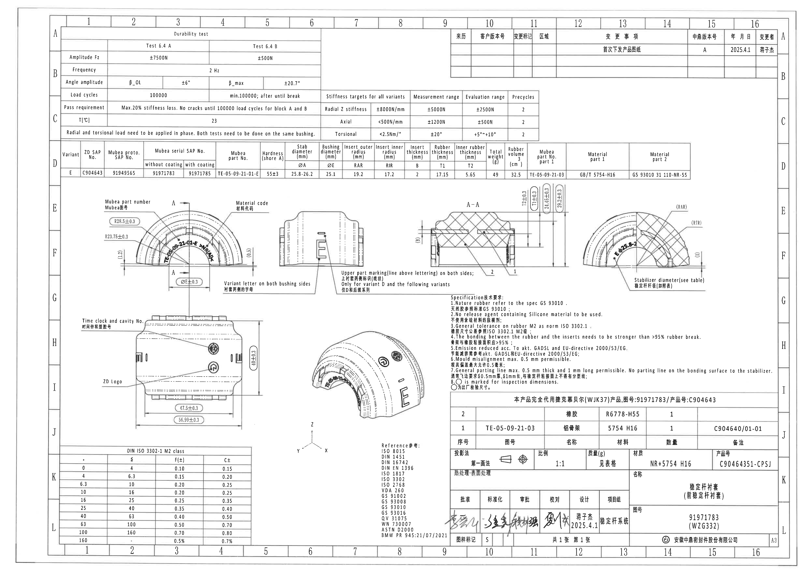

- 原 PDF: input/20C90464351.pdf
- 页面: 1
- 整页 PNG: outputs/20C90464351_assets/images/page_1.png
- 图像尺寸: 4959 x 3505 px

## object_1 - Durability test 表

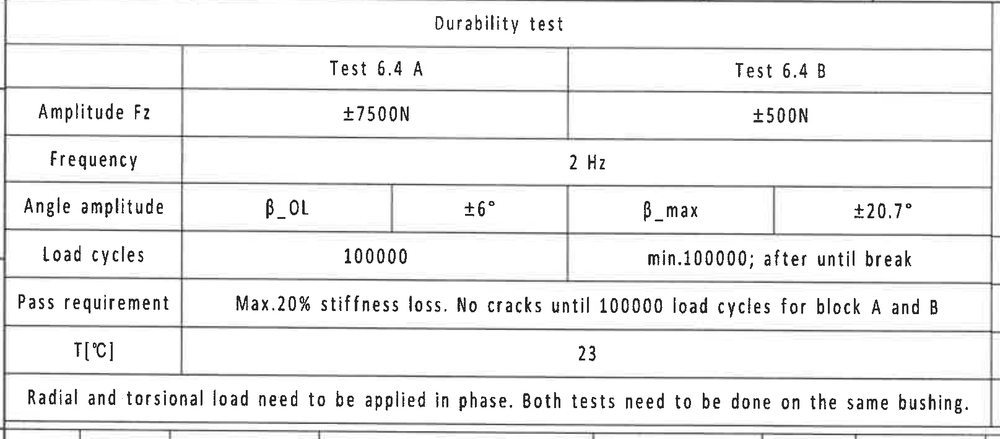

- 原图位置/视图名称: 原图上方 A-C 区域，耐久试验表
- object_kind: table
- bbox: [365, 170, 1980, 880]

### 原表还原

| 项目 | Test 6.4 A | Test 6.4 B |
| --- | --- | --- |
| Durability test | Test 6.4 A | Test 6.4 B |
| Amplitude Fz | ±7500N | ±500N |
| Frequency | 2 Hz | 2 Hz |
| Angle amplitude | β_OL；±6° | β_max；±20.7° |
| Load cycles | 100000 | min.100000; after until break |
| Pass requirement | Max.20% stiffness loss. No cracks until 100000 load cycles for block A and B | Max.20% stiffness loss. No cracks until 100000 load cycles for block A and B |
| T[℃] | 23 | 23 |
| Remark | Radial and torsional load need to be applied in phase. Both tests need to be done on the same bushing. | Radial and torsional load need to be applied in phase. Both tests need to be done on the same bushing. |

### 提取表格

| 提取项 | 原图数值或文本 | 含义说明 |
| --- | --- | --- |
| Amplitude Fz / Test 6.4 A | ±7500N | Test 6.4 A 的载荷振幅 Fz。 |
| Amplitude Fz / Test 6.4 B | ±500N | Test 6.4 B 的载荷振幅 Fz。 |
| Frequency | 2 Hz | 频率，原表合并跨两个测试栏。 |
| Angle amplitude / Test 6.4 A | β_OL；±6° | 角度振幅，β_OL 条件下允许 ±6°。 |
| Angle amplitude / Test 6.4 B | β_max；±20.7° | 角度振幅，β_max 条件下允许 ±20.7°。 |
| Load cycles / Test 6.4 A | 100000 | A 测试循环次数。 |
| Load cycles / Test 6.4 B | min.100000; after until break | B 测试至少 100000 次，之后直到破坏。 |
| Pass requirement | Max.20% stiffness loss. No cracks until 100000 load cycles for block A and B | 判定要求：刚度损失最大 20%，A/B 块到 100000 次载荷循环前不得开裂。 |
| T[℃] | 23 | 测试温度 23℃。 |
| Radial and torsional load note | Radial and torsional load need to be applied in phase. Both tests need to be done on the same bushing. | 径向载荷与扭转载荷需同相施加，两个测试在同一个衬套上进行。 |

### 边界归属说明

裁切只包含耐久试验表外框；下方 D 行参数表被排除，右侧刚度目标表不归入本对象。

## object_2 - 修订履历表

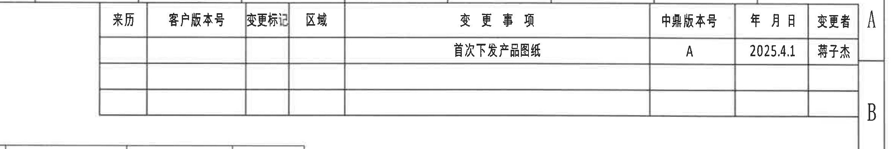

- 原图位置/视图名称: 原图上方 9-16 列、A-B 区域，修订履历表
- object_kind: table
- bbox: [2500, 170, 4860, 565]

### 原表还原

| 来历 | 客户版本号 | 变更标记 | 区域 | 变更事项 | 中鼎版本号 | 年月日 | 变更者 |
| --- | --- | --- | --- | --- | --- | --- | --- |
|  |  |  |  | 首次下发产品图纸 | A | 2025.4.1 | 蒋子杰 |
|  |  |  |  |  |  |  |  |
|  |  |  |  |  |  |  |  |

### 提取表格

| 提取项 | 原图数值或文本 | 含义说明 |
| --- | --- | --- |
| 变更事项 | 首次下发产品图纸 | 首次发行/下发该产品图纸。 |
| 中鼎版本号 | A | 中鼎内部版本为 A。 |
| 年月日 | 2025.4.1 | 变更日期。 |
| 变更者 | 蒋子杰 | 变更执行人。 |
| 空白修订行 | 2 行空白 | 原表保留两行空白修订记录。 |

### 边界归属说明

裁切只包含右上修订履历表；未包含下方刚度目标表。

## object_3 - Stiffness targets 表

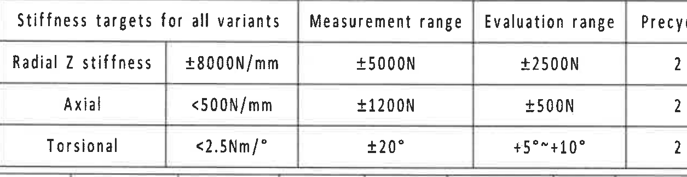

- 原图位置/视图名称: 原图上方 C 区域，刚度目标表
- object_kind: table
- bbox: [1970, 555, 3225, 880]

### 原表还原

| Stiffness targets for all variants | 目标值 | Measurement range | Evaluation range | Precycles |
| --- | --- | --- | --- | --- |
| Radial Z stiffness | ±8000N/mm | ±5000N | ±2500N | 2 |
| Axial | <500N/mm | ±1200N | ±500N | 2 |
| Torsional | <2.5Nm/° | ±20° | +5°~+10° | 2 |

### 提取表格

| 提取项 | 原图数值或文本 | 含义说明 |
| --- | --- | --- |
| Radial Z stiffness | ±8000N/mm；Measurement ±5000N；Evaluation ±2500N；Precycles 2 | 径向 Z 刚度目标及测量/评估范围，预循环 2 次。 |
| Axial | <500N/mm；Measurement ±1200N；Evaluation ±500N；Precycles 2 | 轴向刚度目标及测量/评估范围，预循环 2 次。 |
| Torsional | <2.5Nm/°；Measurement ±20°；Evaluation +5°~+10°；Precycles 2 | 扭转刚度目标及角度测量/评估范围，预循环 2 次。 |

### 边界归属说明

裁切只包含刚度目标表；左侧耐久表末尾、下方 D 行参数表均不归入本对象。

## object_4 - 变体/材料/关键参数表

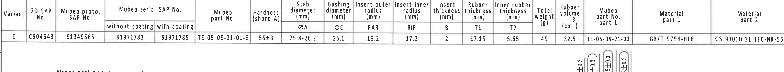

- 原图位置/视图名称: 原图 D 行，横向参数表
- object_kind: table
- bbox: [365, 880, 4215, 1235]

### 原表还原

| Variant | ZD SAP No. | Mubea proto. SAP No. | Mubea serial SAP No. without coating | Mubea serial SAP No. with coating | Mubea part No. | Hardness (shore A) | Stab diameter ØA (mm) | Bushing diameter ØE (mm) | Insert outer radius RAR (mm) | Insert inner radius RIR (mm) | Insert thickness B (mm) | Rubber thickness T1 (mm) | Inner rubber thickness T2 (mm) | Total weight (g) | Rubber volume (cm³) | Mubea part No. part 1 | Material part 1 | Material part 2 |
| --- | --- | --- | --- | --- | --- | --- | --- | --- | --- | --- | --- | --- | --- | --- | --- | --- | --- | --- |
| E | C904643 | 91949565 | 91971783 | 91971785 | TE-05-09-21-01-E | 55±3 | 25.8-26.2 | 25.1 | 19.2 | 17.2 | 2 | 17.15 | 5.65 | 49 | 32.5 | TE-05-09-21-03 | GB/T 5754-H16 | GS 93010 31 110-NR-55 |

### 提取表格

| 提取项 | 原图数值或文本 | 含义说明 |
| --- | --- | --- |
| Variant | E | 参数表字段，后续视图中以字母或代号引用。 |
| ZD SAP No. | C904643 | 参数表字段，后续视图中以字母或代号引用。 |
| Mubea proto. SAP No. | 91949565 | 参数表字段，后续视图中以字母或代号引用。 |
| Mubea serial SAP No. without coating | 91971783 | 参数表字段，后续视图中以字母或代号引用。 |
| Mubea serial SAP No. with coating | 91971785 | 参数表字段，后续视图中以字母或代号引用。 |
| Mubea part No. | TE-05-09-21-01-E | 参数表字段，后续视图中以字母或代号引用。 |
| Hardness (shore A) | 55±3 | 参数表字段，后续视图中以字母或代号引用。 |
| Stab diameter ØA (mm) | 25.8-26.2 | 参数表字段，后续视图中以字母或代号引用。 |
| Bushing diameter ØE (mm) | 25.1 | 参数表字段，后续视图中以字母或代号引用。 |
| Insert outer radius RAR (mm) | 19.2 | 参数表字段，后续视图中以字母或代号引用。 |
| Insert inner radius RIR (mm) | 17.2 | 参数表字段，后续视图中以字母或代号引用。 |
| Insert thickness B (mm) | 2 | 参数表字段，后续视图中以字母或代号引用。 |
| Rubber thickness T1 (mm) | 17.15 | 参数表字段，后续视图中以字母或代号引用。 |
| Inner rubber thickness T2 (mm) | 5.65 | 参数表字段，后续视图中以字母或代号引用。 |
| Total weight (g) | 49 | 参数表字段，后续视图中以字母或代号引用。 |
| Rubber volume (cm³) | 32.5 | 参数表字段，后续视图中以字母或代号引用。 |
| Mubea part No. part 1 | TE-05-09-21-03 | 参数表字段，后续视图中以字母或代号引用。 |
| Material part 1 | GB/T 5754-H16 | 参数表字段，后续视图中以字母或代号引用。 |
| Material part 2 | GS 93010 31 110-NR-55 | 参数表字段，后续视图中以字母或代号引用。 |

### 边界归属说明

裁切沿 D 行参数表上下边线截取；下方视图的竖向尺寸线被排除。

## object_5 - 上部主视图 / 半圆正视图

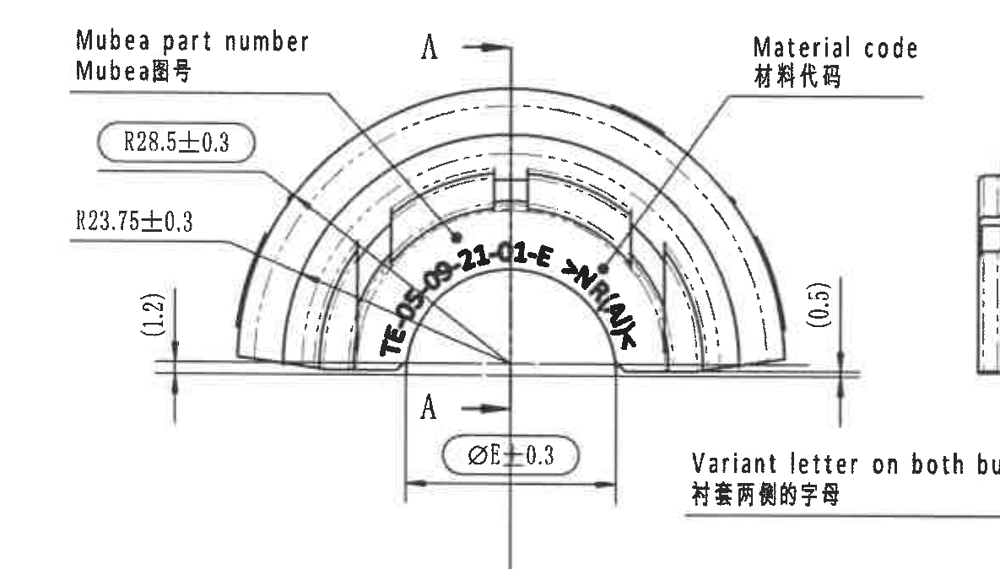

- 原图位置/视图名称: 原图 E-F 区域左侧半圆主视图
- object_kind: view
- bbox: [555, 1190, 1740, 1865]

### 提取表格

| 提取项 | 原图数值或文本 | 含义说明 |
| --- | --- | --- |
| R28.5±0.3 | R28.5±0.3 | 外侧弧半径尺寸，圆角框/圆圈标识为出厂检验尺寸。 |
| R23.75±0.3 | R23.75±0.3 | 内侧弧半径尺寸。 |
| (1.2) | (1.2) | 左侧竖向参考尺寸，括号表示参考尺寸；只说明位置关系，不作为独立加工控制尺寸。 |
| (0.5) | (0.5) | 右侧竖向参考尺寸，括号表示参考尺寸。 |
| ØE±0.3 | ØE±0.3 | 以表中 bushing diameter ØE=25.1 为名义值的直径尺寸，公差 ±0.3。 |
| A-A 剖切基准 | A / A | 中心剖切线和上下箭头，定义剖面 A-A 的截取位置。 |
| Mubea part number / Mubea图号 | Mubea part number / Mubea图号 | 左上引线指向零件上的 Mubea 图号标识区域。 |
| Material code / 材料代码 | Material code / 材料代码 | 右上引线指向材料代码标识区域。 |
| 弧形标记文字 | TE-05-09-21-01-E -> NR/ANK | 沿内弧布置的零件/材料标识文字；按图中可读弧形文字转录。 |
| 星号关键尺寸 | 未见星号尺寸 | 本视图无星号标注；圆角框尺寸按 Note 8 识别为检验尺寸。 |

### 边界归属说明

右侧为保留 Material code 引线末端而带入相邻侧视图极窄轮廓片段；该片段不归入本视图，不提取其尺寸或形状。下方跨视图标记说明另列为 object_16。

## object_6 - 上部侧视/标识视图

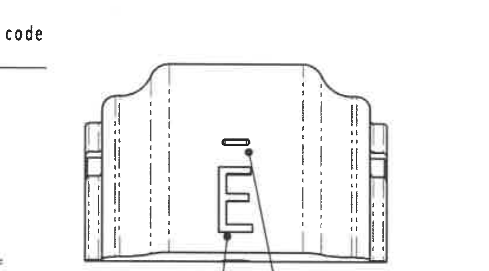

- 原图位置/视图名称: 原图 E-F 区域中部侧视图
- object_kind: view
- bbox: [1570, 1190, 2400, 1650]

### 提取表格

| 提取项 | 原图数值或文本 | 含义说明 |
| --- | --- | --- |
| 外形视图 | 无独立数字尺寸 | 该侧视图展示衬套外形、侧翼和内部虚线轮廓。 |
| 字母标识 | E | 视图中心显示变体字母 E 的外观位置。 |
| 线状标识 | E 字母上方短横线 | 上衬套两侧线状标识的位置；详细说明见 object_16。 |
| 星号关键尺寸 | 未见星号尺寸 | 本视图未标出星号尺寸。 |

### 边界归属说明

裁切只包含侧视轮廓和 E 标识；左侧主视图、右侧 A-A 剖面均不纳入本对象。跨视图文字说明单独归 object_16。

## object_16 - 跨视图标记说明

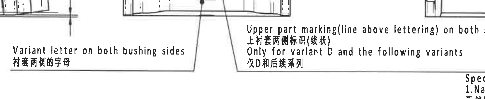

- 原图位置/视图名称: 原图 F-G 区域，主视图与侧视图下方标记说明
- object_kind: notes
- bbox: [1335, 1585, 2825, 1890]

### 提取表格

| 提取项 | 原图数值或文本 | 含义说明 |
| --- | --- | --- |
| Variant letter on both bushing sides | Variant letter on both bushing sides / 衬套两侧的字母 | 说明变体字母需要标在衬套两侧。 |
| Upper part marking | Upper part marking(line above lettering) on both sides; 上衬套两侧标识(线状) | 说明字母上方线状标记应在两侧。 |
| Variant scope | Only for variant D and the following variants / 仅D和后续系列 | 该标记要求仅适用于 D 及后续系列。 |

### 边界归属说明

该说明文字横跨主视图、侧视图和 A-A 剖面之间，单独裁切避免归错到任何单一视图。右侧 NOTES 开头未作为本对象提取。

## object_7 - 剖面 A-A

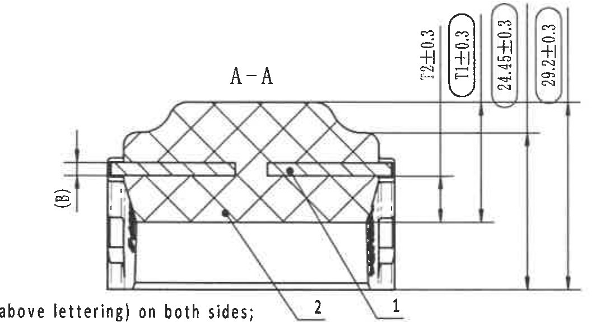

- 原图位置/视图名称: 原图 E-F 区域中右部 A-A 剖面
- object_kind: section
- bbox: [2450, 1120, 3530, 1695]

### 提取表格

| 提取项 | 原图数值或文本 | 含义说明 |
| --- | --- | --- |
| 剖面名称 | A-A | 来自 object_5 的 A-A 剖切位置。 |
| (B) | (B) | 左侧竖向参考尺寸，括号表示参考；对应参数表中的 Insert thickness B=2。 |
| T2±0.3 | T2±0.3 | 剖面竖向厚度尺寸，T2 名义值由参数表给出为 5.65，公差 ±0.3。 |
| T1±0.3 | T1±0.3 | 剖面竖向厚度尺寸，T1 名义值由参数表给出为 17.15，公差 ±0.3；圆角框为检验尺寸。 |
| 24.45±0.3 | 24.45±0.3 | 剖面右侧竖向总/阶梯高度尺寸，公差 ±0.3；圆角框为检验尺寸。 |
| 29.2±0.3 | 29.2±0.3 | 剖面最外侧竖向总高度尺寸，公差 ±0.3；圆角框为检验尺寸。 |
| 零件序号 2 | 2 | 剖面引线指向橡胶件；与 BOM 序号 2 对应。 |
| 零件序号 1 | 1 | 剖面引线指向铝骨架/嵌件；与 BOM 序号 1 对应。 |

### 边界归属说明

右侧竖向尺寸线靠近相邻局部剖视图边界，裁切向右保留完整 29.2±0.3 尺寸文字和箭头；相邻局部剖视图的 RAR/RIR 不归入本剖面。下方跨视图说明不作为本对象内容。

## object_8 - 右侧局部剖视图

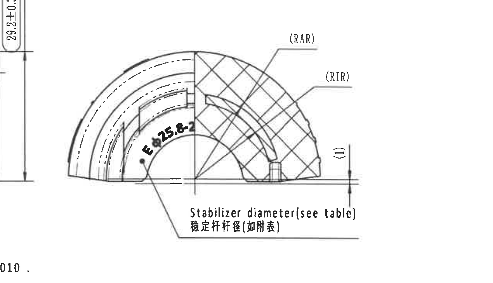

- 原图位置/视图名称: 原图 E-F 区域右侧局部剖视图
- object_kind: detail
- bbox: [3400, 1170, 4670, 1900]

### 提取表格

| 提取项 | 原图数值或文本 | 含义说明 |
| --- | --- | --- |
| (RAR) | (RAR) | 参考外半径标识；参数表给出 Insert outer radius RAR=19.2 mm。 |
| (RIR) | (RIR) | 参考内半径标识；参数表给出 Insert inner radius RIR=17.2 mm。 |
| E Ø25.8-2 | E Ø25.8-2 | 沿弧形标注的稳定杆直径可见文字；对应下方说明“Stabilizer diameter(see table)”。参数表给出 ØA=25.8-26.2 mm。 |
| (1) | (1) | 右侧竖向参考尺寸/位置标识，括号表示参考。 |
| Stabilizer diameter(see table) | Stabilizer diameter(see table) / 稳定杆杆径(如附表) | 引线说明稳定杆杆径需查表，归属本局部剖视图。 |

### 边界归属说明

左边缘可见 A-A 剖面最外侧尺寸的一小段残留，仅为边界邻近痕迹；29.2±0.3 已归入 object_7，不在本局部视图重复提取。

## object_9 - 下部正视图

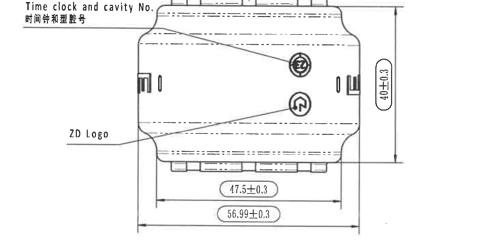

- 原图位置/视图名称: 原图 H-J 区域左下正视图
- object_kind: view
- bbox: [430, 1950, 1850, 2665]

### 提取表格

| 提取项 | 原图数值或文本 | 含义说明 |
| --- | --- | --- |
| Time clock and cavity No. | Time clock and cavity No. / 时间钟和型腔号 | 左上引线说明时间钟和型腔号标识位置。 |
| ZD Logo | ZD Logo | 左下引线说明 ZD 标识位置。 |
| 40±0.3 | 40±0.3 | 右侧竖向总高度尺寸，公差 ±0.3；圆角框为检验尺寸。 |
| 47.5±0.3 | 47.5±0.3 | 下方内侧宽度尺寸，公差 ±0.3；圆角框为检验尺寸。 |
| 56.99±0.3 | 56.99±0.3 | 下方外侧总宽度尺寸，公差 ±0.3；圆角框为检验尺寸。 |

### 边界归属说明

裁切包含该正视图完整轮廓、上下宽度尺寸和右侧高度尺寸；底部 DIN 表已排除，右侧等轴图不归入本对象。

## object_10 - 等轴测视图

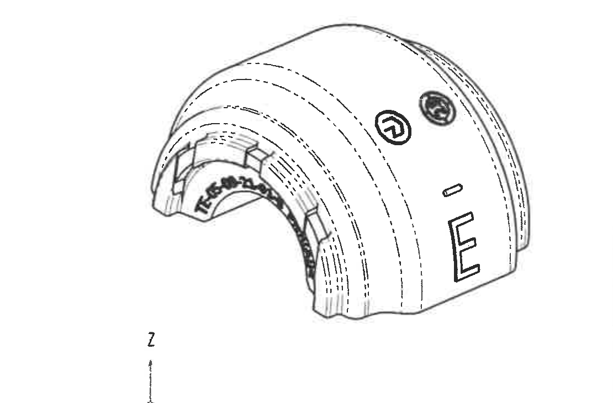

- 原图位置/视图名称: 原图 H-J 区域中部等轴测视图
- object_kind: view
- bbox: [1640, 1990, 2750, 2720]

### 提取表格

| 提取项 | 原图数值或文本 | 含义说明 |
| --- | --- | --- |
| 等轴测外形 | 无独立数字尺寸 | 展示产品三维外形、开口和标识位置。 |
| 变体字母 | E | 等轴测外表面显示 E 标识。 |
| 圆形标识 | 两个圆形标识 | 显示外表面圆形标识位置。 |
| 星号关键尺寸 | 未见星号尺寸 | 等轴测图未标出数值尺寸。 |

### 边界归属说明

裁切只包含等轴测产品图；右侧 NOTES、下方参考清单和标题栏未纳入本对象。

## object_11 - Specification 技术要求 / NOTES

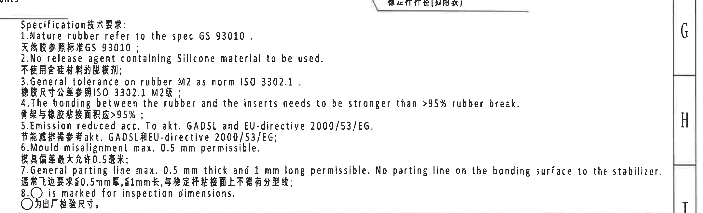

- 原图位置/视图名称: 原图 G-I 区域右中技术要求
- object_kind: notes
- bbox: [2700, 1750, 4860, 2405]

### 原文转录

```text
Specification 技术要求:
1. Nature rubber refer to the spec GS 93010. / 天然胶参照标准GS 93010；
2. No release agent containing Silicone material to be used. / 不使用含硅材料的脱模剂；
3. General tolerance on rubber M2 as norm ISO 3302.1. / 橡胶尺寸公差参照ISO 3302.1 M2级；
4. The bonding between the rubber and the inserts needs to be stronger than >95% rubber break. / 骨架与橡胶粘接面积应>95%；
5. Emission reduced acc. To akt. GADSL and EU-directive 2000/53/EG. / 节能减排需参考akt. GADSL和EU-directive 2000/53/EG；
6. Mould misalignment max. 0.5 mm permissible. / 模具偏差最大允许0.5毫米；
7. General parting line max. 0.5 mm thick and 1 mm long permissible. No parting line on the bonding surface to the stabilizer. / 通常飞边要求≤0.5mm厚，≤1mm长，与稳定杆粘接面上不得有分型线；
8. ○ is marked for inspection dimensions. / ○为出厂检验尺寸。
```

### 提取表格

| 提取项 | 原图数值或文本 | 含义说明 |
| --- | --- | --- |
| NOTE 1 | 1. Nature rubber refer to the spec GS 93010. / 天然胶参照标准GS 93010； | 技术要求原文逐条转录。 |
| NOTE 2 | 2. No release agent containing Silicone material to be used. / 不使用含硅材料的脱模剂； | 技术要求原文逐条转录。 |
| NOTE 3 | 3. General tolerance on rubber M2 as norm ISO 3302.1. / 橡胶尺寸公差参照ISO 3302.1 M2级； | 技术要求原文逐条转录。 |
| NOTE 4 | 4. The bonding between the rubber and the inserts needs to be stronger than >95% rubber break. / 骨架与橡胶粘接面积应>95%； | 技术要求原文逐条转录。 |
| NOTE 5 | 5. Emission reduced acc. To akt. GADSL and EU-directive 2000/53/EG. / 节能减排需参考akt. GADSL和EU-directive 2000/53/EG； | 技术要求原文逐条转录。 |
| NOTE 6 | 6. Mould misalignment max. 0.5 mm permissible. / 模具偏差最大允许0.5毫米； | 技术要求原文逐条转录。 |
| NOTE 7 | 7. General parting line max. 0.5 mm thick and 1 mm long permissible. No parting line on the bonding surface to the stabilizer. / 通常飞边要求≤0.5mm厚，≤1mm长，与稳定杆粘接面上不得有分型线； | 技术要求原文逐条转录。 |
| NOTE 8 | 8. ○ is marked for inspection dimensions. / ○为出厂检验尺寸。 | 技术要求原文逐条转录。 |

### 边界归属说明

裁切只包含技术要求 1-8 条；上方局部剖视图说明和下方 BOM 表不归入本对象。

## object_12 - BOM / 明细表

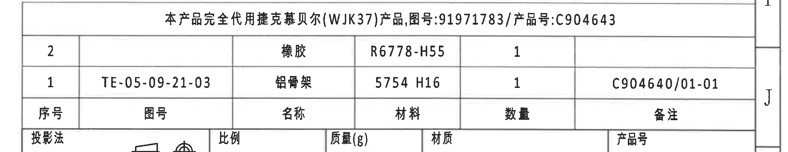

- 原图位置/视图名称: 原图 I-J 区域右侧 BOM 明细表
- object_kind: table
- bbox: [2700, 2400, 4860, 2820]

### 原表还原

| 序号 | 图号 | 名称 | 材料 | 数量 | 备注 |
| --- | --- | --- | --- | --- | --- |
| 2 |  | 橡胶 | R6778-H55 | 1 |  |
| 1 | TE-05-09-21-03 | 铝骨架 | 5754 H16 | 1 | C904640/01-01 |

### 提取表格

| 提取项 | 原图数值或文本 | 含义说明 |
| --- | --- | --- |
| 代用说明 | 本产品完全代用捷克慕贝尔(WJK37)产品,图号:91971783/产品号:C904643 | BOM 上方合并单元格说明替代关系。 |
| 序号 2 | 名称 橡胶；材料 R6778-H55；数量 1 | 橡胶件明细。 |
| 序号 1 | 图号 TE-05-09-21-03；名称 铝骨架；材料 5754 H16；数量 1；备注 C904640/01-01 | 铝骨架/嵌件明细，与剖面 object_7 的序号 1 对应。 |

### 边界归属说明

裁切包含 BOM 明细和其上方代用说明；下方标题栏字段另归 object_15。

## object_13 - DIN ISO 3302-1 M2 class 公差表

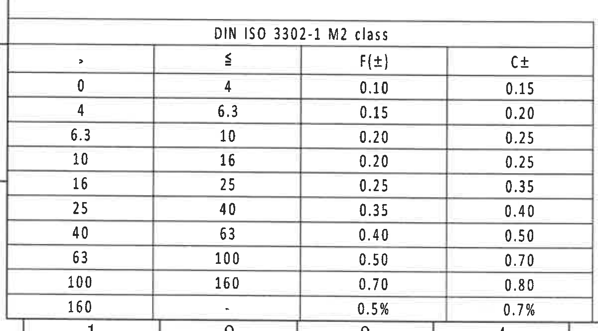

- 原图位置/视图名称: 原图 K-L 区域左下公差表
- object_kind: table
- bbox: [350, 2700, 1550, 3365]

### 原表还原

| > | ≤ | F(±) | C± |
| --- | --- | --- | --- |
| 0 | 4 | 0.10 | 0.15 |
| 4 | 6.3 | 0.15 | 0.20 |
| 6.3 | 10 | 0.20 | 0.25 |
| 10 | 16 | 0.20 | 0.25 |
| 16 | 25 | 0.25 | 0.35 |
| 25 | 40 | 0.35 | 0.40 |
| 40 | 63 | 0.40 | 0.50 |
| 63 | 100 | 0.50 | 0.70 |
| 100 | 160 | 0.70 | 0.80 |
| 160 | - | 0.5% | 0.7% |

### 提取表格

| 提取项 | 原图数值或文本 | 含义说明 |
| --- | --- | --- |
| 表名 | DIN ISO 3302-1 M2 class | 橡胶尺寸一般公差等级表。 |
| 0 < 尺寸 ≤ 4 | F(±)=0.10；C±=0.15 | 尺寸区间对应公差。 |
| 4 < 尺寸 ≤ 6.3 | F(±)=0.15；C±=0.20 | 尺寸区间对应公差。 |
| 6.3 < 尺寸 ≤ 10 | F(±)=0.20；C±=0.25 | 尺寸区间对应公差。 |
| 10 < 尺寸 ≤ 16 | F(±)=0.20；C±=0.25 | 尺寸区间对应公差。 |
| 16 < 尺寸 ≤ 25 | F(±)=0.25；C±=0.35 | 尺寸区间对应公差。 |
| 25 < 尺寸 ≤ 40 | F(±)=0.35；C±=0.40 | 尺寸区间对应公差。 |
| 40 < 尺寸 ≤ 63 | F(±)=0.40；C±=0.50 | 尺寸区间对应公差。 |
| 63 < 尺寸 ≤ 100 | F(±)=0.50；C±=0.70 | 尺寸区间对应公差。 |
| 100 < 尺寸 ≤ 160 | F(±)=0.70；C±=0.80 | 尺寸区间对应公差。 |
| 160 < 尺寸 | F(±)=0.5%；C±=0.7% | 超过 160 的百分比公差。 |

### 边界归属说明

裁切只包含 DIN 公差表；上方正视图和右侧参考清单不归入本对象。

## object_14 - Reference 参考标准清单

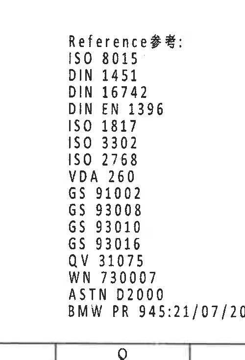

- 原图位置/视图名称: 原图 J-L 区域中下参考标准清单
- object_kind: notes
- bbox: [2200, 2650, 2700, 3385]

### 原文转录

```text
Reference参考:
ISO 8015
DIN 1451
DIN 16742
DIN EN 1396
ISO 1817
ISO 3302
ISO 2768
VDA 260
GS 91002
GS 93008
GS 93010
GS 93016
QV 31075
WN 730007
ASTN D2000
BMW PR 945:21/07/2021
```

### 提取表格

| 提取项 | 原图数值或文本 | 含义说明 |
| --- | --- | --- |
| 参考标准 1 | ISO 8015 | 原图参考标准清单条目。 |
| 参考标准 2 | DIN 1451 | 原图参考标准清单条目。 |
| 参考标准 3 | DIN 16742 | 原图参考标准清单条目。 |
| 参考标准 4 | DIN EN 1396 | 原图参考标准清单条目。 |
| 参考标准 5 | ISO 1817 | 原图参考标准清单条目。 |
| 参考标准 6 | ISO 3302 | 原图参考标准清单条目。 |
| 参考标准 7 | ISO 2768 | 原图参考标准清单条目。 |
| 参考标准 8 | VDA 260 | 原图参考标准清单条目。 |
| 参考标准 9 | GS 91002 | 原图参考标准清单条目。 |
| 参考标准 10 | GS 93008 | 原图参考标准清单条目。 |
| 参考标准 11 | GS 93010 | 原图参考标准清单条目。 |
| 参考标准 12 | GS 93016 | 原图参考标准清单条目。 |
| 参考标准 13 | QV 31075 | 原图参考标准清单条目。 |
| 参考标准 14 | WN 730007 | 原图参考标准清单条目。 |
| 参考标准 15 | ASTN D2000 | 原图参考标准清单条目。 |
| 参考标准 16 | BMW PR 945:21/07/2021 | 原图参考标准清单条目。 |

### 边界归属说明

裁切只包含参考清单文字；左侧等轴图和右侧标题栏表格不归入本对象。

## object_15 - 标题栏

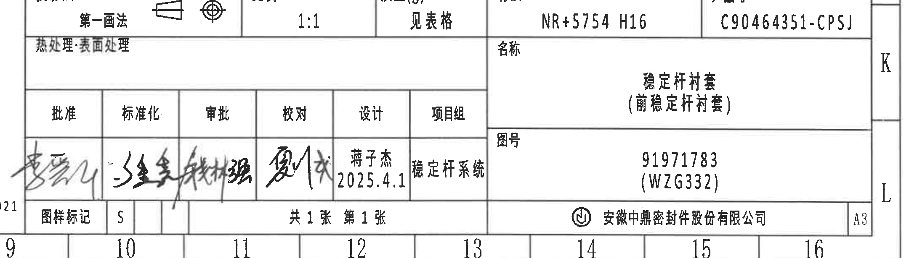

- 原图位置/视图名称: 原图 J-L 区域右下标题栏
- object_kind: title_block
- bbox: [2700, 2795, 4860, 3410]

### 原表还原

| 字段 | 原图文本 |
| --- | --- |
| 投影法 | 第一画法 |
| 比例 | 1:1 |
| 质量(g) | 见表格 |
| 材质 | NR+5754 H16 |
| 产品号 | C90464351-CPSJ |
| 热处理-表面处理 |  |
| 名称 | 稳定杆衬套（前稳定杆衬套） |
| 图号 | 91971783 (WZG332) |
| 批准/标准化/审批/校对 | 签名栏 |
| 设计 | 蒋子杰 2025.4.1 |
| 项目组 | 稳定杆系统 |
| 图样标记 | S |
| 页数 | 共1张 第1张 |
| 公司 | 安徽中鼎密封件股份有限公司 |
| 图幅 | A3 |

### 提取表格

| 提取项 | 原图数值或文本 | 含义说明 |
| --- | --- | --- |
| 投影法 | 第一画法 | 标题栏投影方法。 |
| 比例 | 1:1 | 图纸比例。 |
| 质量(g) | 见表格 | 重量数据引用表格。 |
| 材质 | NR+5754 H16 | 标题栏材料总述。 |
| 产品号 | C90464351-CPSJ | 标题栏产品号。 |
| 名称 | 稳定杆衬套（前稳定杆衬套） | 零件名称。 |
| 图号 | 91971783 (WZG332) | 标题栏图号。 |
| 设计 | 蒋子杰 2025.4.1 | 设计人和日期。 |
| 项目组 | 稳定杆系统 | 项目组名称。 |
| 图样标记 | S | 图样标记字段。 |
| 页数 | 共1张 第1张 | 图纸页数。 |
| 图幅 | A3 | 图纸幅面。 |
| 公司 | 安徽中鼎密封件股份有限公司 | 标题栏公司名称。 |

### 边界归属说明

裁切包含右下标题栏和签字区；左侧参考清单、上方 BOM 明细表不归入标题栏内容。

## 裁切检查记录

| 对象 | 名称 | bbox | 完整性检查 | 归属/重裁说明 |
| --- | --- | --- | --- | --- |
| object_1 | Durability test 表 | [365, 170, 1980, 880] | 表格上下左右边线、表头、合并行文字均完整；未带入刚度目标表。 | 裁切只包含耐久试验表外框；下方 D 行参数表被排除，右侧刚度目标表不归入本对象。 |
| object_2 | 修订履历表 | [2500, 170, 4860, 565] | 表头和首条修订记录完整；空白行边线完整。 | 裁切只包含右上修订履历表；未包含下方刚度目标表。 |
| object_3 | Stiffness targets 表 | [1970, 555, 3225, 880] | 表头、三行数据和右侧 Precycles 列完整。 | 裁切只包含刚度目标表；左侧耐久表末尾、下方 D 行参数表均不归入本对象。 |
| object_4 | 变体/材料/关键参数表 | [365, 880, 4215, 1235] | 表头、子表头和 E 变体整行数据完整；未把下方视图尺寸线计入表格内容。 | 裁切沿 D 行参数表上下边线截取；下方视图的竖向尺寸线被排除。 |
| object_5 | 上部主视图 / 半圆正视图 | [555, 1190, 1740, 1865] | R28.5、R23.75、(1.2)、(0.5)、ØE±0.3、A-A 剖切箭头和文字完整；右缘相邻视图片段未提取。 | 右侧为保留 Material code 引线末端而带入相邻侧视图极窄轮廓片段；该片段不归入本视图，不提取其尺寸或形状。下方跨视图标记说明另列为 object_16。 |
| object_6 | 上部侧视/标识视图 | [1570, 1190, 2400, 1650] | 侧视轮廓、虚线和 E 标识完整；无尺寸文字被截断。 | 裁切只包含侧视轮廓和 E 标识；左侧主视图、右侧 A-A 剖面均不纳入本对象。跨视图文字说明单独归 object_16。 |
| object_16 | 跨视图标记说明 | [1335, 1585, 2825, 1890] | 两组英文/中文说明和引线完整；右侧 NOTES 文字未纳入提取内容。 | 该说明文字横跨主视图、侧视图和 A-A 剖面之间，单独裁切避免归错到任何单一视图。右侧 NOTES 开头未作为本对象提取。 |
| object_7 | 剖面 A-A | [2450, 1120, 3530, 1695] | A-A 标题、剖面轮廓、(B)、T2、T1、24.45、29.2、序号 1/2 引线完整。 | 右侧竖向尺寸线靠近相邻局部剖视图边界，裁切向右保留完整 29.2±0.3 尺寸文字和箭头；相邻局部剖视图的 RAR/RIR 不归入本剖面。下方跨视图说明不作为本对象内容。 |
| object_8 | 右侧局部剖视图 | [3400, 1170, 4670, 1900] | RAR/RIR 引线、E Ø25.8-2 弧形标注、(1) 和稳定杆杆径说明完整；左缘残留不提取。 | 左边缘可见 A-A 剖面最外侧尺寸的一小段残留，仅为边界邻近痕迹；29.2±0.3 已归入 object_7，不在本局部视图重复提取。 |
| object_9 | 下部正视图 | [430, 1950, 1850, 2665] | 40±0.3、47.5±0.3、56.99±0.3 尺寸线、箭头和文字完整。 | 裁切包含该正视图完整轮廓、上下宽度尺寸和右侧高度尺寸；底部 DIN 表已排除，右侧等轴图不归入本对象。 |
| object_10 | 等轴测视图 | [1640, 1990, 2750, 2720] | 等轴测轮廓和标识完整；无尺寸文字被截断。 | 裁切只包含等轴测产品图；右侧 NOTES、下方参考清单和标题栏未纳入本对象。 |
| object_11 | Specification 技术要求 / NOTES | [2700, 1750, 4860, 2405] | 8 条中英文技术要求完整；底部 BOM 标题栏未作为 NOTES 内容提取。 | 裁切只包含技术要求 1-8 条；上方局部剖视图说明和下方 BOM 表不归入本对象。 |
| object_12 | BOM / 明细表 | [2700, 2400, 4860, 2820] | BOM 表头、两行明细和代用说明完整。 | 裁切包含 BOM 明细和其上方代用说明；下方标题栏字段另归 object_15。 |
| object_13 | DIN ISO 3302-1 M2 class 公差表 | [350, 2700, 1550, 3365] | 表名、列头和 10 行公差数据完整。 | 裁切只包含 DIN 公差表；上方正视图和右侧参考清单不归入本对象。 |
| object_14 | Reference 参考标准清单 | [2200, 2650, 2700, 3385] | 参考清单从 ISO 8015 到 BMW PR 945:21/07/2021 均完整。 | 裁切只包含参考清单文字；左侧等轴图和右侧标题栏表格不归入本对象。 |
| object_15 | 标题栏 | [2700, 2795, 4860, 3410] | 主要标题栏字段、签名区、页数和公司名称完整。 | 裁切包含右下标题栏和签字区；左侧参考清单、上方 BOM 明细表不归入标题栏内容。 |

## 总体说明

- 本页未见星号关键尺寸；圆角框/圆圈标识按 NOTE 8 识别为出厂检验尺寸，已逐项提取。
- 括号内尺寸如 `(1.2)`、`(0.5)`、`(B)`、`(1)`、`(RAR)`、`(RIR)` 均保留并按参考尺寸/参考代号说明，没有因参考属性省略。
- 靠近边界的 `29.2±0.3` 归属 A-A 剖面 object_7；右侧局部剖视图 object_8 左缘残留不重复提取。
- 跨视图标记说明单独作为 object_16，避免归入主视图、侧视图或 A-A 剖面。