# 20C90464651.pdf 内容识别结果

- 源文件：`input/20C90464651.pdf`
- 整页渲染图：`outputs/20C90464651_assets/images/page_1.png`，尺寸 4959 x 3505 px
- 裁切对象：加工视图、剖面视图、局部视图、表格、NOTES、标题栏。

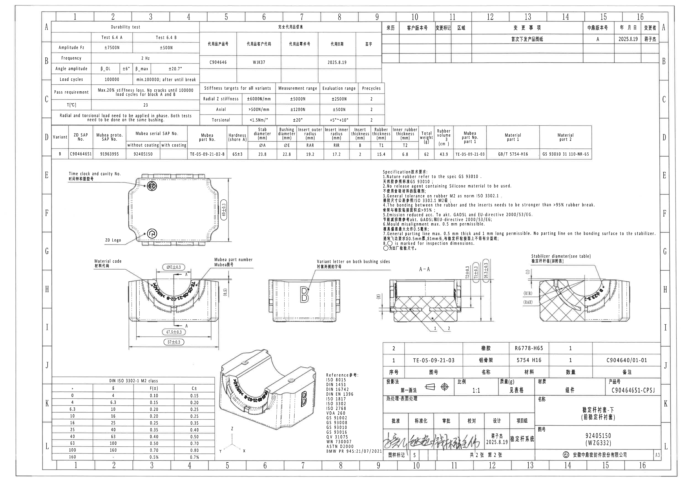

## object_1 - Durability test 表

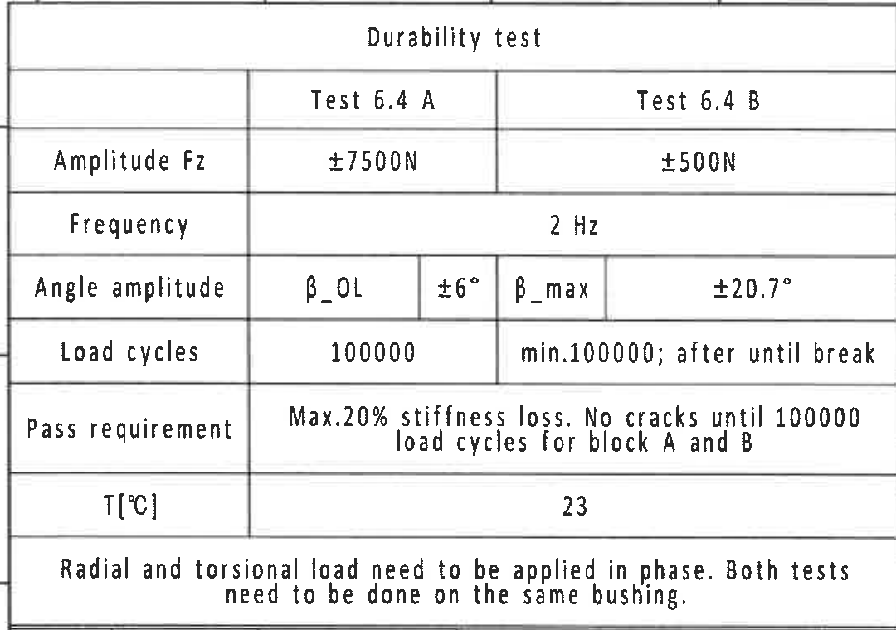

- 原图位置/视图名称：Durability test 表，page 1，bbox `[360, 150, 1440, 910]`。
- object_kind：`table`。

原表格还原：

| 项目 | Test 6.4 A | Test 6.4 B |
|---|---:|---:|
| Amplitude Fz | ±7500N | ±500N |
| Frequency | 2 Hz | 2 Hz |
| Angle amplitude | β_OL / ±6° | β_max / ±20.7° |
| Load cycles | 100000 | min.100000; after until break |
| Pass requirement | Max.20% stiffness loss. No cracks until 100000 load cycles for block A and B | Max.20% stiffness loss. No cracks until 100000 load cycles for block A and B |
| T[℃] | 23 | 23 |
| 说明 | Radial and torsional load need to be applied in phase. Both tests need to be done on the same bushing. | Radial and torsional load need to be applied in phase. Both tests need to be done on the same bushing. |

提取表格：

| 提取项 | 原图数值或文本 | 含义说明 |
|---|---|---|
| 表题 | Durability test | 耐久试验条件表。 |
| Amplitude Fz / Test 6.4 A | ±7500N | Test 6.4 A 的 Fz 振幅载荷。 |
| Amplitude Fz / Test 6.4 B | ±500N | Test 6.4 B 的 Fz 振幅载荷。 |
| Frequency | 2 Hz | 试验频率，A/B 共用。 |
| Angle amplitude / β_OL | ±6° | β_OL 角振幅。 |
| Angle amplitude / β_max | ±20.7° | β_max 角振幅。 |
| Load cycles / Test 6.4 A | 100000 | A 块试验循环次数。 |
| Load cycles / Test 6.4 B | min.100000; after until break | B 块至少 100000 次，之后至破坏。 |
| Pass requirement | Max.20% stiffness loss. No cracks until 100000 load cycles for block A and B | 合格要求：刚度损失最大 20%，A/B 到 100000 循环前无裂纹。 |
| T[℃] | 23 | 试验温度。 |
| 底部说明 | Radial and torsional load need to be applied in phase. Both tests need to be done on the same bushing. | 径向和扭转载荷需同相施加，两项试验在同一衬套上完成。 |

边界归属说明：边界归属：裁切包含耐久试验表完整外框、全部行列和底部说明；顶部少量图框坐标线不作为表格内容提取。

## object_2 - 完全代用品信息表

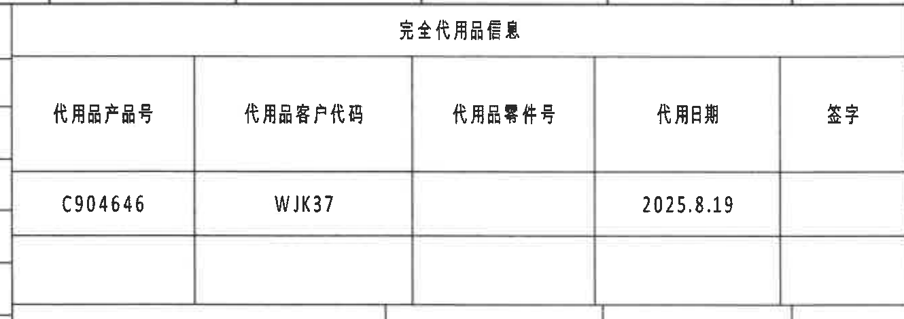

- 原图位置/视图名称：完全代用品信息表，page 1，bbox `[1425, 150, 2755, 620]`。
- object_kind：`table`。

原表格还原：

| 代用品产品号 | 代用品客户代码 | 代用品零件号 | 代用日期 | 签字 |
|---|---|---|---|---|
| C904646 | WJK37 |  | 2025.8.19 |  |

提取表格：

| 提取项 | 原图数值或文本 | 含义说明 |
|---|---|---|
| 表题 | 完全代用品信息 | 代用品信息表标题。 |
| 代用品产品号 | C904646 | 替代产品编号。 |
| 代用品客户代码 | WJK37 | 替代产品对应客户代码。 |
| 代用品零件号 |  | 原图该单元为空。 |
| 代用日期 | 2025.8.19 | 替代信息日期。 |
| 签字 |  | 原图该单元为空。 |

边界归属说明：边界归属：裁切覆盖完全代用品信息表完整表头、数据行和空白签字列；右侧外框完整，未提取相邻变更履历内容。

## object_3 - 变更履历表

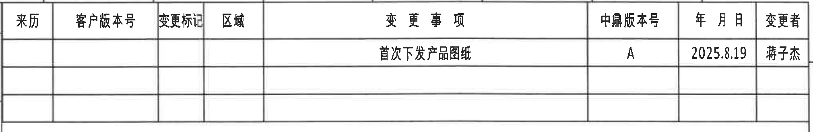

- 原图位置/视图名称：变更履历表，page 1，bbox `[2755, 150, 4775, 480]`。
- object_kind：`table`。

原表格还原：

| 来历 | 客户版本号 | 变更标记 | 区域 | 变更事项 | 中鼎版本号 | 年月日 | 变更者 |
|---|---|---|---|---|---|---|---|
|  |  |  |  | 首次下发产品图纸 | A | 2025.8.19 | 蒋子杰 |

提取表格：

| 提取项 | 原图数值或文本 | 含义说明 |
|---|---|---|
| 表头 | 来历 / 客户版本号 / 变更标记 / 区域 / 变更事项 / 中鼎版本号 / 年月日 / 变更者 | 修订履历列名。 |
| 变更事项 | 首次下发产品图纸 | 本次发布说明。 |
| 中鼎版本号 | A | 中鼎内部版本号。 |
| 年月日 | 2025.8.19 | 变更日期。 |
| 变更者 | 蒋子杰 | 变更执行人。 |
| 来历/客户版本号/变更标记/区域 | 空白 | 原图对应单元为空。 |

边界归属说明：边界归属：裁切只包含右上角变更履历表；表格下方空白行保留，未纳入页面空白区说明。

## object_4 - Stiffness targets for all variants 表

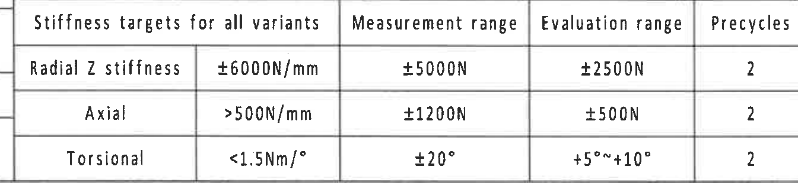

- 原图位置/视图名称：Stiffness targets for all variants 表，page 1，bbox `[1420, 600, 2765, 910]`。
- object_kind：`table`。

原表格还原：

| Stiffness targets for all variants | 目标值 | Measurement range | Evaluation range | Precycles |
|---|---|---|---|---:|
| Radial Z stiffness | ±6000N/mm | ±5000N | ±2500N | 2 |
| Axial | >500N/mm | ±1200N | ±500N | 2 |
| Torsional | <1.5Nm/° | ±20° | +5°~+10° | 2 |

提取表格：

| 提取项 | 原图数值或文本 | 含义说明 |
|---|---|---|
| Radial Z stiffness | ±6000N/mm; Measurement range ±5000N; Evaluation range ±2500N; Precycles 2 | 径向 Z 刚度目标、测量范围、评价范围和预循环次数。 |
| Axial | >500N/mm; Measurement range ±1200N; Evaluation range ±500N; Precycles 2 | 轴向刚度目标、测量范围、评价范围和预循环次数。 |
| Torsional | <1.5Nm/°; Measurement range ±20°; Evaluation range +5°~+10°; Precycles 2 | 扭转刚度目标、测量角度范围、评价角度范围和预循环次数。 |

边界归属说明：边界归属：裁切包含刚度目标表所有行列；左上外框贴边但文字和分隔线完整。

## object_5 - 零件参数横表

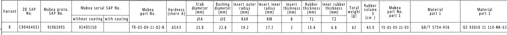

- 原图位置/视图名称：零件参数横表，page 1，bbox `[360, 905, 4260, 1175]`。
- object_kind：`table`。

原表格还原：

| Variant | ZD SAP No. | Mubea proto. SAP No. | Mubea serial SAP No. without coating | Mubea serial SAP No. with coating | Mubea part No. | Hardness (shore A) | Stab diameter ØA (mm) | Bushing diameter ØE (mm) | Insert outer radius RAR (mm) | Insert inner radius RIR (mm) | Insert thickness B (mm) | Rubber thickness T1 (mm) | Inner rubber thickness T2 (mm) | Total weight (g) | Rubber volume (cm³) | Mubea part No. part 1 | Material part 1 | Material part 2 |
|---|---|---|---|---|---|---|---|---|---|---|---|---|---|---|---|---|---|---|
| B | C90464651 | 91963995 | 92405150 |  | TE-05-09-21-02-B | 65±3 | 23.8 | 22.8 | 19.2 | 17.2 | 2 | 15.4 | 6.8 | 62 | 43.9 | TE-05-09-21-03 | GB/T 5754-H16 | GS 93010 31 110-NR-65 |

提取表格：

| 提取项 | 原图数值或文本 | 含义说明 |
|---|---|---|
| Variant | B | 零件参数横表中的字段；其中 ØA/ØE/RAR/RIR/B/T1/T2 为后续视图中变量尺寸的表格名义值。 |
| ZD SAP No. | C90464651 | 零件参数横表中的字段；其中 ØA/ØE/RAR/RIR/B/T1/T2 为后续视图中变量尺寸的表格名义值。 |
| Mubea proto. SAP No. | 91963995 | 零件参数横表中的字段；其中 ØA/ØE/RAR/RIR/B/T1/T2 为后续视图中变量尺寸的表格名义值。 |
| Mubea serial SAP No. without coating | 92405150 | 零件参数横表中的字段；其中 ØA/ØE/RAR/RIR/B/T1/T2 为后续视图中变量尺寸的表格名义值。 |
| Mubea serial SAP No. with coating |  | 零件参数横表中的字段；其中 ØA/ØE/RAR/RIR/B/T1/T2 为后续视图中变量尺寸的表格名义值。 |
| Mubea part No. | TE-05-09-21-02-B | 零件参数横表中的字段；其中 ØA/ØE/RAR/RIR/B/T1/T2 为后续视图中变量尺寸的表格名义值。 |
| Hardness (shore A) | 65±3 | 零件参数横表中的字段；其中 ØA/ØE/RAR/RIR/B/T1/T2 为后续视图中变量尺寸的表格名义值。 |
| Stab diameter ØA (mm) | 23.8 | 零件参数横表中的字段；其中 ØA/ØE/RAR/RIR/B/T1/T2 为后续视图中变量尺寸的表格名义值。 |
| Bushing diameter ØE (mm) | 22.8 | 零件参数横表中的字段；其中 ØA/ØE/RAR/RIR/B/T1/T2 为后续视图中变量尺寸的表格名义值。 |
| Insert outer radius RAR (mm) | 19.2 | 零件参数横表中的字段；其中 ØA/ØE/RAR/RIR/B/T1/T2 为后续视图中变量尺寸的表格名义值。 |
| Insert inner radius RIR (mm) | 17.2 | 零件参数横表中的字段；其中 ØA/ØE/RAR/RIR/B/T1/T2 为后续视图中变量尺寸的表格名义值。 |
| Insert thickness B (mm) | 2 | 零件参数横表中的字段；其中 ØA/ØE/RAR/RIR/B/T1/T2 为后续视图中变量尺寸的表格名义值。 |
| Rubber thickness T1 (mm) | 15.4 | 零件参数横表中的字段；其中 ØA/ØE/RAR/RIR/B/T1/T2 为后续视图中变量尺寸的表格名义值。 |
| Inner rubber thickness T2 (mm) | 6.8 | 零件参数横表中的字段；其中 ØA/ØE/RAR/RIR/B/T1/T2 为后续视图中变量尺寸的表格名义值。 |
| Total weight (g) | 62 | 零件参数横表中的字段；其中 ØA/ØE/RAR/RIR/B/T1/T2 为后续视图中变量尺寸的表格名义值。 |
| Rubber volume (cm³) | 43.9 | 零件参数横表中的字段；其中 ØA/ØE/RAR/RIR/B/T1/T2 为后续视图中变量尺寸的表格名义值。 |
| Mubea part No. part 1 | TE-05-09-21-03 | 零件参数横表中的字段；其中 ØA/ØE/RAR/RIR/B/T1/T2 为后续视图中变量尺寸的表格名义值。 |
| Material part 1 | GB/T 5754-H16 | 零件参数横表中的字段；其中 ØA/ØE/RAR/RIR/B/T1/T2 为后续视图中变量尺寸的表格名义值。 |
| Material part 2 | GS 93010 31 110-NR-65 | 零件参数横表中的字段；其中 ØA/ØE/RAR/RIR/B/T1/T2 为后续视图中变量尺寸的表格名义值。 |

边界归属说明：边界归属：裁切覆盖横向参数表完整数据行；该表紧邻上方刚度表和下方视图区，裁切仅提取表格内字段，未把下方视图标注归入表格。

## object_6 - 俯视标识视图

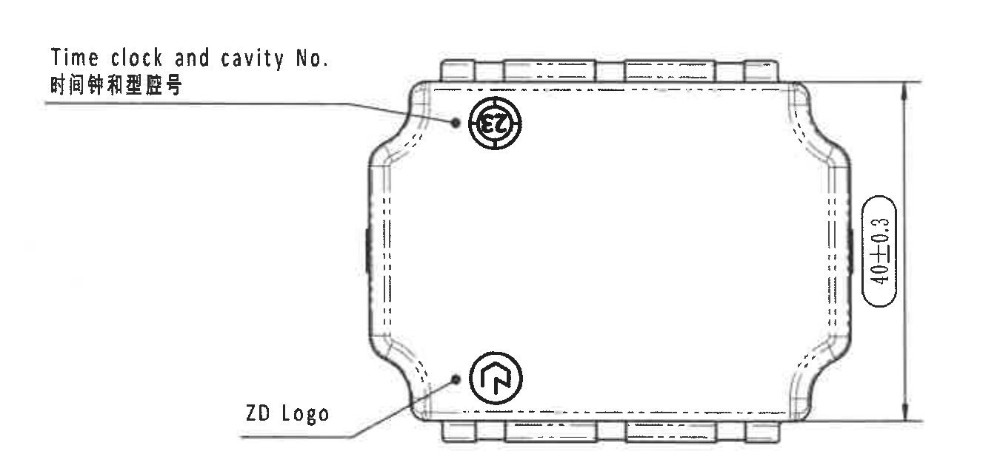

- 原图位置/视图名称：俯视标识视图，page 1，bbox `[430, 1180, 1780, 1790]`。
- object_kind：`view`。

提取表格：

| 提取项 | 原图数值或文本 | 含义说明 |
|---|---|---|
| 视图名称/位置 | 俯视标识视图，图纸 E-F/G 区左侧 | 显示上表面形状、时间钟/型腔号位置和 ZD Logo 位置。 |
| Time clock and cavity No. / 时间钟和型腔号 | 引出到上表面圆形时钟标记 | 规定时间钟和型腔号标识的位置。 |
| ZD Logo | 引出到下部圆形 ZD 标识 | 规定 ZD 标识位置。 |
| 总高度/外形尺寸 | 40±0.3 | 俯视图右侧竖向总尺寸，公差 ±0.3；外形高度方向尺寸。 |

边界归属说明：边界归属：裁切包含俯视图外形、两条引出线和 40±0.3 完整尺寸线；未带入下方主视图文字。

## object_7 - 正视主加工视图

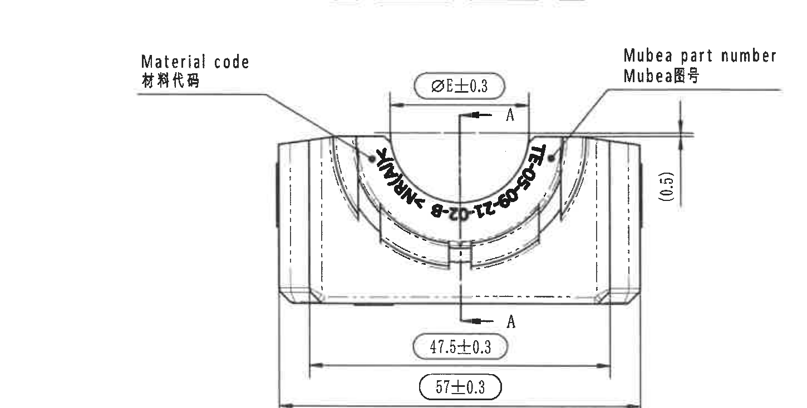

- 原图位置/视图名称：正视主加工视图，page 1，bbox `[430, 1780, 1880, 2515]`。
- object_kind：`view`。

提取表格：

| 提取项 | 原图数值或文本 | 含义说明 |
|---|---|---|
| 视图名称/位置 | 正视主加工视图，图纸 G-I 区左侧 | 显示衬套正面轮廓、中心槽和剖切 A-A 位置。 |
| Material code / 材料代码 | 引出至左侧弧面文字区域 | 材料代码标识位置。 |
| Mubea part number / Mubea图号 | 引出至右侧弧面文字区域 | Mubea 图号标识位置。 |
| 直径变量 | ØE±0.3；表格 ØE=22.8 | 衬套孔径/衬套直径变量 E，名义值由参数表给出为 22.8 mm，图中给出 ±0.3 公差。 |
| 参考尺寸 | (0.5) | 括号尺寸，位于右侧竖向小尺寸处；作为参考/说明尺寸，不作为主控尺寸。 |
| 剖切基准 | A / A | 上下箭头标出剖切位置，对应剖面 A-A。 |
| 宽度尺寸 | 47.5±0.3 | 内侧/中间宽度尺寸，带 ±0.3 公差，并以圆角框标注为出厂检验尺寸。 |
| 总宽度尺寸 | 57±0.3 | 底部外形总宽度尺寸，带 ±0.3 公差，并以圆角框标注为出厂检验尺寸。 |
| 弧向标识 | TE-05-09-21-02-B - NR(W)K（弧向文字） | 沿内弧排布的件号/材料标识；与参数表 Mubea part No. TE-05-09-21-02-B 对应。 |

边界归属说明：边界归属：裁切保留主视图全部尺寸线、箭头、剖切 A/A 和引出文字；底部只保留 57±0.3 尺寸线所需空间，不提取下方等轴测图内容。

## object_8 - 侧视标识视图

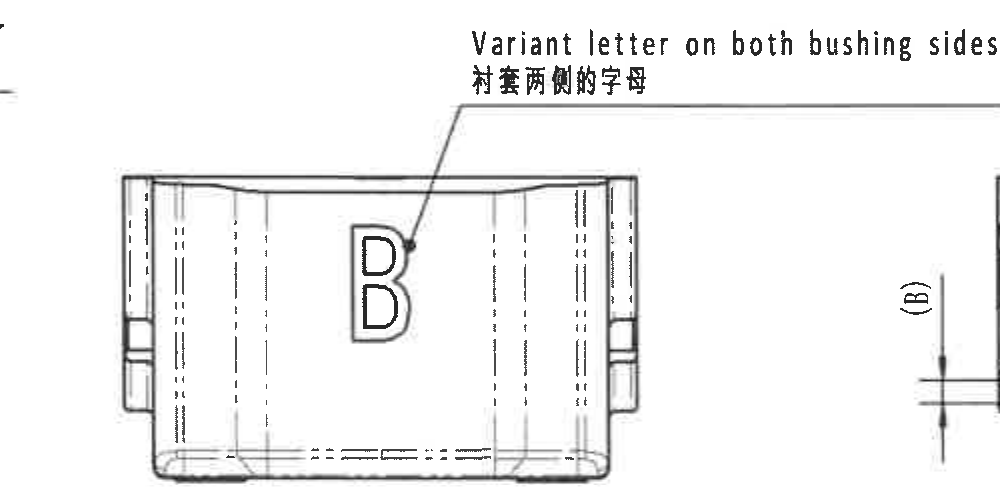

- 原图位置/视图名称：侧视标识视图，page 1，bbox `[1820, 1850, 2820, 2350]`。
- object_kind：`view`。

提取表格：

| 提取项 | 原图数值或文本 | 含义说明 |
|---|---|---|
| 视图名称/位置 | 侧视标识视图，图纸 H-I 区中部 | 显示衬套侧面轮廓和两侧字母位置。 |
| Variant letter on both bushing sides / 衬套两侧的字母 | B | 变体字母 B 标在衬套两侧；与参数表 Variant=B 对应。 |

边界归属说明：边界归属：为保留完整英文标签，右侧裁切边缘带入 A-A 视图的 (B) 尺寸片段；该片段不属于侧视图，未在本对象提取。

## object_9 - 剖面 A-A

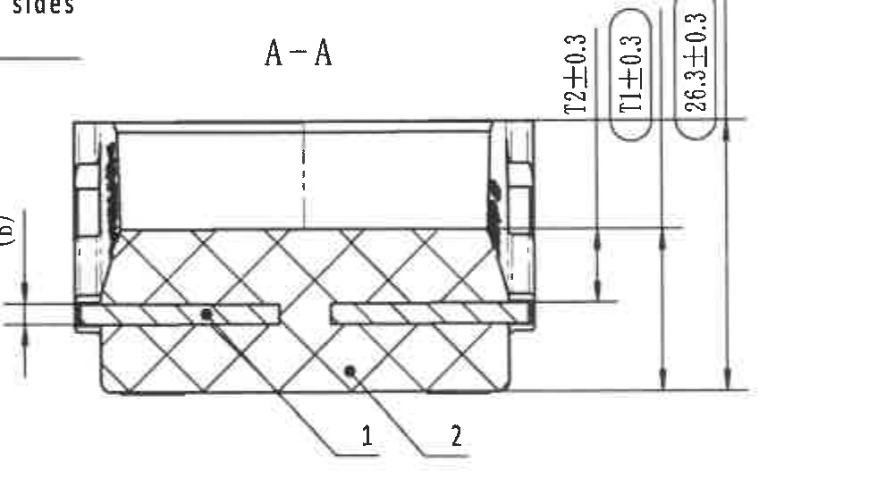

- 原图位置/视图名称：剖面 A-A，page 1，bbox `[2735, 1890, 3735, 2435]`。
- object_kind：`section`。

提取表格：

| 提取项 | 原图数值或文本 | 含义说明 |
|---|---|---|
| 视图名称/位置 | 剖面 A-A，图纸 H-I 区中右 | 对应主视图中的 A/A 剖切位置。 |
| 剖面标识 | A-A | 剖面视图名称。 |
| 参考/变量尺寸 | (B)；表格 B=2 | 左侧括号内变量尺寸，表格中 Insert thickness B=2 mm；括号表示参考/变量引用。 |
| 竖向尺寸 | 12±0.3 | 剖面右侧竖向尺寸，公差 ±0.3。 |
| 变量尺寸 | T1±0.3；表格 T1=15.4 | 橡胶厚度变量 T1，名义值由参数表给出为 15.4 mm，图中给出 ±0.3 公差；圆角框标注为检验尺寸。 |
| 总高度尺寸 | 26.3±0.3 | 剖面右侧最大竖向高度尺寸，公差 ±0.3；圆角框标注为检验尺寸。 |
| 零件指引 | 1 / 2 | 剖面中的引出编号，对应明细表 1 铝骨架、2 橡胶。 |

边界归属说明：边界归属：裁切保留 A-A 剖面主体、左侧 (B) 尺寸、右侧三条竖向尺寸线和 1/2 指引；左上少量相邻侧视图文字残片不属于 A-A，未提取。

## object_10 - 局部剖视图

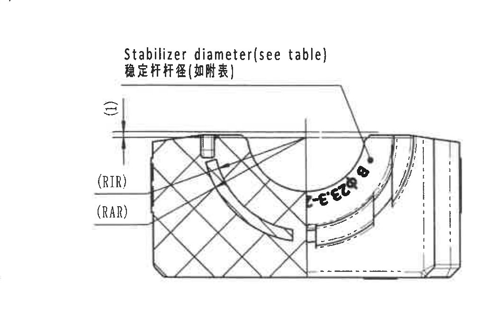

- 原图位置/视图名称：局部剖视图，page 1，bbox `[3580, 1740, 4640, 2440]`。
- object_kind：`detail`。

提取表格：

| 提取项 | 原图数值或文本 | 含义说明 |
|---|---|---|
| 视图名称/位置 | 局部剖视图，图纸 G-I 区右侧 | 显示稳定杆直径、内外半径变量和局部剖切结构。 |
| Stabilizer diameter(see table) / 稳定杆杆径(如附表) | ØA；表格 ØA=23.8 | 稳定杆直径由参数表给出，名义值 23.8 mm。 |
| 参考尺寸 | (1) | 左侧竖向括号尺寸，表示局部结构参考/编号尺寸。 |
| Insert inner radius | (RIR)；表格 RIR=17.2 | 内半径变量 RIR，由参数表给出 17.2 mm。 |
| Insert outer radius | (RAR)；表格 RAR=19.2 | 外半径变量 RAR，由参数表给出 19.2 mm。 |
| 弧向标识 | 可见 ...02-B... 弧向件号片段 | 沿弧面布置的件号/标识片段，与主视图弧向件号同属该零件标识。 |

边界归属说明：边界归属：裁切只提取局部剖视图内的 Stabilizer diameter、(1)、(RIR)、(RAR) 和弧向标识；左上极小残点和周边空白不作为内容。

## object_11 - Specification 技术要求 NOTES

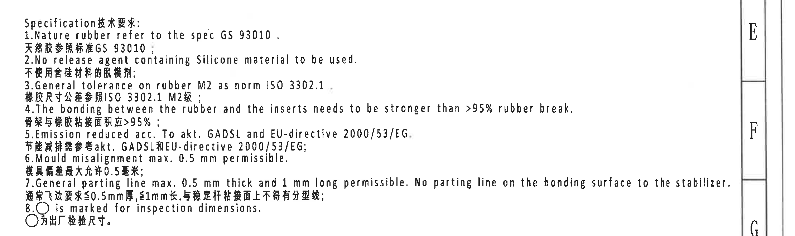

- 原图位置/视图名称：Specification 技术要求 NOTES，page 1，bbox `[2700, 1180, 4920, 1840]`。
- object_kind：`notes`。

提取表格：

| 提取项 | 原图数值或文本 | 含义说明 |
|---|---|---|
| NOTES 行 1 | Specification技术要求: | 技术要求/注释文本，按原图顺序还原。 |
| NOTES 行 2 | 1.Nature rubber refer to the spec GS 93010 . | 技术要求/注释文本，按原图顺序还原。 |
| NOTES 行 3 | 天然胶参照标准GS 93010； | 技术要求/注释文本，按原图顺序还原。 |
| NOTES 行 4 | 2.No release agent containing Silicone material to be used. | 技术要求/注释文本，按原图顺序还原。 |
| NOTES 行 5 | 不使用含硅材料的脱模剂； | 技术要求/注释文本，按原图顺序还原。 |
| NOTES 行 6 | 3.General tolerance on rubber M2 as norm ISO 3302.1 | 技术要求/注释文本，按原图顺序还原。 |
| NOTES 行 7 | 橡胶尺寸公差参照ISO 3302.1 M2级； | 技术要求/注释文本，按原图顺序还原。 |
| NOTES 行 8 | 4.The bonding between the rubber and the inserts needs to be stronger than >95% rubber break. | 技术要求/注释文本，按原图顺序还原。 |
| NOTES 行 9 | 骨架与橡胶粘接面积应>95%； | 技术要求/注释文本，按原图顺序还原。 |
| NOTES 行 10 | 5.Emission reduced acc. To akt. GADSL and EU-directive 2000/53/EG. | 技术要求/注释文本，按原图顺序还原。 |
| NOTES 行 11 | 节能减排需参考akt. GADSL和EU-directive 2000/53/EG； | 技术要求/注释文本，按原图顺序还原。 |
| NOTES 行 12 | 6.Mould misalignment max. 0.5 mm permissible. | 技术要求/注释文本，按原图顺序还原。 |
| NOTES 行 13 | 模具偏差最大允许0.5毫米； | 技术要求/注释文本，按原图顺序还原。 |
| NOTES 行 14 | 7.General parting line max. 0.5 mm thick and 1 mm long permissible. No parting line on the bonding surface to the stabilizer. | 技术要求/注释文本，按原图顺序还原。 |
| NOTES 行 15 | 通常飞边要求≤0.5mm厚,≤1mm长,与稳定杆粘接面上不得有分型线； | 技术要求/注释文本，按原图顺序还原。 |
| NOTES 行 16 | 8.○ is marked for inspection dimensions. | 技术要求/注释文本，按原图顺序还原。 |
| NOTES 行 17 | ○为出厂检验尺寸。 | 技术要求/注释文本，按原图顺序还原。 |

边界归属说明：边界归属：为保留第 7 条英文长句完整，右侧带入图框坐标列 E/F/G；该图框列不是 NOTES 内容，未作为文本字段提取。

## object_12 - DIN ISO 3302-1 M2 class 公差表

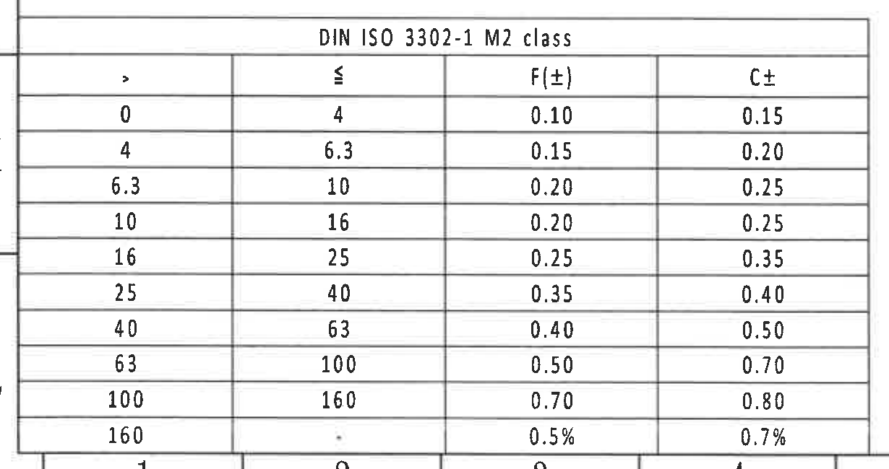

- 原图位置/视图名称：DIN ISO 3302-1 M2 class 公差表，page 1，bbox `[350, 2705, 1580, 3355]`。
- object_kind：`table`。

原表格还原：

| DIN ISO 3302-1 M2 class: > | ≤ | F(±) | C± |
|---:|---:|---:|---:|
| 0 | 4 | 0.10 | 0.15 |
| 4 | 6.3 | 0.15 | 0.20 |
| 6.3 | 10 | 0.20 | 0.25 |
| 10 | 16 | 0.20 | 0.25 |
| 16 | 25 | 0.25 | 0.35 |
| 25 | 40 | 0.35 | 0.40 |
| 40 | 63 | 0.40 | 0.50 |
| 63 | 100 | 0.50 | 0.70 |
| 100 | 160 | 0.70 | 0.80 |
| 160 |  | 0.5% | 0.7% |

提取表格：

| 提取项 | 原图数值或文本 | 含义说明 |
|---|---|---|
| 公差行 0-4 | > 0; ≤ 4; F(±) 0.10; C± 0.15 | DIN ISO 3302-1 M2 class 橡胶尺寸公差表。 |
| 公差行 4-6.3 | > 4; ≤ 6.3; F(±) 0.15; C± 0.20 | DIN ISO 3302-1 M2 class 橡胶尺寸公差表。 |
| 公差行 6.3-10 | > 6.3; ≤ 10; F(±) 0.20; C± 0.25 | DIN ISO 3302-1 M2 class 橡胶尺寸公差表。 |
| 公差行 10-16 | > 10; ≤ 16; F(±) 0.20; C± 0.25 | DIN ISO 3302-1 M2 class 橡胶尺寸公差表。 |
| 公差行 16-25 | > 16; ≤ 25; F(±) 0.25; C± 0.35 | DIN ISO 3302-1 M2 class 橡胶尺寸公差表。 |
| 公差行 25-40 | > 25; ≤ 40; F(±) 0.35; C± 0.40 | DIN ISO 3302-1 M2 class 橡胶尺寸公差表。 |
| 公差行 40-63 | > 40; ≤ 63; F(±) 0.40; C± 0.50 | DIN ISO 3302-1 M2 class 橡胶尺寸公差表。 |
| 公差行 63-100 | > 63; ≤ 100; F(±) 0.50; C± 0.70 | DIN ISO 3302-1 M2 class 橡胶尺寸公差表。 |
| 公差行 100-160 | > 100; ≤ 160; F(±) 0.70; C± 0.80 | DIN ISO 3302-1 M2 class 橡胶尺寸公差表。 |
| 公差行 160-以上 | > 160; ≤ 未标出; F(±) 0.5%; C± 0.7% | DIN ISO 3302-1 M2 class 橡胶尺寸公差表。 |

边界归属说明：边界归属：最后一行 160 / 0.5% / 0.7% 靠近图框底部，裁切保留完整文字和表线；底部少量图框坐标边缘不作为表格内容。

## object_13 - 等轴测视图

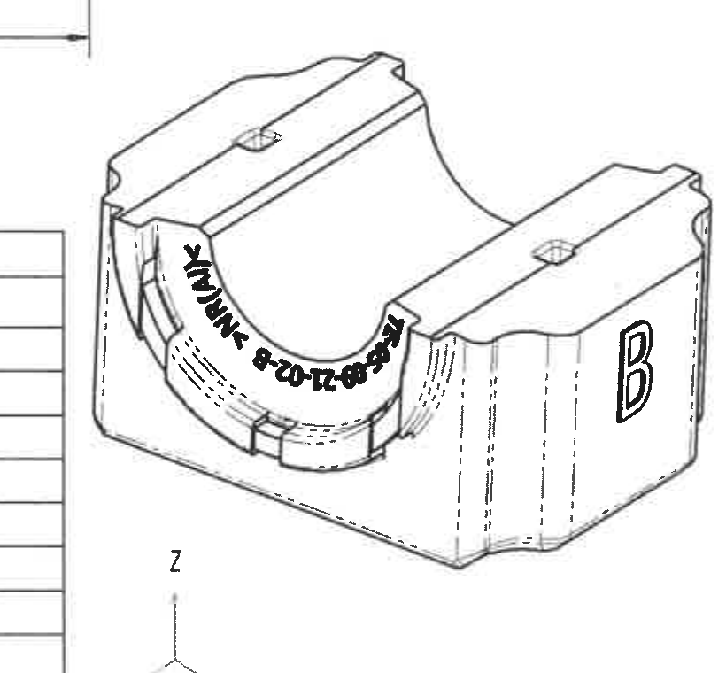

- 原图位置/视图名称：等轴测视图，page 1，bbox `[1480, 2470, 2300, 3230]`。
- object_kind：`view`。

提取表格：

| 提取项 | 原图数值或文本 | 含义说明 |
|---|---|---|
| 视图名称/位置 | 等轴测视图，图纸 J-L 区中部 | 展示零件三维形态和方向轴。 |
| 方向轴 | X / Y / Z | 图中左下方向坐标轴。 |
| 侧面字母 | B | 等轴测图右侧显示变体字母 B。 |
| 弧向标识 | TE-05-09-21-02-B - NR(W)K（弧向文字） | 沿弧面排布的件号/材料标识，与主视图一致。 |
| 尺寸说明 | 无新增尺寸值 | 该对象没有独立尺寸线；尺寸由主视图、剖面和参数表给出。 |

边界归属说明：边界归属：裁切保留等轴测零件和方向轴；左侧有 DIN 表格边缘残线，但无可提取尺寸，未归入本视图内容。

## object_14 - Reference 参考标准列表

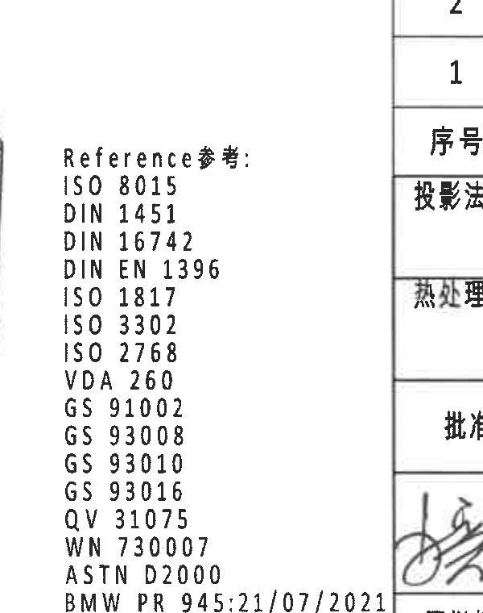

- 原图位置/视图名称：Reference 参考标准列表，page 1，bbox `[2280, 2520, 2880, 3280]`。
- object_kind：`notes`。

提取表格：

| 提取项 | 原图数值或文本 | 含义说明 |
|---|---|---|
| Reference参考 | ISO 8015 / DIN 1451 / DIN 16742 / DIN EN 1396 / ISO 1817 / ISO 3302 / ISO 2768 / VDA 260 / GS 91002 / GS 93008 / GS 93010 / GS 93016 / QV 31075 / WN 730007 / ASTM D2000 / BMW PR 945:21/07/2021 | 参考标准列表，按原图自上而下顺序还原。 |

边界归属说明：边界归属：为保留底部 BMW PR 945:21/07/2021 完整行，右侧带入标题栏边线和少量邻接区域；该邻接标题栏内容未在本对象提取。

## object_15 - 零件明细表

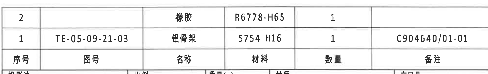

- 原图位置/视图名称：零件明细表，page 1，bbox `[2760, 2450, 4760, 2755]`。
- object_kind：`table`。

原表格还原：

| 序号 | 图号 | 名称 | 材料 | 数量 | 备注 |
|---:|---|---|---|---:|---|
| 2 |  | 橡胶 | R6778-H65 | 1 |  |
| 1 | TE-05-09-21-03 | 铝骨架 | 5754 H16 | 1 | C904640/01-01 |

提取表格：

| 提取项 | 原图数值或文本 | 含义说明 |
|---|---|---|
| 明细表表头 | 序号 / 图号 / 名称 / 材料 / 数量 / 备注 | 零件明细表列名。 |
| 序号 2 | 名称 橡胶; 材料 R6778-H65; 数量 1 | 橡胶件明细；图号和备注为空。 |
| 序号 1 | 图号 TE-05-09-21-03; 名称 铝骨架; 材料 5754 H16; 数量 1; 备注 C904640/01-01 | 铝骨架件明细。 |

边界归属说明：边界归属：裁切保留右下明细表两条数据和底部表头；下方标题栏共享边界未作为本对象字段提取。

## object_16 - 标题栏

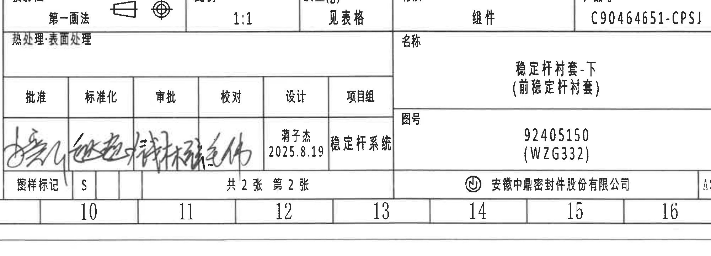

- 原图位置/视图名称：标题栏，page 1，bbox `[2760, 2775, 4760, 3495]`。
- object_kind：`title_block`。

原表格还原：

| 字段 | 原图文本 |
|---|---|
| 投影法 | 第一画法 |
| 比例 | 1:1 |
| 质量(g) | 见表格 |
| 材质 | 组件 |
| 产品号 | C90464651-CPSJ |
| 热处理·表面处理 |  |
| 名称 | 稳定杆衬套-下（前稳定杆衬套） |
| 图号 | 92405150（WZG332） |
| 批准 | 签名 |
| 标准化 | 签名 |
| 审批 | 签名 |
| 校对 | 签名 |
| 设计 | 蒋子杰 / 2025.8.19 |
| 项目组 | 稳定杆系统 |
| 图样标记 | S |
| 页次 | 共2张 第2张 |
| 公司 | 安徽中鼎密封件股份有限公司 |
| 图幅 | A3 |

提取表格：

| 提取项 | 原图数值或文本 | 含义说明 |
|---|---|---|
| 投影法 | 第一画法 | 标题栏投影法字段。 |
| 比例 | 1:1 | 标题栏比例。 |
| 质量(g) | 见表格 | 质量引用参数表。 |
| 材质 | 组件 | 材质/部件属性。 |
| 产品号 | C90464651-CPSJ | 产品号字段。 |
| 热处理·表面处理 |  | 原图该栏为空。 |
| 名称 | 稳定杆衬套-下（前稳定杆衬套） | 零件名称。 |
| 图号 | 92405150（WZG332） | 图号字段。 |
| 批准/标准化/审批/校对 | 签名 | 签名栏，原图为手写签名。 |
| 设计 | 蒋子杰 / 2025.8.19 | 设计人和日期。 |
| 项目组 | 稳定杆系统 | 项目组字段。 |
| 图样标记 | S | 图样标记字段。 |
| 页次 | 共2张 第2张 | 总页数和当前页。 |
| 公司 | 安徽中鼎密封件股份有限公司 | 公司名称。 |
| 图幅 | A3 | 图幅规格。 |

边界归属说明：边界归属：标题栏与上方明细表共享边界，裁切保留标题栏主要字段；顶部可见少量明细表边线，明细表字段只在 object_15 提取。

## 裁切检查记录

| 对象 | bbox | 完整性检查 | 边界/归属处理 |
|---|---:|---|---|
| object_1 | `[360, 150, 1440, 910]` | 完整包含耐久试验表外框、行列、底部说明和所有数值。 | 边界归属：裁切包含耐久试验表完整外框、全部行列和底部说明；顶部少量图框坐标线不作为表格内容提取。 |
| object_2 | `[1425, 150, 2755, 620]` | 完整包含完全代用品信息表表头、数据行和空白签字列。 | 边界归属：裁切覆盖完全代用品信息表完整表头、数据行和空白签字列；右侧外框完整，未提取相邻变更履历内容。 |
| object_3 | `[2755, 150, 4775, 480]` | 完整包含变更履历表表头、变更记录和空白行。 | 边界归属：裁切只包含右上角变更履历表；表格下方空白行保留，未纳入页面空白区说明。 |
| object_4 | `[1420, 600, 2765, 910]` | 完整包含刚度目标表所有行列；+5°~+10° 可读。 | 边界归属：裁切包含刚度目标表所有行列；左上外框贴边但文字和分隔线完整。 |
| object_5 | `[360, 905, 4260, 1175]` | 完整包含零件参数横表的表头和唯一数据行。 | 边界归属：裁切覆盖横向参数表完整数据行；该表紧邻上方刚度表和下方视图区，裁切仅提取表格内字段，未把下方视图标注归入表格。 |
| object_6 | `[430, 1180, 1780, 1790]` | 完整包含俯视图、40±0.3 尺寸线、上下箭头和标识引出线。 | 边界归属：裁切包含俯视图外形、两条引出线和 40±0.3 完整尺寸线；未带入下方主视图文字。 |
| object_7 | `[430, 1780, 1880, 2515]` | 完整包含主视图、ØE±0.3、(0.5)、A/A、47.5±0.3、57±0.3 和弧向标识。 | 边界归属：裁切保留主视图全部尺寸线、箭头、剖切 A/A 和引出文字；底部只保留 57±0.3 尺寸线所需空间，不提取下方等轴测图内容。 |
| object_8 | `[1820, 1850, 2820, 2350]` | 完整包含侧视图主体、B 字母和完整英文/中文标签。 | 边界归属：为保留完整英文标签，右侧裁切边缘带入 A-A 视图的 (B) 尺寸片段；该片段不属于侧视图，未在本对象提取。 |
| object_9 | `[2735, 1890, 3735, 2435]` | 完整包含 A-A 剖面、(B)、12±0.3、T1±0.3、26.3±0.3 和 1/2 指引。 | 边界归属：裁切保留 A-A 剖面主体、左侧 (B) 尺寸、右侧三条竖向尺寸线和 1/2 指引；左上少量相邻侧视图文字残片不属于 A-A，未提取。 |
| object_10 | `[3580, 1740, 4640, 2440]` | 完整包含局部剖视图、Stabilizer diameter、(1)、RIR、RAR 和弧向片段。 | 边界归属：裁切只提取局部剖视图内的 Stabilizer diameter、(1)、(RIR)、(RAR) 和弧向标识；左上极小残点和周边空白不作为内容。 |
| object_11 | `[2700, 1180, 4920, 1840]` | 完整包含 NOTES 1-8，尤其第 7 条英文长句未截断。 | 边界归属：为保留第 7 条英文长句完整，右侧带入图框坐标列 E/F/G；该图框列不是 NOTES 内容，未作为文本字段提取。 |
| object_12 | `[350, 2705, 1580, 3355]` | 完整包含 DIN ISO 3302-1 M2 表头、全部 10 行和最后 160 行。 | 边界归属：最后一行 160 / 0.5% / 0.7% 靠近图框底部，裁切保留完整文字和表线；底部少量图框坐标边缘不作为表格内容。 |
| object_13 | `[1480, 2470, 2300, 3230]` | 完整包含等轴测图主体、B 字母、弧向标识和 XYZ 坐标轴。 | 边界归属：裁切保留等轴测零件和方向轴；左侧有 DIN 表格边缘残线，但无可提取尺寸，未归入本视图内容。 |
| object_14 | `[2280, 2520, 2880, 3280]` | 完整包含 Reference 参考列表，含 BMW PR 945:21/07/2021。 | 边界归属：为保留底部 BMW PR 945:21/07/2021 完整行，右侧带入标题栏边线和少量邻接区域；该邻接标题栏内容未在本对象提取。 |
| object_15 | `[2760, 2450, 4760, 2755]` | 完整包含零件明细表两条数据和底部表头。 | 边界归属：裁切保留右下明细表两条数据和底部表头；下方标题栏共享边界未作为本对象字段提取。 |
| object_16 | `[2760, 2775, 4760, 3495]` | 完整包含标题栏主要字段、签名栏、公司、页次和图幅。 | 边界归属：标题栏与上方明细表共享边界，裁切保留标题栏主要字段；顶部可见少量明细表边线，明细表字段只在 object_15 提取。 |
