# 20C90464851 内容识别与裁切提取

说明：PDF 已先渲染为整页 PNG：`outputs/20C90464851_assets/images/page_1.png`，尺寸 4959 x 3505 px。本文中的 bbox 均按整页 PNG 像素坐标 `[x0, y0, x1, y1]` 记录。

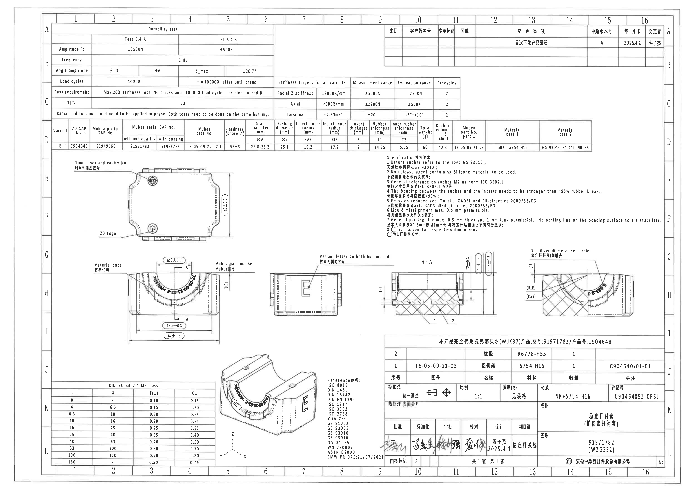

## object_1 - Durability test 试验条件表

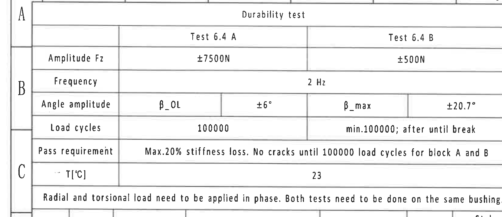

- 原图位置/视图名称：左上 A-C 区域，Durability test 表。
- bbox：`[265, 160, 1925, 880]`
- object_kind：`table`

原表还原：

| 项目 | Test 6.4 A | Test 6.4 B |
|---|---:|---:|
| Amplitude Fz | ±7500N | ±500N |
| Frequency | 2 Hz | 2 Hz |
| Angle amplitude | β_OL / ±6° | β_max / ±20.7° |
| Load cycles | 100000 | min.100000; after until break |
| Pass requirement | Max.20% stiffness loss. No cracks until 100000 load cycles for block A and B | Max.20% stiffness loss. No cracks until 100000 load cycles for block A and B |
| T[°C] | 23 | 23 |
| General note | Radial and torsional load need to be applied in phase. Both tests need to be done on the same bushing. | Radial and torsional load need to be applied in phase. Both tests need to be done on the same bushing. |

提取与解读：

| 提取项 | 原图数值或文本 | 含义说明 |
|---|---|---|
| 表题 | Durability test | 耐久试验要求。 |
| 试验 6.4 A 载荷 | ±7500N | Fz 振幅载荷。 |
| 试验 6.4 B 载荷 | ±500N | Fz 振幅载荷。 |
| 频率 | 2 Hz | 两个试验共用频率。 |
| 角振幅 A | β_OL / ±6° | 试验 6.4 A 的角度振幅条件。 |
| 角振幅 B | β_max / ±20.7° | 试验 6.4 B 的角度振幅条件。 |
| 循环次数 A | 100000 | 试验 6.4 A 的加载循环次数。 |
| 循环次数 B | min.100000; after until break | 试验 6.4 B 至少 100000 次，之后直到断裂。 |
| 通过要求 | Max.20% stiffness loss. No cracks until 100000 load cycles for block A and B | 刚度损失不超过 20%，A/B 块到 100000 次前不得开裂。 |
| 温度 | 23 °C | 试验温度。 |
| 相位要求 | Radial and torsional load need to be applied in phase... | 径向和扭转载荷需同相施加，同一衬套完成两项试验。 |

边界归属说明：表格下方参数表另归 object_4；右侧刚度目标表另归 object_3。本裁切只解释 Durability test 表内内容。

## object_2 - 变更履历表

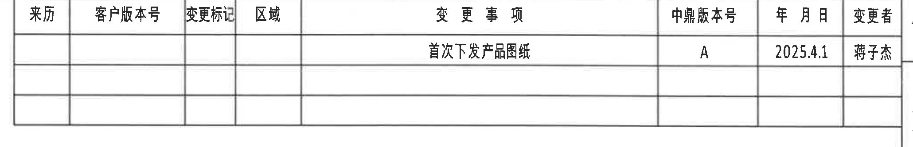

- 原图位置/视图名称：右上 A-B 区域，变更履历表。
- bbox：`[2730, 190, 4790, 525]`
- object_kind：`table`

原表还原：

| 来历 | 客户版本号 | 变更标记 | 区域 | 变更事项 | 中鼎版本号 | 年月日 | 变更者 |
|---|---|---|---|---|---|---|---|
|  |  |  |  | 首次下发产品图纸 | A | 2025.4.1 | 蒋子杰 |
|  |  |  |  |  |  |  |  |
|  |  |  |  |  |  |  |  |

字段对照/归一化还原：

| REV | DESCRIPTION | LOC | BY | DATE | ECN NO |
|---|---|---|---|---|---|
| A | 首次下发产品图纸 | 原图“区域”列为空 | 蒋子杰 | 2025.4.1 | 原图无 ECN NO 列 |

提取与解读：

| 提取项 | 原图数值或文本 | 含义说明 |
|---|---|---|
| 变更事项 | 首次下发产品图纸 | 首次发布产品图纸。 |
| 中鼎版本号 | A | 当前中鼎版本标识。 |
| 年月日 | 2025.4.1 | 变更/发布日期。 |
| 变更者 | 蒋子杰 | 变更记录人员。 |

边界归属说明：裁切保留完整表格外框和空白记录行；顶部图框坐标数字与右侧坐标栏不作为表格字段解读。

## object_3 - Stiffness targets for all variants 刚度目标表

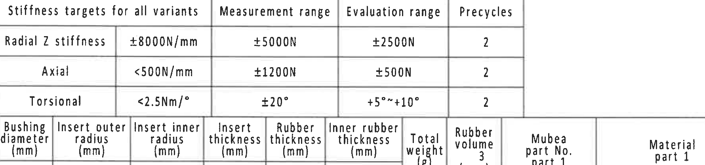

- 原图位置/视图名称：上方 C 区域中右，刚度目标表。
- bbox：`[1980, 565, 3760, 985]`
- object_kind：`table`

原表还原：

| Stiffness targets for all variants | 目标值 | Measurement range | Evaluation range | Precycles |
|---|---:|---:|---:|---:|
| Radial Z stiffness | ±8000N/mm | ±5000N | ±2500N | 2 |
| Axial | <500N/mm | ±1200N | ±500N | 2 |
| Torsional | <2.5Nm/° | ±20° | +5°~+10° | 2 |

提取与解读：

| 提取项 | 原图数值或文本 | 含义说明 |
|---|---|---|
| Radial Z stiffness | ±8000N/mm; ±5000N; ±2500N; 2 | 径向 Z 刚度目标、测量范围、评价范围和预循环次数。 |
| Axial | <500N/mm; ±1200N; ±500N; 2 | 轴向刚度目标、测量范围、评价范围和预循环次数。 |
| Torsional | <2.5Nm/°; ±20°; +5°~+10°; 2 | 扭转刚度目标、测量范围、评价范围和预循环次数。 |

边界归属说明：该表紧邻 durability 表和参数表，裁切只解释刚度目标三行；下方 Variant 参数列不属于本对象。

## object_4 - Variant E 零件参数表

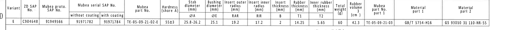

- 原图位置/视图名称：D 区域横向参数表。
- bbox：`[325, 870, 4445, 1120]`
- object_kind：`table`

原表还原：

| Variant | ZD SAP No. | Mubea proto. SAP No. | Mubea serial SAP No. without coating | Mubea serial SAP No. with coating | Mubea part No. | Hardness (shore A) | Stab diameter ØA (mm) | Bushing diameter ØE (mm) | Insert outer radius RAR (mm) | Insert inner radius RIR (mm) | Insert thickness B (mm) | Rubber thickness T1 (mm) | Inner rubber thickness T2 (mm) | Total weight (g) | Rubber volume (cm³) | Mubea part No. part 1 | Material part 1 | Material part 2 |
|---|---|---|---|---|---|---:|---:|---:|---:|---:|---:|---:|---:|---:|---:|---|---|---|
| E | C904648 | 91949566 | 91971782 | 91971784 | TE-05-09-21-02-E | 55±3 | 25.8-26.2 | 25.1 | 19.2 | 17.2 | 2 | 14.25 | 5.65 | 60 | 42.3 | TE-05-09-21-03 | GB/T 5754-H16 | GS 93010 31 110-NR-55 |

提取与解读：

| 提取项 | 原图数值或文本 | 含义说明 |
|---|---|---|
| Variant | E | 本图当前变型。 |
| ØA | 25.8-26.2 mm | 稳定杆杆径，供 object_10 的稳定杆直径说明引用。 |
| ØE | 25.1 mm | 衬套直径，供 object_7 的 ØE±0.3 变量尺寸引用。 |
| RAR | 19.2 mm | Insert outer radius，供 object_10 的 RAR 引出线引用。 |
| RIR | 17.2 mm | Insert inner radius，供 object_10 的 RIR 引出线引用。 |
| B | 2 mm | Insert thickness，供 object_9 的 (B) 参考尺寸引用。 |
| T1 | 14.25 mm | Rubber thickness，供 object_9 的 T1±0.3 引用。 |
| T2 | 5.65 mm | Inner rubber thickness。 |
| Hardness | 55±3 shore A | 橡胶硬度要求。 |
| Total weight / Rubber volume | 60 g / 42.3 cm³ | 重量和体积。 |
| Materials | GB/T 5754-H16; GS 93010 31 110-NR-55 | 材料规范。 |

边界归属说明：参数表为后续视图变量尺寸的数值来源；不把表下方 NOTES 或视图内容并入该表。

## object_5 - 俯视图 / Top machining view

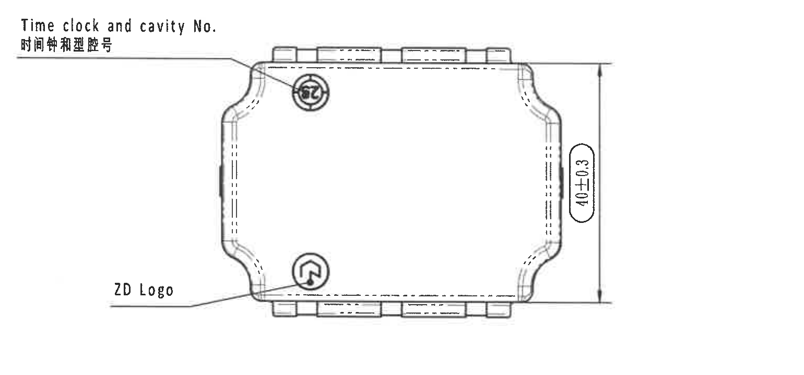

- 原图位置/视图名称：左中 E-F 区域，俯视图。
- bbox：`[500, 1120, 2040, 1840]`
- object_kind：`view`

提取与解读：

| 提取项 | 原图数值或文本 | 含义说明 |
|---|---|---|
| 引出说明 | Time clock and cavity No. / 时间钟和型腔号 | 指向顶部圆形标记，表示模具时间钟和型腔号位置。 |
| 引出说明 | ZD Logo | 指向下方圆形 ZD 标志位置。 |
| 尺寸 | 40±0.3 | 俯视图竖向总尺寸，尺寸线和两端箭头在本裁切内完整。 |

边界归属说明：该裁切只包含俯视图和对应引出线/尺寸；右侧技术要求和下方正视图不属于本对象。

## object_6 - Specification 技术要求 / NOTES

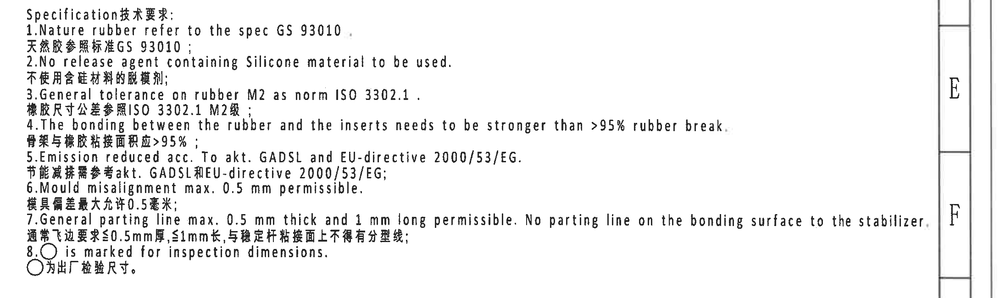

- 原图位置/视图名称：右中 E-F 区域，技术要求。
- bbox：`[2720, 1100, 4900, 1750]`
- object_kind：`notes`

原文还原：

| 序号 | 原图文本 | 中文文本 |
|---:|---|---|
| 1 | Nature rubber refer to the spec GS 93010. | 天然胶参照标准GS 93010； |
| 2 | No release agent containing Silicone material to be used. | 不使用含硅材料的脱模剂； |
| 3 | General tolerance on rubber M2 as norm ISO 3302.1. | 橡胶尺寸公差参照ISO 3302.1 M2级； |
| 4 | The bonding between the rubber and the inserts needs to be stronger than >95% rubber break. | 骨架与橡胶粘接面积应>95%； |
| 5 | Emission reduced acc. To akt. GADSL and EU-directive 2000/53/EG. | 节能减排需参考akt. GADSL和EU-directive 2000/53/EG； |
| 6 | Mould misalignment max. 0.5 mm permissible. | 模具偏差最大允许0.5毫米； |
| 7 | General parting line max. 0.5 mm thick and 1 mm long permissible. No parting line on the bonding surface to the stabilizer. | 通常飞边要求≤0.5mm厚，≤1mm长；与稳定杆粘接面上不得有分型线； |
| 8 | ○ is marked for inspection dimensions. | ○为出厂检验尺寸。 |

提取与解读：

| 提取项 | 原图数值或文本 | 含义说明 |
|---|---|---|
| 材料规范 | GS 93010 | 天然胶材料参考规范。 |
| 脱模剂限制 | No release agent containing Silicone | 禁止使用含硅脱模剂。 |
| 橡胶一般公差 | ISO 3302.1 M2 | 对应 object_12 的 DIN ISO 3302-1 M2 公差表。 |
| 粘接要求 | >95% rubber break | 橡胶与嵌件粘接强度要求。 |
| 模具偏差 | max. 0.5 mm | 模具错位最大允许值。 |
| 分型线/飞边 | max. 0.5 mm thick and 1 mm long | 飞边/分型线控制要求，稳定杆粘接面不得有分型线。 |
| 检验尺寸符号 | ○ | 被圆圈标记的尺寸为出厂检验尺寸。 |

边界归属说明：技术要求为独立文本块；不把右侧图框坐标或左侧视图内容归入 NOTES。

## object_7 - 正视图 / Front machining view

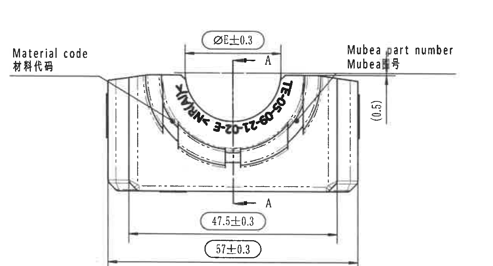

- 原图位置/视图名称：左下 G-I 区域，正视图。
- bbox：`[645, 1765, 1925, 2455]`
- object_kind：`view`

提取与解读：

| 提取项 | 原图数值或文本 | 含义说明 |
|---|---|---|
| 引出说明 | Material code / 材料代码 | 指向左侧材料代码标识区域。 |
| 引出说明 | Mubea part number / Mubea号 | 指向右侧 Mubea 零件号标识区域。 |
| 剖切标识 | A-A | 正视图上的剖切位置，剖面结果见 object_9。 |
| 变量尺寸 | ØE±0.3 | 衬套直径变量尺寸；根据 object_4，Variant E 的 ØE=25.1 mm，因此对应 25.1±0.3 mm。 |
| 参考尺寸 | (0.5) | 括号内参考尺寸，表示局部位置/偏移参考，不作为独立公差尺寸处理。 |
| 尺寸 | 47.5±0.3 | 下方内侧横向尺寸，尺寸线两端完整。 |
| 尺寸 | 57±0.3 | 下方总横向尺寸，尺寸线两端完整。 |
| 弧面标识 | 含 TE-05-09-21-02-E 等弧向文字 | 沿内圆弧布置的零件/标识文字，扫描件局部文字不完全清晰。 |

边界归属说明：右侧侧视图和下方等轴测图均不属于本正视图，已通过裁切边界排除；A-A 标识属于本视图中的剖切指示，A-A 剖面尺寸不归到本视图。

## object_8 - 侧视图 / Side view

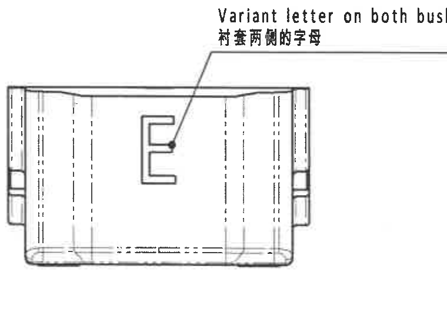

- 原图位置/视图名称：G-H 区域，正视图右侧的侧视图。
- bbox：`[1925, 1815, 2685, 2375]`
- object_kind：`view`

提取与解读：

| 提取项 | 原图数值或文本 | 含义说明 |
|---|---|---|
| 引出说明 | Variant letter on both bushing sides / 衬套两侧的字母 | 指向侧面字母标识位置。 |
| 侧面标识 | E | Variant 字母，表示两侧需有该字母。 |
| 尺寸 | 无独立数字尺寸 | 本裁切内没有独立尺寸数值。 |

边界归属说明：A-A 剖面的 `(B)` 尺寸紧邻本视图右侧，但不属于侧视图，已排除并归入 object_9。

## object_9 - 剖面 A-A / Section A-A

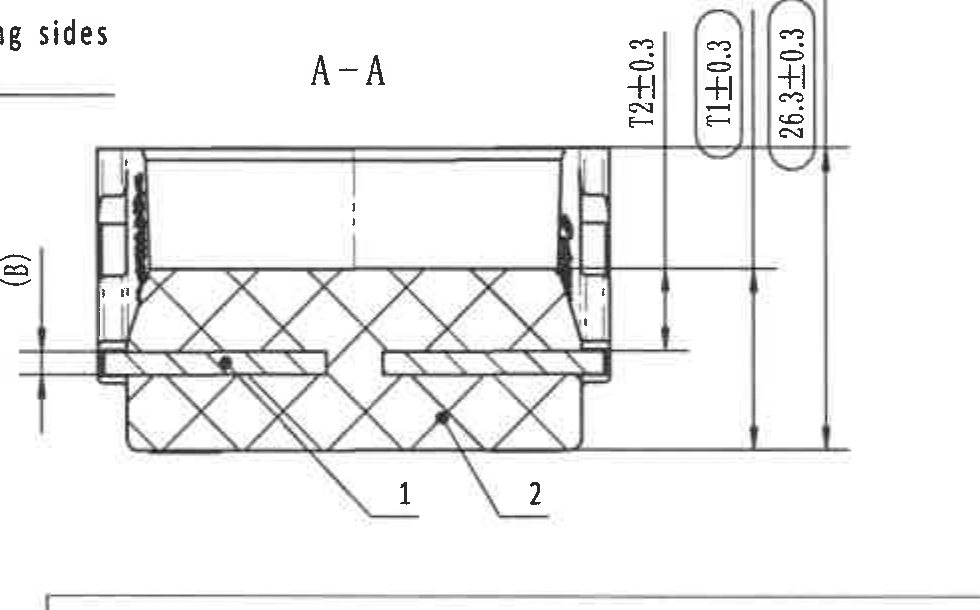

- 原图位置/视图名称：中右 G-H 区域，A-A 剖面。
- bbox：`[2715, 1810, 3695, 2420]`
- object_kind：`section`

提取与解读：

| 提取项 | 原图数值或文本 | 含义说明 |
|---|---|---|
| 剖面名称 | A-A | 来源于 object_7 的 A-A 剖切线。 |
| 参考尺寸 | (B) | 括号内变量参考尺寸；根据 object_4，B=2 mm。 |
| 尺寸 | 72±0.3 | 右侧竖向尺寸，尺寸线和箭头完整。 |
| 变量尺寸 | T1±0.3 | 橡胶厚度变量；根据 object_4，T1=14.25 mm，因此对应 14.25±0.3 mm。 |
| 尺寸 | 26.3±0.3 | 右侧外侧竖向尺寸，尺寸线和箭头完整。 |
| 序号引出 | 1 | 对应标题栏 BOM：TE-05-09-21-03，铝骨架，5754 H16。 |
| 序号引出 | 2 | 对应标题栏 BOM：橡胶，R6778-H55。 |

边界归属说明：左侧 `(B)` 虽靠近侧视图边界，但尺寸箭头和引线位于 A-A 剖面左侧，归属 object_9；侧视图文字和标题栏上沿不归入本对象。

## object_10 - 右侧局部剖视图 / Partial section detail

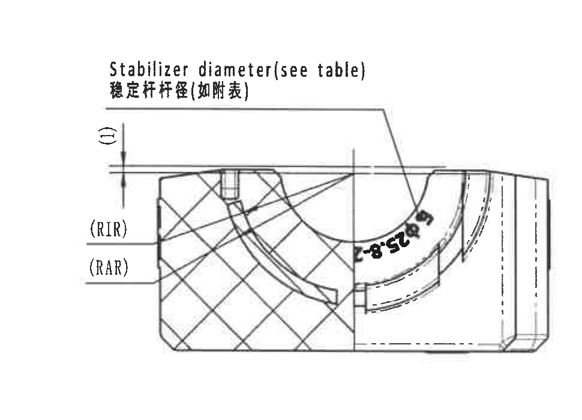

- 原图位置/视图名称：右下 G-H 区域，局部剖视图。
- bbox：`[3630, 1685, 4600, 2385]`
- object_kind：`detail`

提取与解读：

| 提取项 | 原图数值或文本 | 含义说明 |
|---|---|---|
| 引出说明 | Stabilizer diameter (see table) / 稳定杆杆径(如附表) | 指向稳定杆贴合内圆弧，数值查 object_4 的 ØA。 |
| 变量尺寸 | ØA=25.8-26.2 mm | Variant E 稳定杆杆径范围，来自 object_4。 |
| 参考标识 | (1) | 括号内局部参考标识/尺寸，归属本局部剖视。 |
| 半径标识 | (RIR) | Insert inner radius；根据 object_4，RIR=17.2 mm。 |
| 半径标识 | (RAR) | Insert outer radius；根据 object_4，RAR=19.2 mm。 |
| 弧面标识 | 可辨含 25.8 的弧向标识，前缀扫描不完全清楚 | 位于内圆弧附近，结合引出说明归属于稳定杆杆径/弧面标识。 |

边界归属说明：本对象只解释右侧局部剖视内的 `(1)`、`(RIR)`、`(RAR)`、稳定杆直径引出线和弧面标识；右侧图框坐标栏不纳入，左侧 A-A 剖面尺寸不归入本对象。

## object_11 - 等轴测图 / Isometric view

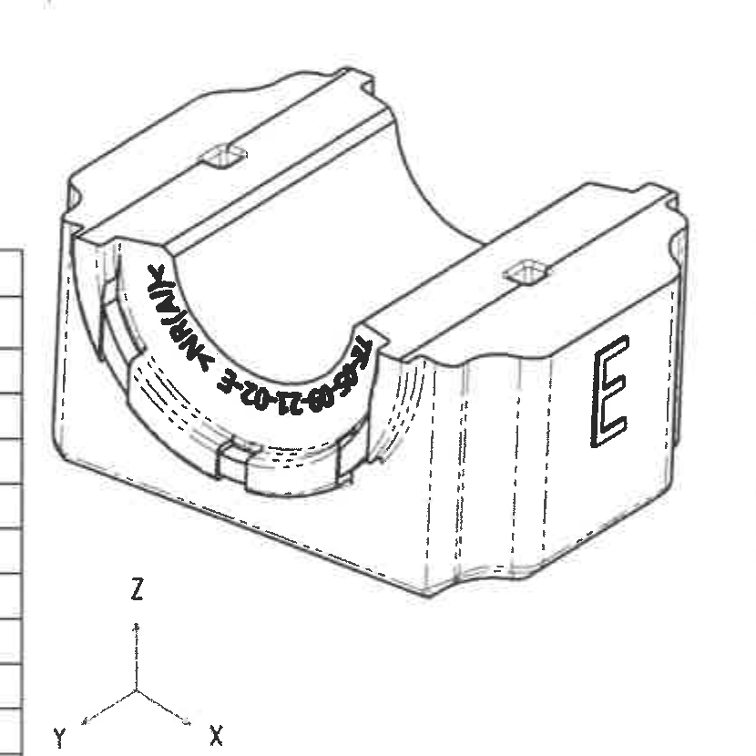

- 原图位置/视图名称：J-L 区域中下，等轴测图。
- bbox：`[1520, 2470, 2350, 3300]`
- object_kind：`view`

提取与解读：

| 提取项 | 原图数值或文本 | 含义说明 |
|---|---|---|
| 视图 | 等轴测图 | 展示零件三维形态、内圆弧和侧面特征。 |
| 侧面标识 | E | 与 object_8 的 Variant 字母一致。 |
| 弧面标识 | 内圆弧上的弧向零件标识 | 展示标识在三维零件上的位置。 |
| 坐标轴 | X / Y / Z | 方向参考。 |
| 尺寸 | 无独立数字尺寸 | 本等轴测图不包含单独尺寸值。 |

边界归属说明：左侧 DIN 公差表和右侧 Reference 清单分别归 object_12/object_13；不与等轴测图混合提取。

## object_12 - DIN ISO 3302-1 M2 class 橡胶一般公差表

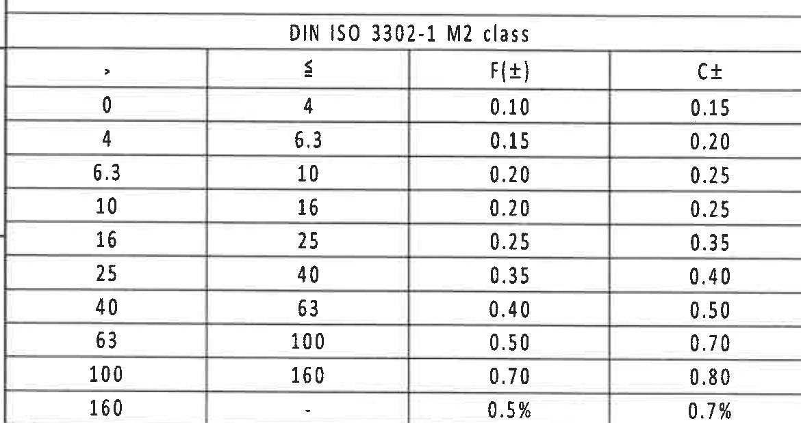

- 原图位置/视图名称：左下 K-L 区域，DIN ISO 3302-1 M2 class 表。
- bbox：`[360, 2720, 1530, 3340]`
- object_kind：`table`

原表还原：

| > | ≤ | F(±) | C± |
|---:|---:|---:|---:|
| 0 | 4 | 0.10 | 0.15 |
| 4 | 6.3 | 0.15 | 0.20 |
| 6.3 | 10 | 0.20 | 0.25 |
| 10 | 16 | 0.20 | 0.25 |
| 16 | 25 | 0.25 | 0.35 |
| 25 | 40 | 0.35 | 0.40 |
| 40 | 63 | 0.40 | 0.50 |
| 63 | 100 | 0.50 | 0.70 |
| 100 | 160 | 0.70 | 0.80 |
| 160 | - | 0.5% | 0.7% |

提取与解读：

| 提取项 | 原图数值或文本 | 含义说明 |
|---|---|---|
| 表题 | DIN ISO 3302-1 M2 class | 橡胶件一般公差等级，与 NOTES 第 3 条对应。 |
| F(±) | 0.10 到 0.5% | F 列公差按尺寸区间给出。 |
| C± | 0.15 到 0.7% | C 列公差按尺寸区间给出。 |

边界归属说明：表格右侧等轴测图边界已排除，表内最后一行 `160 - 0.5% 0.7%` 完整保留。

## object_13 - Reference 参考清单

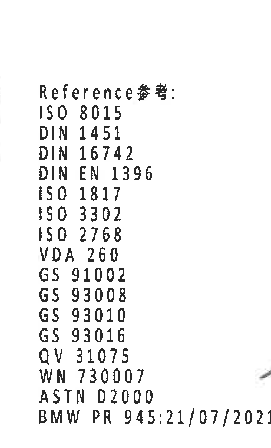

- 原图位置/视图名称：底部中右 Reference 区。
- bbox：`[2285, 2575, 2745, 3335]`
- object_kind：`notes`

原文还原：

| 序号 | 原图文本 |
|---:|---|
| 1 | ISO 8015 |
| 2 | DIN 1451 |
| 3 | DIN 16742 |
| 4 | DIN EN 1396 |
| 5 | ISO 1817 |
| 6 | ISO 3302 |
| 7 | ISO 2768 |
| 8 | VDA 260 |
| 9 | GS 91002 |
| 10 | GS 93008 |
| 11 | GS 93010 |
| 12 | GS 93016 |
| 13 | QV 31075 |
| 14 | WN 730007 |
| 15 | ASTN D2000 |
| 16 | BMW PR 945:21/07/2021 |

提取与解读：

| 提取项 | 原图数值或文本 | 含义说明 |
|---|---|---|
| Reference | 上述 16 条标准/规范 | 图纸引用标准清单。 |
| GS 93010 | 出现在 reference list 和 NOTES | 与天然胶材料规范相关。 |
| ISO 3302 | 出现在 reference list 和公差说明 | 与 object_12 的橡胶一般公差表相关。 |

边界归属说明：右侧标题栏表格未纳入本裁切；左侧等轴测图未纳入本裁切。

## object_14 - 标题栏、BOM 与图签 / Title block

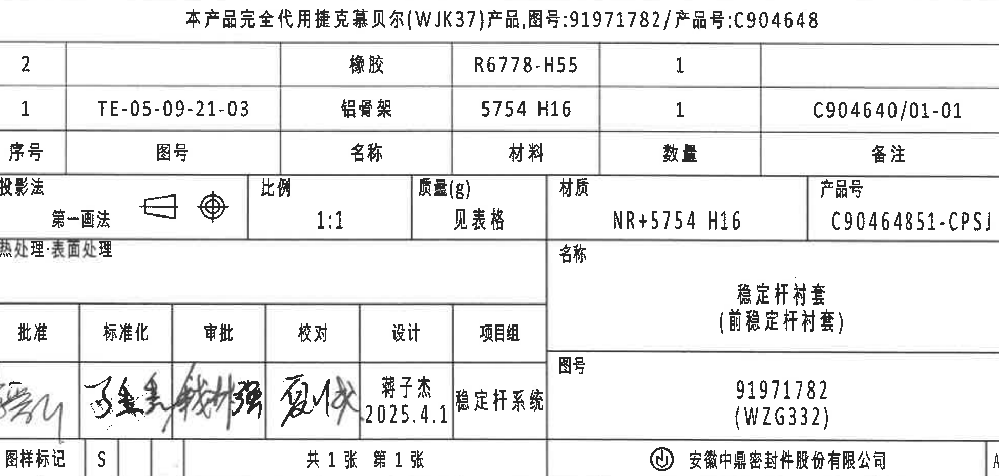

- 原图位置/视图名称：右下 I-L 区域，标题栏/图签。
- bbox：`[2790, 2415, 4740, 3345]`
- object_kind：`title_block`

原表还原 - 产品代用说明：

| 字段 | 原图文本 |
|---|---|
| 代用说明 | 本产品完全代用捷克慕贝尔(WJK37)产品,图号:91971782/产品号:C904648 |

原表还原 - BOM/明细：

| 序号 | 图号 | 名称 | 材料 | 数量 | 备注 |
|---:|---|---|---|---:|---|
| 2 |  | 橡胶 | R6778-H55 | 1 |  |
| 1 | TE-05-09-21-03 | 铝骨架 | 5754 H16 | 1 | C904640/01-01 |

原表还原 - 图签字段：

| 字段 | 原图数值或文本 |
|---|---|
| 投影法 | 第一画法，含投影视图符号 |
| 比例 | 1:1 |
| 质量(g) | 见表格 |
| 材质 | NR+5754 H16 |
| 产品号 | C90464851-CPSJ |
| 热处理·表面处理 | 空白 |
| 名称 | 稳定杆衬套（前稳定杆衬套） |
| 图号 | 91971782 (WZG332) |
| 批准 | 手写签名，扫描不完全可辨 |
| 标准化 | 手写签名，扫描不完全可辨 |
| 审批 | 手写签名，扫描不完全可辨 |
| 校对 | 手写签名，扫描不完全可辨 |
| 设计 | 蒋子杰 2025.4.1 |
| 项目组 | 稳定杆系统 |
| 图样标记 | S |
| 张数 | 共1张 第1张 |
| 公司 | 安徽中鼎密封件股份有限公司 |
| 图幅 | A3 |

提取与解读：

| 提取项 | 原图数值或文本 | 含义说明 |
|---|---|---|
| 代用说明 | 本产品完全代用捷克慕贝尔(WJK37)产品,图号:91971782/产品号:C904648 | 本产品与指定 WJK37 产品代用关系。 |
| BOM 1 | TE-05-09-21-03 / 铝骨架 / 5754 H16 / 1 / C904640/01-01 | 对应 object_9 中序号 1。 |
| BOM 2 | 橡胶 / R6778-H55 / 1 | 对应 object_9 中序号 2。 |
| 材质 | NR+5754 H16 | 橡胶与铝材组合。 |
| 产品号 | C90464851-CPSJ | 图签产品编号。 |
| 图号 | 91971782 (WZG332) | 图签图号。 |
| 设计 | 蒋子杰 2025.4.1 | 设计人员和日期。 |

边界归属说明：标题栏与 BOM 同属右下图签框，作为一个 title_block 裁切对象还原；底部图框坐标条已排除，左侧 Reference 清单不归入本对象。

## 裁切检查记录

| 对象 | 检查结果 |
|---|---|
| object_1 | 完整包含 Durability test 表格边框和全部文字；未纳入 object_3/object_4 内容。 |
| object_2 | 完整包含修订表列头、记录行和空白行；未把顶部坐标数字作为表格字段。 |
| object_3 | 完整包含 stiffness targets 表三行；底部参数表已排除。 |
| object_4 | 完整包含 Variant E 参数表所有列到 Material part 2；下方 NOTES/视图未纳入。 |
| object_5 | 完整包含俯视图、40±0.3 尺寸线和两个引出说明；未混入 NOTES。 |
| object_6 | 完整包含技术要求 1-8 条；右侧坐标栏已排除。 |
| object_7 | 完整包含正视图、ØE±0.3、(0.5)、47.5±0.3、57±0.3、A-A 标识和引出说明；侧视图/等轴测图已排除。 |
| object_8 | 完整包含侧视图和 Variant letter 引出说明；A-A 剖面的 (B) 尺寸已排除。 |
| object_9 | 完整包含 A-A、(B)、72±0.3、T1±0.3、26.3±0.3、1/2 引出编号；侧视图和标题栏未纳入。 |
| object_10 | 完整包含局部剖视、(1)、(RIR)、(RAR)、稳定杆杆径说明和弧面标识；右侧图框坐标栏已排除。 |
| object_11 | 完整包含等轴测图和 X/Y/Z 方向标；DIN 公差表与 Reference 清单未纳入。 |
| object_12 | 完整包含 DIN ISO 3302-1 M2 表所有行列；右侧等轴测图片段已排除。 |
| object_13 | 完整包含 Reference 参考清单全部 16 行；右侧标题栏未纳入。 |
| object_14 | 完整包含标题栏、BOM、投影/比例/质量/材质/产品号、名称/图号、签字栏、页数、公司和 A3；底部坐标条已排除。 |
