# 20C90483743 PDF 内容识别结果

- 源文件：`input/20C90483743.pdf`
- 整页渲染图：`outputs/20C90483743_assets/images/page_1.png`
- 页面尺寸：4959 × 3505 px
- bbox 坐标格式：`[x0, y0, x1, y1]`，坐标基于整页 PNG 左上角。

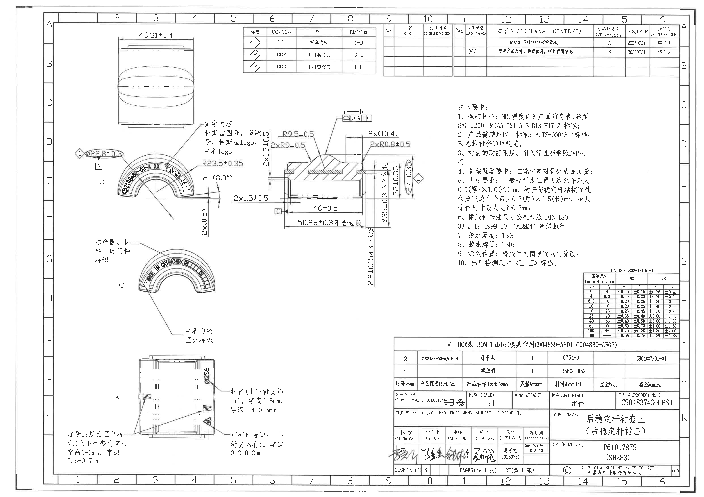

## object_1 - 上方外形视图 / overall outer view

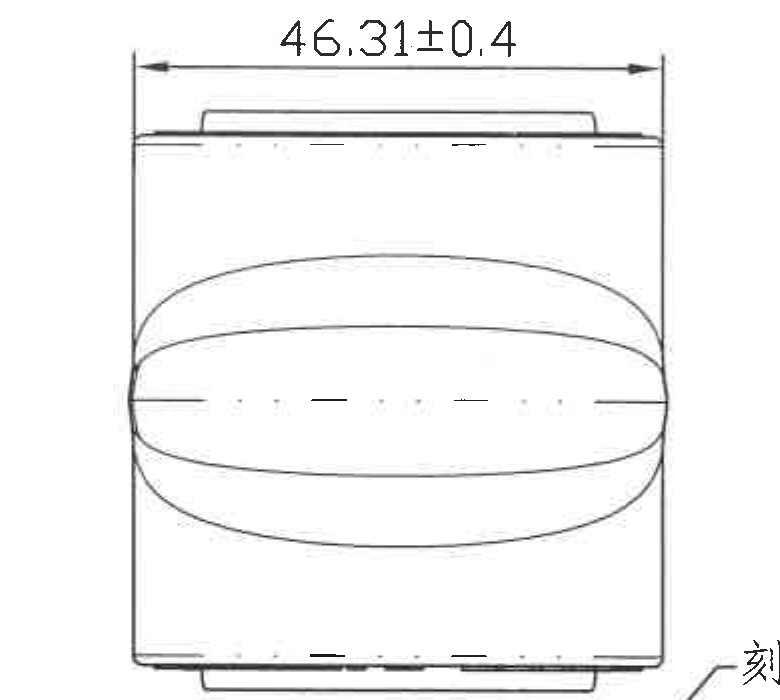

- 原图位置/视图名称：页面左上，约列 2-5、行 A-D。
- object_kind：`view`
- bbox：`[700, 210, 1480, 910]`

### 提取表格

| 提取项 | 原图数值或文本 | 含义说明 |
|---|---|---|
| 尺寸 | 46.31±0.4 | 顶部水平总宽/外形宽度尺寸；尺寸线、箭头和两端延长线均在本裁切内。 |
| 外形轮廓 | 上、下端台阶；中部椭圆形外轮廓 | 用于表达衬套外形和中部鼓包/外轮廓位置。 |

### 边界归属说明

裁切包含该外形视图及顶部水平尺寸线、两端箭头和延长线。右下边缘有相邻刻字说明引线的端部残片，不属于本视图，不提取。

## object_2 - CC/SC 特征位置表

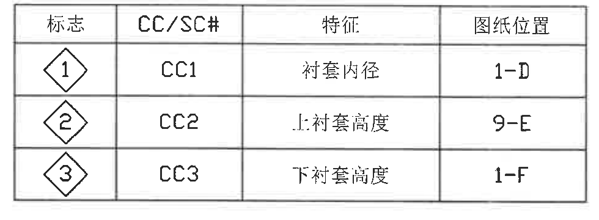

- 原图位置/视图名称：页面上方中左，约列 6-9、行 A-B。
- object_kind：`table`
- bbox：`[1690, 185, 2670, 545]`

### 原表行列还原

| 标志 | CC/SC# | 特征 | 图纸位置 |
|---|---|---|---|
| ◇1 | CC1 | 衬套内径 | 1-D |
| ◇2 | CC2 | 上衬套高度 | 9-E |
| ◇3 | CC3 | 下衬套高度 | 1-F |

### 提取表格

| 提取项 | 原图数值或文本 | 含义说明 |
|---|---|---|
| 表头 | 标志 / CC/SC# / 特征 / 图纸位置 | 关键特征索引表字段。 |
| ◇1 | CC1 / 衬套内径 / 1-D | 关键特征 1，定位到图纸 1-D。 |
| ◇2 | CC2 / 上衬套高度 / 9-E | 关键特征 2，定位到图纸 9-E。 |
| ◇3 | CC3 / 下衬套高度 / 1-F | 关键特征 3，定位到图纸 1-F。 |

### 边界归属说明

裁切完整包含表格外框、表头和三行关键特征；未包含周边视图。

## object_3 - 来源/客户版本号空表

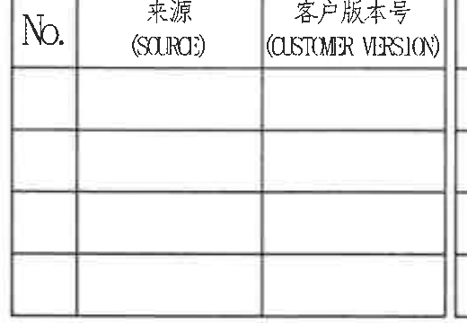

- 原图位置/视图名称：页面上方中部，约列 10-11、行 A-B。
- object_kind：`table`
- bbox：`[2690, 185, 3210, 545]`

### 原表行列还原

| No. | 来源(SOURC) | 客户版本号(CUSTOMER VERSION) |
|---|---|---|
|  |  |  |
|  |  |  |
|  |  |  |
|  |  |  |

### 提取表格

| 提取项 | 原图数值或文本 | 含义说明 |
|---|---|---|
| 表头 | No. / 来源(SOURC) / 客户版本号(CUSTOMER VERSION) | 来源与客户版本记录表。 |
| 数据行 | 空白 | 原表未填写来源或客户版本记录。 |

### 边界归属说明

裁切包含完整空表；右侧仅到表格边线，不提取相邻修订表内容。

## object_4 - 修订履历表 / change content table

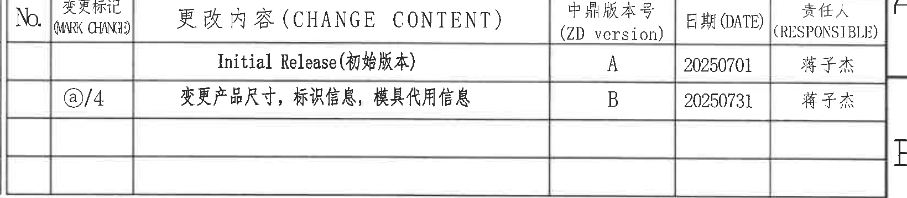

- 原图位置/视图名称：页面上方右侧，约列 11-16、行 A-B。
- object_kind：`table`
- bbox：`[3185, 185, 4825, 545]`

### 原表行列还原

| No. | 变更标记(MARK CHANGE) | 更改内容(CHANGE CONTENT) | 中鼎版本号(ZD version) | 日期(DATE) | 责任人(RESPONSIBLE) |
|---|---|---|---|---|---|
|  |  | Initial Release(初始版本) | A | 20250701 | 蒋子杰 |
|  | ⓐ/4 | 变更产品尺寸，标识信息，模具代用信息 | B | 20250731 | 蒋子杰 |
|  |  |  |  |  |  |
|  |  |  |  |  |  |

原图表头未出现 ECN NO 列，右侧紧邻的是图框坐标 A/B。

### 提取表格

| 提取项 | 原图数值或文本 | 含义说明 |
|---|---|---|
| 修订记录 A | Initial Release(初始版本) / A / 20250701 / 蒋子杰 | 初始版本发布。 |
| 修订记录 B | ⓐ/4 / 变更产品尺寸，标识信息，模具代用信息 / B / 20250731 / 蒋子杰 | 版本 B 的变更内容。 |
| ECN NO | 原表未见该列 | 未新增不存在的列。 |

### 边界归属说明

裁切完整包含修订表外框和两条修订记录；右侧图框坐标 A/B 不属于该表，未纳入对象。

## object_5 - 上方拱形刻字局部视图

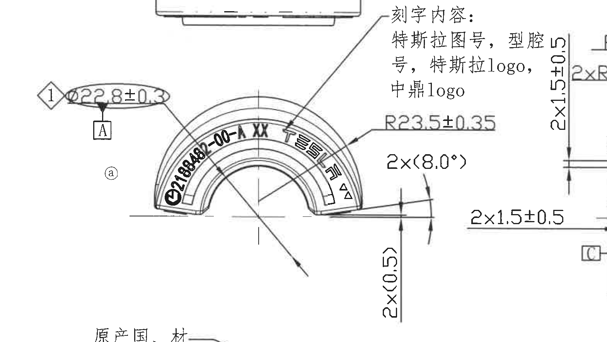

- 原图位置/视图名称：页面左中上，约列 1-6、行 D-F，带圆圈 a 标识。
- object_kind：`detail`
- bbox：`[430, 835, 2000, 1720]`

### 提取表格

| 提取项 | 原图数值或文本 | 含义说明 |
|---|---|---|
| 关键尺寸/CC1 | ◇1 φ22.8±0.3 | 衬套内径关键尺寸，来自 CC/SC 表的 CC1；椭圆圈出并带菱形 1 标志。 |
| 基准 | A | φ22.8±0.3 下方的基准字母，作为该局部尺寸/特征引用基准。 |
| 刻字说明 | 刻字内容：特斯拉图号，型腔号，特斯拉 logo，中鼎 logo | 引线指向拱形刻字区，说明该处需要刻制的信息类型。 |
| 刻字文本 | 2188485-00-A XX；TESLA；三角符号 | 沿拱形排布的产品/型腔/品牌标识；XX 表示型腔号占位。 |
| 半径 | R23.5±0.35 | 拱形外轮廓半径尺寸，箭头指向当前拱形视图。 |
| 参考角度 | 2×(8.0°) | 两处端部角度，括号表示参考尺寸；只说明几何参考，不作为单独控制尺寸。 |
| 参考尺寸 | 2×(0.5) | 两处端部高度/台阶参考尺寸，括号表示参考值。 |

### 边界归属说明

本对象只提取箭头/引线指向拱形刻字局部视图的尺寸。右侧可见剖面视图的 2×1.5±0.5、基准 C 等相邻标注片段，归属 object_6，不在本对象提取。下方残留的“原产国、材料、时间钟标识”引线归属 object_7。

## object_6 - 中部剖面视图

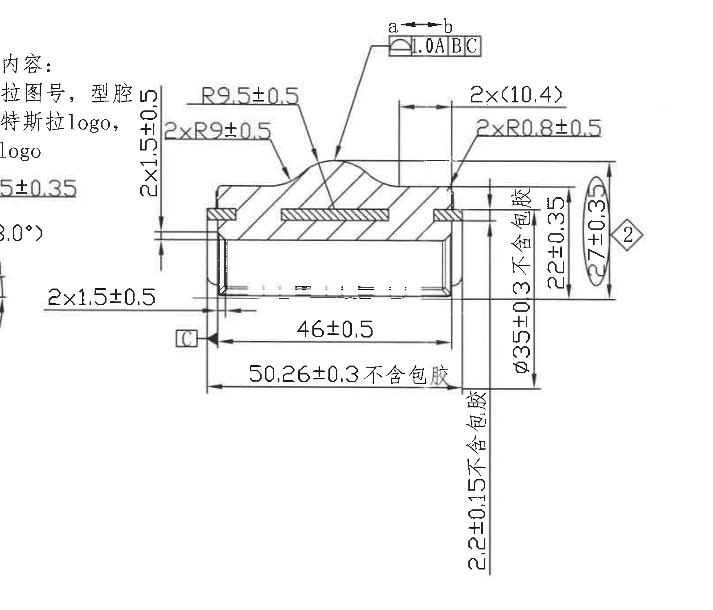

- 原图位置/视图名称：页面中部，约列 6-10、行 C-F。
- object_kind：`section`
- bbox：`[1540, 730, 3140, 2100]`

### 提取表格

| 提取项 | 原图数值或文本 | 含义说明 |
|---|---|---|
| 方向/区段 | a↔b | 顶部双向箭头标示 a 到 b 的控制或检查区段。 |
| 几何公差 | 轮廓度 1.0 | A | B | C | 形状/面轮廓控制框，以 A、B、C 为基准。 |
| 半径 | R9.5±0.5 | 上部隆起处半径。 |
| 半径 | 2×R9±0.5 | 两处过渡半径。 |
| 参考尺寸 | 2×(10.4) | 两处横向参考距离，括号表示参考尺寸。 |
| 半径 | 2×R0.8±0.5 | 两处小圆角半径。 |
| 尺寸 | 2×1.5±0.5 | 两处端部/台阶厚度尺寸，箭头指向剖面端部。 |
| 长度 | 46±0.5 | 内侧长度尺寸。 |
| 长度 | 50.26±0.3 不含包胶 | 外侧长度，不包含包胶层。 |
| 直径/外形尺寸 | φ35 +0.35/+0.03 不含包胶 | 右侧竖向控制尺寸，不含包胶；上下偏差均为正向。 |
| 高度 | 22±0.35 | 右侧局部高度尺寸。 |
| 关键尺寸/CC2 | ◇2 27±0.33 | 上衬套高度关键尺寸，对应 CC/SC 表 CC2。 |
| 尺寸 | 2.2±0.15 不含包胶 | 下部局部高度/台阶尺寸，不含包胶。 |
| 基准 | C | 剖面左下基准 C 标识。 |

### 边界归属说明

裁切完整包含剖面轮廓、剖面线、水平/垂直尺寸线、箭头和右侧关键尺寸。左边界带入上方拱形刻字视图的文字片段，属于 object_5，不在本对象提取。

## object_7 - 中间拱形标识局部视图

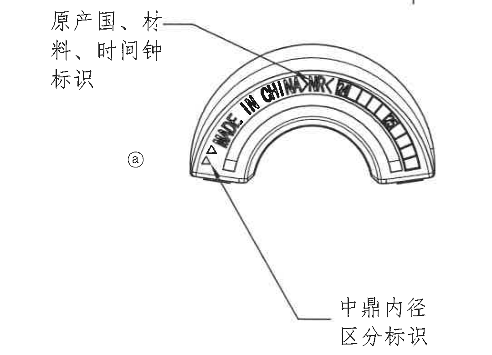

- 原图位置/视图名称：页面左中，约列 2-5、行 G-H，带圆圈 a 标识。
- object_kind：`detail`
- bbox：`[560, 1660, 1640, 2440]`

### 提取表格

| 提取项 | 原图数值或文本 | 含义说明 |
|---|---|---|
| 标识说明 | 原产国、材料、时间钟标识 | 引线指向拱形区域，说明该处标识内容。 |
| 拱形文字 | MADE IN CHINA | 原产国标识。 |
| 材料/时间钟标识 | 材料/时间钟刻格 | 右侧小格和时钟/材料符号用于材料、时间或批次识别。 |
| 标识说明 | 中鼎内径区分标识 | 引线指向下部/内径区分标识位置。 |

### 边界归属说明

裁切包含该拱形局部视图和两条说明引线；顶部极小残线来自上方视图，不形成文字或尺寸，不提取。未包含下方侧视图的 φ23.6。

## object_8 - 下方侧视/标识加工视图

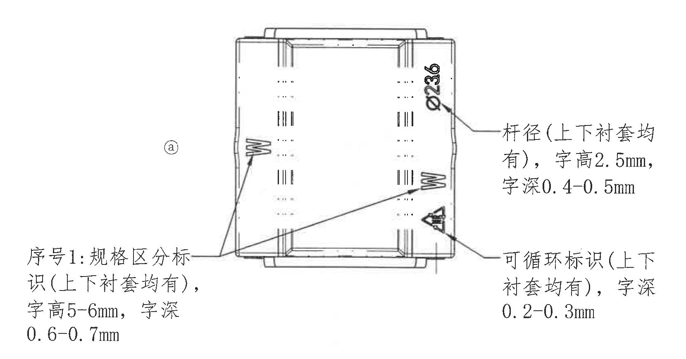

- 原图位置/视图名称：页面左下，约列 1-6、行 J-L，带圆圈 a 标识。
- object_kind：`view`
- bbox：`[410, 2440, 2070, 3310]`

### 提取表格

| 提取项 | 原图数值或文本 | 含义说明 |
|---|---|---|
| 直径 | φ23.6 | 杆径或配合杆径标注，引线指向右侧外表面。 |
| 标识规格 | 序号1：规格区分标识(上下衬套均有)，字高5-6mm，字深0.6-0.7mm | 规格区分标识的上下衬套通用加工要求。 |
| 标识规格 | 杆径(上下衬套均有)，字高2.5mm，字深0.4-0.5mm | 杆径标识的字高和刻深要求。 |
| 标识规格 | 可循环标识(上下衬套均有)，字深0.2-0.3mm | 可循环标识的刻深要求。 |

### 边界归属说明

裁切完整包含侧视图、φ23.6 标注、三组标识说明文字和引线；未包含底部图框坐标数字。

## object_9 - 技术要求 NOTES

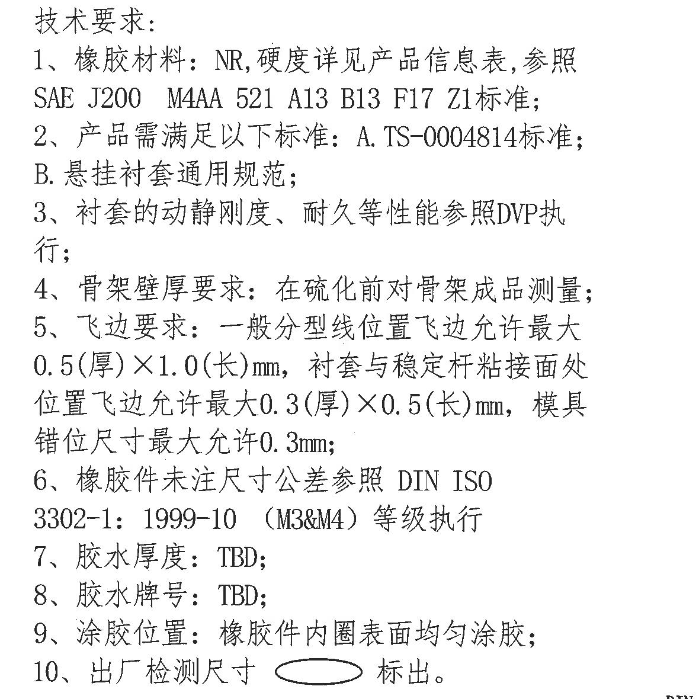

- 原图位置/视图名称：页面右中，约列 11-15、行 C-G。
- object_kind：`notes`
- bbox：`[3170, 720, 4350, 1900]`

### 提取表格

| 提取项 | 原图数值或文本 | 含义说明 |
|---|---|---|
| 1 | 橡胶材料：NR，硬度详见产品信息表，参照 SAE J200 M4AA 521 A13 B13 F17 Z1 标准 | 材料和硬度依据。 |
| 2 | 产品需满足以下标准：A. TS-0004814 标准；B. 悬挂衬套通用规范 | 产品标准与通用规范。 |
| 3 | 衬套的动静刚度、耐久等性能参照 DVP 执行 | 性能试验/验证依据。 |
| 4 | 骨架壁厚要求：在硫化前对骨架成品测量 | 骨架壁厚测量时机。 |
| 5 | 飞边要求：一般分型线位置最大 0.5(厚)×1.0(长)mm；粘接面处最大 0.3(厚)×0.5(长)mm；模具错位尺寸最大 0.3mm | 飞边和模具错位限制。 |
| 6 | 橡胶件未注尺寸公差参照 DIN ISO 3302-1:1999-10 (M3&M4) 等级执行 | 未注公差标准。 |
| 7 | 胶水厚度：TBD | 胶水厚度待定。 |
| 8 | 胶水牌号：TBD | 胶水牌号待定。 |
| 9 | 涂胶位置：橡胶件内圈表面均匀涂胶 | 涂胶位置要求。 |
| 10 | 出厂检测尺寸以椭圆标出 | 椭圆框标示出厂检测尺寸。 |

### 边界归属说明

裁切包含 NOTES 的标题和 1-10 条完整文字。底部仅露出公差表标题极小残字，不属于 NOTES，不提取。

## object_10 - DIN ISO 3302-1:1999-10 公差表

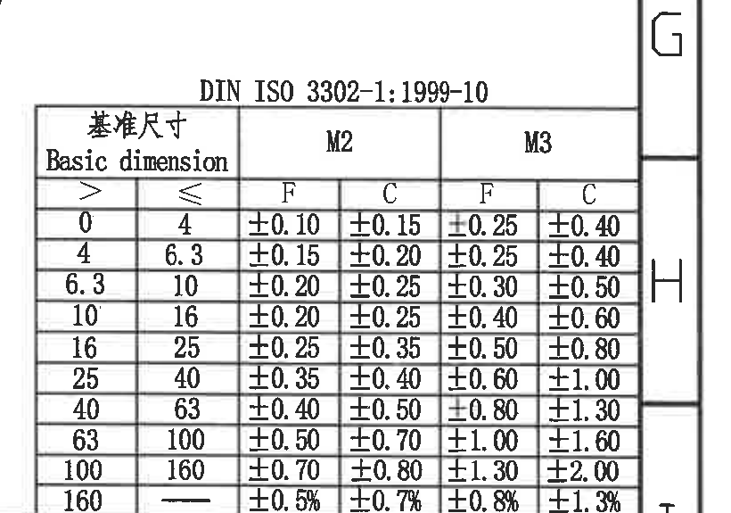

- 原图位置/视图名称：页面右下中部，约列 14-16、行 G-I。
- object_kind：`table`
- bbox：`[4070, 1805, 4890, 2380]`

### 原表行列还原

| Basic dimension > | Basic dimension <= | M2 F | M2 C | M3 F | M3 C |
|---:|---:|---:|---:|---:|---:|
| 0 | 4 | ±0.10 | ±0.15 | ±0.25 | ±0.40 |
| 4 | 6.3 | ±0.15 | ±0.20 | ±0.25 | ±0.40 |
| 6.3 | 10 | ±0.20 | ±0.25 | ±0.30 | ±0.50 |
| 10 | 16 | ±0.20 | ±0.25 | ±0.40 | ±0.60 |
| 16 | 25 | ±0.25 | ±0.35 | ±0.50 | ±0.80 |
| 25 | 40 | ±0.35 | ±0.40 | ±0.60 | ±1.00 |
| 40 | 63 | ±0.40 | ±0.50 | ±0.80 | ±1.30 |
| 63 | 100 | ±0.50 | ±0.70 | ±1.00 | ±1.60 |
| 100 | 160 | ±0.70 | ±0.80 | ±1.30 | ±2.00 |
| 160 | — | ±0.5% | ±0.7% | ±0.8% | ±1.3% |

### 提取表格

| 提取项 | 原图数值或文本 | 含义说明 |
|---|---|---|
| 标准 | DIN ISO 3302-1:1999-10 | 橡胶件未注尺寸公差参考标准。 |
| 表头 | Basic dimension > / <=；M2 F/C；M3 F/C | 按基本尺寸范围给出 M2、M3 等级 F/C 公差。 |
| 数据 | 0-4 至 160-— 共 10 行 | 完整数据已在原表行列还原中列出。 |

### 边界归属说明

裁切完整包含公差表标题、外框、表头和所有数据行。右侧图框坐标 G/H/I 不属于表格，不提取。

## object_11 - BOM 表

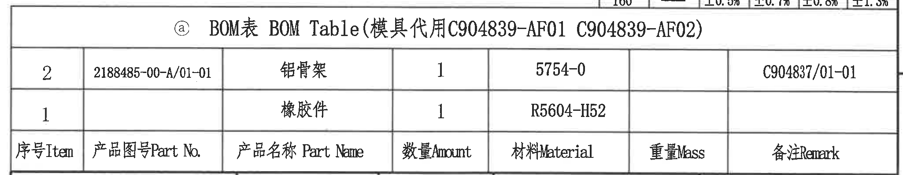

- 原图位置/视图名称：页面右下，标题栏上方，约列 10-16、行 I-J。
- object_kind：`table`
- bbox：`[2750, 2365, 4800, 2763]`

### 原表行列还原

标题行：ⓐ BOM表 BOM Table（模具代用 C904839-AF01 C904839-AF02）

| 序号Item | 产品图号Part No. | 产品名称 Part Name | 数量Amount | 材料Material | 重量Mass | 备注Remark |
|---|---|---|---|---|---|---|
| 2 | 2188485-00-A/01-01 | 铝骨架 | 1 | 5754-0 |  | C904837/01-01 |
| 1 |  | 橡胶件 | 1 | R5604-H52 |  |  |

原图中列名位于两条明细行下方；上表按同一列顺序还原其字段。

### 提取表格

| 提取项 | 原图数值或文本 | 含义说明 |
|---|---|---|
| BOM 标题 | ⓐ BOM表 BOM Table(模具代用 C904839-AF01 C904839-AF02) | BOM 表和模具代用说明。 |
| 物料 2 | 2188485-00-A/01-01 / 铝骨架 / 1 / 5754-0 / C904837/01-01 | 铝骨架物料。 |
| 物料 1 | 橡胶件 / 1 / R5604-H52 | 橡胶件物料。 |

### 边界归属说明

裁切包含 BOM 标题、两条物料行和列名。上方有公差表底线/数字极小残片，不属于 BOM，不提取；下方标题栏已单独裁为 object_12。

## object_12 - 标题栏

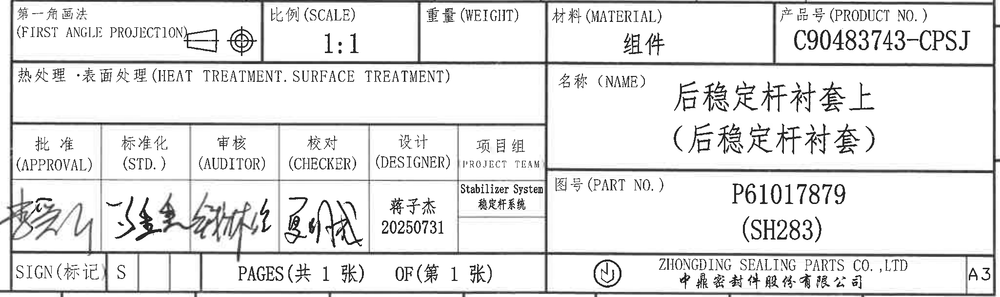

- 原图位置/视图名称：页面右下角，约列 10-16、行 J-L。
- object_kind：`title_block`
- bbox：`[2750, 2755, 4800, 3365]`

### 提取表格

| 提取项 | 原图数值或文本 | 含义说明 |
|---|---|---|
| 投影法 | 第一角画法 (FIRST ANGLE PROJECTION) | 标题栏投影法标识。 |
| 比例 | 1:1 | 图纸比例。 |
| 重量 | 空 | 原栏位未填写。 |
| 材料 | 组件 | 标题栏材料字段。 |
| 产品号 | C90483743-CPSJ | 产品编号。 |
| 热处理/表面处理 | 空 | 原栏位未填写。 |
| 名称 | 后稳定杆衬套上（后稳定杆衬套） | 零件/组件名称。 |
| 审批/标准化/审核/校对 | 手写签名 | 四个签核栏为手写签名，未转写为姓名。 |
| 设计 | 蒋子杰 20250731 | 设计人员和日期。 |
| 项目组 | Stabilizer System 稳定杆系统 | 项目组/系统。 |
| 图号 | P61017879 (SH283) | 图纸/零件图号。 |
| SIGN(标记) | S | 标记栏值。 |
| 页码 | PAGES(共 1 张) OF(第 1 张) | 总页数和当前页。 |
| 公司 | ZHONGDING SEALING PARTS CO., LTD / 中鼎密封件股份有限公司 | 出图公司。 |
| 图幅 | A3 | 图幅。 |

### 边界归属说明

裁切完整包含标题栏字段和下边框。底部紧贴图框坐标线，极少数字边缘不是标题栏内容，不提取。

## 裁切检查记录

| 对象 | 检查结果 | 边界处理 |
|---|---|---|
| object_1 | 完整包含 46.31±0.4 的尺寸线、箭头、文字和外形视图。 | 右下相邻引线残端不提取。 |
| object_2 | 完整包含表格外框、表头和 3 行数据。 | 无相邻视图混入。 |
| object_3 | 完整包含来源/客户版本空表。 | 右侧修订表未混入。 |
| object_4 | 完整包含修订表表头和两条修订记录。 | 右侧图框坐标 A/B 不属于表格。 |
| object_5 | 完整包含 φ22.8±0.3、A、刻字说明、R23.5±0.35、2×(8.0°)、2×(0.5) 的尺寸线和文字。 | 右侧/下方相邻剖面和中间局部视图片段只作边界说明，不提取。 |
| object_6 | 完整包含剖面尺寸线、剖面线、GD&T、基准 C 和右侧关键尺寸。 | 左侧刻字片段归属 object_5。 |
| object_7 | 完整包含原产国/材料/时间钟标识和中鼎内径区分标识引线。 | 顶部极小残线无文字尺寸，不提取。 |
| object_8 | 完整包含 φ23.6、三组标识加工说明和引线。 | 底部图框坐标已排除。 |
| object_9 | 完整包含技术要求 1-10 条。 | 底部公差表标题残边不提取。 |
| object_10 | 完整包含 DIN ISO 公差表标题、表头和 10 行数据。 | 右侧图框坐标 G/H/I 不提取。 |
| object_11 | 完整包含 BOM 标题、两条物料行和列名。 | 上方公差表残线/数字不提取；下方标题栏另裁。 |
| object_12 | 完整包含标题栏字段、公司名、页码和 A3。 | 底部紧贴图框坐标线不是标题栏字段，不提取。 |
