# 20C90483744 PDF 内容识别

整页 PNG：
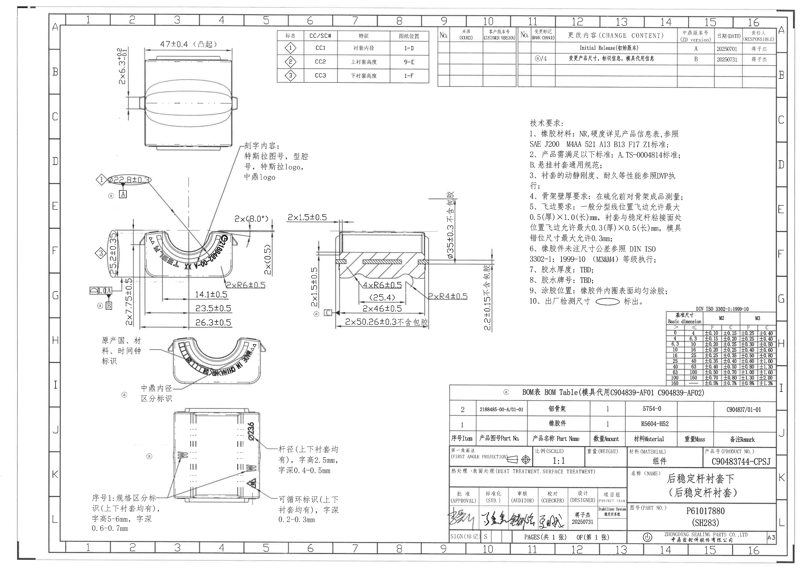

说明：PDF 为单页扫描图，整页先渲染为 PNG，再按加工视图、剖面视图、局部视图、表格、NOTES、标题栏分别裁切。以下按原图从上到下、从左到右的结构排列；括号内参考尺寸、直径符号、数量前缀、角度、半径、基准字母、公差和归属说明均逐项保留。

## object_1 特性/CC-SC 对照表

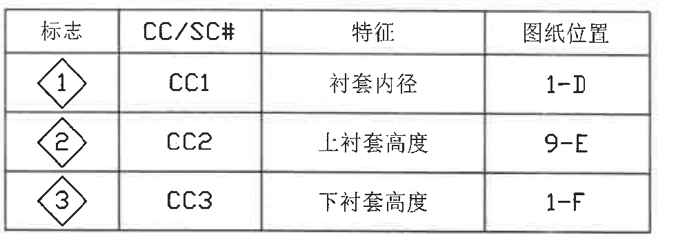

原图位置/视图名称：Page 1，上方中部，约 6-9/A-B 区域；object_kind=table。

原表还原：

| 标志 | CC/SC# | 特征 | 图纸位置 |
|---|---|---|---|
| ① | CC1 | 衬套内径 | 1-D |
| ② | CC2 | 上衬套高度 | 9-E |
| ③ | CC3 | 下衬套高度 | 1-F |

| 提取项 | 原图数值或文本 | 含义说明 |
|---|---|---|
| 标志 ① | CC1 / 衬套内径 / 1-D | 图中菱形 ① 对应衬套内径关键特性。 |
| 标志 ② | CC2 / 上衬套高度 / 9-E | 图中菱形 ② 对应上衬套高度。 |
| 标志 ③ | CC3 / 下衬套高度 / 1-F | 图中菱形 ③ 对应下衬套高度。 |

边界归属说明：裁切沿特性表外框，不包含右侧修订履历表；菱形编号仅解释图中对应标志，不替代各视图尺寸。

## object_2 修订履历表

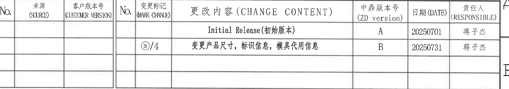

原图位置/视图名称：Page 1，上方右侧，约 10-16/A-B 区域；object_kind=table。

原表还原：

| No. | 来源(SOURCE) | 客户版本号(CUSTOMER VERSION) | No. | 变更标记(MARK CHANGE) | 更改内容(CHANGE CONTENT) | 中鼎版本号(ZD version) | 日期(DATE) | 责任人(RESPONSIBLE) |
|---|---|---|---|---|---|---|---|---|
|  |  |  |  |  | Initial Release(初始版本) | A | 20250701 | 蒋子杰 |
|  |  |  |  | ⓐ/4 | 变更产品尺寸，标识信息，模具代用信息 | B | 20250731 | 蒋子杰 |
|  |  |  |  |  |  |  |  |  |
|  |  |  |  |  |  |  |  |  |

| 提取项 | 原图数值或文本 | 含义说明 |
|---|---|---|
| 初始版本 | Initial Release(初始版本) / A / 20250701 / 蒋子杰 | 图纸中鼎版本 A 的初始发布记录。 |
| 变更记录 | ⓐ/4 / 变更产品尺寸，标识信息，模具代用信息 / B / 20250731 / 蒋子杰 | 图纸中鼎版本 B 的变更记录，变更标记对应图中 ⓐ。 |
| 空白列 | 来源、客户版本号、前两个 No. 等多处为空 | 原表空白字段按空白保留。 |

边界归属说明：裁切包含修订履历完整表头、两条记录和空白行；不包含左侧特性表。

## object_3 上方加工视图/外形视图

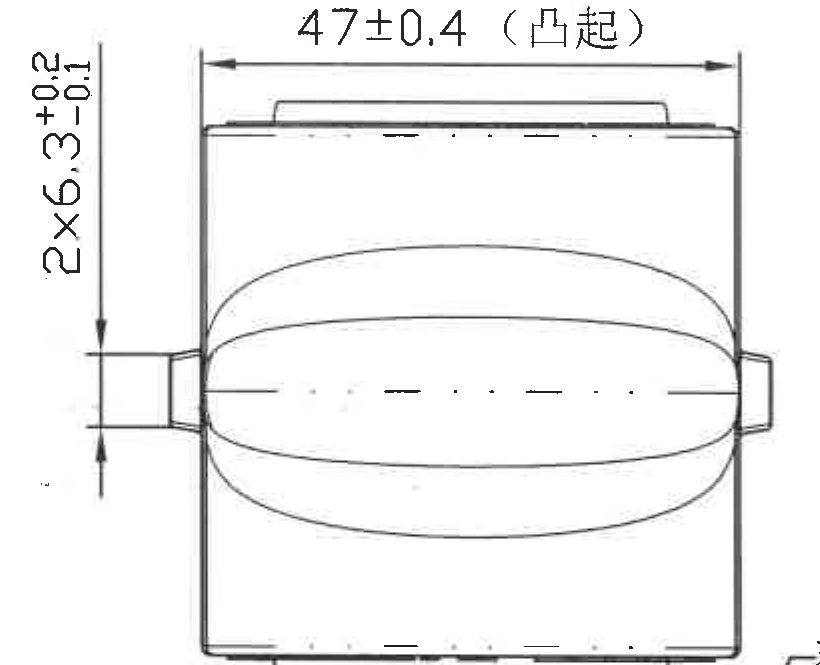

原图位置/视图名称：Page 1，左上，约 1-5/B-C 区域；object_kind=view。

| 提取项 | 原图数值或文本 | 含义说明 |
|---|---|---|
| 水平尺寸 | 47±0.4（凸起） | 上方凸起区域的水平宽度，公差 ±0.4。 |
| 竖向/侧向尺寸 | 2×6.3 +0.2/-0.1 | 两处相同尺寸，非对称公差，上偏差 +0.2、下偏差 -0.1。 |
| 关键尺寸星号 | 未见星号 | 当前视图未标出带星号关键尺寸。 |
| T 编号 | 未见独立 T 编号 | 当前视图无 T 编号标注。 |

边界归属说明：该裁切只提取上方外形视图的两组尺寸；下方主视图和右侧刻字说明不归入本对象。

## object_12 刻字内容说明

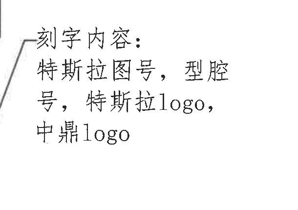

原图位置/视图名称：Page 1，中左上，主视图右上方；object_kind=notes。

| 提取项 | 原图数值或文本 | 含义说明 |
|---|---|---|
| 说明标题 | 刻字内容： | 该说明定义零件刻字内容。 |
| 刻字内容 | 特斯拉图号，型腔号，特斯拉logo，中鼎logo | 需要在零件刻字/标识中体现的内容。 |
| 引线 | 左侧引线连接至主视图区域 | 表示该说明对应主视图内弧向刻字位置。 |

边界归属说明：该对象为独立 notes/callout；主视图 object_4 中的弧向刻字按本说明理解，但尺寸提取仍归 object_4。

## object_4 主加工视图/正向开口视图

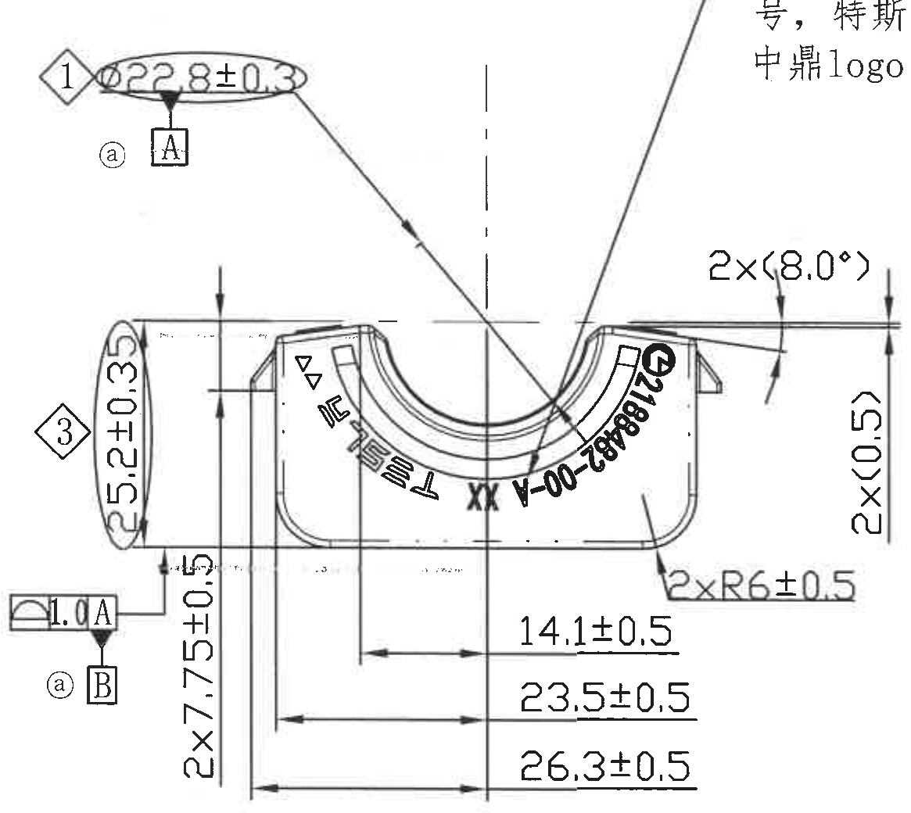

原图位置/视图名称：Page 1，左中，约 1-6/D-G 区域；object_kind=view。

| 提取项 | 原图数值或文本 | 含义说明 |
|---|---|---|
| 特性 ① / 直径 | Ø22.8±0.3 | 衬套内径，和特性表 CC1 对应；直径尺寸，公差 ±0.3。 |
| 基准 | A | Ø22.8±0.3 处建立/关联基准 A。 |
| 变更标记 | ⓐ | 图中该尺寸附近带 ⓐ 变更标记。 |
| 特性 ③ | 5.2±0.3 | 下衬套高度，和特性表 CC3 对应；公差 ±0.3。 |
| 几何公差 | 轮廓类符号 1.0 A | 图中几何公差框，公差值 1.0，相对于基准 A。 |
| 基准 | B | 下方基准标识 B，与左侧几何公差/位置控制相关。 |
| 竖向尺寸 | 2×7.75±0.5 | 两处相同高度/竖向尺寸，公差 ±0.5。 |
| 参考角度 | 2×(8.0°) | 两处参考角度；括号表示参考尺寸，不作为直接加工控制尺寸。 |
| 参考尺寸 | 2×(0.5) | 两处参考尺寸；括号表示参考含义。 |
| 半径 | 2×R6±0.5 | 两处圆角半径，公差 ±0.5。 |
| 水平尺寸 | 14.1±0.5 | 从中心/基准线至局部边界的水平尺寸，公差 ±0.5。 |
| 水平尺寸 | 23.5±0.5 | 从左侧相关边界至中心/局部边界的水平尺寸，公差 ±0.5。 |
| 水平尺寸 | 26.3±0.5 | 底部较大水平尺寸，公差 ±0.5。 |
| 弧向刻字 | TESLA、XX、2188485-00-A 等 | 沿内弧布置的刻字/图号信息；完整刻字内容说明见 object_12。 |
| 关键尺寸星号 | 未见星号 | 当前视图未标出带星号关键尺寸。 |
| T 编号 | 未见独立 T 编号 | 当前视图无 T 编号标注。 |

边界归属说明：本对象只提取主视图内尺寸、基准、几何公差和弧向刻字；剖面视图尺寸归 object_5，刻字内容说明完整文字归 object_12。矩形裁切上缘右侧可见独立刻字说明局部文字，不作为 object_4 提取项。

## object_5 剖面视图

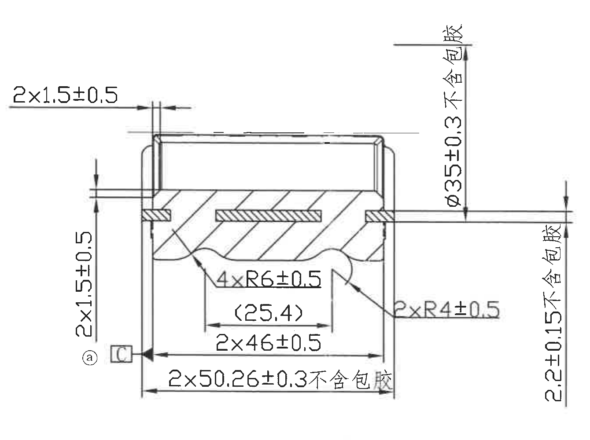

原图位置/视图名称：Page 1，中部，约 6-10/E-G 区域；object_kind=section。

| 提取项 | 原图数值或文本 | 含义说明 |
|---|---|---|
| 厚度/局部尺寸 | 2×1.5±0.5 | 两处相同尺寸，公差 ±0.5；左侧和上侧均可见对应尺寸线。 |
| 基准 | C | 剖面左下基准 C，旁有 ⓐ 变更标记。 |
| 直径/总高度 | Ø35±0.3 不含包胶 | 剖面外径/高度控制尺寸，明确“不含包胶”，公差 ±0.3。 |
| 竖向尺寸 | 2.2±0.15 不含包胶 | 右侧竖向尺寸，明确“不含包胶”，公差 ±0.15。 |
| 半径 | 4×R6±0.5 | 四处内凹圆角半径，公差 ±0.5。 |
| 参考尺寸 | (25.4) | 括号内参考尺寸，用于说明内侧间距，不作为直接加工控制尺寸。 |
| 水平尺寸 | 2×46±0.5 | 两处相同水平尺寸，公差 ±0.5。 |
| 总宽/包胶排除尺寸 | 2×50.26±0.3 不含包胶 | 两处相同总宽方向尺寸，明确“不含包胶”，公差 ±0.3。 |
| 半径 | 2×R4±0.5 | 两处圆角半径，公差 ±0.5。 |
| 关键尺寸星号 | 未见星号 | 当前剖面未标出带星号关键尺寸。 |
| T 编号 | 未见独立 T 编号 | 当前剖面无 T 编号标注。 |

边界归属说明：裁切只包含剖面视图和其尺寸线；右侧技术要求归 object_8，左侧主视图归 object_4。

## object_6 局部标识视图

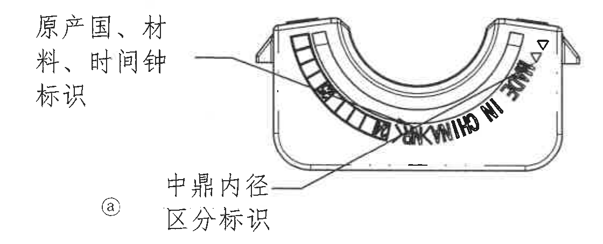

原图位置/视图名称：Page 1，左下中，约 1-6/H-I 区域；object_kind=detail。

| 提取项 | 原图数值或文本 | 含义说明 |
|---|---|---|
| 左侧说明 | 原产国、材料、时间钟标识 | 指向内弧左侧格状/标识区。 |
| 下方说明 | 中鼎内径区分标识 | 指向内弧下方区分标识位置。 |
| 弧向文字 | IN CHINA 等 | 按图示沿内弧布置的原产国/相关标识。 |
| 变更标记 | ⓐ | 与该局部标识相关的变更标记。 |
| 尺寸/公差 | 未标注 | 当前局部视图没有尺寸线、公差或 T 编号。 |

边界归属说明：裁切完整包含该局部标识视图和两条引线说明；不包含下方外观/标识视图。

## object_7 底部外观/标识视图

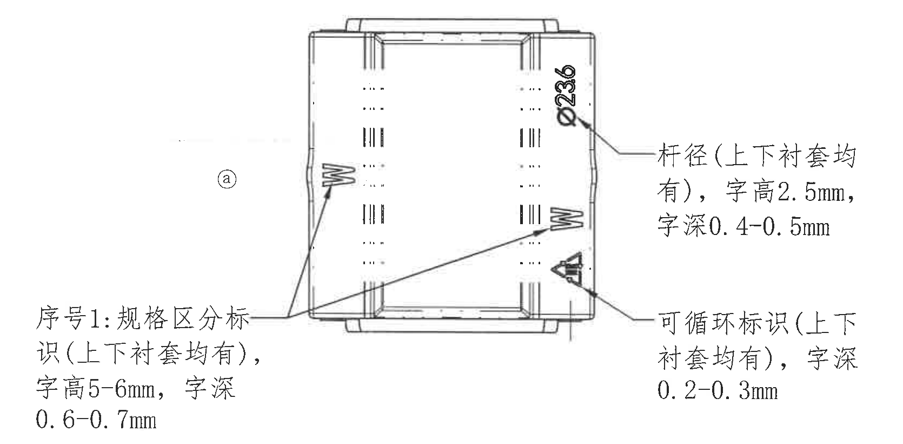

原图位置/视图名称：Page 1，左下，约 1-7/J-L 区域；object_kind=detail。

| 提取项 | 原图数值或文本 | 含义说明 |
|---|---|---|
| 杆径标识 | Ø236 | 图中竖排杆径/直径标识内容。 |
| 杆径说明 | 杆径（上下衬套均有），字高 2.5mm，字深 0.4-0.5mm | 上下衬套均需该杆径标识，规定字高和字深。 |
| 可循环标识 | 可循环标识（上下衬套均有），字深 0.2-0.3mm | 上下衬套均需该循环标识，规定字深。 |
| 序号 1 | 序号1：规格区分标识（上下衬套均有），字高 5-6mm，字深 0.6-0.7mm | 规格区分标识的序号、适用范围、字高和字深。 |
| 变更标记 | ⓐ | 与该标识视图相关的变更标记。 |
| T 编号 | 未见独立 T 编号 | 当前视图未见 T 编号。 |

边界归属说明：裁切完整包含底部外观视图、三处引出说明和引线；未包含底部图框坐标栏。

## object_8 技术要求 NOTES

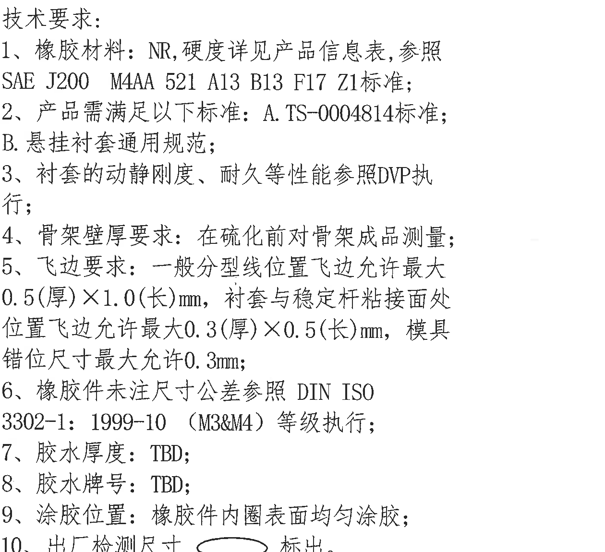

原图位置/视图名称：Page 1，右中，约 11-15/C-G 区域；object_kind=notes。

| 提取项 | 原图数值或文本 | 含义说明 |
|---|---|---|
| 1 | 橡胶材料：NR，硬度详见产品信息表，参照 SAE J200 M4AA 521 A13 B13 F17 Z1 标准； | 材料和硬度标准要求。 |
| 2 | 产品需满足以下标准：A. TS-0004814标准；B. 悬挂衬套通用规范； | 产品适用标准/规范。 |
| 3 | 衬套的动静刚度、耐久等性能参照DVP执行； | 性能验证依据。 |
| 4 | 骨架壁厚要求：在硫化前对骨架成品测量； | 骨架壁厚测量阶段要求。 |
| 5 | 飞边要求：一般分型线位置飞边允许最大0.5(厚)×1.0(长)mm，衬套与稳定杆粘接面处位置飞边允许最大0.3(厚)×0.5(长)mm，模具错位尺寸最大允许0.3mm； | 飞边厚度/长度和模具错位允许值。括号内“厚/长”为方向说明。 |
| 6 | 橡胶件未注尺寸公差参照 DIN ISO 3302-1:1999-10（M3&M4）等级执行； | 未注尺寸公差依据，关联 object_9 公差表。 |
| 7 | 胶水厚度：TBD； | 胶水厚度待定。 |
| 8 | 胶水牌号：TBD； | 胶水牌号待定。 |
| 9 | 涂胶位置：橡胶件内圈表面均匀涂胶； | 涂胶区域要求。 |
| 10 | 出厂检测尺寸（椭圆符号）标出。 | 出厂检测尺寸以椭圆圈标识。 |

边界归属说明：裁切完整包含技术要求 1-10 条；下方 DIN 公差表单独归 object_9。

## object_9 DIN ISO 3302-1:1999-10 公差表

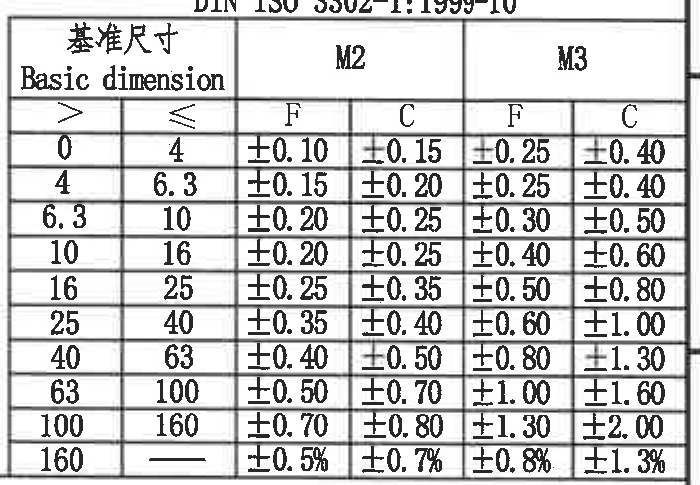

原图位置/视图名称：Page 1，右下中，约 14-16/G-I 区域；object_kind=table。

原表还原：

| 基准尺寸 Basic dimension > | 基准尺寸 Basic dimension ≤ | M2 F | M2 C | M3 F | M3 C |
|---|---|---|---|---|---|
| 0 | 4 | ±0.10 | ±0.15 | ±0.25 | ±0.40 |
| 4 | 6.3 | ±0.15 | ±0.20 | ±0.25 | ±0.40 |
| 6.3 | 10 | ±0.20 | ±0.25 | ±0.30 | ±0.50 |
| 10 | 16 | ±0.20 | ±0.25 | ±0.40 | ±0.60 |
| 16 | 25 | ±0.25 | ±0.35 | ±0.50 | ±0.80 |
| 25 | 40 | ±0.35 | ±0.40 | ±0.60 | ±1.00 |
| 40 | 63 | ±0.40 | ±0.50 | ±0.80 | ±1.30 |
| 63 | 100 | ±0.50 | ±0.70 | ±1.00 | ±1.60 |
| 100 | 160 | ±0.70 | ±0.80 | ±1.30 | ±2.00 |
| 160 | — | ±0.5% | ±0.7% | ±0.8% | ±1.3% |

| 提取项 | 原图数值或文本 | 含义说明 |
|---|---|---|
| 标准 | DIN ISO 3302-1:1999-10 | NOTES 第 6 条引用的未注尺寸公差标准。 |
| 等级列 | M2 F/C、M3 F/C | 不同等级/类别下的未注尺寸公差。 |
| 尺寸分档 | 0-4 至 160 以上 | 按基准尺寸范围查表。 |

边界归属说明：裁切只包含 DIN 公差表；上方技术要求归 object_8，下方 BOM 归 object_10。

## object_10 BOM 表

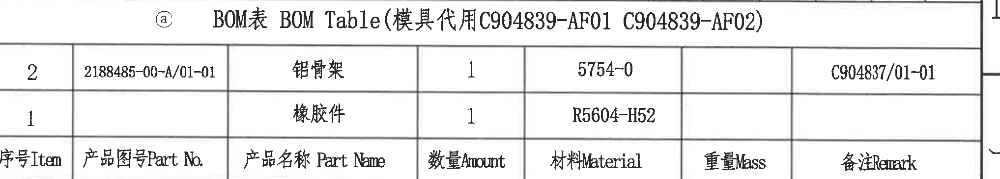

原图位置/视图名称：Page 1，右下，约 10-16/I-J 区域；object_kind=table。

原表还原：

| 序号 Item | 产品图号 Part No. | 产品名称 Part Name | 数量 Amount | 材料 Material | 重量 Mass | 备注 Remark |
|---|---|---|---|---|---|---|
| 2 | 2188485-00-A/01-01 | 铝骨架 | 1 | 5754-0 |  | C904837/01-01 |
| 1 |  | 橡胶件 | 1 | R5604-H52 |  |  |

表题：BOM表 BOM Table（模具代用 C904839-AF01 C904839-AF02）

| 提取项 | 原图数值或文本 | 含义说明 |
|---|---|---|
| 模具代用 | C904839-AF01、C904839-AF02 | BOM 表题中给出的模具代用信息。 |
| 铝骨架 | 2188485-00-A/01-01 / 1 / 5754-0 / C904837/01-01 | 铝骨架物料行。 |
| 橡胶件 | 数量 1 / R5604-H52 | 橡胶件物料行，产品图号和备注为空。 |

边界归属说明：裁切包含 BOM 表题、两条物料记录和完整表头；下方标题栏归 object_11。

## object_11 标题栏

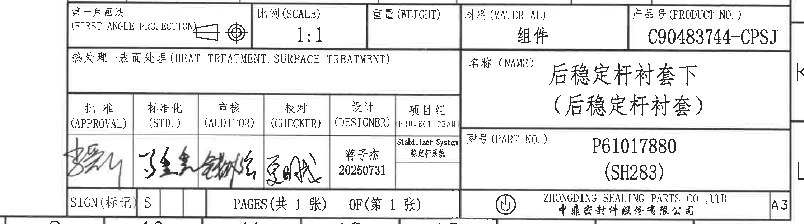

原图位置/视图名称：Page 1，右下角，约 9-16/J-L 区域；object_kind=title_block。

标题栏字段还原：

| 字段 | 原图文本 |
|---|---|
| 第一角画法 | 第一角画法 (FIRST ANGLE PROJECTION)，带投影视图符号 |
| 比例 (SCALE) | 1:1 |
| 重量 (WEIGHT) | 空白 |
| 材料 (MATERIAL) | 组件 |
| 产品号 (PRODUCT NO.) | C90483744-CPSJ |
| 热处理·表面处理 (HEAT TREATMENT, SURFACE TREATMENT) | 空白 |
| 名称 (NAME) | 后稳定杆衬套下（后稳定杆衬套） |
| 图号 (PART NO.) | P61017880 (SH283) |
| SIGN(标记) | S |
| PAGES | 共 1 张 |
| OF | 第 1 张 |
| 公司 | ZHONGDING SEALING PARTS CO., LTD / 中鼎密封件股份有限公司 |
| 幅面 | A3 |

签署/项目字段还原：

| 批准 (APPROVAL) | 标准化 (STD.) | 审核 (AUDITOR) | 校对 (CHECKER) | 设计 (DESIGNER) | 项目组 PROJECT TEAM |
|---|---|---|---|---|---|
| 手写签名 | 手写签名 | 手写签名 | 手写签名 | 蒋子杰 / 20250731 | Stabilizer System / 稳定杆系统 |

| 提取项 | 原图数值或文本 | 含义说明 |
|---|---|---|
| 图纸身份 | 产品号 C90483744-CPSJ；图号 P61017880 (SH283) | 图纸和产品识别信息。 |
| 名称 | 后稳定杆衬套下（后稳定杆衬套） | 零件/组件名称。 |
| 比例与材料 | 1:1；组件 | 制图比例和材料/组件属性。 |
| 签署 | 蒋子杰 / 20250731；其余为手写签名 | 设计和审批签署信息。 |

边界归属说明：标题栏裁切包含标题栏完整字段和签署栏；不包含上方 BOM 表内容，也不包含下方图框坐标数字。

## 裁切检查记录

| 对象 | 检查结果 | 完整性与边界说明 |
|---|---|---|
| page_1 | 通过 | 整页 PNG 已渲染，尺寸 4959×3505，图框完整。 |
| object_1 | 通过 | 特性表外框、表头、三行记录完整，无相邻表格文字混入。 |
| object_2 | 通过 | 修订履历表表头、记录、日期和责任人完整；未包含左侧特性表。 |
| object_3 | 通过 | 47±0.4 与 2×6.3 +0.2/-0.1 的文字、箭头和尺寸线完整；未提取下方主视图内容。 |
| object_12 | 通过 | 刻字内容说明文字完整；左侧仅为连接主视图的引线端。 |
| object_4 | 通过 | 主视图尺寸线、箭头、基准 A/B、特性 ①/③、几何公差框和底部水平尺寸完整；右上角可见刻字说明局部文字，完整说明归 object_12，本对象不提取该局部文字。 |
| object_5 | 通过 | 剖面尺寸线、箭头、剖面线、基准 C、参考尺寸和“不含包胶”竖排文字完整；已排除右侧技术要求文字。 |
| object_6 | 通过 | 局部标识视图和两条引线说明完整；已排除下方外观视图片段。 |
| object_7 | 通过 | 底部外观视图、Ø236、三处引线说明、字高/字深文本完整；未包含底部坐标栏。 |
| object_8 | 通过 | 技术要求 1-10 条和椭圆标识完整；下方 DIN 公差表不归入本对象。 |
| object_9 | 通过 | DIN 标题、表头和所有公差行完整；未包含 BOM 标题。 |
| object_10 | 通过 | BOM 标题、两行物料和表头完整；未包含标题栏字段。 |
| object_11 | 通过 | 标题栏第一角画法、比例、材料、产品号、名称、图号、签署栏、公司栏和 A3 完整；未包含下方坐标数字。 |

未见带星号的关键尺寸标注；未见独立 T 编号。括号内参考尺寸已在对应对象中列出并解释。
