# 20C90487851 内容识别结果

整页 PNG: `outputs/20C90487851_assets/images/page_1.png`

## object_1 - NOTES / 技术要求 1-7.3

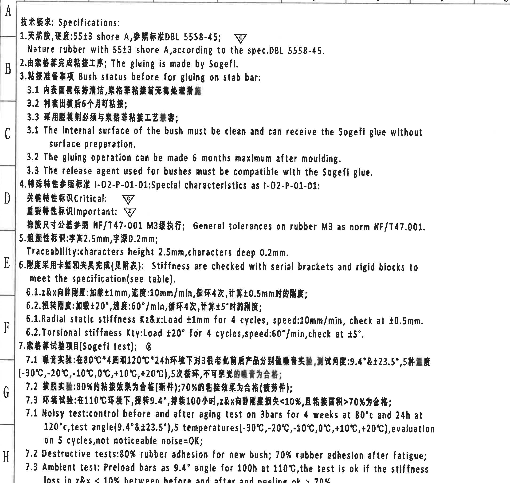

原图位置/视图名称: 页面左上至左中，图纸坐标约 A-H / 1-9，技术要求 / Specifications 1-7.3。

| 提取项 | 原图数值或文本 | 含义说明 |
|---|---|---|
| 1 材料硬度 | 天然胶，硬度: 55±3 shore A，参照标准 DBL 5558-45 / Nature rubber with 55±3 shore A, according to the spec. DBL 5558-45 | 橡胶材料及硬度要求，55±3 shore A 为硬度公差，DBL 5558-45 为参考标准。 |
| 2 粘接工序 | The gluing is made by Sogefi | 粘接工序由 Sogefi 完成。 |
| 3 粘接准备 | Bush status before for gluing on stab bar | 稳定杆衬套粘接前状态要求。 |
| 3.1 内表面 | The internal surface of the bush must be clean and can receive the Sogefi glue without surface preparation | 衬套内表面需清洁，粘接前无需额外表面处理。 |
| 3.2 时限 | 6 months maximum after moulding | 出模后最长 6 个月内可粘接。 |
| 3.3 脱模剂 | release agent used for bushes must be compatible with the Sogefi glue | 脱模剂必须与 Sogefi 胶兼容。 |
| 4 特殊特性 | I-02-P-01-01; Critical: C 三角; Important: I 三角 | 关键特性用 C 三角标识，重要特性用 I 三角标识。 |
| 一般公差 | General tolerances on rubber M3 as norm NF/T47.001 | 橡胶尺寸按 NF/T47.001 M3 级公差。 |
| 5 追溯标识 | characters height 2.5mm, characters deep 0.2mm | 追溯字符高 2.5mm、深 0.2mm。 |
| 6 刚度检查 | Stiffness are checked with serial brackets and rigid blocks to meet the specification (see table) | 刚度用系列卡箍和刚性块检查，数值见刚度表 object_8。 |
| 6.1 径向静刚度 | Kz&X: Load ±1mm for 4 cycles, speed 10mm/min, check at ±0.5mm | Z/X 向静刚度加载 ±1mm、4 循环、速度 10mm/min，在 ±0.5mm 处计算。 |
| 6.2 扭转刚度 | Kty: Load ±20° for 4 cycles, speed 60°/min, check at ±5° | 扭转刚度加载 ±20°、4 循环、速度 60°/min，在 ±5° 处计算。 |
| 7.1 噪音试验 | 80°C*4 周和 120°C*24h; test angle 9.4° & ±23.5°; temperatures -30°C,-20°C,-10°C,0°C,+10°C,+20°C; 5 cycles; noise=OK | 老化前后做噪音评价，含角度、温度和循环条件。 |
| 7.2 破胶试验 | 80% rubber adhesion for new bush; 70% rubber adhesion after fatigue | 新件粘接面积/效果 80% 合格，疲劳后 70% 合格。 |
| 7.3 环境试验 | 110°C, 9.4°, 100h; Z&X loss <10%; peeling ok >70% | 110°C 下预加载 100h，刚度损失和剥离面积作为判定条件。 |

边界归属说明: 本对象只提取 NOTES 1-7.3。第 8 条检验尺寸说明因紧邻下方标识局部图，单独作为 object_11。

## object_2 - 修订履历表 / Modification table

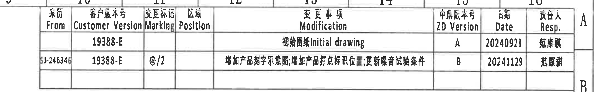

原图位置/视图名称: 页面右上，图纸坐标约 A-B / 10-16。

| From | Customer Version | Marking | Position | Modification | ZD Version | Date | Resp. |
|---|---|---|---|---|---|---|---|
|  | 19388-E |  |  | 初始图纸 Initial drawing | A | 20240928 | 范康谦 |
| SJ-246346 | 19388-E | ◎/2 |  | 增加产品对手示意图; 增加产品打点标识位置; 更新噪音试验条件 | B | 20241129 | 范康谦 |

| 提取项 | 原图数值或文本 | 含义说明 |
|---|---|---|
| 表格类型 | Modification | 修订履历。 |
| 客户版本 | 19388-E | 两条记录均为客户版本 19388-E。 |
| ZD Version | A, B | 图纸版本由 A 更新为 B。 |
| 日期 | 20240928, 20241129 | 两次修订日期。 |
| Marking | ◎/2 | 第二行更新标识。 |

边界归属说明: 裁切包含完整表头、两行记录和 Resp. 列；右侧 A/B 为图框边界字母，不作为修订字段。

## object_3 - 组合正视图：上、下支架半圆开口视图

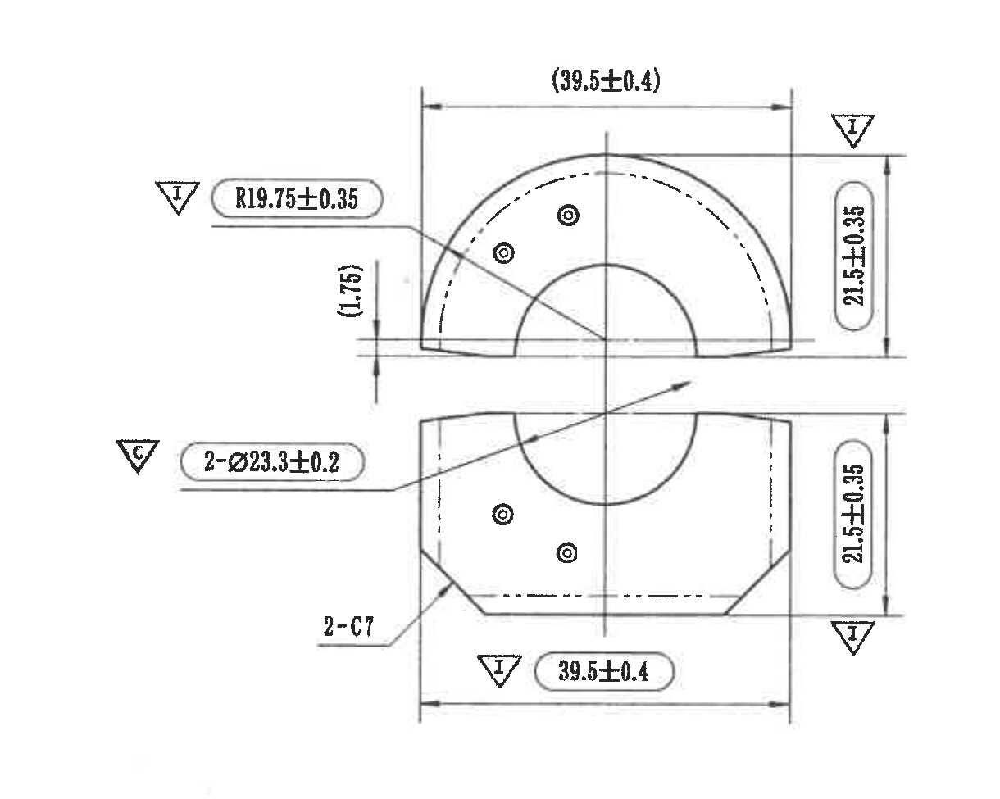

原图位置/视图名称: 页面中上偏右，图纸坐标约 C-E / 10-12。

| 提取项 | 原图数值或文本 | 含义说明 |
|---|---|---|
| 上半件横向总宽 | (39.5±0.4) | 括号内参考尺寸，表示上半件宽度参考值；带 I 重要特性标识。 |
| 上半圆外弧半径 | R19.75±0.35 | 半圆外弧半径尺寸，带 I 重要特性标识。 |
| 间隙/台阶参考 | (1.75) | 括号内参考尺寸，位于上下件分离处左侧。 |
| 上半件高度 | 21.5±0.35 | 右侧垂直高度尺寸，带 I 重要特性标识。 |
| 孔/销孔直径 | 2-Ø23.3±0.2 | 2 处直径 23.3±0.2，带 C 关键特性标识。 |
| 下半件高度 | 21.5±0.35 | 下半件右侧垂直高度，带 I 重要特性标识。 |
| 倒角 | 2-C7 | 下半件两处 C7 倒角。 |
| 下半件横向总宽 | 39.5±0.4 | 下半件宽度，带 I 重要特性标识。 |

边界归属说明: 上下半件中心孔和引出线共同构成此组合正视图。右侧两个侧视图归 object_4；下方局部侧视图的 `2-R2` 未纳入本对象。

## object_4 - 右侧上下侧视图

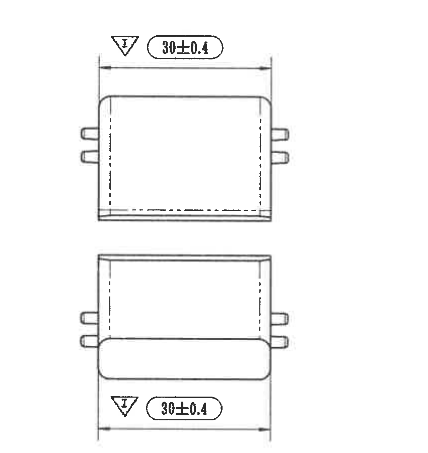

原图位置/视图名称: 页面右上中部，图纸坐标约 C-F / 14-15。

| 提取项 | 原图数值或文本 | 含义说明 |
|---|---|---|
| 上侧视图宽度 | 30±0.4 | 上侧视图横向宽度，带 I 重要特性标识。 |
| 下侧视图宽度 | 30±0.4 | 下侧视图横向宽度，带 I 重要特性标识。 |

边界归属说明: 两条 `30±0.4` 分别归属于上下侧视图；左侧组合正视图尺寸不归入本对象。

## object_5 - 局部侧视图：圆柱销/圆角尺寸

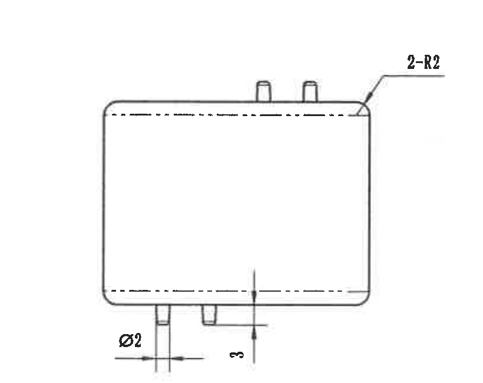

原图位置/视图名称: 页面中下偏右，图纸坐标约 F-H / 10-12。

| 提取项 | 原图数值或文本 | 含义说明 |
|---|---|---|
| 圆角 | 2-R2 | 右上位置两处 R2 圆角。 |
| 凸点直径 | Ø2 | 底部圆柱销/凸点直径。 |
| 凸点高度/位置 | 3 | 底部凸点伸出高度或位置尺寸。 |

边界归属说明: 裁切只包含该局部侧视图。右侧 Mould lower/upper side 局部图归 object_6。

## object_6 - 局部视图：Mould lower side / Mould upper side 打点位置

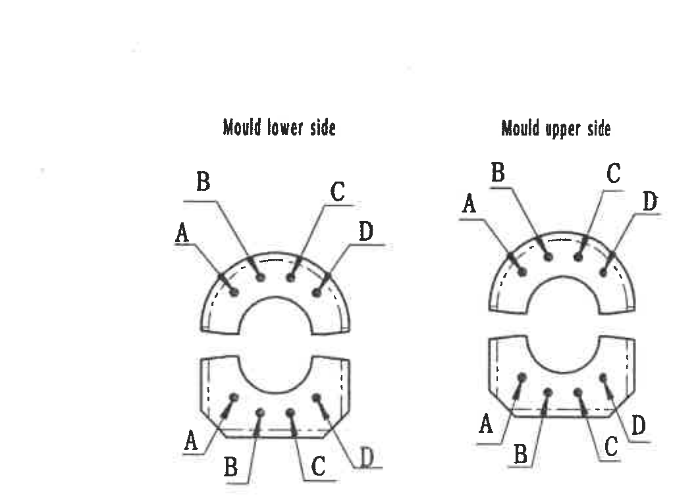

原图位置/视图名称: 页面右中下，图纸坐标约 G-H / 13-16。

| 提取项 | 原图数值或文本 | 含义说明 |
|---|---|---|
| 下模侧 | Mould lower side | 左侧局部图，表示下模侧打点位置。 |
| 下模侧位置代号 | A, B, C, D | 上、下半圆各标注 A/B/C/D 的打点位置。 |
| 上模侧 | Mould upper side | 右侧局部图，表示上模侧打点位置。 |
| 上模侧位置代号 | A, B, C, D | 上、下半圆各标注 A/B/C/D 的打点位置。 |

边界归属说明: 该对象为打点/位置局部图，不含尺寸数值；左侧局部侧视图和下方标题栏不归入本对象。

## object_7 - 局部视图：标识内容与打点标识蓝色

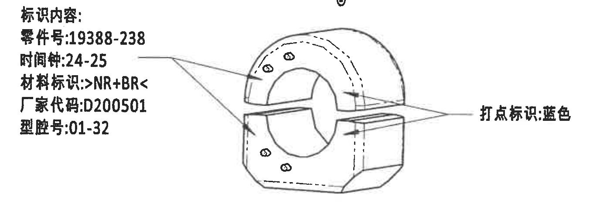

原图位置/视图名称: 页面左下中部，图纸坐标约 I-J / 3-7。

| 提取项 | 原图数值或文本 | 含义说明 |
|---|---|---|
| 标识内容 | 标识内容 | 左侧文字说明区域标题。 |
| 零件号 | 19388-238 | 产品/零件标识。 |
| 时间钟 | 24-25 | 时间钟标识内容。 |
| 材料标识 | >NR+BR< | 材料标识。 |
| 厂家代码 | D200501 | 厂家代码。 |
| 型腔号 | 01-32 | 模具型腔号。 |
| 打点标识 | 蓝色 | 右侧箭头指示打点标识颜色为蓝色。 |

边界归属说明: 上方第 8 条 NOTES 已单独作为 object_11；顶部圈号贴近边界但未混入其他文本。此处只提取标识局部图及其左右说明。

## object_8 - Stiffness requirement 刚度要求表

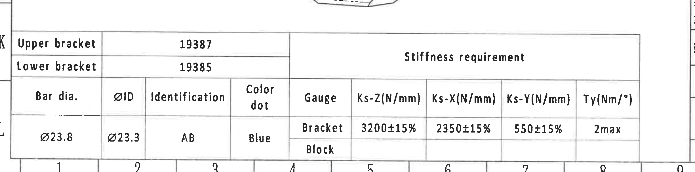

原图位置/视图名称: 页面左下，图纸坐标约 K-L / 1-9。

| Upper bracket | 19387 |  | Stiffness requirement |  |  |  |  |  |
|---|---|---|---|---|---|---|---|---|
| Lower bracket | 19385 |  |  |  |  |  |  |  |
| Bar dia. | ØID | Identification | Color dot | Gauge | Ks-Z(N/mm) | Ks-X(N/mm) | Ks-Y(N/mm) | Ty(Nm/°) |
| Ø23.8 | Ø23.3 | AB | Blue | Bracket | 3200±15% | 2350±15% | 550±15% | 2max |
| Ø23.8 | Ø23.3 | AB | Blue | Block |  |  |  |  |

| 提取项 | 原图数值或文本 | 含义说明 |
|---|---|---|
| Upper bracket | 19387 | 上支架编号。 |
| Lower bracket | 19385 | 下支架编号。 |
| Bar dia. | Ø23.8 | 稳定杆直径。 |
| ØID | Ø23.3 | 内径。 |
| Identification | AB | 标识代号。 |
| Color dot | Blue | 色点为蓝色。 |
| Bracket 刚度 | Ks-Z 3200±15%; Ks-X 2350±15%; Ks-Y 550±15%; Ty 2max | 支架状态下的刚度要求和扭转刚度上限。 |
| Block 行 | Block 后续刚度列为空白 | 原表中 Block 行未填写刚度数值，按空白还原。 |

边界归属说明: 表格完整包含 Ty(Nm/°) 右端列和 Block 行；上方邻近视图尾部不作为表格内容提取。

## object_9 - NF/T 47-001 CLASS M3 橡胶一般公差表

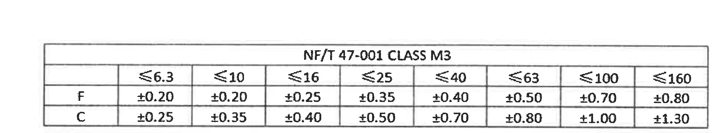

原图位置/视图名称: 页面右下标题栏上方，图纸坐标约 J / 10-15。

| NF/T 47-001 CLASS M3 | ≤6.3 | ≤10 | ≤16 | ≤25 | ≤40 | ≤63 | ≤100 | ≤160 |
|---|---|---|---|---|---|---|---|---|
| F | ±0.20 | ±0.20 | ±0.25 | ±0.35 | ±0.40 | ±0.50 | ±0.70 | ±0.80 |
| C | ±0.25 | ±0.35 | ±0.40 | ±0.50 | ±0.70 | ±0.80 | ±1.00 | ±1.30 |

| 提取项 | 原图数值或文本 | 含义说明 |
|---|---|---|
| 标准等级 | NF/T 47-001 CLASS M3 | 橡胶尺寸一般公差标准和等级。 |
| 尺寸范围 | ≤6.3 至 ≤160 | 表头为不同尺寸段。 |
| F 行 | ±0.20, ±0.20, ±0.25, ±0.35, ±0.40, ±0.50, ±0.70, ±0.80 | F 类公差。 |
| C 行 | ±0.25, ±0.35, ±0.40, ±0.50, ±0.70, ±0.80, ±1.00, ±1.30 | C 类公差。 |

边界归属说明: 裁切包含完整公差表及右端 ≤160 列；下方标题栏归 object_10。

## object_10 - 标题栏 / Title block

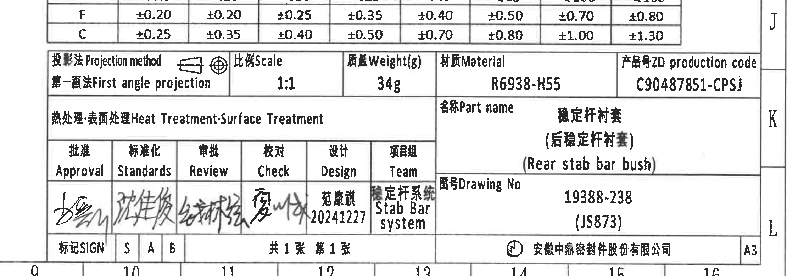

原图位置/视图名称: 页面右下角，图纸坐标约 J-L / 10-16。

| 提取项 | 原图数值或文本 | 含义说明 |
|---|---|---|
| Projection method | First angle projection | 第一角法投影。 |
| Scale | 1:1 | 图纸比例。 |
| Weight(g) | 34g | 单件重量。 |
| Material | R6938-H55 | 材料牌号。 |
| ZD production code | C90487851-CPSJ | 产品号 / 生产代码。 |
| Heat Treatment / Surface Treatment | 空白 | 原栏位未填写具体处理内容。 |
| Part name | 稳定杆衬套 (后稳定杆衬套) / Rear stab bar bush | 零件名称。 |
| Drawing No | 19388-238 (JS873) | 图号。 |
| Approval | 手签 | 批准栏。 |
| Standards | 手签 | 标准化栏。 |
| Review | 手签 | 审批/评审栏。 |
| Check | 手签 | 校对栏。 |
| Design | 范康谦 20241227 | 设计人员及日期。 |
| Team | 稳定杆系统 / Stab Bar system | 项目组。 |
| Sheet | 共1张 第1张 | 共 1 张，第 1 张。 |
| Company | 安徽中鼎密封件股份有限公司 | 出图单位。 |
| Format | A3 | 图幅。 |

边界归属说明: 为完整包含产品代码、公司和 A3 图幅，裁切顶部带有公差表底边；公差表字段只在 object_9 提取，标题栏只提取本栏位内容。

## object_11 - NOTES 第 8 条：检验尺寸标识

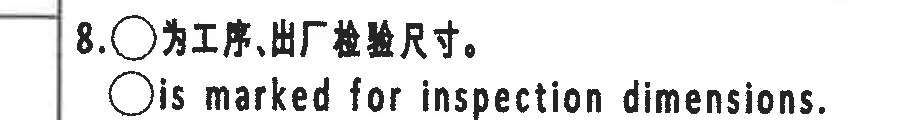

原图位置/视图名称: 页面左中下，图纸坐标约 I / 1-4，NOTES 第 8 条。

| 提取项 | 原图数值或文本 | 含义说明 |
|---|---|---|
| 检验尺寸标识 | 8. ○ 为工序、出厂检验尺寸。 | 圆圈标注表示工序/出厂检验尺寸。 |
| 检验尺寸英文说明 | ○ is marked for inspection dimensions. | 与中文同义，说明圆圈用于标识检验尺寸。 |

边界归属说明: 本对象只提取 NOTES 第 8 条。上方 7.3 末行与第 8 条距离极近，裁切顶边残影不归入本对象；下方标识局部图归 object_7。

## 裁切检查记录

| 对象 | 检查结果 |
|---|---|
| object_1 NOTES 1-7.3 | 文字完整；第 8 条因与下方局部图紧邻，拆分到 object_11。 |
| object_2 修订表 | 表头、两行记录、Resp. 列完整；右侧图框字母仅作边界。 |
| object_3 组合正视图 | 尺寸线、箭头、括号参考尺寸、C/I 标识完整；已重裁排除下方 `2-R2` 片段。 |
| object_4 右侧上下侧视图 | 两条 `30±0.4` 的尺寸线、箭头和文字完整；下方标注框已通过扩底保留。 |
| object_5 局部侧视图 | `2-R2` 引出线、`Ø2`、`3` 尺寸线和文字完整；未带入右侧模具面图。 |
| object_6 模具上下侧局部图 | Mould lower side / Mould upper side 及 A/B/C/D 引线完整；已重裁补全右侧上模图。 |
| object_7 标识局部图 | 标识内容、局部示意和蓝色打点说明完整；上方第 8 条 NOTES 已单独裁切。 |
| object_8 刚度表 | 表头、Ty(Nm/°) 右端列和 Block 行完整；原表 Block 行数值为空白。 |
| object_9 公差表 | NF/T47-001 CLASS M3、F 行、C 行及 `≤160` 列完整；已重裁补全右端和底部。 |
| object_10 标题栏 | 产品代码、图号、材料、重量、签核栏、公司和 A3 图幅完整；顶部相邻公差表底边不作为标题栏内容提取。 |
| object_11 NOTES 第 8 条 | 两行第 8 条说明完整；顶边有上一行极少残影，按边界归属不提取。 |
