# 20C90487951.pdf 内容识别与裁切提取

## 整页渲染

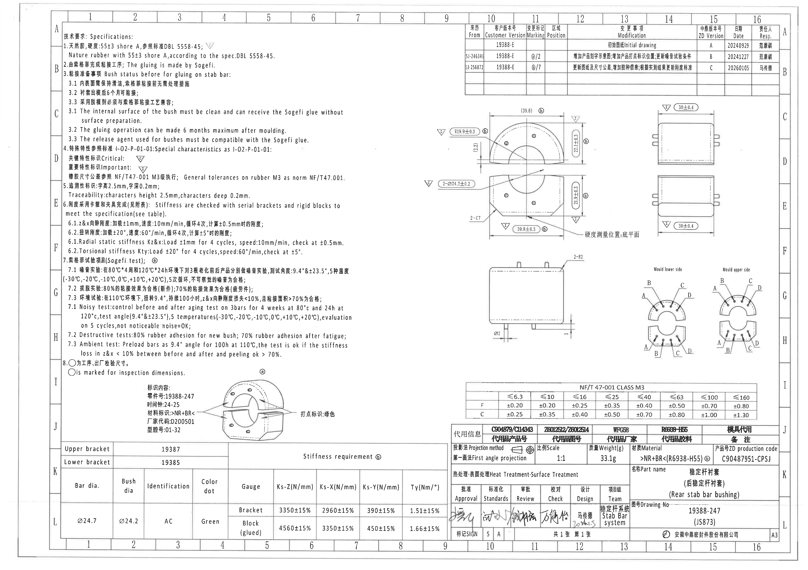

- 原始 PDF: `input/20C90487951.pdf`
- 整页 PNG: `outputs/20C90487951_assets/images/page_1.png`
- 页面像素: 4959 x 3505
- 说明: 以下裁切对象按原图空间顺序记录，不对原图结构做主观重排。

## object_1 - 技术要求 / Specifications / NOTES

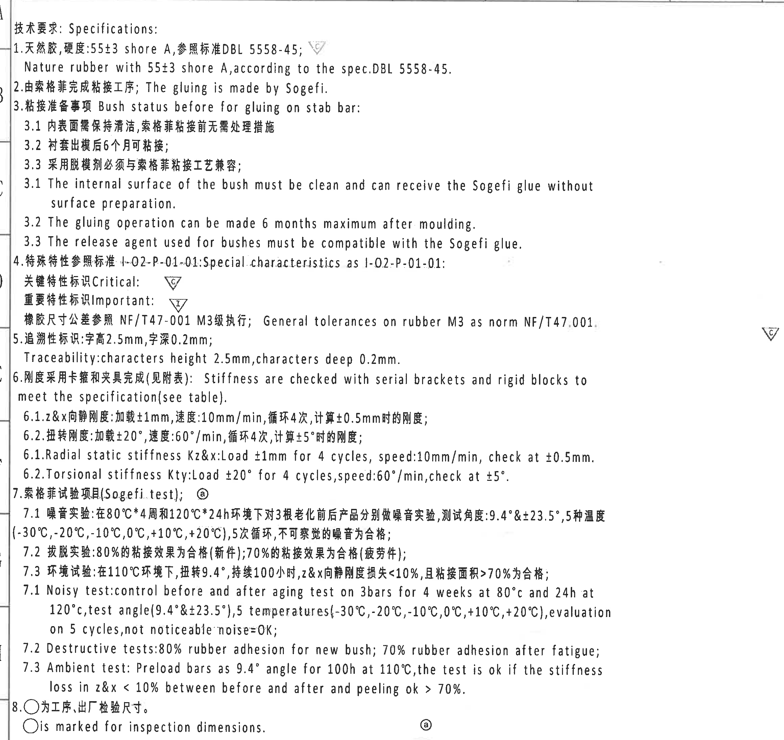

- 原图位置/视图名称: 页面左上至左中区域，坐标约 x=350-2670, y=140-2330 / 技术要求 / Specifications / NOTES
- object_kind: `notes`
- bbox: `[350, 140, 2670, 2330]`

### 提取表格

| 提取项 | 原图数值或文本 | 含义说明 |
| --- | --- | --- |
| 标题 | 技术要求: Specifications: | 说明该区域为技术要求/备注说明。 |
| 1 | 天然胶, 硬度:55±3 shore A, 参照标准 DBL 5558-45; Nature rubber with 55±3 shore A, according to the spec. DBL 5558-45. | 规定材料为天然胶，硬度 55±3 Shore A，并引用 DBL 5558-45。 |
| 2 | 由索格菲完成粘接工序; The gluing is made by Sogefi. | 规定粘接工序由 Sogefi 完成。 |
| 3 | 粘接准备事项 Bush status before for gluing on stab bar: | 以下为稳定杆粘接前衬套状态要求。 |
| 3.1 | 内表面需保持清洁, 索格菲粘接前无需处理措施 | 衬套内表面清洁即可，不需额外表面处理。 |
| 3.2 | 衬套出模后6个月可粘接 | 出模后最长 6 个月内可进行粘接。 |
| 3.3 | 采用脱模剂必须与索格菲粘接工艺兼容 | 脱模剂需与 Sogefi 胶粘工艺兼容。 |
| 3.1 English | The internal surface of the bush must be clean and can receive the Sogefi glue without surface preparation. | 英文重复说明 3.1 内表面清洁要求。 |
| 3.2 English | The gluing operation can be made 6 months maximum after moulding. | 英文重复说明出模后 6 个月内可粘接。 |
| 3.3 English | The release agent used for bushes must be compatible with the Sogefi glue. | 英文重复说明脱模剂兼容要求。 |
| 4 | 特殊特性参照标准 I-02-P-01-01; Special characteristics as I-02-P-01-01: | 规定特殊特性参考文件。 |
| 关键特性标识 | Critical: △C | 三角 C 为关键特性标识。 |
| 重要特性标识 | Important: △I | 三角 I 为重要特性标识。 |
| 通用公差 | 橡胶尺寸公差参照 NF/T47-001 M3级执行; General tolerances on rubber M3 as norm NF/T47.001. | 橡胶尺寸未单独标注公差时按 NF/T47-001 M3。 |
| 5 | 追溯性标识: 字高2.5mm, 字深0.2mm; Traceability: characters height 2.5mm, characters deep 0.2mm. | 追溯字符的高度和深度要求。 |
| 6 | 刚度采用卡箍和夹具完成(见附表); Stiffness are checked with serial brackets and rigid blocks to meet the specification (see table). | 刚度检测采用系列卡箍和刚性块，具体数值见刚度表。 |
| 6.1 | Z&X向静刚度: 加载±1mm, 速度:10mm/min, 循环4次, 计算±0.5mm时的刚度; Radial static stiffness Kz&x: Load ±1mm for 4 cycles, speed:10mm/min, check at ±0.5mm. | 径向 Z/X 静刚度检测条件。 |
| 6.2 | 扭转刚度: 加载±20°, 速度:60°/min, 循环4次, 计算±5°时的刚度; Torsional stiffness Kty: Load ±20° for 4 cycles, speed:60°/min, check at ±5°. | 扭转刚度检测条件。 |
| 7 | 索格菲试验项目 (Sogefi test): ○a | 试验项目标识为圆圈 a。 |
| 7.1 | 噪音实验: 在80°C*4周和120°C*24h环境下对3根老化前后产品分别做噪音实验, 测试角度:9.4°&±23.5°, 5种温度(-30°C,-20°C,-10°C,0°C,+10°C,+20°C), 5次循环, 不可察觉的噪音为合格; Noisy test: control before and after aging test on 3 bars for 4 weeks at 80°C and 24h at 120°C, test angle (9.4° & ±23.5°), 5 temperatures (-30°C,-20°C,-10°C,0°C,+10°C,+20°C), evaluation on 5 cycles, not noticeable noise=OK. | 噪音试验条件和合格判定。 |
| 7.2 | 拔脱实验: 80%的粘接效果为合格(新件); 70%的粘接效果为合格(疲劳件); Destructive tests: 80% rubber adhesion for new bush; 70% rubber adhesion after fatigue. | 破坏/拔脱试验的粘接面积合格比例。 |
| 7.3 | 环境试验: 在110°C环境下, 扭转9.4°, 持续100小时, Z&X向静刚度损失<10%, 且粘接面积>70%为合格; Ambient test: Preload bars as 9.4° angle for 100h at 110°C, the test is OK if the stiffness loss in z&x < 10% between before and after and peeling ok > 70%. | 环境试验条件和刚度/粘接判定。 |
| 8 | ○ 为工序、出厂检验尺寸。○ is marked for inspection dimensions. | 圆圈标记的尺寸为工序/出厂检验尺寸。 |

### 边界归属说明

裁切仅覆盖左侧 NOTES 文本区；右侧主加工视图的尺寸框未纳入。本区内三角 C/I 和圆圈 a 为 NOTES 对特殊特性/试验项目的说明符号，归属于 NOTES。

## object_2 - 修订履历表 / Modification history

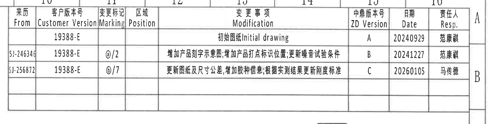

- 原图位置/视图名称: 页面右上角，坐标约 x=2820-4870, y=120-640 / 修订履历表 / Modification history
- object_kind: `table`
- bbox: `[2820, 120, 4870, 640]`

### 原表还原

| From | Customer Version | Marking | Position | Modification | ZD Version | Date | Resp. |
| --- | --- | --- | --- | --- | --- | --- | --- |
|  | 19388-E |  |  | 初始图纸 Initial drawing | A | 20240929 | 范广祺 |
| SJ-246346 | 19388-E | ⓐ/2 |  | 增加产品刻字示意图; 增加产品打点标识位置; 更新噪音试验条件 | B | 20241227 | 范广祺 |
| SJ-256872 | 19388-E | ⓑ/7 |  | 更新图纸及尺寸公差; 增加胶种信息; 根据实测结果更新刚度标准 | C | 20260105 | 马传德 |

### 提取表格

| 提取项 | 原图数值或文本 | 含义说明 |
| --- | --- | --- |
| 表头 | From \| Customer Version \| Marking \| Position \| Modification \| ZD Version \| Date \| Resp. | 修订记录列名。 |
| 行 1 | From 空白; Customer Version 19388-E; Marking 空白; Position 空白; Modification 初始图纸 / Initial drawing; ZD Version A; Date 20240929; Resp. 范广祺 | 初版发行记录。 |
| 行 2 | From SJ-246346; Customer Version 19388-E; Marking ⓐ/2; Position 空白; Modification 增加产品刻字示意图; 增加产品打点标识位置; 更新噪音试验条件; ZD Version B; Date 20241227; Resp. 范广祺 | B 版修订，涉及标识示意和噪音试验条件。 |
| 行 3 | From SJ-256872; Customer Version 19388-E; Marking ⓑ/7; Position 空白; Modification 更新图纸及尺寸公差; 增加胶种信息; 根据实测结果更新刚度标准; ZD Version C; Date 20260105; Resp. 马传德 | C 版修订，涉及尺寸公差、胶种信息和刚度标准。 |

### 边界归属说明

裁切包含完整修订表表头、三条修订记录及空白行；右侧图框字母 A/B 仅为边框坐标，不作为表格字段提取。

## object_3 - 主加工视图 / 正面半圆与下座组合视图

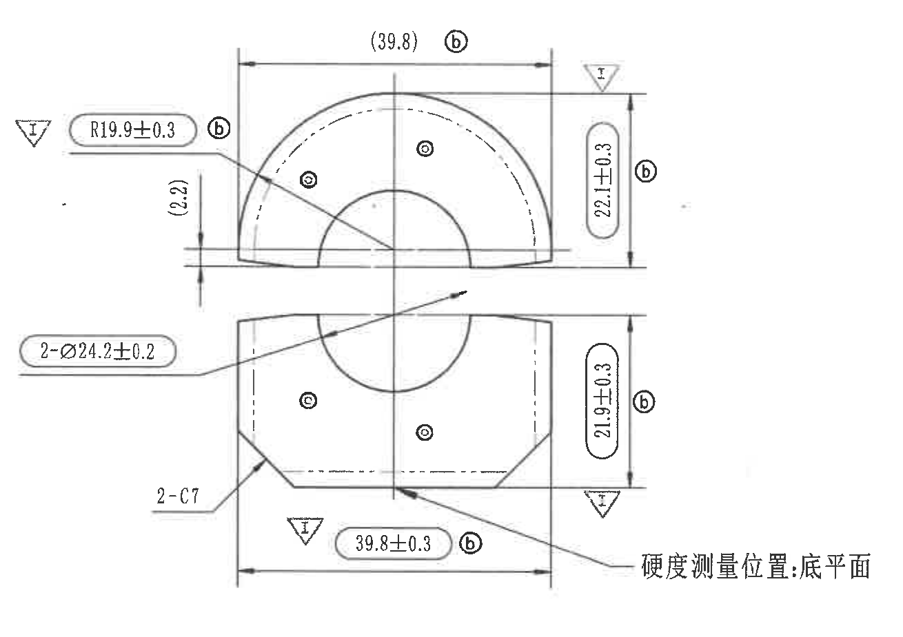

- 原图位置/视图名称: 页面中右部，坐标约 x=2660-3970, y=620-1545 / 主加工视图 / 正面半圆与下座组合视图
- object_kind: `view`
- bbox: `[2660, 620, 3970, 1545]`

### 提取表格

| 提取项 | 原图数值或文本 | 含义说明 |
| --- | --- | --- |
| 参考总宽 | (39.8) ⓑ | 上半圆外侧左右边界的参考宽度，括号表示参考尺寸，关联修订标识 b。 |
| 半径 | R19.9±0.3 ⓑ | 上半圆外圆半径及公差，带重要特性三角 I，关联修订标识 b。 |
| 参考局部高度 | (2.2) | 上半圆左侧从底边到局部水平线的参考高度，括号表示参考尺寸。 |
| 上部高度 | 22.1±0.3 ⓑ | 上半圆视图右侧整体高度尺寸，带公差，关联修订标识 b。 |
| 孔/衬套直径 | 2-Ø24.2±0.2 | 上下两处直径为 Ø24.2 的孔/衬套相关尺寸，数量前缀 2 表示两处。 |
| 倒角 | 2-C7 | 下座两侧倒角 C7，两处。 |
| 下部高度 | 21.9±0.3 ⓑ | 下座视图右侧整体高度尺寸，带公差，关联修订标识 b。 |
| 下部总宽 | 39.8±0.3 ⓑ | 下座外侧左右边界总宽，带公差，关联修订标识 b。 |
| 重要特性标识 | △I | 与 R19.9±0.3 和 39.8±0.3 相关的重要特性标识。 |
| 硬度测量位置 | 硬度测量位置: 底平面 | 引出线指向下座底平面，说明硬度测量位置在底平面。 |
| 圆圈检查标识 | 若干 ○ 标记 | 图中小圆圈标记与 NOTES 第8条对应，为工序/出厂检验相关尺寸或点位标记。 |

### 边界归属说明

裁切覆盖上下主加工轮廓、中心孔、左右/上下尺寸线和硬度测量位置引出文字；右侧侧视图轮廓已排除，右侧边界处只保留属于主视图的垂直尺寸和引出线。

## object_4 - 右上侧视图 / 上件宽度视图

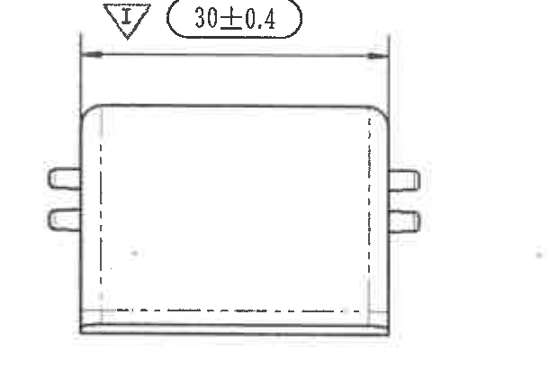

- 原图位置/视图名称: 页面右上主视图右侧，坐标约 x=3950-4560, y=640-1060 / 右上侧视图 / 上件宽度视图
- object_kind: `view`
- bbox: `[3950, 640, 4560, 1060]`

### 提取表格

| 提取项 | 原图数值或文本 | 含义说明 |
| --- | --- | --- |
| 宽度 | 30±0.4 | 上件侧向宽度/深度尺寸，带 ±0.4 公差。 |
| 重要特性标识 | △I | 该宽度尺寸附近的重要特性标识。 |
| 侧面凸耳 | 左右两侧各两处凸出结构 | 侧视图显示两侧凸耳/打点结构的侧向位置关系，无单独数值尺寸。 |

### 边界归属说明

裁切包含上方侧视轮廓及 30±0.4 水平尺寸线；下方另一侧视图的主体已排除，底部仅保留本视图底边线。

## object_5 - 右中侧视图 / 下件宽度视图

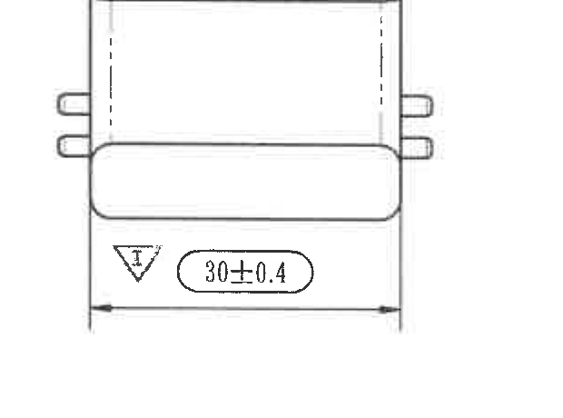

- 原图位置/视图名称: 页面右中部，上方侧视图下方，坐标约 x=3940-4560, y=1090-1550 / 右中侧视图 / 下件宽度视图
- object_kind: `view`
- bbox: `[3940, 1090, 4560, 1550]`

### 提取表格

| 提取项 | 原图数值或文本 | 含义说明 |
| --- | --- | --- |
| 宽度 | 30±0.4 | 下件侧向宽度/深度尺寸，带 ±0.4 公差。 |
| 重要特性标识 | △I | 该宽度尺寸附近的重要特性标识。 |
| 侧面凸耳 | 左右两侧各两处凸出结构 | 侧视图显示凸耳/打点结构侧向位置关系。 |

### 边界归属说明

裁切仅包含下方侧视轮廓及其 30±0.4 尺寸线；上方侧视图底边未纳入。

## object_6 - 下方侧面尺寸视图 / 凸耳与圆角尺寸

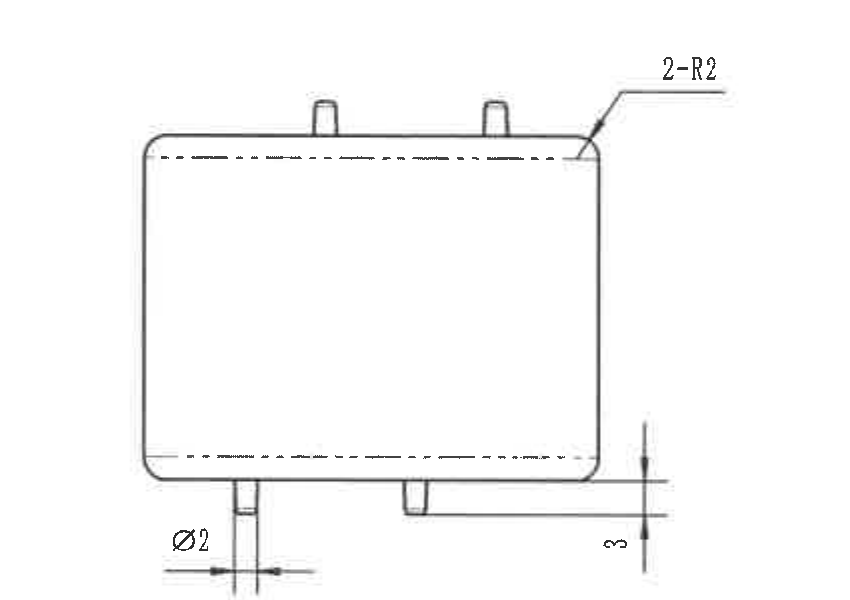

- 原图位置/视图名称: 页面中下部，坐标约 x=2860-3710, y=1510-2110 / 下方侧面尺寸视图 / 凸耳与圆角尺寸
- object_kind: `view`
- bbox: `[2860, 1510, 3710, 2110]`

### 提取表格

| 提取项 | 原图数值或文本 | 含义说明 |
| --- | --- | --- |
| 圆角 | 2-R2 | 右上角圆角 R2，两处。 |
| 凸耳直径/宽度 | Ø2 | 底部左侧凸耳的直径或宽度尺寸为 Ø2。 |
| 底部高度 | 3 | 右下方底部至参考水平线的高度/台阶尺寸为 3。 |
| 轮廓 | 虚线内轮廓 | 虚线表示隐藏或内部轮廓位置。 |

### 边界归属说明

裁切包含矩形侧视轮廓、上侧凸耳、右上圆角引线、底部凸耳及其尺寸；未包含右侧模具侧局部图。

## object_7 - 局部视图 / Mould lower side

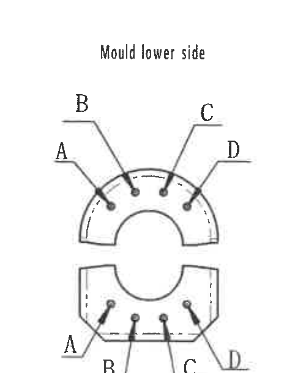

- 原图位置/视图名称: 页面右下中部左侧局部图，坐标约 x=3850-4350, y=1570-2180 / 局部视图 / Mould lower side
- object_kind: `detail`
- bbox: `[3850, 1570, 4350, 2180]`

### 提取表格

| 提取项 | 原图数值或文本 | 含义说明 |
| --- | --- | --- |
| 视图名称 | Mould lower side | 模具下侧点位/标识布置图。 |
| 上半部点位 | A, B, C, D | 上半圆四个点位分别由 A/B/C/D 引线标注。 |
| 下半部点位 | A, B, C, D | 下座四个点位分别由 A/B/C/D 引线标注。 |
| 含义 | 字母点位分布 | 用于区分模具下侧各打点/标记位置，未给数值尺寸。 |

### 边界归属说明

裁切仅包含 Mould lower side 局部图及 A/B/C/D 引线；右侧 Mould upper side 已分离。

## object_8 - 局部视图 / Mould upper side

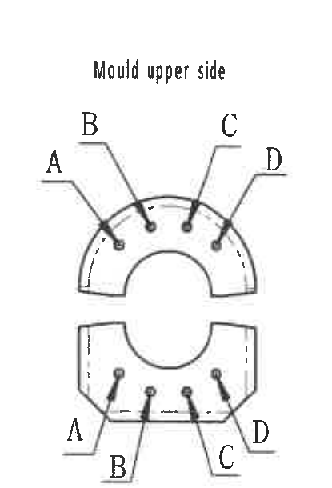

- 原图位置/视图名称: 页面右下中部右侧局部图，坐标约 x=4320-4735, y=1570-2180 / 局部视图 / Mould upper side
- object_kind: `detail`
- bbox: `[4320, 1570, 4735, 2180]`

### 提取表格

| 提取项 | 原图数值或文本 | 含义说明 |
| --- | --- | --- |
| 视图名称 | Mould upper side | 模具上侧点位/标识布置图。 |
| 上半部点位 | A, B, C, D | 上半圆四个点位分别由 A/B/C/D 引线标注。 |
| 下半部点位 | A, B, C, D | 下座四个点位分别由 A/B/C/D 引线标注。 |
| 含义 | 字母点位分布 | 用于区分模具上侧各打点/标记位置，未给数值尺寸。 |

### 边界归属说明

裁切仅包含 Mould upper side 局部图及 A/B/C/D 引线；右侧图框坐标线已排除。

## object_9 - 标识内容示意图 / Marking content detail

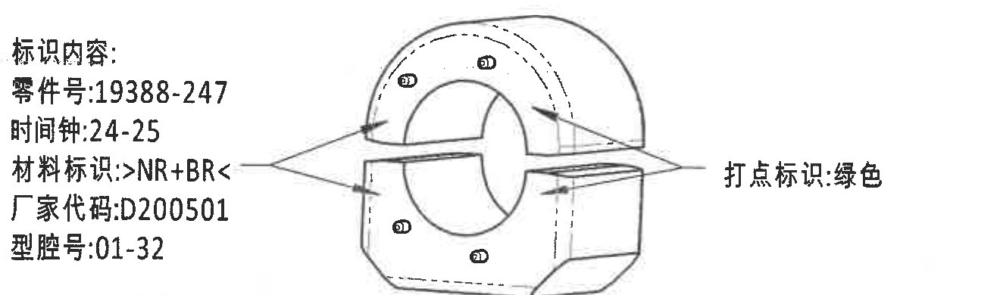

- 原图位置/视图名称: 页面左下，NOTES 下方、刚度表上方，坐标约 x=890-2210, y=2315-2705 / 标识内容示意图 / Marking content detail
- object_kind: `detail`
- bbox: `[890, 2315, 2210, 2705]`

### 提取表格

| 提取项 | 原图数值或文本 | 含义说明 |
| --- | --- | --- |
| 标识内容 | 标识内容: | 以下为零件刻字/追溯标识内容。 |
| 零件号 | 零件号:19388-247 | 需在零件上标识的零件号。 |
| 时间钟 | 时间钟:24-25 | 模具时间钟/日期码标识。 |
| 材料标识 | 材料标识: >NR+BR< | 材料标识内容，表示 NR+BR。 |
| 厂家代码 | 厂家代码:D200501 | 厂家代码标识。 |
| 型腔号 | 型腔号:01-32 | 型腔编号范围。 |
| 打点标识 | 打点标识:绿色 | 打点颜色要求为绿色。 |
| 示意图 | 零件外形带圆点标记 | 示意标识/打点在零件上的布置位置。 |

### 边界归属说明

裁切仅覆盖标识内容文字、零件标识示意图和打点标识说明；下方 Upper/Lower bracket 刚度表框线未纳入。

## object_10 - Stiffness requirement ⓑ / 刚度要求表

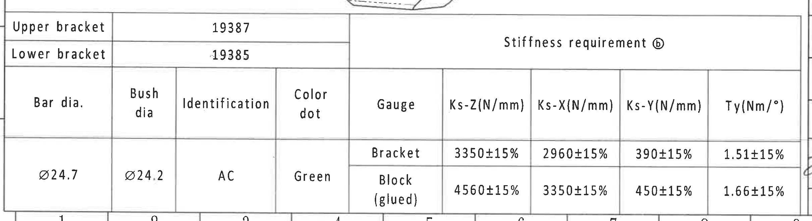

- 原图位置/视图名称: 页面底部左侧，坐标约 x=360-2780, y=2680-3340 / Stiffness requirement ⓑ / 刚度要求表
- object_kind: `table`
- bbox: `[360, 2680, 2780, 3340]`

### 原表还原

| Upper bracket | Lower bracket | Bar dia. | Bush dia | Identification | Color dot | Gauge | Ks-Z(N/mm) | Ks-X(N/mm) | Ks-Y(N/mm) | Ty(Nm/°) |
| --- | --- | --- | --- | --- | --- | --- | --- | --- | --- | --- |
| 19387 | 19385 | Ø24.7 | Ø24.2 | AC | Green | Bracket | 3350±15% | 2960±15% | 390±15% | 1.51±15% |
| 19387 | 19385 | Ø24.7 | Ø24.2 | AC | Green | Block (glued) | 4560±15% | 3350±15% | 450±15% | 1.66±15% |

### 提取表格

| 提取项 | 原图数值或文本 | 含义说明 |
| --- | --- | --- |
| Upper bracket | 19387 | 上卡箍/支架编号。 |
| Lower bracket | 19385 | 下卡箍/支架编号。 |
| Bar dia. | Ø24.7 | 稳定杆直径。 |
| Bush dia | Ø24.2 | 衬套直径。 |
| Identification | AC | 识别代码。 |
| Color dot | Green | 色点要求为绿色。 |
| Gauge Bracket | Ks-Z 3350±15%; Ks-X 2960±15%; Ks-Y 390±15%; Ty 1.51±15% | Bracket 量规下的刚度/扭转刚度要求。 |
| Gauge Block (glued) | Ks-Z 4560±15%; Ks-X 3350±15%; Ks-Y 450±15%; Ty 1.66±15% | Block(glued) 量规下的刚度/扭转刚度要求。 |

### 边界归属说明

裁切包含完整刚度要求表、Upper bracket/Lower bracket 料号行及数据行；上方标识示意图不纳入本对象。

## object_11 - NF/T 47-001 CLASS M3 通用公差表

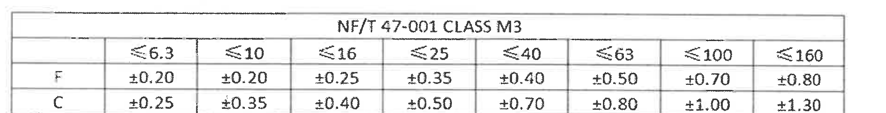

- 原图位置/视图名称: 页面右下标题栏上方，坐标约 x=2835-4735, y=2325-2570 / NF/T 47-001 CLASS M3 通用公差表
- object_kind: `table`
- bbox: `[2835, 2325, 4735, 2570]`

### 原表还原

|  | ≤6.3 | ≤10 | ≤16 | ≤25 | ≤40 | ≤63 | ≤100 | ≤160 |
| --- | --- | --- | --- | --- | --- | --- | --- | --- |
| F | ±0.20 | ±0.20 | ±0.25 | ±0.35 | ±0.40 | ±0.50 | ±0.70 | ±0.80 |
| C | ±0.25 | ±0.35 | ±0.40 | ±0.50 | ±0.70 | ±0.80 | ±1.00 | ±1.30 |

### 提取表格

| 提取项 | 原图数值或文本 | 含义说明 |
| --- | --- | --- |
| 标题 | NF/T 47-001 CLASS M3 | 橡胶件 M3 等级通用公差。 |
| 尺寸段 | ≤6.3, ≤10, ≤16, ≤25, ≤40, ≤63, ≤100, ≤160 | 公差按基本尺寸区间取值。 |
| F 行 | ±0.20, ±0.20, ±0.25, ±0.35, ±0.40, ±0.50, ±0.70, ±0.80 | F 级公差行。 |
| C 行 | ±0.25, ±0.35, ±0.40, ±0.50, ±0.70, ±0.80, ±1.00, ±1.30 | C 级公差行。 |

### 边界归属说明

裁切仅包含 NF/T 47-001 CLASS M3 公差矩阵及完整边框；下方代用信息表不纳入。

## object_12 - 代用信息表 / Substitute information

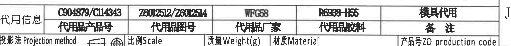

- 原图位置/视图名称: 页面右下标题栏上方第一行，坐标约 x=2785-4830, y=2590-2775 / 代用信息表 / Substitute information
- object_kind: `table`
- bbox: `[2785, 2590, 4830, 2775]`

### 原表还原

| 代用产品号 | 代用图号 | 代用品厂家 | 代用品胶料 | 备注 |
| --- | --- | --- | --- | --- |
| C904879/C114343 | Z6012512/Z6012514 | WFG58 | R6938-H55 | 模具代用 |

### 提取表格

| 提取项 | 原图数值或文本 | 含义说明 |
| --- | --- | --- |
| 代用产品号 | C904879/C114343 | 代用信息中的产品号。 |
| 代用图号 | Z6012512/Z6012514 | 代用信息中的图号。 |
| 代用品厂家 | WFG58 | 代用品厂家/供应商标识。 |
| 代用品胶料 | R6938-H55 | 代用胶料牌号。 |
| 备注 | 模具代用 | 备注说明为模具代用。 |

### 边界归属说明

裁切包含代用信息表完整表头和数值；下方可见的 Projection method/Scale 等标题栏字段不归入本对象。

## object_13 - 标题栏 / Title block

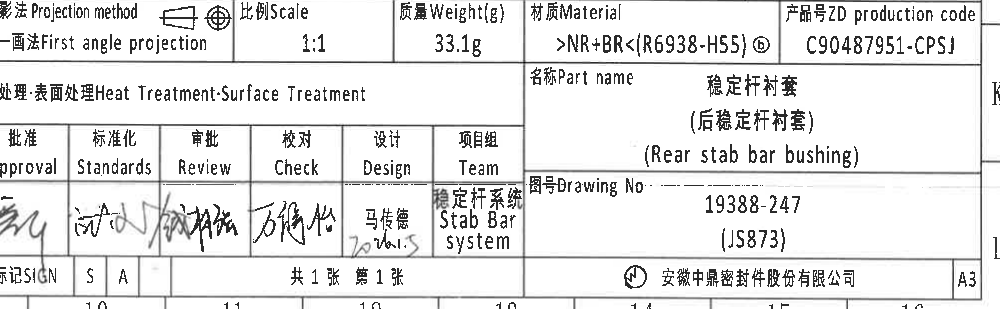

- 原图位置/视图名称: 页面右下角，坐标约 x=2815-4820, y=2730-3350 / 标题栏 / Title block
- object_kind: `title_block`
- bbox: `[2815, 2730, 4820, 3350]`

### 提取表格

| 提取项 | 原图数值或文本 | 含义说明 |
| --- | --- | --- |
| Projection method | 第一画法 First angle projection | 投影法为第一角投影。 |
| Scale | 1:1 | 比例为 1:1。 |
| Weight | 33.1g | 质量为 33.1 g。 |
| Material | >NR+BR<(R6938-H55) ⓑ | 材料为 NR+BR，胶料/牌号 R6938-H55，关联修订标识 b。 |
| ZD production code | C90487951-CPSJ | 产品号/生产代码。 |
| Heat Treatment-Surface Treatment | 空白 | 热处理/表面处理栏未填写具体内容。 |
| Part name | 稳定杆衬套 (后稳定杆衬套) (Rear stab bar bushing) | 零件名称。 |
| Drawing No. | 19388-247 (JS873) | 图号/客户或项目号。 |
| Approval/Standards/Review/Check/Design/Team | 手写签名; Design: 马传德 / 2026.1.5; Team: 稳定杆系统 Stab Bar System | 签核栏含手写签名，部分无法精准辨读；设计人为马传德。 |
| Sheet | 共1张 第1张 | 共 1 张，第 1 张。 |
| Company | 安徽中鼎密封件股份有限公司 | 图纸所属公司。 |
| Format | A3 | 图幅 A3。 |

### 边界归属说明

裁切包含标题栏主区域、投影法/比例/重量/材料/生产代码、热处理表面处理、签核栏、零件名称、图号、页码和公司信息；上方代用信息表不纳入。

## 裁切检查记录

| 裁切对象 | 检查结果 |
| --- | --- |
| object_1 | 完整包含 NOTES 文字、特殊特性符号和检查尺寸说明；右侧主视图尺寸框未纳入。 |
| object_2 | 完整包含修订表表头、三条记录和空白行；From 列左边界已扩展，文字未被截断。 |
| object_3 | 完整包含主视图尺寸线、箭头、括号参考尺寸、直径、半径、倒角和硬度测量位置引出文字；右侧侧视图轮廓已排除。 |
| object_4 | 完整包含上侧视图和 30±0.4 尺寸线；下方侧视图主体未混入。 |
| object_5 | 完整包含下侧视图和 30±0.4 尺寸线；上方侧视图未混入。 |
| object_6 | 完整包含下方侧面视图、2-R2、Ø2 和 3 尺寸线；右侧局部图未混入。 |
| object_7 | 完整包含 Mould lower side 局部图及 A/B/C/D 引线；右侧局部图未混入。 |
| object_8 | 完整包含 Mould upper side 局部图及 A/B/C/D 引线；右侧图框坐标线已排除。 |
| object_9 | 完整包含标识内容、零件示意图和打点标识:绿色；下方刚度表未混入。 |
| object_10 | 完整包含刚度要求表全部表头、Upper/Lower bracket 行和两行数据。 |
| object_11 | 完整包含 NF/T 47-001 CLASS M3 公差矩阵；下方代用信息表已排除。 |
| object_12 | 完整包含代用信息表表头和字段；下方标题栏仅在边缘相邻，不作为本对象提取。 |
| object_13 | 完整包含标题栏主字段、签核栏、零件名称、图号和公司信息；上方代用信息表未纳入。 |

## Sidecar 覆盖说明

`outputs/20C90487951_manifest.json` 中的 `objects.text`、`objects.context` 和 `entities` 已写入上述尺寸、参考尺寸、表格字段和边界归属说明；图片路径均为相对当前目录路径。
