# 20C906904（SGHL-2965210） 内容识别

整页PNG：

## object_1 - 总成管路走向视图

- object_kind: `view`
- 原图位置/视图名称: page 1, bbox `[338, 364, 7411, 1716]`, 总成管路走向视图

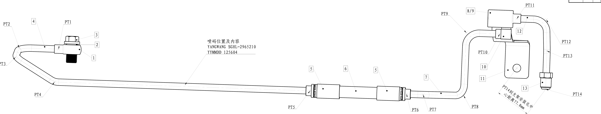

### 提取表格
| 提取项 | 原图数值或文本 | 含义说明 |
|---|---|---|
| 喷码位置及内容 | YANGWANG SGHL-2965210；YYMMDD 125604 | 喷码位于钢管1长直段，说明客户/产品标识和日期码/批次码。 |
| PT1-PT14 | PT1, PT2, PT3, PT4, PT5, PT6, PT7, PT8, PT9, PT10, PT11, PT12, PT13, PT14 | 总成管路控制点或测点，与点坐标表对应。 |
| 件号框 | 1, 2, 3, 4, 5, 6, 7, 8/9, 10, 11, 12, 13 | 装配零件序号，与BOM和局部尺寸图对应。 |
| PT14型支架安装孔中心距离 | 27.8mm | 总成视图在PT14附近给出支架安装孔中心距提示。 |

### 边界归属说明
包含 PT1-PT14 点位标识、件号框1-13、喷码位置及内容；用于说明各零件装配位置和钢管走向。仅提取本裁切对象内的标注、表格或文字；靠近边界的尺寸按完整尺寸线、箭头、标注文字和标题归入本对象。裁切中如可见相邻视图的边缘或辅助片段，不作为本对象提取内容。

## object_2 - 更改记录表

- object_kind: `table`
- 原图位置/视图名称: page 1, bbox `[6880, 0, 9330, 420]`, 更改记录表

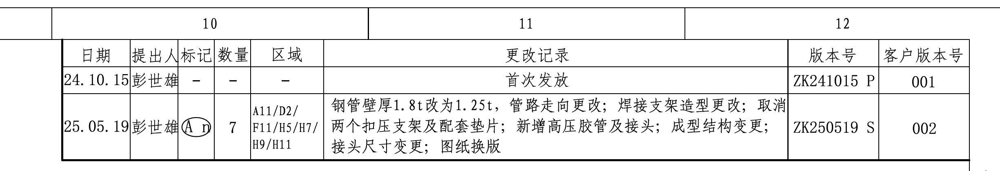

### 原表还原
| 日期 | 提出人 | 标记 | 数量 | 区域 | 更改记录 | 版本号 | 客户版本号 |
|---|---|---|---|---|---|---|---|
| 24.10.15 | 彭世雄 | - | - | - | 首次发放 | ZK241015 P | 001 |
| 25.05.19 | 彭世雄 | A n | 7 | A11/D2/F11/H5/H7/H9/H11 | 钢管壁厚1.8t改为1.25t，管路走向更改；焊接支架造型更改；取消两个扣压支架及配套垫片；新增高压胶管及接头；成型结构变更；接头尺寸变更；图纸换版 | ZK250519 S | 002 |

### 提取表格
| 提取项 | 原图数值或文本 | 含义说明 |
|---|---|---|
| 表头 | 日期 / 提出人 / 标记 / 数量 / 区域 / 更改记录 / 版本号 / 客户版本号 | 修订履历表头。 |
| 记录1 | 24.10.15 / 彭世雄 / - / - / - / 首次发放 / ZK241015 P / 001 | 首次发行记录。 |
| 记录2 | 25.05.19 / 彭世雄 / A n / 7 / A11/D2/F11/H5/H7/H9/H11 / 钢管壁厚1.8t改为1.25t，管路走向更改；焊接支架造型更改；取消两个扣压支架及配套垫片；新增高压胶管及接头；成型结构变更；接头尺寸变更；图纸换版 / ZK250519 S / 002 | 第二次修订，列出影响区域与变更内容。 |

### 边界归属说明
完整包含两条修订履历及全部列；不归入右下标题栏。仅提取本裁切对象内的标注、表格或文字；靠近边界的尺寸按完整尺寸线、箭头、标注文字和标题归入本对象。裁切中如可见相邻视图的边缘或辅助片段，不作为本对象提取内容。

## object_3 - POINT COORDINATE CHART 点坐标表

- object_kind: `table`
- 原图位置/视图名称: page 1, bbox `[8114, 546, 9227, 1872]`, POINT COORDINATE CHART 点坐标表

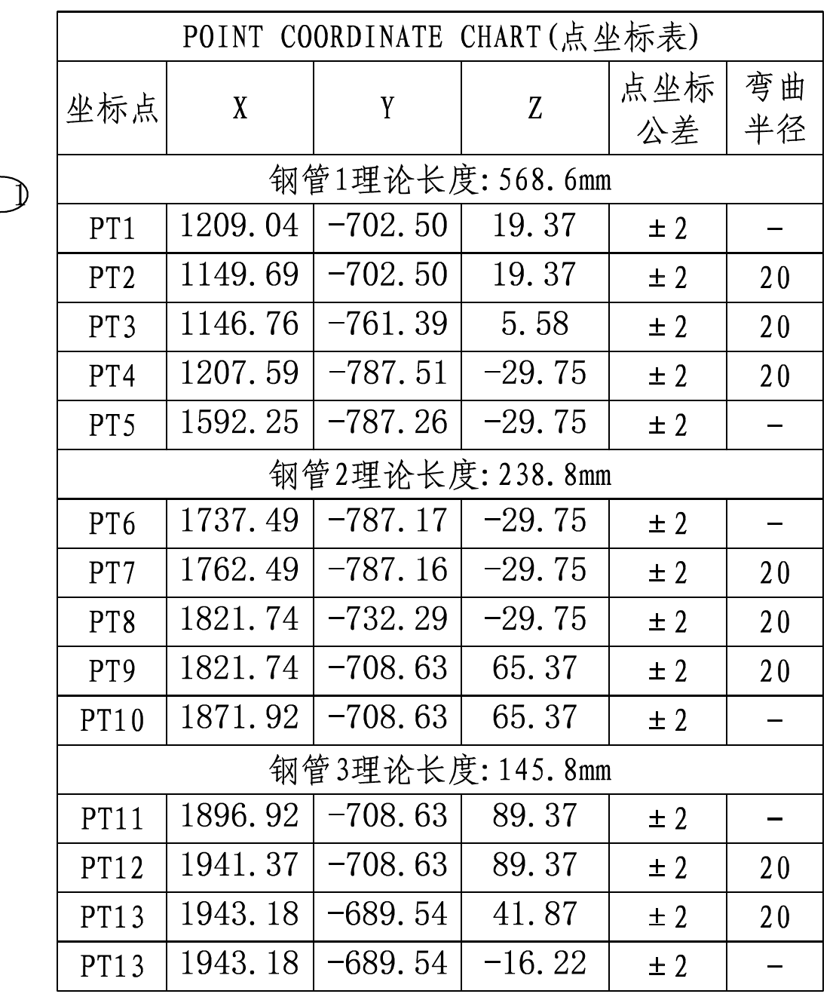

### 原表还原
| 坐标点 | X | Y | Z | 点坐标公差 | 弯曲半径 |
|---|---|---|---|---|---|
| 钢管1理论长度 | 568.6mm |  |  |  |  |
| PT1 | 1209.04 | -702.50 | 19.37 | ±2 | - |
| PT2 | 1149.69 | -702.50 | 19.37 | ±2 | 20 |
| PT3 | 1146.76 | -761.39 | 5.58 | ±2 | 20 |
| PT4 | 1207.59 | -787.51 | -29.75 | ±2 | 20 |
| PT5 | 1592.25 | -787.26 | -29.75 | ±2 | - |
| 钢管2理论长度 | 238.8mm |  |  |  |  |
| PT6 | 1737.49 | -787.17 | -29.75 | ±2 | - |
| PT7 | 1762.49 | -787.16 | -29.75 | ±2 | 20 |
| PT8 | 1821.74 | -732.29 | -29.75 | ±2 | 20 |
| PT9 | 1821.74 | -708.63 | 65.37 | ±2 | 20 |
| PT10 | 1871.92 | -708.63 | 65.37 | ±2 | - |
| 钢管3理论长度 | 145.8mm |  |  |  |  |
| PT11 | 1896.92 | -708.63 | 89.37 | ±2 | - |
| PT12 | 1941.37 | -708.63 | 89.37 | ±2 | 20 |
| PT13 | 1943.18 | -689.54 | 41.87 | ±2 | 20 |
| PT13 | 1943.18 | -689.54 | -16.22 | ±2 | - |

### 提取表格
| 提取项 | 原图数值或文本 | 含义说明 |
|---|---|---|
| 钢管1理论长度 | 568.6mm | PT1-PT5所属钢管1理论展开长度。 |
| PT1 | X 1209.04, Y -702.50, Z 19.37, 公差±2, 弯曲半径- | 坐标控制点。 |
| PT2 | X 1149.69, Y -702.50, Z 19.37, 公差±2, 弯曲半径20 | 坐标控制点，弯曲半径20。 |
| PT3 | X 1146.76, Y -761.39, Z 5.58, 公差±2, 弯曲半径20 | 坐标控制点，弯曲半径20。 |
| PT4 | X 1207.59, Y -787.51, Z -29.75, 公差±2, 弯曲半径20 | 坐标控制点，弯曲半径20。 |
| PT5 | X 1592.25, Y -787.26, Z -29.75, 公差±2, 弯曲半径- | 坐标控制点。 |
| 钢管2理论长度 | 238.8mm | PT6-PT10所属钢管2理论展开长度。 |
| PT6 | X 1737.49, Y -787.17, Z -29.75, 公差±2, 弯曲半径- | 坐标控制点。 |
| PT7 | X 1762.49, Y -787.16, Z -29.75, 公差±2, 弯曲半径20 | 坐标控制点，弯曲半径20。 |
| PT8 | X 1821.74, Y -732.29, Z -29.75, 公差±2, 弯曲半径20 | 坐标控制点，弯曲半径20。 |
| PT9 | X 1821.74, Y -708.63, Z 65.37, 公差±2, 弯曲半径20 | 坐标控制点，弯曲半径20。 |
| PT10 | X 1871.92, Y -708.63, Z 65.37, 公差±2, 弯曲半径- | 坐标控制点。 |
| 钢管3理论长度 | 145.8mm | PT11-末端段钢管3理论展开长度。 |
| PT11 | X 1896.92, Y -708.63, Z 89.37, 公差±2, 弯曲半径- | 坐标控制点。 |
| PT12 | X 1941.37, Y -708.63, Z 89.37, 公差±2, 弯曲半径20 | 坐标控制点，弯曲半径20。 |
| PT13 | X 1943.18, Y -689.54, Z 41.87, 公差±2, 弯曲半径20 | 坐标控制点，弯曲半径20。 |
| PT13/末端 | X 1943.18, Y -689.54, Z -16.22, 公差±2, 弯曲半径- | 原表末行仍标为PT13，按原文保留；结合总成图可理解为末端控制点。 |

### 边界归属说明
仅为点坐标表，完整包含表头、钢管1/2/3理论长度、PT坐标、公差和弯曲半径。仅提取本裁切对象内的标注、表格或文字；靠近边界的尺寸按完整尺寸线、箭头、标注文字和标题归入本对象。裁切中如可见相邻视图的边缘或辅助片段，不作为本对象提取内容。

## object_4 - 部件13 螺栓尺寸简图 比例2:1

- object_kind: `detail`
- 原图位置/视图名称: page 1, bbox `[338, 1898, 2388, 3448]`, 部件13 螺栓尺寸简图 比例2:1

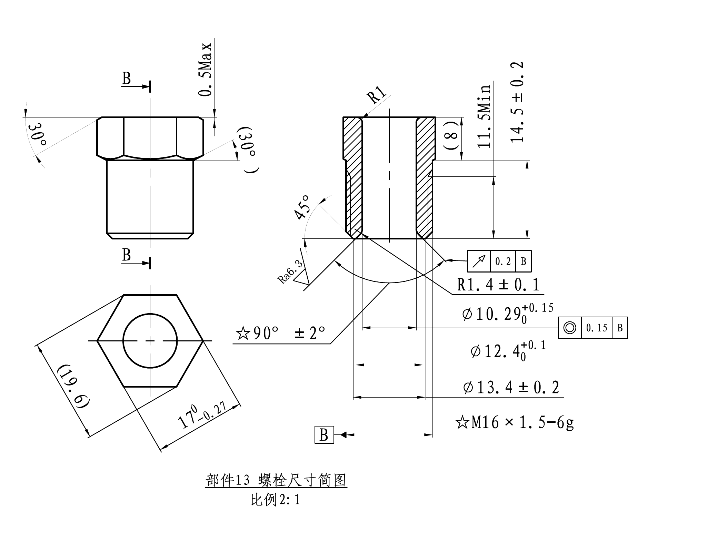

### 提取表格
| 提取项 | 原图数值或文本 | 含义说明 |
|---|---|---|
| 30° | 两处30°，其中一处为(30°) | 螺栓头倒角；括号内为参考角度。 |
| 0.5Max | 0.5Max | 头部局部最大高度/偏差限制。 |
| R1 | R1 | 剖面顶部圆角半径。 |
| (8) | (8) | 剖面局部参考尺寸。 |
| 11.5Min | 11.5Min | 最小高度/深度要求。 |
| 14.5±0.2 | 14.5±0.2 | 总高度尺寸。 |
| 45° | 45° | 内倒角角度。 |
| Ra6.3 | Ra6.3 | 表面粗糙度。 |
| R1.4±0.1 | R1.4±0.1 | 底部圆角半径。 |
| φ10.29+0.15/0 | φ10.29 +0.15/0 | 孔/径尺寸。 |
| 同轴度 | ◎ 0.15 B | 相对基准B的同轴度。 |
| φ12.4+0.1/0 | φ12.4 +0.1/0 | 台阶直径。 |
| φ13.4±0.2 | φ13.4±0.2 | 外径。 |
| M16×1.5-6g | ☆M16×1.5-6g | 外螺纹规格，星号关键尺寸。 |
| (19.6) | (19.6) | 六角外接尺寸参考值。 |
| 17-0.27/0 | 17 -0.27/0 | 六角对边尺寸。 |
| 90°±2° | ☆90°±2° | 关键角度尺寸。 |
| 基准 | B | 剖面/形位基准。 |

### 边界归属说明
螺栓/螺栓头尺寸、剖面B-B、基准B、关键尺寸星号和螺纹规格归入本对象。仅提取本裁切对象内的标注、表格或文字；靠近边界的尺寸按完整尺寸线、箭头、标注文字和标题归入本对象。裁切中如可见相邻视图的边缘或辅助片段，不作为本对象提取内容。

## object_5 - 部件1 BANJO尺寸简图 比例2:1

- object_kind: `section`
- 原图位置/视图名称: page 1, bbox `[2366, 1898, 3620, 3380]`, 部件1 BANJO尺寸简图 比例2:1

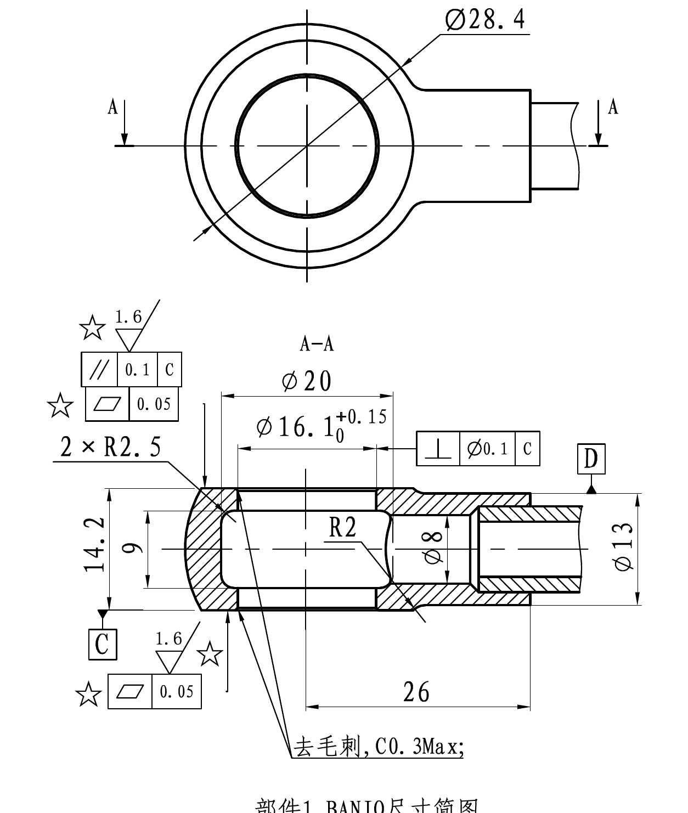

### 提取表格
| 提取项 | 原图数值或文本 | 含义说明 |
|---|---|---|
| φ28.4 | φ28.4 | BANJO外圆直径。 |
| φ20 | φ20 | A-A剖面孔/台阶直径。 |
| φ16.1+0.15/0 | φ16.1 +0.15/0 | 中心孔直径。 |
| φ0.1 C | φ0.1 C | 相对基准C的位置/同轴类公差框。 |
| φ13 | φ13 | 右端管外径/接口直径。 |
| φ8 | φ8 | 内孔直径。 |
| R2 | R2 | 内腔圆角半径。 |
| 2×R2.5 | 2×R2.5 | 两处圆角。 |
| 14.2 | 14.2 | 外部高度。 |
| 9 | 9 | 内部高度。 |
| 26 | 26 | 主体长度。 |
| 1.6 | 1.6 | 表面粗糙度，两处。 |
| 平行度 | // 0.1 C | 相对基准C平行度。 |
| 平面度 | ◇ 0.05 | 平面度0.05。 |
| 去毛刺 | 去毛刺, C0.3Max | 边缘去毛刺，最大倒角0.3。 |
| 基准 | C, D | 尺寸和形位公差基准。 |

### 边界归属说明
BANJO正视和A-A剖面尺寸，含基准C/D、表面粗糙度、形位公差和倒圆。仅提取本裁切对象内的标注、表格或文字；靠近边界的尺寸按完整尺寸线、箭头、标注文字和标题归入本对象。裁切中如可见相邻视图的边缘或辅助片段，不作为本对象提取内容。

## object_6 - 部件2 紫铜垫片尺寸简图 比例2:1

- object_kind: `detail`
- 原图位置/视图名称: page 1, bbox `[3800, 1987, 5050, 3167]`, 部件2 紫铜垫片尺寸简图 比例2:1

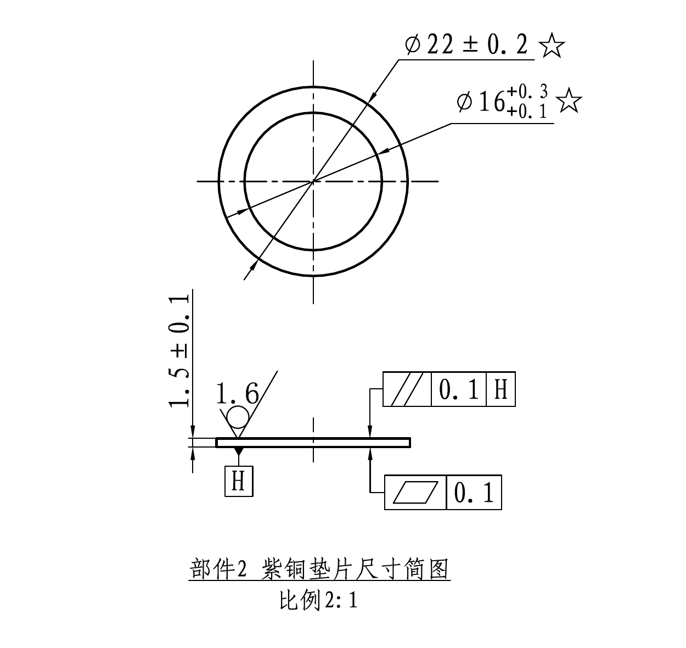

### 提取表格
| 提取项 | 原图数值或文本 | 含义说明 |
|---|---|---|
| φ22±0.2 | φ22±0.2 ☆ | 关键外径。 |
| φ16+0.3/+0.1 | φ16 +0.3/+0.1 ☆ | 关键内径。 |
| 1.5±0.1 | 1.5±0.1 | 垫片厚度。 |
| 1.6 | 1.6 | 表面粗糙度。 |
| 平行度 | // 0.1 H | 相对基准H的平行度。 |
| 平面度 | ◇ 0.1 | 平面度。 |
| 基准 | H | 垫片端面/平面基准。 |

### 边界归属说明
垫片正视和侧视尺寸，含关键直径、厚度、基准H及平行度/平面度。仅提取本裁切对象内的标注、表格或文字；靠近边界的尺寸按完整尺寸线、箭头、标注文字和标题归入本对象。裁切中如可见相邻视图的边缘或辅助片段，不作为本对象提取内容。

## object_7 - 部件9 螺帽座尺寸简图 比例2:1

- object_kind: `detail`
- 原图位置/视图名称: page 1, bbox `[5071, 1794, 6321, 3339]`, 部件9 螺帽座尺寸简图 比例2:1

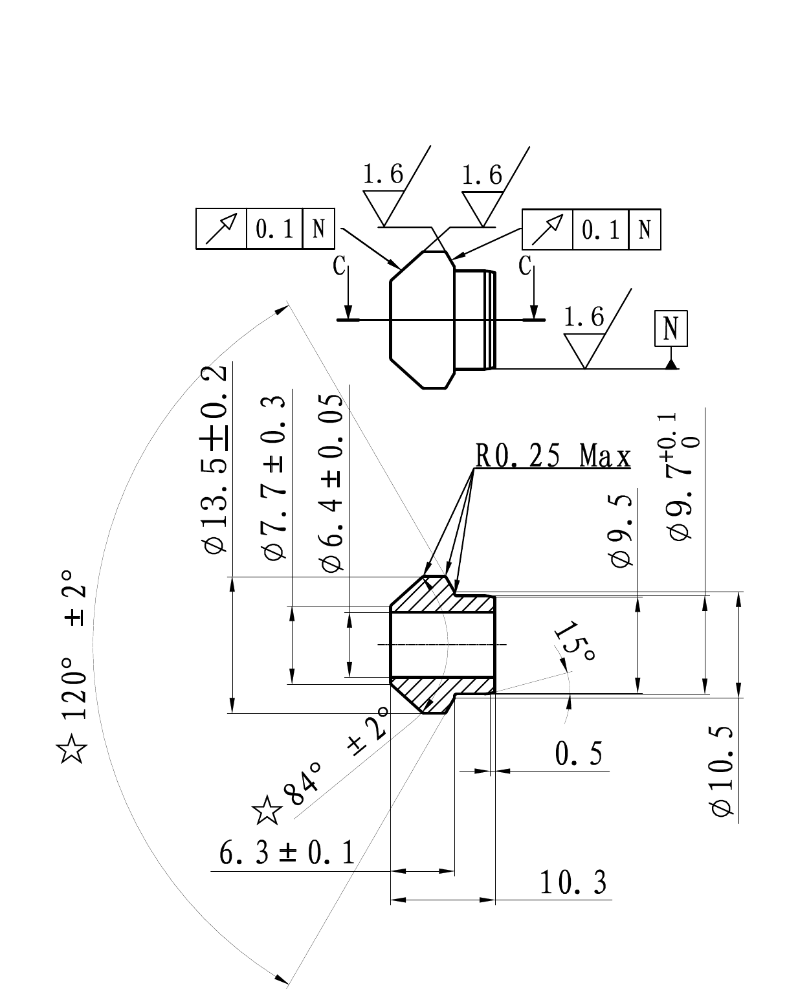

### 提取表格
| 提取项 | 原图数值或文本 | 含义说明 |
|---|---|---|
| 120°±2° | ☆120°±2° | 关键锥角/展开角。 |
| φ13.5±0.2 | φ13.5±0.2 | 外径。 |
| φ7.7±0.3 | φ7.7±0.3 | 内孔/局部直径。 |
| φ6.4±0.05 | φ6.4±0.05 | 精度较高孔径。 |
| 84°±2° | ☆84°±2° | 关键角度。 |
| 6.3±0.1 | 6.3±0.1 | 局部长尺寸。 |
| R0.25Max | R0.25 Max | 最大圆角。 |
| φ9.5 | φ9.5 | 外径/台阶直径。 |
| φ9.7+0.1/0 | φ9.7 +0.1/0 | 外径/台阶直径。 |
| φ10.5 | φ10.5 | 外径。 |
| 15° | 15° | 倒角角度。 |
| 0.5 | 0.5 | 台阶宽度。 |
| 10.3 | 10.3 | 总长/右侧长度。 |
| 1.6 | 1.6 | 多处表面粗糙度。 |
| 位置度 | ↗ 0.1 N 两处 | 相对基准N的形位公差。 |
| 基准 | N | 右端端面/轴线基准。 |

### 边界归属说明
螺帽座剖面与小端视图，含关键角度、直径、长度、粗糙度和基准N。仅提取本裁切对象内的标注、表格或文字；靠近边界的尺寸按完整尺寸线、箭头、标注文字和标题归入本对象。裁切中如可见相邻视图的边缘或辅助片段，不作为本对象提取内容。

## object_17 - 部件3 空心螺栓尺寸简图 比例2:1

- object_kind: `section`
- 原图位置/视图名称: page 1, bbox `[6100, 1794, 7450, 3444]`, 部件3 空心螺栓尺寸简图 比例2:1

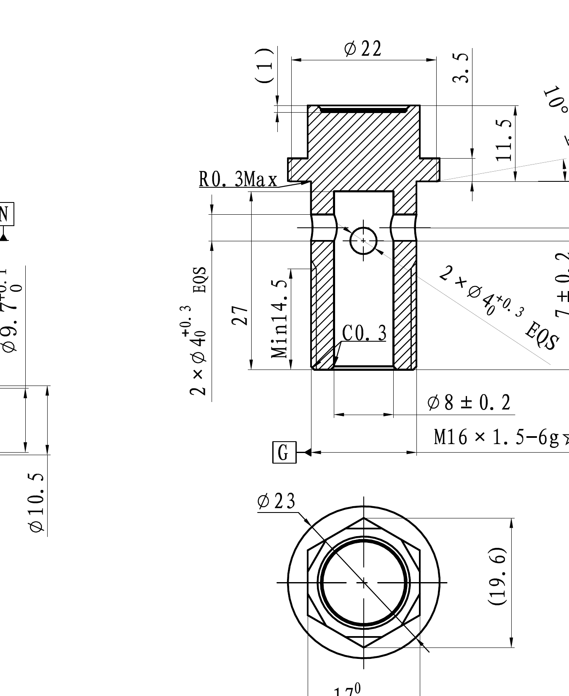

### 提取表格
| 提取项 | 原图数值或文本 | 含义说明 |
|---|---|---|
| (1) | (1) | 顶部局部参考尺寸。 |
| φ22 | φ22 | 顶部外径。 |
| 3.5 | 3.5 | 上台阶高度/厚度。 |
| 11.5 | 11.5 | 头部高度。 |
| R0.3Max | R0.3Max | 最大圆角。 |
| 2×φ4+0.3/0 EQS | 2×φ4 +0.3/0 EQS | 两处等分径向孔。 |
| 27 | 27 | 下部长度。 |
| Min14.5 | Min14.5 | 最小内深。 |
| C0.3 | C0.3 | 倒角。 |
| φ8±0.2 | φ8±0.2 | 底部孔径。 |
| M16×1.5-6g | M16×1.5-6g | 外螺纹规格。 |
| φ23 | φ23 | 端视外径。 |
| (19.6) | (19.6) | 端视参考外形尺寸。 |
| 基准 | G | 底部基准。 |

### 边界归属说明
空心螺栓剖面和端视，含G基准、孔、螺纹、倒角/圆角、EQS等。仅提取本裁切对象内的标注、表格或文字；靠近边界的尺寸按完整尺寸线、箭头、标注文字和标题归入本对象。裁切中如可见相邻视图的边缘或辅助片段，不作为本对象提取内容。

## object_8 - 钢管1/3与接头焊接角度 比例1:1

- object_kind: `view`
- 原图位置/视图名称: page 1, bbox `[7100, 2367, 8634, 3381]`, 钢管1/3与接头焊接角度 比例1:1

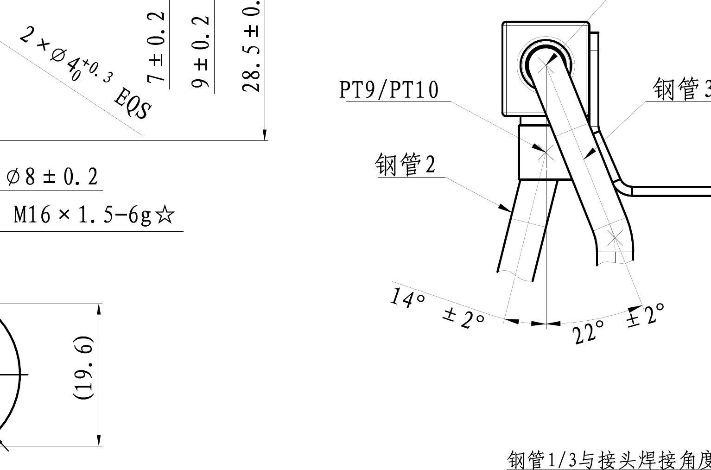

### 提取表格
| 提取项 | 原图数值或文本 | 含义说明 |
|---|---|---|
| PT9/PT10 | PT9/PT10 | 左上接头位置点。 |
| PT11/PT12 | PT11/PT12 | 右上接头位置点。 |
| 钢管2 | 钢管2 | 左下管段归属。 |
| 钢管3 | 钢管3 | 右上管段归属。 |
| 14°±2° | 14°±2° | 一侧焊接角度。 |
| 22°±2° | 22°±2° | 另一侧焊接角度。 |

### 边界归属说明
PT9/PT10、PT11/PT12处钢管和接头焊接角度示意，含14°±2°与22°±2°。仅提取本裁切对象内的标注、表格或文字；靠近边界的尺寸按完整尺寸线、箭头、标注文字和标题归入本对象。裁切中如可见相邻视图的边缘或辅助片段，不作为本对象提取内容。

## object_9 - 技术要求 NOTES

- object_kind: `notes`
- 原图位置/视图名称: page 1, bbox `[286, 3641, 3166, 6476]`, 技术要求 NOTES

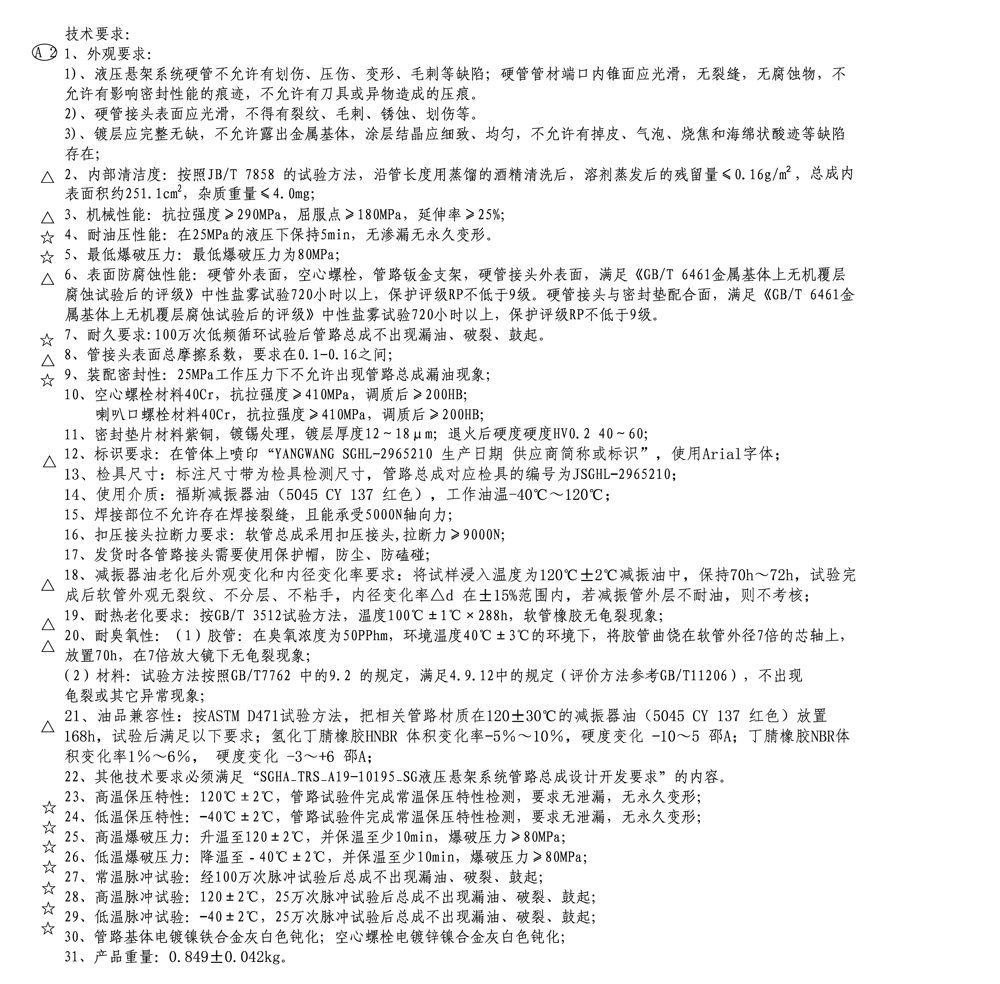

### 提取表格
| 提取项 | 原图数值或文本 | 含义说明 |
|---|---|---|
| 1 | 外观要求：硬管不允许有划伤、压伤、变形、毛刺等缺陷；端口内锥面应光滑，无裂缝、无腐蚀物，不允许有影响密封性能的痕迹或刀具/异物压痕。 | 外观和密封面质量要求。 |
| 1-2 | 硬管接头表面应光滑，不得有裂纹、毛刺、锈蚀、划伤等。 | 接头表面质量要求。 |
| 1-3 | 镀层应完整无缺，不允许露出金属基体，涂层结晶应细致、均匀，不允许有掉皮、气泡、烧焦和海绵状酸迹等缺陷。 | 镀层/涂层外观要求。 |
| 2 | 内部清洁度：按JB/T 7858；酒精清洗后溶剂蒸发残留量≤0.16g/m²，总成内表面积约251.1cm²，杂质量≤4.0mg。 | 清洁度和残留物控制。 |
| 3 | 机械性能：抗拉强度≥290MPa，屈服点≥180MPa，延伸率≥25%。 | 材料力学性能要求。 |
| 4 | 耐油压性能：25MPa液压下保持5min，无渗漏无永久变形。 | 耐压验证条件。 |
| 5 | 最低爆破压力：80MPa。 | 爆破压力下限。 |
| 6 | 表面防腐蚀性能：硬管外表面、空心螺栓、管路钣金支架、硬管接头外表面满足GB/T 6461中性盐雾720小时以上，保护评级RP不低于9级；硬管接头与密封垫配合面同样要求。 | 防腐蚀和盐雾要求。 |
| 7 | 耐久要求：100万次低频循环试验后管路总成不出现漏油、破裂、鼓起。 | 耐久试验要求。 |
| 8 | 管接头表面总摩擦系数要求在0.1-0.16之间。 | 摩擦系数要求。 |
| 9 | 装配密封性：25MPa工作压力下不允许出现管路总成漏油现象。 | 装配密封试验。 |
| 10 | 空心螺栓材料40Cr，抗拉强度≥410MPa，调质后≥200HB；喇叭口螺栓材料40Cr，抗拉强度≥410MPa，调质后≥200HB。 | 螺栓材料和热处理硬度。 |
| 11 | 密封垫片材料紫铜，镀锡处理，镀层厚度12-18μm；退火后硬度HV0.2 40-60。 | 密封垫片材料、镀层和硬度。 |
| 12 | 标识要求：在管体上喷印“YANGWANG SGHL-2965210 生产日期 供应商简称或标识”，使用Arial字体。 | 喷码内容和字体要求。 |
| 13 | 检具尺寸：标注尺寸带为检具检测尺寸，管路总成对应检具编号为JSGHL-2965210。 | 检具关联要求。 |
| 14 | 使用介质：福斯减振器油（5045 CY 137 红色），工作油温-40℃～120℃。 | 介质和温度范围。 |
| 15 | 焊接部位不允许存在焊接裂缝，且能承受5000N轴向力。 | 焊接强度要求。 |
| 16 | 扣压接头拉断力要求：软管总成采用扣压接头，拉断力≥9000N。 | 扣压接头拉断力。 |
| 17 | 发货时各管路接头需要使用保护帽，防尘、防磕碰。 | 包装/防护要求。 |
| 18 | 减振器油老化后：120℃±2℃保持70h～72h；软管外观无裂纹、不分层、不粘手；内径变化率Δd在±15%范围内；若外层不耐油则不考核。 | 油老化后外观和内径变化率。 |
| 19 | 耐热老化：按GB/T 3512，100℃±1℃×288h，软管橡胶无龟裂。 | 耐热老化要求。 |
| 20 | 耐臭氧性：胶管在50PPHm臭氧、40℃±3℃环境，绕外径7倍芯轴放置70h，在7倍放大镜下无龟裂；材料按GB/T7762中9.2，满足4.9.12，不出现龟裂或异常。 | 臭氧老化要求。 |
| 21 | 油品兼容性：按ASTM D471，将相关管路材质在120+30℃减振器油中放置168h；HNBR体积变化率-5%～10%，硬度变化-10～5邵A；NBR体积变化率1%～6%，硬度变化-3～+6邵A。 | 油品兼容性要求。 |
| 22 | 其他技术要求必须满足“SGHA-TRS-A19-10195-SG液压悬架系统管路总成设计开发要求”的内容。 | 引用设计开发要求。 |
| 23 | 高温保压特性：120℃±2℃，管路试验件完成常温保压特性检测，要求无泄漏、无永久变形。 | 高温保压。 |
| 24 | 低温保压特性：-40℃±2℃，管路试验件完成常温保压特性检测，要求无泄漏、无永久变形。 | 低温保压。 |
| 25 | 高温爆破压力：升温至120±2℃并保温至少10min，爆破压力≥80MPa。 | 高温爆破压力。 |
| 26 | 低温爆破压力：降温至-40℃±2℃并保温至少10min，爆破压力≥80MPa。 | 低温爆破压力。 |
| 27 | 常温脉冲试验：经100万次脉冲试验后总成不出现漏油、破裂、鼓起。 | 常温脉冲耐久。 |
| 28 | 高温脉冲试验：120±2℃，25万次脉冲试验后总成不出现漏油、破裂、鼓起。 | 高温脉冲耐久。 |
| 29 | 低温脉冲试验：-40±2℃，25万次脉冲试验后总成不出现漏油、破裂、鼓起。 | 低温脉冲耐久。 |
| 30 | 管路基体电镀镍铁合金灰白色钝化；空心螺栓电镀锌镍合金灰白色钝化。 | 表面处理要求。 |
| 31 | 产品重量：0.849±0.042kg。 | 总成重量要求。 |

### 边界归属说明
技术要求1-31条，包含表面状态、清洁度、涂层、试验、包装、喷码等文字要求；不包含右侧小视图。仅提取本裁切对象内的标注、表格或文字；靠近边界的尺寸按完整尺寸线、箭头、标注文字和标题归入本对象。裁切中如可见相邻视图的边缘或辅助片段，不作为本对象提取内容。

## object_10 - 钢管1与BANJO焊接角度 比例1:1

- object_kind: `detail`
- 原图位置/视图名称: page 1, bbox `[2380, 3820, 3380, 4720]`, 钢管1与BANJO焊接角度 比例1:1

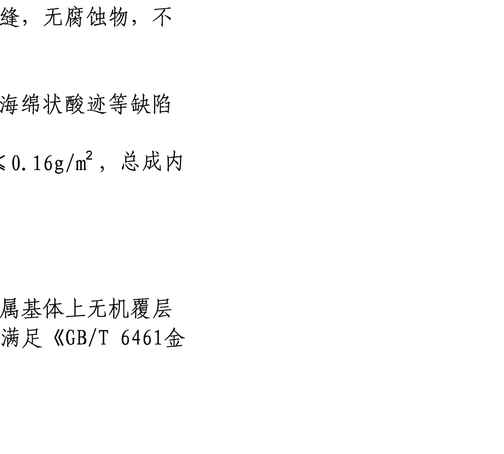

### 提取表格
| 提取项 | 原图数值或文本 | 含义说明 |
|---|---|---|
| PT1/PT2 | PT1/PT2 | 钢管1与BANJO连接处点位。 |
| 77°±2° | 77°±2° | BANJO与钢管夹角。 |

### 边界归属说明
PT1/PT2处钢管与BANJO连接角度，标注77°±2°。仅提取本裁切对象内的标注、表格或文字；靠近边界的尺寸按完整尺寸线、箭头、标注文字和标题归入本对象。裁切中如可见相邻视图的边缘或辅助片段，不作为本对象提取内容。

## object_11 - PT14端接头尺寸简图 比例4:1

- object_kind: `detail`
- 原图位置/视图名称: page 1, bbox `[3381, 4577, 5045, 6268]`, PT14端接头尺寸简图 比例4:1

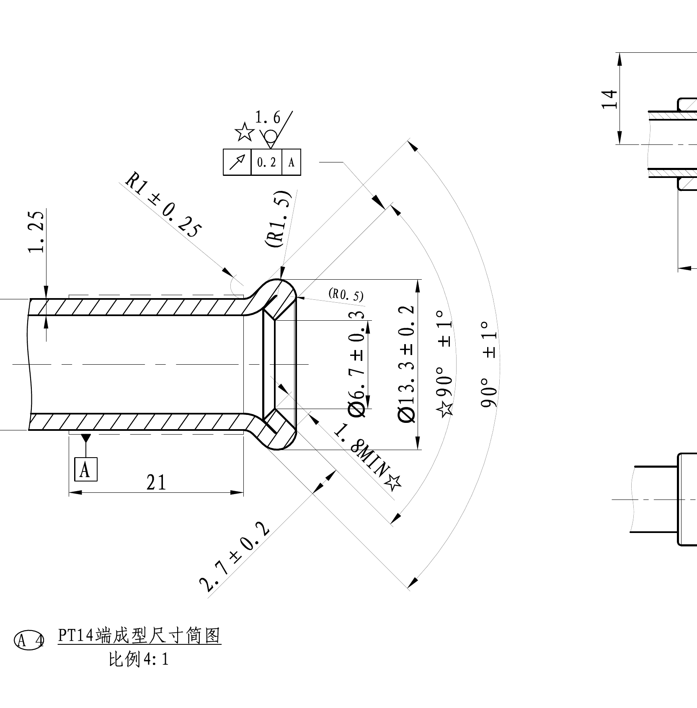

### 提取表格
| 提取项 | 原图数值或文本 | 含义说明 |
|---|---|---|
| φ10±0.1 | φ10±0.1 | 管端外径/孔径。 |
| 1.25 | 1.25 | 壁厚。 |
| 21 | 21 | 直段长度。 |
| A | A | 基准。 |
| R1.1±0.25 | R1.1±0.25 | 端部圆角。 |
| (R1.5) | (R1.5) | 参考半径。 |
| (R0.5) | (R0.5) | 参考半径。 |
| φ6.7±0.2 | φ6.7±0.2 | 内径/口径。 |
| φ13±0.2 | φ13±0.2 | 外径。 |
| φ18+0.2/0 | φ18 +0.2/0 | 外部直径。 |
| 90°±1° | 90°±1° | 端部角度。 |
| 2.1±0.2 | 2.1±0.2 | 局部厚度/长度。 |
| R4MIN | R4MIN | 最小半径。 |

### 边界归属说明
PT14端管接头剖面尺寸，含A基准、直径、角度、半径和长度。仅提取本裁切对象内的标注、表格或文字；靠近边界的尺寸按完整尺寸线、箭头、标注文字和标题归入本对象。裁切中如可见相邻视图的边缘或辅助片段，不作为本对象提取内容。

## object_12 - 部件8 接头尺寸简图 比例2:1

- object_kind: `detail`
- 原图位置/视图名称: page 1, bbox `[5149, 4421, 6761, 6319]`, 部件8 接头尺寸简图 比例2:1

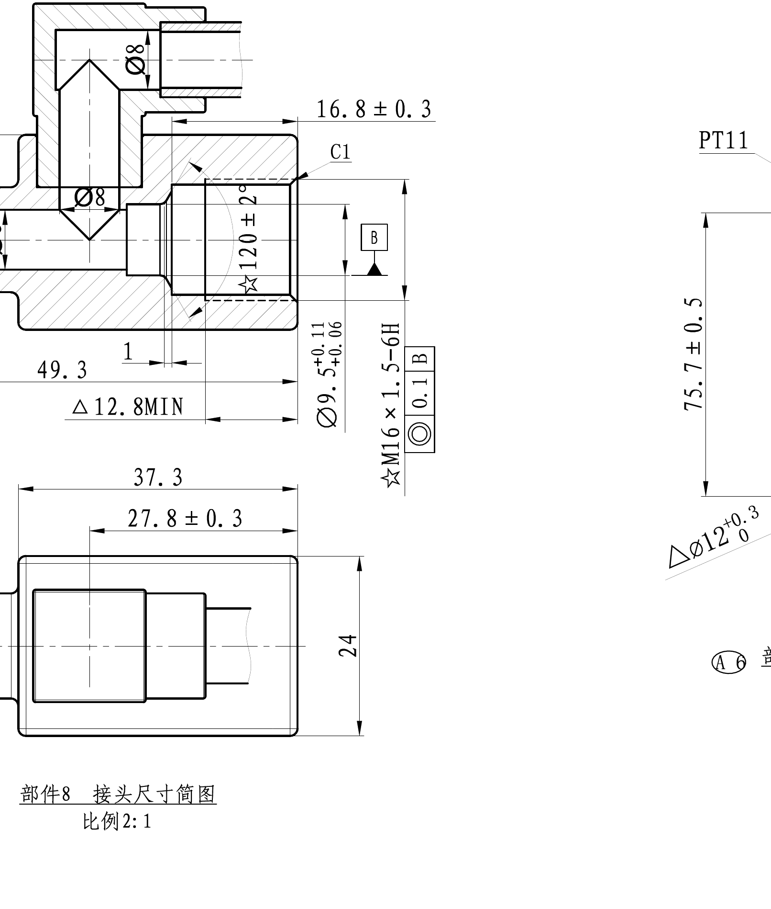

### 提取表格
| 提取项 | 原图数值或文本 | 含义说明 |
|---|---|---|
| 14 | 14 | 上部高度。 |
| φ8 | φ8 | 多处孔径/通径。 |
| 16.8±0.3 | 16.8±0.3 | 上部长度。 |
| C1 | C1 | 倒角。 |
| M12×2 | M12×2 | 螺纹规格。 |
| 49.3 | 49.3 | 主体长度。 |
| △12.8MIN | △12.8MIN | 最小特征尺寸。 |
| 37.3 | 37.3 | 下视图长度。 |
| 27.8±0.3 | 27.8±0.3 | 下视图局部长度。 |
| 24 | 24 | 高度。 |
| φ9.3+0.1/-0.05 | φ9.3 +0.1/-0.05 | 外径/孔径。 |
| M16×1.5-6H | M16×1.5-6H | 内螺纹规格。 |
| 同轴度 | ◎ 0.1 B | 相对基准B同轴度。 |
| 基准 | B | 形位基准。 |

### 边界归属说明
接头剖面和外形视图，含B基准、螺纹、槽、长度及形位公差。仅提取本裁切对象内的标注、表格或文字；靠近边界的尺寸按完整尺寸线、箭头、标注文字和标题归入本对象。裁切中如可见相邻视图的边缘或辅助片段，不作为本对象提取内容。

## object_13 - 部件11 支架安装位置及尺寸简图 比例1:1

- object_kind: `detail`
- 原图位置/视图名称: page 1, bbox `[6380, 4525, 8040, 6293]`, 部件11 支架安装位置及尺寸简图 比例1:1

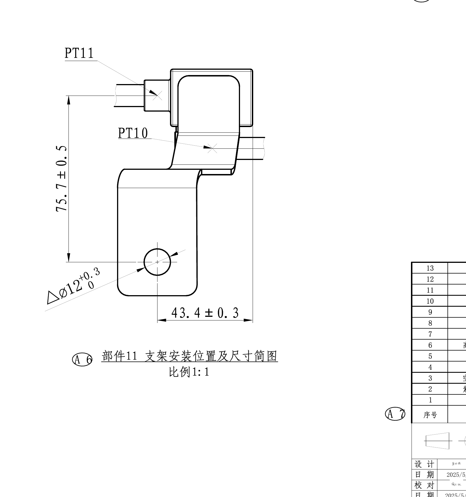

### 提取表格
| 提取项 | 原图数值或文本 | 含义说明 |
|---|---|---|
| PT10 | PT10 | 下方连接点。 |
| PT11 | PT11 | 上方连接点。 |
| 75.7±0.5 | 75.7±0.5 | 安装高度。 |
| 43.4±0.3 | 43.4±0.3 | 支架宽度/孔到边距离。 |
| △φ12+0.3/0 | △φ12 +0.3/0 | 支架孔径/冲孔尺寸。 |

### 边界归属说明
支架相对PT10/PT11位置，含孔径、角度、安装高度、宽度和冲压方向。仅提取本裁切对象内的标注、表格或文字；靠近边界的尺寸按完整尺寸线、箭头、标注文字和标题归入本对象。裁切中如可见相邻视图的边缘或辅助片段，不作为本对象提取内容。

## object_14 - 高压胶管性直制图 1:1

- object_kind: `view`
- 原图位置/视图名称: page 1, bbox `[7334, 3719, 9154, 4499]`, 高压胶管性直制图 1:1

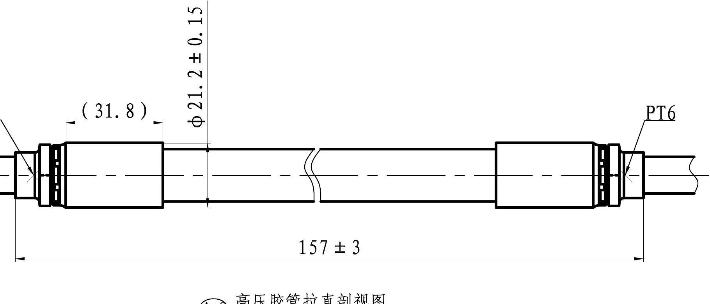

### 提取表格
| 提取项 | 原图数值或文本 | 含义说明 |
|---|---|---|
| PT5/PT6 | PT5 到 PT6 | 高压胶管两端控制点。 |
| (31.8) | (31.8) | 左端参考长度。 |
| φ21.2±0.15 | φ21.2±0.15 | 胶管/套筒外径。 |
| 157±3 | 157±3 | 高压胶管总长度。 |

### 边界归属说明
PT5到PT6高压胶管组件长度和端部尺寸。仅提取本裁切对象内的标注、表格或文字；靠近边界的尺寸按完整尺寸线、箭头、标注文字和标题归入本对象。裁切中如可见相邻视图的边缘或辅助片段，不作为本对象提取内容。

## object_15 - 明细栏 BOM

- object_kind: `table`
- 原图位置/视图名称: page 1, bbox `[7350, 5430, 9350, 6150]`, 明细栏 BOM

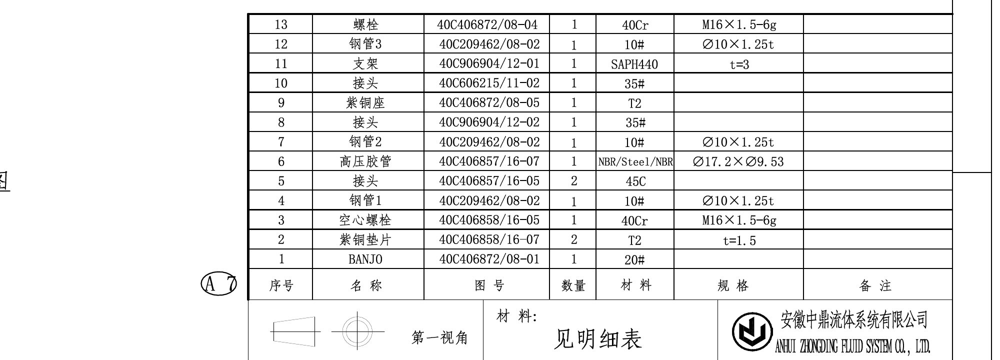

### 原表还原
| 序号 | 名称 | 图号 | 数量 | 材料 | 规格 | 备注 |
|---|---|---|---|---|---|---|
| 13 | 螺栓 | 40C406872/08-04 | 1 | 40Cr | M16×1.5-6g |  |
| 12 | 钢管3 | 40C209462/08-02 | 1 | 10# | Ø10×1.25t |  |
| 11 | 支架 | 40C906904/12-01 | 1 | SAPH440 | t=3 |  |
| 10 | 接头 | 40C606215/11-02 | 1 | 35# |  |  |
| 9 | 紫铜座 | 40C406872/08-05 | 1 | T2 |  |  |
| 8 | 接头 | 40C906904/12-02 | 1 | 35# |  |  |
| 7 | 钢管2 | 40C209462/08-02 | 1 | 10# | Ø10×1.25t |  |
| 6 | 高压胶管 | 40C406857/16-07 | 1 | NBR/Steel/NBR | Ø17.2×Ø9.53 |  |
| 5 | 接头 | 40C406857/16-05 | 2 | 45C |  |  |
| 4 | 钢管1 | 40C209462/08-02 | 1 | 10# | Ø10×1.25t |  |
| 3 | 空心螺栓 | 40C406858/16-05 | 1 | 40Cr | M16×1.5-6g |  |
| 2 | 紫铜垫片 | 40C406858/16-07 | 2 | T2 | t=1.5 |  |
| 1 | BANJO | 40C406872/08-01 | 1 | 20# |  |  |

### 提取表格
| 提取项 | 原图数值或文本 | 含义说明 |
|---|---|---|
| 表头 | 序号 / 名称 / 图号 / 数量 / 材料 / 规格 / 备注 | 物料明细栏列名。 |
| 序号13 | 13 / 螺栓 / 40C406872/08-04 / 1 / 40Cr / M16×1.5-6g /  | 明细栏第13项零件记录。 |
| 序号12 | 12 / 钢管3 / 40C209462/08-02 / 1 / 10# / Ø10×1.25t /  | 明细栏第12项零件记录。 |
| 序号11 | 11 / 支架 / 40C906904/12-01 / 1 / SAPH440 / t=3 /  | 明细栏第11项零件记录。 |
| 序号10 | 10 / 接头 / 40C606215/11-02 / 1 / 35# /  /  | 明细栏第10项零件记录。 |
| 序号9 | 9 / 紫铜座 / 40C406872/08-05 / 1 / T2 /  /  | 明细栏第9项零件记录。 |
| 序号8 | 8 / 接头 / 40C906904/12-02 / 1 / 35# /  /  | 明细栏第8项零件记录。 |
| 序号7 | 7 / 钢管2 / 40C209462/08-02 / 1 / 10# / Ø10×1.25t /  | 明细栏第7项零件记录。 |
| 序号6 | 6 / 高压胶管 / 40C406857/16-07 / 1 / NBR/Steel/NBR / Ø17.2×Ø9.53 /  | 明细栏第6项零件记录。 |
| 序号5 | 5 / 接头 / 40C406857/16-05 / 2 / 45C /  /  | 明细栏第5项零件记录。 |
| 序号4 | 4 / 钢管1 / 40C209462/08-02 / 1 / 10# / Ø10×1.25t /  | 明细栏第4项零件记录。 |
| 序号3 | 3 / 空心螺栓 / 40C406858/16-05 / 1 / 40Cr / M16×1.5-6g /  | 明细栏第3项零件记录。 |
| 序号2 | 2 / 紫铜垫片 / 40C406858/16-07 / 2 / T2 / t=1.5 /  | 明细栏第2项零件记录。 |
| 序号1 | 1 / BANJO / 40C406872/08-01 / 1 / 20# /  /  | 明细栏第1项零件记录。 |

### 边界归属说明
BOM表完整包含序号1-13、名称、图号、数量、材料、规格和备注；下方标题栏信息不归入BOM行内容。仅提取本裁切对象内的标注、表格或文字；靠近边界的尺寸按完整尺寸线、箭头、标注文字和标题归入本对象。裁切中如可见相邻视图的边缘或辅助片段，不作为本对象提取内容。

## object_16 - 标题栏

- object_kind: `title_block`
- 原图位置/视图名称: page 1, bbox `[6950, 5900, 9350, 6620]`, 标题栏

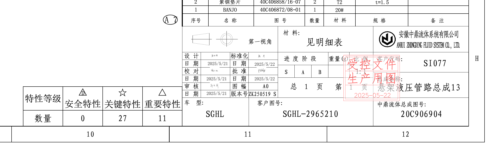

### 提取表格
| 提取项 | 原图数值或文本 | 含义说明 |
|---|---|---|
| 公司 | 安徽中鼎流体系统有限公司 / ANHUI ZHONGDING FLUID SYSTEM CO., LTD. | 出图单位/公司信息。 |
| 图纸名称 | 悬架液压管路总成13 | 图纸/产品名称。 |
| 客户图号 | SGHL-2965210 | 客户图号。 |
| 中鼎流体总成图号 | 20C906904 | 总成图号。 |
| 车型 | SGHL | 车型/项目代号。 |
| 阶段/版本 | S / A / B；版本号 ZK250519 S；客户代码 SI077 | 进度阶段和版本信息。 |
| 日期 | 设计2025/5/21；标准化2025/5/22；校对2025/5/21；批准2025/5/22；审核2025/5/21 | 签署日期。 |
| 图幅 | A0 | 图纸幅面。 |
| 页码 | 总1页 第1页 | 页码信息。 |
| 特性等级数量 | 安全特性0；关键特性27；重要特性11 | 左侧特性等级统计表。 |
| 受控文件章 | 受控文件 生产用图 2025-05-22 | 红色受控章信息。 |

### 边界归属说明
标题栏含公司、视角、签署、阶段、版本、图名、客户图号、总成图号及左侧特性等级统计；其上方BOM末行不作为标题栏字段提取。仅提取本裁切对象内的标注、表格或文字；靠近边界的尺寸按完整尺寸线、箭头、标注文字和标题归入本对象。裁切中如可见相邻视图的边缘或辅助片段，不作为本对象提取内容。

## 裁切检查记录
| 对象 | 检查结果 |
|---|---|
| object_1 | 总成管路走向视图: 完整包含总成管路、PT点、件号框、喷码和PT14附近标注；未将下方零件视图尺寸归入本对象。 |
| object_2 | 更改记录表: 完整包含修订表外框、表头和两条记录；日期列与客户版本号列均未被裁断。 |
| object_3 | POINT COORDINATE CHART 点坐标表: 完整包含点坐标表外框、表头、钢管1/2/3理论长度和所有PT行。 |
| object_4 | 部件13 螺栓尺寸简图 比例2:1: 完整包含螺栓视图、B-B剖面、端视图、尺寸线和标题；与BANJO视图相邻但按标题分开提取。 |
| object_5 | 部件1 BANJO尺寸简图 比例2:1: 完整包含BANJO正视和A-A剖面、尺寸线、公差框、基准和标题。 |
| object_6 | 部件2 紫铜垫片尺寸简图 比例2:1: 完整包含垫片正视/侧视、尺寸线、标题、基准H和公差框。 |
| object_7 | 部件9 螺帽座尺寸简图 比例2:1: 完整包含螺帽座剖面、小端视图、尺寸线、基准N和标题；未混入空心螺栓尺寸。 |
| object_17 | 部件3 空心螺栓尺寸简图 比例2:1: 完整包含空心螺栓剖面、端视图、G基准和标题；与左侧螺帽座视图已区分。 |
| object_8 | 钢管1/3与接头焊接角度 比例1:1: 完整包含PT9/PT10、PT11/PT12焊接角度示意及14°±2°、22°±2°标注。 |
| object_9 | 技术要求 NOTES: 完整包含技术要求1-31条文字；右侧小视图未纳入本对象提取。 |
| object_10 | 钢管1与BANJO焊接角度 比例1:1: 完整包含PT1/PT2与BANJO焊接角度示意和77°±2°标注。 |
| object_11 | PT14端接头尺寸简图 比例4:1: 完整包含PT14端接头剖面尺寸、基准A、参考半径和标题。 |
| object_12 | 部件8 接头尺寸简图 比例2:1: 完整包含部件8接头剖面/外形视图、尺寸线、公差框和标题。 |
| object_13 | 部件11 支架安装位置及尺寸简图 比例1:1: 完整包含支架安装位置视图、PT10/PT11、孔径和安装尺寸。 |
| object_14 | 高压胶管性直制图 1:1: 完整包含高压胶管直制图、两端PT5/PT6、参考长度、外径和总长。 |
| object_15 | 明细栏 BOM: 完整包含BOM表头和序号1-13所有行；底部标题栏内容未作为BOM字段提取。 |
| object_16 | 标题栏: 完整包含标题栏、左侧特性等级表和红色受控章；上方BOM末行不作为标题栏字段提取。 |
