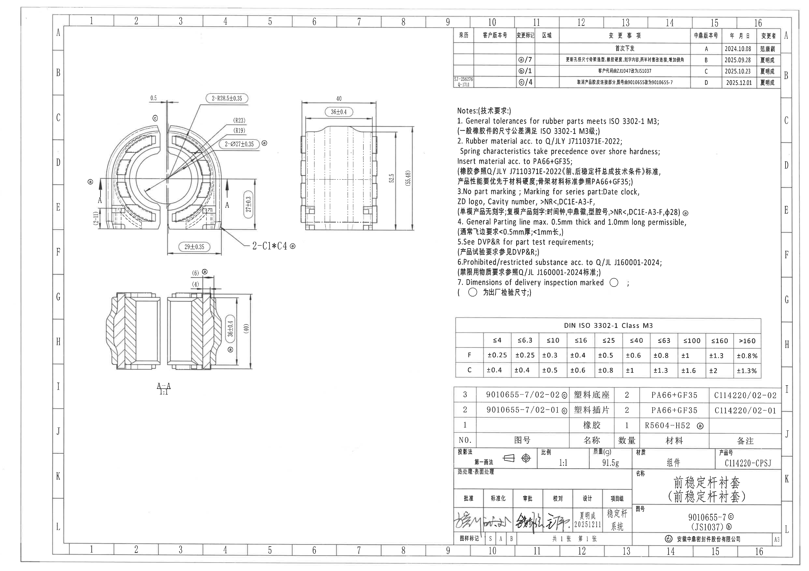
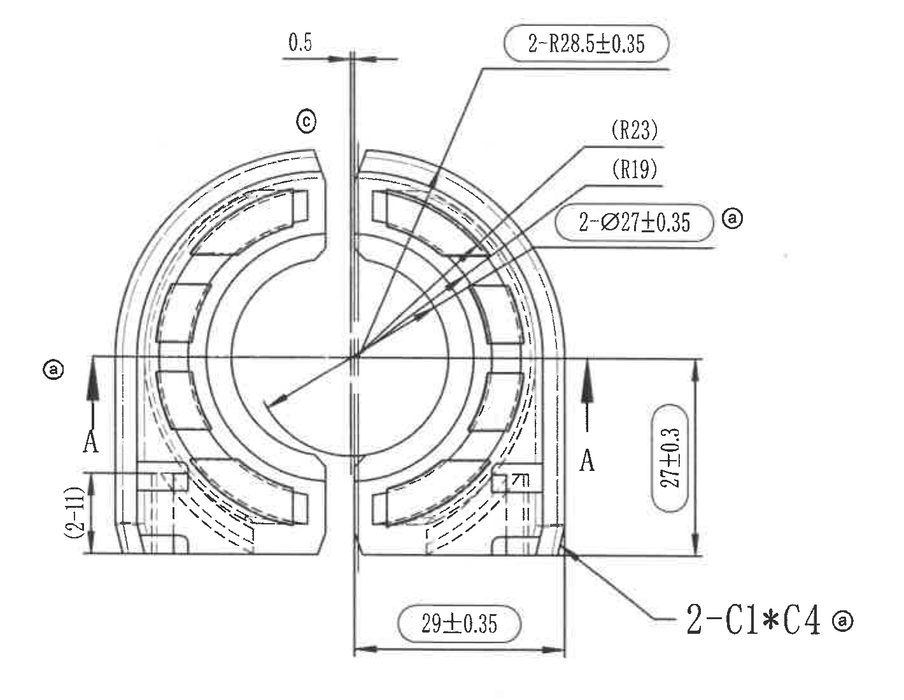
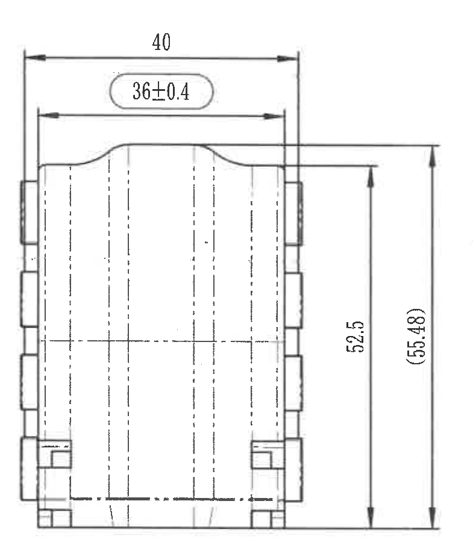
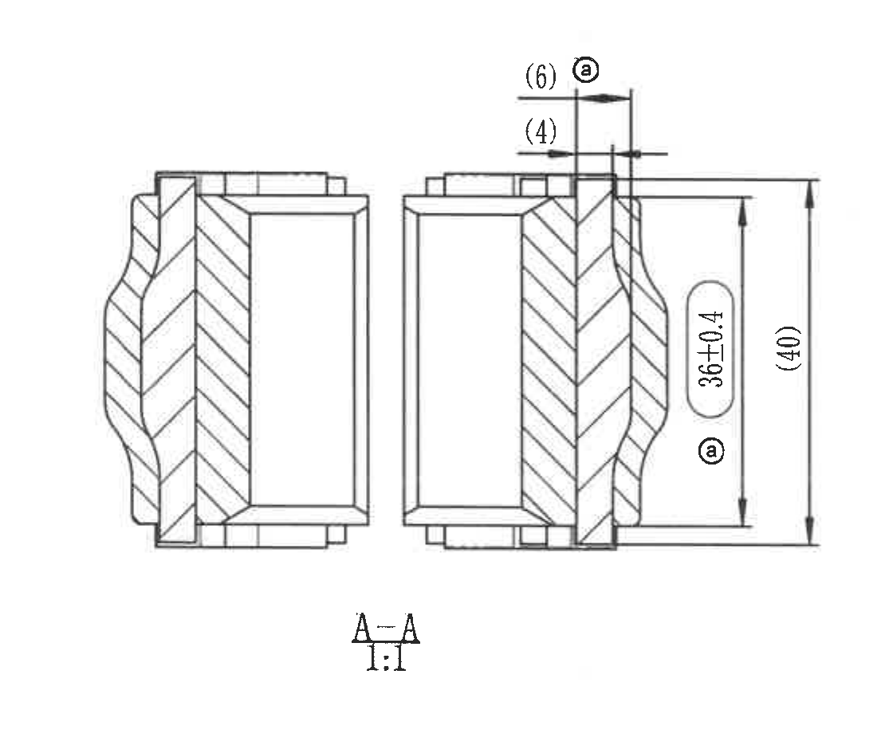
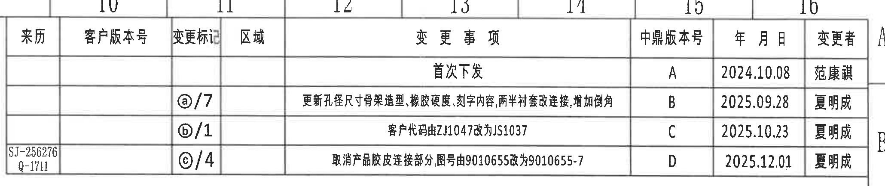
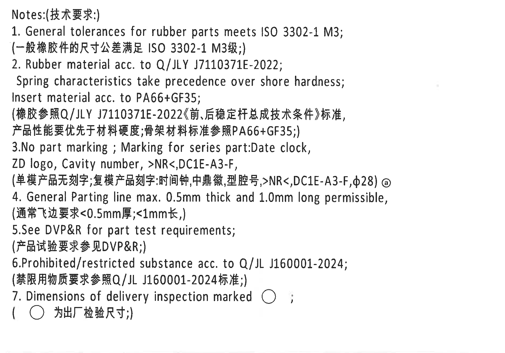
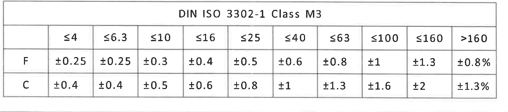
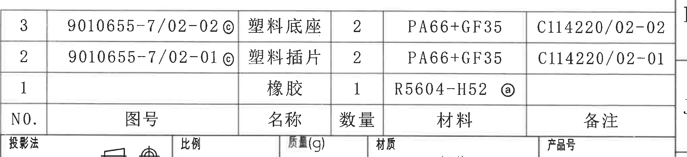
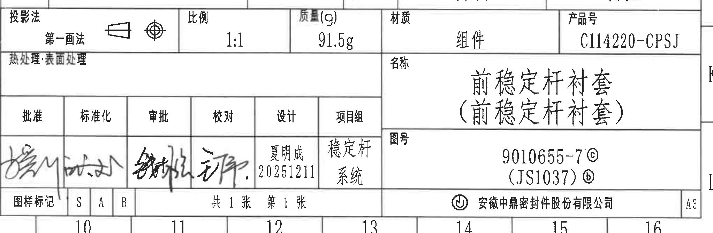

# 20C114220.pdf 内容识别

源文件：`20C114220.pdf`

整页渲染图：

## 左侧图形视图区

### 加工视图 1：主视图

#### 尺寸与标注提取

| 原图标注 | 归属/位置 | 含义说明 |
|---|---|---|
| `0.5` | 主视图上方中线处 | 中央分型/间隙类局部尺寸，表示该处宽度或偏移为 0.5 mm。 |
| `2-R28.5±0.35` | 外侧圆弧引线 | 2 处半径为 R28.5 mm，公差 ±0.35 mm。 |
| `(R23)` | 右上圆弧引线 | 参考半径 R23，括号表示参考尺寸。 |
| `(R19)` | 右上圆弧引线 | 参考半径 R19，括号表示参考尺寸。 |
| `2-Ø27±0.35` | 内孔/圆形特征引线，带检验标记 `ⓐ` | 2 处直径 Ø27 mm，公差 ±0.35 mm；标记为出厂检验尺寸。 |
| `27±0.3` | 右侧竖向尺寸，带检验标记 `ⓐ` | 右侧局部高度/开口相关尺寸为 27 mm，公差 ±0.3 mm；标记为出厂检验尺寸。 |
| `(2-11)` | 左侧竖向局部尺寸 | 括号参考尺寸，原图为 `2-11`，表示该处两处相关局部尺寸/间距按参考值 11 mm 识别。 |
| `29±0.35` | 下方横向尺寸 | 底部开口或两侧基准间距为 29 mm，公差 ±0.35 mm。 |
| `2-C1*C4` | 右下倒角引线，带检验标记 `ⓐ` | 2 处倒角标注；原图写法为 `C1*C4`，表示相关倒角规格。该标注属于主视图，不归入右侧侧视图。 |
| `A-A` 剖切箭头 | 主视图左右两侧 | 表示下方 `A-A` 剖面视图的剖切位置和观察方向。 |
| `ⓐ`、`ⓒ` | 主视图周边标记 | 与变更履历/出厂检验要求关联的标记；`ⓐ` 还对应 Notes 第 7 条的出厂检验尺寸。 |
| 局部小框 `7`（原图局部较模糊） | 主视图右下局部台阶附近 | 局部特征编号或标识，扫描件文字边缘不够清晰，按原图可见内容记录为 `7`。 |

#### 解读

该视图表达零件端面/截面轮廓：外侧和内侧为同心或近同心圆弧结构，左右为开口分体结构；图中标出了内孔直径、外圆弧半径、底部宽度、右侧高度、倒角和 A-A 剖切位置。带 `ⓐ` 的尺寸是出厂检验尺寸，应结合 Notes 第 7 条执行。

### 加工视图 2：右侧视图

#### 尺寸与标注提取

| 原图标注 | 归属/位置 | 含义说明 |
|---|---|---|
| `40` | 顶部外宽尺寸 | 零件侧向总宽度/外形宽度为 40 mm。 |
| `36±0.4` | 顶部内宽尺寸 | 中部有效宽度或内部台阶宽度为 36 mm，公差 ±0.4 mm。 |
| `52.5` | 右侧内竖向尺寸 | 主要高度尺寸为 52.5 mm。 |
| `(55.48)` | 右侧外竖向尺寸 | 参考总高度为 55.48 mm，括号表示参考尺寸。 |
| 中心线和虚线 | 视图内部 | 表示对称中心、隐藏轮廓或内部结构投影。 |

#### 解读

该视图表达零件沿轴向/侧向的外形轮廓和高度宽度关系：外宽为 40 mm，内部或有效宽度为 36±0.4 mm；竖向有主要高度 52.5 mm 和参考总高度 55.48 mm。两侧凸台和底部台阶属于侧向外形结构。

### 剖面视图：A-A

#### 尺寸与标注提取

| 原图标注 | 归属/位置 | 含义说明 |
|---|---|---|
| `(6)` | 剖面右上局部宽度，带检验标记 `ⓐ` | 括号参考尺寸，局部台阶/壁厚相关尺寸为 6 mm，并带 `ⓐ` 检验标记。 |
| `(4)` | 剖面右上局部宽度 | 括号参考尺寸，局部台阶/壁厚相关尺寸为 4 mm。 |
| `36±0.4` | 右侧竖向尺寸，带检验标记 `ⓐ` | 剖面高度/有效高度为 36 mm，公差 ±0.4 mm；标记为出厂检验尺寸。 |
| `(40)` | 右侧外竖向尺寸 | 参考高度 40 mm。 |
| `A-A 1:1` | 剖面下方 | 剖面名称为 A-A，比例 1:1。 |
| 剖面线 | 剖切实体区域 | 斜线填充表示被剖切到的材料实体。 |

#### 解读

该视图按主视图中的 A-A 剖切线展开，表达橡胶件与嵌件/骨架在剖切截面中的厚度、台阶和装配关系。右侧标注的 `36±0.4` 与 `(40)` 对应剖面高度控制；顶部 `(6)`、`(4)` 为局部参考尺寸。

## 右侧表格与文字区

### 变更履历表

| 来历 | 客户版本号 | 变更标记 | 区域 | 变更事项 | 中鼎版本号 | 年月日 | 变更者 |
|---|---|---|---|---|---|---|---|
|  |  |  |  | 首次下发 | A | 2024.10.08 | 范康谟 |
|  |  | `ⓐ/7` |  | 更新孔径尺寸、骨架造型、橡胶硬度、刻字内容、两半衬套改连接、增加倒角 | B | 2025.09.28 | 夏明成 |
|  |  | `ⓑ/1` |  | 客户代码由 ZJ1047 改为 JS1037 | C | 2025.10.23 | 夏明成 |
| `SJ-256276` / `Q-1711` |  | `ⓒ/4` |  | 取消产品胶皮连接部分图号由 9010655 改为 9010655-7 | D | 2025.12.01 | 夏明成 |

### Notes: 技术要求

1. General tolerances for rubber parts meets ISO 3302-1 M3;
   （一般橡胶件的尺寸公差满足 ISO 3302-1 M3级;）
2. Rubber material acc. to Q/JLY J7110371E-2022;
   Spring characteristics take precedence over shore hardness;
   Insert material acc. to PA66+GF35;
   （橡胶参照 Q/JLY J7110371E-2022《前、后稳定杆总成技术条件》标准，
   产品性能要优先于材料硬度;骨架材料标准参照 PA66+GF35;）
3. No part marking; Marking for series part: Date clock,
   ZD logo, Cavity number, >NR<, DC1E-A3-F,
   （单模产品无刻字;复模产品刻字:时间钟,中鼎徽,型腔号,>NR<,DC1E-A3-F,φ28）`ⓐ`
4. General Parting line max. 0.5mm thick and 1.0mm long permissible,
   （通常飞边要求 <0.5mm厚; <1mm长;）
5. See DVP&R for part test requirements;
   （产品试验要求参见 DVP&R;）
6. Prohibited/restricted substance acc. to Q/JL J160001-2024;
   （禁限用物质要求参照 Q/JL J160001-2024标准;）
7. Dimensions of delivery inspection marked `○`;
   （`○` 为出厂检验尺寸;）

### DIN ISO 3302-1 Class M3 公差表

|  | ≤4 | ≤6.3 | ≤10 | ≤16 | ≤25 | ≤40 | ≤63 | ≤100 | ≤160 | >160 |
|---|---|---|---|---|---|---|---|---|---|---|
| F | ±0.25 | ±0.25 | ±0.3 | ±0.4 | ±0.5 | ±0.6 | ±0.8 | ±1 | ±1.3 | ±0.8% |
| C | ±0.4 | ±0.4 | ±0.5 | ±0.6 | ±0.8 | ±1 | ±1.3 | ±1.6 | ±2 | ±1.3% |

### 明细表

| NO. | 图号 | 名称 | 数量 | 材料 | 备注 |
|---|---|---|---|---|---|
| 3 | `9010655-7/02-02` `ⓒ` | 塑料底座 | 2 | PA66+GF35 | C114220/02-02 |
| 2 | `9010655-7/02-01` `ⓒ` | 塑料插片 | 2 | PA66+GF35 | C114220/02-01 |
| 1 |  | 橡胶 | 1 | R5604-H52 `ⓐ` |  |

### 标题栏

| 字段 | 原图内容 |
|---|---|
| 投影法 | 第一画法 |
| 比例 | 1:1 |
| 质量(g) | 91.5g |
| 材质 | 组件 |
| 产品号 | C114220-CPSJ |
| 热处理/表面处理 | 空白 |
| 名称 | 前稳定杆衬套（前稳定杆衬套） |
| 图号 | 9010655-7 `ⓒ`；(JS1037) `ⓑ` |
| 批准 | 签名，原图手写 |
| 标准化 | 签名，原图手写 |
| 审批 | 签名，原图手写 |
| 校对 | 签名，原图手写 |
| 设计 | 夏明成；20251211 |
| 项目组 | 稳定杆系统 |
| 图样标记 | S / A / B |
| 页数 | 共 1 张，第 1 张 |
| 公司 | 安徽中鼎密封件股份有限公司 |
| 图幅 | A3 |

## 裁切检查记录

| 图片 | 检查结果 |
|---|---|
| `view_01_main_front.png` | 已包含主视图完整图形、尺寸线、剖切箭头和右下 `2-C1*C4` 标注；已移除右侧相邻侧视图片段。 |
| `view_02_right_side.png` | 已包含侧视图完整图形、顶部和右侧尺寸线及文字。 |
| `view_03_section_A-A.png` | 已包含 A-A 剖面完整图形、尺寸线、剖面标题和比例。 |
| `table_01_revision_history.png` | 已包含变更履历表表头、全部行和外边框。 |
| `notes_01_technical_requirements.png` | 已包含 Notes 标题及 1-7 条技术要求。 |
| `table_02_tolerance.png` | 已包含 DIN ISO 3302-1 Class M3 表格全部列、行和边框。 |
| `table_03_bom.png` | 已包含明细表 1-3 行及表头。 |
| `title_block.png` | 已包含标题栏主要字段、签名区、图号/名称/公司/图幅信息。 |
