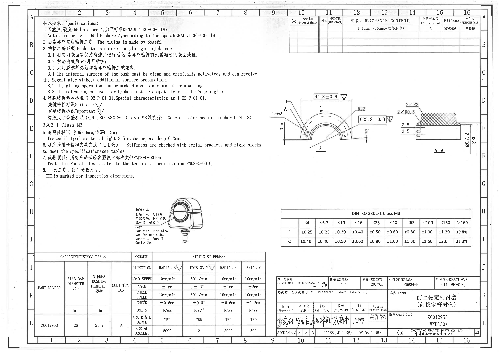
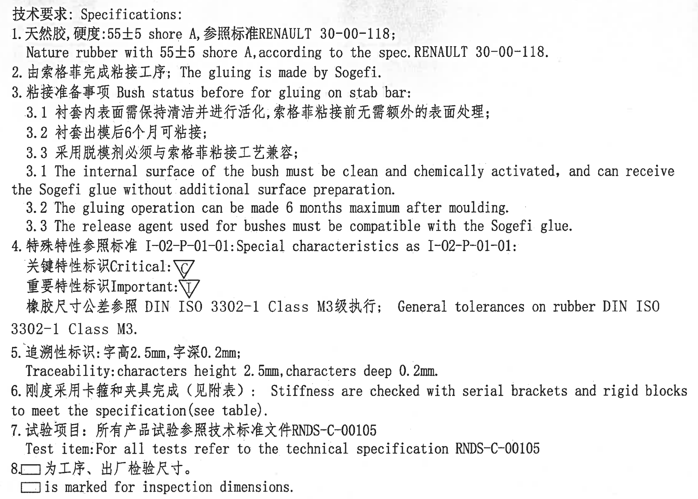
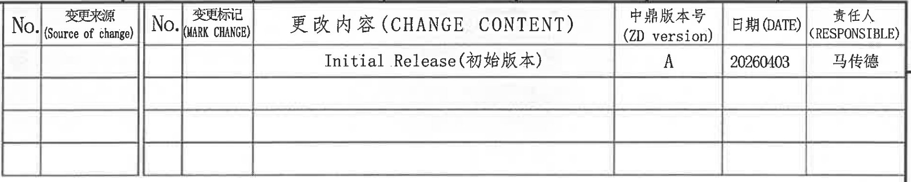
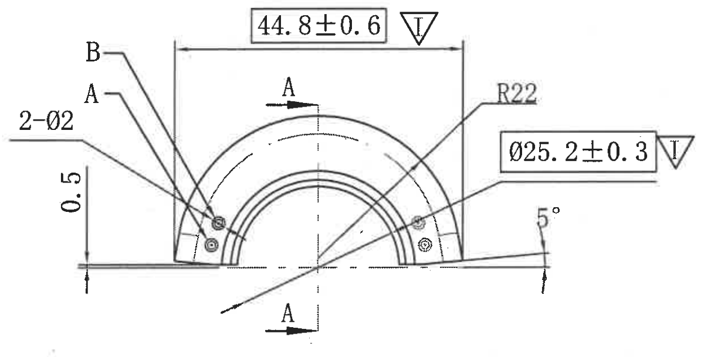
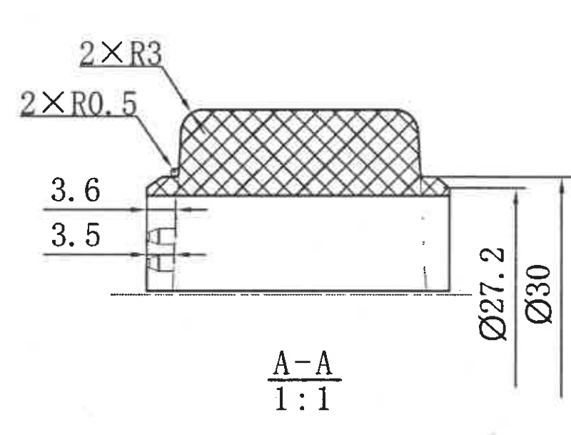
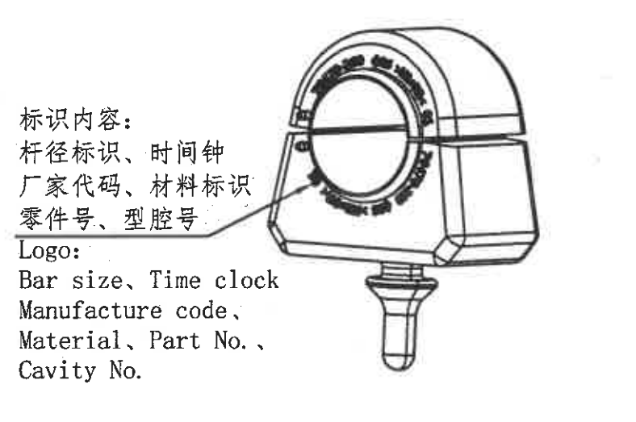
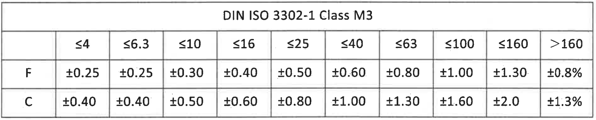
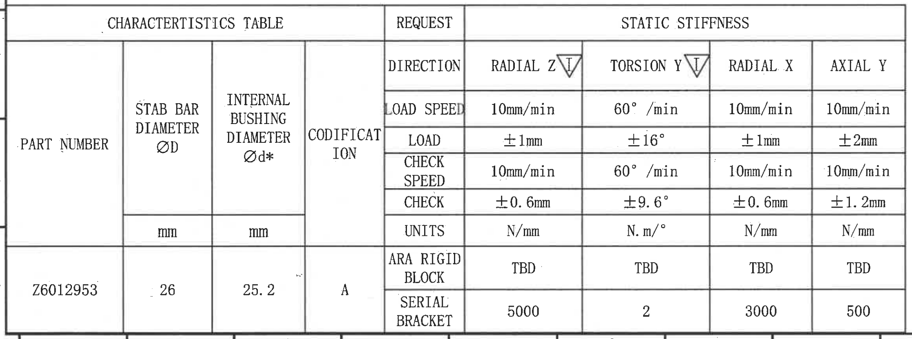
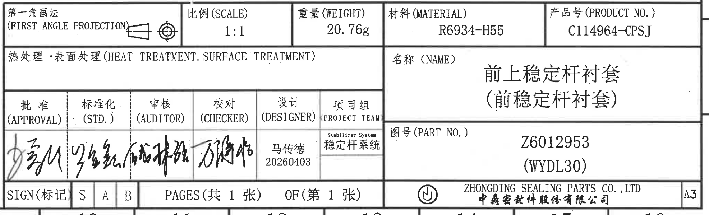

# 20C114964.pdf 内容识别

## 整页渲染



图纸为单页工程图。页面结构按原图位置分为：左上技术要求/NOTES，右上变更表，中右主视图和 A-A 剖面，左中标识局部视图，右中公差表，左下特性表，右下标题栏。

## 技术要求 / Specifications



1. 天然胶，硬度：55±5 shore A，参照标准 RENAULT 30-00-118;  
   Nature rubber with 55±5 shore A, according to the spec. RENAULT 30-00-118.
2. 由索格菲完成粘接工序；The gluing is made by Sogefi.
3. 粘接准备事项 Bush status before for gluing on stab bar:
   3.1 衬套内表面需保持清洁并进行活化，索格菲粘接前无需额外的表面处理；  
   3.2 衬套出模后 6 个月可粘接；  
   3.3 采用脱模剂必须与索格菲粘接工艺兼容；  
   3.1 The internal surface of the bush must be clean and chemically activated, and can receive the Sogefi glue without additional surface preparation.  
   3.2 The gluing operation can be made 6 months maximum after moulding.  
   3.3 The release agent used for bushes must be compatible with the Sogefi glue.
4. 特殊特性参照标准 I-02-P-01-01: Special characteristics as I-02-P-01-01:  
   关键特性标识 Critical: △C  
   重要特性标识 Important: ▽I  
   橡胶尺寸公差参照 DIN ISO 3302-1 Class M3 级执行；General tolerances on rubber DIN ISO 3302-1 Class M3.
5. 追溯性标识：字高 2.5mm，字深 0.2mm;  
   Traceability: characters height 2.5mm, characters deep 0.2mm.
6. 刚度采用卡箍和夹具完成（见附表）：Stiffness are checked with serial brackets and rigid blocks to meet the specification (see table).
7. 试验项目：所有产品试验参照技术标准文件 RNDS-C-00105  
   Test item: For all tests refer to the technical specification RNDS-C-00105.
8. □ 为工序、出厂检验尺寸。  
   □ is marked for inspection dimensions.

## 变更表



| No. | 变更来源 (Source of change) | No. | 变更标记 (MARK CHANGE) | 更改内容 (CHANGE CONTENT) | 中鼎版本号 (ZD version) | 日期 (DATE) | 责任人 (RESPONSIBLE) |
|---|---|---|---|---|---|---|---|
|  |  |  |  | Initial Release (初始版本) | A | 20260403 | 马传德 |
|  |  |  |  |  |  |  |  |
|  |  |  |  |  |  |  |  |
|  |  |  |  |  |  |  |  |

## 主视图



原图信息提取：

| 标注 | 原图含义/解读 |
|---|---|
| 44.8±0.6，▽I | 主视图上方横向总体尺寸，标为重要特性。 |
| R22 | 外侧上部圆弧半径。 |
| Ø25.2±0.3，▽I | 内孔/衬套内径相关尺寸，标为重要特性。该尺寸也在特性表中作为 INTERNAL BUSHING DIAMETER Ød* 出现。 |
| 2-Ø2 | 两处直径 2 的孔/圆形特征。 |
| 0.5 | 左侧局部竖向尺寸。 |
| 5° | 右下基准线处的倾斜角度。 |
| A-A | 剖切位置标识，指向下方 A-A 剖面视图。 |
| A、B 引出标记 | 两个引出标记指向主视图左侧局部特征，原图未在该视图区给出独立尺寸值。 |

## A-A 剖面视图



原图信息提取：

| 标注 | 原图含义/解读 |
|---|---|
| A-A 1:1 | A-A 剖面，比例 1:1。 |
| 2×R3 | 两处 R3 圆角，位于上部橡胶截面外角。 |
| 2×R0.5 | 两处 R0.5 圆角，位于左上台阶/小圆角处。 |
| 3.6 | 左端局部结构的水平尺寸。 |
| 3.5 | 左端局部结构的水平尺寸。 |
| Ø27.2 | 剖面右侧竖向直径尺寸。 |
| Ø30 | 剖面右侧外侧竖向直径尺寸。 |
| 剖面网格线 | 上部区域为剖切材料区域，按剖面线显示。 |

## 标识局部视图



原图文本：

```text
标识内容:
杆径标识、时间钟
厂家代码、材料标识
零件号、型腔号
Logo:
Bar size, Time clock
Manufacture code,
Material, Part No.,
Cavity No.
```

含义解读：该局部视图说明零件外表面的追溯性标识内容，包含杆径、时间钟、厂家代码、材料、零件号和型腔号；技术要求第 5 条规定该类字符高度 2.5mm、深度 0.2mm。

## 公差表



DIN ISO 3302-1 Class M3

|  | ≤4 | ≤6.3 | ≤10 | ≤16 | ≤25 | ≤40 | ≤63 | ≤100 | ≤160 | >160 |
|---|---:|---:|---:|---:|---:|---:|---:|---:|---:|---:|
| F | ±0.25 | ±0.25 | ±0.30 | ±0.40 | ±0.50 | ±0.60 | ±0.80 | ±1.00 | ±1.30 | ±0.8% |
| C | ±0.40 | ±0.40 | ±0.50 | ±0.60 | ±0.80 | ±1.00 | ±1.30 | ±1.60 | ±2.0 | ±1.3% |

含义解读：该表给出橡胶尺寸通用公差，图纸技术要求第 4 条指定按 DIN ISO 3302-1 Class M3 执行。

## 特性表 / Characteristics Table



| PART NUMBER | STAB BAR DIAMETER ØD (mm) | INTERNAL BUSHING DIAMETER Ød* (mm) | CODIFICATION |
|---|---:|---:|---|
| Z6012953 | 26 | 25.2 | A |

| REQUEST | RADIAL Z ▽I | TORSION Y ▽I | RADIAL X | AXIAL Y |
|---|---:|---:|---:|---:|
| LOAD SPEED | 10mm/min | 60°/min | 10mm/min | 10mm/min |
| LOAD | ±1mm | ±16° | ±1mm | ±2mm |
| CHECK SPEED | 10mm/min | 60°/min | 10mm/min | 10mm/min |
| CHECK | ±0.6mm | ±9.6° | ±0.6mm | ±1.2mm |
| UNITS | N/mm | N.m/° | N/mm | N/mm |
| ARA RIGID BLOCK | TBD | TBD | TBD | TBD |
| SERIAL BRACKET | 5000 | 2 | 3000 | 500 |

含义解读：该表关联零件号 Z6012953 的杆径、内衬套直径、编码和静态刚度测试要求。RADIAL Z 与 TORSION Y 标有重要特性符号；测试方向包括径向 Z、扭转 Y、径向 X 和轴向 Y，并列出加载速度、加载量、检查速度、检查量、单位、刚性块和序列卡箍要求。

## 标题栏



| 字段 | 原图内容 |
|---|---|
| 第一角画法 (FIRST ANGLE PROJECTION) | 第一角投影符号 |
| 比例 (SCALE) | 1:1 |
| 重量 (WEIGHT) | 20.76g |
| 材料 (MATERIAL) | R6934-H55 |
| 产品号 (PRODUCT NO.) | C114964-CPSJ |
| 热处理·表面处理 (HEAT TREATMENT. SURFACE TREATMENT) | 空白 |
| 名称 (NAME) | 前上稳定杆衬套（前稳定杆衬套） |
| 图号 (PART NO.) | Z6012953 (WYDL30) |
| 批准 (APPROVAL) | 手写签名，无法可靠识别 |
| 标准化 (STD.) | 手写签名，无法可靠识别 |
| 审核 (AUDITOR) | 手写签名，无法可靠识别 |
| 校对 (CHECKER) | 手写签名，无法可靠识别 |
| 设计 (DESIGNER) | 马传德 / 20260403 |
| 项目组 (PROJECT TEAM) | Stabilizer System / 稳定杆系统 |
| SIGN (标记) | S / A / B |
| PAGES | 共 1 张 |
| OF | 第 1 张 |
| 公司 | ZHONGDING SEALING PARTS CO., LTD / 中鼎密封件股份有限公司 |
| 图幅 | A3 |
