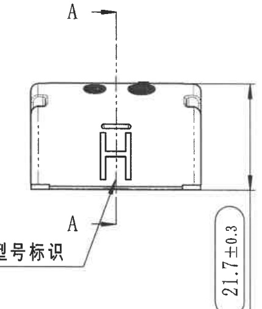

# -_2 内容识别

## 视图 1

基于您提供的机械制造图纸局部视图，以下是对图中内容的解读：

### 尺寸、标注提取

| 提取项 | 原图数值或文本 | 含义解读 |
| :--- | :--- | :--- |
| **垂直高度/壁厚尺寸** | `(0.5)` | 表示该拱形结构的垂直高度（或特定层的厚度）为 **0.5**。括号 `()` 通常表示该尺寸为**参考尺寸**（Reference Dimension），即由其他尺寸推导而来，仅供读取参考，不作为加工检验的直接依据。 |
| **外层轮廓标识** | `(RAR)` | 指向最外层的圆弧轮廓线。`RAR` 通常是设计内部定义的缩写代码，可能代表 **R**adius **A**rch **R**ing（半径拱环）、**R**einforced **A**rch **R**ail（加强拱轨）或特定的材料/区域代号。结合括号看，这也可能是一个参考性的区域定义。 |
| **内层轮廓标识** | `(RIR)` | 指向内侧的一层圆弧轮廓线。与 `RAR` 对应，`RIR` 可能代表 **R**adius **I**nner **R**ing（半径内环）或 **R**einforced **I**nner **R**ail（加强内轨）。箭头明确指示了该代号所指代的具体几何边界。 |
| **几何结构特征** | 网格状半圆拱 | 视图展示了一个半圆形的拱顶结构，内部包含经纬线状的网格（可能是钢筋网、加强筋或散热片结构）。底部两侧有直角符号（$\square$），表示底座与水平基准面垂直（90度）。中心有一条竖直的点划线，表示该结构关于中心轴对称。 |

**补充说明：**
*   **视图类型**：这是一个剖面图或正视图，展示了拱形组件的截面形状和分层结构。
*   **符号含义**：图中的引线将文字标签（RAR, RIR）与具体的几何线条关联起来，用于在技术文档或BOM（物料清单）中区分不同的部件层级。

## 视图 2

根据提供的机械制造图纸（截面图 B-B），以下是对图中内容的详细解读：

### 尺寸、标注提取

| 提取项 | 原图数值或文本 | 含义解读 |
| :--- | :--- | :--- |
| **视图名称** | `B-B` | 表示这是沿图纸其他视图中“B-B”剖切线生成的**剖面图**（Section View），用于展示内部结构。 |
| **水平参考尺寸** | `(31.23)` | 零件的总宽度/外径为 31.23。**括号 `()` 表示这是一个参考尺寸**（Reference Dimension），通常由其他尺寸推导而来，加工时不作为主要检验依据，仅供参考。 |
| **垂直高度尺寸 1** | `T1±0.3` | 内部组件（可能是芯线或内层绝缘）的高度/厚度尺寸为 T1，公差范围为 ±0.3mm。`T` 通常代表 Thickness（厚度）。 |
| **垂直高度尺寸 2** | `T2±0.3` | 零件的总高度/外径尺寸为 T2，公差范围为 ±0.3mm。 |
| **部件序号** | `1` | 引线指向外层的网格状区域，代表**外层护套、屏蔽层或编织层**。剖面线（交叉斜线）通常表示橡胶、塑料或编织材料。 |
| **部件序号** | `2` | 引线指向内部的矩形实体，代表**内部导体、加强筋或中心元件**。 |
| **材料说明** | `材料标识: \NR` (右下角部分可见) | 提示该零件的材料属性。`\NR` 很可能指代 **NR (Natural Rubber，天然橡胶)**，表明该部件（特别是标号1的部分）可能是橡胶材质的密封件或护套。 |
| **几何特征** | 顶部圆角 | 标号1所示的外层部件顶部两侧呈现圆弧过渡，未标注具体半径，通常按未注圆角处理（如 R0.5-R1 左右），用于防止应力集中或便于装配。 |
| **配合关系** | 凹槽与凸起 | 标号1（外层）下方有凹槽，包裹着下方的基座；标号2（内层）嵌入在标号1中间。这是一种典型的**过盈配合或嵌件 molding** 结构。 |

### 总结
这是一个类似**橡胶密封条、电缆接头或异形密封圈**的截面图。
*   **结构**：由外层弹性体（1，可能是天然橡胶 NR）和内部嵌入件（2）组成。
*   **关键控制点**：主要控制总宽（参考值 31.23）、总高（T2）以及内部核心高度（T1），公差均为 ±0.3mm，属于中等精度的橡胶/塑料件加工要求。

## 视图 3

根据您提供的机械制造图纸（局部视图），以下是对图中尺寸、标注及设计参数的解读：

### 尺寸、标注提取

| 提取项 | 原图数值或文本 | 含义解读 |
| :--- | :--- | :--- |
| **标题/说明** | `识、MUBEA图号` | 左上角文字，表明该零件可能属于 **MUBEA**（慕贝尔，知名汽车弹簧/零部件制造商）的图号体系或相关识别信息。 |
| **外圆弧半径** | `R21.7±0.3` | 零件外轮廓（凸面）的圆弧半径为 **21.7 mm**，允许公差范围为 **±0.3 mm**。 |
| **内孔/内弧直径** | `Φ20.7` | 零件内部圆弧（凹面）对应的直径为 **20.7 mm**（即内半径约为 10.35 mm）。这通常表示该半圆环状零件配合的轴径或内径尺寸。 |
| **零件编号/代码** | `91983250` | 位于圆弧中间的长串数字，大概率为该零件的 **物料号、图号或模具号**。 |
| **竖向高度尺寸** | `(0.5)` | 右侧标注的高度尺寸为 **0.5 mm**。加括号 `()` 通常表示这是 **参考尺寸**（Reference Dimension），仅供读取，不作为严格的检验标准，或者是由其他尺寸推导出的结果（例如材料厚度或特定位置的高度差）。 |
| **关键特性/特殊直径** | `ØE±0.3` | 右下角框内的标注。`Ø` 代表直径；`E` 在此处很可能是一个 **变量代号**（如 Effective Diameter 有效直径，或特定模具编号 E），也可能是特殊符号的转写；公差为 **±0.3 mm**。这通常指代某个未直接画出但需控制的关键直径尺寸。 |
| **几何形状** | 半圆环状结构 | 视图显示为一个 **180度的半圆形** 零件（类似轴瓦、止推垫片或离合器片的一半），中间有三个矩形的凹槽或凸起结构（可能是定位槽或加强筋）。 |

## 视图 4

根据您提供的机械制造图纸局部视图，以下是对图中内容的详细解读：

### 尺寸、标注提取

| 提取项 | 原图数值或文本 | 含义解读 |
| :--- | :--- | :--- |
| **竖向外形尺寸** | `21.7 +0.3` (注：下方无负公差显示，通常默认为0或单向公差) | 零件右侧边缘的总高度（或宽度，取决于视图方向）为 **21.7 mm**。标注形式暗示这是一个单向正公差，即允许最大尺寸为 22.0 mm，最小尺寸为 21.7 mm。 |
| **剖切符号/视图索引** | `A - A` (顶部箭头A与底部引线A) | 表示该视图是沿着 **A-A 剖切线** 进行的剖视图或向视图。顶部的箭头指示了观察方向（从上往下看），底部的 `A` 指向了具体的特征位置。 |
| **文字说明/注释** | `型号标识` | 指向中间类似“工”字形的凹槽或凸起结构。说明该特定形状的区域用于刻印、激光打标或模具成型产品的**型号信息**。 |
| **内部结构特征** | “工”字形轮廓 | 位于视图中央，结合“型号标识”说明，这是为了容纳型号文字而设计的特定沉槽或凸台形状。 |
| **安装/定位孔** | 顶部两个黑色椭圆 | 位于中心线两侧对称分布，通常代表螺丝孔、定位销孔或传感器开孔。由于是斜视或透视效果，圆孔呈现为椭圆形。 |
| **对称中心线** | 竖直点划线 | 穿过两个顶部圆孔和中间“工”字形结构的中心，表示该零件在左右方向上是**对称设计**的。 |
| **角部特征** | 四角的圆弧/倒角 | 零件四个角均有圆角处理（Fillet），虽然未直接标注半径数值（R值），但在机械加工中用于去毛刺、防止应力集中或配合外壳装配。 |
| **虚线轮廓** | 内部两侧的竖直虚线 | 表示在该视图视角下不可见的内部棱边或台阶，暗示该零件内部可能有空腔或壁厚变化。 |
