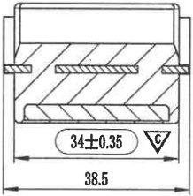
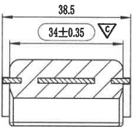
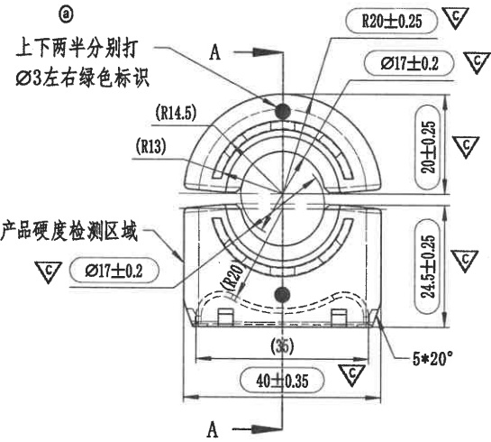

# 20C114257-Y 内容识别

## 视图 1

根据提供的机械制造图纸视图，以下是对图中内容的详细解读：

### 尺寸、标注提取

| 提取项 | 原图数值或文本 | 含义解读 |
| :--- | :--- | :--- |
| **关键配合尺寸** | `34±0.35` (带倒三角符号) | 内部两个侧壁（或槽口）之间的水平距离为 34mm，公差范围为 ±0.35mm。右侧的倒三角形符号（▽）通常表示**重要特性**、**配合面**或**关键控制尺寸**，意味着该尺寸对装配或功能至关重要，需重点检测。 |
| **外部总宽尺寸** | `38.5` | 零件外轮廓的最大水平宽度为 38.5mm。此尺寸未标注公差，通常遵循图纸标题栏中的“未注公差”标准（如 ISO 2768-m）。 |
| **剖面线（阴影）** | 斜线填充区域 | 表示该视图为**剖视图**（Section View）。斜线部分代表被切割到的实体材料，空白部分代表空腔、孔洞或非实体区域。 |
| **结构特征** | 顶部U型开口与两侧凸台 | 顶部显示为一个向上的开口结构（可能是卡槽或安装位），两侧有向外突出的台阶/法兰结构，用于限位或固定。 |
| **底部特征** | 底部圆角长孔/槽 | 剖面图下方显示一个长条形的空腔，两端呈圆弧状，可能用于减轻重量、走线或作为安装滑槽。 |

**补充说明：**
*   **关于角度与弧度：** 图中未直接标注具体的角度数值（如 45°）或半径数值（如 R5），但底部空腔的两端明显为圆弧过渡，实际加工时通常会有默认的圆角要求（如 R1-R3）。
*   **关于视图类型：** 这是一个典型的局部剖视或全剖视图，旨在清晰展示零件内部的壁厚、空腔结构以及关键配合位置的尺寸关系。

## 视图 2

根据您提供的机械制造图纸视图，以下是对图中尺寸、标注及符号的详细解读：

### 尺寸、标注提取

| 提取项 | 原图数值或文本 | 含义解读 |
| :--- | :--- | :--- |
| **外部总宽尺寸** | `38.5` | 零件最外侧（包含两侧凸耳/法兰）的总宽度为 38.5 mm。此尺寸为基本尺寸，未注公差通常遵循一般公差标准。 |
| **内部关键间距尺寸** | `34±0.35` | 两个侧向凸台（或安装孔中心/内侧壁）之间的水平距离为 34 mm，允许的加工误差范围为 ±0.35 mm（即 33.65 ~ 34.35 mm）。 |
| **特殊特性符号** | `▽C` (倒三角形内含C) | 位于尺寸 `34±0.35` 旁。通常表示该尺寸为**关键特性 (Critical Characteristic)** 或**重要配合尺寸**。在质量控制中，该尺寸可能需要更高的检测频率或过程能力指数（Cpk）管控。 |
| **剖面线（阴影）** | 斜线填充区域 | 表示该零件被剖切后的实体材料部分。图示显示该零件主体为实心块状，中间有一个横向的通槽或孔（由上下两条剖面线中间的空白区域表示）。 |
| **轮廓形状** | 顶部圆角矩形 | 零件上部边缘呈现圆弧过渡（圆角），而非尖锐直角，这通常是为了减少应力集中或便于装配。 |

**补充说明：**
*   **视图类型**：这是一个局部剖视图或断面图，主要展示了零件的宽度方向尺寸及内部结构。
*   **单位**：机械制图中默认单位通常为毫米（mm）。

## 视图 3

根据提供的机械制造图纸，以下是对图中尺寸、标注及设计说明的详细解读：

### 尺寸、标注提取

| 提取项 | 原图数值或文本 | 含义解读 |
| :--- | :--- | :--- |
| **视图标识** | `ⓐ` | 表示这是零件图中的 **a 向视图**（通常对应剖面线 A-A 的投影方向）。 |
| **文字说明/工艺要求** | `上下两半分别打 Ø3左右绿色标识` | **装配或加工指示**：该零件由上下两个半圆部分组成，需要在每半部分的左右两侧分别打上直径为 3mm 的绿色标记点（可能是为了区分方向或作为组装对位点）。 |
| **关键特性/特殊区域** | `产品硬度检测区域` (配合 `▽C` 符号) | 指出图中特定区域（箭头指向的内圆弧面附近）需要进行硬度测试；`▽C` 通常代表**关键特性 (Critical Characteristic)** 或重要控制点，需重点管控。 |
| **上部外轮廓半径** | `R20±0.25` | 上半部分最外侧圆弧的半径为 20mm，公差范围为 ±0.25mm。 |
| **上部内孔直径** | `Ø17±0.2` | 上半部分中心通孔（或沉孔）的直径为 17mm，公差范围为 ±0.2mm。 |
| **参考半径 (上部)** | `(R14.5)` | 上半部分中间某道圆弧的半径为 14.5mm。**括号 ()** 表示此为**参考尺寸**，仅供读取，不作为直接检验依据（通常由其他尺寸推导得出）。 |
| **参考半径 (上部)** | `(R13)` | 上半部分内侧某道圆弧的半径为 13mm，同为**参考尺寸**。 |
| **上部高度尺寸** | `20±0.25` | 上半部分（半圆环）的垂直高度（即半径方向跨度或总高）为 20mm，公差 ±0.25mm。 |
| **下部内径/检测区直径** | `Ø17±0.2` | 下半部分对应的内圆直径为 17mm，与上部一致，且位于“产品硬度检测区域”附近。 |
| **下部外轮廓半径** | `(R20)` | 下半部分外轮廓圆弧半径为 20mm，**参考尺寸**。 |
| **下部高度尺寸** | `24.5±0.25` | 下半部分的垂直总高度为 24.5mm，公差 ±0.25mm。 |
| **底部宽度尺寸** | `40±0.35` | 零件底部的总宽度为 40mm，公差 ±0.35mm。 |
| **底部参考宽度** | `(35)` | 底部两个支脚内侧之间的距离（或特定特征宽度）为 35mm，**参考尺寸**。 |
| **角度/倒角参数** | `5*20°` | 位于右下角，指引线指向底部的角落。这通常表示**5个位置**（或者长度为5mm的范围）具有 **20度** 的角度特征（可能是拔模斜度或倒角角度）。结合图形看，更像是底部两侧支撑脚的倾斜角度或倒角规格。 |
| **剖切符号** | `A` (带箭头) | 指示剖视图 **A-A** 的剖切位置和投影方向。 |

### 总结
这是一个由上下两部分组成的半圆形机械零件（可能是轴承盖、密封座或某种夹具组件）。
*   **精度要求**：主要配合尺寸（如 Ø17, R20, 高度 20/24.5）公差控制在 0.2~0.35mm 之间，属于中等精度机械加工。
*   **质量控制**：特别强调了“硬度检测”和“绿色标识”，说明该零件对材料性能有要求，且组装时有防错或对齐的需求。
*   **几何特征**：包含多个同心圆弧，底部有类似支脚的结构。
