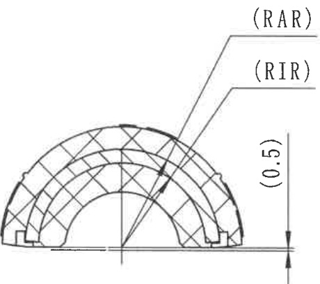
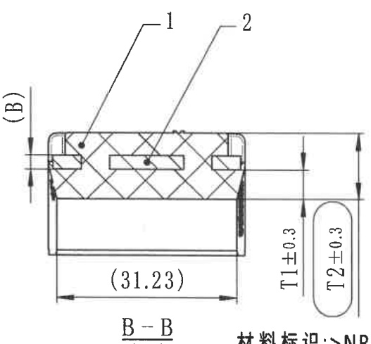
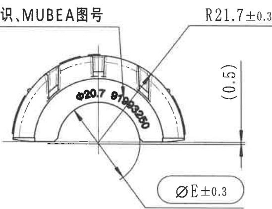

# 20C114308-Y 内容识别

## 视图 1

根据您提供的机械制造图纸局部视图，以下是对图中内容的解读：

### 尺寸、标注提取

| 提取项 | 原图数值或文本 | 含义解读 |
| :--- | :--- | :--- |
| **径向公差/偏差** | `(0.5)` | 括号内的数字通常表示**参考尺寸**（Reference Dimension）或特定方向的公差带。结合箭头指向圆弧层厚度或半径方向，此处极可能表示该拱形结构的径向厚度、半径增量或相关轮廓度的允许偏差为 **0.5**（单位通常为mm）。 |
| **区域/组件标识 (外)** | `(RAR)` | 引线指向拱形结构的最外层（或特定外层网格区域）。这通常是**区域标识符**（Region Identifier），用于在BOM（物料清单）或技术规范中指代特定的材料层、加强筋或组件名称（例如：Reinforcement Arc Outer Ring）。 |
| **区域/组件标识 (内)** | `(RIR)` | 引线指向拱形结构的内层（或特定内层网格区域）。与RAR对应，指代内部的结构层或组件（例如：Reinforcement Arc Inner Ring）。 |
| **几何特征** | 半圆拱形网格 | 视图展示了一个半圆形的拱顶结构，内部包含交叉的网格线（Cross-hatching/Grid），这通常代表**桁架结构**、**加强筋布局**或者某种**复合材料铺层**的示意。底部两侧有矩形块，可能是支座或连接件。 |
| **对称性** | 中心垂直线 | 图形中间有一条细点划线（Centerline），表示该零件是**左右对称**的，绘图时只需表达一半或整体对称结构。 |

**补充说明：**
*   **关于 `(0.5)`**：在机械制图中，尺寸数字加括号 `()` 标准含义是“参考尺寸”，即该尺寸是由其他尺寸推导出来的，仅供参考，不作为加工检验的直接依据。但在某些特定行业（如钣金、焊接或非标设计）的简图中，也可能用来标注非关键性的厚度或间隙公差。
*   **关于 `RAR` / `RIR`**：这不是标准的ISO或GB尺寸标注，而是设计者自定义的缩写。具体的含义需要查阅该图纸配套的“技术说明”或“材料表”。从位置看，它们明确区分了结构的内外层。

## 视图 2

根据您提供的机械制造图纸（截面图 B-B），以下是对图中内容的详细解读：

### 尺寸、标注提取

| 提取项 | 原图数值或文本 | 含义解读 |
| :--- | :--- | :--- |
| **视图名称** | `B-B` | 表示这是主视图或其他视图中 **B-B 剖切线** 对应的剖面图（截面图），用于展示内部结构。 |
| **水平参考尺寸** | `(31.23)` | 零件底部的总宽度（或外轮廓最大宽度）为 31.23。**括号 `()` 表示该尺寸为参考尺寸**，通常由其他尺寸推导而来，不作为加工检验的直接依据。 |
| **垂直高度尺寸 1** | `T1±0.3` | 表示下部主体（或底座部分）的高度/厚度为变量 **T1**，允许的加工误差范围为 **±0.3**。 |
| **垂直高度尺寸 2** | `T2±0.3` | 表示零件的总高度（从底部到顶部）为变量 **T2**，允许的加工误差范围为 **±0.3**。隐含上部组件（如密封条突出部分）的高度为 T2-T1。 |
| **引出标注 1** | `1` | 指向顶部的矩形截面部件（通常代表金属骨架、加强筋或硬质塑料嵌件）。 |
| **引出标注 2** | `2` | 指向包裹在部件 1 周围及下方的主体材料（带有交叉网格线，通常代表橡胶、 elastomer 弹性体或复合材料基体）。 |
| **局部放大/细节标识** | `(B)` | 左侧的 `(B)` 配合箭头，指示了剖切的位置和观察方向，确认此图为 B 向剖视。 |
| **材料说明** | `材料标识: \NR...` (右下角截断) | 提示该零件的材料规格。`\NR` 可能指代 **天然橡胶 (Natural Rubber)** 或某种特定的耐油/耐热橡胶代号，具体需参照图纸标题栏或技术规范。 |
| **几何特征** | 交叉网格线 (Cross-hatching) | 图中填充的菱形/交叉线条是机械制图标准符号，表示该区域为**实体材料的截面**，且与标号 `1` 的实心矩形区分开，表明这是两种不同材质的复合结构（如橡胶包金属骨架）。 |

### 总结设计意图
这是一个典型的**复合密封件或减震垫**的截面图。
*   **结构**：采用“骨架+基体”的设计，标号 `1` 提供刚性支撑，标号 `2` 提供弹性密封或缓冲功能。
*   **精度**：高度方向的关键尺寸 T1 和 T2 均控制在 ±0.3mm 的公差范围内，属于中等精度的模压或挤出制品要求。
*   **安装**：底部宽度 31.23 为参考值，说明安装槽宽可能不是关键配合尺寸，或者主要靠高度 T1/T2 进行压缩限位。

## 视图 3

根据您提供的机械制造图纸（局部视图），以下是对图中尺寸、标注及设计参数的解读：

### 尺寸、标注提取

| 提取项 | 原图数值或文本 | 含义解读 |
| :--- | :--- | :--- |
| **标题/说明文字** | `识、MUBEA图号` | 图纸说明区域，提及“MUBEA”（慕贝尔，知名汽车悬架弹簧制造商）图号，表明该零件可能为汽车悬架相关的板簧或衬套组件。 |
| **外圆弧半径** | `R21.7±0.3` | 零件外轮廓的圆弧半径为 **21.7 mm**，允许公差范围为 **±0.3 mm**。 |
| **内孔直径** | `Φ20.7` | 内部圆形孔洞的直径为 **20.7 mm**（通常默认为H7等配合公差，此处未标具体公差带）。 |
| **零件编号/料号** | `91983250` | 位于圆弧面上的数字串，通常为零件号（Part Number）或模具号，用于生产追溯。 |
| **高度/厚度参考尺寸** | `(0.5)` | 右侧标注的高度尺寸 **0.5 mm**。加括号 `()` 表示这是**参考尺寸**（Reference Dimension），仅供读取，不作为强制检验标准，通常由其他尺寸链推导得出。 |
| **关键特性直径** | `ØE±0.3` | 底部标注的直径尺寸。**`ØE`** 通常代表**有效直径**（Effective Diameter）或节圆直径；**`±0.3`** 为其公差范围。此参数对于装配配合至关重要。 |
| **几何形状** | 半圆环状结构 | 视图展示了一个约180度的半圆环形零件，具有内外圆弧面，且外弧面上有若干矩形凹槽或加强筋结构。 |

## 视图 4

根据提供的机械制造图纸局部视图，以下是对图中内容的解读：

### 尺寸、标注提取

| 提取项 | 原图数值或文本 | 含义解读 |
| :--- | :--- | :--- |
| **竖向高度尺寸** | `21.7±0.3` | 零件右侧标注的竖向总高度（或宽度）为 21.7 mm，允许的加工误差范围为 ±0.3 mm（即 21.4 ~ 22.0 mm）。 |
| **剖切符号/视图索引** | `A` (带箭头) | 表示剖切位置或投影方向。顶部的 `A` 和底部的 `A` 配合箭头，指示了 A-A 剖视图的观察方向（从上往下看或从下往上看，具体取决于图纸布局，通常表示沿中心线剖切）。 |
| **文字说明/注释** | `型号标识` | 指向零件中央的“H”形图案（或凹槽/凸起），说明该处的结构用于展示或刻印产品的型号信息。 |
| **中心线** | 竖直点划线 | 表示零件在水平方向上的对称轴，也是剖切面 A-A 的所在位置。 |
| **内部结构特征** | “H”形轮廓 | 位于零件中心的特征，结合文字说明，这是用于区分产品型号的标识区域（可能是模具成型出的凹槽或凸起）。 |
| **顶部特征** | 两个黑色椭圆 | 位于顶部边缘内侧，通常表示通孔、沉头孔或者是加强筋/ bosses 的俯视投影。 |
| **角落特征** | 四角圆弧/卡扣 | 零件四个角落有圆角处理，且左右上角似乎有卡扣或安装柱的结构示意。 |
