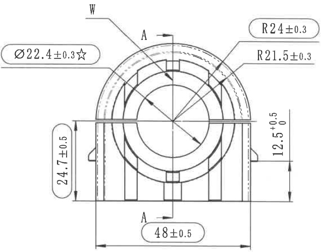
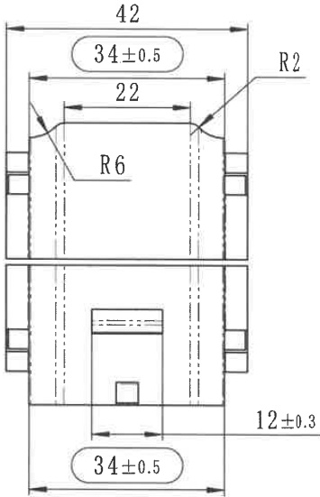

# 20C114398-Y 内容识别

## 视图 1

根据提供的机械制造图纸，以下是对图中视图含义、尺寸、公差及设计参数的详细解读：

### 尺寸、标注提取

| 提取项 | 原图数值或文本 | 含义解读 |
| :--- | :--- | :--- |
| **内孔直径；关键特性** | `Ø22.4±0.3☆` | 零件中心通孔（或内圆柱面）的直径为 **22.4 mm**，允许偏差为 **±0.3 mm**；`☆` 符号通常表示该尺寸为**关键特性 (Key Characteristic)**，需重点控制。 |
| **外轮廓圆弧半径** | `R24±0.3` | 零件顶部最外侧圆弧的半径为 **24 mm**，公差为 **±0.3 mm**。 |
| **内部台阶/槽圆弧半径** | `R21.5±0.3` | 位于外轮廓内侧的圆弧（可能是卡槽或加强筋的边界）半径为 **21.5 mm**，公差为 **±0.3 mm**。 |
| **总宽度尺寸** | `48±0.5` | 零件底部的总宽度（或两垂直侧壁之间的距离）为 **48 mm**，公差为 **±0.5 mm**。 |
| **左侧高度尺寸** | `24.7±0.5` | 左侧垂直方向的高度尺寸（从底边到某一水平基准线，可能是中心线或顶面切线附近）为 **24.7 mm**，公差为 **±0.5 mm**。 |
| **右侧高度尺寸；单向公差** | `12.5 +0.5 / 0` | 右侧垂直方向的高度尺寸（从底边到水平中心线）为 **12.5 mm**；公差为 **+0.5 / 0**（即上限为 13.0，下限为 12.5，不允许负偏差）。这通常暗示中心高或安装高度的重要配合尺寸。 |
| **剖切符号** | `A - A` | 图中标注了上下两个带箭头的 `A`，表示这是一个剖视图的投影方向，或者指示了截面 A-A 的位置（虽然图中未展示对应的剖面图，但表明此处有截面定义）。 |
| **表面/视图标识** | `W` | 左上角的 `W` 指向零件的外表面或特定区域，可能代表某种特定的表面处理要求、视图名称（如 View W）或焊接符号（视具体标准而定，此处更像是指代外壁）。 |
| **几何特征** | (图形本身) | 这是一个半圆顶形的机械零件（类似端盖、轴承座或连接器外壳），内部包含矩形凹槽或加强筋结构，底部有安装脚或延伸结构。 |

## 视图 2

根据提供的机械制造图纸，以下是对图中视图、尺寸及几何参数的详细解读：

### 尺寸、标注提取

| 提取项 | 原图数值或文本 | 含义解读 |
| :--- | :--- | :--- |
| **总宽尺寸** | `42` | 零件主体的最大外部宽度为 42mm（无标注公差，通常遵循未注公差标准）。 |
| **水平定位/宽度尺寸** | `34±0.5` (上下两处) | 上下两个长圆孔（或槽）的水平中心跨度或特征宽度为 34mm，允许偏差 ±0.5mm。这通常表示孔的中心距或关键配合宽度。 |
| **内部台阶宽度** | `22` | 上部视图中，内部虚线所示的台阶或内腔的宽度为 22mm。 |
| **下部凸台/槽宽** | `12±0.3` | 下部视图中间凸起部分（或凹槽）的宽度为 12mm，精度要求较高，公差为 ±0.3mm。 |
| **外角圆角半径** | `R2` | 零件上部两侧肩部的对外圆角半径为 2mm，用于去毛刺或减少应力集中。 |
| **内角圆角半径** | `R6` | 零件上部内侧台阶过渡处的圆角半径为 6mm，属于较大的过渡圆弧，利于模具脱模或流体通过。 |
| **视图结构** | (图形本身) | 图纸包含两个主视图（上下排列）。 **上图**：展示了零件上部的轮廓，实线为外轮廓，虚线表示内部不可见的阶梯孔或空腔结构。 **下图**：展示了零件下部的结构，包含中间的方形凸台/凹槽细节以及底部的长圆孔特征。两侧的小矩形突起可能是侧向的安装耳或卡扣。 |
