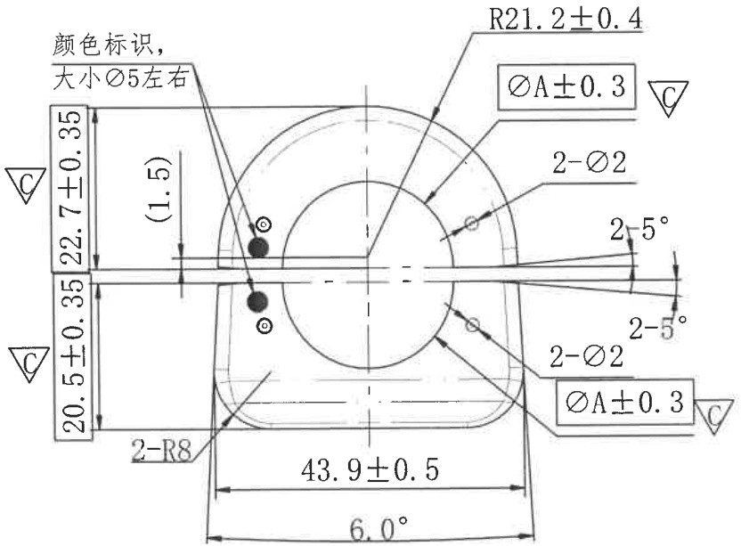

# 20C114582-Y 内容识别

## 视图 1

根据提供的机械制造图纸，以下是对图中尺寸、标注及设计参数的详细解读：

### 尺寸、标注提取

| 提取项 | 原图数值或文本 | 含义解读 |
| :--- | :--- | :--- |
| **顶部圆弧半径** | `R21.2±0.4` | 零件顶部的半圆/圆弧轮廓半径为 21.2mm，允许误差范围为 ±0.4mm。 |
| **关键孔径尺寸** | `ØA±0.3` (上下两处) | 中心大孔的直径代号为 A（具体数值需参照尺寸表），公差为 ±0.3mm；右侧带有倒三角 `C` 符号，表示这是**关键特性/重要尺寸**，需重点管控。 |
| **小孔直径及数量** | `2-Ø2` (上下两处) | 表示有 **2个** 直径为 **2mm** 的小孔（通常指左右对称分布的销孔或定位孔）。 |
| **底部宽度尺寸** | `43.9±0.5` | 零件下部主体（或两切点间）的水平宽度为 43.9mm，公差 ±0.5mm。 |
| **上部垂直高度** | `22.7±0.35` | 从中心水平线到零件顶部的垂直距离为 22.7mm，公差 ±0.35mm。 |
| **下部垂直高度** | `20.5±0.35` | 从中心水平线到零件底部的垂直距离为 20.5mm，公差 ±0.35mm。两侧均有 `C` 标记，属关键尺寸。 |
| **底部圆角半径** | `2-R8` | 零件底部的两个角落（左下角和右下角）为圆角过渡，半径均为 **8mm**。 |
| **角度标注 (锥度)** | `2-5°` (上下两处) | 表示上下两侧的斜边相对于中心水平线的倾斜角度为 **5度**（共两处对称结构）。 |
| **总夹角/锥角** | `6.0°` | 底部两条斜边（或相关特征面）之间的总夹角为 6.0度。 |
| **参考尺寸** | `(1.5)` | 带括号的数字表示**参考尺寸**，仅供参考，不作为加工检验的直接依据（可能是指颜色标识点距离中心的偏移量或相关间距）。 |
| **工艺说明/注释** | `颜色标识，大小Ø5左右` | 这是一个非几何尺寸的工艺要求。要求在图示位置（左侧黑点处）进行颜色标记（如涂漆或打点），标记的大小约为直径 5mm。 |
| **特殊符号** | `▽C` (倒三角内带C) | 出现在尺寸界线旁，通常代表**关键产品特性 (Critical Characteristic)** 或**重要控制点**，意味着该尺寸在制造和质检过程中需要更高的关注度（如全检或CPK管控）。 |
