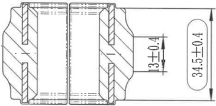
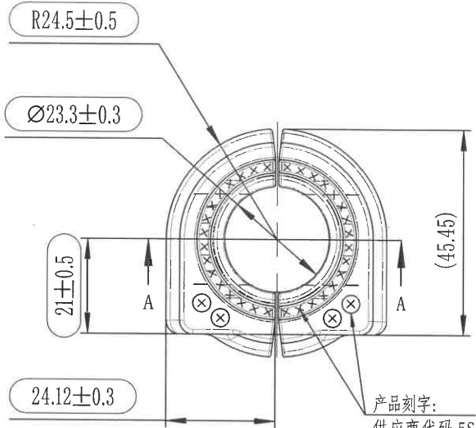
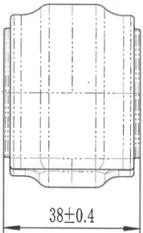

# 20C114603-Y 内容识别

## 视图 1

根据提供的机械制造图纸，以下是对图中视图、尺寸及标注的详细解读：

### 尺寸、标注提取

| 提取项 | 原图数值或文本 | 含义解读 |
| :--- | :--- | :--- |
| **总外径尺寸** | `34.5±0.4` | 零件右侧法兰盘（凸缘）的最大外圆直径为 34.5 mm，允许的尺寸偏差范围为 ±0.4 mm（即 34.1 ~ 34.9 mm）。 |
| **台阶/沉孔深度** | `13±0.4` | 右侧法兰盘端面的厚度（或沉孔/凹槽的深度）为 13 mm，公差为 ±0.4 mm。该尺寸定义了从最右端面到内部台阶面的轴向距离。 |
| **视图类型** | (全剖视图) | 图形采用**全剖视图**表达。假想用一个剖切平面沿零件轴线剖开，移去观察者与剖切面之间的部分。剖面线（斜线阴影）表示实体被切到的部位，空白区域表示孔或空腔。 |
| **对称性** | (左右对称结构) | 从剖视图看，零件呈左右对称结构（类似联轴器或套筒），中间有通孔，两端有用于连接或定位的凸缘结构。 |
| **中心线** | (点划线) | 图形中央的水平点划线表示零件的**回转轴线**，说明该零件是回转体（圆柱形零件）。 |
| **未注圆角/倒角** | (视觉观察) | 虽然图中未直接标注 R 值或 C 值，但在法兰盘外侧边缘可见明显的圆弧过渡，通常为标准圆角（如 R1-R3）或倒角，用于去毛刺和应力集中释放。 |

### 补充说明
*   **单位**：机械制图默认单位为毫米（mm），图中虽未标注单位，但按惯例均为 mm。
*   **公差等级**：图中的公差（±0.4）属于较宽松的一般公差范围，表明该尺寸并非高精度的配合尺寸，主要保证装配时的总体空间要求。

## 视图 2

基于您提供的机械制造图纸，以下是对图中视图、尺寸及标注内容的详细解读：

### 尺寸、标注提取

| 提取项 | 原图数值或文本 | 含义解读 |
| :--- | :--- | :--- |
| **外轮廓圆弧半径** | `R24.5±0.5` | 零件最外侧半圆轮廓的半径为 24.5mm，允许公差范围为 ±0.5mm。 |
| **内孔直径** | `Ø23.3±0.3` | 中心通孔（轴承安装位）的直径为 23.3mm，允许公差范围为 ±0.3mm。 |
| **底部宽度/弦长** | `24.12±0.3` | 零件底部平直边的总宽度（或两个垂直侧面之间的距离）为 24.12mm，公差 ±0.3mm。 |
| **截面高度/厚度** | `21±0.5` | 左侧标注的尺寸，表示从底部平面到内部某个特征（可能是轴承内圈顶部或特定台阶）的高度为 21mm，公差 ±0.5mm。 |
| **总高度（参考尺寸）** | `(45.45)` | 零件的整体最大高度为 45.45mm。**括号 ()** 表示这是一个**参考尺寸**，仅用于辅助理解总体大小，不作为加工或检验的直接依据（通常由其他尺寸链推导得出）。 |
| **剖切符号** | `A` (带箭头) | 表示 **A-A 剖视图** 的剖切位置和投影方向。箭头指向表示从该方向看过去得到的视图（虽然图中未展示A-A剖面图，但这表明该零件有对应的内部结构剖面图）。 |
| **表面纹理/粗糙度** | `√` (带圆圈) | 位于底部两侧小圆孔内的符号，通常表示对该孔表面有特定的粗糙度要求或加工工艺说明（如光洁度要求）。 |
| **文字说明** | `产品刻字：供应商代码 ES...` | 指示在零件特定位置（箭头指向底部右侧区域）需要进行激光刻字或打标，内容包含供应商代码等信息。 |
| **视图特征** | 半圆环状结构 | 这是一个剖分式轴承座或类似夹具的半个主体。中间带有滚珠/滚针排列的圆圈表示内部装有滚动轴承。顶部的开口（缝隙）表明这是剖分式设计，便于安装。 |

### 补充设计参数说明

*   **几何形状**：该零件是一个典型的**剖分式轴承盖**或**轴承座的一半**。它呈现“U”型或半圆柱型结构。
*   **内部组件**：中间的圆形阵列（带有交叉线的小圆圈）代表**滚动体（滚珠或滚针）**，说明该组件内部装配有轴承。
*   **安装孔**：底部左右各有一个小圆孔（标有粗糙度符号），这通常是用于固定螺栓或定位销的安装孔。
*   **公差分析**：
    *   外径 `R24.5` 和内径 `Ø23.3` 的公差相对较松（±0.3~0.5），说明配合精度要求中等。
    *   底宽 `24.12` 保留了两位小数，可能为了保证与另一半拼合时的对齐精度。

## 视图 3

### 尺寸、标注提取

| 提取项 | 原图数值或文本 | 含义解读 |
|---|---|---|
| **水平总宽/外径尺寸** | `38±0.4` | 零件在视图方向上的最大外部宽度（或直径，视具体为轴类还是板类零件而定）为 38；公差为 ±0.4，表示允许的加工误差范围在 37.6 至 38.4 之间。 |
| **中心线（对称轴）** | `— · — · —` (长划-点-长划) | 图中水平和垂直方向的点划线表示该零件具有对称性，这两条线分别是水平和垂直方向的中心基准线。 |
| **隐藏轮廓线** | `- - -` (虚线) | 图中的虚线表示内部不可见的结构边界（如内孔、键槽或内部台阶的投影），说明该零件内部是中空或有特定内部形状的。 |
| **外形轮廓** | 实线外框 | 零件的外部可见轮廓，顶部和底部呈现向内收缩的弧形（或倒角）设计，而非简单的矩形。 |

**补充说明：**
*   **视图类型**：这通常是一个回转体零件（如衬套、轴承座或活塞）的主视图或剖视图示意。
*   **精度等级**：`±0.4` 的公差属于比较宽松的一般公差（粗加工级别），说明该尺寸不是高精度的配合尺寸，可能是为了保证装配时的整体空间限制。
