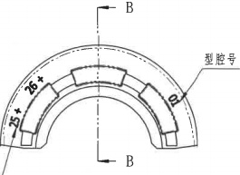
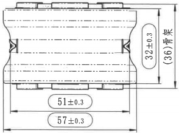
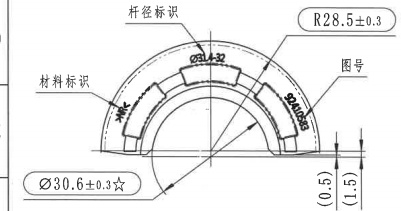
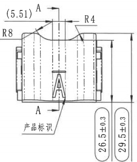
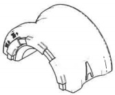
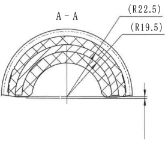
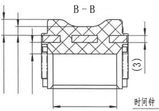

# 20C114649-Y 内容识别

## 视图 1

根据您提供的机械制造图纸局部视图，以下是对图中内容的详细解读：

### 尺寸、标注提取

| 提取项 | 原图数值或文本 | 含义解读 |
| :--- | :--- | :--- |
| **剖切符号** | `B` (带箭头) | 表示 **B-B 剖视图** 的剖切位置及投影方向。箭头指向下方，表示从上方往下看（或向纸面内看）得到的剖面图。虚线为中心对称轴。 |
| **角度/弧度尺寸** | `25+` | 表示左侧某一段圆弧或分块对应的圆心角为 **25度**。`+` 号通常表示该尺寸为**单向正公差**（即只允许偏大，不允许偏小，具体公差值需查阅图纸标题栏或通用技术要求），或者表示这是多个相同角度中的第一个（如 25+, 26+...）。 |
| **角度/弧度尺寸** | `26+` | 表示中间某一段圆弧或分块对应的圆心角为 **26度**。同样带有 `+` 号，表示单向正公差或序列标记。结合图形看，这是将半圆环分成了若干个小块，每块占据一定的角度。 |
| **特征标注** | `型腔号` (带引线) | 指向圆弧上的一个小凹槽或缺口。说明该位置是模具或零件上的**型腔编号标记**位置，用于区分不同的模穴或生产批次。 |
| **几何特征** | 矩形凹槽/凸台 | 图中沿圆周分布的矩形块状结构，结合“型腔号”标注，这些可能是模具镶件的定位槽、冷却水道接口或是产品本身的加强筋/卡扣结构。 |
| **轮廓线型** | 实线与虚线 | **粗实线**表示可见轮廓线（零件的外边缘和内部台阶）；**细点画线**（中心线）表示该零件是回转体或具有对称性；**细虚线**（最外圈）可能表示毛坯轮廓、运动极限位置或未加工表面的边界。 |

### 综合设计说明
*   **零件类型**：这是一个**半圆环形**的机械零件，很可能是注塑模具的**滑块（Slider）**、**镶件（Insert）**或者是某种轴承保持架的一部分。
*   **分块设计**：零件在圆周方向上被分割成了多个小块（由 25°、26° 等角度定义），这种设计通常用于方便加工、装配，或者是为了适应热膨胀/收缩。
*   **对称性**：图形关于中心垂直线（B-B 剖切线）左右对称。

## 视图 2

根据您提供的机械制造图纸视图，以下是对图中尺寸、标注及设计参数的解读：

### 尺寸、标注提取

| 提取项 | 原图数值或文本 | 含义解读 |
| :--- | :--- | :--- |
| **内部宽度/间距尺寸** | `32±0.3` | 零件中间凹槽或内部有效接触面的宽度为 32，公差范围为 ±0.3。这是配合或功能的关键尺寸。 |
| **参考尺寸（骨架）** | `(36)骨架` | 括号内的数值 `36` 表示参考尺寸（非直接加工保证尺寸，由其他尺寸推导或仅供测量参考）；文字“骨架”表明该零件可能属于框架结构件或以此作为基础轮廓。 |
| **主体总宽尺寸** | `51±0.3` | 零件主体部分（不含最外侧凸缘/卡扣）的总宽度为 51，公差范围为 ±0.3。 |
| **最大外廓总宽尺寸** | `57±0.3` | 零件包含两侧凸耳/卡脚在内的最大外部总宽度为 57，公差范围为 ±0.3。这通常是安装空间的限制尺寸。 |
| **几何特征说明** | 虚线与中心线 | 图中水平贯穿的长虚线表示内部不可见轮廓或对称轴；两端的“X”形交叉线通常表示平面度要求或特定加工区域（如滚花、防滑纹或装配基准面）。 |
| **顶部/底部特征** | 矩形凸起 | 上下边缘的矩形块状结构推测为安装卡扣、定位脚或加强筋，用于固定该骨架零件。 |

**总结：**
这是一个具有对称结构的机械骨架类零件（可能是连接器外壳、散热器基座或结构支架）。设计重点在于控制三个关键的水平宽度尺寸（32、51、57），且均给出了 **±0.3mm** 的精度要求，说明该零件对装配间隙或配合位置有较严格的控制需求。

## 视图 3

根据提供的机械制造图纸视图，以下是对图中尺寸、标注及设计参数的详细解读：

### 尺寸、标注提取

| 提取项 | 原图数值或文本 | 含义解读 |
| :--- | :--- | :--- |
| **外圆弧半径** | `R28.5±0.3` | 零件最外侧轮廓的圆弧半径为 28.5 mm，允许加工误差范围为 ±0.3 mm。 |
| **内孔直径（关键特性）** | `Ø30.6±0.3☆` | 底部通孔/内圆的直径为 30.6 mm，公差 ±0.3 mm；`☆` 符号通常表示该尺寸为**关键特性**（Key Characteristic），需重点管控。 |
| **台阶孔/槽直径** | `Ø21±0.32` | 内部上方凹槽或台阶处的直径为 21 mm，公差为 ±0.32 mm。 |
| **角度/弧度标注** | `90.00°±5'` | 指示某一段圆弧或特征跨越的角度为 90 度，精度要求极高，公差仅为 ±5 分（5' ≈ 0.083度）。 |
| **角度标注** | `30°` | 左侧标识的角度为 30 度，可能指代某个倒角、缺口位置或特定特征的夹角。 |
| **高度尺寸 (参考)** | `(0.5)` | 右侧底部的微小高度尺寸为 0.5 mm。**括号 ()** 表示这是**参考尺寸**，仅供读取，不作为最终检验标准（通常由其他尺寸链推导得出）。 |
| **总高/边界尺寸 (参考)** | `(1.5)` | 右侧标识的总高度或边缘厚度为 1.5 mm，同样带有括号，属于**参考尺寸**。 |
| **文字说明** | `杆径标识` | 指向顶部中心线的文字，说明此处用于标记杆件的直径信息或对齐基准。 |
| **文字说明** | `材料标识` | 指向左侧区域的文字，说明该区域用于刻印或标记零件的材料牌号。 |
| **文字说明** | `图号` | 指向右侧区域的文字，说明该位置用于填写或刻印零件的图纸编号。 |

### 综合设计说明
*   **视图类型**：这是一个半圆形的机械零件（可能是轴承盖、端盖或某种连接件）的主视图或剖视示意图。
*   **几何特征**：零件呈拱形，内部包含不同直径的台阶（Ø21 和 Ø30.6），外缘有特定的半径（R28.5）。
*   **精度要求**：图中的角度公差 `±5'` 非常严格，表明该零件在圆周方向上的定位或配合精度要求很高。
*   **管理信息**：图纸预留了“材料标识”、“图号”和“杆径标识”的位置，体现了标准化的生产管理需求。

## 视图 4

根据提供的机械制造图纸视图，以下是对图中内容的详细解读：

### 尺寸、标注提取

| 提取项 | 原图数值或文本 | 含义解读 |
| :--- | :--- | :--- |
| **顶部水平定位尺寸** | `(5.51)` | 括号内的尺寸通常表示**参考尺寸**（Reference Dimension）。指从中心线到左侧圆弧起点的水平距离为 5.51，仅供参考，不作为直接检验依据（由其他尺寸推导得出）。 |
| **剖切符号** | `A` (带箭头) | 表示**剖视图的剖切位置**。箭头指示投影方向，表明该视图是沿 A-A 线剖切后得到的剖面图（或相关视图）。 |
| **左侧圆弧半径** | `R8` | 零件左上角外轮廓的圆角半径为 **8 mm**。 |
| **右侧圆弧半径** | `R4` | 零件右上角外轮廓（凹槽处）的圆角半径为 **4 mm**。 |
| **内部高度尺寸** | `26.5±0.3` | 零件内部特征（可能是内腔或台阶）的高度/宽度尺寸为 **26.5 mm**，公差范围为 ±0.3 mm（即 26.2 ~ 26.8 mm）。 |
| **外部总高度尺寸** | `29.5±0.3` | 零件整体的外部总高度/宽度尺寸为 **29.5 mm**，公差范围为 ±0.3 mm（即 29.2 ~ 29.8 mm）。 |
| **文字说明** | `产品标识` | 指向零件底部的文字区域，说明该位置用于刻印或标记产品的型号、批次等识别信息。 |
| **虚线结构** | (无具体数值) | 图中的竖直虚线表示内部不可见的轮廓线（如内部孔洞或加强筋的边界）；中间的三角形虚线框可能表示内部的加强筋结构或特定嵌件。 |

### 补充说明
*   **视图类型**：这是一个带有剖切指示的主视图（或侧视图），展示了零件的外部轮廓（圆角 R8, R4）和内部结构（通过虚线和尺寸 26.5 体现）。
*   **对称性**：从图形看，零件左右基本对称，尺寸标注以中心线为基准。
*   **单位**：机械制图默认单位通常为毫米（mm）。

## 视图 5

基于您提供的图片，这是一张**机械零件的三维轴测图（Isometric View）或透视草图**，而非带有完整尺寸标注的二维工程制图（2D Engineering Drawing）。

图中**没有任何数字尺寸、公差标注、角度数值或粗糙度符号**。它主要展示的是零件的**几何形态、结构特征和装配关系**。

以下是对该视图内容的详细解读：

### 视图含义与结构特征解读

| 提取项 | 原图视觉特征/文本 | 含义解读 |
| :--- | :--- | :--- |
| **视图类型** | 无尺寸线的立体线条图 | 这是一个**轴测图（3D Sketch）**，用于直观展示零件的空间结构和形状，通常作为装配示意图或设计初期的概念图，**不具备直接加工所需的尺寸信息**。 |
| **主体轮廓** | 顶部巨大的圆弧面 | 零件主体呈**拱形或罩壳状**（类似挡泥板、防护罩或轴承盖），顶部具有较大的外圆弧半径，用于覆盖或保护内部组件。 |
| **左侧安装接口** | 圆柱形凸台 + 卡箍结构 | 左侧有一个垂直向下的圆柱形接口（可能是管道连接口或轴孔）。上面画有类似**喉箍（Hose Clamp）或快速夹具**的结构，表明此处是通过抱紧方式连接软管或轴类零件的。 |
| **加强筋/支撑柱** | 连接主体与底部的竖直肋板 | 在拱形壳体下方，有两条明显的竖直条状结构。这是**加强筋（Ribs）**或**支撑腿**，用于增加壳体的刚性，防止变形，或者作为安装时的定位支撑点。 |
| **底部安装脚** | 右下角的倒“V”型开口 | 右下角有一个三角形的切口或开口结构。这通常是**安装槽**或**减重孔**，也可能用于配合螺栓进行固定，或者是为了避开其他部件的设计。 |
| **表面细节** | 左侧圆柱面上的模糊字迹 | 左侧圆柱面上似乎有手写的文字或标记（看起来像“XX号”或规格标记），但在当前分辨率下无法辨认具体数值。这通常代表零件的**版本号、材料牌号或批次号**。 |
| **线条风格** | 手绘/草图风格线条 | 线条不完全平直，带有手绘感。说明这可能是一个**设计草案**或**现场测绘草图**，而非最终的CAD生产图纸。 |

### 总结说明
*   **缺失参数**：由于图中没有标注，无法得知具体的长宽高、圆弧半径（R值）、孔径大小或角度。
*   **设计意图推测**：该零件很可能是一个**流体系统的防护罩**、**发动机周边的隔热罩**或者某种**管路连接件的固定支架**。左侧负责连接管路，主体负责防护，底部负责支撑固定。

## 视图 6

基于您提供的机械制造图纸截图，以下是对图中视图含义、尺寸及设计参数的解读：

### 尺寸、标注提取

| 提取项 | 原图数值或文本 | 含义解读 |
| :--- | :--- | :--- |
| **视图名称/剖切标识** | `A - A` | 表示该图为 **A-A 剖视图**。通常用于展示零件内部结构或特定截面的形状。此处展示了一个半圆形的拱状结构截面。 |
| **外轮廓圆弧半径** | `(R22.5)` | 表示该半圆结构的**最外侧圆弧半径**为 22.5 mm。 注：括号 `()` 在机械制图中通常表示**参考尺寸**（Reference Dimension），即该尺寸仅供读取参考，不作为加工检验的直接依据（通常由其他尺寸链推导得出）。 |
| **内轮廓圆弧半径** | `(R19.5)` | 表示该半圆结构的**内侧圆弧半径**为 19.5 mm。 注：同样带有括号，表示为参考尺寸。结合外半径可知，该拱形壁的厚度约为 3 mm (22.5 - 19.5)。 |
| **几何形状特征** | 半圆拱形 + 网格填充 | 1. **形状**：整体呈半圆形（180度拱）。 2. **填充图案**：内部的交叉网格线（剖面线）通常表示该区域为实体材料被剖切，或者表示这是一种复合材料/加强筋结构（如玻璃钢、碳纤维或橡胶加强层）。 |
| **底部基准线** | 水平实线 | 表示该零件的底面或安装基准面，中心有一条垂直的点划线（中心线），表明该零件关于中心轴左右对称。 |

### 补充设计参数分析

*   **跨度（直径）**：虽然未直接标注，但根据半径 R22.5 推算，该半圆结构的外径跨度约为 **45 mm**。
*   **壁厚**：外半径 R22.5 与内半径 R19.5 之差显示，该拱形壳体的理论壁厚为 **3 mm**。
*   **对称性**：图形以中心垂直线为轴完全对称，加工时需注意保证同轴度或对称度。

## 视图 7

基于您提供的机械制造图纸局部（B-B 剖视图），以下是对图中可见内容的解读：

### 尺寸、标注提取

| 提取项 | 原图数值或文本 | 含义解读 |
| :--- | :--- | :--- |
| **视图名称** | `B - B` | 表示该图为 **B-B 剖视图**。这是为了展示零件内部结构（如空腔、壁厚、装配关系）而假想沿 B-B 线切开后得到的投影。 |
| **剖面符号** | `交叉网格线 (剖面线)` | 顶部带有交叉网格线的区域表示 **被切开的实体材料**（通常表示塑料、橡胶或非金属材料，或者特定组件的填充物）。空白区域表示 **空腔** 或未被切到的空间。 |
| **参考尺寸** | `(3)` | 右侧标注的尺寸 `3` 带有括号，表示这是一个 **参考尺寸 (Reference Dimension)**。它仅供参考，不用于直接加工检验，通常由其他尺寸推导而来或用于辅助理解结构厚度/间隙。 |
| **方向指示** | `时间钟` | 右下角的文字说明。在模具设计或钟表零件制造中，这通常指代 **模具的时钟方位**（如12点、3点方向）或零件的 **安装/旋转方向基准**。 |
| **水平总宽** | `底部双向箭头` | 指示了零件底部的 **总宽度** 或两个外侧壁之间的跨度尺寸（具体数值未在截图中显示，但箭头定义了测量范围）。 |
| **垂直高度链** | `左侧多组双向箭头` | 左侧的一系列箭头定义了零件的 **垂直方向尺寸链**，包括总高度、各层结构的厚度以及内部空腔的高度位置。 |
| **内部结构** | `矩形凹槽/卡扣` | 剖面中显示的矩形突起和凹陷结构，通常代表 **卡扣、定位槽或加强筋**，用于与其他零件进行装配或固定。 |

**补充说明：**
*   由于图片裁剪原因，具体的数字数值（除了参考尺寸3）大多不可见，上述表格主要针对可见的符号、文字和几何特征进行了解读。
*   图中的“时间钟”暗示该零件可能与计时器、手表外壳或具有特定旋转角度要求的机械装置有关。
